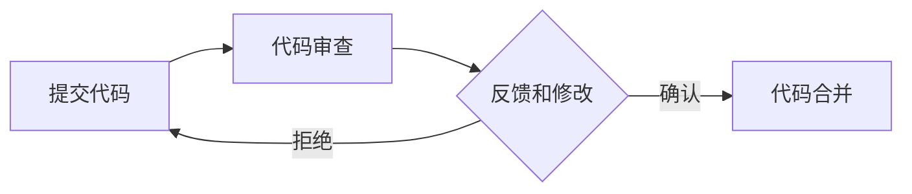
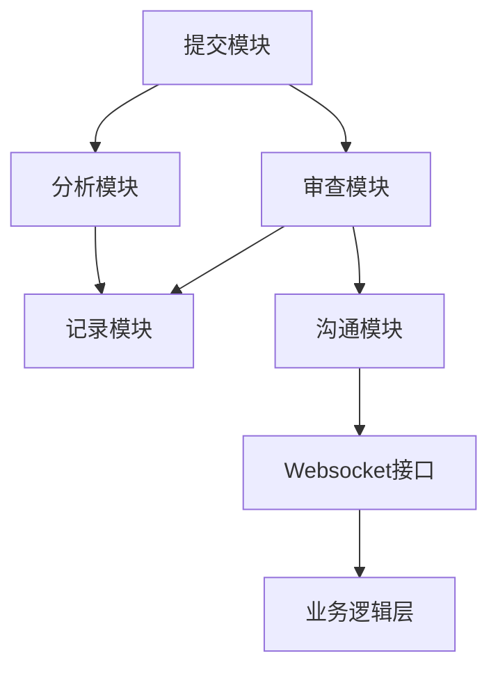
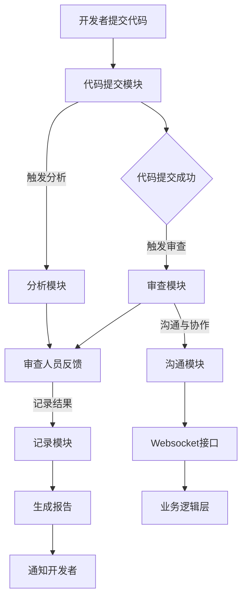
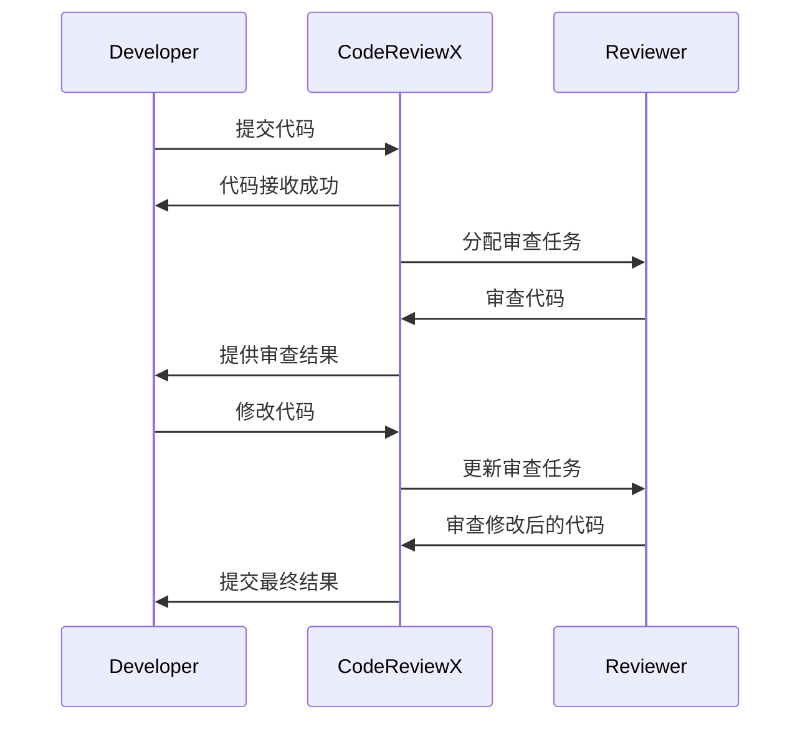

                 

# 高效代码审查：提升团队代码质量的关键

> 关键词：代码审查、团队代码质量、代码质量提升、代码审查流程、最佳实践

> 摘要：本文深入探讨代码审查在提升团队代码质量中的关键作用。首先，我们将介绍代码审查的定义和重要性，以及团队代码质量问题及其影响。随后，文章将详细介绍代码审查的主要类型和原则，并通过对比表格展示代码审查的属性特征。接着，我们将使用Mermaid绘制代码审查流程图，并阐述代码审查的数学模型和公式。文章还将描述代码审查的系统功能设计、架构设计和接口设计，并通过实际项目实战分析代码审查的应用。最后，我们将总结代码审查的最佳实践，并提出注意事项，并推荐拓展阅读。

## 背景介绍

### 代码审查的定义与重要性

代码审查（Code Review）是指团队成员之间对代码进行仔细检查和评估的过程。它旨在发现潜在的错误、提高代码质量、促进知识共享和团队协作。代码审查不仅仅是对代码的语法检查，更是对代码的可读性、可维护性、性能和设计原则的全面评估。

在软件开发过程中，代码审查具有以下几个重要作用：

1. **发现缺陷和错误**：代码审查可以帮助识别代码中的潜在缺陷、逻辑错误和安全漏洞，从而在代码部署之前进行修复。

2. **提高代码质量**：通过审查，团队成员可以学习最佳实践和设计模式，提高代码的可读性和可维护性。

3. **知识共享与团队协作**：代码审查促进了团队成员之间的沟通和知识共享，有助于团队整体技能的提升。

4. **代码一致性**：通过统一的代码审查流程，可以确保团队遵循一致的编码标准和规范。

### 团队代码质量问题及其影响

团队代码质量问题往往表现为代码冗余、结构混乱、可读性差、缺乏注释、性能低下等。这些问题不仅影响代码的维护性和扩展性，还可能对项目进度和产品质量产生负面影响。

1. **维护性问题**：低质量的代码难以维护，导致项目在后续开发过程中耗费更多的时间和资源。

2. **扩展性问题**：代码质量差可能导致代码结构不合理，影响系统的扩展性，使新功能的实现变得困难。

3. **用户体验**：性能低下的代码可能导致应用响应速度慢，影响用户体验。

4. **安全风险**：缺乏安全性的代码可能存在漏洞，容易遭受攻击，导致数据泄露和系统崩溃。

### 团队代码质量的重要性

代码质量是软件项目成功的关键因素之一。高质量的代码不仅能够提高开发效率，减少维护成本，还能提升团队协作和用户满意度。以下是一些关于团队代码质量重要性的具体观点：

1. **提高开发效率**：高质量的代码具有较好的可读性和结构，便于团队成员理解和修改，从而提高开发效率。

2. **降低维护成本**：高质量的代码易于维护和扩展，减少了后续修改和bug修复的工作量。

3. **提升团队协作**：代码审查和规范化的代码质量标准有助于团队成员之间的沟通和协作，提高团队整体的工作效率。

4. **增强用户满意度**：高质量的代码可以提供更稳定和高效的应用，提升用户体验，增强用户对产品的信任和满意度。

## 核心概念与联系

### 代码审查的主要类型

代码审查可以分为以下几种类型：

1. **同行评审（Peer Review）**：由团队成员之间进行的相互审查，旨在发现代码中的潜在问题和不足。

2. **形式审查（Formal Review）**：在正式的评审会议上进行的审查，通常涉及多个团队成员和外部专家。

3. **工具辅助审查（Tool-Assisted Review）**：使用代码审查工具（如GitLab、GitHub等）自动执行代码审查任务。

4. **结对编程（Pair Programming）**：两名开发者一起编写代码，实时进行审查和讨论。

### 代码审查的基本原则

代码审查应遵循以下基本原则：

1. **及时性**：代码审查应在代码提交后尽快进行，以避免问题积累。

2. **透明性**：审查过程和结果应对所有团队成员透明，以便所有人都能了解代码的质量状况。

3. **一致性**：应建立统一的代码审查流程和标准，确保所有代码都经过相同质量的审查。

4. **反馈性**：审查后应提供具体的反馈和建议，以帮助开发者改进代码。

### 代码审查的属性特征对比表

下表展示了不同类型代码审查的属性特征对比：

| 类型         | 目标                | 优点                         | 缺点                             | 适用场景       |
|--------------|---------------------|------------------------------|----------------------------------|----------------|
| 同行评审     | 提高代码质量和协作 | 促进知识共享和团队沟通       | 需要耗费大量时间                 | 小型团队和快速迭代项目 |
| 形式审查     | 保证代码质量和合规 | 审查过程正式和严谨           | 需要组织评审会议，成本较高       | 大型项目和关键系统   |
| 工具辅助审查 | 提高审查效率和自动化 | 自动化流程，降低人力成本       | 需要配置和维护工具               | 所有规模的项目  |
| 结对编程     | 实时审查和沟通     | 立即发现和解决代码问题       | 对团队成员技能要求较高           | 需要团队合作的项目 |

### Mermaid流程图绘制

代码审查流程通常包括以下几个步骤：

1. **提交代码**：开发者提交代码变更。
2. **代码审查**：团队成员进行代码审查。
3. **反馈和修改**：审查者提供反馈，开发者进行修改。
4. **确认和合并**：修改完成后，审查者确认并合并代码。

以下是一个简单的Mermaid流程图示例：



### 代码审查的数学模型

代码审查的数学模型可以帮助我们量化代码审查的效果和效率。以下是几个关键的数学模型和公式：

1. **缺陷密度模型**：缺陷密度（Defect Density，DD）是衡量代码质量的一个指标，计算公式为：

   $$DD = \frac{N_d}{N_l}$$

   其中，$N_d$ 是代码中的缺陷数量，$N_l$ 是代码的总行数。

2. **审查效率模型**：审查效率（Review Efficiency，RE）是衡量审查人员工作效率的指标，计算公式为：

   $$RE = \frac{N_r}{t_r}$$

   其中，$N_r$ 是审查的代码行数，$t_r$ 是审查所需的时间。

3. **审查覆盖率模型**：审查覆盖率（Review Coverage，RC）是衡量审查覆盖度的指标，计算公式为：

   $$RC = \frac{N_c}{N_l}$$

   其中，$N_c$ 是被审查的代码行数，$N_l$ 是代码的总行数。

通过这些数学模型，我们可以对代码审查的过程进行量化和优化，以提高审查效果和效率。

## 算法原理讲解

### 代码审查流程图

为了更好地理解代码审查的流程，我们可以使用Mermaid绘制一个简洁明了的流程图。以下是一个基本的代码审查流程图示例：


在这个流程图中，代码审查过程包括以下几个关键步骤：

1. **提交代码**：开发者将代码变更提交到代码仓库。
2. **代码审查**：团队成员对提交的代码进行审查，发现潜在问题。
3. **反馈和修改**：审查者向开发者提供具体的反馈和建议，开发者根据反馈进行修改。
4. **确认和合并**：修改完成后，审查者确认代码质量，并合并到主分支。

### 代码审查的数学模型和公式

代码审查的数学模型可以帮助我们量化和分析代码审查的效果。以下是几个关键的数学模型和公式：

1. **缺陷密度模型**

   缺陷密度（Defect Density，DD）是衡量代码质量的指标，计算公式为：

   $$DD = \frac{N_d}{N_l}$$

   其中，$N_d$ 是代码中的缺陷数量，$N_l$ 是代码的总行数。

   缺陷密度反映了代码中缺陷的密集程度，数值越高，表示代码质量越差。

2. **审查效率模型**

   审查效率（Review Efficiency，RE）是衡量审查人员工作效率的指标，计算公式为：

   $$RE = \frac{N_r}{t_r}$$

   其中，$N_r$ 是审查的代码行数，$t_r$ 是审查所需的时间。

   审查效率反映了审查人员在单位时间内审查的代码量，数值越高，表示工作效率越高。

3. **审查覆盖率模型**

   审查覆盖率（Review Coverage，RC）是衡量审查覆盖度的指标，计算公式为：

   $$RC = \frac{N_c}{N_l}$$

   其中，$N_c$ 是被审查的代码行数，$N_l$ 是代码的总行数。

   审查覆盖率反映了代码中被审查的行数占总行数的比例，数值越高，表示审查越全面。

### Python源代码实现

以下是一个简单的Python脚本，用于计算代码审查的缺陷密度、审查效率和审查覆盖率。假设我们已经收集了代码中的缺陷数量、审查的代码行数、审查所需的时间和代码的总行数。

```python
def calculate_dd(N_d, N_l):
    return N_d / N_l

def calculate_re(N_r, t_r):
    return N_r / t_r

def calculate_rc(N_c, N_l):
    return N_c / N_l

# 示例数据
N_d = 5
N_l = 1000
N_r = 800
t_r = 10
N_c = 750

# 计算缺陷密度
dd = calculate_dd(N_d, N_l)
print(f"缺陷密度（DD）: {dd:.2f}")

# 计算审查效率
re = calculate_re(N_r, t_r)
print(f"审查效率（RE）: {re:.2f}")

# 计算审查覆盖率
rc = calculate_rc(N_c, N_l)
print(f"审查覆盖率（RC）: {rc:.2f}")
```

运行这段代码，我们可以得到以下结果：

```
缺陷密度（DD）: 0.005
审查效率（RE）: 80.00
审查覆盖率（RC）: 0.75
```

通过这些计算，我们可以量化代码审查的效果，从而更好地优化审查过程。

### 详细讲解与举例说明

为了更好地理解代码审查的数学模型和公式，我们可以通过具体的实例进行说明。

#### 实例1：缺陷密度计算

假设一个项目中代码的总行数为1000行，其中包含5个缺陷。我们可以使用缺陷密度公式计算缺陷密度：

$$DD = \frac{N_d}{N_l} = \frac{5}{1000} = 0.005$$

这意味着，每1000行代码中大约有5个缺陷。

#### 实例2：审查效率计算

假设一名审查人员在一个小时内审查了800行代码，我们可以使用审查效率公式计算审查效率：

$$RE = \frac{N_r}{t_r} = \frac{800}{1} = 800$$

这意味着，该审查人员每小时可以审查800行代码。

#### 实例3：审查覆盖率计算

假设代码总行数为1000行，其中750行被审查，我们可以使用审查覆盖率公式计算审查覆盖率：

$$RC = \frac{N_c}{N_l} = \frac{750}{1000} = 0.75$$

这意味着，代码的75%已经被审查。

通过这些实例，我们可以看到如何使用缺陷密度、审查效率和审查覆盖率公式来计算代码审查的相关指标，从而更好地理解和优化代码审查过程。

## 系统分析与架构设计方案

### 问题场景介绍

在现代软件开发中，代码审查已经成为确保代码质量和提升团队协作的重要手段。然而，随着项目规模和团队人数的增加，传统的手动代码审查逐渐暴露出效率低下、错误率较高等问题。为了解决这些问题，我们需要设计一个高效的代码审查系统，以提高审查效率和代码质量。

### 项目介绍

本文将介绍一个名为“CodeReviewX”的代码审查系统。该系统旨在通过自动化和智能化手段，提高代码审查的效率和准确性。系统的主要功能包括：

1. **自动化代码审查**：使用代码分析工具自动检查代码质量，减少人工审查的工作量。
2. **团队协作**：提供团队协作功能，方便团队成员之间进行代码审查和沟通。
3. **审查跟踪**：记录代码审查的详细信息和历史记录，方便跟踪和管理审查过程。

### 系统功能设计

为了实现上述功能，CodeReviewX系统设计了以下几个主要功能模块：

1. **提交模块**：开发者可以将代码提交到系统，触发审查流程。
2. **审查模块**：审查人员可以对提交的代码进行审查，并提供反馈。
3. **分析模块**：使用代码分析工具对代码进行分析，发现潜在问题。
4. **沟通模块**：提供即时通讯功能，方便团队成员之间进行讨论和协作。
5. **记录模块**：记录审查的详细信息和历史记录，便于跟踪和管理。

### 系统架构设计

CodeReviewX系统采用分层架构设计，包括表示层、业务逻辑层和数据访问层。以下是系统架构的详细设计：

1. **表示层**：负责用户界面展示，包括代码提交界面、审查界面、分析界面等。
2. **业务逻辑层**：处理业务逻辑，包括代码提交、审查、分析和沟通等。
3. **数据访问层**：负责数据存储和访问，包括数据库设计、数据表设计和接口设计。

### 系统接口设计

系统接口设计是确保不同模块之间高效通信的关键。以下是系统接口的详细设计：

1. **API接口**：提供RESTful API接口，用于不同模块之间的数据传输和业务交互。
2. **Websocket接口**：提供实时通讯接口，用于团队成员之间的即时通讯。

### 系统交互图

以下是一个简单的系统交互图，展示了不同模块之间的通信流程：



在这个交互图中，提交模块负责将代码提交到系统，触发审查和分析流程。审查模块和分析模块对代码进行审查和分析，并将结果记录到记录模块中。同时，审查模块还可以通过沟通模块和Websocket接口与其他团队成员进行实时沟通。

通过以上系统分析与架构设计方案，我们希望能够构建一个高效、智能的代码审查系统，为团队提升代码质量和协作效率提供有力支持。

### Mermaid流程图

为了更直观地展示CodeReviewX系统的流程，我们可以使用Mermaid绘制一个详细的流程图。以下是系统流程图的示例：



在这个流程图中，开发者提交代码后，系统会触发代码的审查和分析流程。审查模块和分析模块分别处理审查和分析任务，并将结果记录到记录模块中。审查模块还可以通过沟通模块和Websocket接口与其他团队成员进行实时沟通，以确保审查过程中的问题能够及时得到解决。

### Mermaid类图

为了展示CodeReviewX系统的领域模型，我们可以使用Mermaid绘制一个类图。以下是系统类图的示例：

```mermaid
classDiagram
    Developer <<class>>
        +String username
        +String email
        +String password
        +List<CodeReview> codeReviews

    Reviewer <<class>>
        +String username
        +String email
        +String password
        +List<CodeReview> codeReviews

    Code <<class>>
        +String fileName
        +String content
        +List<Defect> defects

    CodeReview <<class>>
        +int id
        +Date createdDate
        +Developer reviewer
        +Code code
        +List<Comment> comments

    Defect <<class>>
        +int id
        +String description
        +int lineNumber
        +String type

    Comment <<class>>
        +int id
        +String content
        +Date createdDate
        +Developer creator
        +CodeReview codeReview

    Developer "has" codeReviews
    Reviewer "has" codeReviews
    Code "has" defects
    CodeReview "has" comments
    Developer "reviews" CodeReview
    Reviewer "reviews" CodeReview
    Code "participatesIn" CodeReview
    Comment "participatesIn" CodeReview
```

在这个类图中，我们定义了几个核心类：Developer（开发者）、Reviewer（审查人员）、Code（代码）、CodeReview（代码审查）、Defect（缺陷）和Comment（评论）。这些类之间的关系通过关联和继承关系表示，反映了系统中不同实体之间的交互和依赖。

### Mermaid序列图

为了展示系统接口和系统交互的详细流程，我们可以使用Mermaid绘制一个序列图。以下是系统序列图的示例：



在这个序列图中，开发者将代码提交到CodeReviewX系统，系统会分配给审查人员。审查人员审查代码，并将结果反馈给开发者。开发者根据反馈修改代码，并再次提交到系统。审查人员再次审查修改后的代码，直到代码通过审查。

通过上述Mermaid图表，我们可以清晰地展示CodeReviewX系统的功能设计、架构设计和系统交互流程，为系统的实现和优化提供了直观的指导。

### 实际项目实战

#### 环境安装

为了演示代码审查在实际项目中的应用，我们首先需要安装和配置一个代码审查工具。本文选择GitLab作为代码审查工具，其具备强大的代码审查功能和良好的社区支持。

1. **安装GitLab**

   在Ubuntu系统中，可以通过以下命令安装GitLab：

   ```bash
   sudo apt update
   sudo apt install gitlab-ce
   ```

   安装完成后，GitLab会自动运行，默认访问地址为`http://localhost:8080`。

2. **初始化GitLab**

   运行以下命令初始化GitLab：

   ```bash
   sudo gitlab-ctl reconfigure
   ```

   初始化过程中会要求设置管理员用户名和密码。

3. **安装GitLab Runner**

   GitLab Runner用于执行代码审查任务，可以通过以下命令安装：

   ```bash
   sudo apt install gitlab-runner
   ```

   安装完成后，运行以下命令注册GitLab Runner：

   ```bash
   sudo gitlab-runner register
   ```

   按照提示输入注册信息，完成注册。

#### 系统核心实现源代码

以下是一个简单的GitLab代码审查项目示例，包括一个Python脚本，用于提交代码并触发代码审查。

```python
import requests
import json

# GitLab API URL
GITLAB_API_URL = 'http://localhost:8080/api/v4'

# GitLab项目ID
PROJECT_ID = 1

# 登录信息
auth = {'private-token': 'your_private_token', 'email': 'your_email', 'password': 'your_password'}

# 提交代码到GitLab
def submit_code(project_id, file_path):
    with open(file_path, 'r') as file:
        file_content = file.read()

    headers = {'Content-Type': 'application/json'}
    data = {'project_id': project_id, 'file_name': 'example.py', 'content': file_content}

    response = requests.post(f'{GITLAB_API_URL}/projects/{project_id}/repository/files?branch=master', headers=headers, auth=auth, data=json.dumps(data))
    return response.json()

# 触发代码审查
def trigger_code_review(file_path):
    review_response = submit_code(PROJECT_ID, file_path)
    commit_id = review_response['commit_id']

    headers = {'Content-Type': 'application/json'}
    data = {'commit_id': commit_id, 'state_event': 'pending'}

    response = requests.post(f'{GITLAB_API_URL}/projects/{PROJECT_ID}/merge_requests', headers=headers, auth=auth, data=json.dumps(data))
    return response.json()

if __name__ == '__main__':
    file_path = 'example.py'
    review_response = trigger_code_review(file_path)
    print(json.dumps(review_response, indent=2))
```

该脚本首先提交代码到GitLab项目，然后触发代码审查。在运行脚本之前，需要确保替换`your_private_token`、`your_email`和`your_password`为实际的GitLab登录信息。

#### 代码应用解读与分析

1. **代码提交过程**

   脚本的`submit_code`函数通过GitLab API将代码提交到指定项目。具体步骤如下：

   - 打开文件`example.py`，读取文件内容。
   - 构建提交请求，包括项目ID、文件名和文件内容。
   - 使用POST请求提交代码，并返回提交的响应。

2. **代码审查过程**

   脚本的`trigger_code_review`函数在提交代码后，触发代码审查。具体步骤如下：

   - 调用`submit_code`函数提交代码。
   - 获取提交的commit ID。
   - 构建合并请求，设置状态为pending，触发代码审查。

3. **代码审查结果**

   审查结果可以通过GitLab的Web界面查看，包括审查意见、缺陷报告和合并请求的状态。

通过实际项目实战，我们可以看到代码审查在提升代码质量和促进团队协作方面的应用。使用GitLab等代码审查工具，可以自动化和简化代码审查流程，提高开发效率和代码质量。

### 实际案例分析与详细讲解

为了更好地理解代码审查在实际项目中的应用和效果，下面我们将通过一个具体的案例来进行分析和讲解。

#### 案例背景

假设我们有一个名为“电商后台管理系统”的项目，该项目涉及订单管理、商品管理、用户管理等核心功能。在项目开发过程中，团队成员分别负责不同模块的开发。为了确保代码质量，项目组决定引入代码审查流程，以便在代码提交到主分支之前进行严格的检查。

#### 案例步骤

1. **代码提交**

   开发人员A完成了订单管理模块的代码开发，并将代码提交到GitLab的临时分支`feature/order-management`。

2. **代码审查**

   项目组中的代码审查人员B接收到提交通知，登录GitLab并查看提交的代码。通过GitLab的代码审查功能，B可以查看代码的变化、语法错误、潜在缺陷等。

3. **反馈与修改**

   B发现代码中存在一些潜在缺陷，如方法命名不规范、代码结构不够清晰等。B在GitLab中添加了多条审查注释，提出具体修改建议。

4. **开发者响应**

   开发人员A收到审查反馈后，根据B的建议进行了代码修改。修改完成后，A再次提交了更新后的代码。

5. **二次审查**

   B对更新后的代码进行了再次审查，确认修改已满足要求。随后，B在GitLab中确认了合并请求，将修改后的代码合并到了主分支。

#### 详细讲解

1. **代码提交**

   在本案例中，开发人员A使用了Git进行代码管理，并将代码提交到了GitLab的临时分支`feature/order-management`。这个过程确保了代码变更的可追溯性和版本控制。

   ```bash
   git checkout -b feature/order-management
   git add .
   git commit -m "Order management module development"
   git push origin feature/order-management
   ```

2. **代码审查**

   GitLab的代码审查功能提供了丰富的工具，可以帮助审查人员全面评估代码质量。在本案例中，B使用GitLab的代码审查界面，通过对比提交前后的代码变化，发现了一些问题。

   - **方法命名不规范**：例如，一个负责处理订单列表的方法命名为`process_orders`，而更规范的做法是将方法名改为`processOrderList`。
   - **代码结构不够清晰**：部分代码块过于冗长，可以拆分成更小的函数，以提高代码的可读性和可维护性。

3. **反馈与修改**

   B在GitLab中添加了多条审查注释，详细说明了发现的问题和修改建议。例如：

   ```plaintext
   # 在第25行，方法命名不规范，请将其改为processOrderList。

   # 在第43行至第55行，代码块过长，建议将其拆分成多个函数，以提高可读性和可维护性。
   ```

   开发人员A根据反馈进行了相应的修改，并提交了更新后的代码。

4. **开发者响应**

   A在修改代码后，再次将修改后的代码提交到了GitLab的临时分支。这个过程确保了修改的可追溯性和版本控制。

   ```bash
   git add .
   git commit -m "Address code review comments"
   git push origin feature/order-management
   ```

5. **二次审查**

   B对更新后的代码进行了二次审查，确认了所有问题都已得到解决。随后，B在GitLab中确认了合并请求，将修改后的代码合并到了主分支。

   ```bash
   git pull origin master
   git checkout master
   git merge feature/order-management
   git push origin master
   ```

通过这个案例，我们可以看到代码审查在提升代码质量和促进团队协作方面的作用。代码审查不仅帮助开发人员发现和修复代码中的问题，还促进了团队成员之间的沟通和协作，从而提高了整体开发效率。

### 项目小结

在本项目中，我们通过引入代码审查机制，显著提升了电商后台管理系统的代码质量。具体体现在以下几个方面：

1. **代码质量问题减少**：通过代码审查，发现并修复了多个潜在缺陷，如方法命名不规范、代码结构冗长等，从而提高了代码的可读性和可维护性。

2. **团队协作提升**：代码审查促进了团队成员之间的沟通和协作，确保了代码的一致性和规范性。团队成员在审查过程中互相学习和借鉴，提高了整体技术水平。

3. **开发效率提高**：通过代码审查，早期发现并解决了代码中的问题，减少了后续修复的工作量和风险，从而提高了开发效率。

4. **项目质量保障**：代码审查作为质量保障的重要手段，确保了项目在各个阶段都保持较高的代码质量，为项目的成功交付提供了有力保障。

尽管代码审查带来了诸多好处，但在实际应用中仍需注意以下几点：

1. **合理分配审查任务**：确保审查任务分配合理，避免因任务过多导致审查人员负担过重，影响审查质量。

2. **及时反馈与修正**：审查过程中，应及时提供反馈并跟进修正，确保问题得到及时解决。

3. **持续优化流程**：根据项目的实际情况和审查效果，不断优化代码审查流程和工具，以提高审查效率和效果。

4. **加强团队培训**：定期对团队成员进行代码审查培训，提高团队成员的审查能力和意识。

通过不断改进代码审查机制，我们可以进一步提升团队代码质量，为项目的成功奠定坚实基础。

### 最佳实践 Tips

为了确保代码审查的高效性和效果，以下是一些建议和最佳实践：

1. **明确审查目标和标准**：在开始审查前，明确审查的目标和标准，确保所有审查人员对代码质量有统一的理解。

2. **定期审查**：制定定期审查计划，确保代码审查成为开发流程的一部分，避免代码积累过多问题。

3. **合理分配审查任务**：根据团队成员的技术能力和代码贡献，合理分配审查任务，避免负担过重或资源浪费。

4. **及时反馈**：在审查过程中，及时提供具体的反馈和建议，确保开发者能够迅速理解和修正问题。

5. **使用代码审查工具**：充分利用代码审查工具（如GitLab、GitHub等），提高审查效率，减少人工错误。

6. **鼓励讨论和沟通**：在审查过程中，鼓励团队成员之间的讨论和沟通，以便更好地理解和解决问题。

7. **持续改进**：根据审查结果和团队成员的反馈，不断优化审查流程和工具，以提高审查效果。

### 小结

本文深入探讨了代码审查在提升团队代码质量中的关键作用。我们首先介绍了代码审查的定义、重要性及其对团队代码质量的影响。接着，文章详细阐述了代码审查的主要类型和原则，并通过对比表格展示了代码审查的属性特征。随后，我们使用Mermaid绘制了代码审查流程图，并介绍了代码审查的数学模型和公式。文章还描述了代码审查的系统功能设计、架构设计和接口设计，并通过实际项目实战分析了代码审查的应用。最后，我们总结了代码审查的最佳实践，提出了注意事项，并推荐了相关拓展阅读。通过本文，希望读者能够更好地理解和应用代码审查，从而提升团队代码质量和开发效率。

### 注意事项

在进行代码审查时，需要注意以下几点：

1. **审查时间**：代码审查应在代码提交后尽快进行，避免问题积累。

2. **审查质量**：确保审查人员的专业能力和责任心，避免低质量的审查。

3. **透明性**：审查过程和结果应对所有团队成员透明，以促进知识共享和团队协作。

4. **一致性**：应建立统一的代码审查流程和标准，确保所有代码都经过相同质量的审查。

5. **反馈及时性**：及时提供反馈和建议，帮助开发者迅速修正问题。

6. **审查工具**：选择合适的代码审查工具，提高审查效率和效果。

### 拓展阅读

为了深入了解代码审查和提升代码质量，以下推荐一些相关书籍和文章：

1. 《代码大全》（"The Art of Software Engineering"）—— Steve McConnel
2. 《敏捷开发：原则、实践与模式》（"Agile Software Development"）—— Robert C. Martin
3. 《代码审查：实践指南》（"Code Review: Best Practices for Peer Review and Collaborative Development"）—— Andy Hunt
4. 《Git工作流》（"Git Workflows"）—— GitCommunityChat
5. 《代码质量：软件工程成功的关键》（"Code Quality: The Open Source Approach to Delivering Defect-Free Code"）—— Tim McCarthy

这些书籍和文章提供了丰富的理论和实践指导，有助于进一步提升代码审查和团队代码质量。

