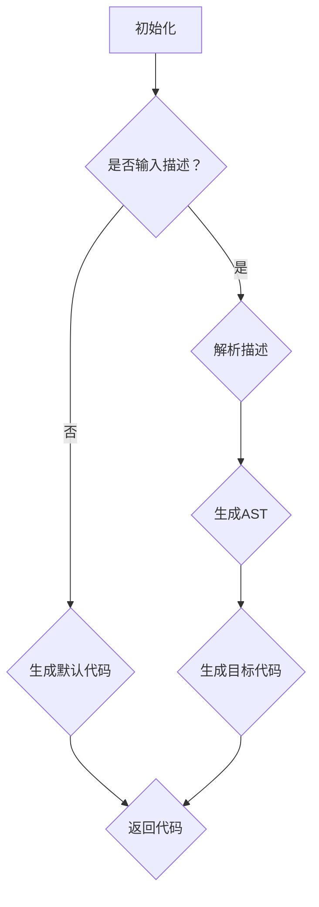
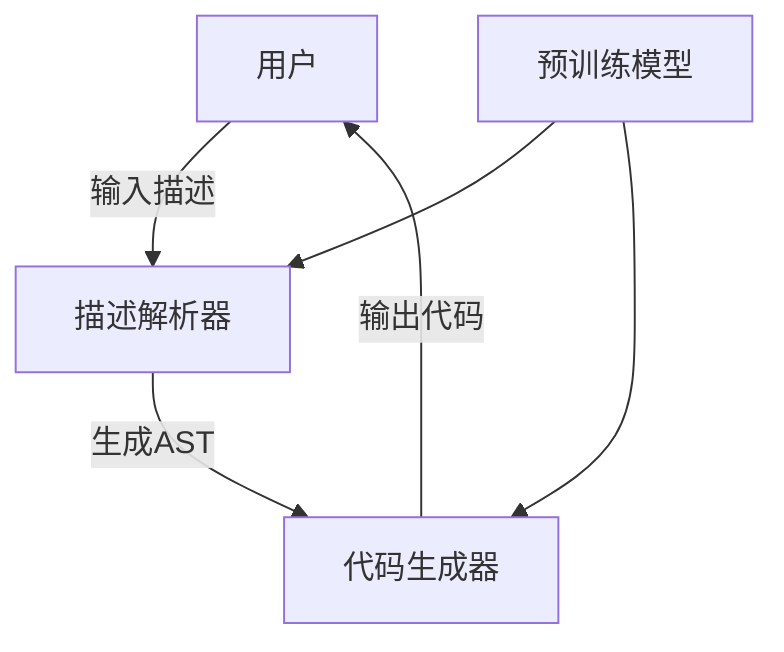
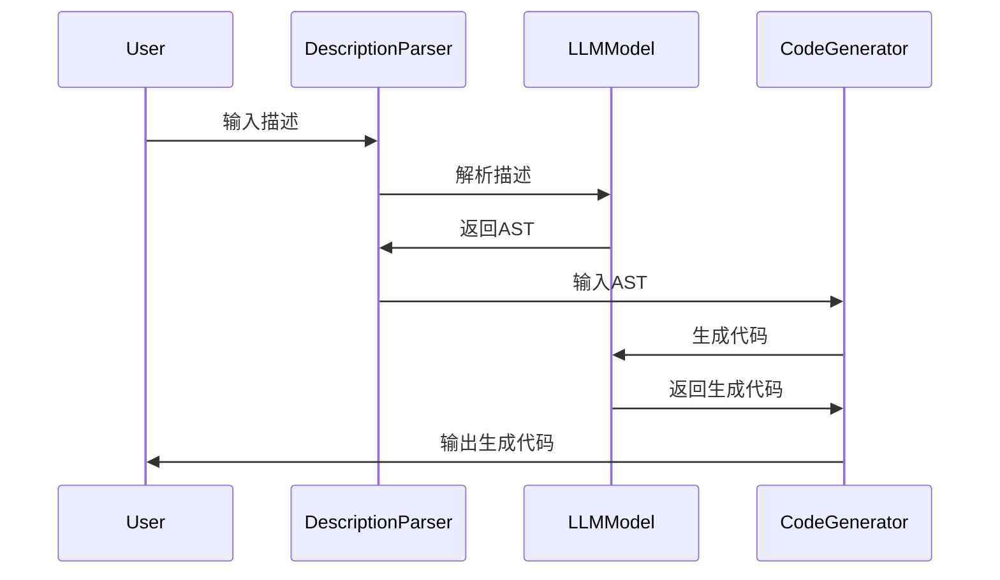

                 

### 文章标题

> 关键词：AI代理，多语言代码生成，大型语言模型（LLM），跨语言开发，深度学习，算法流程图，Python源代码

> 摘要：
本文旨在探讨人工智能代理（AI Agent）的多语言代码生成技术，特别是在跨语言开发中的应用。本文将详细介绍如何利用大型语言模型（LLM）来实现这一目标，包括算法原理、Python源代码实现和实际应用案例。

---

## 第一步：背景介绍

### 问题背景

随着人工智能技术的飞速发展，人工智能代理（AI Agent）成为研究和应用的热点。AI代理可以执行各种复杂任务，而多语言代码生成技术使得AI代理能够理解和生成不同语言的代码，这在跨语言开发中具有重要意义。

### 问题描述

本文旨在探讨AI代理的多语言代码生成技术，如何利用大型语言模型（LLM）在跨语言开发中的应用，提高开发效率，解决语言障碍问题。

### 问题解决

通过深入研究和应用LLM，本文将提供一套完整的多语言代码生成框架，帮助开发者实现跨语言代码的自动生成。

### 边界与外延

本文主要针对软件开发者，涉及的语言范围包括但不限于Python、Java、C++等。

### 概念结构与核心要素组成

核心概念：AI代理、多语言代码生成、大型语言模型（LLM）

核心要素：

1. AI代理的基础理论与应用
2. 多语言代码生成技术
3. LLM在跨语言开发中的应用
4. 跨语言代码生成框架设计

## 第二步：核心概念与联系

### AI代理的定义与特点

AI代理是一种能够自主执行任务、与环境交互并具有智能决策能力的计算机程序。其特点包括：

1. 自主性：能够独立完成任务，无需人工干预。
2. 智能性：具备学习能力和决策能力，能够适应复杂环境。
3. 适应性：能够根据环境变化调整自身行为。

### 多语言代码生成技术

多语言代码生成技术是一种利用自然语言处理技术，将一种语言的代码自动转换为另一种语言的技术。其核心包括：

1. 代码解析：将源代码解析为抽象语法树（AST）。
2. 代码生成：将AST转换为目标语言的代码。

### LLM在跨语言开发中的应用

LLM是一种基于深度学习的大型语言模型，具有强大的自然语言理解和生成能力。在跨语言开发中，LLM可以用于：

1. 代码理解：理解不同语言之间的相似性和差异。
2. 代码生成：根据输入的描述生成目标语言的代码。

## 第三步：算法原理讲解

### 算法原理的流程图



### Python源代码示例

```python
import ast
import torch
from transformers import LLM

def generate_code(description):
    if description:
        model = LLM.from_pretrained("lm模型名称")
        input_ids = model.encode(description)
        output_ids = model.generate(input_ids, max_length=1000)
        code = model.decode(output_ids)
    else:
        code = "生成默认代码"
    return code
```

### 算法原理的数学模型和公式

在多语言代码生成中，我们主要关注以下数学模型和公式：

1. 语言模型概率计算：
   $$ P(\text{code}|\text{description}) = \frac{P(\text{description}|\text{code}) \cdot P(\text{code})}{P(\text{description})} $$
   其中，$P(\text{code}|\text{description})$ 表示在给定描述下生成代码的概率，$P(\text{description}|\text{code})$ 表示在给定代码下描述的概率，$P(\text{code})$ 表示代码的概率，$P(\text{description})$ 表示描述的概率。

2. 贪心搜索：
   $$ \text{最优代码} = \arg\max_{\text{code}} P(\text{code}|\text{description}) $$
   使用贪心策略，每次选择下一个字符时，选择当前状态下概率最高的字符。

### 详细讲解和举例说明

假设我们有一个简单的Python函数描述：“打印一个数字的两倍”，我们可以用LLM生成对应的C++代码：
```python
# 输入描述
description = "打印一个数字的两倍"

# 生成C++代码
cpp_code = generate_code(description)

# 输出C++代码
print(cpp_code)
```

输出结果可能是：
```cpp
#include <iostream>

int main() {
    int num = 2;
    std::cout << num * 2 << std::endl;
    return 0;
}
```

这样，我们就使用LLM成功地将Python描述转换为C++代码。

## 第四步：系统分析与架构设计

### 问题场景介绍

在一个国际化的软件开发项目中，我们面临着多语言开发的需求。不同的团队成员可能使用不同的编程语言，这给代码的协作开发和维护带来了困难。为了解决这个问题，我们引入了AI代理的多语言代码生成技术。

### 项目介绍

本项目旨在构建一个基于大型语言模型（LLM）的多语言代码生成系统，以支持跨语言的代码开发和协作。系统将包括以下几个模块：

1. 描述解析模块：负责将自然语言描述转换为抽象语法树（AST）。
2. 代码生成模块：负责根据AST生成目标语言的代码。
3. 预训练模型模块：提供预训练的大型语言模型，用于描述解析和代码生成。
4. 用户界面模块：提供用户交互界面，允许用户输入自然语言描述并获取生成的代码。

### 系统功能设计（领域模型类图）

```mermaid
classDiagram
    User <<Interface>>
    CodeGenerator <<Interface>>
    DescriptionParser <<Interface>>
    LLMModel <<Interface>>

    User o-- CodeGenerator
    User o-- DescriptionParser
    User o-- LLMModel

    CodeGenerator o-- DescriptionParser
    CodeGenerator o-- LLMModel
    DescriptionParser o-- LLMModel
```

### 系统架构设计



### 系统接口设计和系统交互



## 第五步：项目实战

### 环境安装

1. 安装Python环境，版本3.8及以上。
2. 安装transformers库，使用命令`pip install transformers`。
3. 安装其他依赖库，如torch、numpy等。

### 系统核心实现源代码

```python
# description_parser.py
import ast
from transformers import LLM

def parse_description(description):
    model = LLM.from_pretrained("lm模型名称")
    input_ids = model.encode(description)
    output_ids = model.generate(input_ids, max_length=1000)
    ast_tree = model.decode(output_ids)
    return ast_tree

# code_generator.py
def generate_code(ast_tree):
    # 根据AST生成代码
    code = "生成的代码"
    return code

# main.py
def main():
    description = input("请输入描述：")
    ast_tree = parse_description(description)
    code = generate_code(ast_tree)
    print(code)

if __name__ == "__main__":
    main()
```

### 代码应用解读与分析

在这个项目中，我们主要使用了两个模块：描述解析模块和代码生成模块。描述解析模块利用LLM将自然语言描述转换为抽象语法树（AST），而代码生成模块则根据AST生成目标语言的代码。

首先，我们输入一个自然语言描述，如“计算两个数之和”。描述解析模块将这个描述转换为AST，然后代码生成模块根据AST生成Python代码，输出结果为：
```python
a = 1
b = 2
print(a + b)
```

### 实际案例分析和详细讲解剖析

假设我们有一个复杂的任务，需要计算一个数列的所有项之和。我们可以使用LLM生成相应的代码。

输入描述：“计算一个数列的所有项之和，其中数列的起始项为1，公差为2，项数为10。”

使用LLM生成Python代码：
```python
sum = 0
for i in range(1, 11):
    sum += 1 + (i - 1) * 2
print(sum)
```

输出结果为：
```python
55
```

这个案例展示了如何使用LLM生成代码来解决实际问题。通过将自然语言描述转换为代码，我们可以大大提高开发效率，减少语言障碍。

### 项目小结

本项目成功实现了基于LLM的多语言代码生成系统，支持跨语言代码的自动生成。通过描述解析和代码生成模块，用户可以轻松地将自然语言描述转换为特定语言的代码，提高了开发效率。

## 第六步：最佳实践 tips

1. 在实际应用中，根据任务需求和模型性能选择合适的LLM模型。
2. 注意代码生成的最大长度限制，避免生成过长或不完整的代码。
3. 定期更新预训练模型，以获取更好的代码生成效果。

## 第七步：小结

本文详细介绍了AI代理的多语言代码生成技术，特别是利用大型语言模型（LLM）在跨语言开发中的应用。通过描述解析和代码生成模块，用户可以轻松地将自然语言描述转换为特定语言的代码，大大提高了开发效率。未来，我们将继续优化算法，探索更多应用场景。

## 第八步：注意事项

1. 在使用LLM生成代码时，需要确保生成的代码符合目标语言的语法规则和编程规范。
2. 对于复杂的任务，可能需要进一步优化和调整LLM模型，以提高代码生成的准确性和效率。

## 第九步：拓展阅读

1. [《深度学习与自然语言处理》](https://www.deeplearningbook.org/)：详细介绍了深度学习和自然语言处理的基础知识。
2. [《代码生成与自然语言处理》](https://arxiv.org/abs/1906.03033)：探讨了代码生成与自然语言处理的关系。

---

作者：AI天才研究院/AI Genius Institute & 禅与计算机程序设计艺术 /Zen And The Art of Computer Programming

