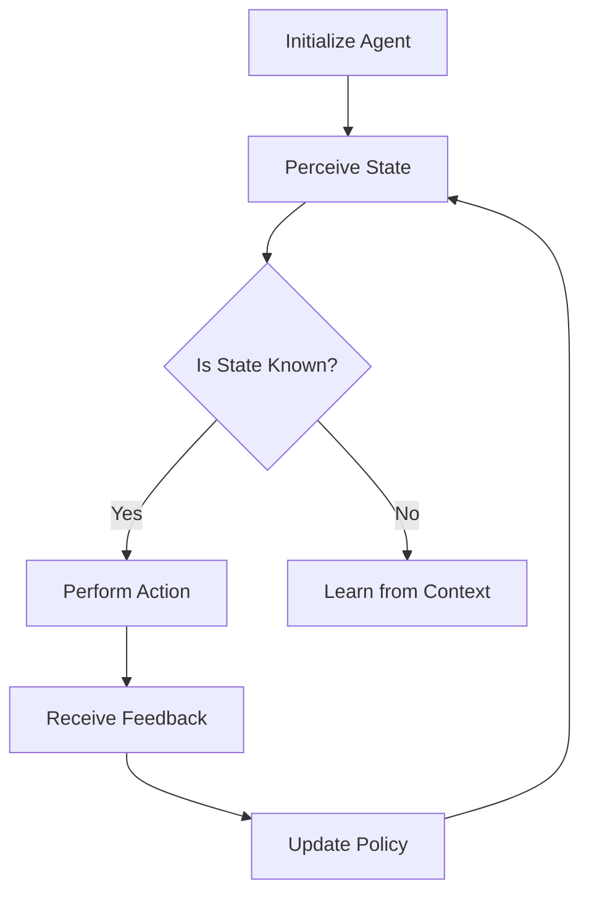

                 

## 1. Introduction to AI Agent's Situational Learning

### 1.1 Problem Background and Definition

In the realm of artificial intelligence (AI), the concept of an "AI agent" refers to a software entity that is capable of autonomously performing tasks within a given environment by perceiving its surroundings and taking actions to achieve specific goals. However, one of the most pressing challenges in AI today is the ability of these agents to adapt to various scenarios effectively. Traditional AI systems, particularly large language models (LLMs), often struggle with generalization and scenario adaptability, which limits their practical utility in real-world applications.

The problem can be succinctly defined as follows: How can we enhance the scenario adaptability of AI agents, particularly LLMs, to better perform in diverse and changing environments? This is not merely an academic pursuit but a critical challenge with significant implications for industries ranging from healthcare to e-commerce and beyond.

The limitations of current AI systems in handling different scenarios can be attributed to several factors. First, LLMs are often trained on massive datasets that reflect a wide range of topics but may not capture the nuances and specific contexts of various real-world situations. Second, the lack of a robust mechanism for context-aware learning means that these models struggle to maintain context over long sequences or adapt to new contexts quickly. Finally, the data privacy and ethical considerations associated with training these models on sensitive information pose additional barriers.

The primary opportunity lies in the development of "situational learning" for AI agents. Situational learning is a type of learning where the AI agent acquires knowledge and skills tailored to specific environments or situations. Unlike traditional machine learning approaches that rely on general patterns and statistical inference, situational learning focuses on context-specific learning, enabling AI agents to better understand and adapt to their operational environments.

### 1.2 Challenges and Opportunities in LLM Scenario Adaptability

The challenge of enhancing LLMs' scenario adaptability involves overcoming several key hurdles. One major challenge is the high computational cost and time required to train LLMs. These models are typically trained on vast amounts of data, which necessitates significant computational resources. Additionally, the training process can be time-consuming, especially when fine-tuning the models for specific scenarios.

Another challenge is the lack of contextual understanding in LLMs. While these models are capable of generating coherent and contextually relevant text, they often fail to maintain context over extended periods or adapt to new contexts effectively. This limitation is particularly problematic when LLMs are deployed in dynamic environments where the context may change rapidly.

Despite these challenges, there are significant opportunities for innovation. The advent of new techniques in natural language processing (NLP) and machine learning, such as context-aware embeddings and adaptive learning algorithms, offers promising avenues for enhancing LLMs' scenario adaptability. These techniques can enable AI agents to learn from specific contexts and adapt their behavior accordingly.

Moreover, the proliferation of real-world applications for AI agents presents a fertile ground for experimentation and development. From virtual assistants and chatbots to autonomous vehicles and healthcare diagnostics, the potential applications of improved scenario adaptability are vast and impactful.

In summary, the challenge of enhancing LLMs' scenario adaptability is multifaceted, involving computational constraints, contextual limitations, and ethical considerations. However, the opportunities for innovation and the potential for transformative applications make this a highly compelling area of research and development.

### 1.3 The Concept and Importance of Situational Learning for AI Agents

Situational learning is a specialized form of learning where an AI agent acquires knowledge and skills tailored to specific environments or situations. Unlike traditional machine learning, which often focuses on general patterns and broad data sets, situational learning zeroes in on the nuances and specific contexts of various real-world scenarios. This makes it a powerful approach for enhancing the adaptability and performance of AI agents.

The essence of situational learning lies in its ability to integrate context-specific information into the learning process. By learning from specific situations, AI agents can better understand the intricacies of their operational environments and adapt their behavior accordingly. This is particularly crucial for LLMs, which are often trained on large, general-purpose datasets but may struggle with the contextual subtleties of specific tasks.

One of the primary reasons situational learning is essential for AI agents is its potential to significantly improve scenario adaptability. In many real-world applications, such as customer service chatbots, virtual personal assistants, and autonomous systems, the ability to adapt to changing contexts and provide contextually relevant responses can be the difference between success and failure. For example, a chatbot designed for a specific e-commerce platform needs to understand the context of the product offerings, customer preferences, and the platform's operational norms to provide effective support.

Situational learning also addresses the issue of generalization. While traditional machine learning models excel at recognizing patterns in large datasets, they often lack the ability to generalize these patterns to new, unseen scenarios. Situational learning, on the other hand, allows AI agents to build specific knowledge bases tailored to particular contexts, which can be more effectively applied in new situations. This is akin to a human learning a new skill or task; through focused practice and context-specific learning, individuals become highly proficient in their specific domain.

Furthermore, situational learning can enhance the ethical and privacy considerations associated with AI deployment. By training AI agents on context-specific data, rather than large, general-purpose datasets, the risk of unintended biases and data privacy breaches can be mitigated. This is especially important in sensitive domains like healthcare and finance, where the ethical implications of AI decisions are paramount.

In summary, situational learning represents a transformative approach for enhancing the scenario adaptability of AI agents. By focusing on context-specific knowledge acquisition, situational learning enables AI agents to better understand and interact with their operational environments, thereby improving their performance and reliability in diverse and dynamic contexts. This makes it a pivotal concept in the ongoing evolution of AI and its applications.

### 1.4 Boundaries and Scope of the Book

The scope of this book, "AI Agent's Situational Learning: Enhancing LLM's Scenario Adaptability," is designed to provide a comprehensive exploration of the principles, methodologies, and practical applications of situational learning for AI agents. This book aims to bridge the gap between theoretical concepts and practical implementations, offering readers a deep understanding of how situational learning can be effectively utilized to enhance the adaptability of large language models (LLMs) in various real-world scenarios.

Firstly, the book will define and explain the core concepts of situational learning, including key terminology and foundational theories. It will delve into the differences between situational learning and traditional machine learning paradigms, highlighting the unique advantages and challenges associated with situational learning.

The primary focus of the book will be on methodologies for enhancing the scenario adaptability of LLMs. This will involve an in-depth examination of advanced techniques such as context-aware embeddings, adaptive learning algorithms, and transfer learning approaches. Each of these techniques will be illustrated with detailed mathematical models, formulas, and Python code examples to provide readers with a clear understanding of their principles and practical applications.

In addition to theoretical discussions, the book will include practical case studies that showcase the application of situational learning in diverse fields, including customer service chatbots, e-commerce recommendations, and healthcare systems. These case studies will provide concrete examples of how situational learning can be used to improve the performance and reliability of AI agents in real-world contexts.

The book will also address the challenges and opportunities in large-scale situational learning, discussing the computational requirements, data privacy considerations, and ethical implications associated with training AI agents in specific scenarios. By the end of the book, readers will have a thorough understanding of the potential and limitations of situational learning and will be equipped with the knowledge and tools necessary to implement and optimize situational learning frameworks in their own projects.

In summary, "AI Agent's Situational Learning: Enhancing LLM's Scenario Adaptability" aims to serve as a definitive guide for researchers, developers, and practitioners interested in advancing the capabilities of AI agents through situational learning. The book's comprehensive coverage of theoretical foundations, practical techniques, and real-world applications will make it an invaluable resource for anyone looking to enhance the scenario adaptability of LLMs and other AI agents.

### Chapter 2: Fundamental Concepts in Situational Learning

#### 2.1 Key Terminology and Definitions

To delve into the core concepts of situational learning, it is essential to first establish a clear understanding of the key terminology and definitions that form the foundation of this field. The following are some of the most important terms and their corresponding definitions:

- **AI Agent**: A software entity that perceives its environment through sensors and takes actions to achieve specific goals, typically using algorithms and data.
- **Situational Learning**: The process by which an AI agent acquires knowledge and skills tailored to specific environments or situations. It involves learning from context-specific information to enhance adaptability and performance.
- **Large Language Model (LLM)**: A type of AI model that is capable of understanding and generating human language. LLMs are typically trained on massive amounts of text data to capture the complexities of natural language.
- **Context-Aware Learning**: A learning paradigm where the AI model's ability to understand and utilize context is prioritized. This is crucial for maintaining coherence and relevance in dynamic environments.
- **Reinforcement Learning**: A type of machine learning where an agent learns to achieve specific goals by interacting with an environment and receiving feedback in the form of rewards or penalties.
- **Transfer Learning**: The technique of using a pre-trained model on a large, general-purpose dataset and then fine-tuning it on a smaller, domain-specific dataset to improve its performance in new scenarios.

By defining these key terms, we lay the groundwork for a deeper exploration of situational learning and its applications in enhancing the adaptability of AI agents, particularly LLMs.

#### 2.2 Core Principles and Theories

Situational learning is grounded in several core principles and theories that explain how AI agents can effectively acquire and utilize context-specific knowledge. These principles are essential for understanding the mechanics of situational learning and its advantages over traditional machine learning approaches.

**2.2.1 Situational Learning vs. Traditional Machine Learning**

The primary distinction between situational learning and traditional machine learning lies in their objectives and methodologies. Traditional machine learning focuses on identifying general patterns and relationships within large datasets, aiming to build models that can generalize well to new, unseen data. While this approach is powerful, it often falls short in scenarios where the context is critical to decision-making.

Situational learning, on the other hand, is specifically designed to address the limitations of traditional machine learning. It emphasizes the acquisition of context-specific knowledge, enabling AI agents to better understand and interact with their operational environments. This is achieved by training models on data that is both relevant to the specific context and rich in contextual information.

**Advantages of Situational Learning:**

1. **Enhanced Adaptability**: By focusing on specific contexts, situational learning enables AI agents to adapt more effectively to changing environments and new situations.
2. **Improved Contextual Understanding**: Situational learning models are better equipped to maintain context over extended periods, leading to more coherent and relevant responses.
3. **Reduced Overfitting**: Traditional machine learning models may overfit to the training data, performing poorly on new, unseen data. Situational learning, by contrast, aims to build models that are more robust and generalizable to specific contexts.
4. **Ethical and Privacy Considerations**: By training on context-specific data, the risk of unintended biases and data privacy breaches can be mitigated, particularly in sensitive domains.

**2.2.2 The Role of Reinforcement Learning in Situational Learning**

Reinforcement learning (RL) plays a crucial role in situational learning. RL is a type of machine learning where an agent learns to achieve specific goals by interacting with an environment and receiving feedback in the form of rewards or penalties. This feedback loop is essential for the iterative improvement of the agent's performance in specific contexts.

In situational learning, RL is used to train AI agents to make contextually appropriate decisions. The agent is presented with a set of actions and learns through trial and error which actions yield the best outcomes in specific situations. This iterative process allows the agent to refine its behavior and improve its adaptability over time.

**Key Components of Reinforcement Learning in Situational Learning:**

1. **State Space**: The set of all possible states that the agent can be in. Each state represents a specific context or situation.
2. **Action Space**: The set of all possible actions the agent can take in a given state.
3. **Reward Function**: A function that assigns a reward or penalty to the agent based on its actions and the resulting state. The goal is to maximize cumulative rewards over time.
4. **Policy**: A mapping from states to actions that the agent uses to make decisions. The policy is learned through the interaction between the agent and the environment.

By leveraging reinforcement learning, situational learning enables AI agents to acquire context-specific knowledge through a trial-and-error process, thereby enhancing their ability to adapt to new and changing scenarios.

#### 2.3 Mermaid Diagrams for Conceptual Clarity

To further elucidate the core concepts of situational learning, we will employ Mermaid diagrams, a popular tool for creating structured diagrams and flowcharts in Markdown. These diagrams will provide a visual representation of key concepts and relationships, enhancing the reader's understanding of the subject matter.

**2.3.1 Entity Relationship (ER) Diagrams**

Entity Relationship (ER) diagrams are used to represent the relationships between different entities within a system. In the context of situational learning, an ER diagram can help visualize the components and their interactions.

Below is an ER diagram that illustrates the key entities involved in situational learning:

```mermaid
erDiagram
  AI Agent ||--|{ Situational Learning Model
  AI Agent ||--|{ Reinforcement Learning Model
  Situational Learning Model ||--|{ Contextual Data
  Reinforcement Learning Model ||--|{ Reward Function
  Environment ||--|{ Feedback
```

This ER diagram highlights the relationships between the AI agent, the situational learning model, the reinforcement learning model, contextual data, and the environment. It shows how the AI agent interacts with the learning models and the environment to acquire context-specific knowledge.

**2.3.2 Mermaid Flowcharts**

Flowcharts are another useful tool for visualizing the process flow of situational learning. Below is a Mermaid flowchart that represents the main steps involved in situational learning:



This flowchart starts with the initialization of the AI agent, which then perceives the current state of the environment. It then checks if the state is known. If the state is known, the agent performs an action. If the state is unknown, the agent learns from the context and updates its policy. The process continues iteratively, with the agent receiving feedback and updating its actions based on the results.

These Mermaid diagrams provide a clear and concise visual representation of the key concepts and processes involved in situational learning. They help readers grasp the underlying principles more easily and provide a useful reference for understanding the material.

#### 2.4 Conclusion

In this chapter, we have explored the fundamental concepts of situational learning, including key terminology, core principles, and their comparison with traditional machine learning. We have also introduced the role of reinforcement learning in situational learning and illustrated these concepts using Mermaid diagrams. These diagrams serve as valuable tools for visualizing the relationships and processes involved, enhancing the reader's understanding of situational learning.

In the next chapter, we will delve deeper into specific methodologies for enhancing the scenario adaptability of large language models (LLMs) through situational learning. We will discuss advanced techniques such as context-aware embeddings, adaptive learning algorithms, and transfer learning, providing a comprehensive guide to implementing and optimizing situational learning frameworks.

### Chapter 3: Methodologies for Enhancing LLM Scenario Adaptability

#### 3.1 Understanding Limitations of Standard LLMs

Standard large language models (LLMs) have revolutionized the field of natural language processing (NLP) by achieving state-of-the-art performance on various tasks, such as text generation, translation, and question-answering. However, despite their impressive capabilities, these models have several inherent limitations that hinder their scenario adaptability.

One of the primary limitations of standard LLMs is their reliance on general-purpose datasets for training. While these models are trained on massive amounts of text data, the datasets often reflect a wide range of topics and may not capture the nuances and specific contexts of various real-world applications. This lack of context-specific information makes it challenging for LLMs to generate contextually relevant and coherent responses in diverse scenarios.

Another limitation is the inability of LLMs to maintain context over extended periods. LLMs are designed to process text sequentially, which means that the context available at each step is limited to the recent history of the conversation. This can lead to issues such as forgetting important details or generating responses that are not aligned with the ongoing context. In scenarios where maintaining context is crucial, such as in interactive dialogue systems or collaborative tasks, this limitation can significantly impact the performance of LLMs.

Moreover, standard LLMs may struggle with generalization to new, unseen scenarios. While they are trained on diverse datasets, the models may overfit to the training data, performing poorly when faced with new, contextually different tasks. This lack of generalization is a significant barrier to deploying LLMs in real-world applications where the environment and context may evolve over time.

To overcome these limitations, it is essential to develop methodologies that enhance the scenario adaptability of LLMs. Situational learning offers a promising approach by focusing on context-specific information and enabling LLMs to acquire and utilize knowledge tailored to specific environments. In the following sections, we will explore advanced techniques such as context-aware embeddings, adaptive learning algorithms, and transfer learning that can be used to enhance the scenario adaptability of LLMs.

#### 3.2 Techniques for Improving LLM Adaptability

To enhance the scenario adaptability of large language models (LLMs), several advanced techniques can be employed. These techniques focus on leveraging context-specific information and improving the models' ability to generalize to new scenarios. Below, we will discuss three key methodologies: context-aware embeddings, adaptive learning algorithms, and transfer learning.

**3.2.1 Context-Aware Embeddings**

Context-aware embeddings are a critical component of enhancing LLM adaptability. These embeddings represent words, phrases, or even entire sentences in a high-dimensional space while capturing the contextual information surrounding them. By leveraging context-aware embeddings, LLMs can better understand the nuances of specific scenarios and generate more contextually relevant responses.

One popular approach to creating context-aware embeddings is through the use of transformer models, particularly models like BERT (Bidirectional Encoder Representations from Transformers) and GPT (Generative Pre-trained Transformer). These models are pre-trained on large, general-purpose datasets and then fine-tuned on domain-specific datasets to capture the context-specific information relevant to a particular application.

**Key Steps in Creating Context-Aware Embeddings:**

1. **Pre-training**: The model is first pre-trained on a massive corpus of text data, learning to encode the relationships between words and phrases.
2. **Fine-tuning**: After pre-training, the model is fine-tuned on a domain-specific dataset to adapt its embeddings to the specific context of the task. This step is crucial for capturing the nuances of the target scenario.
3. **Embedding Representation**: The output of the model at each token position in the input sequence represents a context-aware embedding. These embeddings capture the contextual information and can be used to influence the model's predictions.

**Mathematical Model and Formulas:**

Let \( E \) be the set of input tokens, and \( T \) be the set of token embeddings. The context-aware embedding for a given token \( t \) in a sequence can be represented as:

$$
\text{ctx\_aware\_embedding}(t) = \text{transformer}(t, \text{context})
$$

Where \( \text{transformer} \) is the transformer model that encodes the contextual information, and \( \text{context} \) represents the surrounding context in the sequence.

**Example:**

Consider a sentence "The cat sat on the mat." A context-aware embedding for the word "cat" would capture not only the meaning of "cat" but also its position in the sentence, the presence of "the" before it, and the overall context of the sentence. This allows the LLM to generate more coherent and contextually relevant responses.

**3.2.2 Adaptive Learning Algorithms**

Adaptive learning algorithms are another essential technique for improving LLM adaptability. These algorithms enable LLMs to adjust their behavior based on the feedback received from the environment, continuously refining their performance in specific scenarios.

**Key Concepts in Adaptive Learning Algorithms:**

1. **Reward Function**: A reward function is used to evaluate the performance of the LLM in a given scenario. It assigns a positive or negative reward based on the LLM's actions and the resulting outcomes.
2. **Policy**: The policy represents the LLM's behavior in a given state. It is updated based on the feedback received from the environment and the rewards obtained.
3. **Learning Process**: The LLM interacts with the environment, takes actions based on its policy, receives feedback in the form of rewards, and updates its policy iteratively to improve its performance.

**Popular Adaptive Learning Algorithms:**

1. **Reinforcement Learning (RL)**: RL algorithms, such as Q-Learning and Deep Q-Networks (DQN), are commonly used for adaptive learning. These algorithms use trial-and-error to learn optimal policies by exploring the environment and receiving feedback.
2. **Model-Based RL**: Model-based RL algorithms, such as Dyna-Q, use a model of the environment to simulate actions and predict rewards, enabling more efficient exploration and learning.
3. **Model-Free RL**: Model-free RL algorithms, such as Sarsa and Q-Learning, learn directly from the environment without explicit models, making them more practical for real-world applications.

**Mathematical Model and Formulas:**

Consider an LLM with a policy \( \pi(s) \) that maps states \( s \) to actions \( a \). The reinforcement learning update rule can be represented as:

$$
\pi(s_{t+1}) \leftarrow \pi(s_t) + \alpha [r_t - \gamma \max_a Q(\pi(s_t), a)]
$$

Where \( \alpha \) is the learning rate, \( r_t \) is the reward received at time step \( t \), \( \gamma \) is the discount factor, and \( Q(\pi(s_t), a) \) is the estimated quality of action \( a \) under policy \( \pi \).

**Example:**

Suppose an LLM is used to generate responses for a customer service chatbot. The reward function could be based on user satisfaction ratings, where higher ratings indicate positive feedback. The LLM would continuously adjust its responses based on the feedback received, learning to generate more satisfying and contextually appropriate responses over time.

**3.2.3 Transfer Learning**

Transfer learning is a powerful technique for enhancing the scenario adaptability of LLMs by leveraging pre-trained models on general-purpose datasets and fine-tuning them on domain-specific datasets. This approach reduces the amount of training data required and accelerates the learning process, while also improving the model's generalization to new scenarios.

**Key Steps in Transfer Learning:**

1. **Pre-trained Model**: A pre-trained LLM, such as BERT or GPT, is used as a starting point. These models have been trained on large, general-purpose datasets and have captured a broad range of language patterns and contextual information.
2. **Fine-tuning**: The pre-trained model is fine-tuned on a domain-specific dataset to adapt its parameters to the target scenario. This step is crucial for capturing the specific contextual information and linguistic nuances of the domain.
3. **Evaluation**: The fine-tuned model is evaluated on a holdout dataset to assess its performance in the target scenario. This evaluation helps ensure that the model has effectively adapted to the new context.

**Mathematical Model and Formulas:**

The transfer learning process can be represented as:

$$
\text{Fine-tuned Model} = \text{Pre-trained Model} + \text{Domain-Specific Fine-tuning}
$$

Where the domain-specific fine-tuning involves updating the pre-trained model's parameters on the target dataset using techniques such as gradient descent and backpropagation.

**Example:**

Consider an LLM being fine-tuned for a medical domain. The pre-trained model would be initialized with weights learned from a general-purpose corpus. The model would then be fine-tuned on a medical corpus, adjusting its parameters to capture the specific language patterns and terminology used in the medical domain. This fine-tuned model would be more effective in generating contextually appropriate responses for medical queries.

In summary, context-aware embeddings, adaptive learning algorithms, and transfer learning are powerful techniques for enhancing the scenario adaptability of LLMs. These methodologies enable LLMs to better understand and interact with specific contexts, improving their performance in diverse real-world applications. In the next chapter, we will explore practical case studies that illustrate the application of these techniques in various domains, providing concrete examples of how situational learning can be effectively implemented to enhance LLM adaptability.

### 3.3 Mathematical Models and Formulas

In this section, we will delve deeper into the mathematical models and formulas that underpin the techniques discussed for enhancing LLM scenario adaptability. These models and formulas are critical for understanding the theoretical foundations and practical implementations of context-aware embeddings, adaptive learning algorithms, and transfer learning.

**3.3.1 Context-Aware Embeddings**

The creation of context-aware embeddings involves complex mathematical transformations that capture the contextual information in the input data. The core component here is the transformer model, which is based on self-attention mechanisms.

**Key Formulas:**

1. **Self-Attention Score:**
   $$ 
   \text{Attention}(Q, K, V) = \text{softmax}\left(\frac{QK^T}{\sqrt{d_k}}\right) V 
   $$
   Where \( Q, K, \) and \( V \) are query, key, and value matrices, respectively, \( d_k \) is the dimension of the key vectors, and \( \text{softmax} \) computes the probability distribution over the keys.

2. **Transformer Encoder Layer:**
   $$ 
   \text{Encoder}(X) = \text{LayerNorm}(X + \text{MultiHeadAttention}(X, X, X)) + \text{LayerNorm}(X + \text{PositionalEncoding}(X))
   $$
   Where \( X \) is the input sequence, \( \text{LayerNorm} \) is the layer normalization operation, and \( \text{PositionalEncoding} \) adds position information to the input embeddings.

3. **Transformer Decoder Layer:**
   $$ 
   \text{Decoder}(X) = \text{LayerNorm}(X + \text{MaskedMultiHeadAttention}(X, X, X)) + \text{LayerNorm}(X + \text{CrossAttention}(X, \text{Encoder}(X)))
   $$
   Where \( \text{MaskedMultiHeadAttention} \) and \( \text{CrossAttention} \) are variations of the standard multi-head attention mechanism designed to handle the mask applied to prevent future tokens from influencing past tokens in the sequence.

**Example:**

Consider a sentence "The quick brown fox jumps over the lazy dog." The transformer model would process this sentence by calculating attention scores for each word based on the surrounding context and generating embeddings that capture the specific meaning of each word within the sentence.

**3.3.2 Adaptive Learning Algorithms**

Adaptive learning algorithms, particularly reinforcement learning (RL) algorithms, rely on mathematical models to update policies based on feedback from the environment. The following are some key formulas used in RL:

**Key Formulas:**

1. **Q-Learning Update Rule:**
   $$ 
   Q(s, a) \leftarrow Q(s, a) + \alpha [r + \gamma \max_{a'} Q(s', a')]
   $$
   Where \( Q(s, a) \) is the estimated quality of action \( a \) in state \( s \), \( r \) is the reward received after taking action \( a \), \( \gamma \) is the discount factor, and \( \alpha \) is the learning rate.

2. **Sarsa Algorithm Update Rule:**
   $$ 
   \tau(s, a) \leftarrow \tau(s, a) + 1
   $$
   $$
   Q(s, a) \leftarrow Q(s, a) + \alpha [\r

