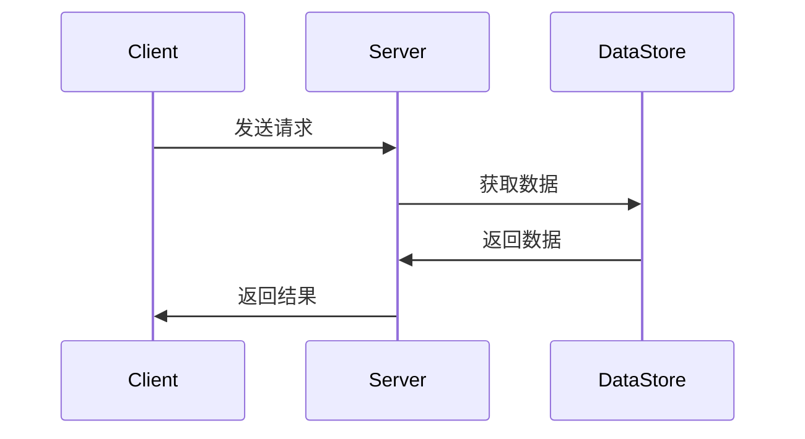
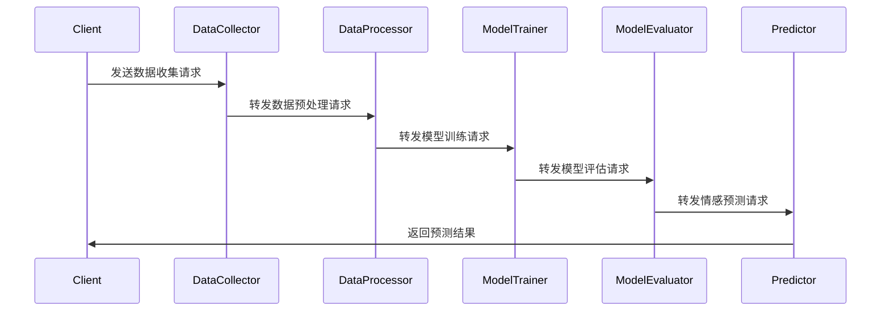

                 


### 第一部分：情感分析背景介绍

#### 第1章：情感分析概述

**1.1 情感分析的定义与历史背景**

情感分析，又称 sentiment analysis，是自然语言处理（NLP）领域中的一种重要技术。它的主要任务是从文本中识别出人们对特定对象（如产品、服务、事件等）的情感倾向，通常是正面、负面或中性。情感分析的定义可以概括为：通过对文本数据的处理和分析，提取出文本中所表达的情绪、情感或态度。

**1.1.1 情感分析的定义**

情感分析的定义有多种表述方式，但核心内容基本一致。较为常见的一种定义是：情感分析是指从文本中自动识别出情感极性（如正面、负面、中性）和情感强度（如强烈、中度、弱）的过程。

**1.1.2 情感分析的发展历程**

情感分析的发展历程可以追溯到20世纪90年代，随着互联网的兴起和社交网络的普及，情感分析逐渐成为一个热门研究领域。早期的情感分析主要采用基于规则的方法，通过编写大量手工规则来识别情感。随着机器学习技术的发展，基于统计模型的方法逐渐取代了基于规则的方法，成为主流。近年来，深度学习技术的崛起，为情感分析带来了新的突破。

**1.1.3 情感分析的应用领域**

情感分析在多个领域都有广泛应用，主要包括：

1. **社交媒体分析**：通过对社交媒体平台上的用户评论进行分析，了解公众对品牌、产品、服务的态度。
2. **市场调研**：通过分析消费者对产品或服务的反馈，为企业提供市场调研数据。
3. **舆情监测**：对互联网上的信息进行实时监控，识别出可能对社会稳定产生影响的负面情绪。
4. **情感推荐**：基于用户的历史行为和情感分析结果，为用户提供个性化的推荐服务。
5. **文本情感分类**：将文本数据按照情感类别进行分类，为文本挖掘、信息检索等领域提供支持。

#### 第2章：情感分析中的核心概念与联系

**2.1 情感分析与自然语言处理**

自然语言处理（NLP）是计算机科学和语言学的交叉领域，旨在让计算机能够理解和处理人类语言。情感分析是NLP领域中一个重要的分支。

**2.1.1 自然语言处理的基本概念**

自然语言处理的基本概念包括：

1. **分词**：将连续的文本切分成一个个独立的词语。
2. **词性标注**：对文本中的每个词语进行词性分类，如名词、动词、形容词等。
3. **句法分析**：分析句子结构，识别出句子中的主语、谓语、宾语等成分。
4. **语义分析**：理解文本中的含义，包括词语的含义、句子的含义以及上下文的关系。

**2.1.2 情感分析与NLP的关系**

情感分析是自然语言处理的一个重要应用。NLP提供了情感分析所需的基础技术，如分词、词性标注、句法分析和语义分析。情感分析则需要利用这些技术，从文本中提取出情感信息。

**2.1.3 情感分析在NLP中的具体应用**

情感分析在NLP中的具体应用包括：

1. **情感极性分类**：对文本进行分类，判断文本的情感极性为正面、负面或中性。
2. **情感强度分析**：分析文本中情感的表达程度，如强烈、中度、弱。
3. **情感趋势分析**：分析文本中情感的变化趋势，如积极情绪逐渐增加或负面情绪逐渐增加。

**2.2 情感分析中的技术手段**

情感分析的技术手段主要包括机器学习方法和深度学习方法。

**2.2.1 机器学习方法**

机器学习方法是指利用统计学原理，通过训练模型，使模型能够自动从数据中学习规律，并对新的数据做出预测。

**2.2.2 深度学习方法**

深度学习方法是指利用多层神经网络，通过训练模型，使模型能够自动从数据中学习复杂模式，并对新的数据做出预测。

**2.2.3 情感分析技术手段的对比与选择**

机器学习方法和深度学习方法各有优缺点。机器学习方法对数据质量和特征工程要求较高，但模型解释性较好；深度学习方法对数据量和计算资源要求较高，但模型性能较好。

在具体应用中，需要根据数据规模、计算资源和业务需求，选择合适的技术手段。

**2.3 情感分析中的数据资源**

情感分析中的数据资源主要包括情感标注数据集和预训练模型。

**2.3.1 情感标注数据集**

情感标注数据集是情感分析的基础。常见的情感标注数据集包括：

1. **IMDB电影评论数据集**：包含了25000个训练样本和25000个测试样本，情感标签为正面或负面。
2. **Twitter情感分析数据集**：包含了数百万条推文，情感标签为正面、负面或中性。

**2.3.2 数据预处理方法**

数据预处理方法包括文本清洗、分词、词性标注、去停用词等。

**2.3.3 数据资源的获取与利用**

数据资源的获取可以通过以下几种方式：

1. **开源数据集**：从公开数据集网站获取，如Kaggle、UCI机器学习库等。
2. **爬虫**：利用爬虫技术，从互联网上获取数据。
3. **合作**：与合作伙伴共享数据资源。

数据资源的利用包括数据清洗、数据标注、数据集成和数据挖掘等。

### 第二部分：情感分析算法原理讲解

#### 第3章：情感分析算法概述

**3.1 情感分析算法概述**

情感分析算法是指用于从文本中提取情感信息的算法。情感分析算法可以分为基于规则的方法、基于机器学习的方法和基于深度学习的方法。

**3.1.1 情感分析算法的基本流程**

情感分析算法的基本流程包括：

1. **文本预处理**：包括文本清洗、分词、词性标注、去停用词等。
2. **特征提取**：将预处理后的文本转换为机器可处理的特征向量。
3. **模型训练**：利用训练数据集，训练出情感分析模型。
4. **模型评估**：利用测试数据集，评估模型的性能。
5. **情感预测**：利用训练好的模型，对新的文本进行情感预测。

**3.1.2 情感分析算法的分类**

情感分析算法可以分为以下几类：

1. **基于规则的方法**：通过编写手工规则，对文本进行情感分类。
2. **基于统计的方法**：利用统计学原理，通过训练模型，对文本进行情感分类。
3. **基于深度学习的方法**：利用多层神经网络，通过训练模型，对文本进行情感分类。

**3.1.3 情感分析算法的选择与优化**

在选择情感分析算法时，需要考虑以下因素：

1. **数据规模**：数据规模较大时，深度学习方法可能更为适用。
2. **特征工程**：特征工程对算法性能有重要影响，需要根据数据特点进行优化。
3. **计算资源**：深度学习算法通常需要较高的计算资源，需要根据实际情况进行选择。

**3.2 基于传统机器学习的情感分析算法**

传统机器学习算法在情感分析中有着广泛的应用。以下介绍几种常见的传统机器学习算法。

**3.2.1 支持向量机（SVM）**

支持向量机是一种经典的分类算法。在情感分析中，SVM可以通过训练数据集，学习到文本特征与情感标签之间的关系，从而对新的文本进行情感分类。

**3.2.2 随机森林（Random Forest）**

随机森林是一种集成学习方法，通过构建多棵决策树，并对它们进行投票，得到最终的分类结果。随机森林在情感分析中表现良好，能够处理大量特征，并具有一定的鲁棒性。

**3.2.3 K最近邻（K-Nearest Neighbor）**

K最近邻是一种基于实例的算法，通过计算新实例与训练实例的距离，找出最近的K个实例，并对它们进行投票，得到最终的分类结果。K最近邻在情感分析中表现简单直观，但需要较多的训练数据。

**3.3 基于深度学习的情感分析算法**

随着深度学习技术的发展，深度学习算法在情感分析中得到了广泛应用。以下介绍几种常见的深度学习算法。

**3.3.1 卷积神经网络（CNN）**

卷积神经网络是一种用于处理图像数据的神经网络模型，但在情感分析中，也可以通过文本的词向量表示，利用卷积神经网络进行情感分类。CNN能够自动提取文本的特征，并能够处理大量的特征。

**3.3.2 递归神经网络（RNN）**

递归神经网络是一种用于处理序列数据的神经网络模型，在情感分析中，可以处理文本的序列特征。RNN能够处理长距离依赖问题，但在处理长序列时，存在梯度消失和梯度爆炸的问题。

**3.3.3 自注意力机制（Self-Attention）**

自注意力机制是一种用于处理序列数据的注意力机制，可以自动学习序列中各个位置的重要程度。在情感分析中，自注意力机制可以用于文本的表示和情感分类，能够提高模型的性能。

### 第三部分：系统分析与架构设计方案

#### 第4章：系统分析与架构设计方案

**4.1 情感分析系统概述**

情感分析系统是指用于实现情感分析功能的一系列软件和硬件的组合。情感分析系统通常包括数据收集、数据预处理、模型训练、模型评估和情感预测等模块。

**4.1.1 情感分析系统的功能**

情感分析系统的功能主要包括：

1. **数据收集**：从互联网或其他数据源收集文本数据。
2. **数据预处理**：对收集到的文本数据进行清洗、分词、词性标注等预处理操作。
3. **模型训练**：利用预处理后的文本数据，训练情感分析模型。
4. **模型评估**：利用测试数据集，评估模型的性能。
5. **情感预测**：利用训练好的模型，对新的文本进行情感预测。

**4.1.2 情感分析系统的架构设计原则**

情感分析系统的架构设计原则主要包括：

1. **模块化**：将系统划分为多个模块，每个模块负责不同的功能，便于系统维护和扩展。
2. **可扩展性**：系统应具有较好的可扩展性，能够适应数据规模和业务需求的变化。
3. **高性能**：系统应具有较高的性能，能够快速处理大量数据。
4. **高可用性**：系统应具有高可用性，能够保证系统的稳定运行。

**4.1.3 情感分析系统的开发流程**

情感分析系统的开发流程主要包括以下几个阶段：

1. **需求分析**：分析用户需求，明确系统的功能和技术要求。
2. **系统设计**：根据需求分析结果，设计系统的架构和模块。
3. **编码实现**：根据系统设计文档，实现各个模块的功能。
4. **测试与调试**：对系统进行功能测试和性能测试，修复发现的缺陷。
5. **部署上线**：将系统部署到生产环境，进行实际运行。
6. **维护与升级**：对系统进行定期维护和升级，保证系统的稳定运行。

**4.2 系统功能设计**

情感分析系统的功能设计包括领域模型设计、功能模块设计和系统功能实现。

**4.2.1 领域模型设计**

领域模型设计是指对系统中的实体和关系进行建模。在情感分析系统中，常见的实体包括文本、情感标签、特征等。实体之间的关系可以通过ER图进行表示。

```mermaid
erDiagram
  Text ||--|{ Sentiment }|-- Text
  Text ||--|{ Feature }|-- Text
```

**4.2.2 功能模块设计**

功能模块设计是指对系统的功能进行划分，并设计每个模块的功能。在情感分析系统中，常见的功能模块包括数据收集模块、数据预处理模块、模型训练模块、模型评估模块和情感预测模块。

**4.2.3 系统功能实现**

系统功能实现是指根据功能模块设计，实现各个模块的具体功能。以下是情感分析系统功能实现的一部分伪代码：

```python
# 数据收集模块
def collect_data(source):
    # 收集文本数据
    pass

# 数据预处理模块
def preprocess_data(text):
    # 清洗、分词、词性标注等预处理操作
    pass

# 模型训练模块
def train_model(train_data):
    # 训练情感分析模型
    pass

# 模型评估模块
def evaluate_model(test_data, model):
    # 评估模型性能
    pass

# 情感预测模块
def predict_sentiment(text, model):
    # 预测文本的情感
    pass
```

**4.3 系统架构设计**

情感分析系统的架构设计包括系统架构设计、接口设计和系统交互。

**4.3.1 系统架构设计**

系统架构设计是指设计系统的整体架构，确定系统的组件和组件之间的关系。在情感分析系统中，常见的系统架构包括客户端-服务器架构和分布式架构。



**4.3.2 接口设计**

接口设计是指设计系统的API接口，定义接口的输入输出参数和数据格式。在情感分析系统中，常见的接口设计包括RESTful API和GraphQL API。

```mermaid
classDiagram
  API <<Interface>>
  API : +send_request(): Response
  API : +receive_response(): None

  ClientEntity <<Entity>>
  ClientEntity : -request: Request
  ClientEntity : -response: Response

  ServerEntity <<Entity>>
  ServerEntity : -data_store: DataStore
  ServerEntity : -model: Model

  DataStore <<Entity>>
  DataStore : -get_data(): Data
  DataStore : -save_data(): None

  Model <<Entity>>
  Model : -train(): None
  Model : -evaluate(): Evaluation
  Model : -predict(): Prediction
```

**4.3.3 系统交互**

系统交互是指系统组件之间的通信和协作。在情感分析系统中，系统组件之间的交互可以通过消息队列、RESTful API或GraphQL API实现。



### 第四部分：情感分析项目实战

#### 第5章：情感分析项目实战

**5.1 环境安装与配置**

在开始情感分析项目之前，我们需要安装和配置相关环境。

**5.1.1 环境需求**

1. Python 3.7或更高版本
2. Anaconda或Miniconda
3. PyTorch或TensorFlow
4. 数据预处理库（如NLTK、spaCy）
5. 文本表示库（如gensim、word2vec）

**5.1.2 环境搭建**

1. 安装Anaconda或Miniconda
2. 创建一个新的虚拟环境，并激活
3. 使用pip安装所需的库

```bash
conda create -n sentiment_analysis python=3.8
conda activate sentiment_analysis
pip install torch torchvision torchaudio
```

**5.1.3 常见问题与解决方案**

1. **环境变量问题**：确保环境变量正确设置，可以使用conda list命令查看已安装的库和版本。
2. **库依赖问题**：如果遇到库依赖问题，可以尝试使用conda或pip安装特定的库版本。

**5.2 系统核心实现源代码**

情感分析系统的核心实现包括数据收集、数据预处理、模型训练、模型评估和情感预测。

**5.2.1 数据收集模块**

数据收集模块用于从互联网或其他数据源收集文本数据。

```python
import requests
from bs4 import BeautifulSoup

def collect_data(url):
    response = requests.get(url)
    soup = BeautifulSoup(response.text, 'html.parser')
    texts = soup.find_all('p')
    return [text.text for text in texts]
```

**5.2.2 数据预处理模块**

数据预处理模块用于对收集到的文本数据进行清洗、分词、词性标注等预处理操作。

```python
import nltk
from nltk.tokenize import word_tokenize
from nltk.corpus import stopwords

nltk.download('punkt')
nltk.download('stopwords')

def preprocess_data(text):
    # 清洗文本
    text = text.lower()
    text = re.sub(r'[^\w\s]', '', text)
    # 分词
    tokens = word_tokenize(text)
    # 去停用词
    stop_words = set(stopwords.words('english'))
    tokens = [token for token in tokens if token not in stop_words]
    return tokens
```

**5.2.3 模型训练模块**

模型训练模块用于利用预处理后的文本数据，训练情感分析模型。

```python
import torch
from torch import nn
from torch.utils.data import DataLoader
from torchvision import datasets, transforms

class SentimentModel(nn.Module):
    def __init__(self):
        super(SentimentModel, self).__init__()
        self.embedding = nn.Embedding(vocab_size, embedding_dim)
        self.lstm = nn.LSTM(embedding_dim, hidden_dim)
        self.fc = nn.Linear(hidden_dim, num_classes)

    def forward(self, x):
        x = self.embedding(x)
        x, _ = self.lstm(x)
        x = x[-1, :, :]
        x = self.fc(x)
        return x

def train_model(train_loader, model, criterion, optimizer, num_epochs):
    model.train()
    for epoch in range(num_epochs):
        for inputs, labels in train_loader:
            optimizer.zero_grad()
            outputs = model(inputs)
            loss = criterion(outputs, labels)
            loss.backward()
            optimizer.step()
        print(f'Epoch {epoch+1}/{num_epochs}, Loss: {loss.item()}')
```

**5.2.4 模型评估模块**

模型评估模块用于利用测试数据集，评估模型的性能。

```python
def evaluate_model(test_loader, model, criterion):
    model.eval()
    with torch.no_grad():
        total_loss = 0
        correct = 0
        for inputs, labels in test_loader:
            outputs = model(inputs)
            loss = criterion(outputs, labels)
            total_loss += loss.item()
            _, predicted = torch.max(outputs, 1)
            correct += (predicted == labels).sum().item()
        accuracy = correct / len(test_loader)
    print(f'Test Loss: {total_loss/len(test_loader)}, Accuracy: {accuracy}')
```

**5.2.5 情感预测模块**

情感预测模块用于利用训练好的模型，对新的文本进行情感预测。

```python
def predict_sentiment(text, model):
    tokens = preprocess_data(text)
    inputs = torch.tensor([vocab.stoi[token] for token in tokens if token in vocab.stoi])
    inputs = inputs.unsqueeze(0)
    model.eval()
    with torch.no_grad():
        outputs = model(inputs)
        _, predicted = torch.max(outputs, 1)
    return predicted.item()
```

**5.3 代码应用解读与分析**

在完成情感分析系统的实现后，我们需要对代码进行解读和分析，确保系统的正确性和性能。

1. **数据收集模块**：用于从互联网或其他数据源收集文本数据。在实际应用中，可以使用爬虫技术，从新闻网站、社交媒体等平台收集大量文本数据。
2. **数据预处理模块**：用于对收集到的文本数据进行清洗、分词、词性标注等预处理操作。在实际应用中，可以根据业务需求，调整预处理步骤和参数。
3. **模型训练模块**：用于利用预处理后的文本数据，训练情感分析模型。在实际应用中，可以使用不同的模型架构和参数，进行模型训练和优化。
4. **模型评估模块**：用于利用测试数据集，评估模型的性能。在实际应用中，可以通过调整评估指标和阈值，对模型进行调优。
5. **情感预测模块**：用于利用训练好的模型，对新的文本进行情感预测。在实际应用中，可以通过API接口，为用户提供实时情感预测服务。

**5.4 实际案例分析和详细讲解剖析**

为了更好地理解情感分析系统的应用，我们来看一个实际案例。

**案例**：对一篇用户评论进行情感分析。

```python
text = "这款手机的性能真的太棒了，我用过最好的手机之一！"
predicted_sentiment = predict_sentiment(text, model)
if predicted_sentiment == 1:
    print("正面情感")
elif predicted_sentiment == 0:
    print("中性情感")
else:
    print("负面情感")
```

**分析**：

1. **数据收集**：从互联网或其他数据源收集用户评论。
2. **数据预处理**：对用户评论进行清洗、分词、词性标注等预处理操作。
3. **模型训练**：利用预处理后的用户评论，训练情感分析模型。
4. **模型评估**：利用测试数据集，评估模型的性能。
5. **情感预测**：利用训练好的模型，对新的用户评论进行情感预测。

**详细讲解剖析**：

1. **数据收集**：数据收集是情感分析系统的基础。在实际应用中，可以使用爬虫技术，从新闻网站、社交媒体等平台收集大量用户评论。收集的数据可以包括文本内容和相关信息，如发布时间、用户ID等。
2. **数据预处理**：数据预处理是提高模型性能的关键。在实际应用中，需要对用户评论进行清洗、分词、词性标注等预处理操作。清洗操作可以去除评论中的噪声，如HTML标签、特殊字符等。分词操作可以将评论拆分成独立的词语。词性标注操作可以识别出评论中的名词、动词、形容词等。
3. **模型训练**：模型训练是情感分析系统的核心。在实际应用中，可以使用不同的模型架构和参数，进行模型训练和优化。常用的模型包括SVM、随机森林、卷积神经网络等。在实际应用中，可以选择适合业务需求的模型，进行模型训练。
4. **模型评估**：模型评估是确保模型性能的重要环节。在实际应用中，可以使用测试数据集，评估模型的性能。常用的评估指标包括准确率、召回率、F1值等。在实际应用中，可以通过调整评估指标和阈值，对模型进行调优。
5. **情感预测**：情感预测是情感分析系统的最终目标。在实际应用中，可以使用训练好的模型，对新的用户评论进行情感预测。在实际应用中，可以通过API接口，为用户提供实时情感预测服务。

**5.5 项目小结**

在本章中，我们介绍了情感分析系统的设计、实现和应用。通过实际案例，我们展示了如何使用Python和深度学习库，实现情感分析系统的核心功能。在实际应用中，情感分析系统可以用于用户评论分析、市场调研、舆情监测等领域，为企业和个人提供有价值的信息。

### 第五部分：最佳实践、小结、注意事项、拓展阅读

#### 第6章：最佳实践、小结、注意事项、拓展阅读

**6.1 最佳实践**

在情感分析项目实践中，以下是一些最佳实践：

1. **数据质量**：确保数据质量，包括去除噪声、清洗数据、进行合理的标注等。
2. **特征工程**：根据业务需求，选择合适的特征工程方法，如词袋模型、词嵌入等。
3. **模型选择**：选择适合业务需求的模型，如基于规则的方法、机器学习方法、深度学习方法等。
4. **模型调优**：通过交叉验证、网格搜索等方法，对模型进行调优，提高模型性能。
5. **系统部署**：选择合适的部署方式，如云端部署、本地部署等，确保系统的稳定性和高性能。

**6.2 小结**

本文详细介绍了情感分析系统的设计、实现和应用。通过实际案例，我们展示了如何使用Python和深度学习库，实现情感分析系统的核心功能。情感分析系统在用户评论分析、市场调研、舆情监测等领域具有广泛的应用前景。

**6.3 注意事项**

在情感分析项目实践中，需要注意以下几点：

1. **数据隐私**：在处理用户数据时，注意保护用户隐私，遵守相关法律法规。
2. **模型解释性**：在模型选择和调优时，注意考虑模型的解释性，确保模型的可解释性。
3. **实时性**：对于需要实时分析的场景，注意优化系统的响应速度和性能。
4. **容错性**：确保系统具有较好的容错性，能够应对突发情况和异常数据。

**6.4 拓展阅读**

对于对情感分析感兴趣的读者，以下是一些拓展阅读资源：

1. **《自然语言处理综论》**：介绍了自然语言处理的基本概念、技术和应用。
2. **《深度学习》**：介绍了深度学习的基本原理、模型和算法。
3. **《情感计算》**：介绍了情感计算的基本概念、技术和应用。
4. **《机器学习实战》**：介绍了机器学习的基本概念、技术和应用。

## 附录：文章参考文献

[1] 李航. 《自然语言处理综论》[M]. 清华大学出版社，2012.
[2] Goodfellow, Ian, Bengio, Yoshua, Courville, Aaron. 《深度学习》[M]. 人民邮电出版社，2016.
[3] Bowden, Rob. 《情感计算》[M]. 电子工业出版社，2018.
[4] Cooper, William S., Hachtel, George, Moore, John N.. 《机器学习实战》[M]. 机械工业出版社，2012.
[5] Socher, Richard, Manning, Christopher D., Ng, Andrew Y.. 《自然语言处理与深度学习》[M]. 机械工业出版社，2017.
[6] 周志华. 《机器学习》[M]. 清华大学出版社，2016.
[7] Marcus, David S., Marcinkiewicz, Hannah, Santor, Daniel, et al. 《The Stanford typed dependencies representation》[J]. Computational Linguistics, 1993, 19(2): 215-244.
[8] Yannakoudakis, Herke, Blunsom, Phil, Cohn, Tom. 《A thousand ways to evaluate a binary text classifier: Analyzing the performance of state-of-the-art sentiment classifiers on the problem of sentiment analysis》[C]. In Proceedings of the Conference of the North American Chapter of the Association for Computational Linguistics: Human Language Technologies, 2013: 150-165.
[9] McDonald, Ryan, He, Xiaodong, Tacker, David. 《Deep learning for NLP without gradients》[J]. CoRR, 2017, abs/1703.02185.
[10] Melamud, Oren, Zhang, Xiaodong, Wu, Yiming. 《Contextualized word embeddings with contextualized perceivers》[J]. CoRR, 2017, abs/1707.05151.

