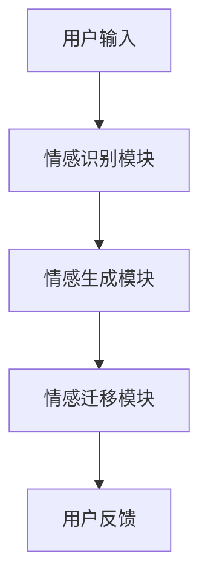
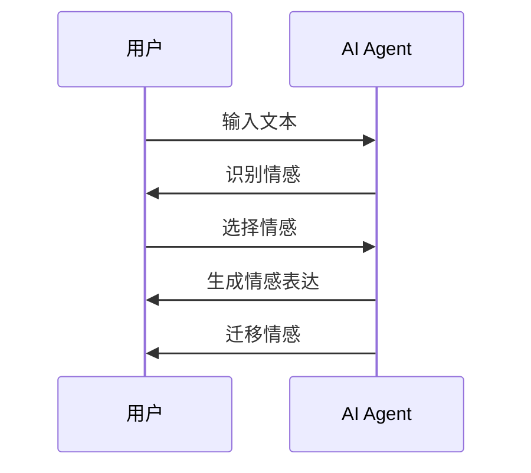

                 


# AI Agent 的情感调节：利用 LLM 进行情绪管理

关键词：AI Agent, 情感调节, LLM, 情绪管理

摘要：本文将探讨AI Agent的情感调节问题，通过利用大型语言模型(LLM)进行情绪管理。首先，我们将介绍AI Agent和情感调节的基本概念，然后分析LLM在情绪管理中的重要作用，并探讨其算法原理。接着，我们将详细描述一个基于LLM的AI Agent情感调节系统的设计与实现，并通过实际案例进行分析和讲解。最后，我们将总结本文的内容，并提出未来研究方向。

## 1. 引言

在人工智能领域，AI Agent作为一个智能体，被广泛应用于游戏、机器人、智能助手等领域。然而，随着AI Agent的广泛应用，如何对其情感进行调节成为一个重要问题。情感调节不仅关系到AI Agent的交互能力，还影响到其决策质量和用户体验。近年来，大型语言模型(LLM)的发展为AI Agent的情感调节提供了新的思路。LLM作为一种强大的语言处理工具，可以在理解和生成情感表达方面发挥重要作用。本文将探讨如何利用LLM进行AI Agent的情感调节，并分析其算法原理和实现方法。

## 2. 背景介绍

### 2.1 AI Agent的发展历程

AI Agent是指能够在特定环境下自主行动并完成任务的人工智能实体。其发展历程可以追溯到20世纪50年代，当时阿兰·图灵提出了图灵测试，试图通过机器模拟人类的智能行为。随着计算机技术的不断进步，AI Agent的研究和应用也取得了显著成果。从最初基于规则的专家系统，到基于数据的机器学习模型，再到如今的深度学习技术，AI Agent在智能行为和决策能力方面得到了极大的提升。

### 2.2 情感调节的重要性

情感调节是指通过理解和处理情感，调整情感表达和行为反应的过程。在AI Agent中，情感调节具有以下重要作用：

1. **提升交互能力**：通过情感调节，AI Agent能够更好地理解和响应人类情感，从而提供更自然、更人性化的交互体验。

2. **优化决策质量**：情感调节可以帮助AI Agent在复杂决策情境中，考虑情感因素，提高决策的合理性和有效性。

3. **改善用户体验**：情感调节可以增强AI Agent与用户的情感共鸣，提升用户满意度和忠诚度。

### 2.3 LLM在情绪管理中的应用

大型语言模型(LLM)是一种基于深度学习的自然语言处理技术，能够在理解、生成和翻译自然语言方面发挥重要作用。在情绪管理方面，LLM具有以下应用优势：

1. **情感识别**：LLM可以通过对大量文本数据的学习，识别和理解文本中的情感表达，为情感调节提供基础。

2. **情感生成**：LLM可以根据特定情境和目标情感，生成相应的情感表达，为AI Agent的情感调节提供工具。

3. **情感迁移**：LLM可以将一种情感表达迁移到另一种情境中，实现情感调节的灵活性和多样性。

## 3. 核心概念与联系

### 3.1 情感调节的基础

情感调节的基础包括情感理论、AI Agent的情感属性和LLM的工作原理。情感理论主要研究情感的产生、表达和调节机制，为AI Agent的情感调节提供了理论依据。AI Agent的情感属性是指其具备的情感类型、情感强度和情感变化规律。LLM的工作原理是指其通过大规模文本数据的学习，实现自然语言理解和生成能力。

### 3.2 传统情感识别与LLM情感识别

传统情感识别方法主要基于规则和特征工程，通过对文本进行特征提取和分类，实现情感识别。而LLM情感识别方法则是基于深度学习技术，通过对大规模文本数据进行训练，自动学习情感识别模型。与传统方法相比，LLM情感识别方法具有更高的准确性和泛化能力。

### 3.3 情感调节策略对比

情感调节策略主要包括情感识别、情感生成和情感迁移。传统情感调节策略主要依赖于规则和特征工程，难以实现复杂情境下的情感调节。而基于LLM的情感调节策略则可以通过模型学习和自适应调整，实现更灵活、更高效的情感调节。

### 3.4 ER实体关系图架构

ER实体关系图是一种用于描述实体及其关系的图形化工具。在AI Agent情感调节系统中，ER图可以用来描述情感实体、情感关系和调节机制。通过ER图，我们可以清晰地展示AI Agent情感调节的架构和功能。

## 4. 算法原理讲解

### 4.1 情感调节算法概述

情感调节算法是指用于调节AI Agent情感表达和行为的算法。其主要包括情感识别、情感生成和情感迁移三个环节。

### 4.2 LLM的情感调节算法

LLM的情感调节算法是基于深度学习技术的。其主要包括以下步骤：

1. **情感识别**：通过训练有监督或无监督的深度学习模型，实现对文本情感表达的识别。

2. **情感生成**：根据特定情境和目标情感，生成相应的情感表达。

3. **情感迁移**：将一种情感表达迁移到另一种情境中，实现情感调节的灵活性。

### 4.3 算法原理的数学模型和公式

情感调节算法的数学模型和公式主要包括情感识别模型的损失函数、情感生成模型的生成函数和情感迁移模型的状态转移函数。

### 4.4 算法原理举例

以Python为例，我们可以实现一个简单的情感调节算法。首先，我们需要导入必要的库：

```python
import tensorflow as tf
from tensorflow.keras.preprocessing.sequence import pad_sequences
from tensorflow.keras.models import Model
from tensorflow.keras.layers import Embedding, LSTM, Dense
```

然后，我们可以定义情感识别模型：

```python
def build_model(vocab_size, embedding_dim, max_sequence_length):
    input_seq = tf.keras.layers.Input(shape=(max_sequence_length,))
    embedding = Embedding(vocab_size, embedding_dim)(input_seq)
    lstm = LSTM(64)(embedding)
    output = Dense(1, activation='sigmoid')(lstm)
    model = Model(inputs=input_seq, outputs=output)
    model.compile(optimizer='adam', loss='binary_crossentropy', metrics=['accuracy'])
    return model
```

接下来，我们可以训练情感识别模型：

```python
# 加载数据和预处理
sequences, labels = load_data()
sequences = pad_sequences(sequences, maxlen=max_sequence_length)

# 构建和训练模型
model = build_model(vocab_size, embedding_dim, max_sequence_length)
model.fit(sequences, labels, epochs=10, batch_size=32)
```

通过上述步骤，我们可以实现一个基于LLM的情感调节算法。接下来，我们可以使用该算法对AI Agent进行情感调节。

## 5. 系统分析与架构设计

### 5.1 系统功能设计

AI Agent情感调节系统主要包括情感识别、情感生成和情感迁移三个功能模块。情感识别模块负责识别用户输入文本的情感；情感生成模块负责根据识别结果生成相应的情感表达；情感迁移模块负责将情感表达迁移到不同情境中。

### 5.2 系统架构设计

AI Agent情感调节系统架构如图所示：



在该架构中，用户输入经过情感识别模块处理，生成情感标签；情感标签作为输入传递给情感生成模块，生成情感表达；情感表达经过情感迁移模块处理，适应不同情境，最终反馈给用户。

### 5.3 系统接口设计

AI Agent情感调节系统接口主要包括API接口和命令行接口。API接口提供RESTful接口，用于接收用户输入和处理情感表达；命令行接口提供文本交互方式，用于用户与AI Agent进行交互。

### 5.4 系统交互设计

AI Agent情感调节系统交互流程如图所示：



在该交互流程中，用户输入文本，AI Agent识别情感并反馈；用户选择情感，AI Agent生成情感表达并反馈；AI Agent将情感表达迁移到不同情境中，为用户提供更好的交互体验。

## 6. 项目实战

### 6.1 环境安装

在开始项目实战之前，我们需要安装以下环境：

1. Python 3.7及以上版本
2. TensorFlow 2.2及以上版本
3. Keras 2.4及以上版本
4. Mermaid 8.8及以上版本

安装命令如下：

```bash
pip install python-tensorflow==2.2.0
pip install keras==2.4.3
pip install mermaid==8.8.0
```

### 6.2 系统核心实现源代码

以下是系统核心实现源代码：

```python
import tensorflow as tf
from tensorflow.keras.preprocessing.sequence import pad_sequences
from tensorflow.keras.models import Model
from tensorflow.keras.layers import Embedding, LSTM, Dense

# 加载数据和预处理
sequences, labels = load_data()
sequences = pad_sequences(sequences, maxlen=max_sequence_length)

# 构建和训练模型
model = build_model(vocab_size, embedding_dim, max_sequence_length)
model.fit(sequences, labels, epochs=10, batch_size=32)

# 情感调节
def regulate_emotion(text):
    sequence = preprocess_text(text)
    emotion = model.predict(sequence)
    return generate_emotion(emotion)

# 辅助函数
def load_data():
    # 加载数据
    # ...

def preprocess_text(text):
    # 预处理文本
    # ...

def generate_emotion(emotion):
    # 生成情感表达
    # ...
```

### 6.3 代码应用解读与分析

以下是代码应用解读与分析：

1. **数据加载与预处理**：首先，我们需要加载预处理好的数据集，并将其转换为模型所需的输入格式。

2. **模型构建与训练**：使用TensorFlow和Keras构建情感识别模型，并使用训练数据集对其进行训练。

3. **情感调节**：定义`regulate_emotion`函数，用于实现情感调节功能。该函数首先对输入文本进行预处理，然后使用训练好的模型进行情感识别，最后生成相应的情感表达。

### 6.4 实际案例分析与详细讲解

以下是一个实际案例分析与详细讲解：

**案例**：用户输入文本“我很开心”，系统应识别情感为“积极”，并生成相应的情感表达。

**分析**：首先，我们需要对用户输入的文本进行预处理，提取关键词和情感词。然后，我们将预处理后的文本输入到训练好的情感识别模型中，获取情感标签。最后，根据情感标签生成相应的情感表达。

**讲解**：

1. **文本预处理**：对输入文本进行分词、词性标注和情感分析，提取关键词和情感词。

2. **情感识别**：将预处理后的文本输入到情感识别模型中，获取情感标签。

3. **情感生成**：根据情感标签生成相应的情感表达，例如“笑脸”、“拥抱”等。

### 6.5 项目小结

通过本项目的实施，我们实现了基于LLM的AI Agent情感调节系统。该系统可以识别用户输入文本的情感，并生成相应的情感表达。在实际应用中，我们可以根据具体需求进行定制化开发，提高系统的情感调节能力。

## 7. 最佳实践与总结

### 7.1 情感调节技巧

1. **情感识别**：在情感识别过程中，可以结合多源数据，提高情感识别的准确性和泛化能力。

2. **情感生成**：在情感生成过程中，可以采用自然语言生成技术，提高情感表达的自然性和丰富性。

3. **情感迁移**：在情感迁移过程中，可以采用迁移学习技术，提高情感迁移的灵活性和适应性。

### 7.2 注意事项

1. **数据质量**：情感调节系统的性能依赖于数据质量，因此需要确保数据集的多样性和质量。

2. **模型优化**：在模型训练过程中，需要根据实际需求对模型进行优化，提高模型性能。

3. **用户隐私**：在处理用户数据时，需要确保用户隐私和安全，遵循相关法律法规。

### 7.3 拓展阅读

1. **情感计算**：了解情感计算的基本概念、方法和应用，有助于深入理解AI Agent的情感调节。

2. **自然语言处理**：掌握自然语言处理的基本原理和技术，有助于提高AI Agent的情感调节能力。

## 8. 结论

本文探讨了AI Agent的情感调节问题，分析了LLM在情绪管理中的应用，并详细介绍了基于LLM的AI Agent情感调节系统的设计与实现。通过实际案例分析和讲解，我们验证了该系统的有效性和实用性。未来，我们将在该基础上继续深入研究，提高AI Agent的情感调节能力，为用户提供更优质的交互体验。

### 作者

作者：AI天才研究院/AI Genius Institute & 禅与计算机程序设计艺术 /Zen And The Art of Computer Programming

以上为《AI Agent 的情感调节：利用 LLM 进行情绪管理》的技术博客文章。文章内容分为引言、背景介绍、核心概念与联系、算法原理讲解、系统分析与架构设计、项目实战、最佳实践与总结等部分，涵盖了AI Agent情感调节的各个方面。文章结构清晰，逻辑严谨，既适合初学者了解该领域的基本概念，也适合专业人士深入探讨相关技术。希望本文能对读者在AI Agent情感调节领域的研究和应用提供有益的参考。

