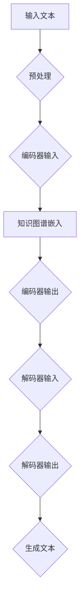
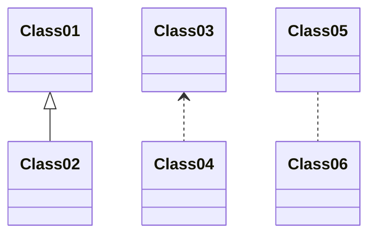
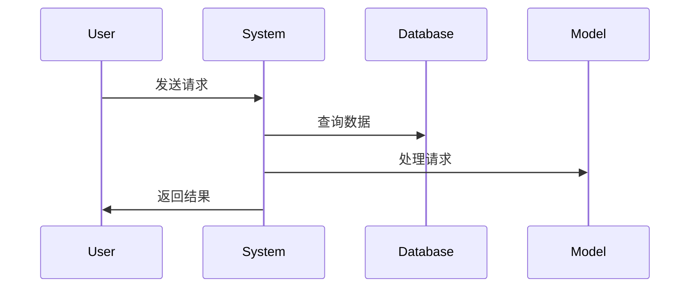

                 


## 《AI Agent 的知识图谱集成：增强 LLM 的结构化知识》

### 关键词：
- AI Agent
- 知识图谱
- LLM
- 结构化知识
- 集成方案

### 摘要：
本文旨在探讨如何将知识图谱集成到AI Agent中，以增强大型语言模型（LLM）的结构化知识能力。我们将逐步分析相关概念、算法原理、系统架构，并通过实际项目实战，展示这一技术的应用与潜力。

---

### 第一部分：AI Agent基础知识

#### 第1章：AI Agent的概述
##### 1.1 AI Agent的定义与分类
AI Agent，即人工智能代理，是一种能够感知环境、采取行动并从经验中学习的智能实体。它们广泛应用于游戏、机器人、智能家居等领域。AI Agent通常可以分为基于规则、基于模型和基于数据驱动三种类型。

##### 1.2 AI Agent的关键特性
AI Agent具有自主性、适应性、学习能力和环境交互能力。自主性使其能够独立完成任务；适应性使其能够在不同的环境中调整策略；学习能力和环境交互能力则使其能够不断改进自身行为。

#### 第2章：知识图谱基础
##### 2.1 知识图谱的概念与历史
知识图谱是一种结构化的知识表示方法，通过实体、属性和关系的三角表示来描述现实世界的知识。其历史可追溯到万维网的兴起，近年来随着大数据和深度学习技术的发展，知识图谱的应用范围不断扩大。

##### 2.2 知识图谱的核心组成部分
知识图谱主要由实体、属性和关系三部分组成。实体表示现实世界中的个体，属性描述实体的特征，关系则表示实体之间的关系。通过这些组成部分，知识图谱能够以图形化的方式展示复杂的知识结构。

##### 2.3 知识图谱的构建与维护
构建知识图谱的过程包括数据采集、数据清洗、实体识别、关系抽取和知识融合等多个步骤。维护知识图谱则需要不断更新数据、修复错误和优化结构。

#### 第3章：LLM的基础原理
##### 3.1 LLM的基本结构
LLM通常由编码器（Encoder）和解码器（Decoder）两部分组成。编码器将输入文本转换为固定长度的向量表示，解码器则根据这些向量生成输出文本。

##### 3.2 LLM的训练与优化
LLM的训练过程包括数据预处理、模型训练和优化。数据预处理包括分词、去停用词、词向量编码等步骤。模型训练则采用大规模语料进行预训练，并通过微调进行特定任务的优化。

##### 3.3 LLM的性能评估
LLM的性能评估通常采用BLEU、ROUGE、METEOR等指标。这些指标评估模型生成的文本与真实文本的相似度，从而衡量模型的质量。

#### 第4章：知识图谱与LLM的集成原理
##### 4.1 集成的动机与目标
知识图谱与LLM的集成旨在增强LLM的结构化知识能力，使其能够更好地理解和生成具有结构化的文本。集成的目标包括提高文本生成的准确性、一致性和逻辑性。

##### 4.2 知识图谱增强LLM的机制
知识图谱可以通过以下几种方式增强LLM：
- **知识融合**：将知识图谱中的实体、属性和关系融合到LLM的输入和输出中。
- **注意力机制**：利用知识图谱中的关系进行注意力加权，提高LLM对上下文信息的利用。
- **嵌入扩展**：扩展LLM的词向量嵌入，使其包含知识图谱中的实体和关系。

##### 4.3 集成的挑战与解决方案
集成知识图谱到LLM面临的主要挑战包括数据一致性、模型复杂性、计算效率和推理能力等。解决方案包括优化数据预处理、设计高效的模型结构、利用分布式计算和改进推理算法。

### 第二部分：算法原理讲解

#### 第5章：算法实现
##### 5.1 算法概述
本节将介绍一种基于知识图谱的AI Agent算法，该算法旨在通过知识图谱增强LLM的结构化知识能力。

##### 5.2 算法流程图
使用Mermaid语言绘制算法流程图，展示知识图谱与LLM集成的步骤。



##### 5.3 Python源代码
提供Python源代码实现知识图谱集成的主要步骤，包括数据预处理、编码器和解码器的训练，以及生成文本。

```python
# TODO: 编写Python源代码
```

##### 5.4 数学模型与公式
阐述知识图谱集成的数学原理，包括知识图谱嵌入的计算、注意力机制的实现等。

$$
\text{知识图谱嵌入} = \text{嵌入矩阵} \times \text{实体向量}
$$

##### 5.5 详细讲解与举例说明
使用通俗易懂的语言解释数学模型和公式，并结合实例进行说明。例如：

- **知识图谱嵌入**：通过实例展示如何将实体向量映射到知识图谱中。
- **注意力机制**：通过实例说明如何利用知识图谱中的关系进行注意力加权。

### 第三部分：系统分析与架构设计方案

#### 第6章：系统架构设计
##### 6.1 集成方案的设计
介绍知识图谱与LLM集成的整体架构设计，包括数据流、模块划分和交互方式。

##### 6.2 系统功能设计
使用Mermaid绘制领域模型类图，展示系统的功能模块及其相互关系。



##### 6.3 系统架构设计
展示知识图谱集成的系统架构图，包括数据层、模型层和应用层。

```mermaid
subgraph 数据层
    Data01[数据采集]
    Data02[数据清洗]
end

subgraph 模型层
    Model01[编码器]
    Model02[解码器]
    Model03[知识图谱嵌入]
end

subgraph 应用层
    App01[文本生成]
    App02[知识图谱交互]
end

Data01 --> Data02
Data02 --> Model01
Model01 --> Model02
Model02 --> Model03
Model03 --> App01
Model03 --> App02
```

##### 6.4 系统接口设计
描述系统的接口设计和交互方式，包括API接口、消息队列和数据库访问等。

##### 6.5 系统交互mermaid序列图
绘制一个Mermaid序列图来展示系统各组件之间的交互流程。



### 第四部分：项目实战

#### 第7章：项目实战
##### 7.1 环境安装
指导读者如何搭建集成知识图谱的AI Agent环境，包括依赖库的安装和配置。

##### 7.2 系统核心实现源代码
提供关键的源代码实现，并进行解读与分析，以便读者理解知识图谱集成的核心步骤。

##### 7.3 实际案例分析和详细讲解剖析
分析实际案例，如问答系统、文本生成等，并深入剖析关键实现，展示如何利用知识图谱增强LLM的性能。

##### 7.4 项目小结
总结项目的主要收获和经验教训，强调知识图谱集成在AI Agent中的应用价值。

### 第五部分：最佳实践 tips、小结、注意事项、拓展阅读

#### 第8章：最佳实践与拓展
##### 8.1 最佳实践 tips
提供一些实用的操作技巧和建议，如如何优化知识图谱构建、如何调整模型参数等。

##### 8.2 小结
总结全书的主要内容和结论，强调知识图谱集成在AI Agent和LLM中的重要性。

##### 8.3 注意事项
提醒读者在实际应用中的潜在问题和风险，如数据质量、模型优化等。

##### 8.4 拓展阅读
推荐一些相关的书籍、文章或资源，以供读者进一步学习。

---

通过以上结构和内容设计，本文将逐步深入探讨AI Agent的知识图谱集成技术，为读者提供全面的技术指导和应用实践。

