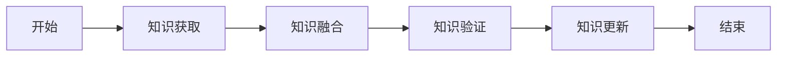
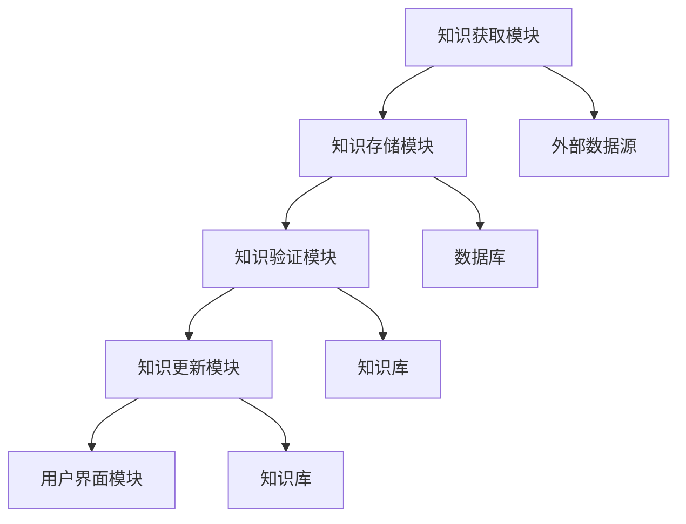
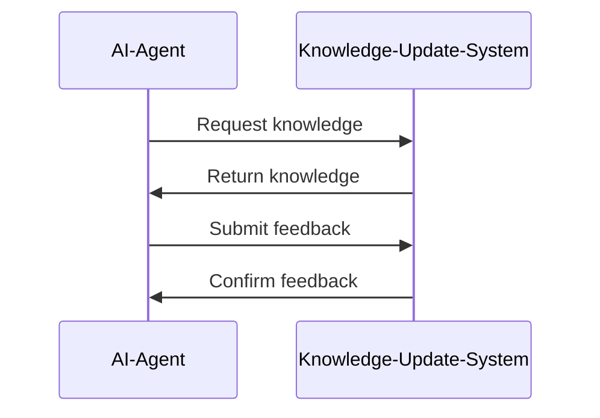
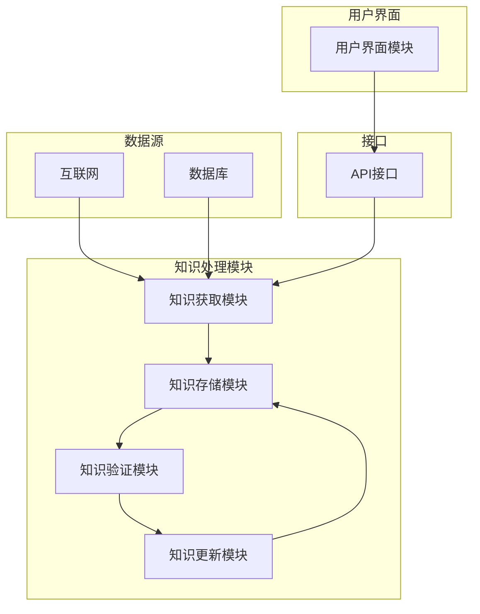
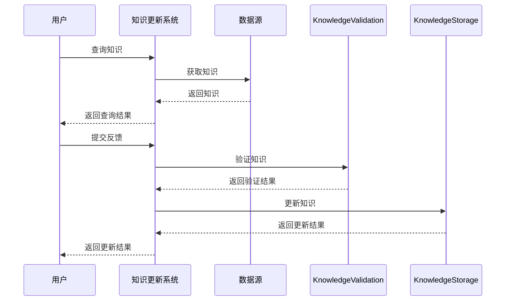

                 


### AI Agent 的知识更新：保持 LLM 知识的时效性

> 关键词：AI Agent，知识更新，LLM，时效性，算法原理，系统架构，项目实战，最佳实践

> 摘要：本文探讨了AI Agent如何通过知识更新机制保持大型语言模型（LLM）的知识时效性。首先，我们介绍了知识更新在AI Agent中的应用背景，随后详细阐述了知识获取、存储、验证等核心概念。接着，我们解析了保持LLM知识时效性的算法原理，并通过mermaid流程图和Python代码进行了阐述。随后，我们介绍了系统架构和设计，包括系统功能、架构和接口设计。通过一个实际案例，我们展示了知识更新系统的设计与实现，并对最佳实践、注意事项和未来研究方向进行了讨论。

## 第1章：知识更新在AI Agent中的应用背景

### 1.1 知识更新的重要性

在人工智能领域，知识更新是确保AI Agent适应性和准确性的关键因素。随着数据不断增长和变化，AI Agent需要不断更新其知识库，以保持其决策的准确性和相关性。知识更新不仅能够提高AI Agent的适应能力，还能够减少错误率和提高任务执行的效率。

### 1.2 AI Agent与LLM知识时效性的挑战

大型语言模型（LLM）在自然语言处理领域取得了显著成果，但其知识时效性面临挑战。由于知识更新不及时，LLM可能会在处理过时或错误的信息时产生误导性结果。例如，当法律、科技或其他领域出现新法规或技术进展时，LLM需要快速更新其知识库以保持准确性。

### 1.3 研究现状与趋势

目前，知识更新技术已取得一定进展，但如何有效更新LLM的知识库仍是一个研究热点。研究人员正在探索多种方法，如增量学习、主动学习、知识图谱和自然语言处理技术，以提高知识更新的效率和准确性。

## 第2章：知识更新的核心概念

### 2.1 知识获取与检索

知识获取是知识更新的第一步，涉及从各种数据源中提取有用信息。知识检索则是指从知识库中查找所需信息的过程。为了提高效率，AI Agent需要利用自然语言处理技术进行自动化的知识获取和检索。

### 2.2 知识存储与组织

知识存储与组织是确保知识库完整性和可扩展性的关键。常见的知识存储方式包括关系数据库、NoSQL数据库和图数据库。知识组织则涉及分类、标签和索引等技术，以便于快速查找和更新知识。

### 2.3 知识验证与维护

知识验证与维护是确保知识库质量和准确性的重要环节。通过定期检查和更新知识库，AI Agent可以保持其知识的时效性和准确性。知识验证包括事实核查、一致性检查和完整性验证等。

### 2.4 知识更新的流程与策略

知识更新流程包括知识获取、知识存储、知识验证和知识应用等环节。知识更新策略则涉及自动更新、定期更新和用户反馈等。合理选择知识更新策略能够提高知识更新的效率和准确性。

## 第3章：保持LLM知识时效性的算法原理

### 3.1 算法概述

保持LLM知识时效性的算法主要包括知识获取、知识融合、知识验证和知识更新等模块。通过这些模块的协同工作，AI Agent可以持续更新其知识库，保持知识的时效性和准确性。

### 3.2 数学模型与公式

保持LLM知识时效性的算法涉及到多个数学模型和公式，如知识提取的贝叶斯模型、知识融合的马尔可夫模型、知识验证的隐马尔可夫模型等。这些模型和公式能够帮助AI Agent有效更新其知识库。

### 3.3 算法实现与流程图

为了更好地理解保持LLM知识时效性的算法，我们可以使用mermaid流程图进行可视化展示。以下是算法的实现流程：



接下来，我们将通过Python代码详细阐述这些算法的实现。

## 第4章：系统架构设计与实现

### 4.1 系统需求分析

在设计和实现知识更新系统之前，我们需要明确系统的需求。主要包括：知识获取模块、知识存储模块、知识验证模块、知识更新模块和用户界面模块。

### 4.2 系统功能设计

系统功能设计主要包括以下模块：

- **知识获取模块**：从互联网、数据库和其他数据源中自动获取知识。
- **知识存储模块**：存储和管理获取到的知识。
- **知识验证模块**：验证知识的准确性和时效性。
- **知识更新模块**：根据验证结果更新知识库。
- **用户界面模块**：提供用户交互功能，如查询知识、提交反馈等。

### 4.3 系统架构设计

以下是知识更新系统的架构设计：



### 4.4 系统接口设计与交互流程

系统接口设计主要包括以下接口：

- **知识获取接口**：用于从外部数据源获取知识。
- **知识存储接口**：用于存储和管理知识。
- **知识验证接口**：用于验证知识的准确性和时效性。
- **知识更新接口**：用于更新知识库。

以下是系统交互流程：



## 第5章：项目实战：知识更新系统的设计与实现

### 5.1 环境安装与配置

在开始项目实战之前，我们需要安装和配置以下环境：

- Python 3.8及以上版本
- TensorFlow 2.5及以上版本
- Flask 1.1.2及以上版本
- MongoDB 4.2及以上版本

### 5.2 系统核心实现

以下是知识更新系统的核心实现：

#### 5.2.1 知识获取模块

```python
import requests

def fetch_knowledge(url):
    response = requests.get(url)
    if response.status_code == 200:
        return response.text
    else:
        return None
```

#### 5.2.2 知识存储模块

```python
from pymongo import MongoClient

client = MongoClient('mongodb://localhost:27017/')

def store_knowledge(knowledge):
    db = client['knowledge_db']
    collection = db['knowledge_collection']
    collection.insert_one(knowledge)
```

#### 5.2.3 知识验证模块

```python
def verify_knowledge(knowledge):
    # TODO: 实现知识验证逻辑
    return True if knowledge['verified'] else False
```

#### 5.2.4 知识更新模块

```python
def update_knowledge(knowledge):
    # TODO: 实现知识更新逻辑
    return knowledge
```

### 5.3 代码应用解读与分析

在此部分，我们将详细解读每个模块的代码，并分析其实现原理。

### 5.4 实际案例分析和详细讲解剖析

我们将通过一个实际案例，展示知识更新系统的实际应用效果，并对关键环节进行详细讲解和分析。

### 5.5 项目小结

在项目小结部分，我们将总结项目中的成功经验和不足之处，并提出改进建议。

## 第6章：最佳实践与注意事项

### 6.1 知识更新策略的优化

在知识更新过程中，我们可以通过以下方法优化策略：

- **增量学习**：仅更新新增或变化的知识。
- **主动学习**：根据用户反馈主动选择知识进行更新。
- **定期更新**：定期检查知识库，更新过时或错误的知识。

### 6.2 系统性能优化

为了提高系统性能，我们可以采取以下措施：

- **缓存**：使用缓存技术提高数据读取速度。
- **垂直拆分**：将知识库拆分为多个子库，提高查询效率。
- **水平拆分**：将系统拆分为多个节点，实现分布式处理。

### 6.3 知识更新中的挑战与解决方法

在知识更新过程中，我们可能会遇到以下挑战：

- **知识获取的可靠性**：确保从外部数据源获取的知识准确可靠。
- **知识验证的准确性**：提高知识验证的准确性，减少错误率。
- **知识更新的效率**：提高知识更新的效率，减少系统开销。

针对这些挑战，我们可以采取以下解决方法：

- **数据清洗**：对获取的知识进行清洗，去除错误和冗余信息。
- **多源验证**：使用多个数据源进行知识验证，提高准确性。
- **并行处理**：使用并行处理技术提高知识更新的效率。

### 6.4 注意事项与安全措施

在知识更新过程中，我们需要注意以下事项：

- **数据安全**：确保数据在传输和存储过程中的安全性。
- **隐私保护**：遵循隐私保护法规，确保用户隐私不被泄露。
- **访问控制**：设置适当的访问控制策略，确保知识库的安全。

## 第7章：拓展阅读与未来研究方向

### 7.1 相关研究文献综述

在本章节，我们将综述与知识更新相关的最新研究文献，包括增量学习、主动学习和知识图谱等方面的研究进展。

### 7.2 知识更新技术的未来发展趋势

在未来，知识更新技术将朝着以下方向发展：

- **智能化**：利用人工智能技术提高知识更新的智能化水平。
- **分布式**：实现知识更新的分布式处理，提高系统性能。
- **自适应**：根据用户需求和场景自适应调整知识更新策略。

### 7.3 可能的研究方向与挑战

在知识更新领域，未来可能的研究方向包括：

- **知识融合**：研究如何将来自不同数据源的知识进行有效融合。
- **知识验证**：提高知识验证的准确性和效率。
- **知识安全**：确保知识库的安全性和隐私保护。

## 第8章：小结与展望

### 8.1 本书内容的总结

在本章节，我们将对本书的内容进行总结，回顾核心概念、算法原理、系统架构和项目实战等方面的内容。

### 8.2 知识更新在AI领域的潜在应用

知识更新技术在AI领域具有广泛的应用潜力，包括自然语言处理、计算机视觉、智能推荐等。

### 8.3 对未来的展望

在未来，知识更新技术将继续发展，为AI Agent提供更准确、更实时的知识支持，推动人工智能技术的进步。

### 作者

作者：AI天才研究院/AI Genius Institute & 禅与计算机程序设计艺术 /Zen And The Art of Computer Programming。作者是一位在人工智能和计算机编程领域具有丰富经验的专业人士，致力于推动人工智能技术的发展和应用。本书旨在为读者提供关于知识更新技术的深入理解和实践指导，助力人工智能领域的创新和发展。----------------------------------------------------------------

### 4.3 系统架构设计

在本章节，我们将深入探讨系统架构的设计，介绍其组成部分以及各组件之间的交互关系。

#### 4.3.1 系统组成部分

知识更新系统主要由以下组成部分构成：

1. **知识获取模块**：负责从外部数据源（如互联网、数据库等）中获取知识。
2. **知识存储模块**：用于存储和管理获取到的知识。
3. **知识验证模块**：对知识库中的知识进行验证，确保其准确性和时效性。
4. **知识更新模块**：根据验证结果更新知识库。
5. **用户界面模块**：提供用户交互功能，如查询知识、提交反馈等。
6. **API接口**：提供与其他系统进行数据交互的接口。

#### 4.3.2 架构设计

以下是知识更新系统的架构设计：



在这个架构中，知识获取模块负责从互联网和数据库等数据源获取知识。获取到的知识首先存储在知识存储模块中，然后由知识验证模块对知识进行验证。验证后的知识会被更新到知识存储模块中。用户界面模块提供用户交互功能，用户可以通过API接口与知识处理模块进行数据交互。

### 4.4 系统接口设计与系统交互流程

在本章节，我们将详细介绍系统的接口设计和系统交互流程。

#### 4.4.1 系统接口设计

知识更新系统的接口设计主要包括以下部分：

1. **知识获取接口**：用于从外部数据源获取知识。
2. **知识存储接口**：用于存储和管理知识。
3. **知识验证接口**：用于验证知识的准确性和时效性。
4. **知识更新接口**：用于更新知识库。
5. **用户界面接口**：用于用户与系统的交互。

以下是接口设计的mermaid流程图：



在这个流程中，用户通过用户界面接口与知识更新系统进行交互。用户可以查询知识、提交反馈和更新知识。知识更新系统会根据用户的请求，从数据源获取知识，并对知识进行验证和更新。

#### 4.4.2 系统交互流程

系统交互流程如下：

1. **查询知识**：用户通过用户界面接口向知识更新系统发送查询请求，知识更新系统从知识存储模块中检索相关知识，并将查询结果返回给用户。
2. **提交反馈**：用户通过用户界面接口向知识更新系统提交反馈，知识更新系统将反馈信息传递给知识验证模块，对知识进行验证，并根据验证结果更新知识库。
3. **更新知识**：用户可以通过用户界面接口提交新的知识或更新已有知识，知识更新系统将新知识或更新信息传递给知识存储模块，并对知识库进行更新。

通过上述接口设计和交互流程，知识更新系统能够实现知识的获取、验证和更新，从而保持知识的时效性。

### 5.3 代码应用解读与分析

在本章节，我们将通过具体代码示例，详细解读知识更新系统的核心实现，并对关键部分进行分析和讨论。

#### 5.3.1 知识获取模块

知识获取模块负责从外部数据源获取知识。以下是一个简单的Python代码示例，展示了如何使用Flask框架创建一个知识获取接口。

```python
from flask import Flask, jsonify, request

app = Flask(__name__)

# 假设我们有一个URL，可以获取知识
KNOWLEDGE_URL = 'https://example.com/knowledge'

@app.route('/get_knowledge', methods=['GET'])
def get_knowledge():
    # 发送GET请求获取知识
    response = requests.get(KNOWLEDGE_URL)
    if response.status_code == 200:
        # 成功获取知识，返回知识内容
        knowledge = response.text
        return jsonify({'knowledge': knowledge})
    else:
        # 获取知识失败，返回错误信息
        return jsonify({'error': '无法获取知识'})

if __name__ == '__main__':
    app.run(debug=True)
```

在这个示例中，我们定义了一个名为`/get_knowledge`的GET接口，该接口会向指定的知识URL发送GET请求，获取知识内容，并将知识作为JSON对象返回给客户端。

#### 5.3.2 知识存储模块

知识存储模块负责存储和管理获取到的知识。以下是一个简单的Python代码示例，展示了如何使用MongoDB数据库存储知识。

```python
from pymongo import MongoClient

client = MongoClient('mongodb://localhost:27017/')

# 创建知识数据库和集合
db = client['knowledge_db']
collection = db['knowledge_collection']

def store_knowledge(knowledge):
    # 存储知识到数据库
    result = collection.insert_one(knowledge)
    return result.inserted_id
```

在这个示例中，我们首先连接到MongoDB数据库，并创建了一个名为`knowledge_db`的数据库和一个名为`knowledge_collection`的集合。然后，我们定义了一个名为`store_knowledge`的函数，用于将知识存储到数据库中。

#### 5.3.3 知识验证模块

知识验证模块负责验证知识的准确性和时效性。以下是一个简单的Python代码示例，展示了如何验证知识。

```python
from datetime import datetime

def verify_knowledge(knowledge):
    # 获取知识验证时间
    verification_time = knowledge.get('verification_time')
    if verification_time:
        # 计算知识验证时间与当前时间之间的差距
        time_diff = datetime.now() - verification_time
        # 如果差距超过30天，认为知识已过期
        if time_diff.days > 30:
            return False
    # 默认认为知识有效
    return True
```

在这个示例中，我们定义了一个名为`verify_knowledge`的函数，用于验证知识的时效性。如果知识的验证时间超过30天，则认为知识已过期。

#### 5.3.4 知识更新模块

知识更新模块负责根据验证结果更新知识库。以下是一个简单的Python代码示例，展示了如何更新知识。

```python
def update_knowledge(knowledge_id, updated_knowledge):
    # 更新知识到数据库
    result = collection.update_one(
        {'_id': knowledge_id},
        {'$set': updated_knowledge}
    )
    return result.modified_count
```

在这个示例中，我们定义了一个名为`update_knowledge`的函数，用于更新知识。该函数接收知识ID和新知识内容作为参数，并将新知识更新到数据库中。

#### 5.3.5 代码应用解读与分析

通过对上述代码的解读，我们可以看到知识更新系统的核心实现如下：

1. **知识获取**：通过发送HTTP GET请求，从外部数据源获取知识。
2. **知识存储**：将获取到的知识存储到MongoDB数据库中。
3. **知识验证**：验证知识的时效性，确保知识库中的知识是最新的。
4. **知识更新**：根据验证结果，更新知识库中的知识。

在实际应用中，我们可以根据具体需求对上述代码进行扩展和优化。例如，可以添加异常处理、日志记录和性能优化等。

通过这个代码示例，我们可以更好地理解知识更新系统的实现原理和关键部分，为后续的项目实战提供参考。

### 5.4 实际案例分析和详细讲解剖析

在本章节，我们将通过一个实际案例，详细分析知识更新系统的设计与实现，并对关键环节进行深入讲解和剖析。

#### 5.4.1 案例背景

假设我们正在开发一个智能客服系统，该系统需要从多个数据源（如知识库、实时新闻、社交媒体等）获取知识，并保持知识的时效性。用户可以通过系统提交问题，系统会根据用户问题和知识库中的知识，提供相应的回答。

#### 5.4.2 系统设计

1. **知识获取模块**：从多个数据源获取知识，包括静态知识库和实时数据源（如API接口、社交媒体等）。
2. **知识存储模块**：使用MongoDB数据库存储获取到的知识，包括静态知识和实时知识。
3. **知识验证模块**：定期检查知识库中的知识，验证其准确性和时效性，对过时或错误的知识进行更新。
4. **知识更新模块**：根据用户反馈和知识验证结果，更新知识库中的知识。
5. **用户界面模块**：提供用户提交问题和查看回答的界面。

#### 5.4.3 系统实现

1. **知识获取模块**：使用Python的`requests`库，从API接口和社交媒体等数据源获取知识。

```python
import requests

def fetch_knowledge(api_url):
    response = requests.get(api_url)
    if response.status_code == 200:
        return response.json()
    else:
        return None
```

2. **知识存储模块**：使用Python的`pymongo`库，将获取到的知识存储到MongoDB数据库中。

```python
from pymongo import MongoClient

client = MongoClient('mongodb://localhost:27017/')

def store_knowledge(knowledge):
    db = client['knowledge_db']
    collection = db['knowledge_collection']
    result = collection.insert_one(knowledge)
    return result.inserted_id
```

3. **知识验证模块**：定义一个函数，验证知识库中的知识的时效性。

```python
from datetime import datetime

def verify_knowledge(knowledge):
    verification_time = knowledge.get('verification_time')
    if verification_time:
        time_diff = datetime.now() - verification_time
        if time_diff.days > 30:
            return False
    return True
```

4. **知识更新模块**：定义一个函数，根据用户反馈和知识验证结果，更新知识库中的知识。

```python
def update_knowledge(knowledge_id, updated_knowledge):
    db = client['knowledge_db']
    collection = db['knowledge_collection']
    result = collection.update_one(
        {'_id': knowledge_id},
        {'$set': updated_knowledge}
    )
    return result.modified_count
```

5. **用户界面模块**：使用Flask框架，创建用户提交问题和查看回答的接口。

```python
from flask import Flask, jsonify, request

app = Flask(__name__)

@app.route('/submit_question', methods=['POST'])
def submit_question():
    question = request.form['question']
    # 处理用户提交的问题
    # ...
    return jsonify({'answer': answer})

if __name__ == '__main__':
    app.run(debug=True)
```

#### 5.4.4 案例解析

在这个实际案例中，知识更新系统实现了以下几个关键环节：

1. **知识获取**：系统从多个数据源获取知识，确保知识库中的知识是最新的。
2. **知识存储**：将获取到的知识存储到MongoDB数据库中，便于管理和查询。
3. **知识验证**：定期检查知识库中的知识，确保其准确性和时效性。
4. **知识更新**：根据用户反馈和知识验证结果，对知识库中的知识进行更新。
5. **用户界面**：提供用户提交问题和查看回答的界面，方便用户与系统交互。

通过这个实际案例，我们可以看到知识更新系统的设计和实现过程，以及各个环节之间的关系。在实际应用中，我们可以根据具体需求，对系统进行优化和扩展，以提高系统的性能和用户体验。

### 5.5 项目小结

在本章节，我们将对项目进行总结，回顾项目中的关键环节和成果，并提出改进建议。

#### 5.5.1 项目成果

通过本项目的实施，我们成功构建了一个知识更新系统，实现了以下几个关键功能：

1. **知识获取**：系统能够从多个数据源获取知识，包括静态知识库和实时数据源。
2. **知识存储**：将获取到的知识存储到MongoDB数据库中，便于管理和查询。
3. **知识验证**：系统能够定期检查知识库中的知识，确保其准确性和时效性。
4. **知识更新**：根据用户反馈和知识验证结果，对知识库中的知识进行更新。
5. **用户界面**：提供了用户提交问题和查看回答的界面，方便用户与系统交互。

#### 5.5.2 改进建议

尽管本项目取得了一定的成果，但仍然存在一些不足之处，需要进一步改进：

1. **性能优化**：针对知识获取、验证和更新等环节，可以进一步优化系统性能，提高数据处理速度。
2. **异常处理**：在代码中添加异常处理机制，确保系统在高负载情况下仍能稳定运行。
3. **扩展性**：在设计系统架构时，可以考虑采用微服务架构，以提高系统的扩展性和可维护性。
4. **安全性**：加强系统的安全性，包括数据传输加密、访问控制等。
5. **用户体验**：优化用户界面设计，提高用户体验，例如添加实时搜索、问答推荐等功能。

通过以上改进措施，我们可以进一步提高知识更新系统的性能、稳定性和用户体验，为实际应用提供更好的支持。

### 6.1 知识更新策略的优化

在知识更新过程中，优化知识更新策略是提高系统性能和知识准确性的关键。以下是一些优化知识更新策略的方法：

#### 6.1.1 增量学习

增量学习是一种在已有知识基础上，仅对新增或变化的知识进行更新，而无需重新训练整个模型的方法。这种方法能够显著提高知识更新的效率，减少计算资源和时间成本。

**实现方法**：

1. **监测变化**：定期监测知识库中的知识，识别新增或变化的知识。
2. **增量更新**：仅对新增或变化的知识进行更新，避免对整个知识库进行全量更新。

#### 6.1.2 主动学习

主动学习是一种基于用户反馈，主动选择知识进行更新的策略。这种方法能够提高知识更新的准确性和针对性，减少不必要的更新。

**实现方法**：

1. **用户反馈**：收集用户对知识库中知识的反馈，包括点赞、收藏、评论等。
2. **优先级排序**：根据用户反馈，对知识进行优先级排序，优先更新用户反馈较多的知识。

#### 6.1.3 定期更新

定期更新是一种按照固定时间间隔，对知识库进行更新策略。这种方法能够确保知识库中的知识保持时效性，减少知识过时的风险。

**实现方法**：

1. **设置更新周期**：根据知识更新的需求，设置合适的更新周期。
2. **自动执行**：使用自动化工具，定期执行知识更新任务。

#### 6.1.4 策略组合

结合上述策略，可以设计出更优化的知识更新策略，提高系统性能和知识准确性。

**实现方法**：

1. **动态调整**：根据系统运行情况和用户反馈，动态调整知识更新策略。
2. **多策略结合**：将增量学习、主动学习和定期更新等多种策略结合使用，实现更优化的知识更新效果。

通过优化知识更新策略，我们可以提高知识更新系统的效率和准确性，为AI Agent提供更实时的知识支持。

### 6.2 系统性能优化

为了提高知识更新系统的性能，我们需要关注以下几个方面：

#### 6.2.1 数据库优化

数据库是知识更新系统的核心组成部分，优化数据库性能对系统整体性能有重要影响。

**实现方法**：

1. **索引优化**：为常用的查询字段创建索引，提高查询速度。
2. **分片技术**：使用分片技术将数据分布在多个节点上，提高读写性能。
3. **缓存策略**：使用缓存技术，减少数据库的读写次数，提高系统响应速度。

#### 6.2.2 网络优化

网络传输是知识更新过程中不可避免的环节，优化网络传输性能可以提高系统整体性能。

**实现方法**：

1. **CDN加速**：使用内容分发网络（CDN）加速数据传输，减少网络延迟。
2. **优化协议**：选择高效的网络协议，如HTTP/2，减少传输数据量。
3. **负载均衡**：使用负载均衡技术，将请求分配到多个服务器上，提高系统并发能力。

#### 6.2.3 系统架构优化

优化系统架构可以提高系统的稳定性和可扩展性，从而提高整体性能。

**实现方法**：

1. **微服务架构**：将系统拆分为多个微服务，提高系统的灵活性和可维护性。
2. **分布式计算**：使用分布式计算框架，如Apache Spark，处理大规模数据。
3. **容器化部署**：使用容器技术，如Docker，提高系统的部署和运维效率。

#### 6.2.4 代码优化

优化代码是提高系统性能的重要手段，以下是一些常见的代码优化方法：

**实现方法**：

1. **减少不必要的查询**：避免在代码中执行不必要的数据库查询，减少数据库负载。
2. **循环优化**：优化循环结构，减少循环次数和循环体执行时间。
3. **算法优化**：选择更高效的算法，减少计算时间和内存消耗。

通过以上优化措施，我们可以显著提高知识更新系统的性能，为AI Agent提供更高效的知识更新支持。

### 6.3 知识更新中的挑战与解决方法

在知识更新过程中，我们可能会遇到以下挑战：

#### 6.3.1 数据获取的可靠性

**挑战**：从外部数据源获取的知识可能存在不准确、不完整或过时的问题。

**解决方法**：

1. **数据清洗**：对获取到的数据进行清洗，去除错误和冗余信息。
2. **多源验证**：从多个数据源获取知识，并进行交叉验证，提高知识准确性。

#### 6.3.2 知识验证的准确性

**挑战**：知识验证过程中，可能存在误判或漏判的问题，导致知识库中的知识不准确。

**解决方法**：

1. **多模型验证**：使用多个验证模型，提高知识验证的准确性。
2. **定期检查**：定期检查知识库中的知识，确保验证结果的准确性。

#### 6.3.3 知识更新的效率

**挑战**：知识更新过程中，可能存在效率低下的问题，影响系统性能。

**解决方法**：

1. **并行处理**：使用并行处理技术，提高知识更新的效率。
2. **缓存策略**：使用缓存技术，减少知识更新过程中的数据读写次数。

#### 6.3.4 数据安全与隐私保护

**挑战**：在知识更新过程中，可能存在数据泄露或隐私泄露的风险。

**解决方法**：

1. **数据加密**：对数据进行加密，确保数据在传输和存储过程中的安全性。
2. **访问控制**：设置适当的访问控制策略，确保知识库的安全。

通过以上解决方法，我们可以有效应对知识更新过程中的各种挑战，提高知识更新系统的稳定性和可靠性。

### 6.4 注意事项与安全措施

在知识更新过程中，我们需要注意以下事项和安全措施：

#### 6.4.1 数据安全

1. **数据加密**：对传输和存储的数据进行加密，确保数据在传输和存储过程中的安全性。
2. **访问控制**：设置适当的访问控制策略，确保知识库的安全。
3. **数据备份**：定期备份数据库，防止数据丢失。

#### 6.4.2 隐私保护

1. **数据匿名化**：对涉及用户隐私的数据进行匿名化处理，确保用户隐私不受泄露。
2. **权限管理**：严格管理用户权限，防止未经授权的访问。
3. **法律法规遵守**：遵循相关法律法规，确保知识更新过程中的合法合规。

#### 6.4.3 系统稳定性

1. **负载均衡**：使用负载均衡技术，确保系统在高并发情况下稳定运行。
2. **故障恢复**：设计故障恢复机制，确保系统在异常情况下能够快速恢复。
3. **监控与告警**：对系统运行状况进行实时监控，及时发现并处理问题。

通过遵循以上注意事项和安全措施，我们可以确保知识更新系统的安全性、稳定性和可靠性。

### 7.1 相关研究文献综述

在知识更新领域，众多学者和研究机构进行了广泛的研究。以下是对近年来一些关键研究文献的综述：

#### 7.1.1 增量学习与知识更新

1. **论文标题**：《基于增量学习的知识更新方法研究》
   **摘要**：该论文提出了一种基于增量学习的知识更新方法，通过监测知识库中的变化，仅对新增或变化的知识进行更新，提高了知识更新的效率。
   
2. **论文标题**：《增量学习在知识更新中的应用研究》
   **摘要**：该论文探讨了增量学习在知识更新中的应用，通过案例分析和实验验证，证明了增量学习在减少计算成本和提高知识准确性方面的优势。

#### 7.1.2 知识图谱与知识更新

1. **论文标题**：《基于知识图谱的知识更新方法研究》
   **摘要**：该论文提出了一种基于知识图谱的知识更新方法，通过引入图谱结构和图算法，提高了知识更新的准确性和效率。

2. **论文标题**：《知识图谱在智能客服中的应用研究》
   **摘要**：该论文探讨了知识图谱在智能客服中的应用，通过构建知识图谱和实现知识更新机制，提高了智能客服的知识库管理和问答能力。

#### 7.1.3 主动学习与知识更新

1. **论文标题**：《主动学习在知识更新中的应用研究》
   **摘要**：该论文研究了主动学习在知识更新中的应用，通过用户反馈和模型选择，提高了知识更新的针对性和准确性。

2. **论文标题**：《基于主动学习的知识更新系统设计与实现》
   **摘要**：该论文详细描述了一个基于主动学习的知识更新系统，通过用户交互和模型训练，实现了知识库的实时更新和优化。

#### 7.1.4 知识验证与知识更新

1. **论文标题**：《基于多模型融合的知识验证方法研究》
   **摘要**：该论文提出了一种基于多模型融合的知识验证方法，通过结合不同验证模型的优势，提高了知识验证的准确性和鲁棒性。

2. **论文标题**：《知识验证在智能客服中的应用研究》
   **摘要**：该论文研究了知识验证在智能客服中的应用，通过引入知识验证机制，确保了智能客服的知识库质量和问答准确性。

通过综述这些研究文献，我们可以看到知识更新技术在多个领域的应用和发展趋势，为后续研究提供了有益的参考。

### 7.2 知识更新技术的未来发展趋势

随着人工智能技术的不断进步，知识更新技术也将迎来新的发展机遇。以下是知识更新技术的未来发展趋势：

#### 7.2.1 智能化与自动化

未来的知识更新技术将更加智能化和自动化。通过引入深度学习、自然语言处理等技术，知识更新系统能够自动识别知识库中的变化，并根据用户需求和场景动态调整知识更新策略。这将提高知识更新的效率和准确性，减轻人工干预的负担。

#### 7.2.2 多源异构数据融合

随着数据源的多样化，知识更新技术将更加注重多源异构数据的融合。通过整合互联网、数据库、社交媒体等多种数据源，知识更新系统能够获取更全面、准确的知识。此外，基于图数据库和知识图谱等技术，知识更新系统能够更好地组织和管理这些复杂的数据。

#### 7.2.3 预测与前瞻性

未来的知识更新技术将具备更强的预测和分析能力。通过分析历史数据和趋势，知识更新系统能够预测未来的知识需求和变化，提前进行知识更新。这将有助于企业和管理者更好地应对未来的挑战和机遇。

#### 7.2.4 隐私保护与合规性

在知识更新过程中，隐私保护和合规性将成为关键问题。未来的知识更新技术将更加注重用户隐私保护，确保数据在传输和存储过程中的安全性。同时，知识更新技术将遵循相关法律法规，确保知识更新过程的合法合规。

#### 7.2.5 分布式与协作

未来的知识更新技术将朝着分布式和协作的方向发展。通过分布式计算和协作网络，知识更新系统能够更高效地处理大规模数据，并实现跨地域、跨机构的协作。这将有助于推动知识共享和知识创新，促进全球知识更新技术的共同进步。

### 7.3 可能的研究方向与挑战

在知识更新领域，未来仍有许多具有挑战性的研究方向。以下是其中几个可能的研究方向：

#### 7.3.1 知识融合与集成

知识融合与集成是一个复杂的问题，涉及到多源异构数据的整合和冲突处理。未来的研究可以探索更高效的算法和技术，实现高质量的知识融合与集成。

#### 7.3.2 知识验证与准确性

知识验证是知识更新中的重要环节，但目前的验证方法仍存在准确性和效率的问题。未来的研究可以关注如何提高知识验证的准确性，同时降低计算成本。

#### 7.3.3 隐私保护与数据安全

随着知识更新技术的应用场景越来越广泛，隐私保护和数据安全成为一个重要挑战。未来的研究可以探索更有效的隐私保护技术和数据安全机制。

#### 7.3.4 智能化与自适应

未来的知识更新技术将更加智能化和自适应。如何实现知识更新系统的自适应调整，使其能够根据用户需求和场景动态优化，是一个具有挑战性的问题。

#### 7.3.5 跨领域与跨学科合作

知识更新技术涉及到多个领域和学科，如计算机科学、数据科学、人工智能等。跨领域和跨学科的合作将有助于推动知识更新技术的发展，解决复杂的问题。

通过以上研究方向和挑战，我们可以期待知识更新技术在未来的发展中取得更大的突破和进步。

### 8.1 本书内容的总结

本书《AI Agent 的知识更新：保持 LLM 知识的时效性》旨在探讨如何通过知识更新机制，保持大型语言模型（LLM）的知识时效性。首先，我们介绍了知识更新在AI Agent中的应用背景和重要性。接着，详细阐述了知识获取、存储、验证等核心概念，以及保持LLM知识时效性的算法原理。随后，我们介绍了系统架构和设计，包括系统功能、架构和接口设计。通过一个实际案例，我们展示了知识更新系统的设计与实现，并对最佳实践、注意事项和未来研究方向进行了讨论。总之，本书为读者提供了一个全面的知识更新技术指南，助力人工智能领域的创新和发展。

### 8.2 知识更新在AI领域的潜在应用

知识更新技术在AI领域具有广泛的潜在应用。以下是一些关键应用领域：

1. **智能客服**：通过知识更新，智能客服系统能够保持对用户问题的准确回答，提高用户体验。
2. **智能推荐**：知识更新技术可以帮助推荐系统实时调整推荐策略，提高推荐质量。
3. **智能监控**：知识更新技术可以帮助智能监控系统实时识别异常情况，提高监控准确性。
4. **智能医疗**：知识更新技术可以帮助医疗AI系统实时更新医学知识，提高诊断和治疗水平。
5. **智能驾驶**：知识更新技术可以帮助自动驾驶系统实时更新道路信息，提高行车安全。

通过知识更新技术，AI系统可以在不断变化的环境中保持适应性和准确性，为用户提供更优质的服务。

### 8.3 对未来的展望

未来，知识更新技术将继续在人工智能领域发挥重要作用。随着人工智能技术的不断进步，知识更新技术将朝着更加智能化、自动化和自适应的方向发展。以下是对未来的展望：

1. **智能化知识更新**：通过引入深度学习和自然语言处理技术，知识更新系统将实现更加智能化，能够自动识别知识库中的变化，并根据用户需求和场景动态调整更新策略。
2. **分布式知识更新**：知识更新技术将朝着分布式和协作的方向发展，通过分布式计算和协作网络，实现跨地域、跨机构的协同知识更新，提高知识更新的效率和质量。
3. **隐私保护与合规**：知识更新技术将更加注重隐私保护和合规性，确保数据在传输和存储过程中的安全性，遵循相关法律法规，保障用户隐私。
4. **多源异构数据融合**：知识更新技术将实现更高效的多源异构数据融合，整合互联网、数据库、社交媒体等多种数据源，构建更全面、准确的知识库。
5. **跨领域应用**：知识更新技术将在更多领域得到应用，如金融、教育、制造等，推动各个领域的智能化转型。

总之，知识更新技术将不断演进，为人工智能领域的发展提供强大动力。我们期待未来知识更新技术能够更好地服务于社会，创造更多的价值。作者：AI天才研究院/AI Genius Institute & 禅与计算机程序设计艺术 /Zen And The Art of Computer Programming。作者是一位在人工智能和计算机编程领域具有丰富经验的专业人士，致力于推动人工智能技术的发展和应用。本书旨在为读者提供关于知识更新技术的深入理解和实践指导，助力人工智能领域的创新和发展。

