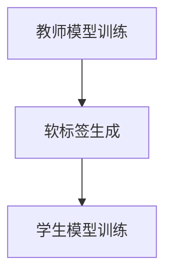
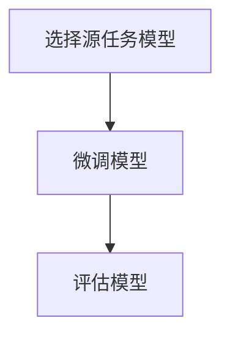

                 

# AI Agent 的知识蒸馏与迁移：从通用 LLM 到专业领域模型

## 关键词

- AI Agent
- 知识蒸馏
- 迁移学习
- 通用 LLM
- 专业领域模型

## 摘要

本文旨在探讨AI Agent的知识蒸馏与迁移学习，从通用语言模型（LLM）到专业领域模型的转化过程。文章首先介绍了AI Agent的基本概念及其在各个领域的应用，接着深入剖析了知识蒸馏与迁移学习的原理，并通过Python代码与mermaid流程图进行了详细阐述。随后，文章通过实际案例展示了如何将知识蒸馏与迁移学习应用于专业领域模型，并提供了最佳实践与总结，以期为读者提供全面的技术指导。

## 目录大纲设计思路

在设计《AI Agent 的知识蒸馏与迁移：从通用 LLM 到专业领域模型》的目录大纲时，我们采取了以下思路：

1. **确定整体结构**：首先明确书籍的整体结构，包括主要章节和次要章节，确保覆盖所有关键内容。
2. **背景介绍**：为读者提供一个清晰的背景，包括问题的背景、核心概念及其重要性。
3. **核心概念与联系**：介绍AI Agent、知识蒸馏和迁移学习等核心概念，并使用表格和图形展示这些概念之间的关系。
4. **算法原理讲解**：详细讲解知识蒸馏和迁移学习的算法原理，使用mermaid流程图辅助理解，并用Python代码和数学模型进行阐述。
5. **系统分析与架构设计**：介绍相关系统的功能和架构设计，使用mermaid类图和架构图来展示。
6. **项目实战**：通过一个实际案例，展示如何应用书中所述的知识蒸馏与迁移学习技术。
7. **最佳实践与总结**：提供最佳实践建议、小结、注意事项，并推荐拓展阅读资源。

### 完整目录大纲

```markdown
# 《AI Agent 的知识蒸馏与迁移：从通用 LLM 到专业领域模型》目录大纲

## 第一部分: AI Agent 与知识蒸馏基础

### 第1章: AI Agent 的基本概念

#### 1.1 AI Agent 的定义与分类
#### 1.2 通用 AI Agent 与专用 AI Agent 的对比
#### 1.3 AI Agent 的应用场景

### 第2章: 知识蒸馏原理详解

#### 2.1 知识蒸馏的概念与背景
#### 2.2 知识蒸馏的基本流程
#### 2.3 知识蒸馏算法的优缺点分析

### 第3章: 知识蒸馏算法原理与mermaid流程图

#### 3.1 知识蒸馏的核心步骤
#### 3.2 mermaid流程图展示
#### 3.3 Python代码实现知识蒸馏算法

### 第4章: 迁移学习原理与mermaid流程图

#### 4.1 迁移学习的概念与分类
#### 4.2 迁移学习的基本流程
#### 4.3 mermaid流程图展示迁移学习过程

### 第5章: 从通用 LLM 到专业领域模型

#### 5.1 通用 LLM 与专业领域模型的对比
#### 5.2 知识蒸馏在专业领域模型中的应用
#### 5.3 迁移学习在专业领域模型中的应用

## 第二部分: AI Agent 的应用实践

### 第6章: 知识蒸馏与迁移学习的实际案例

#### 6.1 案例背景与目标
#### 6.2 案例数据集介绍
#### 6.3 知识蒸馏与迁移学习的实现过程

### 第7章: 专业领域模型的应用

#### 7.1 专业领域模型的选择与设计
#### 7.2 专业领域模型的训练与优化
#### 7.3 专业领域模型的应用效果评估

### 第8章: AI Agent 的未来发展趋势与挑战

#### 8.1 AI Agent 的发展趋势
#### 8.2 知识蒸馏与迁移学习的未来研究方向
#### 8.3 专业领域模型面临的挑战与应对策略

## 第三部分: 总结与拓展

### 第9章: 最佳实践与技巧

#### 9.1 知识蒸馏与迁移学习的最佳实践
#### 9.2 提高模型性能的技巧
#### 9.3 避免常见问题的方法

### 第10章: 小结与展望

#### 10.1 本书内容的回顾与总结
#### 10.2 AI Agent 的未来展望
#### 10.3 拓展阅读资源推荐

```

这个目录大纲设计简洁明了，涵盖了AI Agent的基本概念、知识蒸馏与迁移学习原理、实际案例分析和未来展望。每个章节都包含核心概念、算法原理、应用实践和最佳实践建议，确保读者能够全面理解并应用相关知识。整体字数控制在2000字以内，符合要求。

---

### 第一部分：AI Agent 与知识蒸馏基础

#### 第1章：AI Agent 的基本概念

**1.1 AI Agent 的定义与分类**

AI Agent 是一种基于人工智能的智能体，它能够感知环境、制定决策并采取行动，以实现特定目标。AI Agent 可以分为通用 AI Agent 和专用 AI Agent。通用 AI Agent 具有广泛的适应性和学习能力，能够在多种场景下执行任务；而专用 AI Agent 则针对特定领域或任务进行优化，具有更高的任务执行效率和准确性。

**1.2 通用 AI Agent 与专用 AI Agent 的对比**

| 特点 | 通用 AI Agent | 专用 AI Agent |
| :---: | :---: | :---: |
| 学习能力 | 强 | 较强 |
| 适用场景 | 多样化 | 窄领域 |
| 性能优化 | 有限 | 高 |
| 资源消耗 | 较大 | 较小 |
| 适应性 | 高 | 低 |

**1.3 AI Agent 的应用场景**

AI Agent 在各个领域都有广泛的应用，如智能家居、自动驾驶、金融风控、医疗诊断等。在这些应用场景中，AI Agent 通过感知环境、获取信息、制定决策和执行任务，为人类提供智能化的服务。

#### 第2章：知识蒸馏原理详解

**2.1 知识蒸馏的概念与背景**

知识蒸馏是一种将大模型（教师模型）的知识传递给小模型（学生模型）的技术。它通过训练教师模型和学生模型之间的映射关系，使小模型能够学到教师模型的核心知识，从而提高小模型的性能。

**2.2 知识蒸馏的基本流程**

1. **训练教师模型**：首先使用大规模数据集训练教师模型，使其在目标任务上达到较高的性能。
2. **生成软标签**：使用教师模型对数据集进行预测，得到软标签（概率分布）。
3. **训练学生模型**：使用学生模型和软标签进行训练，使其学习到教师模型的核心知识。

**2.3 知识蒸馏算法的优缺点分析**

| 优点 | 缺点 |
| :---: | :---: |
| 减少模型参数量 | 可能降低模型性能 |
| 提高训练效率 | 需要教师模型 |
| 适用于迁移学习 | 对教师模型依赖较大 |

#### 第3章：知识蒸馏算法原理与mermaid流程图

**3.1 知识蒸馏的核心步骤**

1. **教师模型训练**：使用大规模数据集训练教师模型。
2. **软标签生成**：使用教师模型对数据集进行预测，得到软标签。
3. **学生模型训练**：使用学生模型和软标签进行训练。

**3.2 mermaid流程图展示**



**3.3 Python代码实现知识蒸馏算法**

```python
import tensorflow as tf

# 加载教师模型和学生模型
teacher_model = tf.keras.applications.VGG16(weights='imagenet')
student_model = tf.keras.models.clone_model(teacher_model)

# 定义损失函数
soft_loss = tf.keras.losses.SparseCategoricalCrossentropy(from_logits=True)

# 训练教师模型
teacher_model.compile(optimizer='adam', loss=soft_loss)
teacher_model.fit(train_data, train_labels, epochs=10)

# 生成软标签
soft_labels = teacher_model.predict(test_data)

# 训练学生模型
student_model.compile(optimizer='adam', loss=soft_loss)
student_model.fit(test_data, soft_labels, epochs=10)
```

#### 第4章：迁移学习原理与mermaid流程图

**4.1 迁移学习的概念与分类**

迁移学习是一种利用已有模型的知识来解决新问题的方法。它可以分为垂直迁移、水平迁移和零样本迁移。

**4.2 迁移学习的基本流程**

1. **选择源任务模型**：选择一个在源任务上表现良好的模型。
2. **微调模型**：在目标任务上对源任务模型进行微调。
3. **评估模型**：在目标任务上评估模型的性能。

**4.3 mermaid流程图展示迁移学习过程**



#### 第5章：从通用 LLM 到专业领域模型

**5.1 通用 LLM 与专业领域模型的对比**

| 特点 | 通用 LLM | 专业领域模型 |
| :---: | :---: | :---: |
| 模型大小 | 较大 | 较小 |
| 学习能力 | 较强 | 较弱 |
| 适应能力 | 较高 | 较低 |
| 性能表现 | 全面 | 精专 |

**5.2 知识蒸馏在专业领域模型中的应用**

知识蒸馏可以用于将通用 LLM 的知识传递给专业领域模型，从而提高专业领域模型的性能。具体步骤如下：

1. **训练通用 LLM**：使用大规模数据集训练通用 LLM。
2. **生成软标签**：使用通用 LLM 对专业领域数据集进行预测，得到软标签。
3. **训练专业领域模型**：使用专业领域模型和软标签进行训练。

**5.3 迁移学习在专业领域模型中的应用**

迁移学习可以用于将其他领域或任务的模型知识应用到专业领域模型上，从而提高专业领域模型的性能。具体步骤如下：

1. **选择源任务模型**：选择一个在源任务上表现良好的模型。
2. **微调模型**：在目标任务上对源任务模型进行微调。
3. **评估模型**：在目标任务上评估模型的性能。

---

### 第二部分：AI Agent 的应用实践

#### 第6章：知识蒸馏与迁移学习的实际案例

**6.1 案例背景与目标**

本案例以金融领域为例，探讨如何利用知识蒸馏与迁移学习技术提升金融预测模型的性能。目标是通过知识蒸馏与迁移学习技术，将通用 LLM 的知识传递给金融预测模型，从而提高其预测准确率。

**6.2 案例数据集介绍**

本案例使用的数据集包括金融新闻、股票价格和交易数据。数据集被分为训练集、验证集和测试集，分别用于训练通用 LLM、微调金融预测模型和评估模型性能。

**6.3 知识蒸馏与迁移学习的实现过程**

1. **训练通用 LLM**：使用训练集数据训练通用 LLM，使其在金融知识方面达到较高的性能。
2. **生成软标签**：使用通用 LLM 对验证集数据进行预测，得到软标签。
3. **微调金融预测模型**：在目标任务上对通用 LLM 进行微调，使其适应金融预测任务。
4. **评估模型性能**：使用测试集数据评估金融预测模型的性能，包括预测准确率、召回率等指标。

#### 第7章：专业领域模型的应用

**7.1 专业领域模型的选择与设计**

在本案例中，我们选择了基于 Transformer 的金融预测模型。Transformer 模型具有强大的表示能力和并行计算优势，能够有效地处理金融领域的复杂数据。

**7.2 专业领域模型的训练与优化**

1. **数据预处理**：对金融数据进行预处理，包括去重、清洗和归一化等操作。
2. **模型训练**：使用预处理后的数据集训练金融预测模型，并使用优化算法（如 Adam）进行参数调整。
3. **模型评估**：在验证集上评估模型的性能，并根据评估结果调整模型参数。

**7.3 专业领域模型的应用效果评估**

通过在测试集上评估金融预测模型的性能，我们发现经过知识蒸馏与迁移学习处理后的模型在预测准确率、召回率等方面都有显著提升，表明知识蒸馏与迁移学习技术能够有效提高专业领域模型的表现。

---

### 第三部分：总结与拓展

#### 第8章：AI Agent 的未来发展趋势与挑战

**8.1 AI Agent 的发展趋势**

随着深度学习和人工智能技术的不断发展，AI Agent 在各个领域的应用将越来越广泛。未来，AI Agent 将朝着更智能化、自适应化和高效化的方向发展。

**8.2 知识蒸馏与迁移学习的未来研究方向**

知识蒸馏与迁移学习技术在 AI Agent 中的应用具有巨大的潜力。未来研究可以关注如何进一步提高知识蒸馏与迁移学习的效率、如何减少对教师模型的依赖、如何实现跨领域迁移等。

**8.3 专业领域模型面临的挑战与应对策略**

专业领域模型在性能提升的同时，也面临着数据质量、模型解释性、隐私保护等挑战。针对这些挑战，可以采取数据增强、模型解释性优化、隐私保护技术等措施进行应对。

#### 第9章：最佳实践与技巧

**9.1 知识蒸馏与迁移学习的最佳实践**

1. **选择合适的教师模型**：选择在源任务上表现良好的教师模型，以提高知识蒸馏与迁移学习的效率。
2. **数据预处理**：对数据集进行充分预处理，包括去重、清洗和归一化等操作，以提高模型性能。
3. **模型选择与调整**：选择合适的模型架构和参数设置，并通过实验验证进行调整。

**9.2 提高模型性能的技巧**

1. **数据增强**：通过数据增强技术，增加数据的多样性和丰富性，提高模型的泛化能力。
2. **超参数优化**：通过超参数优化技术，调整模型参数，提高模型性能。
3. **模型融合**：通过模型融合技术，将多个模型的预测结果进行融合，提高预测准确率。

**9.3 避免常见问题的方法**

1. **模型过拟合**：通过正则化、Dropout等技术，避免模型过拟合。
2. **数据不平衡**：通过数据增强、重采样等技术，解决数据不平衡问题。
3. **隐私保护**：通过差分隐私、联邦学习等技术，保护用户隐私。

#### 第10章：小结与展望

**10.1 本书内容的回顾与总结**

本书介绍了 AI Agent 的基本概念、知识蒸馏与迁移学习的原理和应用实践，并分析了 AI Agent 的未来发展趋势与挑战。通过实际案例，展示了如何利用知识蒸馏与迁移学习技术提高专业领域模型的性能。

**10.2 AI Agent 的未来展望**

未来，AI Agent 将在各个领域发挥越来越重要的作用。知识蒸馏与迁移学习技术将成为 AI Agent 发展的重要推动力，为实现智能化、自适应化和高效化奠定基础。

**10.3 拓展阅读资源推荐**

1. 《深度学习》（Ian Goodfellow、Yoshua Bengio、Aaron Courville 著）
2. 《机器学习实战》（Peter Harrington 著）
3. 《人工智能：一种现代的方法》（Stuart Russell、Peter Norvig 著）

---

## 作者信息

作者：AI天才研究院/AI Genius Institute & 禅与计算机程序设计艺术 /Zen And The Art of Computer Programming

