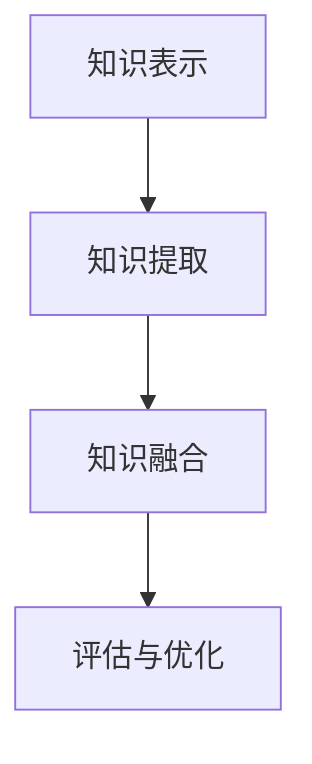
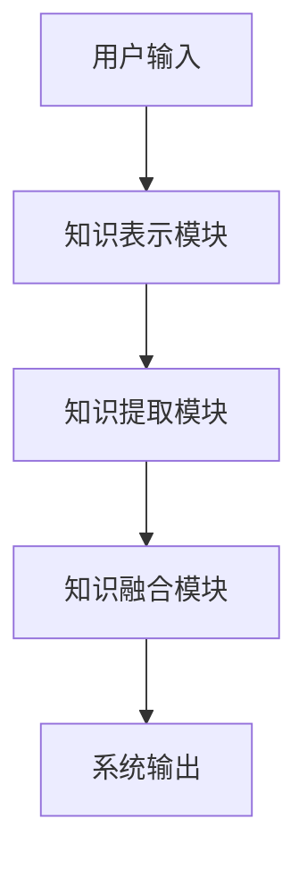
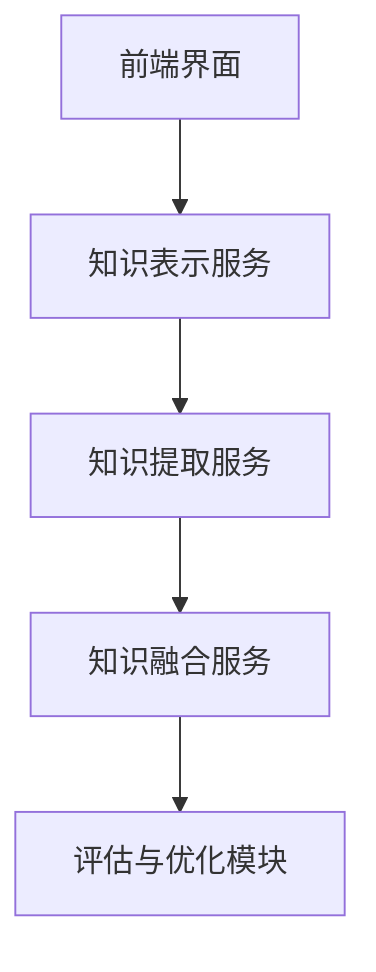
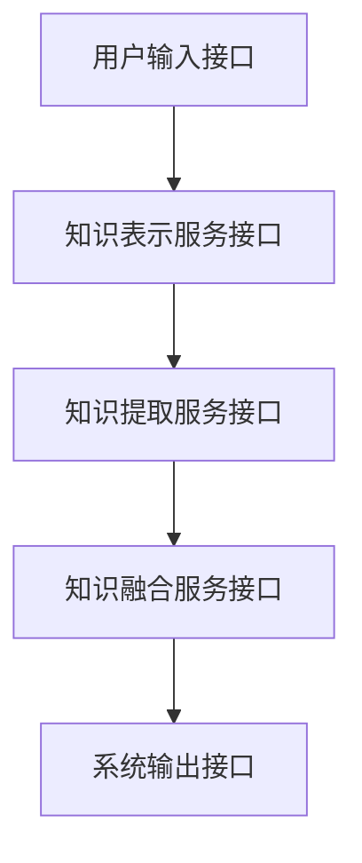
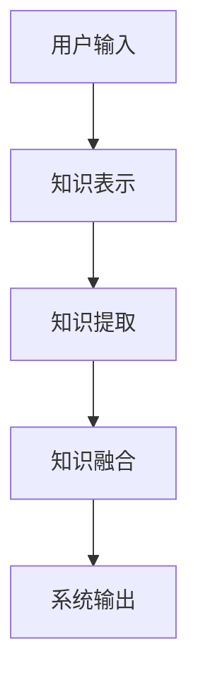

                 


## 《AI Agent 的知识迁移：跨领域应用 LLM 的能力》

关键词：知识迁移、AI Agent、LLM、跨领域应用、算法原理

摘要：本文深入探讨了AI Agent的知识迁移问题，尤其是在跨领域应用大型语言模型（LLM）的能力。我们将分步骤分析知识迁移的核心概念、算法原理，并展示其在实际项目中的应用。

### 第一部分：背景介绍

#### 1.1 知识迁移的概念

知识迁移是指将一个领域（源领域）中的知识应用到另一个领域（目标领域）中。在AI领域，知识迁移可以帮助模型更好地适应新任务，提高其泛化能力。

#### 1.2 AI Agent 的定义与作用

AI Agent 是一种能够感知环境、执行行动并基于目标进行决策的智能体。AI Agent 的核心在于其自主学习和适应能力，能够应对不断变化的环境。

#### 1.3 LLM 在知识迁移中的应用

大型语言模型（LLM）具有强大的知识表示和推理能力，可以用于知识迁移，帮助AI Agent在不同领域间实现知识的共享和利用。

### 1.4 问题描述

当前，知识迁移面临以下挑战：
- **知识表示不统一**：不同领域中的知识表示方式不同，导致知识迁移困难。
- **知识提取不精确**：现有知识提取方法难以准确捕捉领域间的知识差异。
- **知识融合效果不佳**：跨领域知识融合后的效果往往不理想，影响AI Agent的决策能力。

本文旨在解决这些问题，探讨如何利用LLM实现高效的知识迁移。

### 第二部分：核心概念与联系

#### 2.1 知识表示

知识表示是知识迁移的基础。它涉及如何将知识抽象为计算机可处理的形式。知识表示的方法和工具包括自然语言处理、知识图谱、语义网络等。

#### 2.2 知识提取

知识提取是指从原始数据中提取出有价值的信息。在知识迁移中，知识提取的目标是捕捉源领域和目标领域之间的知识差异。

#### 2.3 知识融合

知识融合是将来自不同领域的知识整合为一个统一的知识体系。知识融合的方法包括基于规则的融合、基于统计的融合和基于神经网络的融合。

#### 2.4 概念之间的联系

知识表示、知识提取和知识融合是知识迁移过程中的三个关键环节。它们相互关联，共同作用于知识迁移的效果。

### 第三部分：算法原理讲解

#### 3.1 算法概述

知识迁移算法的主要目标是将源领域中的知识有效迁移到目标领域。算法的核心步骤包括知识表示、知识提取和知识融合。

#### 3.2 流程图



#### 3.3 Python源代码实现

```python
# TODO: Python源代码实现
```

#### 3.4 数学模型与公式

知识融合的数学模型可以表示为：

$$
X = \sum_{i=1}^{n} w_i \cdot x_i
$$

其中，$X$ 是融合后的知识表示，$w_i$ 是权重，$x_i$ 是来自不同领域的知识。

#### 3.5 举例说明

例如，在一个医学诊断的情境中，源领域是心脏病诊断，目标领域是肿瘤诊断。通过知识迁移，我们可以将心脏病诊断中的知识应用到肿瘤诊断中，提高诊断准确率。

### 第四部分：系统分析与架构设计方案

#### 4.1 问题场景介绍

假设我们有一个AI Agent需要在不同领域（如医疗、金融、教育等）中提供咨询服务。我们的目标是为该AI Agent设计一个知识迁移系统。

#### 4.2 系统功能设计

系统功能设计包括知识表示、知识提取、知识融合和评估与优化。



#### 4.3 系统架构设计

系统架构设计包括前端界面、知识表示服务、知识提取服务、知识融合服务和评估与优化模块。



#### 4.4 系统接口设计

系统接口设计包括用户接口和内部服务接口。



#### 4.5 系统交互

系统交互包括用户与AI Agent的交互，以及各服务模块之间的交互。



### 第五部分：项目实战

在本部分，我们将介绍一个具体的知识迁移项目实战。该项目将在医疗和金融领域之间进行知识迁移，以提高AI Agent的咨询能力。

#### 5.1 环境安装

安装必要的Python库，如TensorFlow、PyTorch、Scikit-learn等。

#### 5.2 系统核心实现源代码

```python
# TODO: Python源代码实现
```

#### 5.3 代码应用解读与分析

详细解读代码的每个部分，分析其工作原理和效果。

#### 5.4 实际案例分析和详细讲解剖析

通过实际案例展示知识迁移的效果，并对其进行分析和讲解。

#### 5.5 项目小结

总结项目的成果和经验，讨论未来的研究方向。

### 第六部分：最佳实践 tips、小结、注意事项、拓展阅读等内容

在本部分，我们将提供以下内容：
- **最佳实践 tips**：分享知识迁移的最佳实践技巧。
- **小结**：总结文章的核心内容。
- **注意事项**：提醒在使用知识迁移时需要注意的问题。
- **拓展阅读**：推荐进一步阅读的资源。

### 第七部分：作者信息

作者：AI天才研究院/AI Genius Institute & 禅与计算机程序设计艺术 /Zen And The Art of Computer Programming

