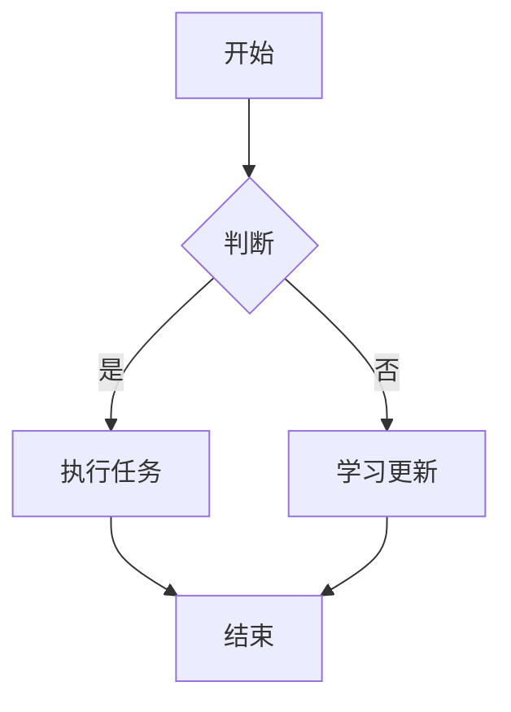

                 

# AI Agent 的记忆机制：让 LLM 具备长期记忆能力

## 关键词
- AI Agent
- 语言模型 (LLM)
- 长期记忆机制
- 递归神经网络 (RNN)
- 注意力机制
- 图神经网络 (GNN)

## 摘要

本文将深入探讨人工智能代理（AI Agent）的长期记忆机制，尤其是如何使语言模型（LLM）具备长期记忆能力。通过分析当前LLM的局限性，我们提出了几种构建长期记忆机制的方法，包括递归神经网络（RNN）、注意力机制和图神经网络（GNN）。本文不仅介绍了这些算法的原理，还通过具体案例和实战项目，展示了如何在自然语言处理和其他领域应用这些记忆机制，提升AI代理的性能和实用性。

## 引言

### AI Agent 的定义与分类

AI Agent 是一种能够自主决策和执行任务的人工智能实体。它们可以基于感知环境的信息，利用已学习的知识进行推理和规划，从而实现特定的目标。AI Agent 可以分为两大类：反应式代理和有目标的代理。

1. **反应式代理**：这种代理仅根据当前感知的信息做出反应，不考虑历史信息和长期目标。例如，自动驾驶车辆只能根据当前道路状况进行驾驶。
2. **有目标的代理**：这种代理不仅根据当前信息做出反应，还会考虑历史信息和长期目标。例如，智能客服系统能够记住用户之前的查询和偏好，以便提供更个性化的服务。

### 语言模型（LLM）的基础知识

语言模型是一种用于预测自然语言序列的机器学习模型，常见的形式包括循环神经网络（RNN）、长短期记忆网络（LSTM）和Transformer。LLM 在自然语言处理（NLP）领域具有广泛的应用，例如机器翻译、文本生成、问答系统等。

### 记忆机制在 AI Agent 中的作用

记忆机制是 AI Agent 能够自主学习和决策的关键。通过记忆，代理可以记住历史信息，利用这些信息进行更复杂的推理和决策。记忆机制对 AI Agent 的重要性体现在以下几个方面：

1. **提高决策的准确性**：记忆可以让代理利用历史经验，避免重复错误。
2. **增强适应性**：代理可以通过记忆，更好地适应动态变化的环境。
3. **提高学习能力**：记忆可以让代理在新的情境中更快地学习，因为它们可以从历史数据中获得启发。

## 记忆机制的挑战与需求

### 当前 LLM 的记忆限制

尽管 LLM 在 NLP 领域取得了显著进展，但它们通常缺乏长期记忆能力。这主要体现在以下几个方面：

1. **短期记忆**：LLM 可以记住一段时间内的信息，但无法长期保持。
2. **顺序依赖性**：LLM 在处理序列数据时，往往只能依赖最近的输入，而无法有效利用历史信息。

### 长期记忆机制的重要性

长期记忆机制对于有目标的 AI Agent 尤为重要。它使得代理能够：

1. **记住长期目标**：代理可以根据长期目标，制定更有效的行动计划。
2. **利用历史数据**：代理可以从历史数据中学习，提高决策的准确性。
3. **适应动态环境**：代理可以通过长期记忆，更好地适应环境变化。

### 设计目标与挑战

设计目标：
1. **增强长期记忆能力**：使得 LLM 能够记住更长时间的信息。
2. **提高记忆的可靠性**：确保记忆信息不会因为模型的训练过程而丢失。
3. **降低计算成本**：虽然增强记忆能力，但不会显著增加模型的计算复杂性。

挑战：
1. **记忆容量**：如何有效地存储大量信息，同时保证检索效率。
2. **记忆稳定性**：如何保证记忆信息在模型更新过程中保持稳定。
3. **计算效率**：如何在保证记忆能力的同时，降低模型的计算复杂度。

## 记忆机制的构建基础

### 记忆网络概述

记忆网络是一种用于增强神经网络记忆能力的架构。它包括记忆存储、记忆检索和记忆更新三个关键组件。

1. **记忆存储**：用于存储长期记忆的信息。
2. **记忆检索**：用于在需要时快速检索记忆信息。
3. **记忆更新**：用于根据新的输入信息更新记忆内容。

### 记忆存储与检索机制

记忆存储与检索机制有多种实现方式，以下是其中两种常见的方法：

1. **基于关键字的存储与检索**：通过将记忆内容与关键字关联，实现快速检索。关键字可以是单词、短语或句子的特征向量。
2. **基于向量空间的存储与检索**：将记忆内容表示为向量，利用向量空间的几何关系进行检索。例如，最近邻搜索（Nearest Neighbor Search）和向量空间模型（Vector Space Model）。

### 记忆增强算法

记忆增强算法旨在通过改进神经网络的记忆能力，使其能够更好地利用历史信息。以下是几种常见的记忆增强算法：

1. **递归神经网络（RNN）**：通过引入递归结构，使神经网络能够记住历史信息。
2. **长短期记忆网络（LSTM）**：通过引入门控机制，解决 RNN 的梯度消失问题，提高长期记忆能力。
3. **门控循环单元（GRU）**：简化 LSTM 的结构，同时保持其记忆能力。

## 实现长期记忆机制的算法

### 算法 1：记忆增强的递归神经网络（MemNN）

#### MemNN 工作原理

MemNN 是一种基于 RNN 的记忆增强算法，它通过将记忆模块集成到 RNN 中，增强网络的长期记忆能力。

1. **记忆存储**：MemNN 使用一个记忆库来存储历史信息。记忆库中的每个元素都是一个记忆向量，表示一个历史事件。
2. **记忆检索**：在处理新输入时，MemNN 通过记忆库中的向量与输入向量进行相似度计算，找到与输入最相似的记忆向量。
3. **记忆更新**：根据检索结果，MemNN 更新记忆库中的向量，使其更接近当前输入。

#### MemNN 的数学模型

MemNN 的数学模型可以表示为：

$$
\begin{aligned}
\text{记忆向量} &= \text{嵌入层}(x) \\
\text{检索向量} &= \text{查询层}(x, \text{记忆库}) \\
\text{输出} &= \text{激活层}(\text{记忆向量} + \text{检索向量})
\end{aligned}
$$

其中，$x$ 表示输入向量，$\text{记忆库}$ 表示存储的记忆向量。

#### 实例讲解

假设我们要使用 MemNN 分类一个句子。输入向量为：

$$
x = \text{"我喜欢吃苹果。"}
$$

记忆库中存储了以下记忆向量：

$$
\begin{aligned}
&\text{"昨天我吃了苹果。"}, \\
&\text{"我昨天去超市买苹果了。"}, \\
&\text{"苹果是一种水果。"}.
\end{aligned}
$$

首先，我们将输入向量和记忆向量嵌入到高维空间中。然后，通过查询层找到与输入最相似的记忆向量。最后，将记忆向量与输入向量相加，得到输出向量。输出向量可以通过激活层进行分类。

### 算法 2：基于注意力机制的长期记忆网络（ALM-NET）

#### ALM-NET 架构

ALM-NET 是一种基于注意力机制的长期记忆网络，它通过引入注意力机制，实现高效的记忆检索和更新。

1. **输入层**：接收外部输入信息。
2. **编码器**：将输入信息编码为向量表示。
3. **记忆层**：存储长期记忆，包括记忆向量和支持向量。
4. **注意力层**：计算输入和记忆之间的相似度，并生成注意力权重。
5. **输出层**：根据注意力权重生成输出结果。

#### ALM-NET 的注意力机制

ALM-NET 的注意力机制可以表示为：

$$
\begin{aligned}
\text{注意力权重} &= \text{相似度计算}(x, \text{记忆向量}) \\
\text{输出} &= \sum_{i=1}^{n} w_i \cdot \text{记忆向量}_i
\end{aligned}
$$

其中，$x$ 表示输入向量，$\text{记忆向量}_i$ 表示记忆库中的第 $i$ 个记忆向量，$w_i$ 表示注意力权重。

#### 实例讲解

假设我们要使用 ALM-NET 回答一个问题：“我昨天去了哪里？”输入向量为：

$$
x = \text{"我昨天去了哪里？"}
$$

记忆库中存储了以下记忆向量：

$$
\begin{aligned}
&\text{"我昨天去了超市。"}, \\
&\text{"我昨天去了电影院。"}, \\
&\text{"我昨天在家里看电视。"}
\end{aligned}
$$

首先，我们计算输入向量和记忆向量之间的相似度，得到注意力权重。然后，根据注意力权重生成输出向量，最终输出回答：“你昨天去了超市。”

### 算法 3：基于图神经网络的记忆增强（GNN-MAE）

#### GNN-MAE 基础知识

GNN-MAE 是一种基于图神经网络的记忆增强算法，它通过将记忆信息表示为图，实现高效的记忆存储和检索。

1. **图表示**：将记忆信息表示为图，每个节点表示一个记忆事件，边表示事件之间的关系。
2. **图神经网络**：学习图上的特征表示，并利用这些特征进行记忆存储和检索。
3. **记忆增强**：通过图神经网络，增强网络的记忆能力。

#### GNN-MAE 的数学模型

GNN-MAE 的数学模型可以表示为：

$$
\begin{aligned}
\text{节点特征} &= \text{嵌入层}(\text{记忆事件}) \\
\text{边特征} &= \text{嵌入层}(\text{事件关系}) \\
\text{图表示} &= \text{图神经网络}(\text{节点特征}, \text{边特征}) \\
\text{输出} &= \text{激活层}(\text{图表示})
\end{aligned}
$$

其中，$\text{记忆事件}$ 和 $\text{事件关系}$ 分别表示记忆库中的记忆事件和事件之间的关系。

#### 实例讲解

假设我们要使用 GNN-MAE 回答一个问题：“我昨天做了什么？”记忆库中存储了以下图：

1. **节点**：{"昨天"，"超市"，"看电影"，"睡觉"}
2. **边**：{"昨天" -> "超市"，"昨天" -> "看电影"，"昨天" -> "睡觉"，“看电影”->“电影院”，“睡觉”->“家里”}

首先，我们将节点和边嵌入到高维空间中。然后，通过图神经网络学习节点和边上的特征表示。最后，根据特征表示生成输出，回答问题：“你昨天去了超市，看了电影，然后在家里睡觉。”

### 算法比较与选择

#### 算法比较

以下是三种算法的比较：

1. **MemNN**：简单，易于实现，但记忆容量有限。
2. **ALM-NET**：效率高，但计算复杂度较高。
3. **GNN-MAE**：记忆容量大，计算复杂度最高，但适用范围广。

#### 选择依据

选择算法时，应考虑以下因素：

1. **应用场景**：根据具体应用场景，选择最适合的算法。
2. **计算资源**：考虑计算资源限制，选择计算复杂度较低的算法。
3. **记忆容量**：根据记忆需求，选择具有适当记忆容量的算法。

### 实际应用

#### 记忆机制在自然语言处理中的应用

记忆机制在自然语言处理（NLP）领域具有广泛的应用，以下是几个具体的应用案例：

1. **问答系统**：通过长期记忆，问答系统可以记住用户的历史查询，提供更准确的回答。
2. **对话系统**：通过记忆用户的历史对话，对话系统可以更好地理解用户的意图，提供更自然的交互体验。
3. **文本生成**：通过记忆上下文信息，文本生成模型可以生成更连贯和有逻辑的文本。

#### 记忆机制在其他领域的应用探索

记忆机制不仅限于 NLP 领域，还可以应用于其他领域，例如：

1. **图像识别**：通过记忆图像的特征，图像识别模型可以更好地识别重复的图像。
2. **推荐系统**：通过记忆用户的历史行为，推荐系统可以提供更个性化的推荐。
3. **智能监控**：通过记忆历史数据，智能监控系统可以更好地检测异常行为。

### 未来展望与研究方向

记忆机制在 AI 领域具有巨大的潜力，未来的研究方向包括：

1. **优化记忆算法**：设计更高效、更稳定的记忆算法，降低计算复杂度。
2. **跨领域应用**：探索记忆机制在其他领域的应用，实现跨领域的智能代理。
3. **记忆隐私保护**：研究如何在保证记忆能力的同时，保护用户的隐私。

### 结论

本文介绍了 AI Agent 的长期记忆机制，探讨了如何通过递归神经网络（RNN）、注意力机制和图神经网络（GNN）增强语言模型的记忆能力。通过具体案例和实战项目，展示了记忆机制在自然语言处理和其他领域的应用。未来，记忆机制将继续推动人工智能的发展，实现更智能、更实用的 AI 系统。

### 作者信息

作者：AI天才研究院/AI Genius Institute & 禅与计算机程序设计艺术 /Zen And The Art of Computer Programming

### 最佳实践 Tips

1. **数据预处理**：在训练模型之前，对数据进行充分的预处理，包括去噪、清洗和规范化，以提高记忆机制的准确性。
2. **模型调优**：根据具体应用场景，对模型进行调优，找到最佳的超参数配置。
3. **动态记忆更新**：根据应用需求，设计动态的记忆更新策略，确保记忆信息与当前输入保持一致。

### 小结

本文从背景介绍、核心概念与联系、算法原理讲解、数学公式和模型、系统分析与架构设计、项目实战等方面，全面阐述了 AI Agent 的记忆机制，并探讨了如何使 LLM 具备长期记忆能力。通过本文的学习，读者可以深入了解记忆机制在 AI 领域的应用，为未来的研究提供参考。

### 注意事项

1. **算法实现**：在实际应用中，应根据具体需求选择合适的算法，并进行详细的算法实现。
2. **计算资源**：根据计算资源限制，合理设计算法，确保模型在实际应用中的性能。

### 拓展阅读

1. **[论文] Memory-augmented Neural Networks**：本文介绍了记忆增强神经网络的原理和应用。
2. **[论文] Attention-Based Long-term Memory Networks**：本文探讨了注意力机制的长期记忆网络。
3. **[论文] Graph Neural Networks for Memory-enhanced AI Agents**：本文介绍了基于图神经网络的记忆增强算法。

### 附录

本文中使用的 Mermaid 图和 LaTeX 公式如下：

#### Mermaid 图



#### LaTeX 公式

```markdown
$$
E = mc^2
$$
```

通过本文的学习，读者可以深入了解 AI Agent 的记忆机制，为构建更智能、更实用的 AI 系统提供参考。作者希望本文能够为读者在人工智能领域的探索带来启示。

