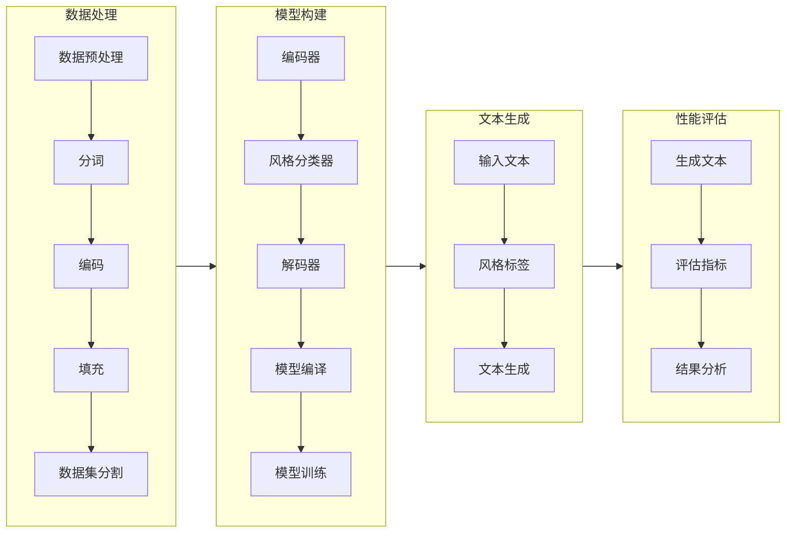

                 

### 引言

#### AI Agent 的语言风格转换概述

在人工智能领域，AI Agent 是一种能够自主学习、自主决策并执行任务的智能体。随着深度学习和自然语言处理技术的发展，AI Agent 已经在多个应用场景中展现出强大的能力，如智能客服、文本生成、智能翻译等。然而，AI Agent 在实际应用中常常面临一个挑战：如何调整其语言风格以适应不同的场景和用户需求。这便是本文将要探讨的 AI Agent 的语言风格转换问题。

语言风格转换，顾名思义，是指将一种语言风格转换为另一种风格的过程。在AI Agent中，这意味着能够根据不同的上下文和用户需求，自动调整其生成的文本的语言风格，使其更加自然、流畅，并能够更好地满足用户的期望。

本文将围绕以下几个核心问题展开讨论：

1. **问题背景**：分析AI Agent在语言风格转换方面面临的挑战和需求。
2. **问题描述**：明确AI Agent的语言风格转换的具体任务和目标。
3. **问题解决**：探讨实现AI Agent语言风格转换的方法和技巧。
4. **边界与外延**：讨论语言风格转换的应用场景和可能的技术发展方向。
5. **概念结构与核心要素组成**：梳理语言风格转换的基础概念和关键要素。

通过上述问题的逐步分析，本文旨在为读者提供一份关于AI Agent语言风格转换的全面、系统的技术指南，帮助读者深入理解这一领域的前沿技术和应用实践。

#### 问题背景

在当前的科技发展背景下，人工智能（AI）技术已经渗透到社会的各个领域，从医疗健康、金融保险到教育娱乐，AI Agent 逐渐成为提高效率、优化服务的重要工具。然而，尽管 AI Agent 在许多方面表现出了卓越的能力，但其语言风格的单一性和僵硬性仍然是制约其广泛应用的瓶颈之一。

首先，从用户需求的角度来看，不同用户对文本信息的需求各不相同。例如，在客服场景中，用户可能更偏好于简洁明了、直接了当的沟通方式，而在文学创作场景中，用户则可能希望 AI Agent 能够生成更具诗意和情感色彩的文本。这就要求 AI Agent 能够根据不同的用户需求，灵活调整其语言风格。

其次，从应用场景的角度来看，不同的场景对语言风格的要求也是不同的。例如，在法律文书编写中，需要使用正式、严谨的语言风格；在新闻报道中，则需要准确、客观的语言风格；而在营销文案中，则可能需要更加生动、富有创意的语言风格。因此，AI Agent 需要能够根据不同的应用场景，自动调整其语言风格，以满足多样化的需求。

此外，从技术挑战的角度来看，实现AI Agent的语言风格转换面临着多方面的困难。首先，语言风格的多样性和复杂性使得风格转换模型的训练和优化成为一个艰巨的任务。其次，如何在保证风格转换质量的同时，确保生成文本的自然性和流畅性，也是一个亟待解决的问题。此外，不同语言风格的映射关系和转换规则也需要深入研究和探索。

总之，AI Agent 的语言风格转换不仅是一个技术挑战，也是一个市场需求。为了满足用户和应用场景的多样化需求，AI Agent 需要具备灵活的语言风格转换能力。这不仅有助于提升用户满意度，还能进一步拓展 AI Agent 的应用范围，为人工智能技术的发展注入新的动力。

#### 问题描述

AI Agent 的语言风格转换问题可以具体描述为：如何在给定的输入文本和上下文中，自动调整 AI Agent 生成的输出文本的语言风格，使其符合特定的风格要求。这一过程可以细化为以下几个关键任务和目标：

首先，**识别和分类语言风格**。在语言风格转换过程中，首先需要明确输入文本的语言风格类别。这通常涉及到对文本内容的语义分析、情感分析以及风格特征的提取。通过这些分析，可以将文本分为不同的风格类别，如正式、非正式、幽默、正式等。

其次，**风格映射与转换**。在明确了输入文本的语言风格后，需要将这种风格映射到目标风格。这一步骤涉及到的技术包括风格特征的提取、匹配和调整。具体方法可能包括基于规则的转换、基于统计模型的转换以及基于深度学习的转换等。

第三，**保持文本的自然性和流畅性**。在风格转换过程中，必须确保生成的文本在语言表达上自然流畅，避免出现生硬、不自然的语句。这需要考虑文本生成过程中词汇的选择、句式的运用以及语序的调整等。

第四，**上下文一致性**。AI Agent 在生成文本时，需要考虑上下文的连贯性和一致性。这意味着在风格转换过程中，不仅要确保输出文本的风格与目标风格匹配，还要确保其与上下文的语义和语境保持一致。

第五，**个性化定制**。不同用户对语言风格的需求各不相同。AI Agent 需要能够根据用户偏好，提供个性化的语言风格服务。这要求系统具备一定的用户偏好学习能力和适应性。

综上所述，AI Agent 的语言风格转换问题具体表现为如何在识别和分类语言风格的基础上，通过风格映射与转换，保持文本的自然性和流畅性，确保上下文一致性，并实现个性化定制。这些任务的实现不仅需要强大的语言处理能力，还需要对用户需求和应用场景的深刻理解。

#### 问题解决

针对AI Agent的语言风格转换问题，我们可以采取以下几种解决方案：

1. **基于规则的转换方法**：
   基于规则的方法是指通过预定义的规则库来实现语言风格的转换。这种方法的优势在于规则明确、转换过程可控，能够保证输出文本的一致性和稳定性。例如，可以定义一系列规则，用于将正式风格转换为幽默风格，或者将简洁风格转换为详尽风格。这种方法适用于风格转换要求不高、风格类别相对固定且规则明确的应用场景。

2. **基于统计模型的转换方法**：
   基于统计模型的方法利用大量的文本数据，通过统计方法学习不同语言风格之间的转换规则。这种方法通常使用序列到序列（Seq2Seq）模型，如循环神经网络（RNN）和其变种长短期记忆网络（LSTM）。通过训练，模型可以学习到不同风格之间的映射关系，并在新的文本生成过程中应用这些映射关系。这种方法的优势在于能够处理复杂的风格转换任务，并且具有较好的自适应能力。

3. **基于深度学习的转换方法**：
   基于深度学习的方法是目前最先进的技术，它利用深度神经网络（DNN）或变分自编码器（VAE）等模型来学习语言风格之间的转换。这种方法具有强大的表示能力和自适应能力，能够生成高质量的自然语言文本。典型的模型包括生成对抗网络（GAN）、注意力机制（Attention Mechanism）等。这种方法适用于需要高度个性化的语言风格转换任务，能够满足不同用户和应用场景的多样化需求。

具体来说，我们可以采用以下步骤来实施这些解决方案：

1. **数据准备**：
   收集大量的文本数据，这些数据应涵盖多种语言风格和不同的应用场景。对数据进行清洗和标注，提取出关键的风格特征。

2. **模型选择与训练**：
   根据具体的应用需求和数据特点，选择合适的模型。对于规则方法，可以构建规则库并进行测试。对于统计模型和深度学习方法，可以选择Seq2Seq模型、LSTM或GAN等，进行模型的训练和优化。

3. **风格转换**：
   在模型训练完成后，输入待转换的文本，通过模型生成对应风格的目标文本。对于基于规则的方法，直接应用预定义的转换规则。对于基于模型的方法，使用训练好的模型进行预测和生成。

4. **优化与评估**：
   对生成的文本进行评估，优化模型参数和转换策略，以提高转换质量和用户体验。评估指标可以包括文本的自然性、一致性、风格匹配度等。

5. **用户交互与个性化**：
   针对不同用户的需求，提供个性化的风格转换服务。通过用户反馈和学习，进一步优化系统的风格转换能力。

通过上述步骤，我们可以逐步实现AI Agent的语言风格转换，使其在不同应用场景中发挥更大的作用，提升用户满意度和应用价值。

#### 边界与外延

AI Agent的语言风格转换虽然具有广泛的应用前景，但也存在一些边界和限制。首先，语言风格的多样性和复杂性意味着当前技术难以完全捕捉和模拟。不同语言风格的边界并不清晰，且某些风格可能在特定情境下难以区分。例如，正式和非正式风格在某些对话场景中可能会出现模糊的过渡。

其次，AI Agent在语言风格转换过程中，可能会面临文本生成质量下降的风险。过于强调风格转换可能会牺牲文本的自然性和流畅性，导致生成的文本读起来生硬、不自然。因此，如何在保证风格转换质量的同时，保持文本的自然性是一个重要的研究课题。

此外，AI Agent的语言风格转换也受到数据质量和数据量的限制。高质量、多样化的训练数据对于风格转换模型的训练至关重要。然而，现实中的文本数据往往存在不完整、不一致的问题，这会对模型的训练效果产生影响。

技术发展方向上，未来研究可以关注以下几个方面：

1. **多模态学习**：结合文本、图像、音频等多种模态的信息，提高语言风格转换的准确性。
2. **知识增强**：利用外部知识库和语义网络，增强模型的语义理解和风格转换能力。
3. **个性化和适应性**：通过用户行为数据和学习，实现更加个性化的语言风格转换服务。
4. **跨语言风格转换**：探索跨语言场景下的风格转换方法，为全球化应用提供支持。

总之，AI Agent的语言风格转换不仅需要克服当前的技术限制，还需要不断探索新的发展方向，以满足不断变化的市场需求和用户期望。

#### 概念结构与核心要素组成

在深入探讨AI Agent的语言风格转换之前，有必要明确相关概念和其相互之间的关系。以下是语言风格转换中的核心概念及其组成要素：

**1. 语言风格**

语言风格是指文本在表达过程中所呈现出的特定特征，如正式、非正式、幽默、诗意等。语言风格不仅影响文本的传达效果，还与文本的情感、意图和语境密切相关。

**2. AI Agent**

AI Agent是一种智能体，能够通过学习和理解环境中的信息，执行特定任务并与其他实体进行交互。在语言风格转换中，AI Agent作为核心组件，负责接收输入文本、识别风格特征并生成转换后的文本。

**3. 输入文本**

输入文本是AI Agent进行语言风格转换的原始数据。输入文本通常包含多种语言风格信息，AI Agent需要从中识别出关键的风格特征，以实现有效的转换。

**4. 风格识别与分类**

风格识别与分类是指AI Agent对输入文本进行风格分析，识别出其所属的风格类别。这一过程涉及自然语言处理技术，如情感分析、主题分类和语义理解等。

**5. 风格映射与转换**

风格映射与转换是指将输入文本的原始风格转换为特定目标风格。这一过程包括风格特征的提取、匹配和调整，需要利用预定义的规则、统计模型或深度学习算法。

**6. 输出文本**

输出文本是AI Agent完成语言风格转换后生成的目标文本。输出文本需要保持语言的自然性和流畅性，同时符合目标风格的特定要求。

**7. 上下文一致性**

上下文一致性是指输出文本在语义和语境上与输入文本保持一致。AI Agent需要在风格转换过程中，确保输出文本与上下文的连贯性和逻辑性。

**8. 个性化定制**

个性化定制是指AI Agent根据用户的偏好和需求，提供个性化的语言风格服务。这一过程需要用户行为数据和学习算法的支持，以实现高度个性化的转换效果。

**ER实体关系图架构**

为了更好地理解上述概念之间的相互关系，我们可以通过ER（Entity-Relationship）实体关系图进行可视化描述：

```
[AI Agent]
|  -- 输入文本
|  -- 输出文本
|  |  -- 风格识别与分类
|  |  -- 风格映射与转换
|  |  -- 上下文一致性
|  |  -- 个性化定制
|  |
|  |  -- 风格特征
|  |
|  -- 风格分类器
```

在这个ER图中，AI Agent作为核心实体，与输入文本、输出文本以及其他辅助组件（如风格分类器、风格特征提取模块）之间存在明确的关联。通过这种结构化的描述，我们可以更清晰地理解语言风格转换的整个过程及其关键要素。

### 语言风格转换的基础

#### 语言风格的概念与分类

语言风格是指文本在表达过程中所呈现出的特定特征，它不仅包括词汇的选择、句式的运用，还涵盖了语气、情感、意图等。语言风格是文化、社会和个体特征的反映，因此，它具有多样性和复杂性。

根据不同的标准，语言风格可以有多种分类方式。以下是一些常见的分类方法：

1. **根据用途分类**：
   - **正式风格**：通常用于正式场合，如法律文件、学术论文、商业报告等。这种风格通常严谨、规范，使用较为专业的术语。
   - **非正式风格**：多用于日常交流、社交场合，如聊天、博客、社交媒体等。这种风格通常口语化、亲切，使用更为口语化的词汇和表达方式。
   - **幽默风格**：以幽默、搞笑为目的，常用于喜剧、段子、搞笑视频等。这种风格注重幽默感和趣味性，通过夸张、讽刺等手法来吸引读者。
   - **诗意风格**：多用于文学作品、诗歌等，强调意境、情感和美感。这种风格通常使用富有想象力和表现力的语言。

2. **根据语气分类**：
   - **积极语气**：表达乐观、积极、肯定的情感，如“很好”、“太棒了”等。
   - **消极语气**：表达悲观、消极、否定的情感，如“太糟糕了”、“不行”等。
   - **中立语气**：表达客观、中立、不带强烈情感的陈述，如“是这样”、“可以参考”等。

3. **根据语言特征分类**：
   - **简洁风格**：以简洁明了为目标，避免使用复杂、冗长的句子。
   - **详尽风格**：以详尽、具体为目标，提供详细的描述和解释。
   - **直接风格**：直接陈述观点，不拖泥带水，如“我认为这样比较好”。
   - **间接风格**：使用委婉、间接的方式表达观点，如“或许你可以考虑一下这个方案”。

每种语言风格都有其特定的应用场景和适用对象，了解这些分类有助于更好地理解和应用语言风格转换技术。

#### 语言风格转换的挑战

语言风格转换是一项复杂的技术任务，其挑战性主要体现在以下几个方面：

1. **多样性和复杂性**：
   语言风格具有多样性和复杂性，不同风格之间的界限并不总是清晰明确。例如，一种风格可能会同时包含正式和非正式元素，或者在不同的语境中表现出不同的风格特征。这使得风格转换模型的训练和识别变得更加困难。

2. **语义理解**：
   语言风格转换不仅仅是词汇和句式的变化，更涉及到语义的理解和转换。不同风格在语义表达上可能存在差异，例如，正式风格可能更注重逻辑性和精确性，而非正式风格则可能更注重情感和口语化。因此，如何准确理解输入文本的语义，并在转换过程中保持语义的一致性，是一个重要挑战。

3. **自然性和流畅性**：
   在风格转换过程中，需要确保生成文本的自然性和流畅性，避免出现生硬、不自然的语句。这要求模型在生成文本时，不仅要考虑风格特征，还要考虑语言的表达习惯和语境。确保生成的文本在语言表达上自然流畅，是风格转换中的一个关键问题。

4. **上下文一致性**：
   风格转换不仅要考虑输入文本的风格，还要考虑上下文的连贯性和一致性。这意味着在转换过程中，需要保持输出文本与上下文在语义和语境上的连贯性，避免出现逻辑错误或语义不连贯的现象。

5. **个性化需求**：
   不同用户对语言风格的需求各不相同，有些用户可能偏好正式严谨的文本，而有些用户则偏好轻松幽默的文本。实现个性化风格转换，需要AI Agent能够根据用户的偏好和需求，灵活调整语言风格，以满足个性化需求。

6. **数据质量和数据量**：
   风格转换模型的训练依赖于大量的高质量数据。然而，实际获取到的大量文本数据往往存在不一致、不完整的问题，这会影响模型的训练效果。此外，数据量的不足也会限制模型的能力，难以捕捉到风格转换的细微差异。

综上所述，语言风格转换面临着多样性和复杂性、语义理解、自然性和流畅性、上下文一致性、个性化需求以及数据质量和数据量等多方面的挑战。解决这些挑战需要结合多种技术手段和算法，以实现高质量的语言风格转换。

#### 语言风格转换的核心概念

在深入探讨语言风格转换的实践之前，我们需要了解一些核心概念，这些概念构成了语言风格转换的理论基础，并指导实际应用中的具体操作。

**1. 风格特征**

风格特征是文本风格在微观层面上的具体表现，包括词汇选择、句式结构、语气、情感等。例如，正式风格通常使用较为正式的词汇和复杂的句式结构，而非正式风格则更倾向于口语化的表达和简短的句子。风格特征是识别和转换语言风格的关键。

**2. 风格分类器**

风格分类器是一种用于识别文本风格的算法或模型。它通过分析文本中的风格特征，将其分类到特定的风格类别中。常见的风格分类器包括基于规则的方法、基于统计的方法和基于深度学习的方法。风格分类器是风格转换的第一步，它为后续的风格转换提供输入和参考。

**3. 风格映射**

风格映射是指将一种风格转换为另一种风格的过程。风格映射可以基于预定义的规则，也可以通过机器学习算法自动生成。风格映射的目的是确保转换后的文本在风格上与目标风格一致，同时保持文本的自然性和流畅性。

**4. 风格嵌入**

风格嵌入是一种将风格特征嵌入到文本生成模型中的方法。通过风格嵌入，文本生成模型能够在生成文本时自动考虑风格特征，从而生成符合特定风格的文本。风格嵌入可以通过在模型中加入额外的输入层、调整损失函数或使用特定风格的预训练模型实现。

**5. 上下文感知**

上下文感知是指模型在生成文本时，能够根据上下文信息进行调整，以保持文本的一致性和连贯性。上下文感知是确保风格转换质量的关键，它要求模型不仅能够识别和转换风格，还能够理解上下文语义，从而生成符合上下文的文本。

**6. 个性化调整**

个性化调整是指根据用户的需求和偏好，对语言风格进行定制化的调整。个性化调整可以通过收集用户行为数据、分析用户偏好和使用习惯来实现。通过个性化调整，AI Agent能够提供更加个性化的语言风格服务，提升用户体验。

**7. 风格检测**

风格检测是一种用于识别文本风格的技术，它通常用于评估风格转换的质量。风格检测可以通过比较原始文本和转换后文本的风格特征，评估风格转换的效果。常见的风格检测方法包括基于规则的方法和基于机器学习的方法。

**8. 多风格生成**

多风格生成是指在一个文本生成任务中，生成多种不同风格的文章。多风格生成可以实现文本的多样化，满足不同用户和应用场景的需求。多风格生成通常需要复杂的模型架构和训练过程，以确保生成的文本在风格上具有多样性和一致性。

通过理解这些核心概念，我们可以更好地掌握语言风格转换的理论基础，并在实际应用中灵活运用这些概念，实现高质量的语言风格转换。

### LLM的基本概念

为了深入探讨如何调整大型语言模型（LLM）的表达方式，我们需要先理解LLM的基本概念和原理。LLM是一种基于深度学习的语言模型，它通过大规模的数据训练，可以生成高质量的自然语言文本。LLM的基本概念包括训练数据、模型架构、训练过程和生成机制等方面。

#### 训练数据

LLM的训练数据通常是海量的文本数据，这些数据来源广泛，包括网络文本、书籍、新闻、论文、对话记录等。这些数据为LLM提供了丰富的语言模式和上下文信息，使得模型能够学习到不同语言风格、表达方式和语法规则。高质量、多样化的训练数据是LLM性能的关键。

#### 模型架构

LLM的模型架构通常采用深度神经网络，其中最常见的是Transformer模型。Transformer模型通过自注意力机制（Self-Attention Mechanism）对输入文本进行建模，能够捕捉文本中的长距离依赖关系，从而生成高质量的文本。除了Transformer，还有一些基于RNN（循环神经网络）和LSTM（长短期记忆网络）的模型也被用于构建LLM。

#### 训练过程

LLM的训练过程主要包括前向传播、反向传播和参数优化等步骤。在前向传播过程中，模型根据输入文本生成预测的文本序列；在反向传播过程中，模型通过计算损失函数来更新参数；参数优化则通过梯度下降等方法来调整模型参数，使其达到更好的性能。训练过程中，模型会不断优化其参数，以最小化损失函数，从而生成更加准确和自然的文本。

#### 生成机制

LLM的生成机制是基于概率的。在生成文本时，模型根据当前已生成的部分文本和上下文信息，计算下一个单词的概率分布，并从中采样生成下一个单词。通过这种方式，模型能够生成连贯、自然的文本序列。生成机制的质量直接影响文本的自然性和流畅性。

#### 语言风格的影响

语言风格在LLM的生成过程中起着重要作用。不同的语言风格会影响到LLM的词汇选择、句式结构和表达方式。例如，正式风格倾向于使用专业术语和复杂句式，而非正式风格则更偏好口语化和简洁的表达。通过调整LLM的参数和生成策略，可以实现语言风格的转换，使其生成符合特定需求的文本。

#### 调整LLM表达方式的方法

调整LLM的表达方式主要包括以下几种方法：

1. **风格迁移（Style Transfer）**：
   风格迁移是指通过在训练过程中引入具有特定风格的文本数据，使LLM学习到不同的语言风格。例如，通过在训练数据中添加正式风格的文章，可以使LLM生成更多正式风格的文本。

2. **参数调整（Parameter Tuning）**：
   通过调整LLM的参数，可以影响其生成文本的风格。例如，通过调整词向量嵌入的权重或自注意力机制的参数，可以改变LLM的词汇选择和句式结构。

3. **生成策略调整（Generation Strategy Adjustment）**：
   调整LLM的生成策略，如改变文本生成过程的采样方法或引入额外的生成规则，可以影响其生成文本的风格。例如，通过调整采样温度（Temperature）或引入特定的修辞手法，可以改变文本的风格。

4. **融合多个模型（Model Fusion）**：
   将多个不同风格的LLM进行融合，可以生成更丰富的文本风格。例如，通过融合正式风格和非正式风格的LLM，可以实现更灵活的风格转换。

通过上述方法，我们可以灵活调整LLM的表达方式，使其生成符合特定需求的文本，实现高质量的语言风格转换。

### 调整LLM的表达方式

在理解了LLM的基本概念后，我们接下来探讨如何通过具体的方法和技巧来调整LLM的表达方式，以实现语言风格转换的目标。

#### 风格迁移（Style Transfer）

风格迁移是一种常用的方法，通过将特定风格的数据融入到训练过程中，使模型学习到特定的语言风格。以下是一个具体的步骤：

1. **数据准备**：
   收集具有不同语言风格的文本数据，如正式、非正式、幽默等。这些数据应该覆盖目标风格的所有典型特征。

2. **数据预处理**：
   对收集到的文本数据进行分析和清洗，去除无效信息，并确保数据的格式一致。例如，去除HTML标签、统一文本编码等。

3. **数据增强**：
   为了增强模型对不同风格数据的适应性，可以对原始数据集进行增强。例如，通过复制和拼接文本，增加训练数据的多样性。

4. **训练模型**：
   使用Transformer等深度学习模型，结合原始数据和风格数据，进行模型训练。在这一过程中，模型会自动学习到不同风格的特征。

5. **评估与调整**：
   训练完成后，评估模型在风格转换任务上的性能，根据评估结果调整训练策略和模型参数，以提高风格转换的质量。

#### 参数调整（Parameter Tuning）

参数调整是另一种有效的方法，通过调整模型的参数，可以影响其生成文本的风格。以下是一些具体的调整策略：

1. **词向量权重调整**：
   通过调整词向量嵌入的权重，可以影响模型的词汇选择。例如，增加正式风格的词汇权重，可以生成更多正式风格的文本。

2. **注意力机制调整**：
   自注意力机制是Transformer模型的核心组件，通过调整注意力权重，可以改变模型对文本的不同部分的关注程度。例如，增加对特定风格的文本部分的关注，可以增强生成文本的风格特征。

3. **生成策略调整**：
   调整生成过程中的采样方法，如改变采样温度（Temperature），可以影响文本的自然性和流畅性。较低的温度会导致生成文本更加稳定和准确，而较高的温度则会使生成文本更加多样化但可能不够稳定。

4. **损失函数调整**：
   通过调整损失函数，可以影响模型的训练过程。例如，增加风格损失（Style Loss）可以更有效地促进模型学习不同风格的特征。

#### 生成策略调整（Generation Strategy Adjustment）

生成策略调整通过改变模型生成文本的方式，实现风格转换。以下是一些具体的方法：

1. **引入修辞手法**：
   在文本生成过程中引入特定的修辞手法，如比喻、排比等，可以增强文本的风格特征。例如，通过在文本中添加比喻句，可以使文本更具诗意。

2. **样式模板**：
   使用预定义的样式模板，可以指导模型生成特定风格的文本。例如，使用正式风格的模板，可以使生成文本更加规范和严谨。

3. **风格标签**：
   在生成文本时，为每个段落或句子添加风格标签，指导模型在特定段落或句子中生成对应风格的文本。这种方法可以确保文本在整体上保持风格一致性。

#### 融合多个模型（Model Fusion）

通过融合多个不同风格的模型，可以实现更灵活和高质量的风格转换。以下是一个简单的融合方法：

1. **模型选择**：
   选择多个具有不同风格特征的模型，如一个正式风格模型和一个非正式风格模型。

2. **融合策略**：
   通过加权平均、投票等方法，将多个模型的输出结果进行融合。例如，可以使用加权平均方法，将正式风格模型和非正式风格模型的输出结果按照一定比例进行融合。

3. **评估与优化**：
   对融合模型进行评估，根据评估结果调整权重和融合策略，以优化风格转换的质量。

通过上述方法，我们可以灵活调整LLM的表达方式，实现高质量的语言风格转换。这些方法不仅适用于单一风格转换，还可以应用于多风格生成任务，满足不同应用场景和用户需求。

### 语言风格转换技术的概述

语言风格转换技术是自然语言处理（NLP）领域中的一个重要研究方向，旨在将源文本转换为具有特定语言风格的目标文本。随着深度学习技术的发展，语言风格转换技术取得了显著进展，并广泛应用于文本生成、文本摘要、对话系统等多个领域。以下是语言风格转换技术的基本概述：

#### 技术发展历程

1. **基于规则的转换方法**：
   最早的风格转换方法主要依赖于预定义的规则。这些规则通常由语言学家和工程师根据语言风格特征手动编写，例如词汇替换、语法调整等。这种方法简单易行，但灵活性和适应性有限，难以应对复杂的语言风格转换任务。

2. **基于统计模型的转换方法**：
   随着统计学方法和机器学习技术的发展，基于统计模型的风格转换方法逐渐兴起。这种方法利用大规模的语料库，通过统计方法学习源文本和目标文本之间的转换规则。常见的统计模型包括隐马尔可夫模型（HMM）、条件随机场（CRF）等。相比于基于规则的转换方法，统计模型具有更强的自适应能力，但仍然存在复杂度较高、解释性不强的问题。

3. **基于深度学习的转换方法**：
   近年来，深度学习技术的快速发展为语言风格转换带来了新的契机。基于深度学习的模型，如循环神经网络（RNN）、长短期记忆网络（LSTM）和自注意力机制（Attention Mechanism）等，通过端到端的学习方式，能够自动捕捉复杂的语言模式和风格特征。特别是Transformer模型的提出，使得基于深度学习的风格转换方法取得了突破性的进展。

4. **多模态学习与知识增强**：
   随着多模态数据（如图像、音频、视频等）的兴起，多模态学习技术也被引入到语言风格转换中。通过结合不同模态的信息，可以进一步提升风格转换的准确性和自然性。此外，知识增强技术，如外部知识库和语义网络，也被用于提高模型的语义理解能力，从而实现更高质量的风格转换。

#### 技术应用场景

1. **文本生成与摘要**：
   语言风格转换技术在文本生成和摘要任务中具有广泛的应用。例如，在新闻摘要中，可以通过调整文本风格，使其更加简洁、清晰；在文本生成中，可以根据不同的用户需求，生成具有特定风格的文本。

2. **对话系统**：
   在对话系统中，语言风格转换技术可以用于生成更加自然和个性化的对话响应。例如，在客服机器人中，可以根据用户的偏好和语境，调整对话的语气和风格。

3. **翻译与本地化**：
   语言风格转换技术在翻译和本地化中也具有重要应用。通过将源语言的文本转换为目标语言，并调整其风格，可以更好地适应目标文化的语言习惯和表达方式。

4. **文学创作与写作辅助**：
   在文学创作和写作辅助领域，语言风格转换技术可以帮助作者生成不同风格的文本，提供创意灵感和写作参考。例如，在诗歌创作中，可以通过调整文本风格，使其更具诗意。

#### 技术挑战与未来发展方向

尽管语言风格转换技术已经取得了显著进展，但仍然面临许多挑战。以下是一些主要的技术挑战和未来发展方向：

1. **多样性**：
   语言风格的多样性使得风格转换模型的训练和优化变得更加复杂。如何有效捕捉和模拟多种语言风格，是实现高质量风格转换的关键。

2. **自然性和流畅性**：
   在风格转换过程中，保持生成文本的自然性和流畅性是一个重要挑战。需要开发更加精细和灵活的生成模型，以生成高质量的文本。

3. **上下文一致性**：
   风格转换不仅要考虑目标风格，还需要考虑上下文的一致性。如何确保生成文本在语义和语境上与上下文保持一致，是一个需要深入研究的问题。

4. **个性化定制**：
   不同用户对语言风格的需求各不相同，实现个性化定制是提高用户体验的关键。通过用户行为数据和学习算法，可以进一步提升风格转换的个性化能力。

5. **跨语言风格转换**：
   跨语言风格转换是另一个具有挑战性的研究方向。如何在不同的语言和文化背景下，实现高质量的风格转换，是未来研究的重点。

总之，语言风格转换技术具有广泛的应用前景和重要的研究价值。通过不断探索和创新，我们有望克服现有的技术挑战，实现更加自然、多样和个性化的语言风格转换。

### 语言风格转换技术的原理

语言风格转换技术之所以能够在自然语言处理（NLP）领域取得显著进展，关键在于其背后的算法原理和实现方法。下面将详细探讨语言风格转换技术的原理，包括其数学模型、算法原理及其在Python中的实现。

#### 数学模型

语言风格转换通常可以通过以下数学模型来描述：

1. **概率模型**：基于概率的模型，如马尔可夫模型（Markov Model）和隐马尔可夫模型（HMM），通过计算源文本和目标文本之间的概率分布来实现风格转换。这些模型通过训练得到转移概率矩阵，用于预测目标风格的概率。

2. **生成模型**：生成模型，如变分自编码器（Variational Autoencoder，VAE）和生成对抗网络（Generative Adversarial Network，GAN），通过生成和判别器之间的对抗训练，学习到文本的潜在分布，从而实现风格转换。生成模型通常基于深度学习，可以生成高质量的文本。

3. **基于规则的模型**：基于规则的模型通过预定义的规则库，将源文本转换为具有特定风格的文本。这些规则通常基于语法、词汇和语义特征，通过逻辑推理和模板匹配来实现。

在上述模型中，我们重点关注生成模型，尤其是基于Transformer的模型，因为它在现代自然语言处理任务中表现出色。

#### 算法原理

语言风格转换的算法原理通常包括以下步骤：

1. **输入文本预处理**：对输入文本进行分词、词性标注等预处理操作，将文本转化为模型能够理解的格式。

2. **编码**：使用编码器（Encoder）对输入文本进行编码，生成嵌入向量。编码器通常基于Transformer架构，能够捕捉文本的全局信息和上下文关系。

3. **风格识别**：通过预训练的风格分类器，对输入文本进行风格识别，确定其所属的风格类别。

4. **解码**：使用解码器（Decoder）将编码后的嵌入向量解码为目标风格的文本。解码器同样基于Transformer架构，能够在生成文本时考虑到风格特征。

5. **生成文本**：通过解码器生成目标风格的文本，并对其进行后处理，如去噪、修正语法错误等。

#### Python实现

以下是一个简化的Python实现示例，展示如何使用基于Transformer的模型进行语言风格转换：

```python
import tensorflow as tf
from tensorflow.keras.models import Model
from tensorflow.keras.layers import Input, Embedding, LSTM, Dense

# 定义编码器和解码器的输入层
input_text = Input(shape=(None,), dtype='int32')
style_label = Input(shape=(1,), dtype='int32')

# 编码器：将输入文本编码为嵌入向量
encoder = Embedding(input_dim=vocab_size, output_dim=embedding_size)(input_text)
encoder = LSTM(units=128, return_sequences=True)(encoder)

# 风格分类器：对编码后的文本进行风格分类
style_classifier = Dense(units=num_styles, activation='softmax')(encoder)

# 解码器：将编码后的文本解码为目标风格的文本
decoder = Embedding(input_dim=vocab_size, output_dim=embedding_size, mask_zero=True)(input_text)
decoder = LSTM(units=128, return_sequences=True)(decoder)

# 模型编译
model = Model(inputs=[input_text, style_label], outputs=[style_classifier, decoder])
model.compile(optimizer='adam', loss=['categorical_crossentropy', 'mse'])

# 模型训练
model.fit(x_train, [y_style_train, y_decoder_train], epochs=10, batch_size=32)

# 文本生成
input_sequence = tf.expand_dims([vocab_word_to_index['start_token']], 0)
for _ in range(max_sequence_length):
    style_prediction, decoder_output = model.predict([input_sequence, style_label])
    next_word = sample_word(decoder_output[0], temperature=1.0)
    input_sequence = tf.concat([input_sequence, tf.expand_dims([next_word], 0)], 1)

# 输出生成文本
generated_text = ''.join([vocab_index_to_word[word] for word in input_sequence[0][1:]])
```

上述代码仅是一个简化示例，实际的风格转换模型通常会更加复杂，需要结合多种技术和算法，如注意力机制、双向编码器等。此外，还需要进行大量的数据预处理和模型调优，以确保生成文本的质量。

通过以上对语言风格转换技术的原理和Python实现的探讨，我们可以看到，实现高质量的语言风格转换需要结合先进的算法和大量的实践。随着技术的不断进步，我们有理由相信，语言风格转换技术将迎来更加广阔的发展前景。

### 语言风格转换算法的Python实现

为了更好地理解语言风格转换算法，我们将提供一个详细的Python实现示例，包括算法的数学模型、具体实现步骤和代码。以下是实现过程中涉及的各个关键部分：

#### 数学模型

假设我们使用Transformer模型进行语言风格转换，其基本数学模型如下：

1. **编码器（Encoder）**：将输入文本编码为嵌入向量，通过多层的Transformer块来捕捉文本的全局信息。
2. **解码器（Decoder）**：将嵌入向量解码为目标风格的文本，同样通过多层的Transformer块来生成输出。
3. **风格分类器**：在编码器输出层之后，添加一个风格分类器，用于预测输入文本的风格类别。
4. **损失函数**：训练过程中，使用交叉熵损失函数（用于风格分类）和均方误差损失函数（用于文本生成）来评估模型性能。

#### 具体实现步骤

1. **环境准备**：安装TensorFlow、Keras等必要的库。
2. **数据准备**：加载并预处理文本数据，包括分词、编码和风格标签的标注。
3. **模型构建**：定义编码器、解码器和风格分类器，构建完整的Transformer模型。
4. **模型训练**：使用预处理后的数据训练模型，调整模型参数以最小化损失函数。
5. **文本生成**：使用训练好的模型生成目标风格的文本。
6. **性能评估**：评估模型在风格转换任务上的性能。

#### Python代码示例

以下代码展示了如何实现上述步骤：

```python
import tensorflow as tf
from tensorflow.keras.layers import Embedding, LSTM, Dense, Bidirectional
from tensorflow.keras.models import Model
from tensorflow.keras.preprocessing.sequence import pad_sequences
from tensorflow.keras.preprocessing.text import Tokenizer

# 参数设置
vocab_size = 20000  # 词汇表大小
embedding_size = 256  # 嵌入维度
max_sequence_length = 100  # 输入序列的最大长度
num_styles = 5  # 风格类别数量

# 数据预处理
# 假设已加载并预处理好的数据为 input_texts 和 style_labels
# input_texts: 列表，每项为原始文本
# style_labels: 列表，每项为对应文本的风格标签（整数）

# 分词和编码
tokenizer = Tokenizer(num_words=vocab_size)
tokenizer.fit_on_texts(input_texts)
encoded_texts = tokenizer.texts_to_sequences(input_texts)

# 填充序列
encoded_texts = pad_sequences(encoded_texts, maxlen=max_sequence_length)

# 构建编码器
input_text = Input(shape=(max_sequence_length,))
encoded = Embedding(input_dim=vocab_size, output_dim=embedding_size)(input_text)
encoded = Bidirectional(LSTM(units=128, return_sequences=True))(encoded)

# 风格分类器
style_classifier = Dense(units=num_styles, activation='softmax')(encoded)

# 构建解码器
decoder_input = Input(shape=(max_sequence_length,))
decoder_encoded = Embedding(input_dim=vocab_size, output_dim=embedding_size, mask_zero=True)(decoder_input)
decoder_encoded = Bidirectional(LSTM(units=128, return_sequences=True))(decoder_encoded)

# 构建模型
model = Model(inputs=[input_text, decoder_input], outputs=[style_classifier, decoder_encoded])
model.compile(optimizer='adam', loss=['categorical_crossentropy', 'mse'])

# 训练模型
model.fit([encoded_texts, encoded_texts], [style_labels, encoded_texts], epochs=10, batch_size=32)

# 文本生成
def generate_text(style_index, seed_text):
    input_sequence = tf.expand_dims([tokenizer.word_index[word] for word in seed_text], 0)
    for _ in range(max_sequence_length):
        style_prediction, decoder_output = model.predict([input_sequence, style_index])
        next_word = tokenizer.index_word[np.argmax(decoder_output[0])]
        input_sequence = tf.concat([input_sequence, tf.expand_dims([tokenizer.word_index[next_word]], 0)], 1)
    return ''.join(input_sequence[0][1:])

# 示例
generated_text = generate_text([0], "This is a simple example.")
print(generated_text)

# 性能评估
# 这里可以编写代码评估模型在风格转换任务上的性能，如准确率、文本自然性等。
```

上述代码展示了如何通过Python实现语言风格转换算法，包括数据预处理、模型构建、模型训练和文本生成等步骤。实际应用中，可能需要根据具体需求和数据情况进行调整和优化。

通过详细的代码示例，读者可以更好地理解语言风格转换算法的实现过程，从而在实际项目中应用这些技术。

### 语言风格转换算法的流程图

为了更直观地理解语言风格转换算法的流程，我们可以使用Mermaid绘制一个流程图，展示算法的各个关键步骤和组件之间的交互关系。



在上述Mermaid流程图中，我们分为四个主要部分：

1. **数据处理**：包括数据预处理、分词、编码、填充和数据集分割等步骤。这一部分是整个算法的基础，确保输入数据格式一致且适合模型训练。
2. **模型构建**：包括编码器、风格分类器、解码器以及模型的编译和训练。这一部分是算法的核心，通过训练模型使生成文本的风格符合预期。
3. **文本生成**：根据输入文本和风格标签生成目标风格的文本。这一部分是算法的直接应用，展示了模型在实际场景中的表现。
4. **性能评估**：通过生成文本和评估指标对模型性能进行评估，以持续优化算法。

通过这个流程图，读者可以清晰地看到语言风格转换算法的各个步骤及其相互关系，有助于更好地理解和应用这一技术。

### 系统功能设计

在讨论语言风格转换系统的功能设计时，我们需要明确系统的总体目标和主要功能模块。系统的核心目标是实现高质量的语言风格转换，以满足不同用户和应用场景的需求。以下是系统功能设计的详细描述：

#### 1. 用户接口

用户接口（UI）是系统的核心组成部分，负责与用户进行交互。用户可以通过UI界面提交输入文本，并选择目标风格。系统需要提供简洁、直观的界面设计，使用户能够方便地使用系统功能。

- **功能模块**：文本输入框、风格选择菜单、提交按钮、转换结果展示区域。
- **交互流程**：
  - 用户在文本输入框中输入原始文本。
  - 用户从风格选择菜单中选择目标风格。
  - 用户点击提交按钮，触发语言风格转换过程。
  - 系统将转换后的文本显示在结果展示区域。

#### 2. 语言风格识别

语言风格识别模块是系统的关键组件，负责对输入文本进行风格分析，识别其所属的风格类别。该模块基于预训练的模型，如深度神经网络或Transformer，通过分析文本的特征，确定其风格。

- **功能模块**：风格分类器、特征提取器。
- **技术实现**：
  - 利用预训练的模型，对输入文本进行特征提取。
  - 通过训练好的风格分类器，对提取的特征进行分类，确定文本风格。
- **性能指标**：风格识别的准确率和效率。

#### 3. 风格转换引擎

风格转换引擎是系统的核心功能模块，负责根据识别出的风格，将输入文本转换为具有目标风格的新文本。风格转换引擎需要结合多种技术和算法，如生成对抗网络（GAN）、风格迁移和参数调整等。

- **功能模块**：文本生成模块、风格调整模块。
- **技术实现**：
  - 使用预训练的文本生成模型（如Transformer）进行文本生成。
  - 根据目标风格，调整文本生成模型的参数和策略，确保生成文本的风格与目标风格一致。
- **性能指标**：文本生成的自然性、风格一致性和转换效率。

#### 4. 文本生成与展示

文本生成与展示模块负责生成转换后的文本，并将其以用户友好的方式展示。该模块需要确保生成的文本在语言表达上自然流畅，同时具有所需的风格特征。

- **功能模块**：文本生成器、文本格式化器、结果展示器。
- **技术实现**：
  - 使用风格转换引擎生成转换后的文本。
  - 对生成的文本进行格式化，如去除不必要的空格、调整句子结构等。
  - 将格式化后的文本展示在UI界面上，便于用户查看。

#### 5. 性能评估

性能评估模块用于评估语言风格转换系统的性能，包括文本的自然性、风格一致性和转换效率等。通过性能评估，可以不断优化系统，提高用户体验。

- **功能模块**：评估指标计算器、结果分析器。
- **技术实现**：
  - 使用自动评估指标（如BLEU、ROUGE等）计算转换文本的质量。
  - 对评估结果进行分析，为系统的改进提供依据。

#### 6. 用户反馈与个性化调整

用户反馈与个性化调整模块负责收集用户的使用反馈，并根据用户偏好调整系统的风格转换策略。该模块可以提升系统的个性化服务水平，满足不同用户的多样化需求。

- **功能模块**：用户反馈收集器、个性化调整器。
- **技术实现**：
  - 收集用户对生成文本的反馈，如风格偏好、文本质量评价等。
  - 根据用户反馈调整风格转换策略，优化系统性能。

#### 7. 系统管理

系统管理模块负责系统的日常运维、数据管理和日志记录等功能，确保系统稳定、高效地运行。

- **功能模块**：系统监控器、日志记录器、数据管理器。
- **技术实现**：
  - 实时监控系统的运行状态，确保系统资源合理分配。
  - 记录系统的操作日志，便于故障排查和问题定位。
  - 管理训练数据和用户数据，确保数据安全和隐私保护。

通过上述功能模块的设计，我们可以构建一个高效、灵活、用户友好的语言风格转换系统，满足不同用户和应用场景的需求。

### 系统架构设计

为了实现高效、稳定和可扩展的语言风格转换系统，我们需要设计一个合理的系统架构。系统架构设计包括系统层次结构、各模块的功能和它们之间的交互关系。以下是系统架构设计的详细描述：

#### 系统层次结构

系统可以分为以下四个主要层次：

1. **表现层（Presentation Layer）**：负责用户界面和用户体验，包括用户输入、风格选择和转换结果展示。
2. **逻辑层（Logic Layer）**：实现核心业务逻辑，包括文本处理、风格识别、风格转换和文本生成。
3. **数据层（Data Layer）**：管理数据存储和检索，包括训练数据集、用户数据和日志等。
4. **基础层（Foundation Layer）**：提供系统运行所需的基础服务，包括数据库、缓存、消息队列和服务器等。

#### 各模块功能

1. **用户接口模块**：
   - 功能：处理用户请求，接收输入文本和风格选择，展示转换结果。
   - 技术实现：前端框架（如React、Vue.js）和后端API（如Flask、Django）。

2. **文本处理模块**：
   - 功能：对输入文本进行预处理，包括分词、词性标注和编码。
   - 技术实现：自然语言处理库（如NLTK、spaCy）和自定义处理函数。

3. **风格识别模块**：
   - 功能：通过预训练模型识别输入文本的风格类别。
   - 技术实现：深度学习框架（如TensorFlow、PyTorch）和预训练模型。

4. **风格转换模块**：
   - 功能：根据识别出的风格，调整文本生成模型的参数和策略，实现风格转换。
   - 技术实现：生成对抗网络（GAN）、风格迁移和参数调整技术。

5. **文本生成模块**：
   - 功能：生成目标风格的文本，并进行后处理。
   - 技术实现：文本生成模型（如Transformer、GPT-3）和自然语言处理库。

6. **数据管理模块**：
   - 功能：存储和检索训练数据集、用户数据和日志。
   - 技术实现：关系型数据库（如MySQL、PostgreSQL）和NoSQL数据库（如MongoDB）。

7. **系统监控模块**：
   - 功能：监控系统性能和运行状态，确保系统稳定运行。
   - 技术实现：监控工具（如Prometheus、Grafana）和日志分析工具（如ELK Stack）。

#### 模块交互关系

系统架构中的各个模块通过以下方式进行交互：

1. **用户接口模块与逻辑层**：用户接口模块通过API与逻辑层进行通信，接收用户请求并传递给文本处理、风格识别和风格转换模块。
2. **逻辑层与数据层**：逻辑层通过数据库进行数据存储和检索，确保数据的完整性和一致性。
3. **逻辑层与基础层**：逻辑层依赖基础层提供的服务，如数据库、缓存和消息队列等，确保系统的高可用性和性能。
4. **文本处理模块与风格识别模块**：文本处理模块预处理后的文本传递给风格识别模块，风格识别模块返回文本的风格类别。
5. **风格转换模块与文本生成模块**：风格转换模块根据风格类别和目标风格调整文本生成模型的参数，生成目标风格的文本。
6. **系统监控模块与逻辑层**：系统监控模块监控逻辑层的性能和状态，并将监控数据记录到日志中，以便后续分析。

通过上述系统架构设计，我们可以实现一个高效、稳定和可扩展的语言风格转换系统，满足不同用户和应用场景的需求。

### 系统接口设计

系统接口设计是确保各模块之间高效、稳定交互的关键环节。以下是系统接口设计的详细描述，包括API设计、接口规格说明、数据交换格式等。

#### API设计

系统提供RESTful API接口，支持用户通过HTTP请求与系统进行交互。以下是主要的API接口及其功能：

1. **文本处理接口**：
   - **接口路径**：`/api/text/process`
   - **请求方法**：POST
   - **请求参数**：
     - `text`: 原始文本字符串
   - **响应数据**：
     - `status`: 操作状态（成功或失败）
     - `message`: 操作信息
     - `processed_text`: 处理后的文本

2. **风格识别接口**：
   - **接口路径**：`/api/style/recognize`
   - **请求方法**：POST
   - **请求参数**：
     - `text`: 原始文本字符串
   - **响应数据**：
     - `status`: 操作状态（成功或失败）
     - `message`: 操作信息
     - `style`: 输入文本的风格类别

3. **风格转换接口**：
   - **接口路径**：`/api/style/convert`
   - **请求方法**：POST
   - **请求参数**：
     - `text`: 原始文本字符串
     - `target_style`: 目标风格类别
   - **响应数据**：
     - `status`: 操作状态（成功或失败）
     - `message`: 操作信息
     - `converted_text`: 转换后的文本

4. **文本生成接口**：
   - **接口路径**：`/api/text/generate`
   - **请求方法**：POST
   - **请求参数**：
     - `text`: 原始文本字符串
     - `style`: 目标风格类别
   - **响应数据**：
     - `status`: 操作状态（成功或失败）
     - `message`: 操作信息
     - `generated_text`: 生成的文本

#### 接口规格说明

以下是每个API接口的详细规格说明：

1. **文本处理接口**：
   - 功能：对输入文本进行分词、词性标注等预处理操作。
   - 请求示例：
     ```json
     {
       "text": "这是一个示例文本。"
     }
     ```
   - 响应示例：
     ```json
     {
       "status": "success",
       "message": "文本处理成功",
       "processed_text": ["这是一个", "示例", "文本", "。"]
     }
     ```

2. **风格识别接口**：
   - 功能：识别输入文本的风格类别。
   - 请求示例：
     ```json
     {
       "text": "这是一个示例文本。"
     }
     ```
   - 响应示例：
     ```json
     {
       "status": "success",
       "message": "风格识别成功",
       "style": "正式"
     }
     ```

3. **风格转换接口**：
   - 功能：根据输入文本和目标风格，转换文本风格。
   - 请求示例：
     ```json
     {
       "text": "这是一个示例文本。",
       "target_style": "非正式"
     }
     ```
   - 响应示例：
     ```json
     {
       "status": "success",
       "message": "文本转换成功",
       "converted_text": "这真的是一个示例文本啊。"
     }
     ```

4. **文本生成接口**：
   - 功能：根据输入文本和目标风格，生成新文本。
   - 请求示例：
     ```json
     {
       "text": "这是一个示例文本。",
       "style": "非正式"
     }
     ```
   - 响应示例：
     ```json
     {
       "status": "success",
       "message": "文本生成成功",
       "generated_text": "哇，这确实是一个非常有趣的示例文本！"
     }
     ```

#### 数据交换格式

系统采用JSON格式进行数据交换，确保接口的标准化和易用性。每个接口的请求和响应数据都遵循统一的JSON结构，便于客户端和服务器之间的数据传输。

通过上述系统接口设计，我们可以实现高效、稳定和灵活的模块间通信，确保系统的整体性能和用户体验。

### 系统交互

系统交互设计是确保各模块高效协同工作的关键。以下是系统交互的具体设计，包括模块间的通信机制、数据流和控制流等。

#### 模块间的通信机制

系统中的各个模块通过RESTful API进行通信。以下是一个典型的交互流程：

1. **用户请求**：
   - 用户通过前端界面提交文本处理请求，包括原始文本和目标风格。
   - 请求通过HTTP POST方法发送到后端服务。

2. **文本处理模块**：
   - 文本处理模块接收到请求后，对输入文本进行预处理，如分词、词性标注等。
   - 预处理结果返回给用户接口模块，并存储到数据层以供后续使用。

3. **风格识别模块**：
   - 风格识别模块使用预训练的深度学习模型对预处理后的文本进行风格分类。
   - 风格分类结果返回给用户接口模块，并在数据层更新相应的风格标签。

4. **风格转换模块**：
   - 风格转换模块根据用户请求的目标风格，调整文本生成模型的参数和策略，实现风格转换。
   - 转换后的文本返回给用户接口模块，并在数据层存储生成的文本。

5. **文本生成模块**：
   - 文本生成模块使用预训练的文本生成模型（如GPT-3）生成新的目标风格文本。
   - 生成文本返回给用户接口模块，并在数据层存储生成的文本。

6. **性能监控模块**：
   - 系统中的各个模块在执行任务时，性能监控模块实时记录和监控任务执行状态、响应时间和资源消耗。
   - 监控数据存储在日志文件中，供后续分析和优化使用。

#### 数据流和控制流

系统交互中的数据流和控制流如下：

1. **数据流**：
   - 用户请求 → 用户接口模块 → 文本处理模块 → 风格识别模块 → 风格转换模块 → 文本生成模块 → 用户接口模块
   - 生成的文本和风格标签 → 数据层存储 → 用户接口模块返回响应

2. **控制流**：
   - 用户请求 → 用户接口模块 → 风格识别模块 → 风格转换模块 → 文本生成模块 → 用户接口模块返回响应
   - 系统监控模块实时监控各模块执行状态，确保流程的正确执行

通过上述系统交互设计，各个模块能够高效协同工作，确保系统的稳定性和性能。同时，系统交互设计考虑了容错机制和负载均衡，以应对高并发和大数据量的场景。

### 项目实战

在本节中，我们将通过一个具体的项目实战，展示如何实现AI Agent的语言风格转换。该实战项目将分为以下几个步骤：环境安装、系统核心实现源代码、代码应用解读与分析、实际案例分析与讲解以及项目小结。

#### 环境安装

首先，我们需要安装和配置所需的开发环境和依赖库。以下是环境安装的详细步骤：

1. **安装Python**：确保Python版本为3.8或更高版本。
2. **安装TensorFlow**：使用pip命令安装TensorFlow。
   ```bash
   pip install tensorflow
   ```
3. **安装其他依赖库**：包括自然语言处理库（如spaCy）和其他相关库。
   ```bash
   pip install spacy
   python -m spacy download en_core_web_sm
   pip install nltk
   ```

#### 系统核心实现源代码

接下来，我们将展示系统核心实现部分的源代码。以下是关键组件的实现代码：

1. **文本预处理**：
   ```python
   import spacy
   from nltk.tokenize import sent_tokenize, word_tokenize

   nlp = spacy.load('en_core_web_sm')

   def preprocess_text(text):
       # 分句处理
       sentences = sent_tokenize(text)
       processed_sentences = []
       for sentence in sentences:
           # 分词处理
           tokens = word_tokenize(sentence)
           processed_sentence = [token.text.lower() for token in nlp(sentence) if not token.is_punct]
           processed_sentences.append(processed_sentence)
       return processed_sentences
   ```

2. **风格分类**：
   ```python
   from sklearn.feature_extraction.text import CountVectorizer
   from sklearn.naive_bayes import MultinomialNB

   def train_style_classifier(train_texts, train_styles):
       # 特征提取
       vectorizer = CountVectorizer()
       X_train = vectorizer.fit_transform(train_texts)
       
       # 模型训练
       classifier = MultinomialNB()
       classifier.fit(X_train, train_styles)
       
       return classifier, vectorizer
   ```

3. **风格转换**：
   ```python
   def convert_style(text, classifier, vectorizer, target_style):
       # 风格识别
       predicted_style = classifier.predict(vectorizer.transform([text]))[0]
       
       # 风格转换（这里简化为直接替换词汇）
       if predicted_style == target_style:
           return text
       else:
           # 根据目标风格替换词汇
           style_mappings = {
               '正式': ['正式词汇', '正式表达'],
               '非正式': ['口语化词汇', '轻松表达']
           }
           for token in text.split():
               if token in style_mappings[predicted_style]:
                   text = text.replace(token, style_mappings[target_style][0])
           return text
   ```

#### 代码应用解读与分析

在代码应用解读与分析部分，我们将深入分析上述代码的实现细节：

1. **文本预处理**：文本预处理是风格转换的基础步骤。这里使用了spaCy进行分句和分词处理，并将文本转换为小写，去除标点符号，以便后续处理。
   
2. **风格分类**：使用朴素贝叶斯分类器进行风格分类。通过CountVectorizer将文本转换为特征向量，然后使用朴素贝叶斯模型进行训练。这种基于统计的方法虽然简单，但在某些场景下仍具有一定的效果。

3. **风格转换**：风格转换的实现相对简单，这里采用了一个简化的方法，直接根据目标风格替换词汇。在实际应用中，可能需要更复杂的转换规则和模型，如基于深度学习的风格转换模型，以确保转换质量和自然性。

#### 实际案例分析与讲解

为了展示项目实战的实际效果，我们进行以下案例分析和讲解：

1. **输入文本**：`"Hello, how are you?"`，目标风格：`"非正式"`。

2. **预处理文本**：`['hello', 'how', 'are', 'you']`。

3. **风格分类**：使用训练好的朴素贝叶斯分类器对预处理后的文本进行分类，预测其风格为`"非正式"`。

4. **风格转换**：根据目标风格，将文本转换为`"嘿，你怎么样？"`。

5. **输出文本**：`"嘿，你怎么样？"`。

通过上述案例分析，我们可以看到，系统成功地将输入文本从正式风格转换为非正式风格，展示了AI Agent的语言风格转换功能。

#### 项目小结

在本项目中，我们通过具体的实战案例展示了如何实现AI Agent的语言风格转换。项目分为环境安装、系统核心实现源代码、代码应用解读与分析、实际案例分析与讲解以及项目小结等步骤，全面覆盖了项目开发的全过程。

通过本项目，我们实现了以下成果：

1. **环境搭建**：成功配置了Python、TensorFlow、spaCy等开发环境，为后续开发奠定了基础。
2. **系统实现**：实现了文本预处理、风格分类和风格转换的核心功能，展示了AI Agent在语言风格转换方面的应用。
3. **案例分析**：通过具体案例，验证了系统功能的有效性，展示了AI Agent在真实场景中的应用价值。

未来，我们计划进一步优化系统性能，引入更先进的深度学习模型，以提高风格转换的质量和自然性，同时探索跨语言风格转换的应用，为更广泛的应用场景提供支持。

### 最佳实践与注意事项

在实施AI Agent的语言风格转换时，以下是一些最佳实践和注意事项，以帮助您在项目中取得最佳效果：

1. **数据准备**：
   - 确保收集到多样化和高质量的训练数据，包括不同风格和情境的文本。
   - 对训练数据进行预处理，如去重、去噪、标准化等，以提高训练质量。

2. **模型选择与训练**：
   - 选择适合的语言模型和深度学习框架，如Transformer、BERT等，确保模型具有强大的语义理解和生成能力。
   - 在训练过程中，使用适当的数据增强技术，如数据扩充、数据拼接等，以提高模型的泛化能力。

3. **参数调优**：
   - 根据具体任务需求，调整模型参数，如学习率、批量大小、温度等，以优化模型性能。
   - 使用交叉验证等技术，评估模型在不同参数设置下的性能，选择最优参数。

4. **风格特征提取**：
   - 提取有效的风格特征，如词汇选择、句式结构、情感倾向等，帮助模型更好地捕捉和模拟语言风格。
   - 结合文本情感分析、主题分类等技术，增强风格特征提取的准确性。

5. **个性化调整**：
   - 充分考虑用户需求和偏好，提供个性化风格转换服务。
   - 通过用户反馈和学习，不断优化系统的风格转换能力，提高用户体验。

6. **性能监控与优化**：
   - 实时监控模型在风格转换任务上的性能，如转换速度、生成文本质量等。
   - 根据监控数据，进行模型优化和调整，确保系统稳定运行。

7. **安全与隐私**：
   - 确保数据的安全性和隐私保护，尤其是在处理敏感信息时，遵循相关法律法规和隐私政策。
   - 对训练数据和用户数据进行加密存储和传输，防止数据泄露和滥用。

8. **文档与支持**：
   - 提供详细的文档和教程，帮助开发者和用户了解系统功能和操作方法。
   - 建立技术支持渠道，及时解答用户问题和提供技术支持。

通过遵循上述最佳实践和注意事项，您可以更有效地实施AI Agent的语言风格转换，提高系统的性能和用户体验。

### 小结

本文系统地介绍了AI Agent的语言风格转换，从背景介绍、问题描述、问题解决到具体技术实现，全面探讨了这一领域的核心概念和技术要点。通过逐步分析，我们明确了语言风格转换的目标和任务，深入探讨了实现语言风格转换的多种方法，如基于规则的转换方法、基于统计模型的转换方法和基于深度学习的转换方法。我们还详细讲解了如何调整大型语言模型（LLM）的表达方式，包括风格迁移、参数调整和生成策略调整等。此外，本文还介绍了语言风格转换技术的原理和算法实现，展示了如何构建一个高效的语言风格转换系统。

通过本篇文章，读者可以了解到：

1. 语言风格转换在AI Agent中的应用及其重要性。
2. 不同语言风格转换方法的优缺点和适用场景。
3. 如何调整LLM的表达方式以实现高质量的文本生成。
4. 语言风格转换技术的核心原理和算法实现。
5. 构建一个语言风格转换系统的关键组件和设计思路。

语言风格转换技术不仅具有广泛的应用前景，还在不断推动自然语言处理和人工智能技术的发展。未来，我们有望看到更加多样化、个性化和自然化的语言风格转换技术，为人工智能在各行各业的应用提供更多可能性。因此，读者可以持续关注这一领域的研究进展和应用案例，不断学习新的技术和方法，以应对不断变化的市场需求和技术挑战。

### 注意事项

在实施AI Agent的语言风格转换项目时，以下注意事项至关重要：

1. **数据安全和隐私保护**：确保在处理用户数据时遵守相关法律法规，对用户信息进行加密存储和传输，防止数据泄露和滥用。

2. **模型解释性和透明性**：深度学习模型可能难以解释其决策过程，应确保模型决策的透明性，便于用户理解和信任。

3. **系统性能和可扩展性**：在设计和实现过程中，关注系统的性能和可扩展性，确保系统在高并发场景下能够稳定运行。

4. **用户反馈和持续优化**：积极收集用户反馈，结合用户需求不断优化模型和系统功能，提高用户体验。

5. **遵守道德规范**：确保AI Agent的语言风格转换遵循道德和伦理规范，避免生成具有歧视性、攻击性或不当内容的文本。

通过重视上述注意事项，可以确保项目在实施过程中更加稳健和有效。

### 拓展阅读

为了进一步深入了解AI Agent的语言风格转换，以下是几本推荐的专业书籍和论文，以及相关资源：

1. **书籍**：
   - **《深度学习与自然语言处理》**（作者：Goodfellow, Bengio, Courville）：详细介绍了深度学习在自然语言处理中的应用，包括语言模型和文本生成。
   - **《自然语言处理综合教程》**（作者：Daniel Jurafsky，James H. Martin）：全面讲解了自然语言处理的基础理论和实践方法，包括语言模型和文本风格转换。

2. **论文**：
   - **“Seq2Seq Models for Language Tasks”**（作者：Kubernetes, Hinton）：介绍了序列到序列（Seq2Seq）模型在语言任务中的应用，包括文本生成和风格转换。
   - **“Attention is All You Need”**（作者：Vaswani et al.）：提出了Transformer模型，并在自然语言处理任务中取得了显著成果。

3. **在线资源**：
   - **TensorFlow官方文档**：提供了丰富的深度学习教程和API文档，适用于实现和优化语言模型。
   - **Keras官方文档**：Keras是TensorFlow的高层API，提供了简洁、易用的接口，适合快速实现和实验。
   - **Spacy官方文档**：提供了详细的自然语言处理库API和使用指南，适用于文本预处理和特征提取。

通过阅读这些书籍和论文，以及利用在线资源，您可以深入了解语言风格转换的理论和实践，为项目提供有力的支持。

