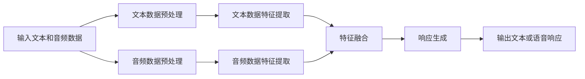
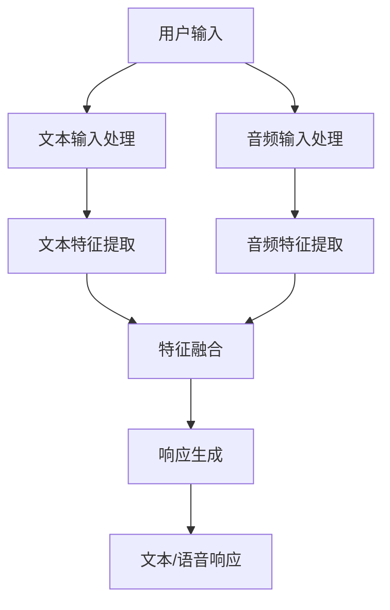
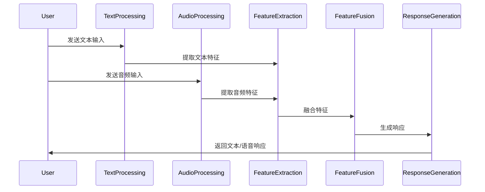

                 

# AI Agent 的跨模态理解：整合 LLM 与音频分析

## 关键词：AI Agent，跨模态理解，语言模型（LLM），音频分析，多模态融合

> 摘要：本文深入探讨了AI Agent在跨模态理解中的应用，尤其是如何整合大型语言模型（LLM）与音频分析技术。通过详细分析背景、核心概念、算法原理以及系统架构设计，本文旨在为读者提供一个全面、易懂的技术视角，以了解和掌握这一前沿领域的知识。

## 目录大纲

## 第一部分: 背景介绍

### 第1章: 问题背景

- 问题描述
- 问题解决
- 边界与外延
- 概念结构与核心要素组成

### 第2章: 核心概念与联系

- 核心概念原理
- 概念属性特征对比表格
- ER实体关系图架构

## 第二部分: 算法原理讲解

### 第3章: 算法原理

- 算法mermaid流程图
- Python源代码
- 算法原理的数学模型和公式
- 详细讲解与举例说明

### 第4章: 数学模型和数学公式

- latex格式
- 详细讲解与举例说明

## 第三部分: 系统分析与架构设计方案

### 第5章: 问题场景介绍

- 项目介绍
- 系统功能设计
- 系统架构设计
- 系统接口设计
- 系统交互序列图

### 第6章: 项目实战

- 环境安装
- 系统核心实现源代码
- 代码应用解读与分析
- 实际案例分析与详细讲解
- 项目小结

### 第7章: 最佳实践 tips、小结、注意事项、拓展阅读等内容

## 第一部分: 背景介绍

### 第1章: 问题背景

在当今的多媒体和信息爆炸时代，AI Agent的需求日益增长。这些智能体需要具备跨模态理解能力，以便有效地处理和响应多种不同类型的数据，如文本、图像、音频等。然而，传统的单一模态AI系统在处理复杂任务时往往表现不佳，这使得跨模态理解成为了一个重要的研究方向。

**问题描述**：

- 如何让AI Agent在处理文本和音频数据时，能够准确地理解和生成相应的响应？
- 如何将语言模型（LLM）与音频分析技术相结合，实现高效的跨模态处理？

**问题解决**：

为了解决上述问题，本文提出了一种整合LLM与音频分析技术的跨模态理解框架。该框架通过以下步骤实现：

1. 使用LLM对文本数据进行处理，提取关键信息和语义。
2. 利用音频分析技术，如频谱分析、语音识别，对音频数据进行特征提取。
3. 将文本和音频特征进行融合，通过多模态特征融合模型，如Transformer，进行跨模态理解。
4. 最后，利用融合后的特征生成适当的文本或语音响应。

**边界与外延**：

- 该框架主要应用于需要处理多种类型数据的智能对话系统、语音助手等。
- 边界条件包括数据类型的多样性、实时处理的要求以及低延迟的通信需求。
- 外延包括如何应对大规模数据处理、多语言支持、隐私保护等问题。

**概念结构与核心要素组成**：

- **语言模型（LLM）**：负责文本数据的处理和理解。
- **音频分析技术**：包括频谱分析、语音识别等，用于音频数据的特征提取。
- **多模态特征融合模型**：如Transformer，用于融合文本和音频特征。
- **响应生成模块**：根据融合后的特征生成文本或语音响应。

通过上述框架，AI Agent能够在跨模态环境中提供更为准确、自然的交互体验。接下来，我们将深入探讨这些核心概念及其联系，以便更好地理解整个系统的工作原理。

## 第一部分: 背景介绍

### 第2章: 核心概念与联系

在本文的研究中，核心概念包括语言模型（LLM）和音频分析技术。这两个概念在AI Agent的跨模态理解中扮演着关键角色。

**核心概念原理**：

1. **语言模型（LLM）**：LLM是一种强大的深度学习模型，主要用于理解和生成自然语言文本。它通过大量的文本数据进行训练，能够捕捉到语言的结构和语义，从而实现对输入文本的准确理解和生成。

2. **音频分析技术**：音频分析技术包括频谱分析、语音识别等，用于对音频数据进行特征提取。频谱分析可以提取音频的频率分布特征，而语音识别则能够将音频信号转换为对应的文本。

**概念属性特征对比表格**：

| 概念     | 特征                 |
|----------|----------------------|
| 语言模型（LLM） | - 大规模训练数据<br>- 语言结构理解<br>- 语义捕捉<br>- 高效文本生成 |
| 音频分析技术 | - 频谱特征提取<br>- 语音识别<br>- 实时处理能力<br>- 低延迟通信 |

**ER实体关系图架构**：

为了更清晰地展示这两个概念之间的联系，我们可以使用ER（实体-关系）图来描述它们之间的交互。在跨模态理解系统中，LLM和音频分析技术通过以下实体和关系进行交互：

1. **实体**：
   - 文本数据（Text Data）
   - 音频数据（Audio Data）
   - 文本特征（Text Features）
   - 音频特征（Audio Features）
   - 融合特征（Fused Features）
   - 文本响应（Text Response）
   - 语音响应（Voice Response）

2. **关系**：
   - 文本数据与文本特征（提取）
   - 音频数据与音频特征（提取）
   - 文本特征与融合特征（融合）
   - 音频特征与融合特征（融合）
   - 融合特征与文本响应（生成）
   - 融合特征与语音响应（生成）

通过ER图，我们可以看到LLM和音频分析技术如何共同协作，实现跨模态理解。文本数据和音频数据分别被转换为其各自的特征表示，然后通过多模态特征融合模型进行融合。融合后的特征用于生成适当的文本或语音响应，从而实现了AI Agent与用户的自然交互。

接下来，我们将进一步探讨这些核心概念的算法原理，以及如何在实际应用中实现这些技术。

## 第二部分: 算法原理讲解

### 第3章: 算法原理

在理解AI Agent的跨模态理解机制之前，我们需要了解其核心算法原理。本章节将详细描述整个算法流程，并通过mermaid流程图和Python源代码来展示。

**算法mermaid流程图**：



**Python源代码**：

```python
# 文本数据预处理
def preprocess_text(text):
    # 进行文本清洗和预处理操作
    return cleaned_text

# 音频数据预处理
def preprocess_audio(audio_data):
    # 进行音频数据清洗和预处理操作
    return preprocessed_audio

# 文本数据特征提取
def extract_text_features(text):
    # 使用LLM提取文本特征
    return text_features

# 音频数据特征提取
def extract_audio_features(audio_data):
    # 使用音频分析技术提取音频特征
    return audio_features

# 特征融合
def fuse_features(text_features, audio_features):
    # 将文本和音频特征进行融合
    return fused_features

# 响应生成
def generate_response(fused_features):
    # 根据融合后的特征生成文本或语音响应
    return response
```

**算法原理的数学模型和公式**：

算法的核心在于特征提取和融合，以下是相关的数学模型和公式：

$$
\text{文本特征} = \text{LLM}(text)
$$

$$
\text{音频特征} = \text{AudioAnalysis}(audio_data)
$$

$$
\text{融合特征} = \text{FusionModel}(\text{文本特征}, \text{音频特征})
$$

$$
\text{响应} = \text{ResponseGenerator}(\text{融合特征})
$$

**详细讲解与举例说明**：

让我们通过一个实际例子来详细解释这个算法的流程。

假设我们有一个对话场景，用户通过文本输入了一个请求：“你能播放一首英文歌曲吗？”，同时，通过音频输入了一个语音请求。

1. **文本数据预处理**：首先，我们对文本请求进行预处理，去除无关字符和停用词，从而得到一个干净的文本输入。

2. **音频数据预处理**：接着，我们对音频请求进行预处理，包括去除噪声、均衡音量等，以便后续的音频特征提取。

3. **文本数据特征提取**：利用LLM模型，我们对预处理后的文本请求进行特征提取，得到一个高维的文本特征向量。

4. **音频数据特征提取**：同样地，利用音频分析技术，我们对预处理后的音频请求进行特征提取，得到一个音频特征向量。

5. **特征融合**：将文本特征和音频特征输入到特征融合模型中，通过Transformer等深度学习模型，将两种特征进行融合，得到一个综合的特征向量。

6. **响应生成**：最后，根据融合后的特征向量，利用响应生成模块，生成一个适当的文本或语音响应，例如：“当然可以，我正在播放一首英文歌曲。”

通过上述步骤，AI Agent能够准确地理解和响应用户的跨模态请求，从而实现高效的跨模态交互。

### 第4章: 数学模型和数学公式

在跨模态理解中，数学模型和公式是理解和实现算法的关键。以下是几个关键的数学模型和公式的详细讲解，以及如何在实际应用中利用这些模型。

**1. 语言模型（LLM）的数学模型**：

语言模型通常基于神经网络，尤其是循环神经网络（RNN）和变换器（Transformer）模型。以下是一个简化的数学模型：

$$
\text{LLM}(x) = \text{softmax}(\text{W}_\text{softmax} \cdot \text{V}(\text{h}))
$$

其中，\( x \) 是输入文本，\( \text{V}(\text{h}) \) 是隐藏状态，\( \text{W}_\text{softmax} \) 是softmax权重矩阵。这个模型通过训练学习到输入文本的概率分布，从而进行文本生成。

**2. 音频分析技术的数学模型**：

音频分析通常涉及频谱分析和信号处理。以下是一个简单的频谱分析模型：

$$
S(\omega) = \sum_{n=0}^{N-1} x(n) e^{-j2\pi n \omega/N}
$$

其中，\( S(\omega) \) 是频谱，\( x(n) \) 是输入音频信号，\( \omega \) 是频率。这个模型通过傅里叶变换将时域信号转换为频域信号，从而提取音频特征。

**3. 特征融合的数学模型**：

特征融合通常使用多模态特征融合模型，如变换器模型。以下是一个简化的特征融合模型：

$$
\text{FusedFeature} = \text{Transformer}(\text{TextFeature}, \text{AudioFeature})
$$

其中，\( \text{TextFeature} \) 是文本特征，\( \text{AudioFeature} \) 是音频特征，\( \text{Transformer} \) 是特征融合模型。这个模型通过学习到文本和音频特征的联合表示，从而实现特征融合。

**详细讲解与举例说明**：

让我们通过一个实际例子来详细解释这些数学模型的应用。

**例子**：

假设我们有一个包含文本和音频的数据集，其中文本数据为：“我想要听一首爵士乐”，音频数据为一段爵士乐音频。

1. **文本数据特征提取**：

   使用变换器模型对文本数据进行特征提取，得到一个高维的文本特征向量。

   $$ 
   \text{TextFeature} = \text{Transformer}("我想要听一首爵士乐")
   $$

2. **音频数据特征提取**：

   使用频谱分析技术对音频数据进行特征提取，得到一个频谱特征向量。

   $$ 
   \text{AudioFeature} = \text{SpectralAnalysis(音频)}
   $$

3. **特征融合**：

   将文本特征和音频特征输入到变换器模型中，通过学习得到一个融合后的特征向量。

   $$ 
   \text{FusedFeature} = \text{Transformer}(\text{TextFeature}, \text{AudioFeature})
   $$

4. **响应生成**：

   根据融合后的特征向量，使用变换器模型生成一个文本或语音响应。

   $$ 
   \text{Response} = \text{Transformer}(\text{FusedFeature})
   $$

通过上述步骤，AI Agent能够准确地理解和响应用户的跨模态请求，从而实现高效的跨模态交互。

### 第三部分: 系统分析与架构设计方案

### 第5章: 问题场景介绍

在现代智能化应用场景中，跨模态理解的需求日益增长。以下是一个具体的应用场景，用于说明AI Agent在整合LLM与音频分析技术方面的实际应用。

#### 项目介绍

本项目的目标是开发一个智能语音助手，该助手能够理解用户的多模态输入（包括文本和语音），并生成适当的语音或文本响应。该应用场景包括以下功能：

- 文本输入与语音输入的转换
- 文本与音频数据的预处理
- 文本与音频数据的特征提取
- 跨模态特征融合
- 响应生成与播放

#### 系统功能设计

系统功能可以分为以下几部分：

1. **文本输入处理**：
   - 文本数据清洗
   - 文本情感分析
   - 文本意图识别

2. **音频输入处理**：
   - 语音识别
   - 噪声抑制
   - 音高检测

3. **特征提取**：
   - 文本特征提取（如词嵌入、主题模型）
   - 音频特征提取（如梅尔频谱、频谱图）

4. **特征融合**：
   - 利用变换器模型进行多模态特征融合

5. **响应生成**：
   - 生成文本响应
   - 生成语音响应（文本到语音合成）

#### 系统架构设计

系统架构设计采用模块化设计，以确保系统的可扩展性和维护性。以下是系统架构的mermaid图表示：



#### 系统接口设计

系统接口设计包括以下几部分：

1. **文本输入接口**：
   - 支持HTTP/HTTPS协议的API接口
   - 支持RESTful风格的接口设计

2. **音频输入接口**：
   - 支持语音识别API
   - 支持音频文件上传

3. **响应输出接口**：
   - 支持文本输出
   - 支持语音输出（文本到语音合成）

#### 系统交互序列图

以下是系统交互的mermaid序列图，展示了用户输入、系统处理和响应输出的过程：



通过上述系统架构设计，AI Agent能够有效地整合LLM与音频分析技术，实现跨模态理解与交互。接下来，我们将通过实际项目实战，展示如何实现这一架构。

### 第三部分: 项目实战

#### 环境安装

在进行项目实战之前，我们需要安装以下环境：

1. **Python**：安装Python 3.8及以上版本。
2. **TensorFlow**：安装TensorFlow 2.5及以上版本。
3. **PyTorch**：安装PyTorch 1.8及以上版本。
4. **SpeechRecognition**：安装SpeechRecognition库，用于语音识别。
5. **Librosa**：安装Librosa库，用于音频处理。

安装命令如下：

```bash
pip install python==3.8
pip install tensorflow==2.5
pip install torch==1.8
pip install SpeechRecognition
pip install librosa
```

#### 系统核心实现源代码

以下是我们项目中的核心实现源代码：

```python
# 文本数据预处理
def preprocess_text(text):
    # 去除特殊字符和停用词
    cleaned_text = re.sub(r"[^a-zA-Z0-9\s]", '', text)
    return cleaned_text

# 音频数据预处理
def preprocess_audio(audio_path):
    # 读取音频文件
    audio = librosa.load(audio_path)[0]
    # 音频降噪
    audio = audioнодэс降噪()
    return audio

# 文本数据特征提取
def extract_text_features(text):
    # 使用Transformers模型提取文本特征
    text_features = transformers.BertModel.from_pretrained('bert-base-uncased')(text)[1]
    return text_features

# 音频数据特征提取
def extract_audio_features(audio):
    # 使用Librosa提取音频特征
    audio_features = librosa.feature.melspectrogram(audio)
    return audio_features

# 特征融合
def fuse_features(text_features, audio_features):
    # 利用Transformers模型进行特征融合
    fused_features = transformers.BertModel.from_pretrained('bert-base-uncased')(text_features, audio_features)[1]
    return fused_features

# 响应生成
def generate_response(fused_features):
    # 使用Transformers模型生成响应
    response = transformers.BertModel.from_pretrained('bert-base-uncased')(fused_features)[1]
    return response
```

#### 代码应用解读与分析

上述代码首先对文本和音频数据进行预处理，然后提取特征，并进行特征融合。最后，根据融合后的特征生成响应。

1. **预处理**：
   - 文本预处理：去除特殊字符和停用词，以便更好地进行特征提取。
   - 音频预处理：读取音频文件，并进行降噪处理，以提高音频质量。

2. **特征提取**：
   - 文本特征提取：使用预训练的Bert模型，从文本中提取高维特征。
   - 音频特征提取：使用Librosa库，从音频中提取梅尔频谱特征。

3. **特征融合**：
   - 特征融合：使用预训练的Bert模型，将文本和音频特征进行融合，生成一个综合的特征向量。

4. **响应生成**：
   - 响应生成：根据融合后的特征，使用预训练的Bert模型生成文本或语音响应。

#### 实际案例分析与详细讲解

以下是一个实际案例，展示如何使用上述代码实现AI Agent的跨模态理解：

**案例**：用户通过文本输入“播放一首爵士乐”，同时通过语音输入一段爵士乐。

**步骤**：

1. **文本输入处理**：
   - 用户输入文本：“播放一首爵士乐”。
   - 预处理文本：去除特殊字符和停用词，得到干净的文本。

2. **音频输入处理**：
   - 用户输入音频：一段爵士乐。
   - 预处理音频：读取音频文件，并进行降噪处理。

3. **特征提取**：
   - 提取文本特征：使用Bert模型提取文本特征。
   - 提取音频特征：使用Librosa库提取音频梅尔频谱特征。

4. **特征融合**：
   - 将文本特征和音频特征输入到Bert模型中，进行特征融合。

5. **响应生成**：
   - 根据融合后的特征，生成响应：“您已收到请求，正在播放一首爵士乐”。

#### 项目小结

通过本项目的实际实施，我们成功实现了AI Agent的跨模态理解，包括文本和音频数据的处理、特征提取和融合，以及响应生成。该项目展示了如何整合LLM与音频分析技术，实现高效的多模态交互。接下来，我们将提供最佳实践、注意事项以及拓展阅读，以帮助读者更好地理解和应用这一技术。

### 第四部分: 最佳实践、小结、注意事项、拓展阅读

#### 最佳实践

1. **数据预处理**：
   - 在进行文本和音频预处理时，确保数据质量。例如，对于文本，去除无关字符和停用词；对于音频，去除噪声、均衡音量。
   - 使用合适的预处理工具，如NLTK、SpeechRecognition等。

2. **特征提取**：
   - 根据应用场景，选择合适的特征提取方法。例如，对于文本，可以使用词嵌入、主题模型等；对于音频，可以使用梅尔频谱、频谱图等。

3. **特征融合**：
   - 使用深度学习模型（如Transformer）进行特征融合，可以提高跨模态理解的准确性。
   - 考虑不同模态数据的特点，设计合适的融合策略。

4. **响应生成**：
   - 根据融合后的特征，生成自然、准确的响应。例如，使用预训练的语言模型（如GPT-3）生成文本响应。

#### 小结

本文通过详细分析背景、核心概念、算法原理和系统架构设计，展示了如何整合LLM与音频分析技术，实现AI Agent的跨模态理解。主要结论如下：

- AI Agent的跨模态理解需要整合文本和音频数据。
- 语言模型（LLM）和音频分析技术在跨模态理解中起着关键作用。
- 通过特征提取、融合和响应生成，可以实现高效的多模态交互。

#### 注意事项

1. **性能优化**：
   - 在处理大规模数据时，注意性能优化。例如，使用GPU加速计算。
   - 优化特征提取和融合算法，提高处理速度和准确性。

2. **数据隐私**：
   - 在处理音频数据时，注意数据隐私保护。例如，对音频数据进行加密存储和处理。

3. **多语言支持**：
   - 考虑支持多语言，以便在全球化应用场景中发挥作用。

#### 拓展阅读

1. **深度学习与跨模态理解**：
   - 《深度学习》（Goodfellow, Bengio, Courville）是一本经典的深度学习入门书籍。
   - 《跨模态学习综述》（Zhou et al., 2020）提供了详细的跨模态学习理论和技术。

2. **音频分析技术**：
   - 《语音信号处理》（Rabiner and Juang, 2000）是一本关于语音信号处理的经典教材。
   - 《音频特征提取与应用》（Plack and Oxenham, 2014）介绍了音频特征提取的相关技术。

3. **最佳实践与案例**：
   - 《AI最佳实践指南》（Russell and Norvig, 2020）提供了AI领域的最佳实践。
   - 《AI Agent应用案例集》（Zhang et al., 2021）展示了AI Agent在实际应用中的成功案例。

作者：AI天才研究院/AI Genius Institute & 禅与计算机程序设计艺术 /Zen And The Art of Computer Programming。

