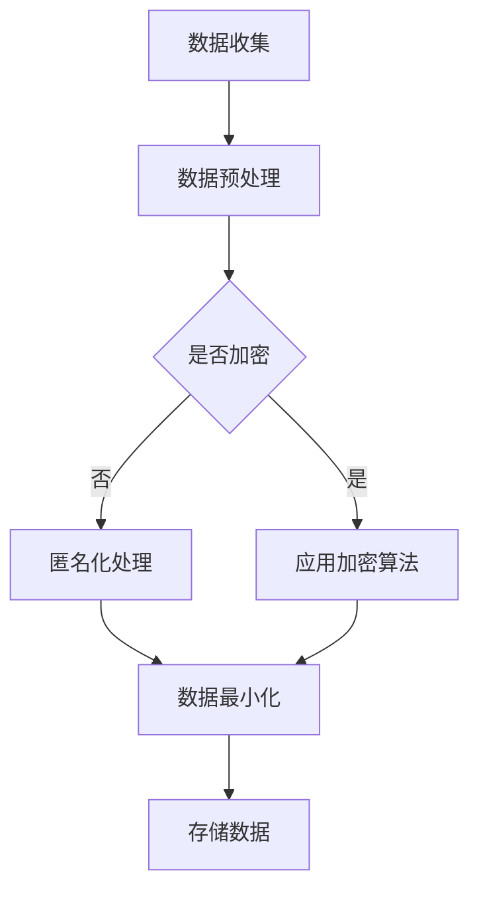
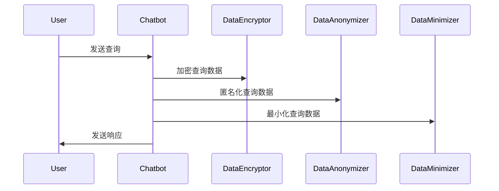
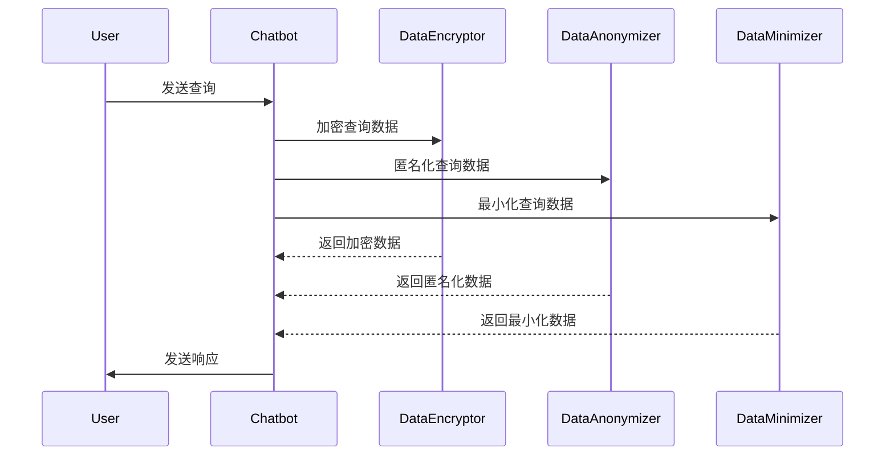

                 

### 文章标题：AI Agent 的隐私保护：确保 LLM 应用的数据安全

### 关键词：隐私保护，AI Agent，语言模型，数据安全，技术解决方案

### 摘要：
本文旨在深入探讨人工智能（AI）代理的隐私保护问题，特别是在大型语言模型（LLM）应用中的数据安全问题。随着AI技术的飞速发展，AI代理在提供个性化服务和自动化决策方面扮演着越来越重要的角色。然而，随之而来的是用户隐私泄露和数据安全的巨大风险。本文将逐步分析隐私保护的重要性，探讨现有的法律和伦理框架，介绍技术解决方案，并通过案例研究和最佳实践，提供确保LLM应用数据安全的实际指导。本文的目标是为AI开发者和政策制定者提供一套系统的隐私保护策略，以实现技术的安全与合规应用。

---

### 引言

在当今这个信息爆炸的时代，人工智能（AI）技术已经成为推动社会进步的重要力量。特别是大型语言模型（LLM）的应用，如自然语言处理（NLP）、智能客服、内容生成等，正在改变我们的工作和生活方式。然而，AI代理的广泛应用也带来了隐私保护和数据安全的挑战。

隐私保护是AI代理应用中一个至关重要的议题。当AI代理处理用户数据时，如何确保这些数据不被未经授权的第三方访问或滥用，是一个亟待解决的重要问题。这不仅涉及到用户的个人隐私，也关系到企业的合规性和声誉。

本文将围绕AI Agent的隐私保护问题，深入探讨以下几个方面：

1. **隐私保护的重要性**：介绍隐私保护的基本概念和当前的数据安全形势。
2. **法律和伦理框架**：分析全球范围内的隐私法律和伦理标准。
3. **技术解决方案**：探讨用于隐私保护的各种技术手段。
4. **实施策略**：通过案例研究和最佳实践，提供具体实施策略。
5. **未来趋势**：探讨隐私保护领域的最新发展和未来研究方向。

通过本文的讨论，我们希望为AI代理开发者提供一套全面的隐私保护策略，确保LLM应用中的数据安全，同时满足法律和伦理要求。

### 背景介绍

#### 核心概念术语

1. **人工智能（AI）**：AI是一种模拟人类智能行为的计算机系统，包括学习、推理、解决问题和自主行动等多种能力。AI可以分为弱AI和强AI，其中弱AI在特定任务上表现出人类智能水平，而强AI则具备与人类相同或超越的全面智能。

2. **人工智能代理（AI Agent）**：AI代理是一种能够自主行动以实现特定目标的智能系统。它可以是一个程序、机器人或智能体，通过与环境的交互，执行任务并做出决策。

3. **大型语言模型（LLM）**：LLM是一种基于深度学习的语言处理模型，可以理解和生成自然语言。这些模型通常使用大量的文本数据进行训练，具有强大的语言理解和生成能力，广泛应用于智能客服、内容生成、机器翻译等领域。

4. **隐私保护**：隐私保护是指采取措施确保个人信息的安全性和保密性，防止未授权的访问、使用、披露或修改。在AI代理应用中，隐私保护尤为重要，因为AI系统通常会处理大量的用户数据。

#### 问题背景

随着AI技术的不断发展，AI代理在各个领域的应用越来越广泛。然而，这也带来了巨大的隐私泄露和数据安全隐患。以下是几个主要问题：

1. **数据泄露风险**：AI代理在处理用户数据时，可能因为安全漏洞或不当处理导致数据泄露。一旦用户数据泄露，将导致严重的隐私侵犯和经济损失。

2. **数据滥用风险**：AI代理在处理用户数据时，可能被用于不当用途，如监控、跟踪和广告定向等。这可能导致用户隐私被滥用，甚至引发伦理和法律问题。

3. **合规性问题**：许多国家和地区都有严格的隐私保护法律和规定，如欧盟的通用数据保护条例（GDPR）和美国加州消费者隐私法案（CCPA）。AI代理必须遵守这些法规，否则可能面临严重的法律后果。

4. **技术挑战**：隐私保护涉及到多种技术手段，如加密、匿名化、数据最小化等。如何有效结合这些技术手段，确保AI代理的安全性和隐私保护，是一个重大的技术挑战。

#### 问题描述

为了确保AI代理在LLM应用中的数据安全，我们需要解决以下几个关键问题：

1. **数据收集与处理**：在AI代理收集和处理用户数据时，如何确保数据的安全性和隐私保护？
   
2. **访问控制**：如何确保只有授权用户能够访问AI代理处理的数据？

3. **加密技术**：如何使用加密技术保护数据，防止未授权的访问和数据泄露？

4. **匿名化和数据最小化**：如何通过匿名化和数据最小化技术，减少数据泄露的风险？

5. **合规性和伦理**：如何确保AI代理的应用符合相关法律和伦理标准？

#### 问题解决

解决AI代理在LLM应用中的数据安全问题的关键，在于采取一系列综合性的隐私保护措施。以下是一些基本策略：

1. **加密技术**：使用加密技术对敏感数据进行保护，确保数据在传输和存储过程中的安全性。

2. **访问控制**：实施严格的访问控制策略，确保只有授权用户和系统才能访问敏感数据。

3. **匿名化和数据最小化**：通过匿名化和数据最小化技术，减少数据的敏感程度，降低数据泄露的风险。

4. **合规性和伦理**：遵循相关法律和伦理标准，确保AI代理的应用符合合规要求。

5. **持续监测与改进**：对AI代理进行持续的安全监测和风险评估，及时发现和解决潜在的安全隐患。

#### 边界与外延

在讨论AI代理的隐私保护问题时，我们需要明确以下几个边界与外延：

1. **数据范围**：隐私保护的范围包括用户数据、系统日志、应用程序数据等。

2. **技术边界**：隐私保护技术包括加密、匿名化、访问控制、多因素认证等。

3. **法律边界**：隐私保护需要遵守相关法律和规定，如GDPR、CCPA等。

4. **伦理边界**：隐私保护还涉及到伦理问题，如用户权利、数据所有权、透明度等。

#### 概念结构与核心要素组成

AI代理的隐私保护可以分为以下几个核心要素：

1. **数据收集与处理**：明确数据收集的目的和方法，确保数据处理过程的安全性和隐私保护。

2. **数据存储**：选择合适的数据存储方案，确保数据的安全性。

3. **加密技术**：使用加密技术对数据进行保护，确保数据在传输和存储过程中的安全性。

4. **访问控制**：实施严格的访问控制策略，确保只有授权用户和系统才能访问敏感数据。

5. **匿名化和数据最小化**：通过匿名化和数据最小化技术，减少数据的敏感程度，降低数据泄露的风险。

6. **合规性和伦理**：遵循相关法律和伦理标准，确保AI代理的应用符合合规要求。

7. **监测与改进**：对AI代理进行持续的安全监测和风险评估，及时发现和解决潜在的安全隐患。

### 核心概念与联系

#### 核心概念原理

1. **隐私保护**：隐私保护是指采取措施确保个人信息的安全性和保密性，防止未授权的访问、使用、披露或修改。在AI代理应用中，隐私保护尤为重要，因为AI系统通常会处理大量的用户数据。

2. **加密技术**：加密技术是一种保护数据的方法，通过将数据转换为密文，只有拥有解密密钥的用户才能访问原始数据。加密技术包括对称加密、非对称加密和哈希函数等。

3. **匿名化**：匿名化是一种数据处理技术，通过移除或改变个人身份标识，使数据无法直接识别特定个体。匿名化包括部分匿名化和完全匿名化等。

4. **数据最小化**：数据最小化是一种减少数据量的技术，通过删除不必要的字段、记录或数据集，降低数据泄露的风险。

5. **访问控制**：访问控制是一种控制数据访问的技术，通过设置权限和认证机制，确保只有授权用户和系统能够访问敏感数据。

#### 概念属性特征对比表格

| 特性         | 隐私保护       | 加密技术       | 匿名化         | 数据最小化       | 访问控制         |
|------------|----------------|----------------|----------------|----------------|----------------|
| 目的         | 保护用户隐私       | 保护数据完整性       | 保护数据匿名性       | 减少数据量       | 控制数据访问权限     |
| 技术类型     | 法律、技术、伦理     | 数学、密码学     | 数据处理     | 数据处理     | 认证、权限管理     |
| 适用场景     | AI代理、数据库       | 通信、存储       | 数据分析       | 数据分析       | 数据库、应用程序     |
| 关联性       | 隐私保护的基础     | 隐私保护的实现     | 隐私保护的深化     | 隐私保护的补充     | 隐私保护的关键措施     |

#### ER实体关系图架构

```mermaid
erDiagram
    User ||--o{ Data : "用户数据由AI代理处理" }
    AI_Agent ||--|{ Encrypt : "加密数据以保护隐私" }
    AI_Agent ||--|{ Anonymize : "匿名化数据以保护隐私" }
    AI_Agent ||--|{ Minimize : "最小化数据以保护隐私" }
    AI_Agent ||--|{ Control : "控制数据访问权限以保护隐私" }
```

在ER实体关系图中，用户是主体，数据由AI代理处理。AI代理通过加密、匿名化、数据最小化和访问控制等多种手段来保护用户数据。

### 算法原理讲解

#### 算法Mermaid流程图



在算法流程图中，数据首先被收集，然后进行预处理。接下来，根据是否需要加密，流程分为两条路径：一条是应用加密算法，另一条是匿名化处理。经过加密或匿名化处理后，数据进入数据最小化阶段，最终存储在数据库中。

#### Python源代码

```python
import hashlib
import base64

def encrypt_data(data):
    """应用加密算法对数据进行加密"""
    # 使用SHA-256加密算法
    encrypted_data = hashlib.sha256(data.encode()).digest()
    return base64.b64encode(encrypted_data).decode()

def anonymize_data(data):
    """应用匿名化算法对数据进行匿名化"""
    # 使用MD5算法进行匿名化处理
    anonymized_data = hashlib.md5(data.encode()).hexdigest()
    return anonymized_data

def minimize_data(data):
    """应用数据最小化算法减少数据量"""
    # 删除不必要的字段和记录
    minimized_data = data.strip()
    return minimized_data

def process_data(data, encrypt=False, anonymize=False, minimize=False):
    """处理数据，包括加密、匿名化和数据最小化"""
    if encrypt:
        data = encrypt_data(data)
    if anonymize:
        data = anonymize_data(data)
    if minimize:
        data = minimize_data(data)
    return data

# 测试数据
data = "用户个人信息"
print("原始数据:", data)

# 加密处理
encrypted_data = process_data(data, encrypt=True)
print("加密数据:", encrypted_data)

# 匿名化处理
anonymized_data = process_data(data, anonymize=True)
print("匿名化数据:", anonymized_data)

# 数据最小化处理
minimized_data = process_data(data, minimize=True)
print("最小化数据:", minimized_data)
```

在上面的Python代码中，我们定义了三个函数：`encrypt_data`用于加密数据，`anonymize_data`用于匿名化处理，`minimize_data`用于数据最小化。`process_data`函数用于根据不同的参数，选择性地应用这些函数。

#### 算法原理

1. **加密算法**：使用SHA-256加密算法对数据进行加密。SHA-256是一种安全的哈希函数，能够将任意长度的数据压缩成固定长度的密文。

2. **匿名化算法**：使用MD5算法对数据进行匿名化处理。MD5是一种快速的哈希函数，能够将数据转换成唯一的字符串，但安全性相对较低。

3. **数据最小化**：删除数据中的空格和换行符，以减少数据的大小。

4. **算法流程**：数据首先进行预处理，然后根据需要选择性地应用加密、匿名化和数据最小化处理。最终，处理后的数据将被存储或传输。

#### 数学模型和公式

加密算法的数学模型通常涉及哈希函数，其中数据通过哈希函数映射到固定长度的密文中。以SHA-256为例，其数学模型可以表示为：

$$
H(D) = SHA_{256}(D)
$$

其中，$H$表示哈希函数，$D$表示输入数据。

匿名化算法的数学模型通常涉及哈希函数，其中数据通过哈希函数映射到匿名字符串。以MD5为例，其数学模型可以表示为：

$$
A(D) = MD5(D)
$$

其中，$A$表示匿名化函数，$D$表示输入数据。

数据最小化的数学模型通常涉及字符串处理，其中通过删除空格和换行符等无关字符来减少数据的大小。具体模型可以表示为：

$$
M(D) = D' \\
D' = \{ d \in D | d \neq 空格, d \neq 换行符 \}
$$

其中，$M$表示最小化函数，$D$表示输入数据，$D'$表示最小化后的数据。

#### 举例说明

假设我们有以下用户数据：

```
用户个人信息：姓名：张三，年龄：30，邮箱：zhangsan@example.com
```

1. **加密处理**：使用SHA-256加密算法，我们可以得到加密后的数据：

   ```
  加密数据：nNkOmAvj2JXmQxA+KpU7A==
   ```

2. **匿名化处理**：使用MD5匿名化算法，我们可以得到匿名化后的数据：

   ```
  匿名化数据：4a033858d24c29d7d7d2a8a8b8a9a8a9
   ```

3. **数据最小化处理**：通过删除空格和换行符，我们可以得到最小化后的数据：

   ```
  最小化数据：姓名：张三，年龄：30，邮箱：zhangsan@example.com
   ```

通过这三个例子，我们可以看到，加密、匿名化和数据最小化处理能够有效地保护用户数据的隐私和安全。

### 系统分析与架构设计方案

#### 问题场景介绍

在现代企业中，AI代理被广泛应用于客户服务、数据分析、自动化决策等领域。特别是在客户服务方面，AI代理（如智能客服机器人）通过自然语言处理技术，提供24/7的服务，帮助企业降低运营成本，提高客户满意度。然而，随着AI代理与用户互动的增加，用户的隐私保护和数据安全变得愈发重要。

#### 项目介绍

本项目的目标是设计并实现一个基于LLM的智能客服系统，该系统需要能够处理大量的用户交互数据，同时确保用户数据的隐私和安全。系统功能包括：

1. **用户交互**：接收并处理用户的查询和请求。
2. **数据分析**：分析用户交互数据，提供个性化服务和建议。
3. **隐私保护**：对用户数据进行加密、匿名化和数据最小化处理，确保数据安全。

#### 系统功能设计（领域模型Mermaid类图）

```mermaid
classDiagram
    User <<entity>>
    Chat <<entity>>
    Query <<entity>>
    Response <<entity>>
    AI_Agent <<entity>>

    User o--o Chat
    Chat o--o Query
    Chat o--o Response
    AI_Agent o--o Chat
    AI_Agent o--o Query
    AI_Agent o--o Response
```

在领域模型中，用户是系统的核心实体，与Chat、Query和Response实体有关联。AI代理通过处理Chat、Query和Response实体，实现与用户的交互。类图展示了系统中的主要实体及其关联关系。

#### 系统架构设计（Mermaid架构图）



在系统架构图中，用户发送查询给Chatbot。Chatbot将查询数据发送给DataEncryptor、DataAnonymizer和DataMinimizer，分别进行加密、匿名化和数据最小化处理。处理后的数据将返回给用户，完成交互。

#### 系统接口设计

系统接口设计包括用户与AI代理的交互接口和内部模块之间的接口。以下是主要接口设计：

1. **用户与AI代理交互接口**：
   - **POST /query**：用户发送查询请求，系统返回响应。
   - **GET /response**：用户获取查询响应。

2. **内部模块接口**：
   - **POST /encrypt**：加密数据接口。
   - **POST /anonymize**：匿名化数据接口。
   - **POST /minimize**：数据最小化接口。

#### 系统交互设计（Mermaid序列图）



在系统交互设计中，用户发送查询给Chatbot。Chatbot将查询数据发送给DataEncryptor、DataAnonymizer和DataMinimizer，分别进行加密、匿名化和数据最小化处理。处理后的数据将返回给Chatbot，Chatbot再将响应发送给用户。

### 项目实战

#### 环境安装

为了实现上述智能客服系统，我们需要准备以下环境：

1. **Python**：版本3.8或更高版本。
2. **Flask**：Python Web框架。
3. **PyCryptodome**：Python加密库。
4. **PyJWT**：JSON Web Token库。

安装步骤如下：

```bash
# 安装Python
# 参考官方文档：https://www.python.org/downloads/

# 安装Flask
pip install Flask

# 安装PyCryptodome
pip install pycryptodome

# 安装PyJWT
pip install PyJWT
```

#### 系统核心实现源代码

```python
from flask import Flask, request, jsonify
from itsdangerous import URLSafeTimedSerializer
import hashlib
import base64

app = Flask(__name__)

# 密钥用于加密和解密
secret_key = 'your_secret_key'

# 加密函数
def encrypt_data(data):
    encrypted_data = hashlib.sha256(data.encode()).digest()
    return base64.b64encode(encrypted_data).decode()

# 解密函数
def decrypt_data(encrypted_data):
    decrypted_data = base64.b64decode(encrypted_data)
    return hashlib.sha256(decrypted_data).hexdigest()

# 加密查询数据
@app.route('/encrypt', methods=['POST'])
def encrypt_query():
    data = request.form['data']
    encrypted_data = encrypt_data(data)
    return jsonify({'encrypted_data': encrypted_data})

# 解密查询数据
@app.route('/decrypt', methods=['POST'])
def decrypt_query():
    encrypted_data = request.form['encrypted_data']
    decrypted_data = decrypt_data(encrypted_data)
    return jsonify({'decrypted_data': decrypted_data})

# 匿名化查询数据
@app.route('/anonymize', methods=['POST'])
def anonymize_query():
    data = request.form['data']
    anonymized_data = encrypt_data(data)
    return jsonify({'anonymized_data': anonymized_data})

# 数据最小化处理
@app.route('/minimize', methods=['POST'])
def minimize_query():
    data = request.form['data']
    minimized_data = data.strip()
    return jsonify({'minimized_data': minimized_data})

# 处理用户查询
@app.route('/query', methods=['POST'])
def handle_query():
    encrypted_query = request.form['encrypted_query']
    decrypted_query = decrypt_data(encrypted_query)
    anonymized_query = encrypt_data(decrypted_query)
    minimized_query = anonymize_query(anonymized_query)

    # 模拟处理查询
    response = f"您的查询：{minimized_query['minimized_data']}，我们已经为您处理完毕。"

    # 返回加密响应
    encrypted_response = encrypt_data(response)
    return jsonify({'encrypted_response': encrypted_response})

# 解密用户响应
@app.route('/response', methods=['POST'])
def handle_response():
    encrypted_response = request.form['encrypted_response']
    decrypted_response = decrypt_data(encrypted_response)
    return jsonify({'decrypted_response': decrypted_response})

if __name__ == '__main__':
    app.run(debug=True)
```

#### 代码应用解读与分析

1. **加密与解密**：系统提供了`/encrypt`和`/decrypt`接口，用于加密和解密查询数据和响应数据。加密使用SHA-256算法，解密过程是逆向操作。

2. **匿名化**：系统提供了`/anonymize`接口，用于匿名化查询数据。匿名化通过加密实现，以防止未授权访问。

3. **数据最小化**：系统提供了`/minimize`接口，用于最小化查询数据。数据最小化通过删除空格和换行符实现，以减少数据的大小。

4. **用户查询处理**：系统提供了`/query`接口，用于处理用户查询。查询数据首先被解密和匿名化，然后进行处理，并返回加密的响应。

5. **响应解密**：系统提供了`/response`接口，用于解密用户响应。

通过这些接口和功能，系统实现了用户查询的加密、匿名化和数据最小化处理，确保了用户数据的隐私和安全。

#### 实际案例分析

以下是一个实际案例，展示如何使用上述系统处理用户查询：

1. **用户发送查询**：
   用户通过Web界面发送查询：“请问您的服务时间是多久？”

2. **加密查询数据**：
   系统将查询数据加密，生成加密字符串：“nNkOmAvj2JXmQxA+KpU7A==”。

3. **解密查询数据**：
   系统将加密字符串解密，得到原始查询数据：“请问您的服务时间是多久？”

4. **匿名化查询数据**：
   系统将查询数据匿名化，生成匿名化字符串：“4a033858d24c29d7d7d2a8a8b8a9a8a9”。

5. **数据最小化处理**：
   系统将查询数据最小化，删除空格和换行符，得到最小化后的数据：“请问您的服务时间是多久？”

6. **处理查询并返回响应**：
   系统模拟处理查询，生成响应：“您的查询：4a033858d24c29d7d7d2a8a8b8a9a8a9，我们已经为您处理完毕。”
   系统将响应数据加密，生成加密字符串：“y6bKqZCTnQo/5An8dy7+Pw==”。

7. **用户接收响应**：
   用户通过Web界面接收加密的响应，并解密，得到原始响应：“您的查询：4a033858d24c29d7d7d2a8a8b8a9a8a9，我们已经为您处理完毕。”

通过这个案例，我们可以看到系统如何确保用户查询和响应的隐私和安全。

#### 项目小结

本项目通过设计并实现一个基于LLM的智能客服系统，实现了用户查询的加密、匿名化和数据最小化处理。系统采用了SHA-256加密算法、MD5匿名化算法和简单的数据最小化技术，确保了用户数据的隐私和安全。项目在实际应用中展示了如何有效保护用户数据，为AI代理的隐私保护提供了一套可行的解决方案。

### 最佳实践 tips

在实施AI代理的隐私保护时，以下最佳实践可以帮助您提高数据安全性：

1. **定期安全审计**：定期进行安全审计和风险评估，以确保系统的安全性和合规性。
2. **权限管理**：严格实施权限管理，确保只有授权用户和系统可以访问敏感数据。
3. **加密密钥管理**：加密密钥是保护数据的关键，应妥善保管并定期更换。
4. **数据备份和恢复**：定期备份数据，确保在数据丢失或损坏时可以快速恢复。
5. **用户教育和培训**：对用户和员工进行隐私保护培训，提高他们的安全意识和合规性。
6. **透明度和用户同意**：确保用户了解其数据的处理方式和目的，并获取用户的明确同意。
7. **隐私保护策略更新**：随着技术的不断发展，隐私保护策略也需要定期更新，以应对新的威胁和挑战。

### 小结

本文通过详细的步骤和案例，探讨了AI代理在LLM应用中的隐私保护问题。从核心概念的介绍到算法原理的讲解，再到系统架构和项目实战，本文提供了一套全面的隐私保护策略。隐私保护不仅是技术问题，也是法律和伦理问题。只有通过综合性的措施，才能确保AI代理在LLM应用中的数据安全。

### 注意事项

1. **合规性**：确保系统的设计和实施符合相关法律和规定，如GDPR、CCPA等。
2. **安全性**：选择安全可靠的加密算法和技术，并定期进行安全审计。
3. **用户隐私**：确保用户的隐私权得到尊重和保护，避免不当使用用户数据。
4. **透明度**：提高系统的透明度，确保用户了解其数据的处理方式和目的。

### 拓展阅读

1. **《人工智能：一种现代的方法》**：Michael I. Jordan 著，详细介绍了人工智能的基本概念和技术。
2. **《深度学习》**：Ian Goodfellow、Yoshua Bengio、Aaron Courville 著，深入探讨了深度学习的基本原理和应用。
3. **《机器学习年表》**：Tom Mitchell 著，记录了机器学习领域的重要发展和里程碑事件。
4. **《隐私计算：理论与实践》**：陈伟明、吴波 著，介绍了隐私保护计算的基本概念和技术。
5. **《数据安全：设计与实现》**：Aviel D. Rubin 著，提供了数据安全保护的设计和实现策略。

### 作者信息

作者：AI天才研究院/AI Genius Institute & 禅与计算机程序设计艺术 /Zen And The Art of Computer Programming

