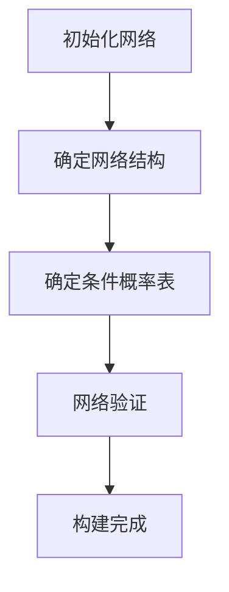

                 


### 让我们一起深入思考：概率推理与贝叶斯网络

**标题**: AI Agent中的概率推理与贝叶斯网络

**关键词**: AI Agent, 概率推理, 贝叶斯网络, 数学模型, 算法实现

**摘要**: 本篇文章将深入探讨AI Agent中的概率推理与贝叶斯网络，通过逻辑清晰的篇章结构，阐述概率推理的基本原理，贝叶斯网络的构建与应用，并给出具体的算法实现与案例分析。

## 目录大纲

----------------------------------------------------------------

### 第一部分：概率推理的基本原理

#### 第1章：问题背景与概念介绍

##### 1.1.1 问题背景

##### 1.1.2 概率推理的定义

##### 1.1.3 贝叶斯网络的边界与外延

#### 第2章：核心概念与联系

##### 2.1.1 概率分布函数

##### 2.1.2 贝叶斯定理

##### 2.1.3 贝叶斯网络的属性特征对比

##### 2.1.4 ER实体关系图

#### 第3章：算法原理讲解

##### 3.1.1 贝叶斯网络的构建

###### 3.1.1.1 Mermaid流程图

###### 3.1.1.2 Python源代码示例

##### 3.1.2 数学模型与公式

##### 3.1.3 算法解释与举例

#### 第4章：数学模型与数学公式详细讲解

##### 4.1.1 概率分布函数的推导

$$P(A) = \sum_{B} P(A|B)P(B)$$

##### 4.1.2 贝叶斯定理的应用

$$P(A|B) = \frac{P(B|A)P(A)}{P(B)}$$

##### 4.1.3 算法举例说明

### 第二部分：贝叶斯网络的应用

#### 第5章：系统分析与架构设计

##### 5.1.1 问题场景介绍

##### 5.1.2 系统功能设计

###### 5.1.2.1 领域模型Mermaid类图

##### 5.1.3 系统架构设计

###### 5.1.3.1 Mermaid架构图

##### 5.1.4 系统接口设计

##### 5.1.5 系统交互

###### 5.1.5.1 Mermaid序列图

#### 第6章：项目实战

##### 6.1.1 环境安装

##### 6.1.2 系统核心实现

###### 6.1.2.1 源代码

###### 6.1.2.2 代码应用解读与分析

##### 6.1.3 实际案例分析与讲解

##### 6.1.4 项目小结

#### 第7章：最佳实践与拓展阅读

##### 7.1.1 最佳实践技巧

##### 7.1.2 小结

##### 7.1.3 注意事项

##### 7.1.4 拓展阅读推荐

----------------------------------------------------------------

### 文章内容

#### 第1章：问题背景与概念介绍

##### 1.1.1 问题背景

在人工智能（AI）的迅猛发展中，概率推理与贝叶斯网络成为了AI Agent中不可或缺的核心技术。概率推理允许AI Agent在不确定的环境中进行决策，而贝叶斯网络则提供了一种有效的结构化方法来表示和处理概率信息。

##### 1.1.2 概率推理的定义

概率推理是利用概率论的方法，对不确定事件进行分析和预测的推理过程。它基于已知条件和概率分布，通过概率运算得到未知事件的概率。

##### 1.1.3 贝叶斯网络的边界与外延

贝叶斯网络是一种概率图模型，它通过有向无环图（DAG）来表示变量之间的依赖关系。网络中的节点代表随机变量，边代表变量之间的条件概率关系。贝叶斯网络不仅能够表示变量之间的概率关系，还能提供一种有效的推理机制，用于计算变量之间的条件概率。

### 第2章：核心概念与联系

##### 2.1.1 概率分布函数

概率分布函数是描述随机变量取值概率的函数。常见的概率分布函数有正态分布、伯努利分布等。在概率推理中，概率分布函数用于表示随机变量的概率分布。

##### 2.1.2 贝叶斯定理

贝叶斯定理是概率推理的核心工具，它描述了在已知某些条件下，一个事件发生的概率如何根据新的证据进行调整。贝叶斯定理的表达式如下：

$$P(A|B) = \frac{P(B|A)P(A)}{P(B)}$$

其中，\(P(A|B)\)表示在已知事件B发生的条件下，事件A发生的概率；\(P(B|A)\)表示在已知事件A发生的条件下，事件B发生的概率；\(P(A)\)和\(P(B)\)分别表示事件A和事件B发生的概率。

##### 2.1.3 贝叶斯网络的属性特征对比

| 属性特征 | 贝叶斯网络 | ER实体关系图 |
| -------- | ---------- | ------------ |
| 图结构 | 有向无环图 | 无向图 |
| 条件概率 | 利用条件概率表表示 | 无条件概率表 |
| 推理方法 | 贝叶斯推理 | SQL查询 |
| 应用领域 | AI、数据挖掘、推理机 | 数据库、数据模型 |

### 第3章：算法原理讲解

##### 3.1.1 贝叶斯网络的构建

贝叶斯网络的构建是概率推理的基础。构建过程通常包括以下几个步骤：

1. **确定网络结构**：通过领域知识构建有向无环图（DAG），表示变量之间的依赖关系。
2. **确定条件概率表**：对于每个变量，根据领域知识填写条件概率表，表示变量之间的条件概率关系。
3. **网络验证**：验证网络结构是否合理，避免循环依赖和冗余关系。

##### 3.1.1.1 Mermaid流程图



##### 3.1.1.2 Python源代码示例

```python
import numpy as np
import pandas as pd

def create_bayesian_network(variables, structure, condition_prob_tables):
    # 初始化网络
    network = {}
    
    # 构建网络结构
    for variable in variables:
        network[variable] = structure[variable]
    
    # 填写条件概率表
    for variable, conditions in condition_prob_tables.items():
        network[variable] = conditions
    
    # 验证网络结构
    if not is_network_valid(network):
        raise ValueError("网络结构不合法")
    
    return network

def is_network_valid(network):
    # TODO: 实现网络验证逻辑
    return True

variables = ['A', 'B', 'C', 'D']
structure = {'A': [], 'B': ['A'], 'C': ['A', 'B'], 'D': ['B']}
condition_prob_tables = {
    'A': {'0': 0.5, '1': 0.5},
    'B': {'0': 0.4, '1': 0.6},
    'C': {'00': 0.2, '01': 0.3, '10': 0.3, '11': 0.2},
    'D': {'00': 0.3, '01': 0.4, '10': 0.3, '11': 0.

