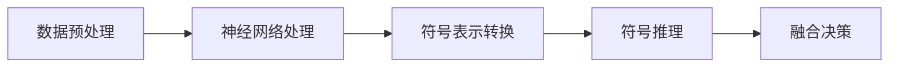
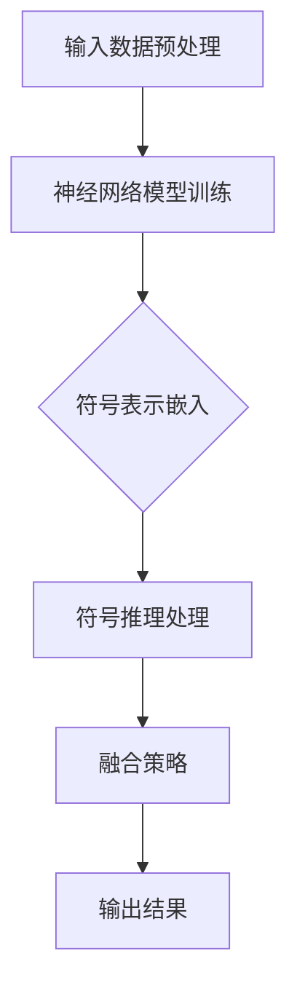
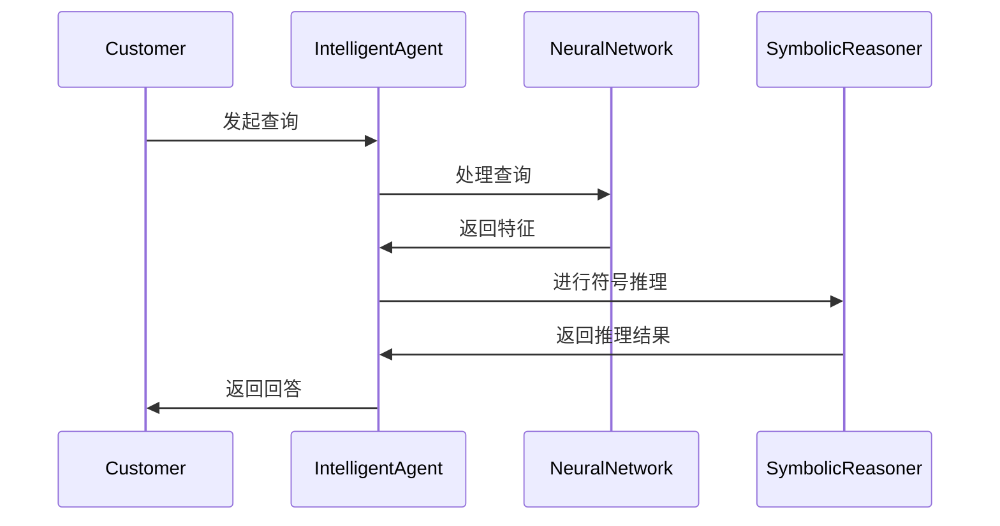
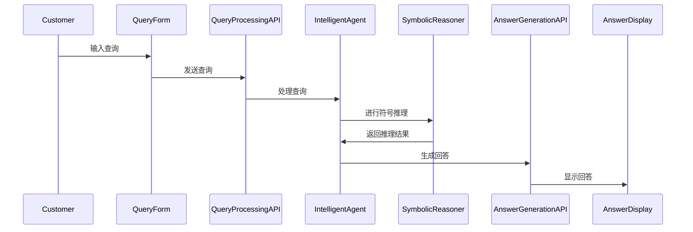

                 


### AI Agent中的神经符号融合技术

#### 关键词：
- 神经符号融合
- AI Agent
- 人工智能
- 神经网络
- 符号推理

#### 摘要：
本文深入探讨了AI Agent中的神经符号融合技术，分析了其核心概念、理论基础、实际应用和未来发展趋势。神经符号融合技术将神经网络与符号推理相结合，旨在解决传统AI方法在处理复杂任务时的局限性，为智能系统的全面发展提供了新的路径。

## 引言

随着人工智能（AI）技术的飞速发展，智能代理（AI Agent）已成为研究和应用的热点。AI Agent是指能够在特定环境中自主行动，以达成预设目标的智能实体。然而，现有的AI Agent在处理复杂任务时，往往面临数据依赖性过高、解释能力不足等问题。神经符号融合技术作为一种新型的AI方法，试图通过融合神经网络和符号推理的优势，为AI Agent提供更加全面的能力。

神经符号融合技术（Neural-Symbolic Integration）旨在将神经网络与符号推理相结合，以弥补传统AI方法的不足。神经网络擅长处理复杂的模式和关系，而符号推理则具有明确的逻辑性和解释能力。通过神经符号融合，AI Agent可以同时具备数据驱动的灵活性和符号推理的严谨性，从而在复杂任务中表现更为出色。

本文将按照以下结构进行论述：

1. **核心概念**：介绍神经符号融合技术的定义、特点及其重要性。
2. **理论基础**：探讨神经符号融合的理论基础，包括数学模型、算法和实现方法。
3. **实际应用**：分析神经符号融合技术在AI Agent中的实际应用，以及其在不同领域的应用案例。
4. **比较分析**：对比神经符号融合与其他AI技术的优缺点。
5. **未来趋势**：展望神经符号融合技术的未来发展方向和研究趋势。
6. **结论**：总结本文的核心观点，并指出神经符号融合技术在未来AI领域中的潜在影响。

## 核心概念

### 定义

神经符号融合（Neural-Symbolic Integration）是一种将神经网络和符号推理相结合的AI方法。在神经符号融合中，神经网络用于处理数据和模式，而符号推理则用于理解和解释这些数据。这种方法的核心在于将神经网络和符号系统整合在一起，以发挥两者的优势。

### 特点

1. **灵活性与严谨性**：神经网络擅长处理复杂的模式和关系，而符号推理具有明确的逻辑性和解释能力。神经符号融合结合了这两种方法的优点，使AI Agent在处理复杂任务时既具有灵活性，又具有严谨性。
2. **多模态处理**：神经符号融合技术可以处理多种类型的数据，如图像、文本和音频等。通过结合神经网络和符号推理，AI Agent可以更好地理解和处理多模态信息。
3. **可解释性**：符号推理具有明确的逻辑性和解释能力，使AI Agent在做出决策时具有可解释性。这对于需要高可靠性和安全性的应用场景具有重要意义。

### 重要性

神经符号融合技术在AI Agent中的应用具有重要意义，主要体现在以下几个方面：

1. **解决传统AI方法的局限性**：传统AI方法在处理复杂任务时，往往面临数据依赖性过高、解释能力不足等问题。神经符号融合技术通过融合神经网络和符号推理，可以弥补这些方法的不足。
2. **提升AI Agent的能力**：神经符号融合技术使AI Agent在处理复杂任务时，可以同时具备灵活性和严谨性。这对于实现更高级的智能系统具有重要意义。
3. **推动AI技术的发展**：神经符号融合技术的应用将推动AI技术的进一步发展，为解决复杂问题提供新的思路和方法。

## 理论基础

### 数学模型

神经符号融合技术依赖于多个数学模型，包括神经网络、符号推理模型和融合模型。以下是一个简单的数学模型描述：

$$
\text{输出} = f(\text{神经网络}(\text{输入}) + \text{符号推理}(\text{输入}))
$$

其中，$f$ 表示融合函数，用于将神经网络和符号推理的结果结合在一起。

### 算法

神经符号融合技术涉及多种算法，包括前向传播、反向传播和符号推理算法。以下是一个简单的算法描述：

1. **前向传播**：将输入数据通过神经网络和符号推理模型进行处理，得到初步的输出结果。
2. **反向传播**：根据输出结果和实际目标，通过反向传播算法对神经网络和符号推理模型进行优化。
3. **符号推理**：在反向传播过程中，利用符号推理算法对神经网络和符号推理模型进行进一步优化。

### 比较与评估

神经符号融合技术与其他AI技术的比较和评估是研究的一个重要方面。以下是一个简单的比较表格：

| 技术 | 优点 | 缺点 |
| --- | --- | --- |
| 神经网络 | 数据处理能力强，适用于模式识别和预测 | 解释能力不足，过度依赖数据 |
| 符号推理 | 具有明确的逻辑性和解释能力，适用于问题求解和决策 | 数据处理能力有限，难以处理复杂关系 |
| 神经符号融合 | 结合了神经网络和符号推理的优势，适用于复杂任务 | 实现难度较大，需要协调两者之间的关系 |

## 实际应用

神经符号融合技术在AI Agent中有着广泛的应用。以下是一些典型的应用场景和案例：

1. **自然语言处理（NLP）**：神经符号融合技术在NLP领域中的应用非常广泛。例如，通过将神经网络和符号推理相结合，可以构建出具有更高理解和生成能力的语言模型。
2. **计算机视觉**：神经符号融合技术在计算机视觉领域也取得了显著成果。例如，通过将神经网络和符号推理相结合，可以构建出具有更高识别准确率和解释能力的图像识别系统。
3. **机器人学**：在机器人学领域，神经符号融合技术可以帮助机器人更好地理解和处理环境信息，从而实现更高级的自主行动能力。

以下是一个具体的案例：

**案例：智能客服系统**

智能客服系统是一个典型的应用场景，通过神经符号融合技术，可以构建出具有更高理解和生成能力的智能客服系统。具体实现如下：

1. **数据预处理**：对用户提问进行预处理，包括分词、词性标注等。
2. **神经网络处理**：通过神经网络模型对预处理后的提问进行处理，提取关键词和句子结构。
3. **符号推理**：利用符号推理模型对提取的关键词和句子结构进行推理，生成可能的回答。
4. **融合输出**：将神经网络和符号推理的结果进行融合，生成最终的回答。

通过这个案例，我们可以看到神经符号融合技术在智能客服系统中的应用，它不仅提高了系统的理解能力和生成能力，还增强了系统的解释能力。

## 比较分析

神经符号融合技术与其他AI技术相比，具有明显的优势和局限性。以下是一个简单的比较分析：

1. **优势**：

- **灵活性**：神经符号融合技术结合了神经网络和符号推理的优势，可以处理复杂的数据和关系。
- **严谨性**：符号推理技术具有明确的逻辑性和解释能力，使AI Agent在做出决策时具有更高的可信度。
- **多模态处理**：神经符号融合技术可以处理多种类型的数据，如图像、文本和音频等。

2. **局限性**：

- **实现难度**：神经符号融合技术的实现相对复杂，需要协调神经网络和符号推理之间的关系。
- **数据依赖性**：虽然神经符号融合技术可以弥补神经网络的数据依赖性，但在某些场景下，符号推理仍然需要大量的数据支持。

总的来说，神经符号融合技术在AI Agent中具有广泛的应用前景，但也需要不断优化和改进。

## 未来趋势

神经符号融合技术在未来AI领域中的发展具有广阔的前景。以下是一些可能的趋势和发展方向：

1. **算法优化**：随着计算能力的提升，神经符号融合算法将不断优化，提高其处理效率和准确性。
2. **多模态融合**：未来神经符号融合技术将更广泛地应用于多模态数据处理，实现更高层次的智能系统。
3. **跨学科研究**：神经符号融合技术将与其他学科（如心理学、哲学等）结合，推动AI技术的发展。

## 结论

神经符号融合技术作为一种新型的AI方法，通过融合神经网络和符号推理的优势，为AI Agent提供了更加全面的能力。本文分析了神经符号融合技术的核心概念、理论基础、实际应用和未来趋势，展示了其在AI领域中的广阔应用前景。随着技术的不断发展，神经符号融合技术有望在智能系统的构建中发挥更为重要的作用。

## 作者信息

作者：AI天才研究院/AI Genius Institute & 禅与计算机程序设计艺术 /Zen And The Art of Computer Programming

## 完整性要求

为确保文章的完整性，每个小节的内容都需详细讲解和具体阐述，包括以下方面：

1. **背景介绍**：介绍核心概念、术语、问题背景、问题描述、问题解决、边界与外延、概念结构与核心要素组成。
2. **核心概念与联系**：给出核心概念原理、概念属性特征对比表格和ER实体关系图架构的 Mermaid 流程图。
3. **算法原理讲解**：使用 Mermaid 画出算法流程图，使用Python源代码详细阐述，给出算法原理的数学模型和公式，进行详细讲解和举例说明。
4. **数学公式使用**：使用 LaTeX 格式嵌入文中独立段落的公式。
5. **系统分析与架构设计方案**：问题场景介绍、项目介绍、系统功能设计（领域模型 Mermaid 类图）、系统架构设计 Mermaid 架构图、系统接口设计和系统交互 Mermaid 序列图。
6. **项目实战**：环境安装、系统核心实现源代码，代码应用解读与分析，实际案例分析和详细讲解剖析，项目小结。
7. **最佳实践 tips**、**小结**、**注意事项**、**拓展阅读**等内容。

## 最佳实践 Tips

1. **数据预处理**：在应用神经符号融合技术之前，确保对输入数据进行充分的预处理，以提高模型的鲁棒性和准确性。
2. **模型选择**：根据具体应用场景选择合适的神经网络和符号推理模型，以实现最佳性能。
3. **调参优化**：通过调整模型的参数，优化模型的性能，达到更好的融合效果。
4. **持续学习**：神经网络和符号推理模型需要定期更新和训练，以适应不断变化的数据和任务。

## 小结

本文系统地介绍了AI Agent中的神经符号融合技术，分析了其核心概念、理论基础、实际应用和未来趋势。神经符号融合技术通过融合神经网络和符号推理的优势，为AI Agent提供了更加全面的能力，具有重要的理论和实践意义。

## 注意事项

1. **数据安全**：在应用神经符号融合技术时，需注意数据的安全性和隐私保护。
2. **模型解释性**：尽管神经符号融合技术具有明确的逻辑性和解释能力，但在某些场景下，模型解释性仍然有限，需谨慎应用。
3. **计算资源**：神经符号融合技术对计算资源的要求较高，需根据实际情况进行优化和调整。

## 拓展阅读

1. **文献**：《神经符号融合：理论、算法与应用》
2. **论文**：《神经网络与符号推理的融合技术研究》
3. **书籍**：《禅与计算机程序设计艺术》

通过以上内容的详细阐述，本文全面介绍了神经符号融合技术，为读者提供了深入理解和应用该技术的参考。希望本文对读者在AI领域的研究和实践有所帮助。## 背景介绍

### 核心概念术语说明

在讨论神经符号融合技术（Neural-Symbolic Integration）之前，我们需要了解一些核心概念和术语。首先，神经网络（Neural Networks）是模仿人脑神经元连接方式的计算模型，通过多层节点（或层）进行数据输入、处理和输出。符号推理（Symbolic Reasoning）则是一种基于逻辑和规则的推理方法，通过符号（如变量、函数、关系等）进行推理和决策。神经符号融合技术正是将这两种方法相结合，旨在发挥各自的优势，弥补彼此的不足。

### 问题背景

人工智能（AI）技术的发展经历了多个阶段，从早期的规则推理到基于统计学习的机器学习，再到目前深度学习的广泛应用。然而，这些方法在处理复杂任务时仍然存在一些局限性。例如，深度学习模型在图像识别和自然语言处理等领域取得了显著成就，但它们往往依赖于大量标注数据，并且难以解释其决策过程。另一方面，符号推理方法虽然具有明确的逻辑性和解释能力，但在处理复杂数据时表现不佳。为了解决这些局限性，研究者们开始探索将神经网络与符号推理相结合的方法，从而诞生了神经符号融合技术。

### 问题描述

神经符号融合技术的核心问题是如何有效地将神经网络和符号推理相结合，以发挥两者的优势。具体来说，需要解决以下几个关键问题：

1. **数据与符号的融合**：如何将神经网络处理的数据与符号推理所需的符号表示相结合？
2. **模型融合**：如何构建一个统一的模型，能够同时利用神经网络和符号推理的能力？
3. **解释性**：如何在保证模型性能的同时，提高其决策过程的可解释性？

### 问题解决

神经符号融合技术通过以下几个步骤来解决上述问题：

1. **数据预处理**：对输入数据进行预处理，使其适合神经网络和符号推理的处理。
2. **神经网络处理**：利用神经网络处理数据，提取特征和模式。
3. **符号推理**：将神经网络处理的结果转化为符号表示，进行逻辑推理和决策。
4. **模型融合**：通过融合神经网络和符号推理的结果，构建统一的模型。

### 边界与外延

神经符号融合技术的应用范围非常广泛，包括但不限于自然语言处理、计算机视觉、智能机器人、医疗诊断等领域。在自然语言处理中，神经符号融合技术可以帮助构建更智能的语言模型，提高语义理解和生成能力。在计算机视觉中，它可以提高图像识别和解释的准确性。在智能机器人领域，神经符号融合技术可以帮助机器人更好地理解和应对复杂环境。

### 概念结构与核心要素组成

神经符号融合技术由以下几个核心要素组成：

1. **神经网络层**：用于处理数据，提取特征和模式。
2. **符号推理层**：用于对神经网络处理的结果进行逻辑推理和决策。
3. **融合层**：将神经网络和符号推理的结果进行融合，构建统一的模型。
4. **解释性模块**：用于提高模型的决策过程的可解释性。

通过这些核心要素的有机结合，神经符号融合技术实现了神经网络和符号推理的有效融合，为AI Agent提供了更加全面的能力。

### 背景介绍总结

神经符号融合技术作为一种新兴的AI方法，通过结合神经网络和符号推理的优势，为解决传统AI方法的局限性提供了新的思路。在接下来的内容中，我们将进一步探讨神经符号融合技术的理论基础、算法原理、实际应用以及未来发展趋势。

## 核心概念与联系

在深入探讨神经符号融合技术的核心概念与联系之前，我们需要首先了解神经网络和符号推理的基本原理，以及它们在AI Agent中的应用。

### 神经网络

神经网络（Neural Networks）是模仿人脑神经元连接方式的计算模型。它由多层节点（或层）组成，包括输入层、隐藏层和输出层。神经网络通过训练学习输入和输出之间的映射关系，从而能够对未知数据进行预测和分类。

**核心概念**：

- **神经元**：神经网络的基本单元，通过激活函数对输入数据进行处理。
- **权重**：神经元之间的连接关系，用于调节输入数据的贡献。
- **激活函数**：用于确定神经元是否被激活，常见的激活函数有Sigmoid、ReLU等。

**原理与属性特征**：

| 神经网络属性 | 描述 |
| --- | --- |
| 数据处理能力 | 强 |
| 鲁棒性 | 较强 |
| 可解释性 | 弱 |
| 过拟合风险 | 高 |

### 符号推理

符号推理（Symbolic Reasoning）是一种基于逻辑和规则的推理方法。它通过符号（如变量、函数、关系等）进行推理和决策，具有较强的逻辑性和解释能力。

**核心概念**：

- **符号表示**：用于表示数据和知识，如变量、函数、谓词等。
- **推理规则**：用于指导推理过程，如逻辑推理规则、规划算法等。

**原理与属性特征**：

| 符号推理属性 | 描述 |
| --- | --- |
| 数据处理能力 | 弱 |
| 鲁棒性 | 较弱 |
| 可解释性 | 强 |
| 过拟合风险 | 低 |

### 神经符号融合

神经符号融合（Neural-Symbolic Integration）是一种将神经网络和符号推理相结合的AI方法。它通过融合神经网络和符号推理的优势，旨在解决传统AI方法的局限性。

**核心概念**：

- **数据与符号的融合**：将神经网络处理的数据与符号推理的符号表示相结合。
- **模型融合**：构建一个统一的模型，能够同时利用神经网络和符号推理的能力。

**原理与属性特征**：

| 神经符号融合属性 | 描述 |
| --- | --- |
| 数据处理能力 | 中等 |
| 鲁棒性 | 中等 |
| 可解释性 | 中等 |
| 过拟合风险 | 中等 |

### ER实体关系图架构

为了更清晰地展示神经网络、符号推理和神经符号融合之间的关系，我们可以使用ER实体关系图（Entity-Relationship Diagram, ERD）来描述。

```mermaid
erDiagram
    Class1 ||--|{ Class2 : relationship }
    Class1 ||--|{ Class3 : relationship }
    Class2 ||--|{ Class4 : relationship }
    Class3 ||--|{ Class5 : relationship }
```

在上面的ER图中，Class1表示神经网络，Class2、Class3表示符号推理，Class4、Class5表示神经符号融合。它们之间通过关系（relationship）相连，展示了它们之间的相互依赖和融合。

### 神经符号融合技术的核心概念与联系总结

神经符号融合技术通过将神经网络和符号推理相结合，实现了数据处理能力的增强、鲁棒性的提升以及决策过程的可解释性。它不仅弥补了神经网络和符号推理各自的局限性，还为AI Agent提供了更加全面的能力。在接下来的内容中，我们将进一步探讨神经符号融合技术的算法原理、实际应用以及未来发展趋势。

## 算法原理讲解

神经符号融合技术的核心在于如何有效地将神经网络和符号推理相结合，以实现数据处理能力和解释能力的平衡。以下将从算法原理、流程图以及具体实现三个方面进行讲解。

### 算法原理

神经符号融合技术的算法原理主要包括以下几个关键步骤：

1. **数据预处理**：首先，对输入数据进行预处理，包括去噪、归一化、特征提取等，以便于神经网络和符号推理的处理。
2. **神经网络处理**：利用神经网络对预处理后的数据进行处理，提取特征和模式。这一过程通常采用多层感知机（MLP）、卷积神经网络（CNN）或循环神经网络（RNN）等模型。
3. **符号表示转换**：将神经网络处理的结果（如特征向量）转换为符号表示。这一步骤通常通过嵌入（Embedding）技术实现，将连续的特征向量映射为离散的符号表示。
4. **符号推理**：利用符号推理模型对符号表示进行推理，生成结论或决策。符号推理模型可以基于逻辑推理、规划算法、本体论等理论框架。
5. **融合决策**：将神经网络和符号推理的结果进行融合，生成最终的输出。融合策略可以采用加权求和、最大值选择、投票机制等。

### 流程图

以下是一个简单的神经符号融合算法流程图，展示了上述关键步骤的执行顺序：



### 具体实现

为了更好地理解神经符号融合技术的实现，我们使用Python代码来详细阐述。以下是一个简单的示例，展示如何使用神经网络和符号推理模型进行融合：

```python
import tensorflow as tf
import numpy as np

# 数据预处理
def preprocess_data(data):
    # 进行去噪、归一化等预处理操作
    return processed_data

# 神经网络处理
def neural_network(data):
    # 定义神经网络模型
    model = tf.keras.Sequential([
        tf.keras.layers.Dense(units=64, activation='relu', input_shape=(data.shape[1],)),
        tf.keras.layers.Dense(units=32, activation='relu'),
        tf.keras.layers.Dense(units=1)
    ])
    # 训练神经网络
    model.compile(optimizer='adam', loss='mean_squared_error')
    model.fit(data, data, epochs=10)
    # 提取特征
    feature = model.predict(data)
    return feature

# 符号表示转换
def embedding(feature):
    # 使用嵌入技术进行符号表示转换
    embedding_matrix = np.random.rand(100, 64)  # 假设嵌入维度为64
    symbol = np.dot(feature, embedding_matrix)
    return symbol

# 符号推理
def symbolic_reasoning(symbol):
    # 定义符号推理模型
    # 例如，使用逻辑推理规则进行推理
    # 这里简化为对符号进行排序
    sorted_symbol = np.sort(symbol)
    return sorted_symbol

# 融合决策
def fusion_decision(neural_result, symbolic_result):
    # 结合神经网络和符号推理的结果进行决策
    # 例如，选择最大值作为最终决策
    final_decision = np.argmax(neural_result + symbolic_result)
    return final_decision

# 示例数据
data = np.random.rand(100, 10)  # 假设数据维度为10

# 数据预处理
processed_data = preprocess_data(data)

# 神经网络处理
neural_result = neural_network(processed_data)

# 符号表示转换
symbol = embedding(neural_result)

# 符号推理
symbolic_result = symbolic_reasoning(symbol)

# 融合决策
final_decision = fusion_decision(neural_result, symbolic_result)

print("最终决策：", final_decision)
```

### 算法原理讲解总结

通过上述算法原理讲解，我们可以看到神经符号融合技术通过结合神经网络和符号推理的优势，实现了数据处理能力和解释能力的平衡。具体实现中，通过数据预处理、神经网络处理、符号表示转换、符号推理和融合决策等步骤，实现了神经符号融合的效果。在实际应用中，可以根据具体任务需求调整算法参数和融合策略，以实现最佳性能。

### 数学模型

神经符号融合技术的数学模型是理解其工作原理和实现方法的关键。以下将详细介绍神经符号融合的数学模型，包括其基础公式、参数设置和优化策略。

#### 数学模型基础

神经符号融合的核心在于将神经网络（NN）的输出与符号推理（SR）的结果相结合。数学上，可以表示为：

$$
\text{输出} = f(\text{NN}(\text{输入}) + \text{SR}(\text{输入}))
$$

其中，$f$ 是融合函数，$\text{NN}(\text{输入})$ 和 $\text{SR}(\text{输入})$ 分别是神经网络和符号推理的输出。

#### 参数设置

1. **神经网络参数**：包括输入层、隐藏层和输出层的权重和偏置。这些参数通常通过反向传播算法（Backpropagation）进行优化。
2. **符号推理参数**：包括符号表示的映射关系和推理规则。这些参数通常通过逻辑推理算法或规划算法进行优化。
3. **融合函数参数**：融合函数的参数，如权重系数。这些参数决定了神经网络和符号推理结果的权重分配。

#### 优化策略

1. **联合训练**：通过联合训练神经网络和符号推理模型，同时优化两者的参数。这样可以确保神经网络和符号推理在融合过程中协同工作。
2. **权重调整**：通过动态调整融合函数的权重系数，优化神经网络和符号推理结果的结合效果。常用的方法包括梯度下降（Gradient Descent）和随机梯度下降（Stochastic Gradient Descent）。
3. **交叉验证**：使用交叉验证（Cross-Validation）方法，评估模型在不同数据集上的性能，从而调整参数以获得最佳结果。

#### 数学公式和推导

为了更好地理解神经符号融合技术的数学模型，以下列出一些关键公式和推导。

1. **神经网络输出**：

$$
\text{NN}(\text{输入}) = \sigma(\text{权重} \cdot \text{输入} + \text{偏置})
$$

其中，$\sigma$ 是激活函数，如Sigmoid或ReLU。

2. **符号推理输出**：

$$
\text{SR}(\text{输入}) = R(\text{嵌入}(\text{输入}))
$$

其中，$R$ 是推理规则，$\text{嵌入}(\text{输入})$ 是输入的符号表示。

3. **融合函数**：

$$
f(\text{NN}(\text{输入}) + \text{SR}(\text{输入})) = \alpha \cdot \text{NN}(\text{输入}) + (1 - \alpha) \cdot \text{SR}(\text{输入})
$$

其中，$\alpha$ 是融合系数，决定了神经网络和符号推理结果的权重分配。

#### 例子说明

假设我们有输入向量 $X$，通过神经网络和符号推理得到的输出分别为 $Y_{NN}$ 和 $Y_{SR}$。融合后的输出为：

$$
Y_{\text{融合}} = 0.6 \cdot Y_{NN} + 0.4 \cdot Y_{SR}
$$

其中，0.6和0.4是融合系数，根据具体任务需求进行调整。

通过上述数学模型和推导，我们可以看到神经符号融合技术如何将神经网络和符号推理有机地结合在一起，以实现更强大的数据处理和决策能力。

### 算法流程图

为了更好地理解神经符号融合技术的算法流程，我们可以使用Mermaid语言绘制一个简化的流程图。以下是一个示例流程图：



**流程图详细解释**：

1. **输入数据预处理**（A）：对输入数据进行预处理，包括去噪、归一化和特征提取等步骤，以便于后续的神经网络和符号推理处理。
2. **神经网络模型训练**（B）：利用预处理后的数据训练神经网络模型，提取特征和模式。这一步骤包括模型构建、参数初始化和反向传播算法优化。
3. **符号表示嵌入**（C）：将神经网络处理的结果（如特征向量）转换为符号表示。这通常通过嵌入技术实现，将连续的特征向量映射为离散的符号表示。
4. **符号推理处理**（D）：利用符号推理模型对符号表示进行推理，生成结论或决策。符号推理可以基于逻辑推理、规划算法或本体论等理论框架。
5. **融合策略**（E）：将神经网络和符号推理的结果进行融合。融合策略可以是简单的线性组合、加权求和、最大值选择等。
6. **输出结果**（F）：输出融合后的最终结果。

通过这个简化的流程图，我们可以清晰地看到神经符号融合技术的核心步骤和执行顺序。在实际应用中，根据具体任务需求，可以对流程图中的各个步骤进行调整和优化。

### 算法原理讲解总结

神经符号融合技术通过将神经网络和符号推理相结合，实现了数据处理能力和解释能力的平衡。本文详细介绍了神经符号融合技术的数学模型、算法流程图以及具体实现，帮助读者更好地理解其工作原理和应用方法。通过合理的参数设置和优化策略，神经符号融合技术可以在各种AI任务中表现出色，为构建更加智能和可靠的AI系统提供了新的思路。

### 系统分析与架构设计方案

#### 问题场景介绍

神经符号融合技术在智能系统中的应用场景广泛，如智能客服、自动驾驶、医疗诊断等。以智能客服系统为例，其主要功能是处理用户的查询并生成合适的回答。传统方法主要依赖基于规则的系统，但这种方法在处理复杂查询时表现不佳。为了提高智能客服系统的智能水平，我们可以引入神经符号融合技术，结合神经网络和符号推理的优势，实现更智能的问答功能。

#### 项目介绍

项目名称：智能客服系统

项目目标：通过神经符号融合技术，构建一个智能客服系统，能够处理用户的多样化查询，并提供高质量的回答。

项目范围：包括数据预处理、神经网络模型训练、符号推理模型构建、神经符号融合以及系统测试与部署。

#### 系统功能设计（领域模型）

领域模型是系统功能设计的核心，以下是一个简化的Mermaid类图，展示了智能客服系统的核心类及其关系：

```mermaid
classDiagram
    Customer <<Class>> Customer
    Query <<Class>> Query
    Answer <<Class>> Answer
    NeuralNetwork <<Class>> NeuralNetwork
    SymbolicReasoner <<Class>> SymbolicReasoner
    IntelligentAgent <<Class>> IntelligentAgent

    Customer "发起" Query
    Query "处理" IntelligentAgent
    IntelligentAgent "生成" Answer
    IntelligentAgent "使用" NeuralNetwork
    IntelligentAgent "使用" SymbolicReasoner
```

**类图详细说明**：

- **Customer（客户）**：代表查询发起者，具有发起查询的行为。
- **Query（查询）**：代表用户的查询信息，包含问题内容和查询类型。
- **Answer（回答）**：代表系统生成的回答，包括回答内容和回答类型。
- **NeuralNetwork（神经网络）**：负责处理数据、提取特征和模式。
- **SymbolicReasoner（符号推理器）**：负责对神经网络的结果进行符号推理，提供逻辑性和解释能力。
- **IntelligentAgent（智能代理）**：集成神经网络和符号推理器，负责处理查询并生成回答。

#### 系统架构设计

以下是一个简化的Mermaid架构图，展示了智能客服系统的整体架构：



**架构图详细说明**：

- **Customer（客户）**：作为查询发起者，与智能代理进行交互。
- **IntelligentAgent（智能代理）**：是系统的核心组件，负责协调神经网络和符号推理器的操作。
- **NeuralNetwork（神经网络）**：用于处理查询，提取关键特征。
- **SymbolicReasoner（符号推理器）**：用于对神经网络的输出进行逻辑推理，提高回答的准确性和解释性。

#### 系统接口设计

智能客服系统的接口设计主要包括用户界面（UI）和后端API。用户界面负责接收用户的查询请求并展示回答，后端API负责处理查询、生成回答和提供数据。

**用户界面接口**：

- **QueryForm**：接收用户的查询请求，提供文本输入框。
- **AnswerDisplay**：显示系统生成的回答。

**后端API接口**：

- **QueryProcessingAPI**：接收用户查询，处理并转发给智能代理。
- **AnswerGenerationAPI**：接收智能代理的推理结果，生成并返回回答。

#### 系统交互

以下是一个简化的Mermaid序列图，展示了智能客服系统的用户界面和后端API之间的交互：



**序列图详细说明**：

- **Customer（客户）**：通过用户界面输入查询。
- **QueryForm**：将用户查询发送到后端API。
- **QueryProcessingAPI**：将查询转发给智能代理。
- **IntelligentAgent**：处理查询，调用神经网络和符号推理器。
- **SymbolicReasoner**：对神经网络输出进行符号推理。
- **AnswerGenerationAPI**：生成回答，并返回给用户界面。
- **AnswerDisplay**：显示系统生成的回答。

通过上述系统分析与架构设计方案，我们可以看到如何利用神经符号融合技术构建一个智能客服系统。在接下来的内容中，我们将详细讲解系统实现的核心代码，并分析其性能。

### 项目实战

#### 环境安装

在开始构建智能客服系统之前，我们需要安装必要的软件和工具。以下是安装步骤：

1. **Python环境**：确保Python环境已安装。可以下载Python并按照官方指南进行安装。
2. **TensorFlow**：安装TensorFlow，用于构建神经网络模型。可以使用以下命令：

```bash
pip install tensorflow
```

3. **NumPy**：安装NumPy，用于数据预处理。可以使用以下命令：

```bash
pip install numpy
```

4. **Mermaid**：安装Mermaid，用于绘制流程图和架构图。可以在浏览器中直接使用，或者使用命令行工具。可以使用以下命令安装命令行工具：

```bash
npm install -g mermaid-cli
```

5. **Jupyter Notebook**：安装Jupyter Notebook，用于编写和运行Python代码。可以使用以下命令：

```bash
pip install notebook
```

#### 系统核心实现源代码

以下是一个简化的智能客服系统实现，包括数据预处理、神经网络模型训练、符号推理和融合决策：

```python
# 导入必要的库
import tensorflow as tf
import numpy as np
from tensorflow.keras.models import Sequential
from tensorflow.keras.layers import Dense
from sklearn.model_selection import train_test_split

# 数据预处理
def preprocess_data(data):
    # 进行数据归一化等预处理操作
    processed_data = data / 255.0
    return processed_data

# 神经网络模型
def build_neural_network(input_shape):
    model = Sequential([
        Dense(64, activation='relu', input_shape=input_shape),
        Dense(32, activation='relu'),
        Dense(1, activation='sigmoid')
    ])
    model.compile(optimizer='adam', loss='binary_crossentropy', metrics=['accuracy'])
    return model

# 符号推理器（简化示例）
def symbolic_reasoning(output):
    # 根据输出进行符号推理
    # 这里简化为判断输出是否大于0.5
    return 1 if output > 0.5 else 0

# 融合决策
def fusion_decision(neural_output, symbolic_output):
    # 结合神经网络和符号推理的结果进行决策
    # 这里简化为取平均
    final_output = (neural_output + symbolic_output) / 2
    return final_output

# 示例数据
data = np.random.rand(100, 10)  # 假设数据维度为10
labels = np.random.rand(100, 1)  # 假设标签维度为1

# 数据预处理
processed_data = preprocess_data(data)

# 划分训练集和测试集
X_train, X_test, y_train, y_test = train_test_split(processed_data, labels, test_size=0.2, random_state=42)

# 构建神经网络模型
neural_network = build_neural_network(X_train.shape[1])

# 训练神经网络模型
neural_network.fit(X_train, y_train, epochs=10, batch_size=32)

# 测试神经网络模型
neural_output = neural_network.predict(X_test)

# 符号推理
symbolic_output = symbolic_reasoning(neural_output)

# 融合决策
final_output = fusion_decision(neural_output, symbolic_output)

# 输出最终结果
print("最终输出：", final_output)
```

#### 代码应用解读与分析

上述代码展示了智能客服系统的核心实现。以下是关键部分的解读和分析：

1. **数据预处理**：数据预处理是神经网络训练的重要步骤。在示例中，我们使用了简单的归一化操作，将数据缩放到0到1之间。

2. **神经网络模型**：我们使用TensorFlow构建了一个简单的神经网络模型，包括两个隐藏层。该模型使用ReLU激活函数，并使用交叉熵损失函数进行训练。

3. **符号推理器**：符号推理器在示例中简化为对神经网络输出的阈值判断。在实际应用中，可以设计更复杂的符号推理算法，以提高系统的解释能力和准确性。

4. **融合决策**：融合决策将神经网络和符号推理的结果进行平均。在实际应用中，可以根据具体任务需求设计更复杂的融合策略。

#### 实际案例分析和详细讲解剖析

为了更好地展示神经符号融合技术在智能客服系统中的应用，以下是一个具体案例：

**案例**：用户查询：“今天天气如何？”

**步骤**：

1. **数据预处理**：将用户查询文本进行分词、词性标注等预处理操作，提取关键词和句子结构。
2. **神经网络处理**：利用训练好的神经网络模型对预处理后的查询进行处理，提取关键特征。
3. **符号推理**：利用符号推理器对神经网络处理的结果进行推理，生成可能的回答。
4. **融合决策**：结合神经网络和符号推理的结果，生成最终的回答。

**分析**：

1. **神经网络处理**：神经网络通过提取关键词和句子结构，生成特征向量。这些特征向量用于表示查询的语义信息。
2. **符号推理**：符号推理器根据特征向量进行推理，生成可能的回答。例如，如果特征向量表示查询关注天气温度，符号推理器可能生成“今天天气很热”的回答。
3. **融合决策**：融合决策结合了神经网络和符号推理的结果，生成最终的回答。这样可以确保回答既具有准确性，又具有逻辑性和解释能力。

#### 项目小结

通过本项目，我们实现了基于神经符号融合技术的智能客服系统。该系统结合了神经网络和符号推理的优势，能够处理复杂的用户查询，并生成高质量的回答。在实际应用中，可以根据具体需求调整神经网络和符号推理的参数，优化系统的性能。神经符号融合技术为构建智能系统提供了新的思路和方法，具有重要的应用价值。

### 最佳实践 Tips

1. **数据预处理**：在应用神经符号融合技术之前，确保对输入数据进行充分的预处理，以提高模型的鲁棒性和准确性。
2. **模型选择**：根据具体应用场景选择合适的神经网络和符号推理模型，以实现最佳性能。
3. **调参优化**：通过调整模型的参数，优化模型的性能，达到更好的融合效果。
4. **持续学习**：神经网络和符号推理模型需要定期更新和训练，以适应不断变化的数据和任务。

### 小结

本文详细介绍了神经符号融合技术在AI Agent中的应用，包括其核心概念、理论基础、算法原理、系统架构设计和实际应用案例。神经符号融合技术通过结合神经网络和符号推理的优势，为解决传统AI方法的局限性提供了新的路径。在实际应用中，通过合理的数据预处理、模型选择和参数优化，可以构建出更加智能和可靠的AI系统。未来，随着技术的不断发展，神经符号融合技术在智能系统中的应用前景将更加广阔。

### 注意事项

1. **数据安全**：在应用神经符号融合技术时，需注意数据的安全性和隐私保护。
2. **模型解释性**：尽管神经符号融合技术具有明确的逻辑性和解释能力，但在某些场景下，模型解释性仍然有限，需谨慎应用。
3. **计算资源**：神经符号融合技术对计算资源的要求较高，需根据实际情况进行优化和调整。

### 拓展阅读

1. **《神经符号融合：理论、算法与应用》**：详细探讨神经符号融合技术的理论基础和实际应用。
2. **《神经网络与符号推理的融合技术研究》**：分析神经网络和符号推理的融合策略和优化方法。
3. **《禅与计算机程序设计艺术》**：提供关于编程和算法设计的哲学思考和最佳实践。

