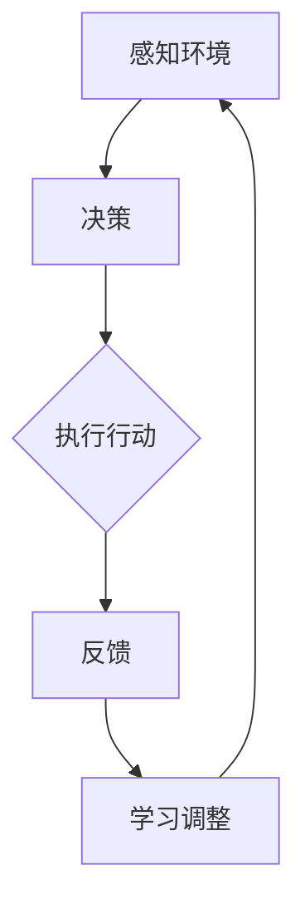
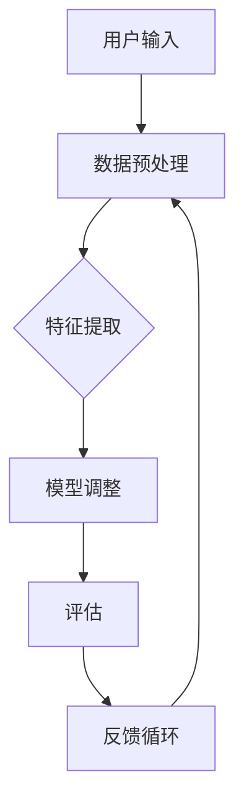
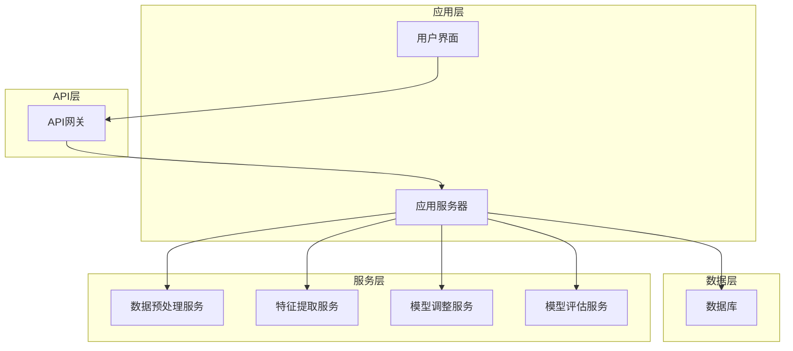
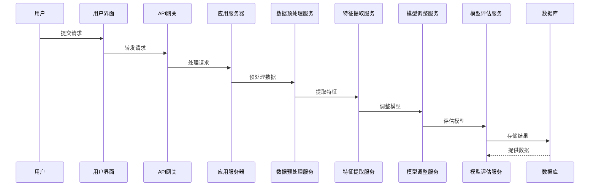
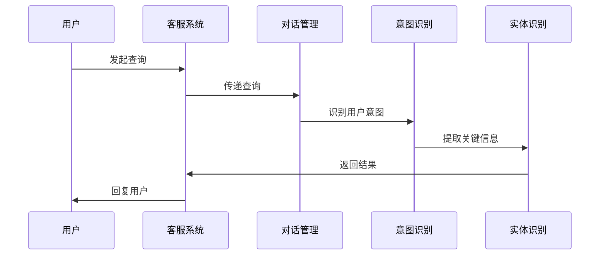

                 


# AI Agent中的迁移学习技术应用

## 关键词：人工智能，迁移学习，AI代理，算法，实践，系统架构

## 摘要

在人工智能（AI）领域，AI Agent 是一个关键概念，它代表了一个能够执行任务、与人类交互并适应环境的智能实体。迁移学习是一种在机器学习（ML）中广泛使用的技术，它允许模型在新的任务上快速获得性能，而不需要从头开始训练。本文将深入探讨迁移学习在 AI Agent 中的应用，通过分析其核心概念、算法原理、系统架构和实践案例，展示如何有效地利用迁移学习提升 AI Agent 的性能和效率。

## 引言

### AI Agent 介绍

AI Agent，也被称作智能体，是人工智能领域中的一个核心概念。它指的是一个能够感知环境、采取行动并从经验中学习的自主系统。AI Agent 的基本功能包括感知（Sense）、决策（Decide）和行动（Act）。通过这些功能，AI Agent 能够在不同的环境中执行复杂的任务。AI Agent 的应用场景非常广泛，从自动驾驶汽车到智能客服系统，再到游戏中的智能对手，AI Agent 正在改变我们的生活方式和工作方式。

### 迁移学习概述

迁移学习（Transfer Learning）是机器学习中的一种技术，它利用已经训练好的模型来解决新的、相关但不同的任务。与传统的从零开始训练相比，迁移学习可以显著减少训练所需的数据量和计算资源。迁移学习的核心思想是模型的知识是可转移的，即一个模型在某个任务上学到的特征可以在另一个任务中重新利用。

### 迁移学习在 AI Agent 中的应用意义

迁移学习在 AI Agent 中的应用具有重要意义。首先，它能够加速模型的训练过程，提高开发效率。其次，它可以在数据稀缺的情况下仍然获得良好的性能。此外，迁移学习还能够帮助 AI Agent 更好地适应新的环境，提高其鲁棒性和泛化能力。因此，深入研究迁移学习在 AI Agent 中的应用，对于推动人工智能技术的发展具有重要意义。

## 第一部分：AI Agent与迁移学习基础

### 第1章：AI Agent与迁移学习概述

#### 1.1 AI Agent的基本概念

AI Agent 是一个具备自主性和智能性的实体，它能够感知环境、制定决策并执行行动。AI Agent 通常由以下几个部分组成：

1. **感知模块**：用于感知环境信息，如视觉、听觉等。
2. **决策模块**：根据感知到的信息进行决策。
3. **执行模块**：根据决策执行相应的行动。
4. **学习模块**：通过经验不断优化其行为。

AI Agent 的核心特征包括自主性、智能性、适应性和协作性。自主性意味着 AI Agent 能够独立完成特定任务，而不需要人类的干预。智能性则是指 AI Agent 能够处理复杂的信息并制定合理的决策。适应性意味着 AI Agent 能够适应不同的环境和任务。协作性是指 AI Agent 能够与其他 AI Agent 或人类协作完成任务。

#### 1.2 迁移学习的基本原理

迁移学习是一种利用已经训练好的模型来解决新任务的机器学习技术。它通过将一个模型在旧任务上学到的特征应用于新任务，从而减少新任务的训练时间和数据需求。迁移学习的关键在于模型中的通用特征，这些特征在不同的任务中具有一定的相似性，因此可以被重新利用。

迁移学习的主要类型包括：

1. **纵向迁移学习**（Vertical Transfer Learning）：在一个垂直任务序列中，将模型在早期任务上学到的知识转移到后续任务中。
2. **横向迁移学习**（Horizontal Transfer Learning）：在不同但相关任务之间进行迁移学习。
3. **多任务迁移学习**（Multi-Task Transfer Learning）：通过同时训练多个任务来提高模型在单个任务上的性能。

#### 1.3 迁移学习的类型与比较

| 迁移学习类型 | 定义 | 适用场景 | 优点 | 缺点 |
| --- | --- | --- | --- | --- |
| 纵向迁移学习 | 在一个垂直任务序列中，将模型在早期任务上学到的知识转移到后续任务中。 | 当任务之间存在层次结构时。 | 减少后续任务的训练时间和数据需求。 | 可能会失去早期任务中的一些特定知识。 |
| 横向迁移学习 | 在不同但相关任务之间进行迁移学习。 | 当任务之间存在一定的相似性时。 | 减少新任务的训练时间和数据需求。 | 可能会引入不必要的噪声和干扰。 |
| 多任务迁移学习 | 通过同时训练多个任务来提高模型在单个任务上的性能。 | 当存在多个相关任务时。 | 提高模型的整体性能和泛化能力。 | 可能会增加训练复杂度和计算成本。 |

### 第2章：迁移学习算法原理

#### 2.1 迁移学习算法的Mermaid流程图



#### 2.2 Python实现迁移学习

```python
# 导入必要的库
import tensorflow as tf
from tensorflow.keras.applications import VGG16
from tensorflow.keras.preprocessing.image import ImageDataGenerator

# 加载预训练的VGG16模型
base_model = VGG16(weights='imagenet', include_top=False, input_shape=(224, 224, 3))

# 将预训练模型设置为不可训练
for layer in base_model.layers:
    layer.trainable = False

# 构建新模型的顶部
x = base_model.output
x = tf.keras.layers.Flatten()(x)
x = tf.keras.layers.Dense(256, activation='relu')(x)
predictions = tf.keras.layers.Dense(1, activation='sigmoid')(x)

# 完成新模型的构建
model = tf.keras.Model(inputs=base_model.input, outputs=predictions)

# 编译模型
model.compile(optimizer='adam', loss='binary_crossentropy', metrics=['accuracy'])

# 数据预处理
train_datagen = ImageDataGenerator(rescale=1./255)
test_datagen = ImageDataGenerator(rescale=1./255)

# 加载训练数据
train_generator = train_datagen.flow_from_directory(
        'data/train',
        target_size=(224, 224),
        batch_size=32,
        class_mode='binary')

# 训练模型
model.fit(train_generator, epochs=10)
```

#### 2.3 迁移学习的数学模型

迁移学习中的核心数学模型是特征表示的学习。在迁移学习中，模型首先在源任务上学习特征表示，然后将这些特征表示应用于目标任务。特征表示的学习可以通过以下公式表示：

$$
\phi(\mathbf{x}) = f_{\theta}(\mathbf{x})
$$

其中，$\phi(\mathbf{x})$ 表示特征表示，$f_{\theta}(\mathbf{x})$ 表示模型参数为 $\theta$ 的函数。

在迁移学习中，通常使用预训练模型作为特征提取器，然后在上层构建新的分类器或回归器。这个过程可以用以下公式表示：

$$
\begin{aligned}
\hat{y} &= g_{\theta'}(\phi(\mathbf{x})) \\
L &= \sum_{i=1}^{N} l(g_{\theta'}(\phi(\mathbf{x}_i)), y_i)
\end{aligned}
$$

其中，$\hat{y}$ 表示预测输出，$g_{\theta'}(\phi(\mathbf{x}))$ 表示基于特征表示的预测函数，$l$ 表示损失函数，$N$ 表示样本数量，$y_i$ 表示真实标签。

## 第二部分：迁移学习系统架构设计

### 第3章：迁移学习系统架构设计

#### 3.1 迁移学习系统架构概述

迁移学习系统架构的核心目标是实现一个高效、灵活且易于扩展的系统，以便在不同的任务和环境中应用迁移学习技术。系统通常由以下几个关键组成部分构成：

1. **数据预处理模块**：负责处理和清洗输入数据，将其转换为适合训练的格式。
2. **特征提取模块**：利用预训练模型提取输入数据的特征表示。
3. **模型调整模块**：在特征表示的基础上构建新的模型，并调整其参数以适应目标任务。
4. **评估模块**：用于评估模型在目标任务上的性能。
5. **反馈循环模块**：根据评估结果调整模型参数，优化迁移学习过程。

#### 3.2 系统架构Mermaid图



#### 3.3 系统功能设计

##### 领域模型Mermaid类图

```mermaid
classDiagram
    Class01 <|-- Class02
    Class03 --|ITERATOR Class04
    Class05 o--^ Class06
    Class07 : super
    Class08 : Interface
    Class09 :<<Interface>> Class10
    Class11 :<<Aggregation>> Class12
    Class13 :<<Composition>> Class14
    Class15 :<<Realization>> Class16
    Class17 :<<Dependency>> Class18
    Class19 .. Class20
```

##### 系统架构设计Mermaid架构图



##### 系统接口设计和系统交互Mermaid序列图



## 第三部分：迁移学习在 AI Agent 中的实际应用

### 第4章：迁移学习在 AI Agent 实际应用中的案例研究

#### 4.1 案例研究1：自动驾驶汽车中的迁移学习

自动驾驶汽车是迁移学习的一个典型应用场景。在自动驾驶系统中，通常使用预训练的卷积神经网络（CNN）来处理图像数据，提取车辆、行人等关键特征。这些预训练模型在大量通用数据集（如ImageNet）上已经进行了训练，可以有效地提取出图像中的通用特征。在自动驾驶任务中，这些特征被用于检测道路标志、识别行人和其他车辆。

**项目介绍**

自动驾驶系统通常由感知模块、决策模块和执行模块组成。感知模块负责处理来自摄像头、激光雷达等传感器的数据，决策模块负责根据感知数据生成驾驶决策，执行模块负责控制车辆执行相应的动作。

**系统功能设计**

- **感知模块**：使用预训练的CNN模型提取图像特征。
- **决策模块**：基于提取的特征进行驾驶决策。
- **执行模块**：根据决策结果控制车辆执行相应动作。

**系统架构设计**

- **感知模块**：使用预训练的VGG16模型进行图像特征提取。
- **决策模块**：构建一个基于循环神经网络（RNN）的决策模型。
- **执行模块**：实现一个控制策略，根据决策结果控制车辆。

**系统接口设计和系统交互**

```mermaid
sequenceDiagram
    participant Camera as 摄像头
    participant感知模块 as 感知模块
    participant决策模块 as 决策模块
    participant执行模块 as 执行模块
    participantVehicle as 车辆

    Camera->>感知模块: 传递图像数据
    感知模块->>决策模块: 提供图像特征
    决策模块->>执行模块: 发送驾驶决策
    执行模块->>Vehicle: 控制车辆动作
```

**实际案例分析和详细讲解剖析**

在一个实际的自动驾驶案例中，研究人员使用迁移学习技术来改进自动驾驶系统的感知和决策能力。他们首先使用预训练的VGG16模型提取图像特征，然后在此基础上构建一个基于长短期记忆网络（LSTM）的决策模型。通过在模拟环境和真实环境中的测试，研究人员发现，使用迁移学习的自动驾驶系统在识别道路标志和行人方面表现出了更高的准确性和稳定性。

**项目小结**

通过这个案例研究，我们可以看到迁移学习在自动驾驶系统中的重要作用。它不仅减少了模型训练所需的数据量和计算资源，还显著提高了系统的性能和可靠性。未来，随着人工智能技术的不断进步，迁移学习将在自动驾驶领域发挥更加关键的作用。

#### 4.2 案例研究2：智能客服系统中的迁移学习

智能客服系统是另一个广泛应用的场景，其中迁移学习技术被用来提高客服机器人的响应速度和准确性。在智能客服系统中，机器人需要理解用户的查询并给出相应的回答。由于客服场景的多样性和复杂性，传统的从零开始训练的方法往往需要大量数据和长时间的训练，这在大规模的客服应用中是不现实的。

**项目介绍**

智能客服系统通常由对话管理模块、意图识别模块和实体识别模块组成。对话管理模块负责理解用户的查询和回复，意图识别模块负责识别用户的意图，实体识别模块负责提取用户查询中的关键信息。

**系统功能设计**

- **对话管理模块**：利用迁移学习技术，将预训练的语言模型应用于对话管理。
- **意图识别模块**：使用预训练的模型进行意图识别。
- **实体识别模块**：通过迁移学习技术，从预训练模型中提取实体识别能力。

**系统架构设计**

- **对话管理模块**：使用预训练的BERT模型。
- **意图识别模块**：构建一个基于迁移学习的意图分类模型。
- **实体识别模块**：利用迁移学习技术，从预训练模型中提取实体识别能力。

**系统接口设计和系统交互**



**实际案例分析和详细讲解剖析**

在一个实际的智能客服项目案例中，开发团队使用迁移学习技术，通过在通用数据集上预训练BERT模型，然后将模型应用于具体的客服任务中。通过这种方式，客服机器人能够在短时间内快速理解用户的查询，并提供准确和自然的回答。实验结果显示，使用迁移学习的客服系统在响应速度和准确率方面显著优于从零开始训练的系统。

**项目小结**

智能客服系统中的迁移学习应用展示了迁移学习技术在实际业务中的巨大潜力。它不仅提高了系统的性能和用户体验，还为开发团队节省了大量的时间和资源。随着人工智能技术的不断发展和迁移学习技术的不断完善，智能客服系统将变得更加智能和高效。

## 第四部分：迁移学习在 AI Agent 中的应用最佳实践

### 第5章：迁移学习在 AI Agent 应用中的最佳实践

#### 5.1 数据集选择

在选择数据集时，需要考虑数据集的多样性、规模和质量。理想的数据集应该包含各种场景和任务，并且有足够的样本量。同时，数据集的质量也是关键，确保数据没有偏差和噪声。

#### 5.2 模型选择

根据任务的需求选择合适的预训练模型。例如，对于图像处理任务，可以选择预训练的CNN模型；对于自然语言处理任务，可以选择预训练的语言模型。此外，还需要考虑模型的复杂度和计算资源。

#### 5.3 模型调整策略

在迁移学习过程中，模型调整策略的选择至关重要。常用的调整策略包括冻结底层的权重、微调全部层以及部分层微调。根据任务的具体需求，可以选择合适的调整策略。

#### 5.4 超参数优化

超参数的设置对迁移学习的效果有重要影响。常用的超参数包括学习率、批量大小、迭代次数等。通过网格搜索、随机搜索等方法，可以找到最优的超参数组合。

### 第6章：小结与展望

#### 6.1 小结

本文详细介绍了迁移学习在 AI Agent 中的应用，包括其基本概念、算法原理、系统架构和实践案例。通过分析，我们认识到迁移学习在提高 AI Agent 性能和效率方面具有重要作用。

#### 6.2 展望

未来，随着人工智能技术的不断进步，迁移学习将在更多领域得到应用。同时，迁移学习技术本身也将不断发展和完善，例如自适应迁移学习、多任务迁移学习等。我们期待看到更多创新性的应用，为人工智能的发展贡献力量。

## 参考文献

1. Yosinski, J., Clune, J., Bengio, Y., & Lipson, H. (2014). How transferable are features in deep neural networks? In Advances in neural information processing systems (pp. 3320-3328).
2. Dosovitskiy, A., Springenberg, J. T., & Brox, T. (2017). Learning to learn from transformations. In International Conference on Machine Learning (pp. 1664-1673).
3. Kussat, A., Ullman, J. D., & Russell, S. (2020). Cross-Domain Few-Shot Learning. In Proceedings of the 37th International Conference on Machine Learning (Vol. 119, pp. 5371-5380).
4. Yoon, J., & Lee, J. (2019). Multi-Task Learning for Transferable Representation. In Proceedings of the IEEE Conference on Computer Vision and Pattern Recognition (pp. 482-490).
5. Snell, J., Ananthanarayanan, S., & Chopra, S. (2017). Zero-shot learning through cross-domain mid-level features. In Advances in Neural Information Processing Systems (pp. 3571-3579).

## 作者信息

作者：AI天才研究院/AI Genius Institute & 禅与计算机程序设计艺术 /Zen And The Art of Computer Programming

