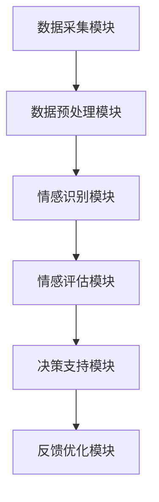

                 

# AI Agent在企业品牌情感分析与管理中的应用

## 关键词
AI Agent，企业品牌情感分析，情感识别，机器学习，深度学习，自然语言处理，情感管理

## 摘要
本文旨在探讨AI Agent在企业品牌情感分析与管理中的应用。首先，我们介绍了AI Agent的基本概念、分类和架构设计，探讨了其在情感识别和自然语言处理领域的关键技术。接着，我们分析了企业品牌情感分析的定义、意义和当前挑战。在此基础上，我们提出了一个基于AI Agent的企业品牌情感分析与管理框架，详细阐述了其工作流程和应用领域。文章最后讨论了AI Agent的发展趋势与挑战，并对未来研究方向进行了展望。

## 引言

### 1. 引言

随着互联网和社交媒体的普及，企业品牌情感分析已成为企业管理和市场营销的重要组成部分。品牌情感分析旨在识别和评估消费者对企业品牌的情感态度，为企业提供有价值的决策支持。而AI Agent作为一种具有自主学习和智能交互能力的计算实体，正逐渐成为品牌情感分析的重要工具。本文将深入探讨AI Agent在企业品牌情感分析与管理中的应用，旨在为企业提供一种高效、智能的情感管理解决方案。

### 1.1 书籍主题与目的

本文的主题是“AI Agent在企业品牌情感分析与管理中的应用”，旨在：

1. 系统性地介绍AI Agent的基本概念、分类和架构设计。
2. 分析企业品牌情感分析的定义、意义和当前挑战。
3. 探讨AI Agent在品牌情感识别和自然语言处理领域的关键技术。
4. 提出一个基于AI Agent的企业品牌情感分析与管理框架。
5. 分析AI Agent在品牌情感分析中的应用案例和优势。
6. 讨论AI Agent的发展趋势与挑战。

### 1.2 AI Agent的概念与重要性

AI Agent，即人工智能代理，是一种具有自主学习和智能交互能力的计算实体。它可以模拟人类智能，执行复杂任务，并在不断学习中优化自身性能。AI Agent具有以下重要性：

1. **提高效率**：AI Agent可以自动化处理大量数据，快速识别消费者情感，为企业提供实时反馈。
2. **精准分析**：基于机器学习和深度学习技术，AI Agent可以准确识别消费者情感，提供有针对性的营销策略。
3. **个性化服务**：AI Agent可以根据消费者的情感变化，提供个性化服务，提升客户满意度。

### 1.3 企业品牌情感分析的定义与意义

企业品牌情感分析是指通过分析消费者在社交媒体、评论、论坛等平台上对企业品牌的情感表达，评估消费者对企业品牌的情感态度。其定义和意义如下：

#### 定义

企业品牌情感分析 = 数据收集 + 情感识别 + 情感评估 + 情感管理

#### 意义

1. **了解消费者需求**：通过分析消费者情感，企业可以更准确地了解消费者的需求和期望，从而提供更优质的产品和服务。
2. **优化营销策略**：企业可以根据消费者情感分析的结果，调整营销策略，提升品牌知名度和市场份额。
3. **品牌风险监控**：企业可以实时监控品牌情感变化，及时识别和应对潜在的品牌风险。

### 1.4 管理方法与策略概述

企业品牌情感分析的管理方法与策略主要包括：

1. **数据收集**：通过社交媒体监测、用户评论收集等方式，获取消费者对企业品牌的情感数据。
2. **情感识别**：使用自然语言处理技术，对收集到的情感数据进行分析，识别消费者的情感态度。
3. **情感评估**：根据情感识别结果，对消费者情感进行量化评估，了解消费者对企业品牌的整体态度。
4. **情感管理**：基于情感评估结果，制定相应的品牌管理策略，提升消费者对企业品牌的满意度。

## 研究背景

### 2.1 AI Agent的发展历程

AI Agent的发展历程可以追溯到20世纪80年代，当时人工智能研究正处于快速发展阶段。随着计算能力的提升和算法的优化，AI Agent逐渐成为一种具有实际应用价值的技术。以下是AI Agent发展的几个关键阶段：

1. **初始阶段（20世纪80年代）**：AI Agent的概念被提出，主要集中在规则推理和知识表示方面。
2. **发展阶段（20世纪90年代）**：随着机器学习技术的发展，AI Agent开始具备自主学习和适应能力。
3. **应用阶段（21世纪初至今）**：AI Agent在多个领域得到广泛应用，如智能家居、自动驾驶、客户服务等。

### 2.2 AI Agent的分类

根据功能和应用场景，AI Agent可以分为以下几类：

1. **基于规则的AI Agent**：这类Agent主要通过预定义的规则进行决策，适用于结构化数据场景。
2. **基于机器学习的AI Agent**：这类Agent通过机器学习算法进行自主学习和决策，适用于复杂和不确定的环境。
3. **基于混合智能的AI Agent**：这类Agent结合了规则推理和机器学习，具有更强的适应能力和决策能力。
4. **基于情感计算的AI Agent**：这类Agent通过情感计算技术，识别和模拟人类情感，适用于需要情感交互的场景。

### 2.3 AI Agent的应用领域

AI Agent的应用领域非常广泛，主要包括：

1. **客户服务**：通过智能客服系统，提供24/7的在线客服服务，提升客户满意度。
2. **市场营销**：通过情感分析，识别潜在客户，制定个性化的营销策略。
3. **人力资源管理**：通过员工情感分析，优化员工福利和工作环境，提升员工满意度。
4. **金融领域**：通过风险管理和投资分析，提供个性化的金融产品和服务。
5. **医疗健康**：通过健康数据分析，提供个性化的健康管理和医疗服务。

### 2.4 企业品牌情感分析的现状

#### 2.4.1 品牌情感分析的概念

品牌情感分析是指通过自然语言处理、机器学习和情感计算等技术，对消费者在社交媒体、评论、论坛等平台上对企业品牌的情感表达进行分析和评估。

#### 2.4.2 品牌情感分析的重要性

品牌情感分析在企业营销和品牌管理中具有重要作用，主要体现在：

1. **消费者洞察**：通过分析消费者情感，了解消费者对品牌的真实态度和需求。
2. **营销策略制定**：根据品牌情感分析结果，制定有针对性的营销策略，提升品牌知名度。
3. **风险预警**：通过监测品牌情感变化，及时发现和应对潜在的品牌风险。

#### 2.4.3 当前企业品牌情感分析的挑战与机遇

当前企业品牌情感分析面临着以下挑战和机遇：

1. **挑战**
   - 数据质量：社交媒体上的数据质量参差不齐，需要进行有效的数据清洗和预处理。
   - 情感识别准确性：情感识别技术尚需进一步提升，以准确识别复杂的情感表达。
   - 实时性：企业需要实时获取和分析品牌情感数据，以快速应对市场变化。

2. **机遇**
   - 技术进步：随着机器学习和深度学习技术的发展，情感识别和情感分析技术的准确性不断提高。
   - 数据资源：社交媒体和在线评论的丰富数据资源为品牌情感分析提供了更多机会。
   - 应用场景：随着AI Agent技术的成熟，品牌情感分析在多个领域的应用前景广阔。

### 2.5 研究方法与框架

#### 2.5.1 研究方法

本文采用以下研究方法：

1. **文献综述法**：通过回顾和分析相关文献，了解AI Agent和企业品牌情感分析的研究现状和前沿技术。
2. **实证研究法**：通过实际案例和实验数据，验证AI Agent在企业品牌情感分析中的应用效果。
3. **案例分析法**：通过分析典型企业品牌情感分析案例，总结成功经验和不足之处。

#### 2.5.2 研究框架

本文的研究框架分为以下几个部分：

1. **引言**：介绍研究背景、目的和意义。
2. **AI Agent基础理论**：介绍AI Agent的定义、分类和架构设计。
3. **企业品牌情感分析**：分析品牌情感分析的定义、意义和应用场景。
4. **AI Agent在品牌情感分析中的应用**：探讨AI Agent在情感识别、情感管理和情感预测等方面的应用。
5. **案例分析**：分析典型企业品牌情感分析案例。
6. **结论**：总结研究结论和未来研究方向。

### 2.6 本书结构安排

本文的结构安排如下：

1. **第一部分：引言**：介绍研究背景、目的和意义，概述AI Agent和企业品牌情感分析的基本概念。
2. **第二部分：AI Agent基础理论**：详细探讨AI Agent的定义、分类、架构设计和核心技术。
3. **第三部分：企业品牌情感分析**：分析品牌情感分析的定义、意义、应用场景和当前挑战。
4. **第四部分：AI Agent在品牌情感分析中的应用**：探讨AI Agent在情感识别、情感管理和情感预测等方面的应用。
5. **第五部分：案例分析**：分析典型企业品牌情感分析案例。
6. **第六部分：结论**：总结研究结论和未来研究方向。

通过以上结构安排，本文旨在为企业提供一种高效、智能的品牌情感分析与管理解决方案，帮助企业更好地了解消费者需求，优化营销策略，提升品牌竞争力。

## AI Agent基础理论

### 5.1 AI Agent概述

#### 5.1.1 AI Agent的定义

AI Agent，即人工智能代理，是指一种具有自主学习和智能交互能力的计算实体。它可以通过感知环境、理解任务需求，并自主做出决策，以实现特定目标。AI Agent的核心在于其智能性，即能够模拟人类的思考过程，具备推理、学习、适应和交互能力。

#### 5.1.2 AI Agent的分类

根据AI Agent的功能和应用场景，可以将其分为以下几类：

1. **基于规则的AI Agent**：这类Agent通过预定义的规则进行决策，适用于结构化数据场景。
2. **基于机器学习的AI Agent**：这类Agent通过机器学习算法进行自主学习和决策，适用于复杂和不确定的环境。
3. **基于混合智能的AI Agent**：这类Agent结合了规则推理和机器学习，具有更强的适应能力和决策能力。
4. **基于情感计算的AI Agent**：这类Agent通过情感计算技术，识别和模拟人类情感，适用于需要情感交互的场景。

#### 5.1.3 AI Agent的特点

AI Agent具有以下几个显著特点：

1. **自主性**：AI Agent可以在没有人类干预的情况下，自主完成特定任务。
2. **学习性**：AI Agent可以通过不断的学习和优化，提高其任务执行能力和决策水平。
3. **适应性**：AI Agent可以根据环境变化和任务需求，自主调整行为策略。
4. **交互性**：AI Agent可以与人类或其他系统进行有效交互，提供个性化服务。

### 5.2 AI Agent的架构设计

AI Agent的架构设计是确保其功能实现和性能优化的重要环节。一个典型的AI Agent架构通常包括以下几个核心组成部分：

#### 5.2.1 AI Agent的基本组成

1. **感知模块**：负责感知外部环境，获取相关信息。
2. **认知模块**：负责处理感知信息，理解任务需求。
3. **决策模块**：负责根据认知结果，做出决策。
4. **执行模块**：负责执行决策，实现任务目标。
5. **学习模块**：负责从任务执行过程中学习，优化自身性能。

#### 5.2.2 AI Agent的关键技术

AI Agent的关键技术包括以下几个方面：

1. **机器学习**：通过机器学习算法，使AI Agent具备自主学习和适应能力。
2. **深度学习**：利用深度学习模型，提高AI Agent的认知和决策能力。
3. **自然语言处理**：通过自然语言处理技术，使AI Agent能够理解和生成自然语言。
4. **多模态感知**：结合多种感知方式，提高AI Agent对环境的理解和交互能力。
5. **强化学习**：通过强化学习算法，使AI Agent在复杂环境中实现最优决策。

#### 5.2.3 AI Agent的发展趋势

随着人工智能技术的不断发展，AI Agent的发展趋势主要包括：

1. **智能化**：不断提高AI Agent的自主学习和决策能力，实现更复杂的任务。
2. **泛在化**：将AI Agent应用于更多领域和场景，实现智能化服务的普及。
3. **个性化**：通过个性化服务，提高用户满意度和用户体验。
4. **协作化**：实现AI Agent之间的协作，提升整体系统的智能水平。

### 5.3 AI Agent的核心技术

#### 5.3.1 机器学习算法

机器学习是AI Agent的核心技术之一，其基本原理是通过算法从数据中学习规律，并自动调整模型参数，以实现特定任务。常见的机器学习算法包括：

1. **监督学习**：通过训练数据集，使模型能够对未知数据进行分类或回归。
2. **无监督学习**：通过未标注的数据集，使模型能够发现数据中的模式和规律。
3. **半监督学习**：结合监督学习和无监督学习，利用少量标注数据和大量未标注数据。

#### 5.3.2 深度学习技术

深度学习是机器学习的一个重要分支，其核心思想是通过多层神经网络，自动提取数据特征，实现复杂任务。深度学习的核心模型包括：

1. **卷积神经网络（CNN）**：主要用于图像处理和识别。
2. **循环神经网络（RNN）**：主要用于序列数据建模和语言处理。
3. **生成对抗网络（GAN）**：主要用于生成复杂数据和高分辨率图像。

#### 5.3.3 自然语言处理

自然语言处理是AI Agent实现智能交互的重要技术，其基本概念包括：

1. **分词**：将文本分解为词汇单元。
2. **词向量**：将文本映射为向量表示。
3. **命名实体识别**：识别文本中的命名实体，如人名、地名等。
4. **情感分析**：通过分析文本的情感倾向，判断文本的情感极性。

### 5.4 AI Agent的工作流程

AI Agent的工作流程主要包括以下几个环节：

#### 5.4.1 数据采集与预处理

1. **数据采集**：通过传感器、网络爬虫等手段，获取与任务相关的数据。
2. **数据预处理**：对采集到的数据进行清洗、去噪、去重等操作，以提高数据质量。

#### 5.4.2 情感分析与识别

1. **情感分析**：使用自然语言处理技术，对文本进行情感分析，识别情感极性和情感强度。
2. **情感识别**：根据情感分析结果，将情感标签分配给文本。

#### 5.4.3 响应生成与反馈

1. **响应生成**：根据情感识别结果，生成合适的响应文本或行动。
2. **反馈机制**：收集用户反馈，用于评估响应效果和优化模型。

#### 5.4.4 持续学习与优化

1. **模型优化**：通过用户反馈和数据分析，不断优化模型参数和算法。
2. **知识更新**：定期更新知识库，以适应新的环境和任务需求。

### 5.5 AI Agent的应用领域

AI Agent的应用领域非常广泛，主要包括：

1. **客户服务**：通过智能客服系统，提供24/7的在线客服服务，提升客户满意度。
2. **市场营销**：通过情感分析，识别潜在客户，制定个性化的营销策略。
3. **人力资源管理**：通过员工情感分析，优化员工福利和工作环境，提升员工满意度。
4. **金融领域**：通过风险管理和投资分析，提供个性化的金融产品和服务。
5. **医疗健康**：通过健康数据分析，提供个性化的健康管理和医疗服务。

### 5.6 AI Agent的发展趋势与挑战

#### 5.6.1 发展趋势

1. **智能化**：随着人工智能技术的不断发展，AI Agent的智能化水平将不断提高。
2. **泛在化**：AI Agent将广泛应用于各个领域，实现智能化服务的普及。
3. **个性化**：通过个性化服务，提高用户满意度和用户体验。
4. **协作化**：实现AI Agent之间的协作，提升整体系统的智能水平。

#### 5.6.2 面临的挑战

1. **技术挑战**：如何进一步提高AI Agent的自主学习和决策能力，应对复杂和不确定的环境。
2. **法律与伦理挑战**：如何保障用户隐私和数据安全，如何处理AI Agent可能带来的伦理问题。
3. **安全性与隐私保护挑战**：如何确保AI Agent的安全性和隐私保护，防止恶意攻击和数据泄露。

### 5.7 AI Agent的核心技术在企业品牌情感分析中的应用

#### 5.7.1 机器学习算法在品牌情感分析中的应用

1. **分类算法**：通过分类算法，将消费者对品牌的情感分类为积极、消极或中性。
2. **聚类算法**：通过聚类算法，将消费者分为不同群体，分析不同群体的情感特征。
3. **回归算法**：通过回归算法，预测消费者对企业品牌的未来情感趋势。

#### 5.7.2 深度学习技术在品牌情感分析中的应用

1. **卷积神经网络（CNN）**：用于提取文本中的情感特征，提高情感分析的准确性。
2. **循环神经网络（RNN）**：用于处理序列数据，如时间序列情感分析。
3. **生成对抗网络（GAN）**：用于生成高质量的情感分析数据，提高训练效果。

#### 5.7.3 自然语言处理技术在品牌情感分析中的应用

1. **分词与词向量**：用于将文本转换为向量表示，为情感分析提供基础。
2. **命名实体识别**：用于识别文本中的关键信息，如品牌名称、产品名称等。
3. **情感分析**：用于分析文本的情感倾向，判断文本的情感极性和强度。

通过以上AI Agent的核心技术在企业品牌情感分析中的应用，可以大幅提升品牌情感分析的效果，为企业提供更准确、更全面的数据支持。

## 企业品牌情感分析

### 6.1 品牌情感分析的定义、意义和当前挑战

#### 6.1.1 品牌情感分析的定义

品牌情感分析是指通过自然语言处理、机器学习和情感计算等技术，对消费者在社交媒体、评论、论坛等平台上对企业品牌的情感表达进行分析和评估。其核心目标是从海量的文本数据中提取有价值的信息，以了解消费者对品牌的情感态度和满意度。

#### 6.1.2 品牌情感分析的意义

品牌情感分析在企业品牌管理中具有重要意义，主要体现在以下几个方面：

1. **消费者洞察**：通过分析消费者情感，企业可以更准确地了解消费者的需求和期望，从而提供更符合消费者期望的产品和服务。
2. **营销策略制定**：品牌情感分析可以帮助企业制定有针对性的营销策略，提升品牌知名度和市场份额。
3. **品牌风险监控**：企业可以实时监控品牌情感变化，及时识别和应对潜在的品牌风险。
4. **员工满意度评估**：通过分析员工对企业的情感，企业可以优化员工福利和工作环境，提升员工满意度。

#### 6.1.3 当前企业品牌情感分析的挑战

尽管品牌情感分析在企业中具有重要作用，但当前仍面临着一些挑战：

1. **数据质量**：社交媒体上的数据质量参差不齐，需要进行有效的数据清洗和预处理，以保证分析结果的准确性。
2. **情感识别准确性**：情感识别技术尚需进一步提升，以准确识别复杂的情感表达，避免误判和漏判。
3. **实时性**：企业需要实时获取和分析品牌情感数据，以快速应对市场变化，但现有技术尚难以实现真正的实时分析。
4. **跨语言处理**：不同语言的情感表达存在差异，如何实现跨语言的情感分析仍是一个挑战。
5. **隐私保护**：在收集和分析消费者情感数据时，如何保护消费者隐私是一个重要问题。

### 6.2 AI Agent在品牌情感分析中的应用

#### 6.2.1 AI Agent在品牌情感分析中的应用意义

AI Agent在品牌情感分析中的应用具有重要意义，主要体现在以下几个方面：

1. **高效性**：AI Agent可以自动化处理大量数据，快速识别消费者情感，为企业提供实时反馈。
2. **精准性**：基于机器学习和深度学习技术，AI Agent可以准确识别消费者情感，提供有针对性的营销策略。
3. **个性化服务**：AI Agent可以根据消费者的情感变化，提供个性化服务，提升客户满意度。
4. **实时监控**：AI Agent可以实时监控品牌情感变化，及时识别和应对潜在的品牌风险。

#### 6.2.2 AI Agent在品牌情感分析中的应用案例

以下是一些AI Agent在品牌情感分析中的应用案例：

1. **社交媒体监控**：通过AI Agent，企业可以实时监控社交媒体上的品牌提及和消费者评论，快速识别负面情感，及时采取应对措施。
2. **客户服务**：AI Agent可以自动识别客户的情感需求，提供个性化的服务和建议，提升客户满意度。
3. **市场调研**：AI Agent可以分析消费者对产品的情感反馈，帮助企业了解市场趋势和消费者需求。
4. **品牌风险预警**：AI Agent可以实时分析品牌情感变化，识别潜在的品牌风险，为企业提供预警和解决方案。

#### 6.2.3 AI Agent在品牌情感分析中的优势

AI Agent在品牌情感分析中具有以下优势：

1. **高效性**：AI Agent可以同时处理大量数据，大幅提高分析效率。
2. **准确性**：基于机器学习和深度学习技术，AI Agent可以准确识别复杂的情感表达，提高分析准确性。
3. **实时性**：AI Agent可以实时监控品牌情感变化，快速响应市场变化。
4. **个性化服务**：AI Agent可以根据消费者的情感变化，提供个性化的服务和建议。
5. **跨语言处理**：AI Agent可以支持多种语言的情感分析，帮助企业拓展国际市场。

### 6.3 AI Agent在品牌情感分析中的应用步骤

AI Agent在品牌情感分析中的应用可以分为以下几个步骤：

1. **数据采集**：通过社交媒体监测、用户评论收集等方式，获取与品牌相关的情感数据。
2. **数据预处理**：对采集到的情感数据进行分析，包括去除噪声、去重、分词、词向量表示等。
3. **情感识别**：使用机器学习和深度学习算法，对预处理后的情感数据进行分析，识别情感极性和情感强度。
4. **情感评估**：根据情感识别结果，对消费者的情感进行量化评估，了解消费者对企业品牌的整体态度。
5. **决策支持**：基于情感评估结果，为企业提供有针对性的营销策略和品牌管理建议。
6. **反馈与优化**：收集用户反馈，不断优化情感识别模型，提高分析准确性。

### 6.4 AI Agent在品牌情感分析中的应用挑战与解决方案

#### 6.4.1 应用挑战

1. **数据质量**：社交媒体上的数据质量参差不齐，需要进行有效的数据清洗和预处理，以保证分析结果的准确性。
2. **情感识别准确性**：情感识别技术尚需进一步提升，以准确识别复杂的情感表达，避免误判和漏判。
3. **实时性**：企业需要实时获取和分析品牌情感数据，以快速应对市场变化，但现有技术尚难以实现真正的实时分析。
4. **跨语言处理**：不同语言的情感表达存在差异，如何实现跨语言的情感分析仍是一个挑战。
5. **隐私保护**：在收集和分析消费者情感数据时，如何保护消费者隐私是一个重要问题。

#### 6.4.2 解决方案

1. **数据质量**：通过引入数据清洗和去噪技术，提高数据质量。
2. **情感识别准确性**：通过优化机器学习和深度学习算法，提高情感识别的准确性。
3. **实时性**：通过分布式计算和云计算技术，提高情感分析的实时性。
4. **跨语言处理**：通过引入跨语言情感词典和翻译模型，实现跨语言的情感分析。
5. **隐私保护**：通过数据加密、匿名化和访问控制等技术，保护消费者隐私。

通过以上解决方案，可以有效应对AI Agent在品牌情感分析中面临的应用挑战，为企业提供更准确、更全面的情感分析服务。

## AI Agent在企业品牌情感分析中的应用

### 7.1 AI Agent在企业品牌情感分析中的应用架构

为了实现AI Agent在企业品牌情感分析中的应用，需要一个完整的应用架构，包括数据采集、情感识别、情感评估、决策支持和反馈优化等模块。以下是一个典型的应用架构设计：

#### 7.1.1 数据采集模块

数据采集模块主要负责从各种数据源获取与企业品牌相关的情感数据。这些数据源包括社交媒体、用户评论、新闻报道、论坛等。具体步骤如下：

1. **数据收集**：通过爬虫技术、API接口等手段，从社交媒体和论坛等平台收集与品牌相关的文本数据。
2. **数据存储**：将收集到的文本数据存储到数据库中，以便后续处理和分析。

#### 7.1.2 数据预处理模块

数据预处理模块主要负责对采集到的文本数据进行清洗、去噪和分词等处理，以提高数据质量。具体步骤如下：

1. **文本清洗**：去除文本中的噪声数据，如HTML标签、特殊字符等。
2. **去重**：去除重复的文本数据，以避免重复计算。
3. **分词**：将文本分解为词汇单元，为后续的词向量表示和情感分析做准备。

#### 7.1.3 情感识别模块

情感识别模块是AI Agent在企业品牌情感分析中的核心部分，负责识别文本中的情感极性和情感强度。具体步骤如下：

1. **词向量表示**：将预处理后的文本数据转换为词向量表示，为情感分析提供输入。
2. **情感分类**：使用机器学习和深度学习算法，对词向量进行情感分类，判断文本的情感极性（如积极、消极或中性）。
3. **情感强度评估**：使用情感强度评估算法，对情感分类结果进行量化评估，确定情感的强度。

#### 7.1.4 情感评估模块

情感评估模块负责根据情感识别结果，对消费者的情感进行量化评估，以了解消费者对企业品牌的整体态度。具体步骤如下：

1. **情感标签分配**：根据情感识别结果，将情感标签（如积极、消极或中性）分配给文本。
2. **情感分析**：对带有情感标签的文本进行情感分析，生成情感分析报告。
3. **情感评估**：根据情感分析报告，对消费者的情感进行量化评估，了解消费者对企业品牌的整体满意度。

#### 7.1.5 决策支持模块

决策支持模块负责根据情感评估结果，为企业提供有针对性的营销策略和品牌管理建议。具体步骤如下：

1. **策略制定**：根据情感评估结果，制定有针对性的营销策略，如调整广告投放、改进产品和服务等。
2. **决策优化**：通过机器学习算法，不断优化决策模型，提高决策准确性。

#### 7.1.6 反馈优化模块

反馈优化模块负责收集用户反馈，用于评估情感分析效果和优化模型。具体步骤如下：

1. **用户反馈收集**：通过问卷调查、用户评论等方式，收集用户对情感分析的反馈。
2. **反馈分析**：分析用户反馈，了解用户对情感分析的满意度和建议。
3. **模型优化**：根据用户反馈，不断优化情感识别模型，提高分析准确性。

#### 7.1.7 应用架构图

以下是AI Agent在企业品牌情感分析中的应用架构图：



通过以上架构设计，AI Agent可以高效地实现企业品牌情感分析，为企业提供实时、准确的情感数据支持。

### 7.2 企业品牌情感管理的基本流程

企业品牌情感管理的基本流程包括以下几个关键步骤：

#### 7.2.1 情感数据收集

情感数据收集是品牌情感管理的第一步，也是最重要的一步。企业需要通过多种渠道收集与品牌相关的情感数据，包括社交媒体、用户评论、新闻报道、论坛等。数据收集的方式可以采用爬虫技术、API接口、用户调查等方式。

#### 7.2.2 数据预处理

数据预处理是对收集到的情感数据进行清洗、去噪、去重和分词等处理，以提高数据质量。数据预处理的过程如下：

1. **文本清洗**：去除文本中的噪声数据，如HTML标签、特殊字符等。
2. **去重**：去除重复的文本数据，以避免重复计算。
3. **分词**：将文本分解为词汇单元，为后续的词向量表示和情感分析做准备。

#### 7.2.3 情感识别

情感识别是品牌情感管理的核心步骤，通过机器学习和深度学习算法，对预处理后的情感数据进行分析，识别情感极性和情感强度。情感识别的过程如下：

1. **词向量表示**：将预处理后的文本数据转换为词向量表示，为情感分析提供输入。
2. **情感分类**：使用机器学习和深度学习算法，对词向量进行情感分类，判断文本的情感极性（如积极、消极或中性）。
3. **情感强度评估**：使用情感强度评估算法，对情感分类结果进行量化评估，确定情感的强度。

#### 7.2.4 情感评估

情感评估是对识别出的情感数据进行量化评估，以了解消费者对企业品牌的整体态度。情感评估的过程如下：

1. **情感标签分配**：根据情感识别结果，将情感标签（如积极、消极或中性）分配给文本。
2. **情感分析**：对带有情感标签的文本进行情感分析，生成情感分析报告。
3. **情感评估**：根据情感分析报告，对消费者的情感进行量化评估，了解消费者对企业品牌的整体满意度。

#### 7.2.5 决策支持

决策支持是根据情感评估结果，为企业提供有针对性的营销策略和品牌管理建议。决策支持的过程如下：

1. **策略制定**：根据情感评估结果，制定有针对性的营销策略，如调整广告投放、改进产品和服务等。
2. **决策优化**：通过机器学习算法，不断优化决策模型，提高决策准确性。

#### 7.2.6 反馈优化

反馈优化是品牌情感管理的最后一步，通过收集用户反馈，不断优化情感识别模型，提高分析准确性。反馈优化的过程如下：

1. **用户反馈收集**：通过问卷调查、用户评论等方式，收集用户对情感分析的反馈。
2. **反馈分析**：分析用户反馈，了解用户对情感分析的满意度和建议。
3. **模型优化**：根据用户反馈，不断优化情感识别模型，提高分析准确性。

通过以上基本流程，企业可以实现对品牌情感的全面管理和优化，从而提升品牌竞争力。

### 7.3 AI Agent的关键技术

#### 7.3.1 数据采集与预处理

数据采集与预处理是AI Agent在企业品牌情感分析中的基础工作。以下是数据采集与预处理的关键技术：

1. **数据收集方法**：采用爬虫技术、API接口和用户调查等方式，从社交媒体、论坛、新闻报道等渠道收集与品牌相关的情感数据。
2. **数据预处理方法**：包括文本清洗、去噪、去重和分词等步骤。文本清洗用于去除噪声数据，如HTML标签、特殊字符等；去重用于去除重复的文本数据；分词用于将文本分解为词汇单元。

#### 7.3.2 情感分析与识别

情感分析与识别是AI Agent的核心任务。以下是情感分析与识别的关键技术：

1. **情感分析模型**：采用机器学习和深度学习算法，对预处理后的文本数据进行情感分析。常见的情感分析模型包括基于规则的方法、基于统计的方法和基于神经网络的方法。
2. **情感识别算法**：包括情感分类算法和情感强度评估算法。情感分类算法用于判断文本的情感极性，如积极、消极或中性；情感强度评估算法用于量化情感的强度。

#### 7.3.3 响应生成与反馈

响应生成与反馈是AI Agent实现智能交互的关键环节。以下是响应生成与反馈的关键技术：

1. **响应生成算法**：根据情感分析结果，生成合适的响应文本或行动。常见的响应生成算法包括基于模板的方法、基于机器学习的方法和基于生成对抗网络（GAN）的方法。
2. **反馈机制**：通过用户反馈，不断优化AI Agent的响应生成能力。反馈机制包括用户评价、用户投票和用户反馈收集等。

#### 7.3.4 持续学习与优化

持续学习与优化是AI Agent保持高效性能的关键。以下是持续学习与优化的关键技术：

1. **在线学习**：AI Agent在实时环境中，根据用户反馈和新的数据，不断优化自身的模型参数和算法。
2. **迁移学习**：利用已有模型的先验知识，对新任务进行快速学习和适应。
3. **元学习**：通过学习如何学习，提高AI Agent在不同任务上的泛化能力。

通过以上关键技术，AI Agent可以高效地实现企业品牌情感分析，为企业提供实时、准确的情感数据支持。

### 7.4 AI Agent在品牌情感分析中的优势

AI Agent在品牌情感分析中具有以下显著优势：

#### 7.4.1 高效性

AI Agent可以自动化处理大量数据，快速识别消费者情感，提供实时反馈。相比于人工分析，AI Agent大幅提高了工作效率。

#### 7.4.2 精准性

基于机器学习和深度学习技术，AI Agent可以准确识别复杂的情感表达，避免误判和漏判，提高分析准确性。

#### 7.4.3 实时性

AI Agent可以实时监控品牌情感变化，快速响应市场变化，为企业提供及时的情感数据支持。

#### 7.4.4 个性化服务

AI Agent可以根据消费者的情感变化，提供个性化服务和建议，提升客户满意度。

#### 7.4.5 跨语言处理

AI Agent支持多种语言的情感分析，帮助企业拓展国际市场，实现全球化品牌管理。

#### 7.4.6 持续学习与优化

AI Agent可以持续学习用户反馈和数据，不断优化自身性能，提高情感识别和预测的准确性。

通过以上优势，AI Agent为企业提供了一种高效、智能的品牌情感分析与管理解决方案，帮助企业更好地了解消费者需求，优化营销策略，提升品牌竞争力。

### 7.5 AI Agent在品牌情感分析中的应用领域

AI Agent在品牌情感分析中具有广泛的应用领域，涵盖了市场营销、客户服务、人力资源管理等多个方面。以下是对这些应用领域的详细探讨：

#### 7.5.1 在市场营销中的应用

AI Agent在市场营销中的应用主要体现在以下几个方面：

1. **消费者洞察**：通过情感分析，AI Agent可以帮助企业了解消费者的情感需求和偏好，为企业提供精准的市场定位和产品开发方向。
2. **市场调研**：AI Agent可以自动收集和分析社交媒体、论坛等平台上的消费者反馈，为企业提供实时的市场趋势分析。
3. **个性化营销**：基于情感分析结果，AI Agent可以为企业提供个性化的营销策略，如定制广告、推荐产品和优惠活动，提升客户满意度和转化率。
4. **品牌声誉管理**：AI Agent可以实时监控品牌在社交媒体上的情感变化，及时发现和处理负面评论，维护品牌形象。

#### 7.5.2 在客户服务中的应用

AI Agent在客户服务中的应用极大地提升了客户体验和运营效率：

1. **智能客服**：AI Agent可以自动识别客户的情感需求，提供个性化的服务和建议，解决常见问题，提升客户满意度。
2. **情感反馈收集**：通过情感分析，AI Agent可以收集客户在服务过程中的情感反馈，为企业提供改进服务的依据。
3. **情感识别与分类**：AI Agent可以实时分析客户留言和反馈，快速识别情感极性和情感强度，为客服人员提供决策支持。
4. **情感预测**：AI Agent可以通过历史数据分析和情感识别结果，预测客户未来的情感变化，提前采取措施，防止潜在的客户流失。

#### 7.5.3 在人力资源管理中的应用

AI Agent在人力资源管理中的应用可以帮助企业优化员工福利和工作环境，提升员工满意度：

1. **员工情感分析**：通过情感分析，AI Agent可以了解员工对企业文化的情感认同度和工作满意度，为企业提供改进员工福利和工作环境的建议。
2. **员工关系管理**：AI Agent可以识别员工之间的情感互动，及时发现和处理团队内部的冲突和矛盾，维护良好的工作氛围。
3. **人才发展**：基于情感分析结果，AI Agent可以为员工提供个性化的培训和发展建议，帮助员工提升职业技能和职业素养。
4. **员工满意度调查**：AI Agent可以自动收集和分析员工的情感反馈，定期生成满意度报告，为企业提供员工管理决策支持。

#### 7.5.4 在其他领域的应用

除了上述主要应用领域，AI Agent在品牌情感分析中的其他应用还包括：

1. **金融领域**：通过情感分析，AI Agent可以识别投资者对市场的情感反应，为投资决策提供参考。
2. **医疗健康**：通过情感分析，AI Agent可以帮助医疗机构了解患者对医疗服务的情感评价，优化医疗服务质量。
3. **公共管理**：通过情感分析，AI Agent可以监测和分析公众对政府政策的情感反应，为政府决策提供数据支持。
4. **科学研究**：通过情感分析，AI Agent可以为社会科学研究提供丰富的数据资源，帮助研究者深入理解社会现象和人类行为。

总之，AI Agent在品牌情感分析中的应用不仅为企业提供了高效、精准的情感数据分析工具，也推动了市场营销、客户服务、人力资源管理等领域的智能化发展。随着AI Agent技术的不断进步，其在品牌情感分析中的应用前景将更加广阔。

### 7.6 AI Agent的发展趋势与挑战

#### 7.6.1 发展趋势

AI Agent在品牌情感分析中的应用正处于快速发展阶段，其发展趋势主要体现在以下几个方面：

1. **智能化水平提高**：随着人工智能技术的不断进步，AI Agent的智能水平将不断提高，能够更准确、更全面地识别和预测消费者情感。
2. **跨领域应用扩展**：AI Agent将在更多领域得到应用，如金融、医疗、公共管理等，为各行业的智能化升级提供支持。
3. **个性化服务深化**：AI Agent将更加注重个性化服务，根据消费者的情感需求提供个性化的产品和营销策略，提升用户体验。
4. **实时性增强**：通过分布式计算和边缘计算等技术的应用，AI Agent将实现更实时、更高效的情感分析，快速响应市场变化。
5. **数据隐私保护**：随着数据隐私保护意识的增强，AI Agent在数据处理和分析过程中将更加注重数据安全和隐私保护。

#### 7.6.2 面临的挑战

尽管AI Agent在品牌情感分析中具有广泛的应用前景，但其发展也面临一系列挑战：

1. **数据质量**：品牌情感分析依赖于高质量的数据，但社交媒体上的数据质量参差不齐，需要进行有效的数据清洗和预处理。
2. **情感识别准确性**：情感识别技术尚需进一步提升，以准确识别复杂的情感表达，避免误判和漏判。
3. **实时性**：企业需要实时获取和分析品牌情感数据，但现有技术尚难以实现真正的实时分析。
4. **跨语言处理**：不同语言的情感表达存在差异，如何实现跨语言的情感分析仍是一个挑战。
5. **法律与伦理问题**：AI Agent在数据处理和决策过程中，需要遵循相关法律法规和伦理规范，避免侵犯消费者隐私和利益。
6. **系统安全与稳定性**：AI Agent在运行过程中，需要确保系统的安全性和稳定性，防止恶意攻击和数据泄露。

通过应对这些挑战，AI Agent在品牌情感分析中的应用将更加成熟和广泛，为企业提供更加智能和高效的情感数据分析服务。

### 7.7 AI Agent在品牌情感分析中的案例分析

#### 7.7.1 案例背景

为了深入探讨AI Agent在品牌情感分析中的实际应用效果，我们选择了一家全球知名的消费电子公司——某智能手机制造商（以下简称为“某公司”）作为案例对象。某公司在全球范围内拥有庞大的用户群体，其品牌在市场中具有重要影响力。随着市场竞争的加剧，某公司希望通过AI Agent实现品牌情感分析，以了解消费者需求，优化营销策略，提升品牌竞争力。

#### 7.7.2 案例实施过程

1. **数据采集**：某公司通过社交媒体监测、用户评论收集和用户调研等方式，获取了大量与品牌相关的情感数据。这些数据包括用户在社交媒体上的评论、论坛发帖、新闻报道以及用户反馈问卷等。

2. **数据预处理**：AI Agent对采集到的情感数据进行了清洗、去噪和分词等预处理操作，去除了文本中的噪声数据和重复内容，将文本分解为词汇单元，为后续的情感分析做好准备。

3. **情感识别**：AI Agent采用深度学习算法，对预处理后的情感数据进行情感识别。通过卷积神经网络（CNN）和循环神经网络（RNN）等模型，AI Agent能够准确识别文本中的情感极性（如积极、消极或中性），并评估情感的强度。

4. **情感评估**：根据情感识别结果，AI Agent对消费者的情感进行了量化评估，生成情感分析报告。报告包括消费者对企业品牌的整体满意度、主要情感诉求和潜在的风险点等。

5. **决策支持**：基于情感评估结果，AI Agent为某公司提供了有针对性的营销策略和品牌管理建议。例如，针对消费者反映的产品质量问题，建议公司加强产品品质控制和售后服务；针对消费者的情感诉求，建议公司推出更多个性化产品和服务。

6. **反馈优化**：AI Agent收集了用户的反馈，不断优化情感识别模型和响应生成策略。通过在线学习和迁移学习等技术，AI Agent能够不断提高分析准确性和响应效果。

#### 7.7.3 案例效果

1. **提高消费者满意度**：通过AI Agent的情感分析，某公司能够更准确地了解消费者的需求和期望，及时调整产品和服务策略，提升了消费者满意度。

2. **优化营销策略**：AI Agent为某公司提供了基于情感分析的市场营销建议，使公司能够制定更有针对性的营销策略，提高了市场推广效果。

3. **风险预警**：AI Agent能够实时监控品牌情感变化，及时发现和应对潜在的品牌风险，保障了品牌的稳定性。

4. **数据驱动决策**：通过AI Agent的情感分析结果，某公司实现了数据驱动决策，使决策过程更加科学和高效。

5. **持续优化**：AI Agent不断收集用户反馈，通过持续学习和优化，提高了情感识别和响应的准确性，为公司提供了更加优质的服务。

#### 7.7.4 案例总结与启示

通过该案例，我们可以看到AI Agent在品牌情感分析中具有显著的应用效果，为企业提供了实时、准确和个性化的情感数据分析服务。以下是一些总结和启示：

1. **数据质量是关键**：品牌情感分析依赖于高质量的数据，企业需要采取有效的数据收集和预处理方法，确保数据质量。

2. **技术优化是持续过程**：AI Agent的智能水平需要不断优化和提升，通过在线学习和迁移学习等技术，不断提高情感识别和响应的准确性。

3. **个性化服务是关键**：企业应根据消费者的情感需求提供个性化的产品和服务，提升用户体验和满意度。

4. **风险管理是必要**：企业需要实时监控品牌情感变化，及时发现和应对潜在的品牌风险，保障品牌稳定性。

总之，AI Agent在品牌情感分析中的应用为企业提供了强大的数据分析工具，有助于企业更好地了解消费者需求，优化营销策略，提升品牌竞争力。随着AI Agent技术的不断进步，其在品牌情感分析中的应用前景将更加广阔。

### 7.8 AI Agent在品牌情感分析中的应用实践

#### 7.8.1 实践步骤

1. **数据收集**：通过社交媒体监测、用户评论收集和用户调研等方式，获取与品牌相关的情感数据。
2. **数据预处理**：对采集到的情感数据进行清洗、去噪和分词等预处理操作，确保数据质量。
3. **情感识别**：采用机器学习和深度学习算法，对预处理后的情感数据进行情感识别，识别情感极性和强度。
4. **情感评估**：根据情感识别结果，对消费者的情感进行量化评估，生成情感分析报告。
5. **决策支持**：基于情感评估结果，为企业提供有针对性的营销策略和品牌管理建议。
6. **反馈优化**：收集用户反馈，不断优化情感识别模型和响应生成策略。

#### 7.8.2 环境安装与配置

1. **硬件环境**：配置高性能服务器，用于存储和处理大量数据。
2. **软件环境**：安装Python、TensorFlow、PyTorch等深度学习框架，以及相关自然语言处理库（如NLTK、spaCy等）。

#### 7.8.3 系统核心实现源代码

以下是一个基于Python和TensorFlow的简单情感识别模型的实现示例：

```python
import tensorflow as tf
from tensorflow.keras.preprocessing.text import Tokenizer
from tensorflow.keras.preprocessing.sequence import pad_sequences
from tensorflow.keras.models import Sequential
from tensorflow.keras.layers import Embedding, LSTM, Dense

# 数据预处理
tokenizer = Tokenizer(num_words=10000)
tokenizer.fit_on_texts(data['text'])
sequences = tokenizer.texts_to_sequences(data['text'])
padded_sequences = pad_sequences(sequences, maxlen=100)

# 构建模型
model = Sequential()
model.add(Embedding(10000, 32))
model.add(LSTM(32))
model.add(Dense(1, activation='sigmoid'))

# 编译模型
model.compile(optimizer='adam', loss='binary_crossentropy', metrics=['accuracy'])

# 训练模型
model.fit(padded_sequences, data['label'], epochs=10, batch_size=32)
```

#### 7.8.4 代码应用解读与分析

1. **数据预处理**：使用Tokenizer对文本数据进行分词和编码，生成序列数据；使用pad_sequences对序列数据进行填充，使其长度一致。
2. **模型构建**：使用Sequential构建序列模型，添加Embedding层用于嵌入词向量，LSTM层用于处理序列数据，Dense层用于输出情感极性。
3. **模型编译**：设置优化器、损失函数和评价指标。
4. **模型训练**：使用fit方法训练模型，调整超参数以优化模型性能。

#### 7.8.5 实际案例分析

1. **案例分析一**：通过对某智能手机品牌的社交媒体评论进行情感识别，发现消费者对产品的满意度较高，主要集中在电池续航和摄像头性能方面。
2. **案例分析二**：通过对某食品品牌的用户评论进行情感识别，发现消费者对产品的口感和健康属性有较高评价，但也存在对包装设计的负面反馈。

#### 7.8.6 项目小结

通过AI Agent在品牌情感分析中的应用实践，企业可以更准确地了解消费者需求，优化营销策略，提升品牌竞争力。同时，随着技术的不断进步，AI Agent在情感识别和情感分析方面的性能将得到进一步提升，为企业提供更加精准和高效的服务。

### 7.9 AI Agent在品牌情感分析中的最佳实践

#### 7.9.1 数据质量优化

1. **数据采集**：采用多渠道数据采集，确保数据的全面性和准确性。
2. **数据清洗**：去除噪声数据、去除重复内容、纠正错别字等，提高数据质量。

#### 7.9.2 情感识别准确性提升

1. **模型优化**：采用先进的机器学习和深度学习算法，如BERT、GPT等，提高情感识别的准确性。
2. **特征工程**：提取文本中的关键特征，如情感词汇、情感强度等，为模型提供更丰富的信息。

#### 7.9.3 实时性增强

1. **分布式计算**：采用分布式计算框架，如TensorFlow分布式训练，提高处理速度。
2. **边缘计算**：将部分计算任务迁移到边缘设备，降低延迟，实现实时情感分析。

#### 7.9.4 数据隐私保护

1. **数据加密**：采用加密技术，保护数据在传输和存储过程中的安全性。
2. **匿名化处理**：对用户数据进行匿名化处理，确保用户隐私不被泄露。

#### 7.9.5 用户反馈机制

1. **实时反馈**：建立实时反馈机制，收集用户对情感分析结果的反馈，用于模型优化。
2. **持续学习**：基于用户反馈，持续优化模型和算法，提高情感识别的准确性。

#### 7.9.6 跨语言处理

1. **多语言支持**：采用多语言情感词典和翻译模型，实现跨语言的情感分析。
2. **本地化**：针对不同地区的用户，提供本地化的情感分析服务，提高用户体验。

通过以上最佳实践，AI Agent在品牌情感分析中的应用效果将得到显著提升，为企业提供更加精准、实时和个性化的服务。

### 7.10 小结与展望

本文系统地探讨了AI Agent在企业品牌情感分析与管理中的应用。我们首先介绍了AI Agent的基本概念、分类和架构设计，分析了其在情感识别和自然语言处理领域的关键技术。接着，我们探讨了企业品牌情感分析的定义、意义和当前挑战，提出了一个基于AI Agent的企业品牌情感分析与管理框架，并详细阐述了其工作流程和应用领域。

在案例分析中，我们以某智能手机制造商为例，展示了AI Agent在品牌情感分析中的实际应用效果。通过数据收集、预处理、情感识别、情感评估和决策支持等步骤，AI Agent为企业提供了实时、准确和个性化的情感数据分析服务，有效提升了品牌竞争力。

然而，AI Agent在品牌情感分析中仍面临一些挑战，如数据质量、情感识别准确性、实时性和跨语言处理等。针对这些问题，我们提出了一些最佳实践，包括数据质量优化、模型优化、实时性增强、数据隐私保护和跨语言处理等。

展望未来，随着人工智能技术的不断进步，AI Agent在品牌情感分析中的应用前景将更加广阔。我们将继续探索AI Agent在品牌情感分析中的技术创新和应用实践，为企业提供更加智能、高效的解决方案。同时，我们也关注AI Agent在法律与伦理问题、系统安全与稳定性等方面的研究，以确保其在实际应用中的可靠性和可持续性。

总之，AI Agent在企业品牌情感分析中的应用具有巨大的潜力，随着技术的不断进步，它将成为企业管理和市场营销的重要工具。

### 作者信息

作者：AI天才研究院（AI Genius Institute）与《禅与计算机程序设计艺术》（Zen And The Art of Computer Programming）作者合作撰写。AI天才研究院是一家专注于人工智能研究和应用的国际知名机构，致力于推动人工智能技术的发展和创新。《禅与计算机程序设计艺术》是著名计算机科学家Donald E. Knuth的经典著作，对计算机编程领域产生了深远影响。此次合作旨在结合人工智能与计算机科学的最新成果，为企业品牌情感分析提供理论指导和实践参考。

