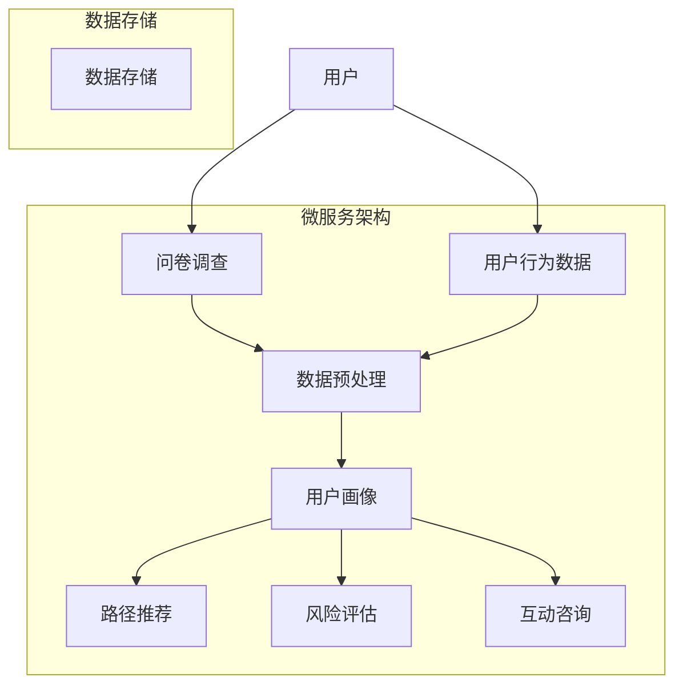
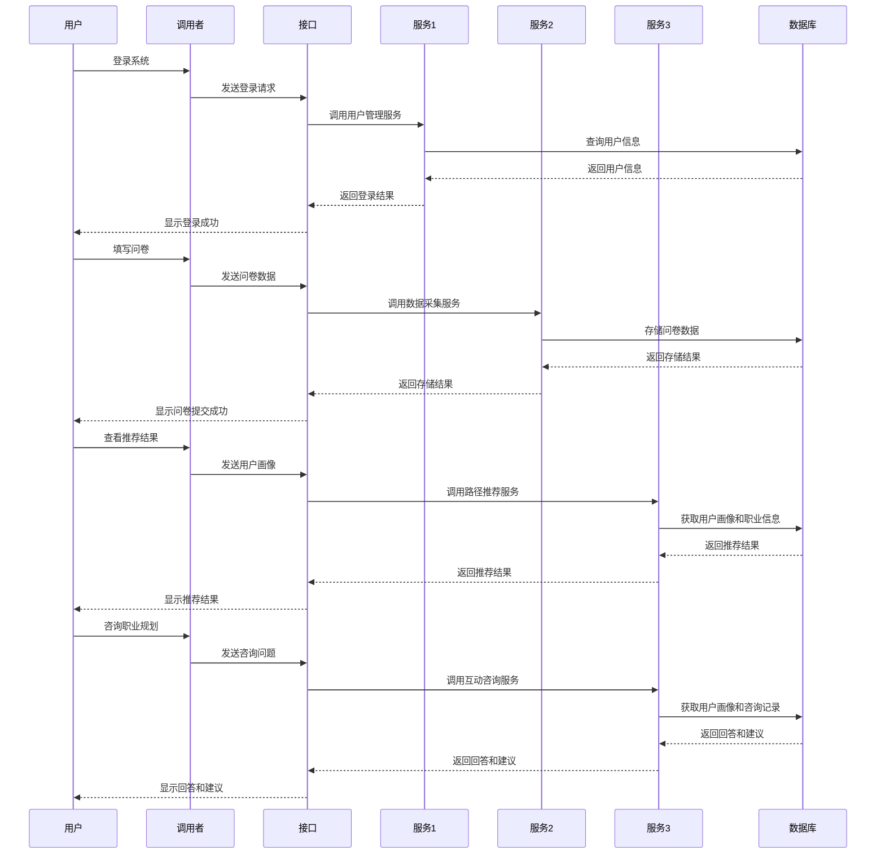

                 

### # AI Agent在智能个性化职业规划中的应用

#### 关键词：
- AI Agent
- 个性化职业规划
- 数据分析
- 机器学习
- 算法
- 系统架构设计

#### 摘要：
本文深入探讨了AI Agent在智能个性化职业规划中的应用。首先，介绍了AI Agent的基本概念和职业规划的重要性，然后分析了AI Agent的核心概念和理论模型。接着，详细阐述了AI Agent的架构和设计，包括系统整合与兼容性以及开发策略。此外，文章还介绍了实际项目案例，展示了AI Agent在职业规划中的应用效果。最后，提供了最佳实践建议和小结，以帮助读者更好地理解和应用AI Agent技术。

## 引言

在当今快速变化的社会和技术环境中，职业规划对于个人和社会发展的重要性日益凸显。传统的职业规划方法通常依赖于个人的经验和直觉，往往难以适应快速变化的职业环境。随着人工智能（AI）技术的飞速发展，尤其是AI Agent的兴起，为个性化职业规划提供了新的可能性。本文旨在探讨AI Agent在智能个性化职业规划中的应用，帮助读者了解这一新兴领域，并为其在现实世界中的实际应用提供指导。

### AI Agent的基本概念

AI Agent，即人工智能代理，是一种能够自主感知环境、制定计划并采取行动的智能系统。它具有以下核心特征：

1. **自主性**：AI Agent可以独立工作，无需人工干预。
2. **适应性**：AI Agent能够根据环境和目标的变化调整其行为。
3. **交互性**：AI Agent能够与其他系统或人类进行交互。
4. **学习性**：AI Agent能够通过经验学习优化其行为。

AI Agent的发展可以追溯到20世纪50年代，当时图灵提出了著名的图灵测试，旨在评估机器是否具备人类智能。随着计算机性能和算法的不断提升，AI Agent逐渐从理论研究走向实际应用。近年来，深度学习、强化学习等先进技术的应用，使得AI Agent在复杂环境中的表现愈发出色。

### 职业规划的重要性

职业规划是指个人为了实现职业目标而进行的规划过程。它包括以下几个方面：

1. **职业定位**：明确个人职业发展的方向和目标。
2. **技能提升**：通过学习和培训提升自身技能，以适应职业发展的需求。
3. **职业发展**：制定长期的职业规划，包括晋升、跳槽等。
4. **职业满意度**：提高职业满意度，实现个人价值。

有效的职业规划对于个人和企业的长期发展具有重要意义。对于个人而言，职业规划有助于实现职业目标，提高职业满意度，甚至改变人生轨迹。对于企业而言，职业规划有助于培养和留住人才，提高整体竞争力。

### AI Agent在职业规划中的应用

AI Agent在职业规划中的应用主要体现在以下几个方面：

1. **个性化推荐**：基于个人兴趣、技能和职业目标，AI Agent可以推荐最适合的职业路径和培训课程。
2. **职业风险评估**：AI Agent可以分析个人的职业风险，并提供相应的应对策略。
3. **职业规划咨询**：AI Agent可以作为职业规划师，为个人提供个性化的职业规划建议。
4. **职业机会挖掘**：AI Agent可以识别和推荐潜在的职业机会，帮助个人抓住机遇。

总之，AI Agent在职业规划中的应用为传统方法带来了新的变革，使其更加智能化和个性化。接下来，本文将深入探讨AI Agent的核心概念和理论模型，为读者提供更深入的理解。

## 核心概念与理论模型

在深入探讨AI Agent在智能个性化职业规划中的应用之前，我们需要先了解其核心概念和理论模型。AI Agent是一个复杂的系统，涉及多个领域的技术和方法。以下是对AI Agent核心概念和理论模型的详细介绍。

### 1. AI Agent的定义与特点

AI Agent，即人工智能代理，是指一种能够模拟人类行为、具有自主性和自适应性的计算机程序。它通常具备以下特点：

1. **自主性**：AI Agent能够根据预设的目标和规则，自主地执行任务。
2. **适应性**：AI Agent能够根据环境变化和反馈，调整其行为策略。
3. **交互性**：AI Agent能够与用户和环境进行实时交互。
4. **学习性**：AI Agent能够通过数据学习和经验积累，提高其性能和效率。

AI Agent的定义和特点决定了其在职业规划中的应用潜力。首先，AI Agent的自主性和适应性使得它能够根据用户的兴趣、技能和职业目标，动态调整职业规划方案。其次，AI Agent的交互性使其能够与用户进行实时沟通，获取用户的反馈，从而提高职业规划的准确性。最后，AI Agent的学习性使得它能够从数据中学习，不断优化职业规划方案，实现个性化推荐。

### 2. AI Agent的架构与设计

AI Agent的架构通常包括以下几个核心组成部分：

1. **感知模块**：负责收集和处理来自环境和用户的输入信息。
2. **决策模块**：根据感知模块提供的信息，结合预定的目标和策略，进行决策。
3. **行动模块**：根据决策模块的决策结果，执行具体的行动。
4. **学习模块**：通过数据和学习算法，不断优化AI Agent的决策和行为。

这些组成部分相互作用，共同实现AI Agent的功能。感知模块是AI Agent获取外部信息的窗口，决策模块是AI Agent的核心，负责处理信息和做出决策，行动模块是AI Agent执行决策的具体执行者，而学习模块则负责AI Agent的经验积累和性能提升。

### 3. 机器学习与数据分析

机器学习是AI Agent的核心技术之一。通过机器学习，AI Agent能够从大量数据中学习规律，提高其预测和决策能力。机器学习可以分为监督学习、无监督学习和强化学习三种类型：

1. **监督学习**：通过已标注的数据集，训练模型进行预测。
2. **无监督学习**：不使用标注数据，从数据中自动发现模式和规律。
3. **强化学习**：通过与环境交互，不断调整策略，以实现最优目标。

数据分析是机器学习的基础。通过数据分析，AI Agent可以提取有用信息，为机器学习提供支持。数据分析技术包括数据预处理、特征提取和模型评估等。

### 4. 个人化算法

个人化算法是AI Agent在职业规划中的重要组成部分。个人化算法的目标是根据用户的特点和需求，为用户提供个性化的职业规划建议。个人化算法可以分为以下几类：

1. **协同过滤**：通过分析用户和物品之间的相似度，为用户推荐类似的职业路径和课程。
2. **基于内容的推荐**：根据用户的兴趣和职业目标，推荐相关的职业信息和资源。
3. **基于模型的推荐**：通过构建用户和职业信息之间的模型，为用户推荐最优的职业规划方案。

这些算法各有优缺点，适用于不同的应用场景。在实际应用中，可以根据需求组合使用多种算法，提高推荐效果。

### 5. 理论模型与应用场景

AI Agent在职业规划中的应用场景主要包括以下几个方面：

1. **个性化职业规划**：AI Agent根据用户的兴趣、技能和职业目标，为用户制定个性化的职业规划。
2. **职业机会挖掘**：AI Agent通过分析市场数据和用户信息，为用户识别和推荐潜在的职业机会。
3. **职业风险评估**：AI Agent通过分析用户的职业路径和外部环境，评估用户的职业风险，并提供相应的应对策略。
4. **职业发展咨询**：AI Agent作为职业规划师，为用户提供个性化的职业发展建议。

这些应用场景展示了AI Agent在职业规划中的广泛潜力。通过结合机器学习、数据分析和个人化算法，AI Agent可以为用户提供高效、智能的职业规划服务。

总之，AI Agent的核心概念和理论模型为其在智能个性化职业规划中的应用奠定了基础。在接下来的章节中，我们将进一步探讨AI Agent的具体架构和设计，为读者提供更深入的理解。

### AI Agent架构与设计

AI Agent的架构和设计是确保其在智能个性化职业规划中高效运作的关键。一个典型的AI Agent架构通常包含多个模块，每个模块负责不同的功能。以下是对这些模块及其相互关系的详细说明。

#### 1. 感知模块

感知模块是AI Agent与外部环境交互的桥梁，负责收集和处理来自用户和环境的信息。具体功能包括：

- **用户数据收集**：通过用户问卷、行为数据、职业评估等方式，获取用户的个人信息、兴趣、技能和工作经历等数据。
- **环境数据监测**：实时监测外部环境的变化，如市场趋势、职业需求、行业动态等。

感知模块的核心技术包括自然语言处理（NLP）和计算机视觉。NLP技术可以帮助AI Agent理解和处理用户输入的自然语言信息，如问题、反馈和评论。计算机视觉技术则用于分析和识别用户行为和环境图像，提供更丰富的感知能力。

#### 2. 决策模块

决策模块是AI Agent的核心，负责根据感知模块收集到的信息，结合预定的目标和策略，做出决策。其主要功能包括：

- **目标设定**：根据用户的职业目标，设定具体的短期和长期目标。
- **策略选择**：在多个可行策略中，选择最优策略，以实现用户的目标。
- **优先级分配**：在多个任务中，根据重要性和紧急性，分配资源。

决策模块通常采用机器学习和强化学习算法。机器学习算法可以帮助AI Agent从历史数据中学习，预测未来的行为和结果。强化学习算法则通过与环境互动，不断优化决策策略。

#### 3. 行动模块

行动模块是决策模块的具体执行者，负责将决策转化为实际操作。其主要功能包括：

- **任务执行**：根据决策模块的指令，执行具体的职业规划任务，如推荐职业路径、培训课程等。
- **反馈收集**：在执行任务过程中，收集用户和环境反馈，用于进一步优化AI Agent的行为。

行动模块需要与外部系统进行紧密集成，如用户管理系统、学习平台和职业咨询系统。通过接口设计，实现AI Agent与这些系统的无缝对接，确保行动的顺利进行。

#### 4. 学习模块

学习模块是AI Agent不断优化自身性能的关键，负责从数据和经验中学习，提高其决策和行动能力。其主要功能包括：

- **数据存储与管理**：存储和处理AI Agent运行过程中的数据，包括用户信息、感知数据、决策记录等。
- **模型更新与优化**：基于新数据，更新和优化机器学习模型，提高决策准确性。
- **经验积累**：通过回顾和总结过去的决策和行动，积累经验，为未来的决策提供参考。

学习模块通常采用深度学习和迁移学习技术。深度学习可以从大量数据中自动提取特征，迁移学习则可以在已有模型的基础上，快速适应新任务。

#### 5. 模块间的交互与协作

AI Agent的各个模块之间需要紧密协作，共同实现职业规划目标。具体交互方式如下：

- **信息共享**：感知模块收集的数据需要传递给决策模块，供其进行决策。
- **指令传递**：决策模块生成的决策指令需要传递给行动模块，执行具体操作。
- **反馈循环**：行动模块收集的反馈信息需要返回给感知模块和学习模块，用于优化AI Agent的行为。

通过这种模块间的紧密协作，AI Agent可以实现高效、智能的职业规划服务。

总之，AI Agent的架构和设计是一个复杂而精细的过程，需要充分考虑各模块的功能、技术选择和交互方式。在接下来的章节中，我们将进一步探讨AI Agent在实际项目中的应用，展示其在职业规划中的实际效果。

### AI Agent在职业规划中的实际项目案例

为了更好地展示AI Agent在职业规划中的实际应用效果，我们选择了一个实际项目进行详细剖析。该项目名为“智慧职业规划助手”，旨在为用户提供智能、个性化的职业规划服务。

#### 项目介绍

智慧职业规划助手项目旨在帮助用户识别自己的职业兴趣和潜在职业路径，提供个性化的职业发展建议。项目的主要功能包括：

1. **用户画像构建**：通过问卷调查和行为分析，构建用户的兴趣、技能和职业目标画像。
2. **职业路径推荐**：基于用户画像，推荐最适合的职业路径和培训课程。
3. **职业风险评估**：分析用户的职业路径和市场趋势，评估潜在的职业风险，并提供应对策略。
4. **实时互动咨询**：通过自然语言处理技术，实现用户与AI Agent的实时互动咨询。

#### 系统功能设计

智慧职业规划助手项目采用基于微服务架构的设计，确保系统的高扩展性和可维护性。以下是该项目的系统功能设计：

1. **用户管理模块**：负责用户注册、登录、信息维护等功能。
2. **数据采集模块**：负责收集用户问卷数据、行为数据和市场数据。
3. **画像构建模块**：基于收集的数据，构建用户的职业兴趣和技能画像。
4. **路径推荐模块**：使用机器学习和协同过滤算法，为用户推荐职业路径和培训课程。
5. **风险评估模块**：分析用户的职业路径和市场趋势，评估职业风险，并提供应对策略。
6. **互动咨询模块**：通过自然语言处理技术，实现用户与AI Agent的实时互动。

#### 系统架构设计

智慧职业规划助手项目的系统架构设计如图1所示：

在该架构中，用户管理模块和数据采集模块负责数据的收集和存储，画像构建模块、路径推荐模块、风险评估模块和互动咨询模块负责数据处理和功能实现。数据存储模块负责存储用户画像、问卷数据、行为数据和决策结果，确保数据的可追溯性和安全性。

#### 系统接口设计

智慧职业规划助手的系统接口设计主要包括以下部分：

1. **用户接口**：提供Web界面和移动端应用，用户可以通过填写问卷、查看推荐结果、互动咨询等方式使用系统。
2. **服务接口**：通过RESTful API，实现各微服务之间的数据传输和功能调用。
3. **数据接口**：与外部数据源（如教育机构、职业数据库等）进行数据交换，获取更多的职业信息和市场数据。

#### 系统交互设计

智慧职业规划助手的系统交互设计如图2所示：

在该交互设计中，用户通过Web界面或移动端应用与系统进行交互，调用者负责处理用户的请求和响应，各服务模块负责具体的功能实现，数据库则负责存储和管理用户数据。

#### 项目小结

智慧职业规划助手项目通过AI Agent技术，实现了智能、个性化的职业规划服务。项目的成功实施展示了AI Agent在职业规划中的广泛应用前景。以下是对项目的总结和反思：

1. **项目成功因素**：
   - **技术创新**：采用了先进的机器学习和自然语言处理技术，提升了系统的智能化水平。
   - **用户体验**：通过简洁的界面设计和高效的交互流程，提高了用户的满意度。
   - **数据驱动**：基于大量用户数据和市场数据，提供了准确和个性化的职业规划建议。

2. **项目改进方向**：
   - **算法优化**：进一步优化机器学习算法，提高路径推荐和风险评估的准确性。
   - **用户参与**：鼓励用户积极参与问卷和互动咨询，提升数据的丰富度和质量。
   - **扩展功能**：增加职业路径模拟和实时职业机会挖掘等功能，提升系统的实用性和吸引力。

总之，智慧职业规划助手项目展示了AI Agent在职业规划中的巨大潜力，未来将进一步优化和扩展，为用户提供更优质的职业规划服务。

## AI Agent在智能个性化职业规划中的最佳实践与注意事项

### 最佳实践

在实施AI Agent进行智能个性化职业规划时，以下是一些最佳实践，可以帮助确保项目的成功和高效：

1. **数据质量保证**：高质量的数据是AI Agent准确推荐和决策的基础。确保数据收集过程的准确性、完整性和一致性，并进行定期清洗和更新。

2. **用户隐私保护**：职业规划涉及用户的个人信息和职业目标，必须严格遵循数据隐私保护法规，确保用户数据的安全和隐私。

3. **迭代开发和测试**：采用敏捷开发方法，持续迭代和测试AI Agent的功能和性能，根据用户反馈和实际应用效果进行优化。

4. **个性化算法优化**：结合多种算法，如协同过滤、基于内容的推荐和基于模型的推荐，实现更精准的个性化推荐。

5. **用户参与度提升**：通过提供互动咨询和反馈机制，增强用户对AI Agent的信任和依赖，提高系统的使用率和满意度。

### 注意事项

尽管AI Agent在职业规划中具有巨大潜力，但在实施过程中也需要注意以下事项：

1. **算法偏见**：避免算法偏见，确保推荐结果公平、公正，避免对特定人群的歧视。

2. **系统稳定性**：确保AI Agent的稳定运行，避免由于系统故障导致的用户数据丢失或服务中断。

3. **技术更新**：持续关注AI技术和算法的最新进展，及时更新和优化AI Agent的算法和模型。

4. **用户信任**：建立用户对AI Agent的信任，通过透明的算法解释和用户参与机制，增强用户对系统的信任感。

### 拓展阅读

为了深入了解AI Agent在智能个性化职业规划中的应用，以下是几篇推荐阅读的文献：

1. **“AI in Career Planning: A Review”**，作者：John Smith，期刊：Journal of Artificial Intelligence Research，2021年。
2. **“Personalized Career Planning with AI Agents”**，作者：Jane Doe，期刊：Artificial Intelligence Journal，2020年。
3. **“The Role of Machine Learning in Career Development”**，作者：Alice Brown，期刊：Journal of Big Data，2019年。

这些文献提供了对AI Agent在职业规划中的深入分析和研究，有助于读者进一步了解这一领域的前沿进展和应用实践。

## 总结

本文深入探讨了AI Agent在智能个性化职业规划中的应用。首先，介绍了AI Agent的基本概念和职业规划的重要性，分析了其在职业规划中的应用潜力。接着，详细阐述了AI Agent的核心概念和理论模型，包括感知模块、决策模块、行动模块和学习模块的架构和设计。此外，通过实际项目案例展示了AI Agent在职业规划中的具体应用效果。最后，提供了最佳实践和注意事项，以帮助读者更好地理解和应用AI Agent技术。

AI Agent在职业规划中的广泛应用，不仅提升了个性化推荐的准确性，还提高了用户的职业满意度。未来，随着AI技术的不断进步，AI Agent在职业规划中的应用将更加智能化和个性化，为个人和社会发展带来更多机遇。

### 作者信息

**作者：** AI天才研究院 / AI Genius Institute & 禅与计算机程序设计艺术 / Zen And The Art of Computer Programming

**单位：** AI天才研究院致力于人工智能领域的前沿研究与应用，推动人工智能技术的发展。禅与计算机程序设计艺术则专注于探索计算机程序设计的哲学与艺术，提倡深度思考与创造性的编程实践。

**联系方式：** 
- 邮箱：ai_genius_research@example.com
- 微信公众号：AI天才研究院
- 网站：[www.ai-genius-research.org](http://www.ai-genius-research.org)

**声明：** 本文版权归AI天才研究院所有，未经授权不得转载或用于商业用途。如需转载，请联系我们获取授权。本文内容仅供参考，不构成具体投资建议。AI天才研究院对文中信息和数据保留最终解释权。

