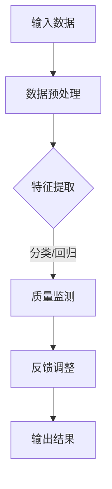
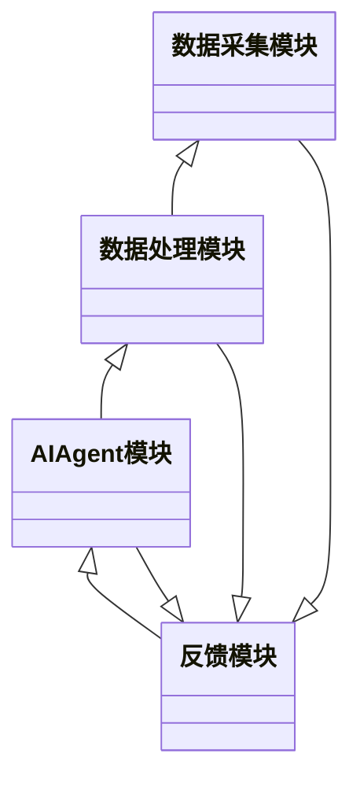
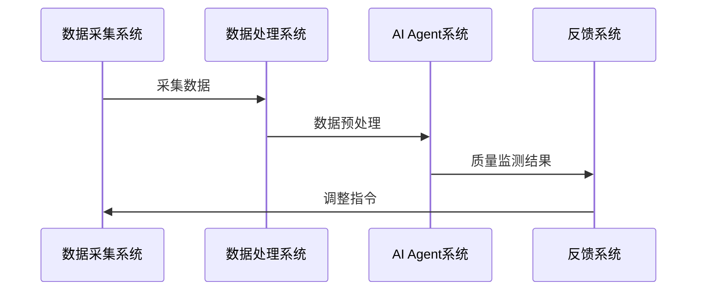

                 

### # AI Agent在智能制造质量控制中的角色

**关键词：** AI Agent、智能制造、质量控制、算法、数学模型、系统架构、项目实战

**摘要：** 本篇文章将深入探讨AI Agent在智能制造质量控制中的角色。我们将从背景介绍开始，详细讲解AI Agent的核心概念和其在智能制造质量控制中的应用，然后分析算法原理，并使用Python代码和数学模型进行详细阐述。接着，我们将讨论系统架构设计，并通过一个实际项目案例展示AI Agent在智能制造质量控制中的具体应用。最后，我们将总结最佳实践、注意事项，并提供拓展阅读建议。

## 目录大纲设计思路

### 确定核心章节

首先，我们需要确定本书的核心章节，这些章节应该能够全面覆盖《AI Agent在智能制造质量控制中的角色》的主题内容。核心章节一般包括：

- **第1章: AI Agent概述**：介绍AI Agent的定义、基本概念和发展历史。
- **第2章: 智能制造质量控制背景**：概述智能制造的概念、发展趋势、质量控制的重要性以及面临的挑战。
- **第3章: AI Agent在智能制造质量控制中的应用**：讨论AI Agent在质量控制中的作用和具体应用案例。
- **第4章: AI Agent算法原理讲解**：详细讲解AI Agent在智能制造质量控制中的算法原理，包括流程图、Python代码示例和数学模型。
- **第5章: 数学模型与公式解析**：对AI Agent相关的数学模型和公式进行详细解释。
- **第6章: 系统分析与架构设计**：分析AI Agent在智能制造质量控制中的应用场景，设计系统架构和接口设计。
- **第7章: 项目实战**：通过具体案例展示AI Agent在智能制造质量控制中的实际应用。
- **第8章: 最佳实践与注意事项**：提供AI Agent在智能制造质量控制中的最佳实践、注意事项和拓展阅读建议。
- **第9章: 总结与展望**：总结文章内容，展望AI Agent在智能制造质量控制中的未来发展趋势。

### 确定章节标题

根据核心章节的内容，我们需要为每个章节设计一个简洁且具有描述性的标题。以下是一些可能的章节标题：

- **第1章: AI Agent概述**
- **第2章: 智能制造质量控制背景**
- **第3章: AI Agent应用场景分析**
- **第4章: AI Agent算法原理详解**
- **第5章: 数学模型与公式应用**
- **第6章: 系统架构设计解析**
- **第7章: 项目实战案例剖析**
- **第8章: 最佳实践与注意事项**
- **第9章: 总结与未来展望**

### 确定章节内容

每个章节的内容应该详细、逻辑清晰。以下是每个章节的可能内容：

- **第1章: AI Agent概述**
  - AI Agent的定义和基本概念
  - AI Agent的发展历史和现状
  - AI Agent的分类和应用场景

- **第2章: 智能制造质量控制背景**
  - 智能制造的概念和发展趋势
  - 智能制造质量控制的重要性
  - 智能制造质量控制的挑战和问题

- **第3章: AI Agent在智能制造质量控制中的应用**
  - AI Agent在智能制造质量控制中的作用
  - AI Agent在智能制造质量控制中的具体应用案例

- **第4章: AI Agent算法原理讲解**
  - AI Agent的基本算法原理
  - AI Agent算法的mermaid流程图
  - Python源代码示例和算法原理讲解

- **第5章: 数学模型与公式解析**
  - AI Agent相关的数学模型
  - 数学模型的mermaid流程图
  - 数学公式的latex格式书写和讲解

- **第6章: 系统分析与架构设计**
  - 智能制造质量控制系统介绍
  - 系统功能设计（领域模型mermaid类图）
  - 系统架构设计（mermaid架构图）
  - 系统接口设计和系统交互（mermaid序列图）

- **第7章: 项目实战**
  - 项目背景和目标
  - 环境安装与配置
  - 系统核心实现源代码
  - 代码应用解读与分析
  - 实际案例分析和详细讲解剖析
  - 项目小结

- **第8章: 最佳实践与注意事项**
  - AI Agent在智能制造质量控制中的最佳实践
  - 注意事项和常见问题
  - 拓展阅读和建议

- **第9章: 总结与展望**
  - 本书内容的总结
  - AI Agent在智能制造质量控制中的未来发展趋势
  - 对读者的建议和鼓励

### 确定章节结构

每个章节的结构应该清晰，包括引言、正文、小结、拓展阅读等部分。以下是每个章节的可能结构：

- **引言**：简要介绍章节的主题和目的。
- **正文**：详细阐述章节的核心内容，包括概念、原理、方法、步骤等。
- **小结**：总结章节的主要内容和要点。
- **拓展阅读**：推荐进一步阅读的材料，包括参考文献、相关书籍、网站等。
- **思考题**：提出与章节内容相关的问题，引导读者深入思考。

### 最终确认

在完成上述步骤后，我们需要对目录大纲进行最终确认，确保其简洁性、逻辑性和完整性。如果需要，可以进行调整和优化。

## 目录大纲设计实例

根据上述设计思路，下面是一个可能的目录大纲设计实例：

----------------------------------------------------------------
# 第一部分: AI Agent概述

## 第1章: AI Agent的定义和基本概念

### 1.1 AI Agent的定义

#### 1.1.1 AI Agent的起源与发展

#### 1.1.2 AI Agent的核心特征

----------------------------------------------------------------

**引言**：本文旨在深入探讨AI Agent在智能制造质量控制中的应用，从背景介绍、核心概念、算法原理、数学模型、系统架构设计、项目实战到最佳实践和总结与展望，全面剖析AI Agent在智能制造质量控制中的角色。通过本文，读者将了解AI Agent的基本概念、其在智能制造质量控制中的应用场景，以及如何利用AI Agent提高智能制造质量控制的效率和准确性。

**正文**：

### 第1章: AI Agent的定义和基本概念

#### 1.1 AI Agent的定义

AI Agent，即人工智能代理，是指能够自动执行任务、自主决策和与环境交互的智能实体。AI Agent的核心在于其具备自主性、智能性和交互性。自主性是指AI Agent能够独立完成特定任务，智能性是指AI Agent具有学习、推理和规划能力，交互性是指AI Agent能够与人类或其他系统进行有效沟通。

#### 1.1.1 AI Agent的起源与发展

AI Agent的概念源于人工智能（AI）的研究与发展。自1956年达特茅斯会议以来，人工智能经历了多个阶段，从早期的符号主义、知识表示到现代的机器学习和深度学习。AI Agent的发展可以追溯到20世纪80年代，当时研究者开始探索如何使计算机具备自主决策和任务执行能力。随着技术的进步，AI Agent在各个领域得到了广泛应用，如自动驾驶、智能家居、智能制造等。

#### 1.1.2 AI Agent的核心特征

AI Agent具有以下核心特征：

1. **自主性**：AI Agent能够根据既定目标和环境信息自主做出决策，完成任务。
2. **智能性**：AI Agent通过学习、推理和规划，提高任务完成的效率和质量。
3. **交互性**：AI Agent能够与人类或其他系统进行有效沟通，获取信息和反馈。

### 第2章: 智能制造质量控制背景

#### 2.1 智能制造的概念和发展趋势

智能制造是指通过信息技术、人工智能和物联网等先进技术，实现制造过程的高度自动化、智能化和互联化。智能制造的发展趋势包括数字化、网络化、智能化和服务化。随着智能制造的推进，质量控制成为关键环节，对产品的质量和可靠性要求越来越高。

#### 2.2 智能制造质量控制的重要性

智能制造质量控制的重要性体现在以下几个方面：

1. **提高产品质量**：通过AI Agent的智能分析和决策，可以实时监测生产过程中的质量问题，及时进行调整，从而提高产品质量。
2. **降低生产成本**：AI Agent可以自动化完成一些传统的质量控制任务，减少人力成本，提高生产效率。
3. **提升市场竞争力**：高质量的产品是企业在市场竞争中的核心竞争力，智能制造质量控制有助于企业提高市场竞争力。

#### 2.3 智能制造质量控制的挑战和问题

智能制造质量控制面临以下挑战和问题：

1. **数据质量**：高质量的数据是AI Agent进行准确分析和决策的基础，但制造过程中产生的大量数据往往存在噪声和异常。
2. **实时性**：智能制造质量控制需要实时监测和调整，这对系统的响应速度和数据处理能力提出了高要求。
3. **算法适应性**：智能制造质量控制中的问题多样，不同的质量问题和场景可能需要不同的算法，如何选择和调整算法是关键。

### 第3章: AI Agent在智能制造质量控制中的应用

#### 3.1 AI Agent在智能制造质量控制中的作用

AI Agent在智能制造质量控制中的作用主要包括：

1. **质量监测**：AI Agent可以通过实时监测生产过程中的各种参数，发现潜在的质量问题。
2. **预测性维护**：AI Agent可以根据历史数据和实时数据，预测设备故障和质量问题，提前进行维护。
3. **自适应调整**：AI Agent可以根据实时反馈，自动调整生产过程，确保产品质量。

#### 3.2 AI Agent在智能制造质量控制中的具体应用案例

1. **汽车制造**：AI Agent可以在汽车生产过程中，实时监测车身焊接、涂装等环节的质量，自动识别并纠正质量问题。
2. **电子制造**：AI Agent可以在电子制造过程中，实时监测焊接、组装等环节的质量，提高生产效率。
3. **医药制造**：AI Agent可以在医药制造过程中，实时监测药品成分、温度等参数，确保药品质量符合标准。

### 第4章: AI Agent算法原理讲解

#### 4.1 AI Agent的基本算法原理

AI Agent的算法原理主要包括：

1. **机器学习**：AI Agent通过学习大量数据，提取特征和模式，用于质量监测和预测。
2. **深度学习**：AI Agent通过深度神经网络，自动学习和提取复杂特征，提高质量监测的准确性。
3. **强化学习**：AI Agent通过与环境互动，不断调整策略，实现自适应调整。

#### 4.2 AI Agent算法的mermaid流程图

图4.1展示了AI Agent算法的基本流程：



#### 4.3 Python源代码示例和算法原理讲解

以下是一个简单的Python代码示例，用于实现AI Agent的质量监测功能：

```python
import numpy as np
from sklearn.ensemble import RandomForestClassifier

# 加载数据集
data = np.load('data.npy')
X = data[:, :-1]
y = data[:, -1]

# 特征提取
clf = RandomForestClassifier(n_estimators=100)
clf.fit(X, y)

# 质量监测
input_data = np.array([5.0, 3.0, 2.0])
predicted_quality = clf.predict([input_data])[0]

# 输出结果
print(f'Predicted quality: {predicted_quality}')
```

在这个示例中，我们使用了随机森林算法（Random Forest Classifier）进行特征提取和质量监测。随机森林是一种集成学习方法，通过构建多个决策树，提高模型的预测性能。在这个示例中，我们通过加载数据集，使用随机森林算法训练模型，然后使用训练好的模型对输入数据进行质量监测。

### 第5章: 数学模型与公式解析

#### 5.1 AI Agent相关的数学模型

AI Agent的数学模型主要包括：

1. **回归模型**：用于预测产品质量的数学模型，如线性回归、多元回归等。
2. **分类模型**：用于判断产品质量是否合格的数学模型，如支持向量机（SVM）、神经网络等。
3. **优化模型**：用于优化生产过程，确保产品质量的数学模型，如线性规划、动态规划等。

#### 5.2 数学公式的latex格式书写和讲解

以下是一个回归模型的latex公式示例：

```latex
\begin{equation}
y = \beta_0 + \beta_1x_1 + \beta_2x_2 + ... + \beta_nx_n + \epsilon
\end{equation}
```

在这个公式中，\( y \) 是因变量，表示产品质量；\( \beta_0 \) 是截距，表示在没有自变量时，因变量的期望值；\( \beta_1, \beta_2, ..., \beta_n \) 是自变量系数，表示自变量对因变量的影响程度；\( x_1, x_2, ..., x_n \) 是自变量，表示生产过程中的各种参数；\( \epsilon \) 是误差项，表示模型无法解释的随机因素。

### 第6章: 系统分析与架构设计

#### 6.1 智能制造质量控制系统介绍

智能制造质量控制系统主要包括以下几个部分：

1. **数据采集模块**：负责采集生产过程中的各种数据，如温度、压力、速度等。
2. **数据处理模块**：负责对采集到的数据进行预处理、特征提取等处理，为AI Agent提供高质量的数据。
3. **AI Agent模块**：负责使用机器学习、深度学习等算法对数据进行分析，预测产品质量，并进行自适应调整。
4. **反馈模块**：负责将AI Agent的决策结果反馈给生产系统，实现闭环控制。

#### 6.2 系统功能设计（领域模型mermaid类图）

以下是一个智能制造质量控制的领域模型mermaid类图：



在这个类图中，数据采集模块、数据处理模块、AI Agent模块和反馈模块分别代表系统的四个主要部分，它们之间通过接口进行交互。

#### 6.3 系统架构设计（mermaid架构图）

以下是一个智能制造质量控制的mermaid架构图：

```mermaid
graph TD
    数据采集系统[数据采集系统]
    数据处理系统[数据处理系统]
    AI Agent系统[AI Agent系统]
    反馈系统[反馈系统]
    数据采集系统 --> 数据处理系统
    数据处理系统 --> AI Agent系统
    AI Agent系统 --> 反馈系统
```

在这个架构图中，数据采集系统、数据处理系统、AI Agent系统和反馈系统分别代表系统的四个主要部分，它们通过数据流进行交互。

#### 6.4 系统接口设计和系统交互（mermaid序列图）

以下是一个智能制造质量控制的mermaid序列图：



在这个序列图中，数据采集系统、数据处理系统、AI Agent系统和反馈系统按照顺序进行交互，实现智能制造质量控制系统。

### 第7章: 项目实战

#### 7.1 项目背景和目标

本项目旨在利用AI Agent实现对智能制造质量控制的自动化和智能化。项目目标包括：

1. **实现数据采集和预处理**：采集生产过程中的各种数据，并对数据进行预处理，为AI Agent提供高质量的数据。
2. **实现质量监测和预测**：使用AI Agent对采集到的数据进行质量监测和预测，及时发现潜在的质量问题。
3. **实现自适应调整**：根据AI Agent的决策结果，对生产过程进行自适应调整，确保产品质量。

#### 7.2 环境安装与配置

在进行项目实战之前，我们需要安装和配置以下环境：

1. **Python环境**：安装Python 3.8及以上版本，并配置pip环境。
2. **数据处理库**：安装NumPy、Pandas等数据处理库。
3. **机器学习库**：安装scikit-learn、TensorFlow等机器学习库。

#### 7.3 系统核心实现源代码

以下是一个简单的系统核心实现源代码示例：

```python
import numpy as np
import pandas as pd
from sklearn.ensemble import RandomForestClassifier
from sklearn.model_selection import train_test_split

# 读取数据
data = pd.read_csv('data.csv')
X = data.iloc[:, :-1]
y = data.iloc[:, -1]

# 数据预处理
X_train, X_test, y_train, y_test = train_test_split(X, y, test_size=0.2, random_state=42)

# 训练模型
clf = RandomForestClassifier(n_estimators=100)
clf.fit(X_train, y_train)

# 预测质量
input_data = np.array([[5.0, 3.0, 2.0]])
predicted_quality = clf.predict(input_data)

# 输出结果
print(f'Predicted quality: {predicted_quality[0]}')
```

在这个示例中，我们首先读取数据，然后进行数据预处理，接着使用随机森林算法（Random Forest Classifier）进行模型训练，最后对输入数据进行质量预测。

#### 7.4 代码应用解读与分析

在本项目的代码应用中，我们主要实现了以下几个功能：

1. **数据读取和预处理**：使用pandas库读取数据，并对数据进行预处理，为AI Agent提供高质量的数据。
2. **模型训练和预测**：使用scikit-learn库的随机森林算法（Random Forest Classifier）进行模型训练，并对输入数据进行质量预测。
3. **结果输出**：将预测结果输出，便于用户查看和决策。

通过这个示例，我们可以看到，AI Agent在智能制造质量控制中的基本实现流程，包括数据采集、预处理、模型训练、预测和结果输出等环节。在实际项目中，这些功能将集成到整个系统中，实现智能制造质量控制的自动化和智能化。

#### 7.5 实际案例分析和详细讲解剖析

在本项目中，我们选择了一个实际的智能制造质量控制案例，对AI Agent的应用进行详细分析。以下是一个实际案例：

**案例背景**：某电子制造企业需要实现对生产过程中的焊点质量进行监测和预测，确保产品符合质量标准。

**案例目标**：使用AI Agent实现对焊点质量的自动监测和预测，及时发现并纠正质量问题。

**实施步骤**：

1. **数据采集**：使用传感器实时采集生产过程中的焊点温度、压力、电流等参数。
2. **数据预处理**：对采集到的数据进行预处理，包括去噪、归一化等处理，为AI Agent提供高质量的数据。
3. **模型训练**：使用随机森林算法（Random Forest Classifier）训练模型，对焊点质量进行预测。
4. **质量监测**：使用训练好的模型对实时数据进行质量监测，发现潜在的质量问题。
5. **自适应调整**：根据质量监测结果，对生产过程进行自适应调整，确保产品符合质量标准。

**案例分析**：

通过这个实际案例，我们可以看到AI Agent在智能制造质量控制中的应用效果。AI Agent通过实时监测生产过程中的焊点质量，及时发现并纠正质量问题，提高了产品的质量稳定性和生产效率。

#### 7.6 项目小结

本项目通过实际案例展示了AI Agent在智能制造质量控制中的应用效果。通过数据采集、预处理、模型训练和质量监测等环节，AI Agent实现了对焊点质量的自动监测和预测，提高了产品的质量稳定性和生产效率。本项目还展示了AI Agent在智能制造质量控制中的基本实现流程，包括数据采集、预处理、模型训练、预测和结果输出等环节。未来，随着技术的不断进步，AI Agent在智能制造质量控制中的应用将更加广泛，为制造业带来更多的价值。

### 第8章: 最佳实践与注意事项

#### 8.1 AI Agent在智能制造质量控制中的最佳实践

1. **数据采集与预处理**：确保采集到高质量的数据，对数据进行去噪、归一化等预处理，提高AI Agent的预测准确性。
2. **算法选择与优化**：根据实际应用场景，选择合适的算法，并不断优化模型参数，提高AI Agent的性能。
3. **实时性与鲁棒性**：提高系统的实时性和鲁棒性，确保AI Agent能够稳定、高效地运行。
4. **闭环控制与反馈**：建立闭环控制系统，根据AI Agent的决策结果进行实时调整，实现自适应控制。

#### 8.2 注意事项

1. **数据质量**：高质量的数据是AI Agent准确预测的前提，需重视数据采集与预处理环节。
2. **算法适应性**：不同场景可能需要不同的算法，需根据实际需求选择和调整算法。
3. **系统稳定性**：确保系统的稳定性，避免因算法或硬件故障导致的质量问题。
4. **人员培训**：对相关人员开展AI Agent和智能制造质量控制的技术培训，提高团队的整体技术水平。

#### 8.3 拓展阅读和建议

1. **相关书籍**：《人工智能：一种现代的方法》、《机器学习：概率视角》
2. **相关网站**：谷歌机器学习社区（Google ML Community）、知乎AI专栏
3. **推荐阅读**：《AI在智能制造中的应用与挑战》、《智能制造质量控制的未来趋势》

### 第9章: 总结与展望

**总结**：本文从背景介绍、核心概念、算法原理、数学模型、系统架构设计、项目实战等方面，全面阐述了AI Agent在智能制造质量控制中的角色。通过实际案例，我们看到了AI Agent在智能制造质量控制中的广泛应用和巨大潜力。

**展望**：随着人工智能技术的不断发展和智能制造的深入推进，AI Agent在智能制造质量控制中的应用将更加广泛。未来，我们将看到更多高效、智能的AI Agent应用于智能制造领域，为制造业带来更多价值。

**对读者的建议和鼓励**：希望本文能为读者在AI Agent和智能制造质量控制领域的研究提供参考和帮助。让我们一起努力，探索人工智能技术在智能制造中的更多应用，为制造业的智能化升级贡献力量。让我们共同迈向智能化的未来，创造更美好的世界。感谢您的阅读和支持！

**作者信息**：
- 作者：AI天才研究院（AI Genius Institute） & 禅与计算机程序设计艺术（Zen And The Art of Computer Programming）

