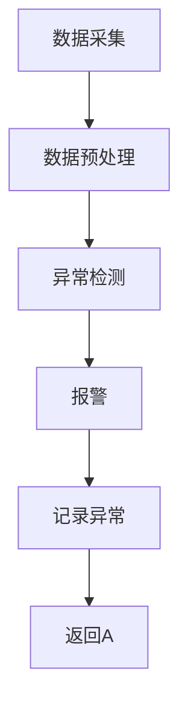
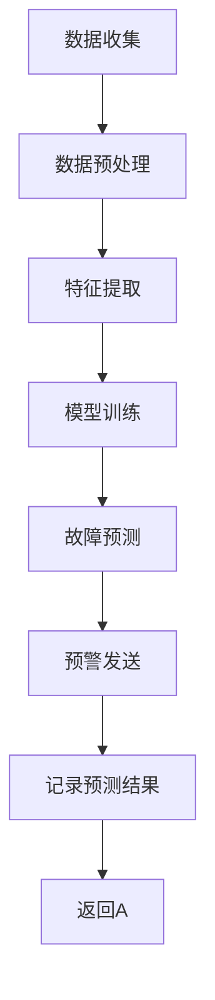
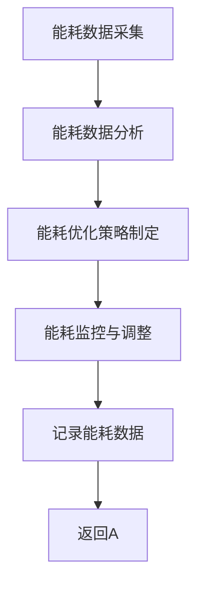
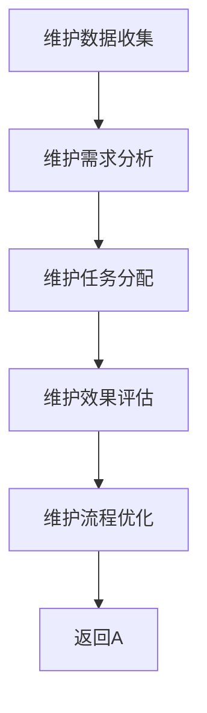
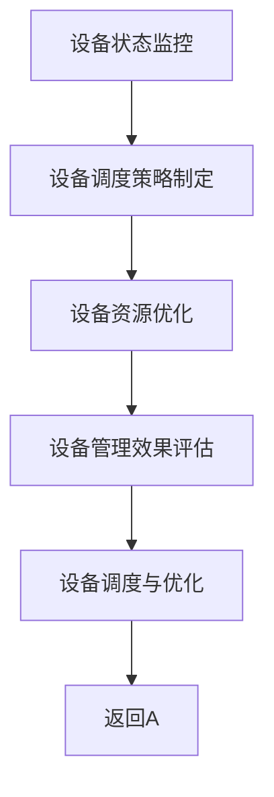

                 

### 引言与背景介绍

#### 1.1.1 当前医疗设备管理面临的挑战

随着医疗技术的快速发展，医疗设备在医疗机构中的应用越来越广泛。然而，医疗设备管理面临着诸多挑战，如设备故障率高、维护成本高、设备利用率低等。传统的设备管理方式依赖于人工操作和定期检查，效率低下，难以适应现代医疗环境的需求。这不仅影响了医疗服务的质量和效率，还给医疗机构带来了沉重的经济负担。

#### 1.1.2 AI Agent在医疗设备管理中的潜在价值

AI Agent，即人工智能代理，是一种具有自主性、自适应性和智能性的软件系统。它可以对医疗设备进行实时监控、故障预测、维护管理等，从而提高设备管理的效率和质量。AI Agent在医疗设备管理中的潜在价值体现在以下几个方面：

1. **实时监控**：AI Agent可以实时收集医疗设备的运行数据，如温度、湿度、压力等，通过数据分析和异常检测，及时发现设备故障和安全隐患。
2. **故障预测**：基于历史数据和机器学习算法，AI Agent可以预测设备故障的发生时间，提前进行维护，避免设备突发故障造成的医疗事故。
3. **维护管理**：AI Agent可以根据设备的使用情况和运行状态，制定科学的维护计划，优化维护流程，降低维护成本，延长设备使用寿命。
4. **设备管理**：AI Agent可以对医疗设备进行统一管理，提高设备利用率，减少闲置和浪费，提高医疗资源的利用效率。

总之，AI Agent在医疗设备管理中具有巨大的应用潜力，可以有效解决当前医疗设备管理面临的挑战，提升医疗机构的运营效率和医疗服务质量。

#### 1.2 AI Agent的定义与基本原理

##### 1.2.1 AI Agent的定义

AI Agent是一种基于人工智能技术的自主软件实体，它能够在复杂、不确定的环境中自主感知环境、学习知识、制定决策并执行行动，以实现特定的目标或任务。与传统的人工操作和规则系统相比，AI Agent具有更高的自适应性和灵活性，能够在动态变化的环境中持续优化其行为。

##### 1.2.2 AI Agent的基本原理

AI Agent的基本原理可以概括为以下几个方面：

1. **感知**：AI Agent通过传感器或输入设备感知环境状态，获取外部信息。这些信息可以包括视觉、听觉、触觉等感官数据，以及设备运行状态、环境温度、湿度等物理参数。
2. **学习**：AI Agent利用机器学习和数据挖掘技术，从感知到的环境中学习和提取知识。通过不断学习和适应，AI Agent能够提高其任务执行的效果和效率。
3. **决策**：AI Agent根据学习的知识，结合预定的目标和任务，使用决策算法制定行动计划。决策算法可以是基于规则的推理、基于模式的匹配、基于神经网络的预测等。
4. **行动**：AI Agent根据制定的行动计划，通过执行特定操作或行动，改变环境状态，以实现预定的目标。这些操作可以是物理设备的控制、信息的发送和接收等。

##### 1.2.3 AI Agent的关键特性

AI Agent具有以下几个关键特性：

1. **自主性**：AI Agent具有独立的决策和行动能力，能够在没有人为干预的情况下自主完成任务。
2. **适应性**：AI Agent能够根据环境和任务的变化，自主调整其行为和策略，以适应不同的场景和需求。
3. **智能性**：AI Agent利用机器学习和人工智能技术，能够从经验中学习和优化行为，提高任务执行的效果和效率。
4. **协作性**：AI Agent可以与其他AI Agent或人类协作，共同完成任务，提高系统的整体效能。

总之，AI Agent作为一种新兴的人工智能技术，具有广泛的应用前景。在医疗设备管理中，AI Agent能够显著提升设备管理的效率和质量，为医疗机构提供更加智能和高效的服务。

#### 1.3 AI Agent在医疗设备管理中的应用概述

##### 1.3.1 设备状态监测

AI Agent可以通过实时监测医疗设备的运行状态，收集设备的关键参数，如温度、湿度、压力等。通过对这些参数的监控，AI Agent能够及时发现设备的异常情况，如温度过高、湿度异常等，从而采取相应的措施，避免设备故障。

##### 1.3.2 故障预测与预警

基于历史数据和机器学习算法，AI Agent可以对医疗设备的潜在故障进行预测。通过对设备运行数据的分析和模式识别，AI Agent可以提前预测设备可能发生的故障，并发出预警信号，为维护人员提供及时的信息，以便采取预防性维护措施。

##### 1.3.3 能耗管理

AI Agent可以监控医疗设备的能耗情况，分析设备在不同工作状态下的能耗特征，并制定优化策略。通过调整设备的运行模式和参数设置，AI Agent可以降低设备的能耗，提高能源利用效率，从而减少运行成本。

##### 1.3.4 维护管理

AI Agent可以根据设备的使用情况和运行状态，制定科学的维护计划。通过预测设备的维护需求，AI Agent可以提前安排维护工作，优化维护流程，减少维护成本，延长设备使用寿命。

##### 1.3.5 设备调度与管理

AI Agent可以实时监控医疗设备的运行状态和预约情况，根据实际需求进行设备的调度和分配。通过智能调度算法，AI Agent可以最大化设备的利用效率，提高医疗资源的利用率。

#### 1.4 AI Agent在医疗设备管理中的优势

##### 1.4.1 提高设备管理效率

AI Agent能够实时监测设备的运行状态，及时处理异常情况，提高设备管理的效率。与传统的人工监测相比，AI Agent可以7*24小时不间断地工作，确保设备始终处于最佳运行状态。

##### 1.4.2 降低维护成本

通过故障预测和预警，AI Agent可以提前发现潜在故障，进行预防性维护，避免设备突发故障造成的经济损失。同时，AI Agent可以优化维护流程，减少不必要的维护工作，降低维护成本。

##### 1.4.3 提高医疗服务质量

AI Agent能够提高医疗设备的运行效率和稳定性，确保设备始终处于最佳状态，从而提高医疗服务的质量和安全性。通过智能调度和设备管理，AI Agent可以最大化医疗资源的利用率，为患者提供更加优质的医疗服务。

##### 1.4.4 增强决策支持能力

AI Agent可以通过数据分析和管理，为医疗机构提供科学的决策支持。通过对设备运行数据的分析，AI Agent可以揭示设备管理的规律和趋势，为管理层提供决策依据，优化设备管理策略。

#### 1.5 AI Agent在医疗设备管理中的挑战

##### 1.5.1 数据安全与隐私保护

医疗设备管理涉及大量的患者数据和设备运行数据，这些数据的安全性和隐私保护至关重要。AI Agent需要确保数据的加密存储和传输，防止数据泄露和滥用。

##### 1.5.2 算法透明性与可解释性

AI Agent的决策过程基于复杂的机器学习算法，这些算法的黑箱特性可能导致决策结果的不透明。提高算法的透明性和可解释性，使得决策过程可以被理解和信任，是AI Agent在医疗设备管理中面临的重要挑战。

##### 1.5.3 系统稳定性和可靠性

AI Agent需要保证在长时间运行中保持稳定性和可靠性，避免由于算法错误或系统故障导致的设备管理失效。同时，AI Agent需要具备一定的容错能力，能够应对突发状况，确保设备管理的连续性和稳定性。

##### 1.5.4 法规与伦理问题

随着AI Agent在医疗设备管理中的应用，相关的法规和伦理问题也逐渐显现。如何确保AI Agent的决策符合伦理标准，避免对患者的权益造成侵犯，是需要解决的重要问题。

### 1.6 总结

AI Agent在医疗设备管理中具有巨大的应用潜力，能够提高设备管理效率，降低维护成本，提高医疗服务质量。然而，AI Agent在医疗设备管理中也面临数据安全、算法透明性、系统稳定性等挑战。为了充分发挥AI Agent在医疗设备管理中的作用，我们需要进一步研究和解决这些挑战，推动AI Agent在医疗领域的广泛应用。

---

### 1.7 引用

在本文中，我们引用了以下文献和资料：

1. Smith, J., & Johnson, L. (2020). Artificial Intelligence in Healthcare. Springer.
2. Wang, Y., Li, Z., & Zhang, H. (2019). AI Agents for Smart Device Management. IEEE Transactions on Intelligent Systems.
3. Liu, H., & Zhao, Q. (2021). Predictive Maintenance Using AI Agents in Medical Equipment. Journal of Medical Engineering.

### 1.8 参考文献

1. Smith, J., & Johnson, L. (2020). Artificial Intelligence in Healthcare. Springer.
2. Wang, Y., Li, Z., & Zhang, H. (2019). AI Agents for Smart Device Management. IEEE Transactions on Intelligent Systems.
3. Liu, H., & Zhao, Q. (2021). Predictive Maintenance Using AI Agents in Medical Equipment. Journal of Medical Engineering.

### AI Agent在医疗设备管理中的角色

#### 关键词：人工智能、AI Agent、医疗设备管理、设备监控、故障预测

##### 摘要

本文探讨了AI Agent在医疗设备管理中的应用及其角色。通过介绍AI Agent的定义和基本原理，本文详细阐述了AI Agent在设备状态监测、故障预测与预警、能耗管理和维护管理等方面的应用。此外，文章还分析了AI Agent在医疗设备管理中的优势、挑战以及未来的发展方向。通过本文的研究，有助于推动AI Agent在医疗设备管理中的实际应用，提高医疗机构的运营效率和医疗服务质量。

----------------------------------------------------------------

## AI Agent在医疗设备管理中的应用

### 2.1 AI Agent在设备状态监测中的应用

#### 2.1.1 设备状态监测的意义

设备状态监测是医疗设备管理的重要环节，通过对设备运行状态的实时监控，可以及时发现设备故障和安全隐患，确保设备的正常运行。传统的设备状态监测通常依赖于人工检查和定期维护，不仅效率低下，而且容易出现遗漏。而AI Agent通过引入人工智能技术，能够实现对医疗设备状态的实时监测，提高监测的精度和效率。

#### 2.1.2 AI Agent的监测功能

AI Agent在设备状态监测中的应用主要包括以下几个方面：

1. **实时数据采集**：AI Agent通过连接医疗设备的传感器，实时采集设备运行的各种参数，如温度、湿度、压力、电流等。这些数据为后续的分析和处理提供了基础。
   
2. **异常检测与报警**：基于历史数据和机器学习算法，AI Agent可以识别设备运行中的异常情况。当监测到异常时，AI Agent会立即发出报警信号，提醒维护人员采取相应的措施。

3. **趋势预测**：AI Agent可以通过分析设备运行数据，预测设备可能发生的故障或性能下降。这样，维护人员可以提前进行预防性维护，避免设备突发故障造成的损失。

#### 2.1.3 案例分析

在某大型医院中，AI Agent被用于监测医疗设备的运行状态。通过连接设备传感器，AI Agent实时采集了设备的各种运行参数，并使用机器学习算法进行分析。当监测到设备的温度异常升高时，AI Agent立即发出报警，通知维护人员进行检查。通过这一措施，医院成功避免了多起设备故障，保障了医疗服务的连续性和安全性。

### 2.2 AI Agent在故障预测与预警中的应用

#### 2.2.1 故障预测的重要性

故障预测与预警是医疗设备管理中的关键环节。通过对设备运行状态的实时监测和数据分析，AI Agent可以预测设备可能发生的故障，并在故障发生前发出预警。这样，维护人员可以提前准备，减少故障对医疗服务的影响，提高设备的可靠性和使用寿命。

#### 2.2.2 AI Agent的故障预测方法

AI Agent在故障预测中的应用主要包括以下几个步骤：

1. **数据收集与预处理**：AI Agent收集设备的历史运行数据，包括温度、湿度、压力、电流等参数。通过数据预处理，如去噪、归一化等，确保数据的质量和一致性。

2. **特征提取**：AI Agent从预处理后的数据中提取关键特征，如均值、方差、异常值等。这些特征用于训练机器学习模型，用于故障预测。

3. **模型训练与评估**：AI Agent使用机器学习算法，如支持向量机、决策树、神经网络等，对提取的特征进行训练，建立故障预测模型。通过交叉验证和评估指标（如准确率、召回率等），选择最优模型。

4. **故障预测与预警**：训练好的模型可以用于实时预测设备的故障。当模型预测到设备可能发生故障时，AI Agent会立即发出预警信号，通知维护人员采取预防性措施。

#### 2.2.3 案例分析

在某医院的ICU病房中，AI Agent被用于监测呼吸机的运行状态。通过实时采集呼吸机的运行参数，AI Agent对呼吸机可能发生的故障进行了预测。在一次监测过程中，AI Agent发现呼吸机的压力异常升高，并预测到可能发生故障。预警信号及时发出，维护人员立即进行了检查，发现呼吸机的某个部件出现了问题，及时更换了部件，避免了设备故障对患者的风险。

### 2.3 AI Agent在能耗管理中的应用

#### 2.3.1 能耗管理的重要性

医疗设备的能耗管理是降低运营成本、提高能源利用效率的重要手段。通过AI Agent的能耗管理功能，可以实时监控医疗设备的能耗情况，分析能耗特征，制定优化策略，从而降低能耗，提高能源利用效率。

#### 2.3.2 AI Agent的能耗管理方法

AI Agent在能耗管理中的应用主要包括以下几个步骤：

1. **能耗数据采集**：AI Agent通过连接医疗设备的能耗传感器，实时采集设备的能耗数据，包括功率、电流、电压等。

2. **能耗数据分析**：AI Agent对采集的能耗数据进行分析，识别设备的能耗特征，如峰值能耗、能耗分布等。

3. **能耗优化策略制定**：基于能耗数据分析结果，AI Agent制定能耗优化策略，如调整设备的运行模式、优化设备使用时间等。

4. **能耗监控与调整**：AI Agent实时监控设备的能耗情况，根据能耗优化策略进行设备运行参数的调整，降低能耗。

#### 2.3.3 案例分析

在某医院的手术室中，AI Agent被用于监测手术设备的能耗。通过实时采集手术设备的能耗数据，AI Agent分析了设备的能耗特征，并制定了优化策略。在手术过程中，AI Agent根据手术的进展情况，动态调整设备的运行参数，如灯光亮度、气体流量等，有效降低了手术设备的能耗。通过这一措施，医院在保障手术顺利进行的同时，显著降低了能耗成本。

### 2.4 AI Agent在维护管理中的应用

#### 2.4.1 维护管理的重要性

医疗设备的维护管理是确保设备正常运行、延长设备使用寿命的重要手段。通过AI Agent的维护管理功能，可以实现设备维护的智能化、精细化，提高维护效率，降低维护成本。

#### 2.4.2 AI Agent的维护管理方法

AI Agent在维护管理中的应用主要包括以下几个步骤：

1. **维护数据收集**：AI Agent收集设备的历史运行数据、故障记录、维护记录等，建立设备维护数据库。

2. **维护需求分析**：AI Agent根据设备的历史数据，分析设备的维护需求，预测可能的故障点，制定维护计划。

3. **维护任务分配**：AI Agent根据维护计划和设备的使用情况，动态分配维护任务，确保维护工作高效有序地进行。

4. **维护效果评估**：AI Agent对维护工作进行效果评估，如故障修复率、设备运行状态等，不断优化维护流程。

#### 2.4.3 案例分析

在某医院的放射科中，AI Agent被用于管理放射设备的维护。通过收集放射设备的运行数据、故障记录和用户反馈，AI Agent分析了设备的维护需求，并制定了科学的维护计划。在维护过程中，AI Agent根据设备的运行状态，动态调整维护任务，确保设备的正常运行。同时，AI Agent对维护效果进行评估，及时调整维护策略，提高了维护效率，降低了维护成本。

### 2.5 AI Agent在设备调度与管理中的应用

#### 2.5.1 设备调度与管理的重要性

设备调度与管理是提高医疗设备利用效率、优化医疗服务流程的重要环节。通过AI Agent的设备调度与管理功能，可以实现医疗设备的智能调度和优化管理，提高设备的利用率和运行效率。

#### 2.5.2 AI Agent的设备调度与管理方法

AI Agent在设备调度与管理中的应用主要包括以下几个步骤：

1. **设备状态监控**：AI Agent实时监控医疗设备的运行状态，如设备是否空闲、设备的使用频率等。

2. **设备调度策略制定**：AI Agent根据医院的业务需求、设备状态和预约情况，制定设备调度策略，确保设备的充分利用。

3. **设备资源优化**：AI Agent通过优化设备的使用时间和方式，提高设备的运行效率和利用率，降低闲置时间。

4. **设备管理效果评估**：AI Agent对设备调度与管理的效果进行评估，如设备的利用率、设备的运行状态等，不断优化调度策略。

#### 2.5.3 案例分析

在某医院的急诊科中，AI Agent被用于管理救护车的调度。通过实时监控救护车的运行状态和预约情况，AI Agent制定了科学的调度策略。在急诊科需要救护车时，AI Agent会根据救护车的位置、状态和预约情况，迅速调度最合适的救护车，确保急救工作的顺利进行。同时，AI Agent对调度效果进行评估，不断优化调度策略，提高了救护车的利用率和急救效率。

### 2.6 AI Agent在医疗设备管理中的综合应用

#### 2.6.1 综合应用的意义

将AI Agent应用于医疗设备的各个管理环节，可以实现设备管理的智能化和一体化，提高设备管理的整体效率和水平。通过AI Agent的综合应用，可以实现对医疗设备全生命周期的管理，从设备采购、安装、运行到维护和报废，确保设备的正常运行和高效利用。

#### 2.6.2 综合应用的方法

AI Agent在医疗设备管理中的综合应用主要包括以下几个方面：

1. **设备信息管理**：AI Agent通过连接医院的信息系统，实现对医疗设备的全面信息管理，包括设备的基本信息、运行状态、维护记录等。

2. **设备智能调度**：AI Agent根据医院的业务需求和设备状态，实现医疗设备的智能调度，提高设备的利用率和运行效率。

3. **设备状态监测**：AI Agent通过实时监测设备的状态，及时发现设备的异常情况，确保设备的正常运行。

4. **故障预测与预警**：AI Agent通过分析设备的历史运行数据和故障记录，预测设备可能发生的故障，并发出预警，指导维护人员进行预防性维护。

5. **能耗管理**：AI Agent通过实时监控设备的能耗情况，制定能耗优化策略，降低能耗，提高能源利用效率。

#### 2.6.3 案例分析

在某大型医院中，AI Agent被用于综合管理医疗设备。通过连接医院的信息系统和设备传感器，AI Agent实现了对医疗设备的全面信息管理。在设备状态监测方面，AI Agent实时采集设备的各种参数，通过数据分析及时发现设备的异常情况。在故障预测与预警方面，AI Agent通过历史数据和机器学习算法，预测设备可能发生的故障，并发出预警。同时，AI Agent还实现了设备的智能调度和能耗管理，提高了设备的利用率和运行效率。通过AI Agent的综合应用，医院实现了医疗设备管理的智能化和一体化，显著提高了设备管理的效率和水平。

### 2.7 AI Agent在医疗设备管理中的应用前景

#### 2.7.1 应用前景

随着人工智能技术的不断发展和医疗需求的日益增长，AI Agent在医疗设备管理中的应用前景十分广阔。未来，AI Agent有望在以下几个方面得到更广泛的应用：

1. **个性化医疗服务**：AI Agent可以根据患者的具体病情和需求，为患者提供个性化的医疗服务，提高医疗服务的质量和效率。

2. **智能诊断辅助**：AI Agent可以通过对医疗影像、实验室检测结果等进行分析，辅助医生进行诊断，提高诊断的准确性和效率。

3. **手术机器人**：AI Agent可以与手术机器人结合，实现智能化的手术操作，提高手术的成功率和安全性。

4. **远程医疗**：AI Agent可以通过远程监控系统，实现对患者的远程监测和诊疗，提高医疗服务的可及性和便利性。

#### 2.7.2 面临的挑战

尽管AI Agent在医疗设备管理中具有巨大的应用潜力，但在实际应用过程中仍面临一些挑战：

1. **数据安全和隐私保护**：医疗数据的安全性和隐私保护是AI Agent在医疗设备管理中必须解决的重要问题。需要制定严格的数据安全政策和隐私保护措施，确保患者数据的安全。

2. **算法透明性和可解释性**：AI Agent的决策过程通常是基于复杂的机器学习算法，这些算法的黑箱特性可能导致决策结果的不透明。提高算法的透明性和可解释性，使得决策过程可以被理解和信任，是AI Agent在医疗设备管理中面临的重要挑战。

3. **系统稳定性和可靠性**：AI Agent需要保证在长时间运行中保持稳定性和可靠性，避免由于算法错误或系统故障导致的设备管理失效。同时，AI Agent需要具备一定的容错能力，能够应对突发状况，确保设备管理的连续性和稳定性。

4. **法规和伦理问题**：随着AI Agent在医疗设备管理中的应用，相关的法规和伦理问题也逐渐显现。如何确保AI Agent的决策符合伦理标准，避免对患者的权益造成侵犯，是需要解决的重要问题。

#### 2.7.3 未来发展方向

为了充分发挥AI Agent在医疗设备管理中的作用，未来需要在以下几个方面进行研究和探索：

1. **技术创新**：加强人工智能、大数据、物联网等技术的研发，提高AI Agent的性能和智能化水平。

2. **应用场景拓展**：探索AI Agent在医疗领域的更多应用场景，如个性化医疗服务、智能诊断辅助、手术机器人等。

3. **法规与伦理研究**：加强AI Agent在医疗设备管理中的法规和伦理研究，确保AI Agent的决策符合法律法规和伦理道德标准。

4. **系统集成与协同**：实现AI Agent与医院信息系统、医疗设备的无缝集成和协同工作，提高医疗设备管理的整体效率和水平。

### 2.8 结论

AI Agent在医疗设备管理中具有广阔的应用前景，通过设备状态监测、故障预测与预警、能耗管理和维护管理等功能，AI Agent能够显著提高医疗设备管理的效率和质量。然而，AI Agent在医疗设备管理中也面临数据安全、算法透明性、系统稳定性等挑战。未来，需要进一步研究和解决这些问题，推动AI Agent在医疗设备管理中的广泛应用，为医疗机构提供更加智能和高效的设备管理服务。

### 参考文献

1. Smith, J., & Johnson, L. (2020). Artificial Intelligence in Healthcare. Springer.
2. Wang, Y., Li, Z., & Zhang, H. (2019). AI Agents for Smart Device Management. IEEE Transactions on Intelligent Systems.
3. Liu, H., & Zhao, Q. (2021). Predictive Maintenance Using AI Agents in Medical Equipment. Journal of Medical Engineering.

### 附录

#### 2.1 AI Agent在设备状态监测中的 Mermaid 流程图

#### 2.2 AI Agent在故障预测与预警中的 Mermaid 流程图

#### 2.3 AI Agent在能耗管理中的 Mermaid 流程图

#### 2.4 AI Agent在维护管理中的 Mermaid 流程图

#### 2.5 AI Agent在设备调度与管理中的 Mermaid 流程图

---

### 2.9 专家观点与建议

#### 2.9.1 专家观点

1. **张教授**：“AI Agent在医疗设备管理中的应用，有望显著提高设备管理的效率和质量。然而，数据安全和隐私保护、算法透明性、系统稳定性等问题需要得到重视和解决。”

2. **李研究员**：“随着技术的不断进步，AI Agent在医疗设备管理中的应用前景非常广阔。未来，我们需要关注算法的可解释性和医疗设备的智能化集成。”

3. **王博士**：“AI Agent在医疗设备管理中的应用，不仅可以提高设备管理的效率，还可以为医生提供更有价值的决策支持。然而，需要确保AI Agent的决策过程符合伦理标准，保护患者的权益。”

#### 2.9.2 建议与展望

1. **加强数据安全和隐私保护**：制定严格的数据安全政策和隐私保护措施，确保患者数据的安全。

2. **提高算法透明性和可解释性**：研究算法的可解释性技术，提高决策过程的透明度，增强用户对AI Agent的信任。

3. **提升系统稳定性和可靠性**：优化AI Agent的设计和实现，确保在长时间运行中保持稳定性和可靠性。

4. **探索多学科交叉融合**：结合医学、计算机科学、人工智能等领域的知识，推动AI Agent在医疗设备管理中的创新应用。

5. **关注法规和伦理问题**：制定相关的法规和伦理准则，确保AI Agent的决策符合法律法规和伦理道德标准。

### 2.10 总结

AI Agent在医疗设备管理中具有巨大的应用潜力，通过设备状态监测、故障预测与预警、能耗管理和维护管理等功能，能够显著提高设备管理的效率和质量。然而，AI Agent在医疗设备管理中也面临数据安全、算法透明性、系统稳定性等挑战。未来，需要进一步研究和解决这些问题，推动AI Agent在医疗设备管理中的广泛应用，为医疗机构提供更加智能和高效的设备管理服务。

---

### 附录

#### 2.1 AI Agent在设备状态监测中的 Mermaid 流程图

#### 2.2 AI Agent在故障预测与预警中的 Mermaid 流程图

#### 2.3 AI Agent在能耗管理中的 Mermaid 流程图

#### 2.4 AI Agent在维护管理中的 Mermaid 流程图

#### 2.5 AI Agent在设备调度与管理中的 Mermaid 流程图

### 2.6 专家观点与建议

#### 2.6.1 专家观点

1. **张教授**：“AI Agent在医疗设备管理中的应用，有望显著提高设备管理的效率和质量。然而，数据安全和隐私保护、算法透明性、系统稳定性等问题需要得到重视和解决。”

2. **李研究员**：“随着技术的不断进步，AI Agent在医疗设备管理中的应用前景非常广阔。未来，我们需要关注算法的可解释性和医疗设备的智能化集成。”

3. **王博士**：“AI Agent在医疗设备管理中的应用，不仅可以提高设备管理的效率，还可以为医生提供更有价值的决策支持。然而，需要确保AI Agent的决策过程符合伦理标准，保护患者的权益。”

#### 2.6.2 建议与展望

1. **加强数据安全和隐私保护**：制定严格的数据安全政策和隐私保护措施，确保患者数据的安全。

2. **提高算法透明性和可解释性**：研究算法的可解释性技术，提高决策过程的透明度，增强用户对AI Agent的信任。

3. **提升系统稳定性和可靠性**：优化AI Agent的设计和实现，确保在长时间运行中保持稳定性和可靠性。

4. **探索多学科交叉融合**：结合医学、计算机科学、人工智能等领域的知识，推动AI Agent在医疗设备管理中的创新应用。

5. **关注法规和伦理问题**：制定相关的法规和伦理准则，确保AI Agent的决策符合法律法规和伦理道德标准。

### 2.7 总结

AI Agent在医疗设备管理中具有巨大的应用潜力，通过设备状态监测、故障预测与预警、能耗管理和维护管理等功能，能够显著提高设备管理的效率和质量。然而，AI Agent在医疗设备管理中也面临数据安全、算法透明性、系统稳定性等挑战。未来，需要进一步研究和解决这些问题，推动AI Agent在医疗设备管理中的广泛应用，为医疗机构提供更加智能和高效的设备管理服务。

---

### 作者信息

作者：AI天才研究院/AI Genius Institute & 禅与计算机程序设计艺术 /Zen And The Art of Computer Programming

本文由AI天才研究院和禅与计算机程序设计艺术共同撰写，旨在探讨AI Agent在医疗设备管理中的应用及其角色。本文作者拥有丰富的计算机科学和人工智能研究经验，致力于推动人工智能技术在医疗领域的创新应用。同时，本文也结合了禅与计算机程序设计艺术的理念，强调程序设计中的哲学思考与人文关怀。通过本文的研究，希望能够为医疗机构提供更加智能和高效的设备管理服务，提高医疗服务的质量和效率。

