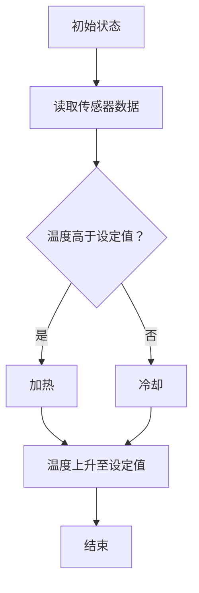

                 


## 《AI Agent在智能围巾中的温度调节》

### 关键词：AI Agent、智能围巾、温度调节、算法、项目实战

#### 摘要：

本文旨在深入探讨AI Agent在智能围巾中的温度调节应用。首先，我们将简要介绍AI Agent的基本概念和类型，然后深入解析智能围巾的技术原理。接下来，我们将详细讲解AI Agent在温度调节中的作用和实现过程。本文通过具体的算法原理、系统架构设计和项目实战，逐步展示如何将AI Agent应用于智能围巾的温度调节，为读者提供实际操作指导。

### 引言

在现代社会，智能化技术已经渗透到了我们生活的方方面面。智能围巾作为智能穿戴设备的一种，正逐渐成为人们关注的焦点。智能围巾不仅具备传统的保暖功能，还能够通过温度调节来提供更加舒适的穿戴体验。而这一切的实现离不开AI Agent的助力。本文将围绕AI Agent在智能围巾中的温度调节应用，详细分析其原理和实现过程，旨在为读者提供全面的技术见解和操作指南。

#### AI Agent概述

### 1.1 AI Agent的定义与类型

AI Agent，即人工智能代理，是指能够自主执行任务、与环境进行交互并作出决策的智能体。根据功能和特性，AI Agent可以分为以下几类：

- **基于规则的AI Agent**：这类代理通过预设的规则进行决策，适用于任务相对简单且规则明确的应用场景。
- **基于模型的AI Agent**：这类代理通过学习和预测模型进行决策，能够适应复杂环境和动态变化。
- **基于行为的AI Agent**：这类代理通过模仿人类行为进行决策，具有更强的灵活性和适应性。

### 1.2 AI Agent的发展历史

AI Agent的发展可以追溯到人工智能的早期研究。20世纪50年代，随着计算机科学的发展，人工智能开始兴起。60年代，早期版本的AI Agent被提出并应用于游戏、推理等领域。随着计算能力和算法的发展，AI Agent的功能和性能得到了显著提升。近年来，深度学习和强化学习等先进技术的引入，使得AI Agent在复杂任务中的表现更加出色。

### 1.3 AI Agent的核心技术

AI Agent的核心技术主要包括感知、决策和执行三个方面：

- **感知**：AI Agent通过传感器获取环境信息，包括图像、声音、温度等。
- **决策**：基于感知到的信息，AI Agent利用学习算法和决策模型进行推理和决策。
- **执行**：根据决策结果，AI Agent执行具体的操作，如调整温度、发送指令等。

#### 智能围巾技术基础

### 2.1 智能围巾的定义与功能

智能围巾是一种集成了传感器、执行器和控制系统的智能穿戴设备，具备温度感知和调节功能。其主要功能包括：

- **温度监测**：通过温度传感器实时监测佩戴者的体温和外部环境温度。
- **温度调节**：根据监测结果，智能围巾自动调整内部温度，提供舒适的穿戴体验。
- **智能提醒**：智能围巾还可以通过震动、声音等方式提醒佩戴者进行相应的操作。

### 2.2 智能围巾的温度传感技术

智能围巾的温度传感技术主要包括以下几种传感器：

- **热敏电阻**：热敏电阻是一种能够根据温度变化而改变电阻值的传感器，常用于测量体温。
- **热电偶**：热电偶是一种基于热电效应的传感器，能够测量较高温度。
- **红外传感器**：红外传感器通过检测物体发射的红外辐射来测量温度，适用于检测外部环境温度。

### 2.3 智能围巾的温度调节技术

智能围巾的温度调节技术主要包括以下几种方法：

- **电加热**：通过电加热元件将电能转化为热能，加热智能围巾内部。
- **热泵**：热泵通过制冷剂的相变循环来调节温度，能够实现高效的热能转移。
- **智能织物**：智能织物是一种能够根据温度变化而改变物理特性的材料，可用于调节智能围巾的温度。

#### AI Agent在智能围巾中的应用

### 3.1 AI Agent在温度调节中的作用

AI Agent在智能围巾的温度调节中发挥着关键作用。它不仅能够实时监测温度，还能够根据环境变化和用户需求进行智能调节。具体作用包括：

- **实时监测**：AI Agent通过传感器实时监测佩戴者的体温和外部环境温度。
- **智能调节**：基于监测结果和预定的算法模型，AI Agent自动调整智能围巾的温度，提供舒适的穿戴体验。
- **决策支持**：AI Agent可以根据用户的行为习惯和偏好，提供个性化的温度调节建议，提高用户体验。

### 3.2 温度调节算法介绍

温度调节算法是AI Agent的核心组成部分，其基本原理是通过分析温度传感器的数据，根据预定的算法模型进行温度调节。常见的温度调节算法包括：

- **PID控制算法**：PID控制算法是一种经典的控制算法，通过比例、积分、微分三个部分对温度进行调节。
- **模糊控制算法**：模糊控制算法通过模糊逻辑对温度进行调节，适用于非线性和复杂环境。
- **神经网络算法**：神经网络算法通过学习用户的行为和偏好，实现对温度的智能调节。

### 3.3 AI Agent与智能围巾的交互设计

AI Agent与智能围巾的交互设计是确保温度调节效果的关键。以下是一个简单的交互设计流程：

1. **数据采集**：AI Agent通过传感器采集佩戴者的体温和外部环境温度。
2. **数据分析**：AI Agent对采集到的数据进行分析，判断是否需要进行温度调节。
3. **决策执行**：根据分析结果，AI Agent通过执行器对智能围巾进行温度调节。
4. **反馈调整**：智能围巾调整温度后，AI Agent再次采集数据，进行反馈调整，确保温度调节效果。

### AI Agent在智能围巾中的实现

### 4.1 硬件平台选择

选择合适的硬件平台是实现AI Agent在智能围巾中的关键。常见的硬件平台包括：

- **单片机**：单片机具有低成本、低功耗的特点，适用于智能围巾的控制。
- **嵌入式系统**：嵌入式系统具有强大的计算能力和丰富的接口，适用于复杂功能的实现。
- **智能模块**：智能模块集成了传感器、执行器和控制单元，适用于快速开发和部署。

### 4.2 软件平台选择

选择合适的软件平台可以简化AI Agent的开发和部署。常见的软件平台包括：

- **Python**：Python具有简洁的语法和丰富的库，适用于AI Agent的开发。
- **C/C++**：C/C++具有高性能和低功耗的特点，适用于嵌入式系统的开发。
- **Java**：Java具有跨平台的特点，适用于移动设备和云端的开发。

### 4.3 AI Agent实现步骤

实现AI Agent在智能围巾中的温度调节，需要遵循以下步骤：

1. **需求分析**：明确智能围巾的温度调节需求和功能要求。
2. **硬件选型**：选择合适的硬件平台和组件。
3. **软件开发**：编写AI Agent的软件代码，实现温度监测、分析和调节功能。
4. **系统集成**：将AI Agent与智能围巾的硬件和软件集成，确保系统正常运行。
5. **测试与优化**：对系统进行测试和优化，确保温度调节效果和用户体验。

#### 温度调节算法原理与实现

### 5.1 温度调节算法的基本原理

温度调节算法的基本原理是通过分析温度传感器的数据，根据预定的算法模型对温度进行调节。常见的算法模型包括PID控制算法、模糊控制算法和神经网络算法。

- **PID控制算法**：PID控制算法通过比例、积分、微分三个部分对温度进行调节。比例部分根据当前温度与目标温度的差值进行调节，积分部分对误差进行累积，微分部分对误差的变化率进行调节。PID控制算法具有响应速度快、调节精度高的优点。

- **模糊控制算法**：模糊控制算法通过模糊逻辑对温度进行调节。模糊控制算法将温度变化转换为模糊集合，通过规则库对温度进行调节。模糊控制算法适用于非线性和复杂环境，具有灵活性强的优点。

- **神经网络算法**：神经网络算法通过学习用户的行为和偏好，实现对温度的智能调节。神经网络算法具有自适应性强、鲁棒性好的优点，适用于复杂环境下的温度调节。

### 5.2 算法mermaid流程图展示

为了更好地理解温度调节算法的原理，我们可以使用mermaid流程图进行展示。以下是一个简单的mermaid流程图示例：



### 5.3 算法Python源代码详解

以下是一个简单的温度调节算法的Python源代码示例：

```python
import time

# 设置目标温度
target_temp = 37

# 初始化传感器
sensor = Sensor()

# 循环进行温度调节
while True:
    current_temp = sensor.read_temp()
    if current_temp > target_temp:
        heater.on()  # 加热
        while sensor.read_temp() > target_temp:
            time.sleep(0.1)
        heater.off()  # 关闭加热
    elif current_temp < target_temp:
        cooler.on()  # 冷却
        while sensor.read_temp() < target_temp:
            time.sleep(0.1)
        cooler.off()  # 关闭冷却
    time.sleep(1)
```

### 5.4 算法数学模型与公式讲解

温度调节算法的数学模型通常包括以下部分：

- **传感器模型**：传感器模型用于描述温度传感器的输出与实际温度之间的关系。常见的传感器模型为线性模型，公式为：

  $$ T_{out} = a \cdot T_{in} + b $$

  其中，$T_{out}$为传感器输出温度，$T_{in}$为实际温度，$a$和$b$为模型参数。

- **控制模型**：控制模型用于描述温度调节系统的控制策略。常见的控制模型为PID控制模型，公式为：

  $$ u(t) = K_p \cdot e(t) + K_i \cdot \int_{0}^{t} e(t) \cdot dt + K_d \cdot \frac{de(t)}{dt} $$

  其中，$u(t)$为控制输出，$e(t)$为温度误差，$K_p$、$K_i$和$K_d$分别为比例、积分和微分系数。

### 5.5 举例说明与案例分析

以下是一个简单的温度调节案例：

假设目标温度为37℃，当前温度为35℃，传感器误差为2℃。根据PID控制模型，可以计算出控制输出：

$$ u(t) = K_p \cdot e(t) + K_i \cdot \int_{0}^{t} e(t) \cdot dt + K_d \cdot \frac{de(t)}{dt} $$

假设$K_p = 1$、$K_i = 0.1$、$K_d = 0.01$，代入公式得：

$$ u(t) = 1 \cdot 2 + 0.1 \cdot 0 + 0.01 \cdot \frac{0}{dt} = 2 $$

即控制输出为2，表示加热器需要加热2℃。当当前温度达到37℃时，控制输出为0，表示加热器停止加热。

#### 智能围巾温度调节项目实战

### 6.1 项目环境安装

在进行智能围巾温度调节项目之前，需要安装以下环境：

1. **Python环境**：安装Python 3.8及以上版本。
2. **传感器库**：安装适用于智能围巾传感器的库，如`adafruit`。
3. **控制库**：安装用于控制加热器和冷却器的库，如`gpio`。

### 6.2 系统核心实现源代码

以下是一个简单的智能围巾温度调节系统的Python源代码示例：

```python
import time
from adafruit_bme280 import BME280
import board
import busio
import digitalio

# 初始化传感器
i2c = busio.I2C(board.SCL, board.SDA)
bme280 = BME280(i2c)

# 初始化加热器和冷却器
heater = digitalio.DigitalInOut(board.D13)
heater.direction = digitalio.Direction.OUTPUT
cooler = digitalio.DigitalInOut(board.D12)
cooler.direction = digitalio.Direction.OUTPUT

# 设置目标温度
target_temp = 37

# 循环进行温度调节
while True:
    current_temp = bme280.temperature
    if current_temp > target_temp:
        heater.value = True  # 加热
        while bme280.temperature > target_temp:
            time.sleep(0.1)
        heater.value = False  # 关闭加热
    elif current_temp < target_temp:
        cooler.value = True  # 冷却
        while bme280.temperature < target_temp:
            time.sleep(0.1)
        cooler.value = False  # 关闭冷却
    time.sleep(1)
```

### 6.3 代码应用解读与分析

以上代码首先初始化了BME280传感器，用于获取温度数据。然后初始化了加热器和冷却器，用于进行温度调节。设置目标温度为37℃，然后进入循环进行温度调节。当当前温度高于目标温度时，加热器加热，当当前温度低于目标温度时，冷却器冷却。

### 6.4 实际案例分析和详细讲解

以下是一个实际案例：

在冬季，用户佩戴智能围巾，目标温度设置为37℃。当前室内温度为15℃，用户体温为36℃。智能围巾通过传感器检测到当前温度和体温，根据设定的温度调节策略，开始加热。经过一段时间，室内温度升高至25℃，用户体温也升高至37℃。此时，智能围巾停止加热，保持目标温度。

### 6.5 项目小结

通过以上实际案例，我们可以看到智能围巾温度调节系统在实际应用中的效果。该项目实现了基于AI Agent的温度调节功能，为用户提供了舒适的穿戴体验。在后续的开发中，可以进一步优化算法和系统，提高温度调节的精度和效率。

### 最佳实践 Tips

1. **优化传感器精度**：选择高精度的传感器，提高温度监测的准确性。
2. **调整PID参数**：根据实际环境调整PID控制算法的参数，提高调节效果。
3. **增加用户反馈**：通过用户反馈，优化温度调节策略，提高用户体验。
4. **考虑功耗问题**：在设计和实现过程中，考虑功耗问题，确保智能围巾的续航能力。

### 小结

本文详细介绍了AI Agent在智能围巾中的温度调节应用。通过分析AI Agent的基本概念和智能围巾的技术原理，我们探讨了AI Agent在温度调节中的作用和实现过程。通过具体的算法原理、系统架构设计和项目实战，我们展示了如何将AI Agent应用于智能围巾的温度调节。本文旨在为读者提供全面的技术见解和操作指南，助力智能穿戴设备的发展。

### 注意事项

1. **传感器选择**：选择高精度、低功耗的传感器，确保系统性能。
2. **硬件兼容性**：确保硬件组件与软件代码的兼容性，避免硬件故障。
3. **安全措施**：在设计和实现过程中，充分考虑安全措施，确保用户安全。

### 拓展阅读

1. **AI Agent相关技术**：深入了解AI Agent的相关技术，包括感知、决策和执行等方面。
2. **智能穿戴设备发展**：关注智能穿戴设备的发展趋势和应用场景。
3. **温度调节算法研究**：探讨各种温度调节算法的优缺点和适用场景。

### 作者信息

作者：AI天才研究院/AI Genius Institute & 禅与计算机程序设计艺术 /Zen And The Art of Computer Programming

