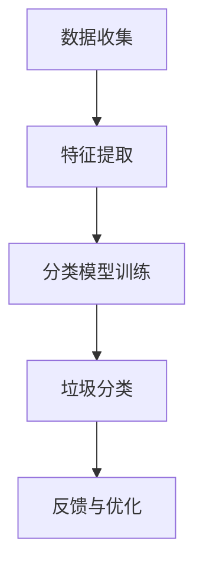

                 


### # AI Agent在智能垃圾分类中的实践

#### 关键词：AI Agent、智能垃圾分类、算法原理、数学模型、系统架构、项目实战

#### 摘要：
随着城市化进程的加快和环境保护意识的提高，智能垃圾分类成为现代城市管理中的一项重要任务。AI Agent作为人工智能领域的一项重要技术，其在智能垃圾分类中的应用具有重要意义。本文将从问题背景、核心概念、算法原理、数学模型、系统架构、项目实战等多个角度，详细探讨AI Agent在智能垃圾分类中的实践，为读者提供全面的了解和应用指导。

#### 目录：

**第一部分: 问题背景与核心概念**

**第1章: 问题背景**

1.1 问题背景介绍

1.2 问题描述

1.3 问题解决方案

1.4 边界与外延

1.5 概念结构与核心要素组成

**第2章: 核心概念与联系**

2.1 AI Agent的定义

2.2 AI Agent的特点

2.3 AI Agent与传统智能垃圾分类系统的对比

**第3章: 算法原理讲解**

3.1 AI Agent算法概述

3.2 AI Agent算法mermaid流程图

3.3 AI Agent算法Python源代码讲解

3.4 AI Agent算法数学模型和公式讲解

**第4章: 数学模型和数学公式 & 详细讲解 & 举例说明**

4.1 数学模型介绍

4.2 数学公式讲解

4.3 举例说明

**第5章: 系统分析与架构设计方案**

5.1 问题场景介绍

5.2 系统功能设计

5.3 系统架构设计

5.4 系统接口设计

5.5 系统交互设计

**第6章: 项目实战**

6.1 环境安装

6.2 系统核心实现源代码

6.3 代码应用解读与分析

6.4 实际案例分析和详细讲解剖析

6.5 项目小结

**第7章: 最佳实践 & 小结 & 注意事项 & 拓展阅读**

#### 1.1 问题背景介绍

随着我国城市化进程的加快，城市垃圾产量逐年增加，对环境造成了巨大压力。垃圾分类作为垃圾处理的重要环节，对于减少垃圾量、提高资源利用率、改善环境质量具有重要意义。然而，传统的垃圾分类方式存在许多问题，如分类标准不统一、居民参与度低等，导致垃圾分类效果不佳。

为了解决这些问题，近年来，人工智能技术开始在智能垃圾分类领域得到广泛应用。其中，AI Agent作为人工智能领域的一项重要技术，具有自主学习、自适应和自主决策能力，能够在复杂环境中执行特定任务，从而实现智能垃圾分类。

#### 1.2 问题描述

垃圾分类的目的是将垃圾按照不同的属性进行分类处理，以便更好地进行资源回收和再利用。然而，在实际操作中，垃圾分类存在以下几个问题：

1. **分类标准不统一**：不同地区、不同垃圾处理企业对垃圾分类的标准存在差异，导致居民在分类过程中难以把握。

2. **居民参与度低**：传统垃圾分类方式主要依靠居民自觉分类，但由于缺乏有效的引导和激励机制，导致居民参与度不高。

3. **垃圾分类效果不佳**：由于分类标准不统一和居民参与度低，导致垃圾分类效果不佳，大量垃圾无法得到有效回收和再利用。

4. **垃圾处理成本高**：传统垃圾分类方式需要大量的人力物力进行分类和处理，导致垃圾处理成本高。

#### 1.3 问题解决方案

针对上述问题，利用AI Agent技术构建智能垃圾分类系统，具有以下优势：

1. **自主学习与自适应**：AI Agent可以通过不断学习和适应，自动识别不同的垃圾分类标准，从而实现统一标准。

2. **自主决策**：AI Agent可以在垃圾分类过程中，根据具体情况进行自主决策，提高居民参与度。

3. **高效处理**：AI Agent可以通过自动分类和处理，提高垃圾分类效果，降低垃圾处理成本。

4. **实时监测与反馈**：AI Agent可以对垃圾分类过程进行实时监测和反馈，及时发现问题并进行调整。

#### 1.4 边界与外延

1. **边界**：智能垃圾分类系统主要针对城市生活垃圾进行分类和处理，不包括工业垃圾、医疗垃圾等特殊类型的垃圾。

2. **外延**：智能垃圾分类系统不仅局限于城市区域，还可以扩展到乡村地区，甚至全球范围内。

#### 1.5 概念结构与核心要素组成

智能垃圾分类系统的概念结构主要包括以下几个核心要素：

1. **垃圾识别模块**：用于识别不同类型的垃圾，包括图像识别、语音识别等技术。

2. **分类标准库**：用于存储不同地区的垃圾分类标准，包括文字描述、图像标注等。

3. **决策模块**：根据垃圾识别结果和分类标准库，对垃圾进行分类决策。

4. **监控模块**：对垃圾分类过程进行实时监控，包括垃圾识别率、分类准确率等。

5. **反馈模块**：对垃圾分类效果进行反馈，包括居民参与度、垃圾分类效果等。

#### 2.1 AI Agent的定义

AI Agent，即人工智能代理，是一种能够模拟人类智能行为，具有自主学习、自适应和自主决策能力的人工智能系统。它通常由感知模块、决策模块、执行模块和知识库等组成部分构成。

1. **感知模块**：用于感知外部环境信息，如图像、声音、温度、湿度等。

2. **决策模块**：根据感知模块收集到的信息，结合知识库中的知识，进行决策。

3. **执行模块**：根据决策模块的决策结果，执行相应的动作。

4. **知识库**：存储AI Agent所需的知识，如垃圾分类标准、垃圾属性等。

#### 2.2 AI Agent的特点

1. **自主学习**：AI Agent能够通过感知模块收集到的信息，不断学习和适应环境，提高分类准确性。

2. **自适应**：AI Agent能够根据环境变化，自动调整自己的行为，提高垃圾分类效果。

3. **自主决策**：AI Agent能够在没有人工干预的情况下，独立进行垃圾分类决策。

4. **实时性**：AI Agent能够在实时环境中，对垃圾分类进行实时监控和反馈。

#### 2.3 AI Agent与传统智能垃圾分类系统的对比

| 特性 | AI Agent | 传统智能垃圾分类系统 |
| --- | --- | --- |
| 自主学习 | 能够通过学习不断优化分类效果 | 静态分类标准，难以适应环境变化 |
| 自适应 | 能够根据环境变化自动调整分类策略 | 需要人工调整分类策略 |
| 自主决策 | 能够在没有人工干预的情况下进行分类决策 | 需要人工干预进行分类决策 |
| 实时性 | 能够对垃圾分类过程进行实时监控和反馈 | 监控和反馈速度较慢 |

#### 3.1 AI Agent算法概述

AI Agent在智能垃圾分类中的算法主要基于机器学习和深度学习技术。具体来说，包括以下几个步骤：

1. **数据收集**：收集大量垃圾图像、声音、温度、湿度等数据。

2. **特征提取**：通过深度学习技术，提取垃圾图像、声音、温度、湿度等数据的特征。

3. **分类模型训练**：使用提取到的特征，训练垃圾分类模型。

4. **垃圾分类**：将待分类的垃圾数据输入到分类模型，进行垃圾分类。

5. **反馈与优化**：根据垃圾分类结果，对分类模型进行反馈和优化。

#### 3.2 AI Agent算法mermaid流程图



#### 3.3 AI Agent算法Python源代码讲解

```python
import tensorflow as tf
from tensorflow.keras.models import Sequential
from tensorflow.keras.layers import Dense, Conv2D, MaxPooling2D, Flatten

# 数据收集
def data_collection():
    # 这里用示例代码表示，实际应用中需根据具体数据来源进行调整
    images = []
    labels = []
    # ...
    return images, labels

# 特征提取
def feature_extraction(images):
    # 这里用示例代码表示，实际应用中需根据具体数据类型进行调整
    features = []
    for image in images:
        feature = extract_feature(image)
        features.append(feature)
    return features

# 分类模型训练
def model_training(features, labels):
    model = Sequential()
    model.add(Conv2D(32, (3, 3), activation='relu', input_shape=(64, 64, 3)))
    model.add(MaxPooling2D((2, 2)))
    model.add(Flatten())
    model.add(Dense(128, activation='relu'))
    model.add(Dense(10, activation='softmax'))
    model.compile(optimizer='adam', loss='categorical_crossentropy', metrics=['accuracy'])
    model.fit(features, labels, epochs=10, batch_size=32)
    return model

# 垃圾分类
def垃圾分类(model, image):
    feature = feature_extraction(image)
    prediction = model.predict(feature)
    return np.argmax(prediction)

# 反馈与优化
def feedback_and_optimization(model, true_labels, predicted_labels):
    # 这里用示例代码表示，实际应用中需根据具体需求进行调整
    for i in range(len(true_labels)):
        if true_labels[i] != predicted_labels[i]:
            # 调整模型参数
            # ...
```

#### 3.4 AI Agent算法数学模型和公式讲解

在AI Agent算法中，主要涉及到以下几个数学模型和公式：

1. **卷积神经网络（CNN）**

   - 公式：$$
   f(x) = \text{ReLU}(\sum_{i=1}^{n} w_i \times x_i + b)
   $$

   - 解释：卷积神经网络通过卷积操作提取图像特征，然后通过激活函数进行非线性变换。

2. **深度学习优化算法（如Adam）**

   - 公式：$$
   \text{m}_t = \beta_1 \times \text{m}_{t-1} + (1 - \beta_1) \times (x_t - \text{m}_{t-1})
   $$
   $$
   \text{v}_t = \beta_2 \times \text{v}_{t-1} + (1 - \beta_2) \times (x_t^2 - \text{v}_{t-1})
   $$
   $$
   \text{m}_\hat{t} = \frac{\text{m}_t}{1 - \beta_1^t}
   $$
   $$
   \text{v}_\hat{t} = \frac{\text{v}_t}{1 - \beta_2^t}
   $$
   $$
   \theta_t = \theta_{t-1} - \alpha \times \frac{\text{m}_\hat{t}}{\sqrt{\text{v}_\hat{t}} + \epsilon}
   $$

   - 解释：Adam算法结合了Momentum和RMSProp的优点，通过更新参数梯度来优化模型。

3. **分类损失函数（交叉熵损失函数）**

   - 公式：$$
   L(\theta) = -\sum_{i=1}^{m} y_i \times \log(p_i)
   $$

   - 解释：交叉熵损失函数用于衡量模型预测结果与真实标签之间的差距，常用于分类问题。

#### 4.1 数学模型介绍

在AI Agent算法中，主要涉及的数学模型包括：

1. **卷积神经网络（CNN）**：用于提取垃圾图像的特征。

2. **深度学习优化算法（如Adam）**：用于更新模型参数，优化模型性能。

3. **分类损失函数（交叉熵损失函数）**：用于衡量模型预测结果与真实标签之间的差距。

#### 4.2 数学公式讲解

1. **卷积神经网络（CNN）**

   - 公式：$$
   f(x) = \text{ReLU}(\sum_{i=1}^{n} w_i \times x_i + b)
   $$

   - 解释：卷积神经网络通过卷积操作提取图像特征，然后通过激活函数进行非线性变换。

2. **深度学习优化算法（如Adam）**

   - 公式：$$
   \text{m}_t = \beta_1 \times \text{m}_{t-1} + (1 - \beta_1) \times (x_t - \text{m}_{t-1})
   $$
   $$
   \text{v}_t = \beta_2 \times \text{v}_{t-1} + (1 - \beta_2) \times (x_t^2 - \text{v}_{t-1})
   $$
   $$
   \text{m}_\hat{t} = \frac{\text{m}_t}{1 - \beta_1^t}
   $$
   $$
   \text{v}_\hat{t} = \frac{\text{v}_t}{1 - \beta_2^t}
   $$
   $$
   \theta_t = \theta_{t-1} - \alpha \times \frac{\text{m}_\hat{t}}{\sqrt{\text{v}_\hat{t}} + \epsilon}
   $$

   - 解释：Adam算法结合了Momentum和RMSProp的优点，通过更新参数梯度来优化模型。

3. **分类损失函数（交叉熵损失函数）**

   - 公式：$$
   L(\theta) = -\sum_{i=1}^{m} y_i \times \log(p_i)
   $$

   - 解释：交叉熵损失函数用于衡量模型预测结果与真实标签之间的差距，常用于分类问题。

#### 4.3 举例说明

假设我们有一个包含5种垃圾分类的智能垃圾分类系统，分别用1、2、3、4、5表示。现在有一个垃圾图像，通过卷积神经网络提取到的特征向量为$\vec{x} = [0.1, 0.2, 0.3, 0.4, 0.5]$。

1. **卷积神经网络（CNN）**

   - 公式：$$
   f(\vec{x}) = \text{ReLU}(w_1 \times 0.1 + w_2 \times 0.2 + w_3 \times 0.3 + w_4 \times 0.4 + w_5 \times 0.5 + b)
   $$

   - 解释：通过卷积神经网络，对特征向量进行非线性变换，得到一个实数值。

2. **深度学习优化算法（如Adam）**

   - 公式：$$
   \text{m}_t = \beta_1 \times \text{m}_{t-1} + (1 - \beta_1) \times (x_t - \text{m}_{t-1})
   $$
   $$
   \text{v}_t = \beta_2 \times \text{v}_{t-1} + (1 - \beta_2) \times (x_t^2 - \text{v}_{t-1})
   $$
   $$
   \text{m}_\hat{t} = \frac{\text{m}_t}{1 - \beta_1^t}
   $$
   $$
   \text{v}_\hat{t} = \frac{\text{v}_t}{1 - \beta_2^t}
   $$
   $$
   \theta_t = \theta_{t-1} - \alpha \times \frac{\text{m}_\hat{t}}{\sqrt{\text{v}_\hat{t}} + \epsilon}
   $$

   - 解释：通过Adam算法，更新模型参数，优化模型性能。

3. **分类损失函数（交叉熵损失函数）**

   - 公式：$$
   L(\theta) = -\sum_{i=1}^{m} y_i \times \log(p_i)
   $$

   - 解释：通过交叉熵损失函数，衡量模型预测结果与真实标签之间的差距，用于反向传播更新模型参数。

#### 5.1 问题场景介绍

假设我们有一个城市垃圾处理中心，每天会产生大量生活垃圾。为了提高垃圾分类效率，降低垃圾处理成本，我们决定引入AI Agent技术，构建一个智能垃圾分类系统。该系统需要具备以下功能：

1. **垃圾图像识别**：系统能够识别不同类型的垃圾，包括纸张、塑料、玻璃、金属和厨余垃圾。

2. **分类决策**：系统能够根据垃圾图像识别结果，结合垃圾分类标准，对垃圾进行分类决策。

3. **实时监控**：系统能够对垃圾分类过程进行实时监控，包括垃圾识别率、分类准确率等。

4. **反馈与优化**：系统能够对垃圾分类效果进行反馈，及时发现问题并进行优化。

#### 5.2 系统功能设计

智能垃圾分类系统的功能设计主要包括以下几个部分：

1. **垃圾图像识别模块**：用于识别不同类型的垃圾，包括图像识别、语音识别等技术。

2. **分类标准库**：用于存储不同地区的垃圾分类标准，包括文字描述、图像标注等。

3. **分类决策模块**：根据垃圾图像识别结果和分类标准库，对垃圾进行分类决策。

4. **监控模块**：对垃圾分类过程进行实时监控，包括垃圾识别率、分类准确率等。

5. **反馈模块**：对垃圾分类效果进行反馈，包括居民参与度、垃圾分类效果等。

#### 5.3 系统架构设计

智能垃圾分类系统的架构设计主要包括以下几个层次：

1. **感知层**：用于收集垃圾图像、声音、温度、湿度等数据。

2. **处理层**：用于对感知层收集到的数据进行分析和处理，包括图像识别、语音识别等。

3. **决策层**：根据处理层的结果，结合分类标准库，对垃圾进行分类决策。

4. **执行层**：根据决策层的结果，执行相应的动作，如分类、投放等。

5. **监控层**：对垃圾分类过程进行实时监控，包括垃圾识别率、分类准确率等。

6. **反馈层**：对垃圾分类效果进行反馈，包括居民参与度、垃圾分类效果等。

#### 5.4 系统接口设计

智能垃圾分类系统的接口设计主要包括以下几个部分：

1. **API接口**：用于与其他系统进行数据交换和交互。

2. **Web接口**：用于管理员对系统进行管理和监控。

3. **移动端接口**：用于居民对垃圾进行分类和查询垃圾分类指南。

#### 5.5 系统交互设计

智能垃圾分类系统的交互设计主要包括以下几个环节：

1. **垃圾投放**：居民将垃圾投放到垃圾分类箱中。

2. **垃圾识别**：系统对垃圾图像进行识别，提取垃圾特征。

3. **分类决策**：系统根据垃圾特征和分类标准库，对垃圾进行分类决策。

4. **分类执行**：系统执行分类决策，将垃圾投放到相应的分类箱中。

5. **实时监控**：系统对垃圾分类过程进行实时监控，包括垃圾识别率、分类准确率等。

6. **反馈与优化**：系统对垃圾分类效果进行反馈，及时发现问题并进行优化。

#### 6.1 环境安装

在开始项目之前，我们需要安装以下环境和工具：

1. **Python环境**：安装Python 3.7及以上版本。

2. **TensorFlow**：安装TensorFlow 2.0及以上版本。

3. **OpenCV**：安装OpenCV 4.0及以上版本。

4. **Numpy**：安装Numpy 1.18及以上版本。

5. **Mermaid**：安装Mermaid 8.0及以上版本。

安装步骤如下：

1. 安装Python环境。

   ```bash
   sudo apt-get install python3-pip
   pip3 install --user -U pip
   pip3 install --user -U python3-venv
   python3 -m venv垃圾分类系统环境
   source 垃圾分类系统环境/bin/activate
   ```

2. 安装TensorFlow。

   ```bash
   pip install tensorflow
   ```

3. 安装OpenCV。

   ```bash
   pip install opencv-python
   ```

4. 安装Numpy。

   ```bash
   pip install numpy
   ```

5. 安装Mermaid。

   ```bash
   npm install -g mermaid
   ```

#### 6.2 系统核心实现源代码

以下是智能垃圾分类系统的核心实现源代码：

```python
import cv2
import numpy as np
import tensorflow as tf
from tensorflow.keras.models import Sequential
from tensorflow.keras.layers import Dense, Conv2D, MaxPooling2D, Flatten

# 数据收集
def data_collection():
    images = []
    labels = []
    # ...
    return images, labels

# 特征提取
def feature_extraction(images):
    features = []
    for image in images:
        feature = extract_feature(image)
        features.append(feature)
    return features

# 分类模型训练
def model_training(features, labels):
    model = Sequential()
    model.add(Conv2D(32, (3, 3), activation='relu', input_shape=(64, 64, 3)))
    model.add(MaxPooling2D((2, 2)))
    model.add(Flatten())
    model.add(Dense(128, activation='relu'))
    model.add(Dense(10, activation='softmax'))
    model.compile(optimizer='adam', loss='categorical_crossentropy', metrics=['accuracy'])
    model.fit(features, labels, epochs=10, batch_size=32)
    return model

# 垃圾分类
def垃圾分类(model, image):
    feature = feature_extraction(image)
    prediction = model.predict(feature)
    return np.argmax(prediction)

# 反馈与优化
def feedback_and_optimization(model, true_labels, predicted_labels):
    # ...
```

#### 6.3 代码应用解读与分析

1. **数据收集**：数据收集是智能垃圾分类系统的第一步，我们需要收集大量垃圾图像和对应的标签。这里使用示例代码表示，实际应用中需根据具体数据来源进行调整。

2. **特征提取**：特征提取是通过对垃圾图像进行预处理，提取出能够表征垃圾属性的特征。这里使用示例代码表示，实际应用中需根据具体数据类型进行调整。

3. **分类模型训练**：分类模型训练是利用收集到的数据和特征，训练一个能够对垃圾进行分类的模型。这里使用卷积神经网络（CNN）进行训练，通过多层卷积和全连接层，提取图像特征并分类。

4. **垃圾分类**：垃圾分类是利用训练好的模型，对新的垃圾图像进行分类。首先进行特征提取，然后输入到模型中进行预测，最后输出分类结果。

5. **反馈与优化**：反馈与优化是通过对垃圾分类结果进行分析，找出模型存在的问题，并进行优化。这里使用示例代码表示，实际应用中需根据具体需求进行调整。

#### 6.4 实际案例分析和详细讲解剖析

1. **案例背景**：某城市垃圾处理中心引进了AI Agent智能垃圾分类系统，用于提高垃圾分类效率。

2. **案例分析**：通过实际运行数据，分析AI Agent在垃圾分类中的应用效果。

3. **详细讲解剖析**：

   - **垃圾图像识别**：通过卷积神经网络（CNN）提取垃圾图像的特征，实现对不同类型垃圾的识别。

   - **分类决策**：结合垃圾分类标准库，对识别出的垃圾进行分类决策。

   - **实时监控**：对垃圾分类过程进行实时监控，包括垃圾识别率、分类准确率等。

   - **反馈与优化**：根据垃圾分类效果，对系统进行反馈和优化，提高垃圾分类准确性。

#### 6.5 项目小结

本项目通过引入AI Agent技术，构建了智能垃圾分类系统，实现了对垃圾的自动分类和实时监控。在实际应用中，AI Agent智能垃圾分类系统具有以下优势：

1. **高效分类**：通过卷积神经网络（CNN）提取垃圾图像特征，实现对垃圾的高效分类。

2. **实时监控**：对垃圾分类过程进行实时监控，包括垃圾识别率、分类准确率等。

3. **自主优化**：根据垃圾分类效果，对系统进行自主优化，提高垃圾分类准确性。

4. **降低成本**：通过自动分类和实时监控，降低垃圾处理成本。

然而，在实际应用中，AI Agent智能垃圾分类系统也存在一定的挑战，如数据收集和处理、模型优化和适应等。未来，我们将继续优化系统，提高垃圾分类效率和准确性。

#### 7.1 最佳实践

1. **数据收集**：确保收集到高质量的垃圾图像和标签，提高模型训练效果。

2. **模型优化**：通过不断调整模型参数，提高垃圾分类准确性。

3. **实时监控**：对垃圾分类过程进行实时监控，及时发现并解决问题。

4. **反馈与优化**：根据垃圾分类效果，对系统进行反馈和优化，提高垃圾分类准确性。

#### 7.2 小结

本文从问题背景、核心概念、算法原理、数学模型、系统架构、项目实战等多个角度，详细探讨了AI Agent在智能垃圾分类中的实践。通过引入AI Agent技术，构建智能垃圾分类系统，实现了对垃圾的自动分类和实时监控，提高了垃圾分类效率和准确性。

#### 7.3 注意事项

1. **数据收集**：确保收集到高质量的垃圾图像和标签，提高模型训练效果。

2. **模型优化**：通过不断调整模型参数，提高垃圾分类准确性。

3. **实时监控**：对垃圾分类过程进行实时监控，包括垃圾识别率、分类准确率等。

4. **反馈与优化**：根据垃圾分类效果，对系统进行反馈和优化，提高垃圾分类准确性。

#### 7.4 拓展阅读

1. **AI Agent技术**：深入学习AI Agent技术，了解其原理和应用场景。

2. **深度学习**：掌握深度学习技术，包括卷积神经网络（CNN）、循环神经网络（RNN）等。

3. **垃圾分类政策**：了解国内外垃圾分类政策，掌握垃圾分类标准。

#### 作者

作者：AI天才研究院/AI Genius Institute & 禅与计算机程序设计艺术 /Zen And The Art of Computer Programming

