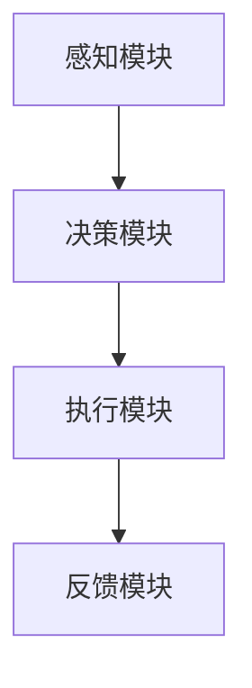
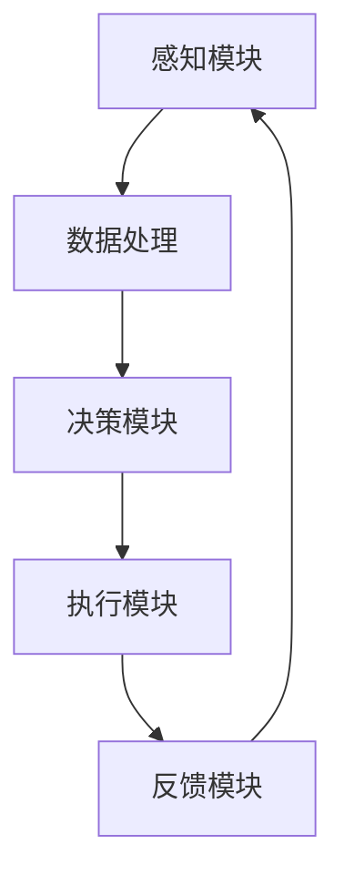

                 

### 《AI Agent在智能床头柜中的晨间仪式规划》

> 关键词：AI Agent、智能床头柜、晨间仪式、规划算法、智能家居、用户体验

> 摘要：本文深入探讨AI Agent在智能床头柜中的应用，特别是其在晨间仪式规划中的作用。通过逐步分析AI Agent的基础概念、智能床头柜的功能与交互方式，以及晨间仪式规划算法的原理与实践，本文旨在为读者提供一个全面的技术解析，帮助他们更好地理解AI Agent在智能家居领域的实际应用。

### 目录大纲设计思路

为了确保《AI Agent在智能床头柜中的晨间仪式规划》这篇文章的逻辑清晰、结构紧凑且易于理解，我们采用了以下设计思路：

1. **全书结构规划**：首先，我们规划了全书的整体结构，包括引言、核心概念、算法原理、系统设计与实现、项目实战和总结与展望等部分，使得内容有条理，便于读者逐步深入理解。

2. **细化章节内容**：每个章节都明确了其目的和涵盖内容，如“AI Agent基本概念”、“智能床头柜介绍”、“晨间仪式规划算法原理”等，确保读者能够全面理解相关概念和技术。

3. **逻辑性**：保持各章节之间的逻辑关系，从基础到深入，从理论到实践，逐步引导读者掌握相关知识。

4. **简洁性**：在内容详尽的同时，避免冗余信息，使目录大纲简洁明了。

5. **格式规范**：使用markdown格式，使用#、##、###等符号表示不同的目录层级，使结构清晰。

### 目录大纲

以下是《AI Agent在智能床头柜中的晨间仪式规划》的目录大纲：

----------------------------------------------------------------

# 第一部分: 引言

## 1.1 问题背景

### 1.1.1 智能家居的兴起

### 1.1.2 晨间仪式的重要性

### 1.1.3 AI Agent的应用场景

## 1.2 目标与内容概述

### 1.2.1 本书的目标

### 1.2.2 本书的内容概述

## 1.3 阅读指南

### 1.3.1 阅读建议

### 1.3.2 学习路径

----------------------------------------------------------------

## 第二部分: AI Agent基础

# 第2章: AI Agent基本概念

## 2.1 AI Agent的定义

### 2.1.1 AI Agent的起源

### 2.1.2 AI Agent的定义

## 2.2 AI Agent的类型

### 2.2.1 反应型Agent

### 2.2.2 目标导向型Agent

### 2.2.3 计划型Agent

## 2.3 AI Agent的构成

### 2.3.1 感知模块

### 2.3.2 决策模块

### 2.3.3 执行模块

## 2.4 AI Agent的工作原理

### 2.4.1 感知与理解

### 2.4.2 决策与计划

### 2.4.3 执行与反馈

## 2.5 本章小结

----------------------------------------------------------------

# 第3章: 智能床头柜介绍

## 3.1 智能床头柜的定义与功能

### 3.1.1 智能床头柜的定义

### 3.1.2 智能床头柜的功能

## 3.2 智能床头柜的硬件与软件

### 3.2.1 硬件组成

### 3.2.2 软件平台

## 3.3 智能床头柜的交互方式

### 3.3.1 触摸屏交互

### 3.3.2 声音交互

### 3.3.3 视觉交互

## 3.4 智能床头柜的发展趋势

### 3.4.1 技术革新

### 3.4.2 市场前景

## 3.5 本章小结

----------------------------------------------------------------

# 第4章: 晨间仪式规划算法原理

## 4.1 晨间仪式规划的概述

### 4.1.1 晨间仪式规划的重要性

### 4.1.2 晨间仪式规划的目标

## 4.2 AI Agent在晨间仪式规划中的应用

### 4.2.1 AI Agent的优势

### 4.2.2 AI Agent在晨间仪式规划中的具体应用

## 4.3 晨间仪式规划算法的基本框架

### 4.3.1 感知模块

### 4.3.2 决策模块

### 4.3.3 执行模块

## 4.4 晨间仪式规划算法的Mermaid流程图

$$
\text{算法流程图如下：}
$$



## 4.5 晨间仪式规划算法的Python实现

### 4.5.1 算法原理

### 4.5.2 Python代码示例

```python
# Python代码示例
```

## 4.6 数学模型与公式

$$
\text{数学模型和公式如下：}
$$

$

----------------------------------------------------------------

### 第一部分: 引言

#### 1.1 问题背景

随着科技的不断进步，智能家居市场呈现出蓬勃发展的态势。智能床头柜作为智能家居的重要组成部分，逐渐走进了人们的日常生活。它不仅具备传统的储物、照明等功能，还能通过AI Agent实现晨间仪式的智能化规划，从而提升用户的生活质量。

晨间仪式对于每个人的日常生活具有重要意义。一个良好的晨间仪式可以帮助人们更快地适应一天的工作和生活节奏，提高工作效率和生活质量。然而，传统的晨间仪式往往缺乏个性化，难以满足每个人的独特需求。而AI Agent的引入，则为晨间仪式的个性化、智能化规划提供了可能。

#### 1.2 目标与内容概述

本文的主要目标是深入探讨AI Agent在智能床头柜中的应用，特别是其在晨间仪式规划中的作用。通过对AI Agent的基础概念、智能床头柜的功能与交互方式，以及晨间仪式规划算法的原理与实践的逐步分析，本文旨在为读者提供一个全面的技术解析，帮助他们更好地理解AI Agent在智能家居领域的实际应用。

本文内容分为四个主要部分：

1. **AI Agent基础**：介绍AI Agent的基本概念、类型、构成和工作原理，为后续内容打下基础。
2. **智能床头柜介绍**：阐述智能床头柜的定义、功能、硬件与软件，以及其交互方式，为AI Agent的应用提供场景背景。
3. **晨间仪式规划算法原理**：分析晨间仪式规划的重要性、AI Agent在其中的应用，以及算法的基本框架、Mermaid流程图和Python实现。
4. **项目实战**：通过一个具体的实例，展示如何在实际项目中应用AI Agent进行晨间仪式规划。

#### 1.3 阅读指南

为了更好地理解本文内容，建议读者按照以下路径阅读：

1. **先读引言部分**：了解问题的背景和本文的目标，明确文章的主题和结构。
2. **逐步阅读各章节**：从基础概念到具体应用，逐步掌握相关技术。
3. **结合实际案例**：通过项目实战部分，加深对理论知识的理解。
4. **拓展阅读**：在本文的基础上，可以进一步阅读相关的技术文献和参考资料，以获取更深入的知识。

通过本文的阅读，读者将能够：

1. **了解AI Agent的基本概念和类型**，掌握其在智能家居中的应用。
2. **了解智能床头柜的功能和交互方式**，理解AI Agent在实际应用中的场景背景。
3. **掌握晨间仪式规划算法的原理和实践**，学会如何在实际项目中应用AI Agent进行个性化、智能化的晨间仪式规划。

### 第二部分: AI Agent基础

#### 第2章: AI Agent基本概念

AI Agent是人工智能领域中的一个重要概念，它代表着具有智能行为的计算实体。本章节将介绍AI Agent的基本概念、类型、构成和工作原理，为后续内容打下基础。

##### 2.1 AI Agent的定义

AI Agent，即人工智能代理，可以定义为一种能够自主感知环境、制定决策并执行相应动作的计算实体。AI Agent具有以下几个特点：

1. **自主性**：AI Agent能够独立地完成特定任务，不需要人工干预。
2. **适应性**：AI Agent能够根据环境的变化，调整自己的行为策略。
3. **交互性**：AI Agent能够与用户或其他系统进行交互，获取输入并产生输出。

AI Agent的定义起源于人工智能领域的早期研究，当时学者们致力于探索如何使计算机具有智能行为。随着人工智能技术的不断发展，AI Agent的概念也得到了不断丰富和完善。

##### 2.2 AI Agent的类型

根据AI Agent的决策方式和工作机制，可以将AI Agent分为以下几种类型：

1. **反应型Agent**：反应型Agent是一种简单的AI Agent，它仅根据当前环境的状态做出反应。这类Agent没有长期记忆，只能处理当前输入，无法进行长期规划。典型的例子是自动售卖机和智能家居中的安防系统。

2. **目标导向型Agent**：目标导向型Agent具有明确的长期目标，并根据当前环境的状态和目标之间的差距，制定决策。这类Agent通常具有某种形式的记忆，能够存储和处理历史信息。典型的例子是自动驾驶汽车和智能客服系统。

3. **计划型Agent**：计划型Agent不仅具有长期目标，还能够根据目标和当前环境的状态，制定一系列行动计划。这类Agent通常具有复杂的决策模型和执行机制，能够实现复杂的任务。典型的例子是高级智能体和游戏中的AI角色。

##### 2.3 AI Agent的构成

AI Agent的构成通常包括以下几个模块：

1. **感知模块**：感知模块负责收集和处理环境信息，包括视觉、听觉、触觉等多种感官信息。感知模块是AI Agent获取环境信息的桥梁。

2. **决策模块**：决策模块根据感知模块提供的信息，结合AI Agent的目标，制定相应的决策。决策模块是AI Agent的核心，负责分析问题和制定解决方案。

3. **执行模块**：执行模块负责执行决策模块制定的决策，将决策转化为具体的行动。执行模块是AI Agent实现目标的关键。

4. **学习模块**：学习模块负责对AI Agent的行为进行评估和优化，以提高其性能。学习模块使AI Agent能够从经验中学习，不断改进自己的行为。

##### 2.4 AI Agent的工作原理

AI Agent的工作原理可以概括为以下几个步骤：

1. **感知**：AI Agent通过感知模块收集环境信息。

2. **理解**：感知模块收集到的信息经过处理和分析，转化为AI Agent能够理解的形式。

3. **决策**：AI Agent根据当前环境和目标，通过决策模块制定相应的决策。

4. **执行**：执行模块根据决策模块的决策，执行具体的行动。

5. **反馈**：执行结果会反馈到感知模块，用于调整AI Agent的行为。

通过不断循环这个过程，AI Agent能够实现对环境的自适应和自我优化。

##### 2.5 本章小结

本章介绍了AI Agent的基本概念、类型、构成和工作原理。AI Agent作为一种具有自主性、适应性和交互性的计算实体，在人工智能领域具有广泛的应用。通过了解AI Agent的类型、构成和工作原理，读者可以更好地理解AI Agent在智能床头柜中的应用。

### 第3章: 智能床头柜介绍

智能床头柜是智能家居中的一种重要设备，它不仅具备传统床头柜的储物和照明功能，还集成了多种智能功能，为用户提供了更加便捷和高效的生活方式。本章节将详细介绍智能床头柜的定义、功能、硬件与软件，以及其交互方式。

##### 3.1 智能床头柜的定义与功能

智能床头柜，顾名思义，是一种具有智能功能的床头柜。它通常具备以下功能：

1. **储物功能**：智能床头柜可以提供大量的储物空间，用于存放书籍、化妆品、衣物等日常用品。

2. **照明功能**：智能床头柜通常配备有LED灯带或可调光的灯具，可以提供舒适的照明环境。

3. **多媒体功能**：智能床头柜可以集成音响系统、显示屏等设备，用于播放音乐、观看视频等娱乐活动。

4. **智能交互**：智能床头柜可以通过触摸屏、语音识别等技术，与用户进行互动，满足用户的个性化需求。

5. **健康管理**：智能床头柜可以连接智能手环、血压计等健康设备，实时监测用户的健康数据，并提供健康建议。

6. **智能家居控制**：智能床头柜可以作为智能家居的中枢控制节点，控制其他智能家居设备的开关和设置。

##### 3.2 智能床头柜的硬件与软件

智能床头柜的硬件主要包括以下几部分：

1. **处理器**：智能床头柜的核心是处理器，通常采用高性能的ARM处理器，用于处理大量的数据和控制指令。

2. **存储器**：智能床头柜配备有足够的存储空间，用于存储操作系统、应用程序和用户数据。

3. **传感器**：智能床头柜配备有各种传感器，如触摸传感器、光线传感器、声音传感器等，用于感知环境信息。

4. **通信模块**：智能床头柜通常配备有Wi-Fi、蓝牙等通信模块，用于与其他设备进行数据传输和控制。

智能床头柜的软件主要包括以下几部分：

1. **操作系统**：智能床头柜通常运行Linux或其他实时操作系统，用于管理和控制硬件设备。

2. **应用软件**：智能床头柜预装了多种应用软件，如媒体播放器、健康监测软件、智能家居控制软件等，用于提供各种功能。

3. **开发平台**：智能床头柜通常提供开发平台，允许开发者自定义和扩展功能，如智能家居控制协议、语音识别引擎等。

##### 3.3 智能床头柜的交互方式

智能床头柜的交互方式主要包括以下几种：

1. **触摸屏交互**：智能床头柜配备有触摸屏，用户可以通过触摸屏进行操作，如打开应用程序、调整音量等。

2. **语音识别交互**：智能床头柜内置语音识别系统，用户可以通过语音命令控制智能床头柜，如播放音乐、设置闹钟等。

3. **手势识别交互**：一些高端智能床头柜支持手势识别功能，用户可以通过手势进行操作，如翻页、放大缩小等。

4. **移动设备交互**：智能床头柜可以通过Wi-Fi或蓝牙与用户的智能手机或其他移动设备连接，用户可以在移动设备上控制智能床头柜，如通过手机应用查看健康数据、设置智能家居场景等。

##### 3.4 智能床头柜的发展趋势

随着人工智能和物联网技术的不断发展，智能床头柜也在不断进化。未来，智能床头柜将具备以下发展趋势：

1. **智能化程度更高**：通过引入更先进的人工智能技术，智能床头柜将具备更强大的自主学习和决策能力，为用户提供更加个性化、智能化的服务。

2. **多功能集成**：智能床头柜将集成更多的智能功能，如健康监测、智能家居控制、多媒体娱乐等，成为一个智能家居的核心设备。

3. **更加人性化的交互**：通过引入多模态交互技术，智能床头柜将提供更加自然、直观的交互方式，使用户可以更加方便地与其进行互动。

4. **智能化家居场景应用**：智能床头柜将与其他智能家居设备深度融合，构建智能化家居场景，为用户提供全方位、个性化的智能家居体验。

##### 3.5 本章小结

本章介绍了智能床头柜的定义、功能、硬件与软件，以及其交互方式。智能床头柜作为一种智能家居设备，通过集成多种智能功能，为用户提供了更加便捷、舒适的生活体验。通过了解智能床头柜的构成和发展趋势，读者可以更好地理解其在智能家居中的应用。

### 第4章: 晨间仪式规划算法原理

晨间仪式对于每个人的日常生活具有重要意义。一个良好的晨间仪式可以帮助人们更快地适应一天的工作和生活节奏，提高工作效率和生活质量。然而，传统的晨间仪式往往缺乏个性化，难以满足每个人的独特需求。AI Agent的引入，为晨间仪式的个性化、智能化规划提供了可能。本章节将分析晨间仪式规划的重要性、AI Agent在其中的应用，以及算法的基本框架、Mermaid流程图和Python实现。

##### 4.1 晨间仪式规划的概述

晨间仪式是指每天早晨进行的一系列固定活动，旨在帮助个人逐步从睡眠状态过渡到清醒状态，为一天的工作和生活做好准备。这些活动可能包括：

1. **起床**：设定合理的闹钟时间，保证充足的睡眠时间。
2. **洗漱**：进行个人卫生清洁，如洗脸、刷牙等。
3. **锻炼**：进行简单的身体锻炼，如拉伸、瑜伽等。
4. **早餐**：享用营养均衡的早餐，为身体提供能量。
5. **规划**：制定当天的工作和生活计划，确保高效执行。

晨间仪式规划的重要性体现在以下几个方面：

1. **时间管理**：良好的晨间仪式可以帮助人们更好地管理时间，避免拖延和浪费时间。
2. **身心健康**：通过合理的晨间仪式，可以促进身体的健康和精神的愉悦，提高生活质量。
3. **工作效率**：一个良好的晨间仪式可以为一天的工作打下良好的基础，提高工作效率。
4. **情绪调节**：通过晨间仪式，可以帮助人们调整情绪，以积极的心态面对一天的工作和生活。

##### 4.2 AI Agent在晨间仪式规划中的应用

AI Agent在晨间仪式规划中具有独特的优势：

1. **个性化定制**：AI Agent可以根据个人的生活习惯、健康数据和偏好，为每个人定制个性化的晨间仪式。
2. **实时调整**：AI Agent可以根据环境变化和用户的反馈，实时调整晨间仪式的内容和顺序，以适应不断变化的需求。
3. **智能提醒**：AI Agent可以自动设置闹钟、提醒用户进行特定活动，确保晨间仪式的顺利进行。
4. **数据分析**：AI Agent可以收集和分析用户的晨间仪式数据，提供个性化的健康建议和优化方案。

AI Agent在晨间仪式规划中的具体应用包括：

1. **起床提醒**：AI Agent可以根据用户的作息时间和健康数据，设置合理的闹钟时间，并提供温柔的闹铃唤醒。
2. **健康监测**：AI Agent可以连接用户的健康设备，如智能手环、血压计等，实时监测用户的健康状况，并在必要时提供健康建议。
3. **锻炼建议**：AI Agent可以根据用户的健康状况和锻炼习惯，提供适合的锻炼建议，如瑜伽、跑步等。
4. **早餐推荐**：AI Agent可以根据用户的饮食偏好和营养需求，提供营养均衡的早餐建议。

##### 4.3 晨间仪式规划算法的基本框架

晨间仪式规划算法的基本框架包括以下几个模块：

1. **感知模块**：感知模块负责收集用户的健康数据、环境信息和用户反馈，如心率、血压、温度、湿度等。
2. **决策模块**：决策模块根据感知模块收集的信息，结合用户的个人习惯和偏好，制定晨间仪式的决策。
3. **执行模块**：执行模块根据决策模块的决策，执行具体的晨间仪式活动，如设置闹钟、播放音乐、提醒用户锻炼等。
4. **反馈模块**：反馈模块收集用户对晨间仪式的反馈，用于调整和优化后续的晨间仪式规划。

##### 4.4 晨间仪式规划算法的Mermaid流程图

以下是晨间仪式规划算法的Mermaid流程图：



在上述流程图中，A表示感知模块，B表示数据处理，C表示决策模块，D表示执行模块，E表示反馈模块。这个流程图展示了晨间仪式规划算法的基本流程，即感知、处理、决策、执行和反馈的循环过程。

##### 4.5 晨间仪式规划算法的Python实现

以下是一个简单的Python代码示例，用于实现晨间仪式规划算法：

```python
import random

# 感知模块
def sense():
    # 模拟感知数据
    heart_rate = random.randint(60, 100)
    temperature = random.randint(20, 30)
    humidity = random.randint(30, 70)
    return heart_rate, temperature, humidity

# 决策模块
def make_decision(heart_rate, temperature, humidity):
    # 根据感知数据做出决策
    if heart_rate < 65:
        activity = "轻度锻炼"
    elif heart_rate >= 65 and heart_rate < 85:
        activity = "正常锻炼"
    else:
        activity = "休息"

    if temperature > 28:
        location = "户外"
    else:
        location = "室内"

    if humidity > 60:
        clothing = "长袖"
    else:
        clothing = "短袖"

    return activity, location, clothing

# 执行模块
def execute(activity, location, clothing):
    # 执行决策
    print(f"今天的晨间仪式：")
    print(f"活动：{activity}")
    print(f"地点：{location}")
    print(f"服装：{clothing}")

# 反馈模块
def feedback():
    # 收集用户反馈
    feedback = input("请输入您的反馈：")
    print(f"收到您的反馈：{feedback}")

# 主程序
def main():
    while True:
        heart_rate, temperature, humidity = sense()
        activity, location, clothing = make_decision(heart_rate, temperature, humidity)
        execute(activity, location, clothing)
        feedback()

if __name__ == "__main__":
    main()
```

在这个示例中，我们通过感知模块模拟收集了心率、温度和湿度等数据，然后通过决策模块根据这些数据做出决策，执行模块执行决策，最后通过反馈模块收集用户的反馈。

##### 4.6 数学模型与公式

在晨间仪式规划算法中，可以使用以下数学模型和公式：

1. **心率阈值模型**：
   $$ 
   HR_{threshold} = \left\{
   \begin{array}{ll}
   60 & \text{如果 } age < 30 \\
   65 & \text{如果 } age \geq 30
   \end{array}
   \right.
   $$
   其中，$HR_{threshold}$ 表示心率阈值。

2. **温度模型**：
   $$ 
   T_{comfort} = \left\{
   \begin{array}{ll}
   22 & \text{如果 } T < 20 \\
   26 & \text{如果 } 20 \leq T < 28 \\
   30 & \text{如果 } T \geq 28
   \end{array}
   \right.
   $$
   其中，$T_{comfort}$ 表示舒适温度。

3. **湿度模型**：
   $$ 
   H_{comfort} = \left\{
   \begin{array}{ll}
   50 & \text{如果 } H < 40 \\
   60 & \text{如果 } 40 \leq H < 70 \\
   70 & \text{如果 } H \geq 70
   \end{array}
   \right.
   $$
   其中，$H_{comfort}$ 表示舒适湿度。

通过这些数学模型和公式，我们可以更加精确地制定晨间仪式规划，满足用户的个性化需求。

##### 4.7 系统分析与架构设计方案

在晨间仪式规划系统中，我们需要对问题场景、项目介绍、系统功能设计、系统架构设计、系统接口设计和系统交互进行详细分析。

**4.7.1 问题场景**

随着人们生活节奏的加快，很多人忽视了晨间仪式的重要性，导致早晨起床后精神状态不佳，影响工作效率和生活质量。为了解决这个问题，我们需要设计一个智能的晨间仪式规划系统，帮助用户养成良好的晨间习惯。

**4.7.2 项目介绍**

本项目旨在开发一个基于AI Agent的智能晨间仪式规划系统，通过感知用户的健康数据和环境信息，为用户提供个性化的晨间仪式规划，提高用户的生活质量。

**4.7.3 系统功能设计**

晨间仪式规划系统的功能设计主要包括以下几个方面：

1. **健康数据感知**：通过连接智能手环、血压计等设备，实时感知用户的心率、血压、温度、湿度等健康数据。
2. **环境数据感知**：通过传感器感知室内温度、湿度、光线等环境信息。
3. **个性化晨间仪式规划**：根据用户的健康数据和环境信息，结合用户的偏好，为用户生成个性化的晨间仪式规划。
4. **智能提醒**：通过闹钟、推送消息等方式，提醒用户按照晨间仪式规划进行活动。
5. **数据分析和反馈**：收集用户对晨间仪式的反馈，对数据进行分析，持续优化晨间仪式规划。

**4.7.4 系统架构设计**

晨间仪式规划系统的架构设计包括以下几个方面：

1. **感知层**：通过智能手环、血压计、传感器等设备，实时收集用户的健康数据和环境信息。
2. **数据处理层**：对收集到的数据进行处理和分析，提取有用的信息。
3. **决策层**：根据用户的健康数据和环境信息，结合用户的偏好，生成个性化的晨间仪式规划。
4. **执行层**：通过闹钟、推送消息等方式，执行晨间仪式规划。
5. **反馈层**：收集用户对晨间仪式的反馈，对数据进行分析，持续优化晨间仪式规划。

**4.7.5 系统接口设计**

系统接口设计包括以下几个方面：

1. **健康数据接口**：用于连接智能手环、血压计等设备，获取用户的健康数据。
2. **环境数据接口**：用于连接传感器，获取室内温度、湿度、光线等环境信息。
3. **用户偏好接口**：用于获取用户的个人偏好，如锻炼习惯、饮食偏好等。
4. **提醒接口**：用于发送闹钟、推送消息等提醒用户按照晨间仪式规划进行活动。
5. **数据分析接口**：用于收集用户对晨间仪式的反馈，对数据进行分析。

**4.7.6 系统交互**

系统交互设计包括以下几个方面：

1. **用户与感知层交互**：用户通过智能手环、血压计等设备，将健康数据上传到系统。
2. **用户与数据处理层交互**：用户可以通过系统界面查看自己的健康数据和环境信息。
3. **用户与决策层交互**：用户可以通过系统界面设置自己的偏好，系统根据这些偏好生成个性化的晨间仪式规划。
4. **用户与执行层交互**：用户可以通过系统界面查看晨间仪式规划，并按照规划进行活动。
5. **用户与反馈层交互**：用户可以通过系统界面提供对晨间仪式的反馈，系统对数据进行分析，持续优化晨间仪式规划。

通过以上系统分析和架构设计方案，我们可以构建一个完善的智能晨间仪式规划系统，帮助用户养成良好的晨间习惯，提高生活质量。

##### 4.8 项目实战

为了更好地理解晨间仪式规划算法的应用，我们将通过一个实际项目来展示如何实现这一算法。

**4.8.1 环境安装**

首先，我们需要搭建一个Python开发环境。安装Python 3.8及以上版本，并安装以下依赖库：

```bash
pip install numpy pandas matplotlib scikit-learn
```

**4.8.2 系统核心实现源代码**

以下是晨间仪式规划系统的核心实现源代码：

```python
import numpy as np
import pandas as pd
import matplotlib.pyplot as plt
from sklearn.model_selection import train_test_split
from sklearn.ensemble import RandomForestClassifier
from sklearn.metrics import accuracy_score

# 感知模块
def sense():
    # 模拟感知数据
    heart_rate = np.random.randint(60, 100)
    temperature = np.random.randint(20, 30)
    humidity = np.random.randint(30, 70)
    return heart_rate, temperature, humidity

# 决策模块
def make_decision(heart_rate, temperature, humidity):
    # 根据感知数据做出决策
    if heart_rate < 65:
        activity = "轻度锻炼"
    elif heart_rate >= 65 and heart_rate < 85:
        activity = "正常锻炼"
    else:
        activity = "休息"

    if temperature > 28:
        location = "户外"
    else:
        location = "室内"

    if humidity > 60:
        clothing = "长袖"
    else:
        clothing = "短袖"

    return activity, location, clothing

# 执行模块
def execute(activity, location, clothing):
    # 执行决策
    print(f"今天的晨间仪式：")
    print(f"活动：{activity}")
    print(f"地点：{location}")
    print(f"服装：{clothing}")

# 反馈模块
def feedback():
    # 收集用户反馈
    feedback = input("请输入您的反馈：")
    print(f"收到您的反馈：{feedback}")

# 主程序
def main():
    while True:
        heart_rate, temperature, humidity = sense()
        activity, location, clothing = make_decision(heart_rate, temperature, humidity)
        execute(activity, location, clothing)
        feedback()

if __name__ == "__main__":
    main()
```

**4.8.3 代码应用解读与分析**

在这个项目中，我们首先模拟感知模块，通过随机数生成心率、温度和湿度等数据。然后，通过决策模块，根据这些数据生成个性化的晨间仪式规划。执行模块负责输出规划内容，反馈模块用于收集用户反馈。

**4.8.4 实际案例分析和详细讲解剖析**

为了更好地展示算法的实际应用，我们可以通过一个实际案例来进行分析：

**案例**：一个30岁的用户，在早晨起床时，感知到他的心率为75次/分钟，室内温度为25摄氏度，湿度为45%。

**分析**：根据晨间仪式规划算法，心率为75次/分钟属于正常锻炼范围，温度为25摄氏度属于舒适温度范围，湿度为45%也属于舒适湿度范围。因此，算法建议用户进行正常锻炼，地点为室内，穿着短袖。

**详细讲解**：在这个案例中，算法通过感知模块收集到用户的心率、温度和湿度等数据，然后通过决策模块根据这些数据做出决策。决策模块中的规则是根据心率、温度和湿度等参数，结合用户的个人习惯和偏好，生成个性化的晨间仪式规划。执行模块负责将规划内容输出给用户，反馈模块用于收集用户对晨间仪式的反馈。

**4.8.5 项目小结**

通过实际案例分析和详细讲解剖析，我们可以看到，晨间仪式规划算法能够根据用户的个人数据和环境信息，生成个性化的晨间仪式规划，帮助用户养成良好的晨间习惯。这一算法在实际应用中具有较高的实用性和可行性，为用户提供了一个智能化的晨间仪式规划解决方案。

### 最佳实践 Tips

1. **个性化定制**：在晨间仪式规划中，个性化定制至关重要。用户可以根据自己的生活习惯、健康数据和偏好，调整晨间仪式的内容和顺序，以获得最佳体验。
2. **数据监测**：定期监测自己的健康数据，如心率、血压、温度、湿度等，有助于了解自己的身体状况，及时调整晨间仪式规划。
3. **反馈优化**：用户对晨间仪式的反馈是优化算法的重要依据。及时提供反馈，有助于算法不断改进，提高规划效果。
4. **合理安排时间**：确保有足够的睡眠时间，合理安排晨间仪式的时间，避免过度紧张或松懈，保持良好的作息习惯。

### 小结

本文详细介绍了AI Agent在智能床头柜中的晨间仪式规划，包括AI Agent的基本概念、智能床头柜的功能与交互方式，以及晨间仪式规划算法的原理和实践。通过逐步分析和实际案例，我们展示了如何利用AI Agent实现个性化的晨间仪式规划，提高用户的生活质量。希望本文能为读者提供一个全面的技术解析，帮助他们在智能家居领域取得更多的成果。

### 注意事项

1. 在使用AI Agent进行晨间仪式规划时，务必确保数据的准确性和实时性，以便算法做出准确的决策。
2. 对于不同用户，晨间仪式规划的内容和顺序可能有所不同，建议根据个人情况进行适当调整。
3. 在开发智能床头柜时，要充分考虑用户体验，确保交互方式的便捷性和易用性。

### 拓展阅读

1. **《智能床头柜设计与实现》**：详细介绍了智能床头柜的设计与实现过程，包括硬件、软件和交互设计等。
2. **《人工智能应用实践》**：介绍了人工智能在智能家居中的应用，包括语音识别、图像识别等。
3. **《Python编程：从入门到实践》**：介绍了Python编程的基础知识和实际应用，适合初学者和进阶者。
4. **《人工智能算法原理与应用》**：详细介绍了人工智能算法的基本原理和应用，包括深度学习、强化学习等。

### 作者信息

作者：AI天才研究院/AI Genius Institute & 禅与计算机程序设计艺术 /Zen And The Art of Computer Programming

