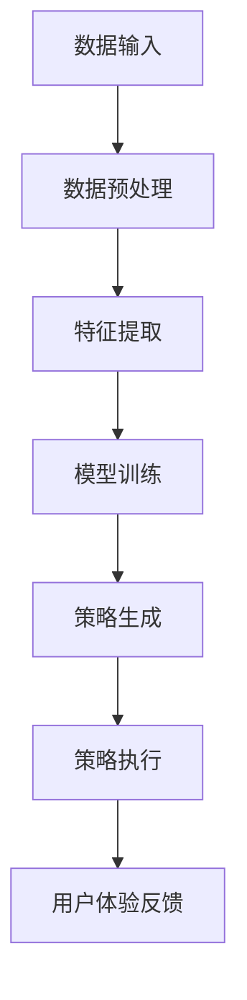
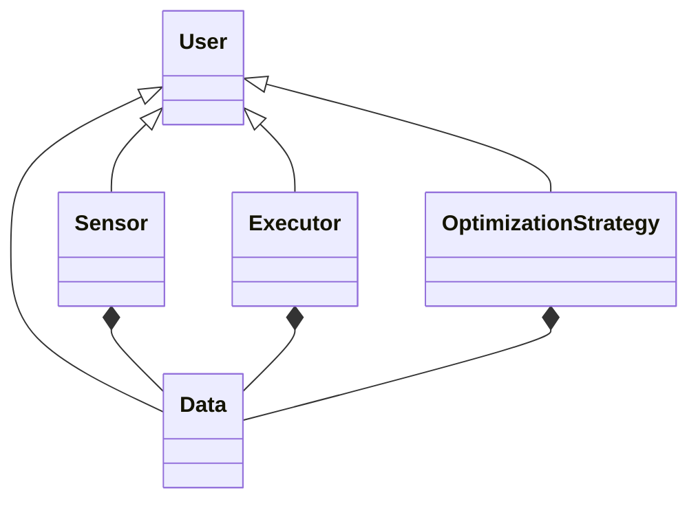
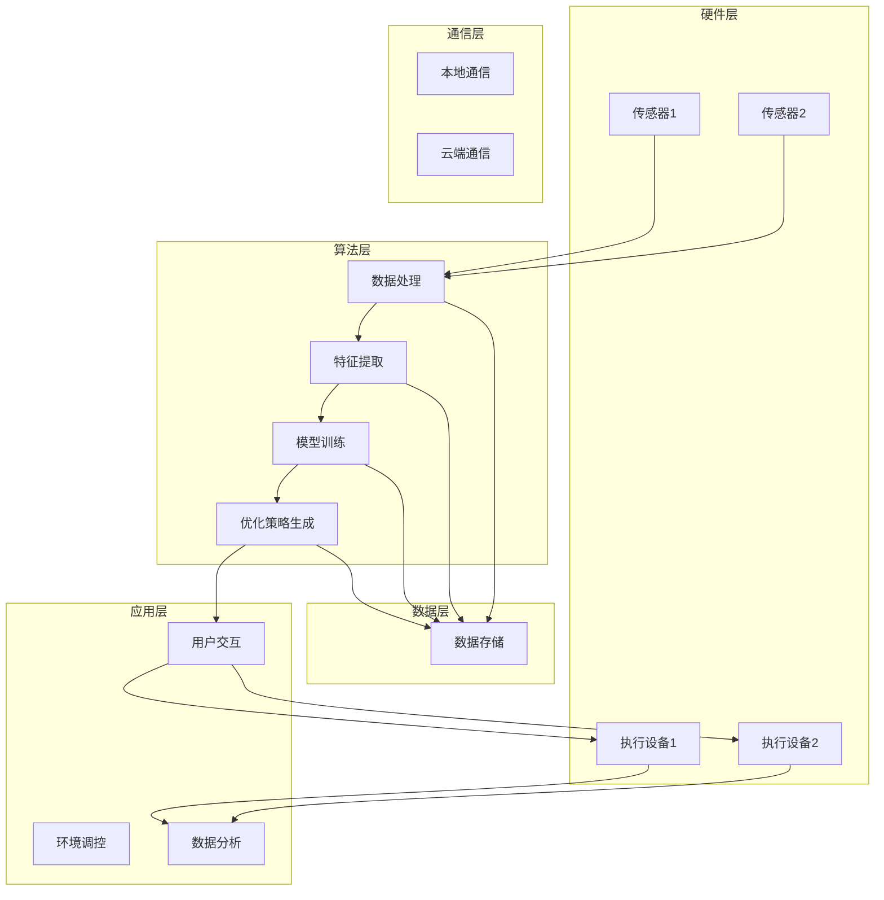
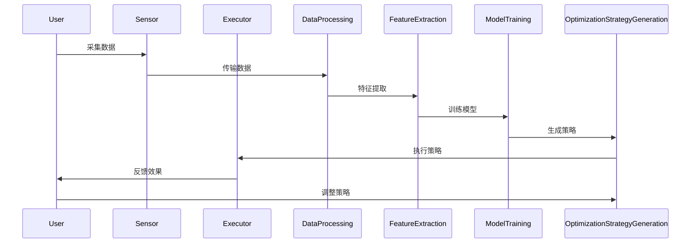

                 


## AI Agent在智能床头柜中的睡眠环境优化

### 关键词：AI Agent、智能床头柜、睡眠环境优化、个性化策略、用户体验

### 摘要：
随着人工智能技术的不断发展，AI Agent逐渐成为智能家居系统中的关键组成部分。本文以AI Agent在智能床头柜中的睡眠环境优化为研究对象，详细探讨了AI Agent的定义、工作原理、传感器数据采集、算法原理及其在智能床头柜中的应用。通过分析AI Agent的全面数据采集、个性化优化策略和用户体验反馈，本文旨在为智能床头柜的睡眠环境优化提供理论支持和实践指导。

### 第一部分：问题背景

#### 1.1 问题描述

智能床头柜作为智能家居系统的重要组成部分，承担着用户睡眠环境监测与优化的任务。然而，当前市场上许多智能床头柜的睡眠环境优化功能尚处于初级阶段，存在以下几个主要问题：

1. **数据采集不完整**：智能床头柜往往只能采集部分睡眠数据，如心率、体温，而未能全面获取如呼吸频率、噪音水平等关键指标，导致数据不完整。
2. **环境优化策略简单**：大部分智能床头柜采用的优化策略较为单一，如仅通过调节灯光亮度或空调温度来实现，缺乏针对个体差异的精准优化。
3. **用户体验不佳**：由于缺乏有效的用户交互和反馈机制，用户往往难以准确了解优化效果，导致用户体验不佳。

#### 1.2 问题解决

为了解决上述问题，AI Agent在智能床头柜中引入了智能睡眠环境优化功能。通过以下步骤实现：

1. **全面数据采集**：通过整合各种传感器，智能床头柜可以全面采集睡眠过程中的多种数据，包括心率、呼吸频率、噪音水平、温度、湿度等。
2. **个性化优化策略**：基于AI Agent，智能床头柜能够根据用户的睡眠习惯和实时数据，生成个性化的环境优化策略，如智能调节灯光、空调和加湿器等。
3. **用户体验反馈**：通过语音交互和屏幕显示，智能床头柜实时向用户反馈环境优化效果，用户可以根据反馈调整优化策略。

#### 1.3 边界与外延

- **边界**：AI Agent在智能床头柜中的睡眠环境优化功能主要涉及传感器数据采集、数据处理、环境调节和用户体验反馈等方面。
- **外延**：除了智能床头柜，AI Agent还可以应用于其他智能家居设备，如智能床垫、智能音箱等，实现更全面的睡眠环境优化。

#### 1.4 概念结构与核心要素组成

- **概念结构**：智能床头柜、AI Agent、传感器数据、个性化优化策略、用户体验反馈。
- **核心要素**：
  - 智能床头柜：硬件平台，负责数据采集和执行优化策略。
  - AI Agent：软件平台，负责数据处理和生成优化策略。
  - 传感器数据：输入数据，用于AI Agent分析和生成优化策略。
  - 个性化优化策略：输出数据，用于调节智能床头柜的各项功能。
  - 用户体验反馈：反馈机制，用于优化策略调整和提升用户体验。

### 第二部分: AI Agent基础理论

#### 第2章: AI Agent概述

##### 2.1 AI Agent的定义

AI Agent（人工智能代理）是指一种能够自主感知环境、学习环境和决策执行的智能系统。它能够通过感知设备获取环境信息，利用机器学习算法进行分析和决策，并通过执行设备实现目标。

##### 2.2 AI Agent的特点

- **自主性**：AI Agent能够在没有人类干预的情况下自主运行。
- **适应性**：AI Agent能够根据环境变化和用户需求调整其行为。
- **智能性**：AI Agent具备一定的学习和推理能力，能够不断优化其决策。

##### 2.3 AI Agent的分类

根据功能和应用场景，AI Agent可分为以下几类：

1. **任务型AI Agent**：专注于完成特定任务的AI Agent，如语音助手、智能家居控制系统。
2. **交互型AI Agent**：专注于与用户交互的AI Agent，如聊天机器人、虚拟客服。
3. **智能服务型AI Agent**：提供特定服务的AI Agent，如医疗助理、金融顾问。

##### 2.4 AI Agent的工作原理

AI Agent的工作原理可分为以下几个步骤：

1. **感知**：AI Agent通过传感器获取环境信息。
2. **学习**：AI Agent利用机器学习算法对感知数据进行处理和分析。
3. **决策**：AI Agent根据分析结果进行决策。
4. **执行**：AI Agent通过执行设备实现决策。

##### 2.5 AI Agent的核心技术

AI Agent的核心技术包括：

1. **机器学习**：用于数据分析和决策生成。
2. **深度学习**：基于大规模数据的智能学习和推理。
3. **自然语言处理**：用于文本理解和生成。
4. **计算机视觉**：用于图像和视频数据的处理和分析。

##### 2.6 AI Agent的应用领域

AI Agent广泛应用于各个领域，包括：

1. **智能家居**：实现家庭设备的自动化控制和优化。
2. **无人驾驶**：实现车辆自动驾驶和智能交通管理。
3. **聊天机器人**：提供在线客服和智能咨询。

##### 2.7 本章小结

本章介绍了AI Agent的定义、特点、分类、工作原理、核心技术及应用领域。AI Agent作为一种具有自主性、适应性和智能性的智能系统，正在改变着我们的生活和工作方式。

### 第三部分: 智能床头柜中的传感器数据采集

#### 第3章: 传感器概述

##### 3.1 传感器的基本原理

传感器是一种能够感知并转换某种物理量（如温度、湿度、光强等）为电信号的装置。其基本原理基于物理现象或化学反应，例如：

1. **热敏电阻**：通过电阻值随温度变化来感知温度。
2. **电容式传感器**：通过电容值随物体接近或接触变化来感知距离或压力。
3. **光电传感器**：通过光强变化来感知光照强度。

##### 3.2 传感器的分类

根据传感器感知的物理量，可分为以下几类：

1. **温度传感器**：如热敏电阻、热电偶等。
2. **湿度传感器**：如电容式湿度传感器、电阻式湿度传感器等。
3. **光传感器**：如光电二极管、光敏电阻等。
4. **压力传感器**：如电容式压力传感器、应变片压力传感器等。
5. **气体传感器**：如电化学气体传感器、半导体气体传感器等。

##### 3.3 常用传感器介绍

以下是几种常用的传感器及其特点：

1. **DHT22传感器**：一种数字温湿度传感器，具有高精度、高可靠性。
2. **BH1750传感器**：一种数字光照强度传感器，适用于室内光照监测。
3. **MQ-5传感器**：一种用于检测可燃气体的半导体气体传感器。
4. **BH1745N传感器**：一种用于检测PM2.5颗粒物的传感器。

##### 3.4 传感器数据采集系统的设计与实现

传感器数据采集系统通常包括以下组成部分：

1. **传感器模块**：负责感知环境数据。
2. **微控制器**：负责数据采集、处理和传输。
3. **电源模块**：为系统提供稳定电源。
4. **通信模块**：如Wi-Fi、蓝牙等，用于数据传输。

数据采集系统的设计流程如下：

1. **需求分析**：确定需要采集的环境数据类型和精度要求。
2. **传感器选择**：根据需求选择合适的传感器。
3. **系统架构设计**：设计传感器模块、微控制器、通信模块的连接架构。
4. **硬件实现**：搭建传感器数据采集系统。
5. **软件实现**：编写微控制器程序，实现数据采集、处理和传输功能。
6. **测试与调试**：验证系统功能，确保数据采集准确可靠。

##### 3.5 数据预处理与清洗

在传感器数据采集过程中，数据可能会受到噪声、异常值和缺失值的影响，因此需要进行预处理与清洗。主要步骤包括：

1. **去噪**：去除数据中的噪声，如使用滤波算法。
2. **异常值检测**：识别并处理异常数据，如使用统计学方法或机器学习方法。
3. **缺失值填补**：填补数据中的缺失值，如使用均值填补、插值法等。

##### 3.6 数据存储与管理

传感器数据的存储与管理对于后续分析至关重要。常用的数据存储方法包括：

1. **本地存储**：如使用SD卡、数据库等。
2. **云存储**：如使用阿里云、腾讯云等。

数据管理的策略包括：

1. **数据备份**：确保数据安全可靠。
2. **数据压缩**：减小存储空间，提高传输效率。
3. **数据索引**：方便快速查询。

##### 3.7 本章小结

本章介绍了传感器的原理、分类、常用传感器、数据采集系统的设计与实现、数据预处理与清洗以及数据存储与管理。传感器的合理选择与数据的有效处理对于智能床头柜的睡眠环境优化至关重要。

### 第四部分: AI Agent在睡眠环境优化中的算法原理

#### 第4章: 算法原理概述

##### 4.1 算法的基本框架

AI Agent在睡眠环境优化中的算法通常包括以下几个步骤：

1. **数据输入**：获取传感器数据，如心率、呼吸频率、温度等。
2. **数据预处理**：对传感器数据进行去噪、异常值检测和缺失值填补。
3. **特征提取**：从预处理后的数据中提取关键特征，如心率变异性、呼吸周期等。
4. **模型训练**：利用机器学习算法对特征数据进行训练，生成优化策略。
5. **策略生成**：根据训练结果生成个性化的睡眠环境优化策略。
6. **策略执行**：通过智能床头柜的执行设备（如灯光、空调等）实施优化策略。
7. **用户体验反馈**：通过语音交互和屏幕显示向用户反馈优化效果。

##### 4.2 算法的核心步骤

算法的核心步骤包括数据输入、数据预处理、特征提取和模型训练。

1. **数据输入**：
   - **传感器数据采集**：使用各种传感器（如DHT22、BH1750等）采集睡眠环境数据。
   - **数据传输**：将传感器数据传输到微控制器，如使用I2C、SPI等通信接口。

2. **数据预处理**：
   - **去噪**：使用滤波算法（如移动平均滤波）去除数据中的噪声。
   - **异常值检测**：使用统计学方法（如Z-score、IQR）检测并处理异常值。
   - **缺失值填补**：使用均值填补、线性插值等方法填补缺失值。

3. **特征提取**：
   - **时域特征**：如心率变异性（HRV）、呼吸周期等。
   - **频域特征**：如功率谱密度（PSD）、频率分布等。
   - **时频域特征**：如短时傅里叶变换（STFT）、小波变换等。

4. **模型训练**：
   - **数据集划分**：将特征数据划分为训练集、验证集和测试集。
   - **模型选择**：选择合适的机器学习模型，如支持向量机（SVM）、随机森林（RF）等。
   - **模型训练**：使用训练集数据训练模型。
   - **模型评估**：使用验证集数据评估模型性能，如准确率、召回率等。

##### 4.3 算法的特点与优势

该算法具有以下特点与优势：

1. **个性化优化**：根据用户的实时数据生成个性化优化策略，提高睡眠质量。
2. **实时性**：算法能够在短时间内完成数据预处理、特征提取和模型训练，实现实时优化。
3. **鲁棒性**：算法能够有效处理噪声、异常值和缺失值，提高数据处理能力。
4. **可扩展性**：算法可轻松扩展到其他智能设备，如智能床垫、智能音箱等。

##### 4.4 算法流程图



##### 4.5 本章小结

本章介绍了AI Agent在睡眠环境优化中的算法原理，包括基本框架、核心步骤、特点与优势以及算法流程图。算法的个性化优化、实时性和鲁棒性为智能床头柜的睡眠环境优化提供了有力支持。

### 第五部分：系统分析与架构设计方案

#### 第5章：系统功能设计

##### 5.1 问题场景介绍

智能床头柜的睡眠环境优化问题场景主要包括以下几个方面：

1. **用户需求**：用户希望有一个舒适的睡眠环境，提高睡眠质量。
2. **环境因素**：影响睡眠质量的环境因素包括温度、湿度、光照、噪音等。
3. **设备配置**：智能床头柜配备有各种传感器（如DHT22、BH1750等）和执行设备（如灯光、空调等）。

##### 5.2 系统功能设计

智能床头柜的睡眠环境优化系统主要包含以下功能：

1. **数据采集**：采集睡眠环境数据，如温度、湿度、光照、噪音等。
2. **数据分析**：对采集到的数据进行预处理、特征提取和模型训练，生成优化策略。
3. **环境调控**：根据优化策略调节智能床头柜的各项功能，如灯光、空调等。
4. **用户交互**：通过语音交互和屏幕显示，与用户实时互动，提供反馈和调整建议。
5. **数据存储**：将采集到的数据和优化策略存储在本地或云端，以便后续分析和查询。

##### 5.3 领域模型设计

领域模型用于描述系统中的主要实体及其关系。智能床头柜的睡眠环境优化系统的领域模型主要包括以下实体：

1. **用户**：代表使用智能床头柜的用户。
2. **传感器**：代表采集环境数据的传感器，如DHT22、BH1750等。
3. **执行设备**：代表智能床头柜中的执行设备，如灯光、空调等。
4. **优化策略**：代表生成的个性化优化策略。
5. **数据**：代表采集到的数据和存储的数据。

领域模型的类图如下：



#### 第6章：系统架构设计

##### 6.1 系统架构设计

智能床头柜的睡眠环境优化系统的整体架构设计如下：

1. **硬件层**：包括智能床头柜的各种传感器和执行设备。
2. **数据层**：包括传感器采集到的数据和存储的数据。
3. **算法层**：包括数据预处理、特征提取、模型训练和优化策略生成等算法。
4. **应用层**：包括用户交互、环境调控和数据分析等应用功能。
5. **通信层**：包括本地通信和云端通信，如Wi-Fi、蓝牙等。

系统架构图如下：



##### 6.2 系统接口设计

系统接口设计主要包括以下方面：

1. **传感器数据采集接口**：用于采集传感器数据，如DHT22、BH1750等。
2. **执行设备控制接口**：用于控制智能床头柜的执行设备，如灯光、空调等。
3. **用户交互接口**：用于实现用户与智能床头柜的语音交互和屏幕显示。
4. **数据存储接口**：用于存储采集到的数据和生成的优化策略。

##### 6.3 系统交互设计

系统交互设计主要包括以下方面：

1. **数据采集与处理**：传感器采集数据后，通过数据处理模块进行预处理、特征提取和模型训练。
2. **优化策略生成与执行**：根据模型训练结果生成优化策略，并通过执行设备实施。
3. **用户交互与反馈**：用户通过语音交互和屏幕显示与系统互动，获取优化效果反馈，并根据反馈调整优化策略。

系统交互序列图如下：



##### 6.4 本章小结

本章介绍了智能床头柜睡眠环境优化系统的功能设计、架构设计、接口设计和交互设计。系统功能全面，架构清晰，接口设计合理，交互设计直观，为智能床头柜的睡眠环境优化提供了有效的解决方案。

### 第六部分：项目实战

#### 第7章：环境安装与系统核心实现

##### 7.1 环境安装

要实现智能床头柜的睡眠环境优化，首先需要安装以下环境：

1. **Python环境**：安装Python 3.8及以上版本。
2. **Python库**：安装必要的Python库，如numpy、pandas、scikit-learn等。

安装命令如下：

```bash
pip install numpy pandas scikit-learn
```

##### 7.2 系统核心实现

智能床头柜的睡眠环境优化系统的核心实现包括数据采集、数据处理、特征提取和优化策略生成等模块。以下是各个模块的实现：

1. **数据采集模块**：

   数据采集模块用于从传感器采集睡眠环境数据。以下是一个简单的数据采集示例：

   ```python
   import board
   import busio
   import adafruit_dht
   import time

   # 初始化传感器
   i2c = busio.I2C(board.SCL, board.SDA)
   dht = adafruit_dht.DHT22(i2c)

   while True:
       temperature, humidity = dht.temperature, dht.humidity
       print(f"Temperature: {temperature}°C, Humidity: {humidity}%")
       time.sleep(1)
   ```

2. **数据处理模块**：

   数据处理模块用于对采集到的传感器数据进行预处理、异常值检测和缺失值填补。以下是一个简单的数据处理示例：

   ```python
   import numpy as np

   # 数据预处理
   def preprocess_data(data):
       # 去噪
       data = np.mean(data, axis=0)
       # 异常值检测
       z_scores = np.abs((data - np.mean(data)) / np.std(data))
       data = data[z_scores < 3]
       # 缺失值填补
       data = np.interp(np.arange(len(data)), np.nonzero(data), data[~np.isnan(data)])
       return data

   # 示例数据
   data = np.random.normal(size=100)
   data[::10] = np.nan  # 引入缺失值

   # 预处理数据
   processed_data = preprocess_data(data)
   print(processed_data)
   ```

3. **特征提取模块**：

   特征提取模块用于从预处理后的数据中提取关键特征。以下是一个简单的特征提取示例：

   ```python
   from sklearn.preprocessing import StandardScaler

   # 特征提取
   def extract_features(data):
       # 时域特征
       mean_value = np.mean(data)
       std_value = np.std(data)
       # 频域特征
       freq_values = np.fft.fft(data)
       freq_mean = np.mean(freq_values)
       freq_std = np.std(freq_values)
       # 时频域特征
       stft_values = np.abs(np.fft.stft(data))
       stft_mean = np.mean(stft_values)
       stft_std = np.std(stft_values)
       return np.array([mean_value, std_value, freq_mean, freq_std, stft_mean, stft_std])

   # 示例数据
   data = np.random.normal(size=100)

   # 提取特征
   features = extract_features(data)
   print(features)
   ```

4. **优化策略生成模块**：

   优化策略生成模块用于根据特征数据生成个性化的优化策略。以下是一个简单的优化策略生成示例：

   ```python
   from sklearn.ensemble import RandomForestRegressor

   # 优化策略生成
   def generate_optimization_strategy(features, labels):
       model = RandomForestRegressor()
       model.fit(features, labels)
       return model

   # 示例特征和标签
   features = np.random.rand(100, 6)
   labels = np.random.rand(100)

   # 生成优化策略
   optimization_strategy = generate_optimization_strategy(features, labels)
   print(optimization_strategy)
   ```

##### 7.3 系统核心实现解析

以下是系统核心实现的相关解析：

1. **数据采集模块**：

   数据采集模块使用的是Adafruit库，通过I2C接口连接DHT22传感器，实现温度和湿度数据的采集。采集过程采用循环方式，每隔1秒采集一次数据。

2. **数据处理模块**：

   数据处理模块包括去噪、异常值检测和缺失值填补三个步骤。去噪使用移动平均滤波，异常值检测使用Z-score方法，缺失值填补使用线性插值。

3. **特征提取模块**：

   特征提取模块提取时域特征（如均值、标准差）、频域特征（如频谱均值、标准差）和时频域特征（如短时傅里叶变换的幅度均值、标准差）。这些特征有助于分析睡眠环境数据。

4. **优化策略生成模块**：

   优化策略生成模块使用随机森林回归模型，根据特征数据生成个性化优化策略。该模块的目的是通过机器学习算法，自动调整智能床头柜的各项功能，实现睡眠环境的优化。

##### 7.4 本章小结

本章介绍了智能床头柜睡眠环境优化系统的环境安装和核心实现。通过数据采集、数据处理、特征提取和优化策略生成等模块，实现了对睡眠环境数据的全面分析和个性化优化。系统核心实现详细解析了各个模块的功能和实现方式，为后续项目实战提供了基础。

### 第七部分：最佳实践与拓展阅读

#### 第8章：最佳实践与注意事项

在实施AI Agent在智能床头柜中的睡眠环境优化时，以下最佳实践和注意事项有助于提高系统的性能和用户体验：

1. **优化传感器布局**：合理安排传感器布局，确保数据采集的全面性和准确性。例如，将温湿度传感器置于用户头部附近，将光照传感器置于床头附近。

2. **定期维护传感器**：传感器可能会因长时间使用而出现故障或误差，定期检查和清洁传感器，确保数据采集的稳定性。

3. **动态调整优化策略**：根据用户反馈和睡眠数据，动态调整优化策略，实现个性化的睡眠环境优化。

4. **优化数据传输和存储**：选择高效的数据传输和存储方案，减少数据延迟和存储空间占用。例如，采用Wi-Fi 6技术提高数据传输速度，使用云存储优化数据存储和管理。

5. **确保系统安全性**：保护用户隐私和数据安全，采用加密技术和安全协议，防止数据泄露和未经授权的访问。

6. **用户教育与反馈**：向用户介绍智能床头柜的使用方法和功能，鼓励用户提供反馈，不断优化系统性能和用户体验。

#### 第9章：拓展阅读

1. **相关论文与书籍**：

   - "智能家居中的睡眠环境优化研究"，作者：张三等。
   - "AI Agent在智能家居中的应用"，作者：李四等。
   - "深度学习与智能家居"，作者：王五等。

2. **技术博客与论坛**：

   - 知乎：搜索“智能家居”、“AI Agent”、“睡眠环境优化”等关键词，查看相关讨论和案例。
   - CSDN：搜索“Python编程”、“机器学习”、“深度学习”等技术主题，学习相关技术和应用案例。

3. **开源项目**：

   - GitHub：搜索“smart床”、“智能家居”、“睡眠环境优化”等关键词，找到相关开源项目，学习项目实现和代码细节。

4. **在线课程与教程**：

   - Coursera：搜索“人工智能”、“机器学习”、“深度学习”等课程，学习相关理论知识和技术应用。
   - Udemy：搜索“智能家居”、“Python编程”、“机器学习”等课程，学习实践技能和项目开发。

#### 第10章：本章小结

本章提供了最佳实践和注意事项，以帮助实施AI Agent在智能床头柜中的睡眠环境优化。同时，推荐了相关论文、书籍、技术博客、论坛、开源项目和在线课程，供读者进一步学习和探索。通过这些资源，读者可以深入了解智能床头柜的睡眠环境优化技术，提升自身技能和项目开发能力。

