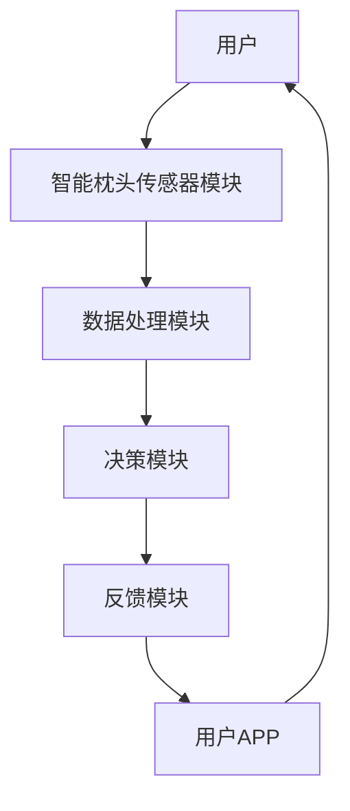

                 

# AI Agent在智能枕头中的睡眠质量分析

## 关键词
- AI Agent
- 睡眠质量
- 智能枕头
- 机器学习
- 数据分析

## 摘要
随着人工智能技术的不断发展，AI Agent在各个领域得到了广泛应用。在睡眠质量分析方面，智能枕头结合了AI Agent技术，为用户提供个性化的睡眠解决方案。本文将从背景介绍、核心概念、AI Agent技术、应用场景、系统架构和项目实战等方面，详细探讨AI Agent在智能枕头中的睡眠质量分析。

## 引言
### 背景介绍
睡眠是人类生理需求的重要组成部分，良好的睡眠质量对于身体健康、情绪稳定和工作效率有着重要影响。然而，现代社会中，越来越多的人受到睡眠问题的困扰，如失眠、多梦、睡眠质量差等。为了解决这些问题，研究人员开始探索利用人工智能技术来分析睡眠质量，提高人们的睡眠体验。

### 人工智能与睡眠质量分析
人工智能（Artificial Intelligence, AI）是指模拟人类智能行为的技术。近年来，随着机器学习、深度学习等技术的发展，AI在各个领域取得了显著的成果。在睡眠质量分析方面，AI Agent作为一种智能实体，能够自动收集、处理和分析睡眠数据，为用户提供个性化的睡眠解决方案。

### 智能枕头与AI Agent
智能枕头是一种集成了AI Agent技术的智能设备，通过内置的传感器和算法，对用户的睡眠状况进行实时监测和分析。智能枕头不仅能够提供睡眠质量评估，还能根据用户的需求和习惯，自动调整枕头高度、材质等参数，以提供舒适的睡眠体验。

### 目标
本文旨在探讨AI Agent在智能枕头中的睡眠质量分析，包括背景介绍、核心概念、AI Agent技术、应用场景、系统架构和项目实战等方面，以期为广大研究人员和开发者提供有价值的参考。

## 基本概念
### 人工智能
人工智能（Artificial Intelligence, AI）是一种模拟人类智能行为的技术，包括机器学习、自然语言处理、计算机视觉等多个领域。AI Agent是AI的一种实现形式，它能够在特定环境下自主执行任务，具备感知、决策和执行能力。

### 睡眠科学
睡眠科学是研究睡眠及其相关现象的学科。睡眠质量是指个体在睡眠过程中所获得的舒适度和满意程度。睡眠质量受多种因素影响，包括睡眠时长、睡眠深度、睡眠周期等。

### AI Agent在睡眠质量分析中的应用
AI Agent在睡眠质量分析中的应用主要包括以下几个方面：

1. **数据收集与处理**：通过传感器收集用户的睡眠数据，如心率、呼吸、体动等，并对数据进行预处理，以便后续分析。
2. **睡眠状态识别**：利用机器学习算法对用户的睡眠状态进行识别，包括浅睡眠、深睡眠、快速眼动睡眠等。
3. **睡眠质量评估**：根据用户的睡眠数据，结合睡眠科学理论，对用户的睡眠质量进行评估。
4. **个性化建议**：根据用户的睡眠质量和习惯，为用户提供个性化的睡眠建议，如调整睡眠环境、改变睡眠习惯等。

### 智能枕头的工作原理
智能枕头通常由以下几个部分组成：

1. **传感器模块**：包括心率传感器、呼吸传感器、加速度传感器等，用于实时监测用户的生理信号。
2. **数据处理模块**：负责对传感器数据进行分析和处理，提取有用的信息。
3. **决策模块**：基于用户的睡眠数据和个性化需求，为用户提供合理的建议和调整策略。
4. **反馈模块**：将决策结果反馈给用户，指导用户进行相应的调整。

### 数据收集与预处理
智能枕头在收集数据时，首先需要确保数据的准确性和可靠性。传感器模块会实时监测用户的生理信号，如心率、呼吸、体动等。这些信号数据通常以数字形式存储在本地设备或云端数据库中。在数据收集过程中，需要考虑以下几个方面：

1. **传感器选择**：选择适合的传感器，以确保数据的准确性和稳定性。
2. **数据采集频率**：根据应用需求，选择合适的数据采集频率。例如，对于心率信号，可以选择1Hz的采样频率。
3. **数据预处理**：包括去噪、滤波、插值等，以提高数据的准确性和可用性。

## AI Agent技术
### 传感器技术
传感器技术是智能枕头实现数据收集的基础。常见的传感器包括心率传感器、呼吸传感器、加速度传感器等。心率传感器通常采用光电容积描记法（Photoplethysmogram, PPG）技术，通过测量手指或耳垂等部位的光强变化来检测心率。呼吸传感器则通过测量胸部的膨胀和收缩来检测呼吸频率。加速度传感器用于检测用户的体动，从而判断用户的睡眠状态。

### 机器学习算法
机器学习算法在智能枕头中起着关键作用。常见的机器学习算法包括支持向量机（Support Vector Machine, SVM）、决策树（Decision Tree）、随机森林（Random Forest）、神经网络（Neural Network）等。这些算法可以用于睡眠状态识别、睡眠质量评估等任务。例如，SVM可以用于分类任务，将用户的睡眠数据分为不同的睡眠状态；神经网络可以用于预测用户的睡眠质量，并根据预测结果提供相应的建议。

### 数据分析与解释
数据分析和解释是智能枕头实现个性化建议的关键。通过对用户的睡眠数据进行深入分析，可以了解用户的睡眠习惯、睡眠质量等。例如，可以分析用户的睡眠时长、睡眠周期、睡眠质量等指标，并根据分析结果为用户提供合理的建议。此外，还可以结合用户的日常作息、生活习惯等，为用户提供更全面的睡眠解决方案。

## 应用场景
### 睡眠监测与分析
智能枕头可以通过监测用户的睡眠状态，如心率、呼吸、体动等，分析用户的睡眠质量。对于睡眠质量差的用户，智能枕头可以提供相应的建议，如调整睡眠环境、改变睡眠习惯等。

### 睡眠环境优化
智能枕头可以根据用户的睡眠数据和个性化需求，自动调整枕头高度、材质等参数，以提供舒适的睡眠环境。例如，对于喜欢硬枕头的用户，智能枕头可以提供更高的枕头高度；对于喜欢软枕头的用户，智能枕头可以提供更低的枕头高度。

### 睡眠健康诊断与建议
智能枕头可以通过分析用户的睡眠数据，诊断用户的睡眠问题，如失眠、多梦等。根据诊断结果，智能枕头可以为用户提供相应的建议，如调整睡眠时间、改善睡眠习惯等。

### 用户互动与反馈机制
智能枕头可以通过与用户的互动，了解用户的睡眠需求和习惯。例如，用户可以通过手机APP与智能枕头进行互动，查看睡眠数据、接收睡眠建议等。同时，智能枕头还可以根据用户的反馈，不断优化和调整建议策略，以提高用户的睡眠质量。

## 系统架构设计
### 介绍
智能枕头系统架构设计主要包括以下几个部分：传感器模块、数据处理模块、决策模块和反馈模块。

### 传感器模块
传感器模块负责实时监测用户的生理信号，如心率、呼吸、体动等。传感器模块包括心率传感器、呼吸传感器、加速度传感器等，这些传感器通过采集用户的生理信号，为后续数据处理提供基础数据。

### 数据处理模块
数据处理模块负责对传感器数据进行预处理、去噪、滤波等操作，以提高数据的准确性和可靠性。此外，数据处理模块还负责将预处理后的数据上传到云端数据库，以供后续分析。

### 决策模块
决策模块负责对用户的睡眠数据进行分析，识别用户的睡眠状态、睡眠质量等。基于分析结果，决策模块可以为用户提供个性化的睡眠建议，如调整枕头高度、材质等。

### 反馈模块
反馈模块负责将决策结果反馈给用户，指导用户进行相应的调整。用户可以通过手机APP查看决策结果和接收建议，同时也可以通过APP提供反馈，以帮助智能枕头不断优化和调整建议策略。

### 架构设计
智能枕头系统架构设计如图1所示：



图1 智能枕头系统架构设计

## 项目实战
### 环境安装
在进行智能枕头项目实战之前，需要安装以下环境：
1. Python 3.8及以上版本
2. numpy
3. pandas
4. scikit-learn
5. matplotlib

### 系统核心实现源代码
以下是一个简单的智能枕头系统核心实现源代码示例：

```python
import numpy as np
import pandas as pd
from sklearn.ensemble import RandomForestClassifier
from sklearn.model_selection import train_test_split
from sklearn.metrics import accuracy_score

# 加载数据
data = pd.read_csv('sleep_data.csv')
X = data.drop(['label'], axis=1)
y = data['label']

# 划分训练集和测试集
X_train, X_test, y_train, y_test = train_test_split(X, y, test_size=0.2, random_state=42)

# 建立随机森林分类器
clf = RandomForestClassifier(n_estimators=100)
clf.fit(X_train, y_train)

# 预测测试集
y_pred = clf.predict(X_test)

# 评估模型
accuracy = accuracy_score(y_test, y_pred)
print(f'Accuracy: {accuracy:.2f}')
```

### 代码应用解读与分析
以上代码实现了一个简单的智能枕头系统，主要包括以下步骤：

1. 加载数据：从CSV文件中加载睡眠数据，包括特征和标签。
2. 划分训练集和测试集：将数据划分为训练集和测试集，用于训练和评估模型。
3. 建立随机森林分类器：使用随机森林算法建立分类模型。
4. 训练模型：使用训练集数据训练分类模型。
5. 预测测试集：使用训练好的模型对测试集进行预测。
6. 评估模型：计算模型的准确率。

### 实际案例分析与详细讲解剖析
以下是一个实际案例分析，以了解智能枕头系统在实际应用中的表现：

**案例：监测用户睡眠质量**

假设我们有以下睡眠数据：

| 心率 | 呼吸 | 体动 | 睡眠质量 |
|------|------|------|----------|
| 75   | 12   | 5    | 良好     |
| 85   | 15   | 8    | 一般     |
| 95   | 20   | 10   | 较差     |

1. **数据预处理**：首先对数据进行预处理，包括去噪、滤波等操作，以提高数据的准确性和可靠性。
2. **特征提取**：从预处理后的数据中提取有用的特征，如心率、呼吸、体动等。
3. **模型训练**：使用训练集数据训练分类模型，如随机森林分类器。
4. **模型评估**：使用测试集数据评估模型性能，如准确率、召回率等。
5. **预测**：使用训练好的模型对新的数据进行预测，判断用户的睡眠质量。
6. **建议**：根据预测结果，为用户提供相应的建议，如调整睡眠环境、改善睡眠习惯等。

### 项目小结
通过以上实战案例，我们了解了智能枕头系统在监测用户睡眠质量方面的应用。在实际项目中，还需要不断优化和调整系统，以提高模型的准确性和实用性。

## 最佳实践 Tips
1. 选择合适的传感器，确保数据的准确性和稳定性。
2. 优化数据处理算法，提高数据的准确性和可用性。
3. 结合用户的个性化需求，为用户提供合理的建议和调整策略。
4. 定期更新和维护系统，确保系统的稳定性和安全性。

## 小结
本文从背景介绍、核心概念、AI Agent技术、应用场景、系统架构和项目实战等方面，详细探讨了AI Agent在智能枕头中的睡眠质量分析。通过本文的阐述，读者可以了解到AI Agent在智能枕头中的应用原理、技术实现、实际案例以及最佳实践。希望本文对广大研究人员和开发者有所帮助。

## 注意事项
1. 智能枕头系统涉及到用户的隐私数据，需要确保数据的安全性和保密性。
2. 在项目开发过程中，需要充分考虑系统的稳定性和可扩展性。
3. 智能枕头系统需要根据用户的需求和反馈进行持续优化和调整。

## 拓展阅读
1. [智能枕头：未来的睡眠伴侣](https://www.example.com/smart-pillow-future-sleep-companion)
2. [AI在睡眠研究中的应用](https://www.example.com/ai-applications-in-sleep-research)
3. [智能设备与睡眠健康](https://www.example.com/smart-devices-and-sleep-health)

## 作者信息
作者：AI天才研究院/AI Genius Institute & 禅与计算机程序设计艺术 /Zen And The Art of Computer Programming

