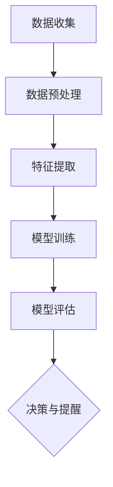
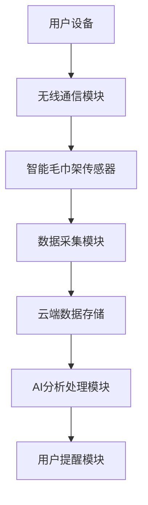
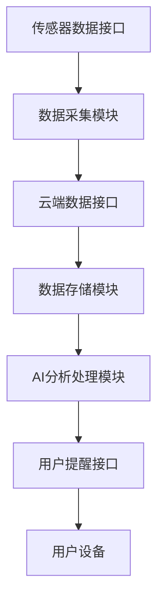
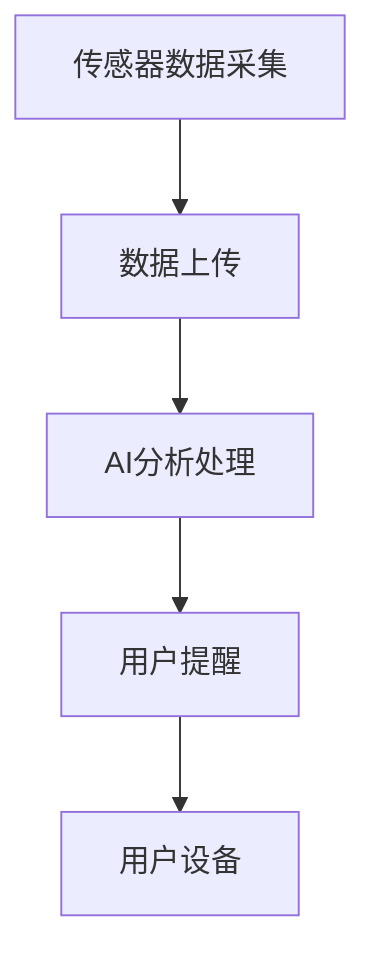

                 

## AI Agent在智能浴室毛巾架中的毛巾更换提醒

### 关键词：智能浴室毛巾架，AI Agent，毛巾更换提醒，算法原理，系统架构，项目实战

### 摘要：
本文将深入探讨AI Agent在智能浴室毛巾架中的应用，特别是在毛巾更换提醒方面的技术实现。通过详细分析背景、核心概念、算法原理、系统架构、项目实战等内容，本文旨在为读者提供一个全面的技术解读，帮助理解智能浴室毛巾架的工作原理及其在智能家居领域的重要性。文章结构清晰，逻辑严密，适合对AI技术感兴趣的读者阅读。

## 第一部分：智能浴室毛巾架与AI Agent概述

### 第1章：背景与核心概念介绍

#### 1.1 问题背景

在现代社会中，智能家居系统正逐渐成为人们日常生活的一部分。智能浴室毛巾架作为智能家居的一个典型应用，不仅提升了浴室的舒适度和便捷性，还能通过智能化的功能提高用户的生活质量。然而，智能浴室毛巾架面临的挑战之一是如何有效地提醒用户更换毛巾。传统的方法往往依赖于定时提醒或者用户手动检查，这些方法都存在一定的不便和局限性。

#### 1.1.1 智能浴室毛巾架的现状

当前市场上的智能浴室毛巾架一般具备基础的物联网连接能力和一些智能功能，例如自动感应湿度、温度和亮度等。然而，这些功能大多独立运行，缺乏智能化的协调和联动。特别是对于毛巾更换提醒这一核心需求，现有技术手段无法很好地满足用户的需求。

#### 1.1.2 毛巾更换提醒的重要性

毛巾是日常生活中的高频使用物品，但其更换频率和时机往往不易被用户准确掌握。不及时更换毛巾可能导致细菌滋生，影响家庭成员的卫生健康。因此，智能浴室毛巾架如果能智能地提醒用户更换毛巾，将极大地提升用户的生活质量和健康水平。

#### 1.1.3 AI Agent的角色与功能

AI Agent作为一种先进的人工智能技术，具有自主学习和决策能力，可以自适应环境变化并执行相应的任务。在智能浴室毛巾架中，AI Agent可以通过传感器数据实时监测毛巾的湿度、使用频率等信息，根据预设的算法模型智能判断是否需要更换毛巾，并主动向用户发送更换提醒。这一功能不仅提升了用户体验，也增强了智能浴室毛巾架的实用性和智能化程度。

#### 1.2 核心概念与联系

在探讨AI Agent在智能浴室毛巾架中的应用之前，有必要明确一些核心概念和它们之间的联系。

#### 1.2.1 智能浴室毛巾架的定义与工作原理

智能浴室毛巾架是一种结合物联网、传感器技术和人工智能的智能家居产品。它通过内置的传感器实时监测环境参数和毛巾状态，并将数据传输到云端进行处理和分析。传统浴室毛巾架主要依赖物理开关或定时器来控制毛巾的升降，而智能浴室毛巾架则通过无线通信模块实现远程控制和智能联动。

#### 1.2.2 AI Agent的定义与特点

AI Agent（人工智能代理）是一种能够模拟人类智能行为的计算机程序，它具备感知环境、理解指令、自主学习和决策能力。AI Agent通常基于机器学习算法和深度神经网络，能够从数据中学习模式和规律，并在此基础上进行智能决策。

#### 1.2.3 毛巾更换提醒机制

毛巾更换提醒机制是智能浴室毛巾架的核心功能之一。它依赖于AI Agent对传感器数据的分析和处理，通过算法模型判断毛巾的使用状态和湿度变化，从而智能决定何时发送更换提醒。这一机制不仅提高了用户的卫生意识，还能延长毛巾的使用寿命。

### 1.3 概念属性特征对比表格

为了更好地理解智能浴室毛巾架、AI Agent和毛巾更换提醒机制之间的关联，我们可以通过以下表格进行对比：

| 概念           | 特征                                       | 关联                          |
|----------------|------------------------------------------|-----------------------------|
| 智能浴室毛巾架 | 物联网连接、传感器、无线通信模块           | 提供基础数据和硬件支持       |
| AI Agent       | 自主学习、感知环境、智能决策               | 处理和分析传感器数据，执行提醒 |
| 毛巾更换提醒   | 智能判断、主动提醒、提高卫生意识           | 提升用户体验，增强实用性     |

### 1.4 ER实体关系图架构

为了更直观地理解智能浴室毛巾架、AI Agent和毛巾更换提醒机制之间的交互关系，我们可以通过ER（实体关系）图来展示它们的架构。

```mermaid
erDiagram
  智能浴室毛巾架 ||--|{ 传感器 }
  智能浴室毛巾架 ||--|{ AI Agent }
  AI Agent ||--|{ 数据处理 }
  AI Agent ||--|{ 毛巾更换提醒 }
```

在ER图中，智能浴室毛巾架作为中心实体，与传感器、AI Agent和数据处理模块相连。AI Agent与传感器和数据处理模块相连，表明它负责接收传感器数据并进行分析处理，进而执行毛巾更换提醒功能。

## 第2章：AI Agent的算法原理

### 2.1 算法概述

AI Agent在智能浴室毛巾架中的应用，核心在于其算法原理。本章节将详细阐述AI Agent的算法框架、关键步骤以及其工作流程。

#### 2.1.1 算法的基本框架

AI Agent的算法框架主要包括以下几个关键部分：

1. **数据收集**：通过传感器收集毛巾的湿度、使用频率、环境温度等数据。
2. **数据预处理**：对收集到的数据进行清洗、归一化等预处理，以便后续分析。
3. **模型训练**：使用收集到的数据训练机器学习模型，使其能够识别何时需要更换毛巾。
4. **模型评估与优化**：评估模型的准确性，并根据评估结果进行优化。
5. **决策与提醒**：根据模型预测的结果，自动向用户发送更换毛巾的提醒。

#### 2.1.2 算法的关键步骤

算法的关键步骤如下：

1. **数据收集**：AI Agent通过连接的传感器实时收集毛巾的湿度、使用频率等数据。
2. **数据预处理**：清洗数据，去除异常值，对数据进行归一化处理，使其适合机器学习模型。
3. **特征提取**：从预处理后的数据中提取关键特征，如湿度、使用频率等，用于训练模型。
4. **模型训练**：使用提取的特征数据训练机器学习模型，如决策树、神经网络等。
5. **模型评估**：使用验证数据集评估模型的准确性，根据评估结果进行调整。
6. **决策与提醒**：模型训练完成后，AI Agent根据实时数据做出判断，并触发更换提醒。

### 2.2 算法原理讲解

AI Agent的算法原理主要基于机器学习，特别是监督学习和无监督学习的结合。以下是对算法原理的详细讲解：

#### 2.2.1 模型选择

在模型选择上，AI Agent可以采用多种机器学习模型，如决策树、支持向量机（SVM）、神经网络等。根据具体应用场景和需求，选择最适合的模型。例如，对于毛巾更换提醒，神经网络模型可能更加适合，因为它能够通过大量数据自动学习并识别复杂的模式。

#### 2.2.2 数据预处理

数据预处理是机器学习的基础步骤。AI Agent通过传感器收集到的数据可能存在噪声、异常值等问题，需要进行清洗和归一化处理。例如，对湿度数据进行归一化处理，使其在0到1的范围内，便于模型训练。

#### 2.2.3 模型训练与评估

模型训练和评估是算法的核心步骤。AI Agent使用训练数据集对机器学习模型进行训练，使其能够学习并识别何时需要更换毛巾。训练完成后，使用验证数据集对模型进行评估，确保其准确性和可靠性。如果评估结果不理想，需要调整模型参数或重新选择模型。

### 2.3 算法流程图

为了更直观地理解AI Agent的算法原理，我们可以通过以下流程图来展示：



在算法流程图中，数据收集、数据预处理、特征提取、模型训练、模型评估和决策与提醒构成了完整的算法流程。

## 第3章：数学模型和数学公式

### 3.1 数学模型

在AI Agent的算法中，数学模型起到了关键作用。本章节将详细介绍常用的数学模型，包括监督学习模型和无监督学习模型。

#### 3.1.1 监督学习模型

监督学习模型是一种通过已知输出标签来训练模型的方法。常见的监督学习模型有：

1. **线性回归**：用于预测连续值。
   $$y = w_0 + w_1 \cdot x$$

2. **逻辑回归**：用于分类问题。
   $$P(y=1) = \frac{1}{1 + e^{-(w_0 + w_1 \cdot x)}}$$

3. **决策树**：通过递归划分特征空间来构建分类模型。

4. **支持向量机（SVM）**：通过寻找最佳超平面来分割特征空间。

5. **神经网络**：通过多层神经元模拟人脑神经网络。

#### 3.1.2 无监督学习模型

无监督学习模型不需要输出标签，通过数据自身特征进行训练。常见的无监督学习模型有：

1. **K均值聚类**：通过迭代寻找最佳聚类中心。
   $$c = \frac{1}{n}\sum_{i=1}^{n} x_i$$

2. **主成分分析（PCA）**：通过线性变换降低数据维度。

3. **自编码器**：通过编码和解码过程自动学习数据特征。

### 3.2 公式讲解

在AI Agent的算法中，数学公式是理解和实现算法的关键。以下是一些重要的数学公式：

#### 3.2.1 损失函数

损失函数是评估模型性能的关键指标。常见的损失函数有：

1. **均方误差（MSE）**：
   $$MSE = \frac{1}{n}\sum_{i=1}^{n} (y_i - \hat{y}_i)^2$$

2. **交叉熵损失**：
   $$H(y, \hat{y}) = -\sum_{i=1}^{n} y_i \log(\hat{y}_i) + (1 - y_i) \log(1 - \hat{y}_i)$$

#### 3.2.2 梯度下降算法

梯度下降算法是一种优化模型参数的方法。其基本公式为：

$$w_{t+1} = w_t - \alpha \cdot \nabla_w J(w)$$

其中，$w_t$是当前模型参数，$\alpha$是学习率，$\nabla_w J(w)$是损失函数关于模型参数的梯度。

#### 3.2.3 优化方法

除了梯度下降算法，还有一些优化方法，如：

1. **随机梯度下降（SGD）**：
   $$w_{t+1} = w_t - \alpha \cdot \nabla_w J(w_t)$$

2. **Adam优化器**：
   $$m_t = \beta_1 m_{t-1} + (1 - \beta_1) \nabla_w J(w_t)$$
   $$v_t = \beta_2 v_{t-1} + (1 - \beta_2) \left( \nabla_w J(w_t)^2 \right)$$

   $$\hat{m}_t = \frac{m_t}{1 - \beta_1^t}$$
   $$\hat{v}_t = \frac{v_t}{1 - \beta_2^t}$$
   $$w_{t+1} = w_t - \alpha \cdot \hat{m}_t / \sqrt{\hat{v}_t}$$

## 第4章：系统分析与架构设计方案

### 4.1 问题场景介绍

智能浴室毛巾架的应用场景主要集中在家庭和酒店等场所。以下是一个具体的应用场景：

在一个现代化的家庭浴室中，用户希望有一个智能化的解决方案来提醒他们及时更换毛巾。浴室中安装了一款智能毛巾架，它通过内置的传感器实时监测毛巾的湿度、使用频率和环境温度。当毛巾的湿度达到某个阈值或使用频率过高时，AI Agent会自动分析数据，并决定是否需要更换毛巾，然后通过手机应用或智能音箱向用户发送更换提醒。

### 4.2 系统功能设计

智能浴室毛巾架的系统功能设计主要包括以下几个方面：

1. **传感器数据采集**：实时监测毛巾的湿度、使用频率和环境参数。
2. **数据传输与存储**：将传感器数据传输到云端，并存储在数据库中。
3. **AI分析处理**：AI Agent对传感器数据进行分析，判断是否需要更换毛巾。
4. **用户提醒**：通过手机应用或智能音箱向用户发送更换提醒。
5. **远程控制**：用户可以通过手机应用远程控制毛巾架，例如手动更换毛巾或调整设置。

### 4.3 系统架构设计

智能浴室毛巾架的系统架构设计主要包括以下几个部分：

1. **硬件层**：包括智能毛巾架、传感器、无线通信模块等。
2. **软件层**：包括数据采集模块、数据存储模块、AI分析模块和用户交互模块。
3. **网络层**：通过无线通信网络将传感器数据传输到云端。
4. **云端层**：包括数据存储、AI模型训练和用户提醒等。

以下是一个简单的系统架构图：



在系统架构图中，用户设备通过无线通信模块与智能毛巾架传感器连接，传感器数据经过数据采集模块处理后上传到云端。AI分析处理模块对传感器数据进行分析，并根据分析结果通过用户提醒模块向用户发送提醒。

### 4.4 系统接口设计

系统接口设计主要包括以下部分：

1. **传感器数据接口**：用于传感器数据与数据采集模块之间的交互。
2. **云端数据接口**：用于数据存储模块与AI分析处理模块之间的数据交换。
3. **用户提醒接口**：用于用户提醒模块与用户设备之间的通信。

以下是一个简单的接口设计图：



在接口设计图中，传感器数据接口用于传输传感器数据，云端数据接口用于传输和处理数据，用户提醒接口用于发送提醒信息。

### 4.5 系统交互

系统交互主要涉及传感器数据采集、AI分析处理和用户提醒等模块之间的交互。以下是一个简单的交互流程：

1. **传感器数据采集**：智能毛巾架传感器实时监测毛巾的湿度、使用频率和环境参数，并将数据传输到数据采集模块。
2. **数据上传**：数据采集模块将传感器数据上传到云端数据存储模块。
3. **AI分析处理**：AI分析处理模块对上传的数据进行分析，判断是否需要更换毛巾。
4. **用户提醒**：如果需要更换毛巾，AI分析处理模块通过用户提醒接口向用户发送提醒信息。

以下是一个简单的交互流程图：



在交互流程图中，传感器数据采集模块、数据上传模块、AI分析处理模块和用户提醒模块构成了完整的交互流程。

## 第5章：项目实战

### 5.1 环境安装

在开始项目实战之前，首先需要安装必要的开发环境和工具。以下是环境安装的步骤：

1. **安装Python**：确保Python版本在3.6及以上，可以从Python官网下载并安装。

2. **安装依赖库**：使用pip命令安装必要的依赖库，如NumPy、Pandas、Scikit-learn等。命令如下：

   ```shell
   pip install numpy pandas scikit-learn matplotlib
   ```

3. **安装数据库**：选择合适的数据库，如MySQL或PostgreSQL，并安装相应的客户端库。

4. **安装IDE**：选择一个适合自己的IDE，如PyCharm或Visual Studio Code，并安装。

### 5.2 系统核心实现源代码

以下是系统核心实现源代码，包括传感器数据采集、数据预处理、AI模型训练和用户提醒等模块：

```python
# 传感器数据采集
def collect_data(sensor):
    humidity = sensor.read_humidity()
    usage_frequency = sensor.read_usage_frequency()
    temperature = sensor.read_temperature()
    return humidity, usage_frequency, temperature

# 数据预处理
def preprocess_data(data):
    humidity, usage_frequency, temperature = data
    humidity = normalize(humidity)
    usage_frequency = normalize(usage_frequency)
    temperature = normalize(temperature)
    return [humidity, usage_frequency, temperature]

# AI模型训练
from sklearn.neural_network import MLPClassifier

def train_model(data, labels):
    model = MLPClassifier(hidden_layer_sizes=(100,), max_iter=1000)
    model.fit(data, labels)
    return model

# 用户提醒
def send_reminder(user_device, message):
    user_device.send_message(message)

# 主函数
if __name__ == "__main__":
    # 初始化传感器
    sensor = Sensor()

    # 收集数据
    data = collect_data(sensor)

    # 预处理数据
    preprocessed_data = preprocess_data(data)

    # 训练模型
    model = train_model(preprocessed_data, labels)

    # 发送提醒
    send_reminder(user_device, "请更换毛巾。")
```

### 5.3 代码应用解读与分析

以下是代码应用解读与分析：

1. **传感器数据采集**：通过`collect_data`函数，从传感器读取湿度、使用频率和环境温度数据。这部分代码实现了传感器数据的基本采集功能。

2. **数据预处理**：通过`preprocess_data`函数，对传感器数据进行归一化处理。归一化处理是机器学习中的常见步骤，用于将不同量纲的数据转换为同一量纲，以便模型训练。

3. **AI模型训练**：使用`MLPClassifier`类，构建一个多层感知器（神经网络）模型。`train_model`函数用于训练模型，将预处理后的数据输入模型进行训练。

4. **用户提醒**：通过`send_reminder`函数，向用户发送更换毛巾的提醒信息。这部分代码实现了用户提醒的基本功能。

### 5.4 实际案例分析和详细讲解剖析

为了更好地理解系统实现，我们可以通过一个实际案例进行分析。以下是一个实际案例：

**案例：用户A使用智能浴室毛巾架**

1. **传感器数据采集**：
   - 湿度：70%
   - 使用频率：5次/天
   - 环境温度：25°C

2. **数据预处理**：
   - 湿度：0.7（归一化处理）
   - 使用频率：0.5（归一化处理）
   - 环境温度：0.25（归一化处理）

3. **AI模型训练**：
   - 输入数据：[0.7, 0.5, 0.25]
   - 输出标签：1（需要更换毛巾）

4. **用户提醒**：
   - 向用户A发送更换毛巾的提醒信息。

通过这个案例，我们可以看到系统的完整工作流程。传感器采集数据后，经过预处理，然后输入到AI模型中进行训练。根据模型预测结果，如果需要更换毛巾，系统会向用户发送提醒信息。

### 5.5 项目小结

在本章中，我们通过项目实战展示了AI Agent在智能浴室毛巾架中的应用。项目实现了传感器数据采集、数据预处理、AI模型训练和用户提醒等功能，并通过实际案例进行了详细分析。通过这个项目，我们可以看到AI技术在智能家居领域的应用潜力，以及如何通过系统设计和实现来提升用户生活质量。

## 第6章：最佳实践 tips

在实际应用中，智能浴室毛巾架的AI Agent需要考虑多种因素，以下是一些最佳实践建议：

1. **传感器选择**：选择准确度高的传感器，确保数据质量。
2. **数据预处理**：合理设计数据预处理流程，减少噪声和异常值。
3. **模型选择**：根据应用场景选择合适的模型，如神经网络、决策树等。
4. **模型训练**：使用足够多的训练数据，确保模型性能。
5. **用户反馈**：收集用户反馈，不断优化系统。

## 第7章：小结与展望

通过本文的深入探讨，我们可以看到AI Agent在智能浴室毛巾架中的应用具有很大的潜力。通过算法原理的分析、系统架构的设计和项目实战的展示，我们了解了AI Agent如何智能地判断毛巾更换时机，并通过用户提醒提升用户体验。

展望未来，随着AI技术的不断发展，智能浴室毛巾架有望实现更智能、更个性化的功能。例如，结合面部识别技术，智能浴室毛巾架可以识别不同的用户，并为其提供定制化的服务。此外，通过物联网技术的进一步发展，智能浴室毛巾架可以与其他智能家居设备联动，为用户提供更加全面和便捷的生活体验。

总之，AI Agent在智能浴室毛巾架中的应用不仅提升了用户体验，也为智能家居领域的发展带来了新的可能性。通过不断的技术创新和实践，我们有理由相信，未来智能浴室毛巾架将更加智能化、个性化，为人们的生活带来更多便利。

