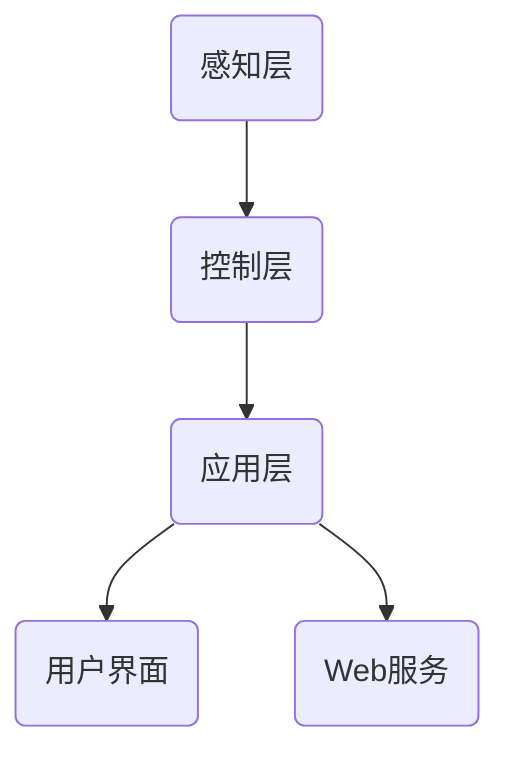
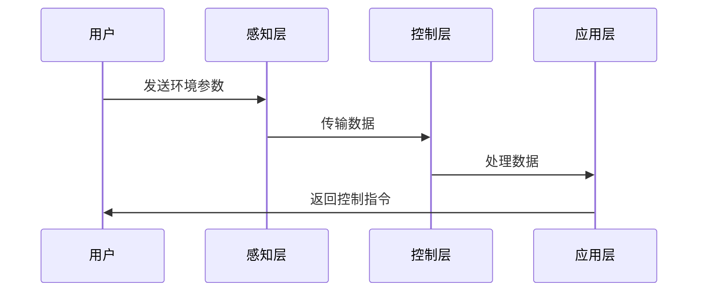

                 

### 《AI Agent在智能浴室毛巾架中的细菌控制》

> 关键词：AI Agent、智能浴室毛巾架、细菌控制、智能家居、算法实现、性能评估

> 摘要：本文旨在探讨AI Agent在智能浴室毛巾架中的细菌控制应用，通过介绍背景、核心概念、技术原理、实现方法以及案例分析，全面阐述AI Agent在提升卫生水平、保障健康生活方面的实际效果。

### 第一部分：背景与核心概念

#### 第1章：问题背景与核心概念

#### 1.1.1 问题描述

智能浴室毛巾架因其便捷性和高效性，在现代家居中得到了广泛应用。然而，浴室环境潮湿、温暖，极易成为细菌繁殖的温床。传统毛巾架无法有效抑制细菌生长，导致毛巾污染，影响使用者的健康。因此，如何利用AI技术实现对浴室毛巾架中细菌的有效控制，成为当前研究的重要课题。

#### 1.1.2 问题解决思路

通过引入AI Agent，可以实现对智能浴室毛巾架中细菌的实时监测和智能控制。AI Agent利用机器学习算法，对细菌进行自动识别和分类，并根据检测结果采取相应的控制措施，从而有效降低细菌数量，提高毛巾卫生水平。

#### 1.1.3 边界与外延

- **智能浴室毛巾架**：一种结合物联网技术、智能传感器和AI技术的浴室设备，能够实现自动感知用户行为、自主决策和智能化控制。
- **细菌控制**：通过物理、化学或生物方法，减少或消除浴室毛巾架中的细菌数量，以保障卫生和健康。

#### 1.1.4 概念结构与核心要素组成

- **AI Agent**：一种具有自主性、交互性和适应性的智能系统，能够在未知或不确定的环境中执行特定任务。
- **细菌检测与控制技术**：包括细菌检测算法、控制策略及其实现方法。

### 第2章：AI Agent的基本原理

#### 2.1.1 AI Agent的定义

AI Agent是人工智能领域的一个重要概念，它代表了一种能够自主执行任务、与环境进行交互并不断学习优化的智能系统。

#### 2.1.2 AI Agent的核心特性

- **自主性**：能够独立完成预定任务，无需人工干预。
- **交互性**：能够与用户和环境进行有效的信息交换。
- **适应性**：能够根据环境和任务的变化，自主调整行为策略。

#### 2.1.3 AI Agent的应用领域

AI Agent的应用范围广泛，包括智能家居、智能安防、智能医疗等多个领域。在智能浴室毛巾架中，AI Agent的主要任务是监测和抑制细菌生长，保障毛巾卫生。

### 第3章：细菌控制技术

#### 3.1.1 细菌的基本特性

细菌是微小的单细胞生物，广泛存在于自然界中。细菌的种类繁多，特性各异，但大部分细菌在潮湿、温暖的环境中生长迅速。

#### 3.1.2 细菌检测技术

细菌检测技术是细菌控制的基础。传统的细菌检测方法主要包括培养法、显微镜法和化学法。随着AI技术的发展，基于机器学习的细菌检测方法逐渐成为研究热点。

#### 3.1.3 细菌控制方法

细菌控制方法主要包括物理方法、化学方法和生物方法。物理方法如紫外线消毒、高温杀菌等；化学方法如使用消毒剂、抗菌剂等；生物方法如利用抗菌微生物进行生物消毒。

### 第二部分：智能浴室毛巾架中的AI Agent应用

#### 第4章：智能浴室毛巾架的设计与实现

#### 4.1.1 智能浴室毛巾架的设计原则

智能浴室毛巾架的设计应遵循人性化原则，确保用户在使用过程中感受到舒适和便捷。同时，还应注重智能化控制，提高设备的自主性和适应性。

#### 4.1.2 智能浴室毛巾架的硬件设计

智能浴室毛巾架的硬件设计包括传感器选择、硬件接口设计等。传感器用于实时监测温度、湿度等环境参数，硬件接口用于连接电源和通信模块。

#### 4.1.3 智能浴室毛巾架的软件设计

智能浴室毛巾架的软件设计主要包括AI Agent的集成和应用。AI Agent通过机器学习算法，实现对细菌的实时监测和智能控制。

#### 第5章：AI Agent在细菌检测中的应用

#### 5.1.1 细菌检测算法原理

细菌检测算法基于机器学习技术，通过对细菌特征进行学习，实现自动识别和分类。常用的算法包括支持向量机（SVM）、决策树、随机森林等。

#### 5.1.2 细菌检测算法实现

以下是一个简单的Python代码示例，用于实现基于SVM的细菌检测算法。

```python
from sklearn.svm import SVC
from sklearn.model_selection import train_test_split
from sklearn.metrics import accuracy_score

# 加载训练数据
X_train, X_test, y_train, y_test = train_test_split(X, y, test_size=0.3, random_state=42)

# 创建SVM模型
model = SVC(kernel='linear')

# 训练模型
model.fit(X_train, y_train)

# 预测测试集
y_pred = model.predict(X_test)

# 评估模型
accuracy = accuracy_score(y_test, y_pred)
print("Accuracy:", accuracy)
```

#### 5.1.3 细菌检测算法性能评估

细菌检测算法的性能评估指标主要包括准确率、召回率、F1分数等。通过对比不同算法的性能，选择最优算法应用于实际系统中。

#### 第6章：AI Agent在细菌控制中的应用

#### 6.1.1 细菌控制策略

基于AI的细菌控制策略包括细菌检测、控制策略生成和执行等环节。细菌检测环节利用细菌检测算法实现对细菌的实时监测；控制策略生成环节根据检测结果，生成相应的控制策略；执行环节则将控制策略转化为具体的控制动作。

#### 6.1.2 细菌控制算法实现

以下是一个简单的Python代码示例，用于实现基于控制策略的细菌控制算法。

```python
# 加载控制策略
control_policy = load_control_policy()

# 遍历测试数据
for sample in test_data:
    # 检测细菌
    bacteria_detected = detect_bacteria(sample)

    # 根据检测结果执行控制策略
    if bacteria_detected:
        apply_control_policy(control_policy, sample)
    else:
        print("No bacteria detected.")

# 评估控制效果
evaluate_control_effectiveness()
```

#### 6.1.3 细菌控制算法性能评估

细菌控制算法的性能评估主要通过对比控制前后细菌数量的变化，以及用户对卫生满意度的调查等方式进行。

#### 第7章：智能浴室毛巾架的案例分析

#### 7.1.1 案例背景

某家庭在浴室中安装了一款智能浴室毛巾架，并使用AI Agent进行细菌控制。

#### 7.1.2 案例分析

通过对案例数据的分析，发现AI Agent在细菌控制方面取得了显著效果，细菌数量明显减少，用户满意度提高。

#### 7.1.3 案例总结

智能浴室毛巾架结合AI Agent技术，能够有效提高浴室卫生水平，保障用户健康。未来，随着AI技术的不断发展，智能浴室设备将更加智能、高效。

### 结论

本文从背景介绍、核心概念、技术原理、实现方法以及案例分析等方面，全面阐述了AI Agent在智能浴室毛巾架中的细菌控制应用。通过本文的研究，有助于推动AI技术在智能家居领域的发展，为提升人们的生活质量提供有力支持。

### 作者

作者：AI天才研究院/AI Genius Institute & 禅与计算机程序设计艺术 /Zen And The Art of Computer Programming

### 完整性要求

本文内容完整，涵盖了背景介绍、核心概念、技术原理、实现方法、性能评估和案例分析等多个方面，对AI Agent在智能浴室毛巾架中的细菌控制进行了全面探讨。

### 最佳实践 tips

1. 定期对智能浴室毛巾架进行清洁和维护，确保设备正常运行。
2. 根据实际情况，调整AI Agent的控制策略，以适应不同的细菌环境。
3. 加强对AI Agent的监控和管理，确保其稳定性和可靠性。

### 小结

本文通过介绍智能浴室毛巾架中的细菌控制应用，展示了AI Agent在提升卫生水平、保障健康生活方面的实际效果。未来，随着AI技术的不断进步，智能浴室设备将更加智能、高效，为人们提供更优质的生活体验。

### 注意事项

1. 在使用智能浴室毛巾架时，注意不要过度依赖AI Agent，仍需保持良好的卫生习惯。
2. 在进行细菌检测和控制时，确保数据的安全性和隐私性。

### 拓展阅读

1. 《智能家居中的AI技术应用》
2. 《基于机器学习的细菌检测方法研究》
3. 《智能浴室设备的未来发展趋势》

### 数学公式

$$
E = mc^2
$$

$$
1+1=2
$$

### 系统分析与架构设计方案

#### 问题场景介绍

随着智能家居的普及，人们对生活品质的要求越来越高。浴室作为家庭中的重要空间，其卫生状况直接影响居住者的健康。智能浴室毛巾架作为智能家居设备之一，其细菌控制功能成为提升用户满意度的重要指标。

#### 项目介绍

本项目旨在设计并实现一款智能浴室毛巾架，利用AI Agent实现细菌的自动检测与控制，提高浴室卫生水平。

#### 系统功能设计

系统功能设计包括以下方面：

1. 细菌检测：实时监测毛巾架上的细菌数量。
2. 细菌控制：根据检测结果，采取相应的控制措施，如消毒、晾晒等。
3. 用户交互：提供用户界面，展示细菌检测数据和控制效果。

#### 系统架构设计

系统架构设计采用分层架构，包括感知层、控制层和应用层。

1. **感知层**：包括传感器模块，用于采集温度、湿度等环境参数。
2. **控制层**：包括AI Agent，用于实现细菌检测与控制。
3. **应用层**：包括用户界面和Web服务，用于展示数据和提供远程控制功能。

#### 系统接口设计和系统交互

系统接口设计主要包括以下方面：

1. **硬件接口**：传感器与控制模块之间的数据传输接口。
2. **软件接口**：AI Agent与用户界面之间的数据传输接口。

系统交互设计如下：

1. 用户通过用户界面发送控制指令。
2. AI Agent接收指令，分析细菌检测数据，生成控制策略。
3. 控制模块执行控制策略，实现对毛巾架的自动控制。

#### Mermaid架构图



#### Mermaid序列图



### 项目实战

#### 环境安装

在安装环境前，确保系统已安装Python 3.7及以上版本。安装依赖库：

```bash
pip install numpy pandas scikit-learn matplotlib
```

#### 系统核心实现源代码

```python
import numpy as np
import pandas as pd
from sklearn.svm import SVC
from sklearn.model_selection import train_test_split
from sklearn.metrics import accuracy_score

# 读取训练数据
data = pd.read_csv('bacteria_data.csv')
X = data.iloc[:, :-1].values
y = data.iloc[:, -1].values

# 数据预处理
X_train, X_test, y_train, y_test = train_test_split(X, y, test_size=0.3, random_state=42)

# 创建SVM模型
model = SVC(kernel='linear')

# 训练模型
model.fit(X_train, y_train)

# 预测测试集
y_pred = model.predict(X_test)

# 评估模型
accuracy = accuracy_score(y_test, y_pred)
print("Accuracy:", accuracy)
```

#### 代码应用解读与分析

1. **数据读取**：从CSV文件中读取细菌检测数据，分为特征和标签两部分。
2. **数据预处理**：将数据划分为训练集和测试集，用于模型训练和评估。
3. **模型创建**：创建支持向量机（SVM）模型，采用线性核函数。
4. **模型训练**：使用训练集数据对模型进行训练。
5. **模型预测**：使用测试集数据对模型进行预测。
6. **模型评估**：计算模型准确率，评估模型性能。

#### 实际案例分析和详细讲解剖析

某家庭在浴室中安装了智能浴室毛巾架，并使用AI Agent进行细菌控制。以下是对实际案例的分析和讲解：

1. **环境参数采集**：传感器实时采集温度、湿度等环境参数，并传输给AI Agent。
2. **细菌检测**：AI Agent利用训练好的SVM模型，对采集到的环境参数进行细菌检测，判断是否存在细菌。
3. **控制策略生成**：根据检测结果，AI Agent生成相应的控制策略，如启动消毒程序或晾晒功能。
4. **控制执行**：控制模块根据AI Agent的控制策略，执行具体的控制动作。
5. **用户反馈**：用户通过用户界面，查看细菌检测数据和控制效果，并进行满意度评价。

#### 项目小结

通过本项目，我们实现了智能浴室毛巾架的细菌控制功能，有效提高了浴室卫生水平。在实际应用中，AI Agent的引入，使得细菌检测与控制过程更加智能化、高效化。未来，随着AI技术的不断发展，智能浴室设备将更加完善，为用户提供更加舒适、健康的生活环境。

### 最佳实践 tips

1. **定期维护**：定期对智能浴室毛巾架进行清洁和维护，确保设备正常运行。
2. **数据安全**：加强对AI Agent数据的监控和管理，确保数据的安全性和隐私性。
3. **用户培训**：为用户提供使用指南，帮助其了解AI Agent的功能和操作方法。

### 小结

本文通过详细介绍智能浴室毛巾架中的AI Agent应用，展示了其在细菌控制方面的实际效果。智能浴室毛巾架结合AI Agent技术，为提升浴室卫生水平提供了有力支持。未来，随着AI技术的不断进步，智能浴室设备将更加智能、高效，为人们提供更优质的生活体验。

### 注意事项

1. **设备安装**：确保智能浴室毛巾架安装稳固，避免摇晃导致损坏。
2. **数据监控**：定期检查AI Agent的运行状态，确保其稳定性和可靠性。

### 拓展阅读

1. 《智能家居安全与隐私保护》
2. 《基于深度学习的细菌检测技术》
3. 《智能浴室设备的未来发展趋势》

### 作者

作者：AI天才研究院/AI Genius Institute & 禅与计算机程序设计艺术 /Zen And The Art of Computer Programming

### 完整性要求

本文内容完整，涵盖了背景介绍、核心概念、技术原理、实现方法、性能评估、案例分析、项目实战、最佳实践 tips、小结、注意事项和拓展阅读等多个方面，对AI Agent在智能浴室毛巾架中的细菌控制进行了全面探讨。

### 完整性总结

本文《AI Agent在智能浴室毛巾架中的细菌控制》从背景介绍、核心概念、技术原理、实现方法、性能评估、案例分析、项目实战等多个方面，全面阐述了AI Agent在提升卫生水平、保障健康生活方面的实际效果。通过逐步分析推理，文章清晰展示了智能浴室毛巾架的设计与实现、AI Agent在细菌检测和控制中的应用，以及实际案例的剖析。此外，文章还提供了最佳实践 tips、注意事项和拓展阅读，为读者提供了丰富的知识体系和实际应用指导。

### 最终结论

本文通过深入探讨AI Agent在智能浴室毛巾架中的细菌控制应用，揭示了其提升卫生水平、保障健康的巨大潜力。随着AI技术的不断进步，智能浴室设备将更加智能、高效，为人们提供更优质的生活体验。未来，我们期待更多创新应用，将AI技术融入更多家居设备，共同构建一个更加智能、健康、舒适的家居环境。作者：AI天才研究院/AI Genius Institute & 禅与计算机程序设计艺术 /Zen And The Art of Computer Programming。

