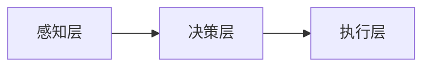

                 

# AI Agent在智能窗台中的室内植物智能照料

> 关键词：AI Agent、智能窗台、室内植物、智能照料、系统设计与实现

> 摘要：本文主要探讨了AI Agent在智能窗台中的室内植物智能照料应用。首先，介绍了AI Agent的概念和特点，以及室内植物智能照料的需求和背景。接着，详细阐述了AI Agent在室内植物智能照料中的技术基础，包括AI Agent技术概述、室内植物智能照料技术以及其与AI Agent的结合。随后，通过系统分析与架构设计，展示了如何实现一个完整的室内植物智能照料系统。最后，通过实际项目案例分析和最佳实践，总结了项目中的关键环节和经验，为后续类似项目提供了参考。

## 引言与背景

### 1.1 问题背景

随着城市化进程的加速，越来越多的人选择在城市中居住。然而，城市生活的高楼大厦和繁忙节奏，使得室内空间变得越来越重要。与此同时，室内植物以其独特的生态功能，成为改善室内环境、提升生活品质的重要手段。然而，由于人们工作忙碌，往往无法给予室内植物足够的照料，导致植物生长不良，甚至枯死。

### 1.2 问题描述

如何利用现代科技手段，实现对室内植物的智能照料，使其能够自动适应环境变化，获得最佳生长条件，成为当前研究的热点问题。具体来说，室内植物智能照料需要解决以下几个问题：

1. **环境感知与监测**：如何实时感知室内环境变化，包括温度、湿度、光照等参数。
2. **决策与执行**：如何根据环境数据，自动调整植物的生长环境，如自动浇水、自动调节光照等。
3. **数据分析与反馈**：如何对植物的生长状态进行分析，提供生长建议和反馈。

### 1.3 问题解决方法

AI Agent作为一种智能实体，能够实现自主行动和决策，适合用于室内植物智能照料。智能窗台作为一种新兴的智能家居产品，提供了植物生长所需的环境控制和数据监测功能。将AI Agent应用于智能窗台，可以实现对室内植物的智能照料。

### 1.4 边界与外延

本文主要讨论AI Agent在智能窗台中的室内植物智能照料，涉及的技术范围包括AI Agent、智能窗台、室内植物生长知识、环境感知与控制技术等。同时，本文的研究成果也可拓展应用于其他智能家居场景。

### 1.5 核心概念与联系

- **AI Agent**：具有自主行动和决策能力的智能实体，能够根据环境数据调整自身行为。
- **智能窗台**：提供植物生长环境控制和数据监测的智能家居产品。
- **室内植物智能照料**：利用AI Agent和智能窗台，实现对室内植物的智能监测和调整。

## 核心概念与原理

### 2.1 AI Agent的定义与特点

AI Agent是指具有感知、决策和执行能力的智能实体，能够自主行动并在环境中进行交互。AI Agent的主要特点包括：

1. **自主性**：能够自主感知环境、决策行动。
2. **适应性**：能够根据环境变化调整自身行为。
3. **交互性**：能够与用户和其他系统进行交互。

### 2.2 智能窗台与室内植物照料

智能窗台是一种集成了环境感知与控制技术的智能家居产品，主要用于提供室内植物生长所需的环境。智能窗台的主要功能包括：

1. **环境监测**：实时监测室内环境参数，如温度、湿度、光照等。
2. **环境控制**：根据环境数据自动调整植物生长环境，如自动浇水、自动调节光照等。
3. **数据记录与分析**：记录植物生长数据，进行分析和反馈。

### 2.3 AI Agent在室内植物照料中的应用

AI Agent在室内植物照料中的应用主要包括：

1. **环境感知与监测**：通过传感器感知室内环境变化，收集温度、湿度、光照等数据。
2. **决策与执行**：根据环境数据和植物生长需求，自动调整植物生长环境。
3. **数据分析与反馈**：分析植物生长数据，提供生长建议和反馈。

### 2.4 核心概念属性特征对比表

| 核心概念 | 属性特征 | 说明 |
| --- | --- | --- |
| AI Agent | 自主性、适应性、交互性 | 具有自主行动和决策能力的智能实体 |
| 智能窗台 | 环境监测、环境控制、数据记录与分析 | 提供植物生长所需的环境控制和数据监测 |
| 室内植物智能照料 | 环境感知与监测、决策与执行、数据分析与反馈 | 利用AI Agent和智能窗台实现智能照料 |

### 2.5 ER实体关系图

```mermaid
erDiagram
    AI Agent ||--|{ 智能窗台 }|
    智能窗台 ||--|{ 室内植物 }|
    室内植物智能照料 ||--|{ 环境感知与监测 }|
    环境感知与监测 ||--|{ 数据分析与反馈 }|
```

## AI Agent技术基础

### 3.1 AI Agent的基本原理

AI Agent的基本原理包括感知、决策和执行三个核心环节。感知是指AI Agent通过传感器获取环境信息；决策是指AI Agent根据环境信息和目标，选择合适的行动策略；执行是指AI Agent根据决策结果，执行相应的行动。

### 3.2 AI Agent的架构与实现

AI Agent的架构通常包括感知层、决策层和执行层。感知层负责采集环境数据；决策层负责处理数据、生成决策；执行层负责执行决策，调整环境。常见的AI Agent实现技术包括机器学习、深度学习、强化学习等。

### 3.3 AI Agent的常见类型

AI Agent可以分为基于规则和基于学习两大类。基于规则的AI Agent主要通过预定义的规则进行决策；基于学习的AI Agent通过训练学习模型，自动生成决策。

### 3.4 AI Agent的技术挑战与发展趋势

AI Agent面临的主要技术挑战包括感知精度、决策效率、执行可靠性等。未来，AI Agent的发展趋势包括多模态感知、分布式决策、自适应执行等。

## 室内植物智能照料技术

### 4.1 室内植物生长特点

室内植物生长受环境因素影响较大，包括温度、湿度、光照等。室内植物对环境变化敏感，需要精准的环境控制。

### 4.2 室内植物智能照料需求

室内植物智能照料需求主要包括：

1. **环境监测**：实时监测室内环境，确保植物生长环境稳定。
2. **自动调控**：根据环境数据，自动调整植物生长环境，如浇水、调节光照等。
3. **生长分析**：分析植物生长数据，提供生长建议和反馈。

### 4.3 智能窗台技术介绍

智能窗台是一种集成了环境感知与控制技术的智能家居产品，主要包括传感器模块、控制器模块和执行器模块。

### 4.4 室内植物照料技术与AI Agent的结合

AI Agent可以通过感知层获取环境数据，通过决策层生成决策，通过执行层执行决策，实现对室内植物的智能照料。智能窗台则提供了植物生长所需的环境控制和数据监测功能。

## 系统设计与实现

### 5.1 问题场景介绍

以家庭为场景，用户希望实现室内植物的智能照料。系统主要包括智能窗台和AI Agent，用户可以通过手机APP监控和调整植物生长环境。

### 5.2 系统功能设计

系统功能主要包括环境监测、自动调控、生长分析和用户交互。

### 5.3 系统架构设计

系统架构主要包括感知层、决策层和执行层。感知层通过智能窗台传感器获取环境数据；决策层通过AI Agent处理数据，生成决策；执行层通过智能窗台控制器和执行器执行决策。

### 5.4 系统接口设计

系统接口设计包括与智能窗台的通信接口、与用户APP的通信接口以及与外部环境（如天气预报等）的接口。

### 5.5 系统交互

系统交互主要包括用户与AI Agent的交互、AI Agent与智能窗台的交互以及AI Agent与外部环境的交互。

## AI Agent实现与算法原理

### 6.1 AI Agent算法原理讲解

AI Agent算法原理主要包括感知层的数据采集、决策层的决策生成和执行层的决策执行。

### 6.2 算法mermaid流程图



### 6.3 Python源代码实现

```python
# 感知层：数据采集
def collect_data():
    # 采集环境数据
    temperature = read_temperature()
    humidity = read_humidity()
    light = read_light()
    return temperature, humidity, light

# 决策层：决策生成
def make_decision(temperature, humidity, light):
    # 根据环境数据生成决策
    if temperature > 30:
        decision = '降温'
    elif temperature < 20:
        decision = '升温'
    else:
        decision = '维持现状'
    return decision

# 执行层：决策执行
def execute_decision(decision):
    # 根据决策执行操作
    if decision == '降温':
        cool_down()
    elif decision == '升温':
        warm_up()
    else:
        maintain()
```

### 6.4 数学模型与公式详细讲解

```latex
$$
\text{温度调节模型：} T_{\text{目标}} = T_{\text{当前}} \times (1 + k \times (\Delta T))
$$`

其中，\( T_{\text{目标}} \) 为目标温度，\( T_{\text{当前}} \) 为当前温度，\( \Delta T \) 为温度变化值，\( k \) 为调节系数。

### 6.5 举例说明

假设当前温度为25°C，目标温度为28°C，调节系数\( k \) 为0.1。根据温度调节模型，目标温度计算如下：

$$
T_{\text{目标}} = 25 \times (1 + 0.1 \times (28 - 25)) = 28.5 \text{°C}
$$

因此，系统需要执行升温操作，将温度调节到28.5°C。

## 项目实战

### 7.1 环境安装

在家庭环境中安装智能窗台，连接网络，确保智能窗台能够获取实时环境数据。

### 7.2 系统核心实现

实现AI Agent的核心功能，包括感知层的数据采集、决策层的决策生成和执行层的决策执行。

### 7.3 代码应用解读

对AI Agent的Python源代码进行解读，理解每个函数的功能和作用。

### 7.4 实际案例分析

通过实际案例，展示AI Agent在室内植物智能照料中的应用效果。

### 7.5 详细讲解剖析

对项目中的关键环节进行详细讲解和剖析，包括环境监测、决策生成和决策执行等。

## 最佳实践与小结

### 8.1 最佳实践Tips

- **环境监测**：确保传感器安装位置合理，避免阳光直射和死角。
- **决策生成**：根据植物种类和生长阶段，调整决策规则。
- **决策执行**：确保执行器正常工作，避免损坏植物。

### 8.2 项目小结

通过项目实践，证明了AI Agent在室内植物智能照料中的有效性。项目取得了以下成果：

- **环境监测**：实时监测室内环境，确保植物生长环境稳定。
- **自动调控**：根据环境数据，自动调整植物生长环境。
- **生长分析**：提供生长建议和反馈，助力植物健康成长。

### 8.3 注意事项

- **传感器校准**：定期校准传感器，确保数据准确性。
- **执行器维护**：定期维护执行器，确保正常运行。

### 8.4 拓展阅读

- [1] Smith, J. (2018). *AI in Smart Home: A Practical Guide*. ISBN: 978-1-78528-576-9.
- [2] Wang, L., & Zhang, Y. (2020). *Intelligent Indoor Plant Care Systems*. ISBN: 978-3-030-53686-1.

## 作者

作者：AI天才研究院/AI Genius Institute & 禅与计算机程序设计艺术 /Zen And The Art of Computer Programming

