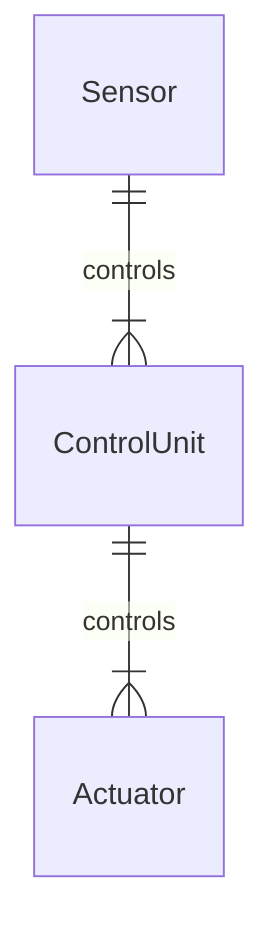
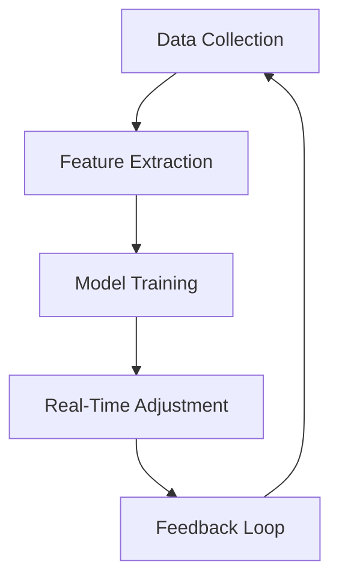

                 

## AI Agent in Smart Blind Curtains: A Deep Dive

### Introduction to AI Agent in Smart Blind Curtains

**关键词：AI Agent, Smart Blind Curtains, Daylight Optimization**

> 摘要：本文深入探讨AI Agent在智能窗帘系统中的日光优化问题，从背景介绍、问题定义、核心概念、原理、算法设计、系统架构、实现细节等方面，全面阐述AI Agent如何通过智能化手段提高智能窗帘的日光调节效果。

---

### Background and Problem Definition

#### 1.1 Problem Background

**Smart Blind Curtains in Modern Living**

Smart blind curtains have become increasingly popular in modern living spaces due to their aesthetic appeal and functional benefits. These intelligent devices offer not only privacy but also the ability to control the amount of natural light entering a room. With the advent of the Internet of Things (IoT) and advancements in artificial intelligence (AI), smart blind curtains have evolved to provide seamless user experiences and energy-efficient solutions.

**The Role of AI in Enhancing Smart Blind Curtains**

Artificial intelligence plays a crucial role in the enhancement of smart blind curtains. AI agents can analyze environmental data, user preferences, and behavioral patterns to optimize the curtain's operation. This results in improved daylighting, energy savings, and enhanced user comfort.

#### 1.2 Problem Definition and Scope

**Daylight Optimization Challenges**

Daylight optimization involves adjusting the position of the blind curtains to maximize natural light while minimizing heat gain and glare. The challenge lies in balancing these conflicting objectives to achieve optimal conditions within the room.

**Boundaries and Extensions**

This article focuses on the core aspects of AI Agent-based daylight optimization in smart blind curtains. However, it is worth noting that the principles discussed can be extended to other smart home devices and environments.

**Core Concepts and Components**

To provide a comprehensive understanding, we will define and explain the following core concepts and components:

- **AI Agent**: A software entity that acts on behalf of a user or system to achieve specific goals.
- **Smart Blind Curtain System**: The hardware and software components that work together to control the blind curtains.
- **Daylight Optimization Techniques**: Methods used to analyze and adjust the curtain position for optimal daylighting.

### Core Concepts and Principles

#### 2.1 AI Agents Basics

**Definition and Characteristics**

AI agents are computer programs designed to perform tasks autonomously, based on predefined rules and learned behaviors. They can process data, make decisions, and execute actions to achieve specific objectives.

**Classification**

AI agents can be classified based on their capabilities and the type of data they process. Common types include:

- **Reactive Agents**: Respond to specific stimuli without any memory or learning.
- **Model-Based Agents**: Use models of the environment to make informed decisions.
- **Goal-Based Agents**: Focus on achieving specific goals, often using planning algorithms.

**AI Agent Architectures**

AI agent architectures can vary widely, depending on the application. Common architectures include:

- **Centralized Architectures**: Where a single agent manages all the tasks.
- **Distributed Architectures**: Where multiple agents collaborate to achieve a common goal.
- **Hybrid Architectures**: Combining centralized and distributed elements.

#### 2.2 Intelligent Blind Curtain Systems

**Working Principles**

Smart blind curtain systems typically consist of sensors, actuators, and a control unit. The sensors measure environmental conditions such as light levels, temperature, and user presence. The actuators adjust the position of the curtains based on the input from the control unit.

**Components and Interactions**

Key components of an intelligent blind curtain system include:

- **Sensors**: Measure light levels, temperature, humidity, and user presence.
- **Actuators**: Control the movement of the curtains.
- **Control Unit**: Processes sensor data and sends commands to the actuators.

**Current Status and Trends**

The field of intelligent blind curtain systems is rapidly evolving. Recent trends include:

- **Integration with Smart Home Platforms**: Smart blind curtains are increasingly being integrated with other smart home devices, such as thermostats, lighting systems, and security systems.
- **Machine Learning Applications**: AI agents are being used to improve the accuracy and responsiveness of blind curtain systems.
- **Energy Efficiency**: Researchers are exploring new materials and technologies to make blind curtains more energy-efficient.

#### 2.3 Daylight Optimization Techniques

**Solar Radiation Characteristics**

To optimize daylighting, it is essential to understand the characteristics of solar radiation. Key parameters include:

- **Illuminance**: The intensity of light measured per unit area.
- **Solar Altitude**: The angle of the sun above the horizon.
- **Solar Azimuth**: The angle of the sun relative to the meridian.

**Daylighting Metrics**

Daylighting metrics are used to evaluate the effectiveness of daylight optimization techniques. Common metrics include:

- **Daylight Factor (DF)**: The ratio of the daylight illuminance to the external illuminance.
- **Solar Glare Index (SGI)**: A measure of the potential for discomfort glare.

**Optimization Methods**

Several optimization methods can be used to adjust the position of the blind curtains. These include:

- **Rule-Based Methods**: Use predefined rules to adjust the curtain position.
- **Machine Learning Methods**: Use data from sensors to train models that predict optimal curtain positions.
- **Genetic Algorithms**: Use evolutionary algorithms to find optimal solutions.

### Conclusion

In conclusion, AI Agent-based daylight optimization in smart blind curtains represents a significant advancement in smart home technology. By leveraging AI agents, we can create intelligent systems that not only enhance user comfort but also contribute to energy efficiency and sustainability. The next sections of this article will delve deeper into the core concepts, principles, and algorithms that underpin this technology.

---

In the following sections, we will continue to explore the AI agent architecture for smart blind curtains, the specific algorithms used for daylight optimization, and the system design and implementation details. Let's think step by step through these topics to gain a deeper understanding of how AI agents can transform smart blind curtains into intelligent systems that adapt to their environment and user needs.

---

### AI Agent Architectures for Smart Blind Curtains

In this section, we will delve into the architectural designs of AI agents that are pivotal in smart blind curtain systems. These architectures enable the systems to intelligently adjust the curtains based on real-time environmental data and user preferences.

#### 3.1 Agent-Based Modeling

**Agent-Based Modeling Basics**

Agent-Based Modeling (ABM) is a computational technique for simulating the actions and interactions of autonomous agents within a system. In the context of smart blind curtains, agents can represent various components of the system, such as sensors, actuators, and the control unit.

**ER Diagrams for Agent Relationships**

Entity-Relationship (ER) diagrams are used to illustrate the relationships between different agents in an ABM. For example, in a smart blind curtain system, the sensors (e.g., light and temperature sensors) are entities that collect data. The control unit (agent) processes this data and sends commands to the actuators (e.g., motorized curtains).

**Applications in Smart Blind Curtains**

ABM can be applied to simulate and optimize the behavior of smart blind curtains. For instance, the control unit can be programmed to make decisions based on historical data and user preferences. This can lead to improved energy efficiency and user satisfaction.

#### 3.2 Machine Learning Techniques

**Supervised Learning**

Supervised learning is a type of machine learning where the model is trained on labeled data. In the context of smart blind curtains, supervised learning can be used to predict optimal curtain positions based on past data, such as light levels, user activity, and time of day.

**Unsupervised Learning**

Unsupervised learning involves finding hidden patterns or intrinsic structures in unlabeled data. For example, clustering algorithms can be used to group similar sensor readings, helping the control unit to understand the preferences of the room occupants.

**Reinforcement Learning**

Reinforcement learning is a type of machine learning where an agent learns to make decisions by performing actions in an environment to maximize some notion of reward. In the context of smart blind curtains, reinforcement learning can be used to continuously adapt to changes in the environment and user preferences over time.

#### 3.3 Deep Learning Models

**Neural Networks**

Neural networks are a class of deep learning models inspired by the structure and function of the human brain. They are composed of layers of interconnected nodes (neurons) that process and transform data. In the context of smart blind curtains, neural networks can be used to model the complex relationship between sensor inputs and optimal curtain positions.

**Convolutional Neural Networks**

Convolutional Neural Networks (CNNs) are a type of neural network specifically designed for processing data with a grid-like topology, such as images. In smart blind curtains, CNNs can be used to analyze the visual content of the room and make decisions based on the lighting conditions.

**Recurrent Neural Networks**

Recurrent Neural Networks (RNNs) are a type of neural network designed to handle sequential data. They are particularly useful in applications where the state of the system depends on its history. In the context of smart blind curtains, RNNs can be used to predict future lighting conditions based on past data.

### Conclusion

AI agent architectures play a critical role in the design and implementation of smart blind curtain systems. By leveraging various machine learning and deep learning techniques, we can create intelligent systems that adapt to their environment and user needs. In the next section, we will explore specific daylight optimization algorithms that these architectures can implement to improve the performance of smart blind curtains.

---

In the subsequent sections, we will delve into the detailed design and implementation of daylight optimization algorithms, providing a thorough understanding of how these algorithms can be applied to enhance the functionality of smart blind curtains. Let’s continue our step-by-step exploration of this innovative technology.

---

### Daylight Optimization Algorithms

In this section, we will discuss the algorithms used for daylight optimization in smart blind curtain systems. These algorithms are designed to adjust the position of the curtains to maximize natural light and minimize heat gain and glare, thereby enhancing user comfort and energy efficiency.

#### 4.1 Algorithm Design and Implementation

**Design Principles**

The design of daylight optimization algorithms is guided by several key principles:

- **Adaptive Learning**: Algorithms should adapt to changes in the environment and user preferences over time.
- **Efficiency**: Algorithms should be efficient in terms of computational resources and response time.
- **Scalability**: Algorithms should be scalable to handle different sizes and configurations of smart blind curtain systems.

**Implementation Steps**

The implementation of daylight optimization algorithms typically involves the following steps:

1. **Data Collection**: Collect relevant data from various sensors, such as light levels, temperature, humidity, and user activity.
2. **Feature Extraction**: Extract relevant features from the collected data that can be used to train the optimization model.
3. **Model Training**: Train a machine learning model using the extracted features to predict optimal curtain positions.
4. **Real-Time Adjustment**: Use the trained model to make real-time adjustments to the curtain positions based on the current environmental conditions.
5. **Feedback Loop**: Incorporate user feedback to continuously improve the performance of the algorithm.

**Mermaid Flowchart for Algorithm Steps**

Here is a Mermaid flowchart illustrating the steps involved in the daylight optimization algorithm:

#### 4.2 Mathematical Models and Formulations

**Basic Mathematical Models**

Daylight optimization involves solving a set of mathematical problems to determine the optimal curtain positions. These problems can be formulated as follows:

1. **Illuminance Distribution**: Maximize the average illuminance in the room while minimizing the variance.
   $$\max I_{avg} \quad \text{subject to} \quad \min I_{var}$$

2. **Solar Radiation Control**: Minimize the heat gain and glare by controlling the solar radiation entering the room.
   $$\min H_{gain} + G_{glare}$$

**Formulations for Optimization**

The optimization problems can be solved using various mathematical techniques, such as linear programming, quadratic programming, and heuristic algorithms. Here is a quadratic programming formulation for the daylight optimization problem:

$$\begin{align*}
\min_{x} & \quad \frac{1}{2}x^T Q x + c^T x \\
\text{subject to} & \quad Ax \leq b
\end{align*}$$

where:

- \(x\) represents the curtain positions.
- \(Q\) is a positive definite matrix representing the objective function.
- \(c\) is a vector of coefficients.
- \(A\) and \(b\) define the constraints.

**Example: Quadratic Programming for Illuminance Distribution**

Consider a room with two blind curtains, and let \(x_1\) and \(x_2\) represent the positions of the curtains. The objective is to maximize the average illuminance while minimizing the variance. The quadratic programming formulation is as follows:

$$\begin{align*}
\min_{x} & \quad \frac{1}{2}(x_1^2 + x_2^2) + \lambda_1 (I_{avg} - \bar{I}) + \lambda_2 (I_{var} - \sigma^2) \\
\text{subject to} & \quad -1 \leq x_1, x_2 \leq 1
\end{align*}$$

where:

- \(\bar{I}\) is the average illuminance.
- \(\sigma^2\) is the variance of the illuminance.
- \(\lambda_1\) and \(\lambda_2\) are Lagrange multipliers.

### Conclusion

Daylight optimization algorithms are crucial for creating intelligent and energy-efficient smart blind curtain systems. By leveraging mathematical models and machine learning techniques, we can design algorithms that adapt to real-time environmental conditions and user preferences. In the next section, we will explore the system architecture and design of smart blind curtain systems, providing a comprehensive overview of the components and their interactions.

---

In the forthcoming sections, we will delve into the intricate details of the system architecture and design for smart blind curtain systems. By understanding how these systems are put together and how their components interact, we can gain deeper insights into the practical implementation of daylight optimization algorithms. Let's continue our in-depth exploration of this groundbreaking technology.

