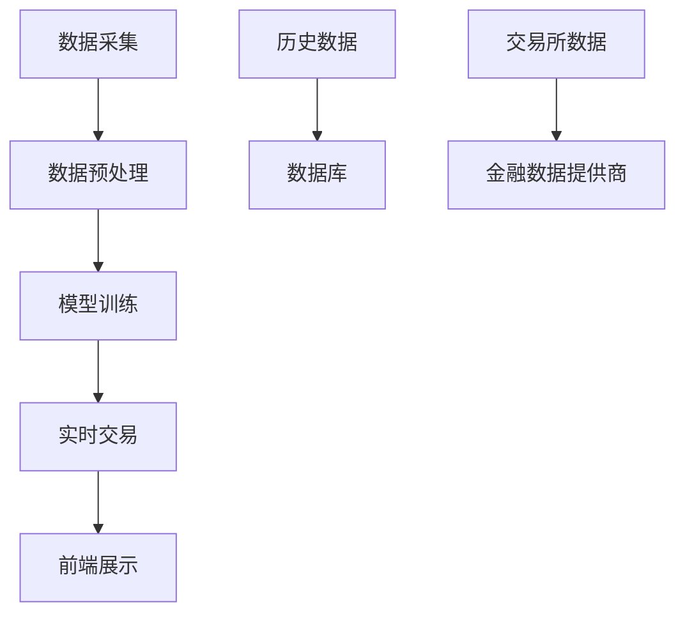
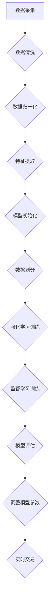

                 

### 《AI Agent在智能股票交易中的应用》

关键词：智能股票交易、AI Agent、强化学习、监督学习、混合学习策略

摘要：随着人工智能技术的快速发展，AI Agent在智能股票交易中的应用逐渐引起了广泛关注。本文旨在深入探讨AI Agent在智能股票交易中的具体应用，包括其基本概念、算法原理、系统架构和实战案例。通过逐步分析，本文旨在为读者提供一幅全面的智能股票交易与AI Agent融合的蓝图，并探讨未来的研究方向和挑战。

---

## 第一部分：背景与概述

### 第1章：智能股票交易概述

#### 1.1 智能股票交易的概念与背景

智能股票交易是指利用人工智能技术，如机器学习、深度学习等，对股票市场进行数据分析，从而实现自动化交易的过程。随着大数据和计算能力的提升，智能股票交易逐渐成为金融市场的重要组成部分。

#### 1.2 智能股票交易的发展历程

智能股票交易的发展可以分为三个阶段：早期自动化交易、算法交易和智能交易。早期的自动化交易主要依赖于规则系统，而算法交易引入了统计方法和机器学习算法，智能交易则在此基础上进一步利用深度学习和强化学习等先进技术。

#### 1.3 AI Agent在智能股票交易中的重要性

AI Agent作为智能交易的核心组成部分，具有自适应学习、实时决策和风险控制等能力，能够在复杂多变的股票市场中实现高效交易。AI Agent的应用不仅提高了交易效率，还降低了交易成本，提高了投资回报率。

#### 1.4 本书结构与主要内容

本书分为三个主要部分：背景与概述、算法原理与应用、项目实战。在背景与概述部分，我们将详细探讨智能股票交易的概念和AI Agent的基本原理；在算法原理与应用部分，我们将深入分析强化学习、监督学习和混合学习策略在智能股票交易中的应用；在项目实战部分，我们将通过具体案例展示AI Agent在智能股票交易中的实际应用。

---

## 第二部分：算法原理与应用

### 第2章：AI Agent基础知识

#### 2.1 AI Agent的定义与分类

AI Agent是指能够模拟人类决策过程的智能体，根据学习策略的不同，AI Agent可以分为强化学习Agent、监督学习Agent和混合学习Agent。

#### 2.2 AI Agent的基本结构

AI Agent通常包括感知模块、决策模块和执行模块。感知模块用于获取环境信息，决策模块根据感知信息生成行动策略，执行模块将决策策略转化为具体行动。

#### 2.3 强化学习与AI Agent

强化学习是AI Agent的一种重要学习策略，通过不断与环境交互，Agent学习到最优的策略以实现目标。强化学习包括Q学习、SARSA和DQN等算法。

#### 2.4 监督学习与AI Agent

监督学习是另一种常见的AI Agent学习策略，通过已标注的数据训练模型，Agent能够从数据中学习到特征和模式。监督学习包括线性回归、决策树、神经网络等算法。

---

### 第3章：智能股票交易中的数据处理

#### 3.1 股票市场数据介绍

股票市场数据包括历史价格、成交量、技术指标等，这些数据是智能股票交易的重要基础。

#### 3.2 数据预处理技术

数据预处理是智能股票交易中的关键步骤，包括数据清洗、归一化和特征提取等。

#### 3.3 特征工程与选择

特征工程是数据预处理的重要环节，通过选择和构造有效特征，可以提高模型的预测准确性和效率。

#### 3.4 数据可视化

数据可视化有助于理解数据分布和趋势，为模型选择和调整提供参考。

---

## 第三部分：项目实战

### 第4章：基于强化学习的AI Agent设计与实现

#### 4.1 强化学习基本原理

强化学习的基本原理是通过奖励机制引导Agent学习最优策略。

#### 4.2 DQN算法原理及实现

DQN（Deep Q-Network）算法是一种基于深度学习的Q学习算法，通过神经网络学习状态值函数。

#### 4.3 SARSA算法原理及实现

SARSA（State-Action-Reward-State-Action）算法是一种基于策略的强化学习算法，通过不断更新策略来学习最优路径。

#### 4.4 Double DQN算法原理及实现

Double DQN算法通过双Q网络来减少Q学习中的偏差，提高学习效率和稳定性。

---

### 第5章：基于监督学习的AI Agent设计与实现

#### 5.1 监督学习基本原理

监督学习通过已标注的数据训练模型，预测未知数据。

#### 5.2 CNN算法原理及实现

卷积神经网络（CNN）是一种高效的图像处理模型，通过卷积层、池化层和全连接层实现图像识别。

#### 5.3 RNN算法原理及实现

循环神经网络（RNN）是一种处理序列数据的模型，通过隐藏状态和循环连接实现长期依赖学习。

#### 5.4 LSTM算法原理及实现

长短期记忆网络（LSTM）是RNN的一种变体，通过门控机制解决长期依赖问题。

---

### 第6章：混合学习策略的AI Agent设计与实现

#### 6.1 混合学习策略概述

混合学习策略结合了强化学习和监督学习的优点，适用于复杂动态环境。

#### 6.2 马尔可夫决策过程（MDP）模型

马尔可夫决策过程（MDP）模型是一种用于描述决策过程的概率模型，通过状态、动作和奖励定义决策策略。

#### 6.3 基于MDP的混合学习策略

基于MDP的混合学习策略通过结合强化学习和监督学习的方法，提高智能股票交易的性能。

#### 6.4 混合学习策略的优化方法

混合学习策略的优化方法包括参数调整、模型选择和超参数优化等。

---

### 第7章：智能股票交易系统设计与实现

#### 7.1 项目介绍

本章节将介绍一个基于AI Agent的智能股票交易系统，包括系统功能、架构设计和数据处理流程。

#### 7.2 系统功能设计

系统功能设计包括数据采集、预处理、模型训练和实时交易等。

#### 7.3 系统架构设计

系统架构设计包括前端、后端和数据库等模块，通过Mermaid架构图展示系统架构。

#### 7.4 数据处理与模型训练

数据处理与模型训练是智能股票交易系统的核心，通过Mermaid类图和序列图展示数据处理流程和模型训练过程。

---

### 第8章：实战案例分析与评估

#### 8.1 实战案例一：基于DQN的股票交易策略

本章节将分析一个基于DQN算法的股票交易策略，包括策略设计、实现过程和实际交易结果。

#### 8.2 实战案例二：基于CNN的股票市场预测

本章节将分析一个基于CNN算法的股票市场预测模型，包括模型设计、实现过程和预测结果。

#### 8.3 实战案例三：基于MDP的混合学习策略

本章节将分析一个基于MDP的混合学习策略的股票交易系统，包括策略设计、实现过程和实际交易结果。

#### 8.4 案例分析与评估方法

本章节将介绍案例分析与评估的方法，包括评价指标、评估过程和结果分析。

---

### 第9章：结论与未来展望

#### 9.1 研究结论

本章节将总结本文的研究结论，包括AI Agent在智能股票交易中的应用价值和挑战。

#### 9.2 存在的挑战与解决方案

本章节将分析当前智能股票交易中存在的挑战，并提出相应的解决方案。

#### 9.3 未来研究方向

本章节将探讨未来智能股票交易的发展方向，包括算法优化、数据挖掘和风险管理等。

---

## 作者信息

作者：AI天才研究院/AI Genius Institute & 禅与计算机程序设计艺术 /Zen And The Art of Computer Programming

---

通过逐步分析，本文旨在为读者提供一幅全面的智能股票交易与AI Agent融合的蓝图，并探讨未来的研究方向和挑战。智能股票交易与AI Agent的结合，将为金融市场带来前所未有的变革和创新。我们期待读者在阅读本文后，能够对智能股票交易和AI Agent有更深入的理解，并能够在实际应用中发挥其潜力。让我们共同迎接智能金融的黄金时代！### 第1章：智能股票交易概述

智能股票交易，顾名思义，是指利用先进的人工智能技术，如机器学习、深度学习和自然语言处理等，对股票市场的海量数据进行处理和分析，以实现高效、精确的股票交易决策。随着人工智能技术的迅猛发展，智能股票交易逐渐成为金融市场的一个重要分支。

#### 1.1 智能股票交易的概念

智能股票交易是一种基于数据驱动和算法优化的交易模式。它利用人工智能技术，对市场数据进行收集、预处理、分析和预测，从而辅助投资者做出更为科学和精准的交易决策。智能股票交易的核心在于能够通过学习历史数据和市场动态，预测未来的价格走势，从而指导实时的交易操作。

#### 1.2 智能股票交易的发展历程

智能股票交易的发展历程大致可以分为以下几个阶段：

1. **早期自动化交易**：这一阶段主要是通过设定一定的交易规则，如止损、止盈等，实现自动化的交易执行。这种方式依赖于明确的规则系统，但难以应对复杂多变的股票市场。

2. **算法交易**：随着计算能力的提升和大数据技术的发展，算法交易开始出现。算法交易通过统计方法和数学模型，对市场数据进行分析，从而制定交易策略。这一阶段的交易策略更加灵活，能够应对更复杂的市场环境。

3. **智能交易**：智能交易是当前智能股票交易的发展方向，它结合了机器学习和深度学习技术，通过对海量数据的学习和分析，实现更加精准和智能的交易决策。智能交易不仅能够预测价格走势，还能够动态调整交易策略，以应对市场的变化。

#### 1.3 AI Agent在智能股票交易中的重要性

AI Agent，即人工智能代理，是在智能股票交易中扮演关键角色的智能体。它能够模拟人类投资者的决策过程，通过学习和分析市场数据，自动执行交易操作。AI Agent的重要性体现在以下几个方面：

1. **自适应学习**：AI Agent能够通过不断的学习和优化，提高交易策略的有效性。它能够从历史数据和市场动态中学习到有效的交易模式，并据此调整交易策略。

2. **实时决策**：AI Agent能够实时分析市场数据，快速响应市场变化，做出及时的交易决策。这对于把握市场机会、降低交易风险具有重要意义。

3. **风险控制**：AI Agent能够根据市场数据和历史交易结果，动态调整交易策略，以实现风险控制。它能够避免因过度交易或错误决策带来的损失。

4. **交易效率**：AI Agent能够自动化执行交易操作，提高交易效率，降低交易成本。这对于高频交易和量化交易尤为重要。

#### 1.4 本书结构与主要内容

本书旨在系统地介绍智能股票交易与AI Agent的结合应用。本书的结构和主要内容如下：

- **第一部分：背景与概述**：介绍智能股票交易的概念、背景和发展历程，以及AI Agent在其中的重要性。

- **第二部分：算法原理与应用**：深入探讨强化学习、监督学习和混合学习策略在智能股票交易中的应用，包括算法原理、实现方法和实际案例。

- **第三部分：项目实战**：通过具体的项目案例，展示AI Agent在智能股票交易中的实际应用，包括系统设计、数据处理、模型训练和交易策略等。

- **第四部分：结论与未来展望**：总结研究结论，探讨当前存在的挑战和未来研究方向。

通过本书的逐步分析，读者将能够全面了解智能股票交易与AI Agent的结合，掌握相关算法原理和应用方法，并为实际项目提供有益的参考。

---

在本文的第一部分中，我们介绍了智能股票交易的基本概念、发展历程和AI Agent在其中的重要性。接下来，我们将深入探讨AI Agent的基础知识，包括其定义、分类、基本结构和在不同学习策略中的应用。通过这一部分的学习，读者将能够理解AI Agent的工作原理，为后续的算法原理和应用打下坚实的基础。

### 第2章：AI Agent基础知识

#### 2.1 AI Agent的定义与分类

AI Agent，即人工智能代理，是人工智能领域中的一种特殊实体，它能够模拟人类行为，自主地执行任务，并在环境中进行决策。AI Agent可以看作是一个具有感知、思考和行动能力的智能体，它能够通过与环境的交互，不断学习和优化其行为策略。

根据学习策略的不同，AI Agent可以分为以下几类：

1. **强化学习Agent**：强化学习Agent通过与环境互动，接收反馈信号（奖励或惩罚），不断调整策略以实现长期最大化总奖励。强化学习Agent的核心是学习值函数，即状态-动作值函数，它表示在特定状态下执行特定动作的预期回报。

2. **监督学习Agent**：监督学习Agent通过已标注的数据进行训练，从输入数据中学习到特征和模式，并根据这些模式做出预测。监督学习Agent通常用于分类和回归问题，其核心是学习一个预测函数，将输入映射到输出标签。

3. **混合学习Agent**：混合学习Agent结合了强化学习和监督学习的优点，通过将外部数据和内部状态相结合，实现更加智能的决策。这种Agent通常用于处理复杂、动态的环境，能够在不确定性较高的场景中表现出色。

#### 2.2 AI Agent的基本结构

AI Agent的基本结构通常包括以下几个关键模块：

1. **感知模块**：感知模块负责收集环境信息，如传感器数据、市场数据等。这些信息是Agent做出决策的重要依据。

2. **决策模块**：决策模块根据感知模块收集到的信息，结合当前的状态，通过某种学习策略（如强化学习、监督学习或混合学习），生成相应的动作策略。决策模块是AI Agent的智能核心，其性能直接影响到Agent的决策质量。

3. **执行模块**：执行模块负责将决策模块生成的动作策略转化为实际的操作。例如，在股票交易中，执行模块可能会发出买入或卖出的指令。

4. **学习模块**：学习模块负责对Agent的决策过程进行反馈和学习，以优化其策略。在强化学习中，学习模块通过更新值函数或策略梯度来不断改进Agent的行为。

#### 2.3 强化学习与AI Agent

强化学习是AI Agent的一种重要学习策略，它通过奖惩机制来引导Agent学习最优策略。强化学习的基本原理可以概括为以下几点：

1. **状态-动作值函数**：在强化学习中，状态-动作值函数 \( Q(s, a) \) 表示在特定状态 \( s \) 下执行特定动作 \( a \) 的预期回报。通过不断更新 \( Q(s, a) \)，Agent可以学习到最优动作策略。

2. **策略**：策略 \( \pi(a|s) \) 是Agent在特定状态下选择动作的概率分布。理想情况下，Agent应该选择最大化期望回报的动作。

3. **奖惩机制**：强化学习通过奖惩机制来激励Agent学习。当Agent执行正确动作时，会获得奖励；反之，则受到惩罚。奖励和惩罚的目的是引导Agent逐渐学会在特定状态下选择最优动作。

常见的强化学习算法包括：

- **Q学习**：Q学习通过直接更新 \( Q(s, a) \) 来学习最优策略。它使用经验回放和目标网络来提高学习效率和稳定性。
- **SARSA**：SARSA（State-Action-Reward-State-Action）是一种基于策略的强化学习算法，它使用当前状态和下一状态的信息来更新策略。
- **DQN（Deep Q-Network）**：DQN是一种基于深度学习的Q学习算法，它使用神经网络来近似状态-动作值函数。DQN通过经验回放和目标网络来减少偏差，提高学习性能。

#### 2.4 监督学习与AI Agent

监督学习是另一种常见的AI Agent学习策略，它通过已标注的数据进行训练，从数据中学习到特征和模式，从而实现预测和分类。监督学习在AI Agent中的应用主要体现在以下几个方面：

1. **特征提取**：监督学习可以帮助Agent从原始数据中提取有用的特征，这些特征是后续决策过程的基础。特征提取的质量直接影响到模型的性能。

2. **分类与回归**：监督学习模型可以用于分类和回归问题。在股票交易中，分类模型可以用于预测股票价格的方向，而回归模型可以用于预测具体的价格值。

3. **预测与决策**：通过已训练的监督学习模型，Agent可以对新数据进行预测，从而做出实时的决策。这种预测和决策能力是智能交易系统的重要组成部分。

常见的监督学习算法包括：

- **线性回归**：线性回归是一种简单的监督学习算法，它通过建立输入变量和输出变量之间的线性关系来实现预测。
- **决策树**：决策树通过一系列的判断规则，将数据集划分为不同的区域，每个区域的输出是一个分类结果或回归值。
- **支持向量机（SVM）**：SVM通过找到最佳的超平面，将不同类别的数据分开，从而实现分类。
- **神经网络**：神经网络是一种复杂的监督学习模型，它通过多层神经元模拟人类大脑的学习过程，实现高效的特征提取和分类。

通过上述对AI Agent基础知识的介绍，读者可以对AI Agent有一个初步的认识。接下来，我们将进一步探讨智能股票交易中的数据处理，包括股票市场数据的介绍、数据预处理技术、特征工程和选择，以及数据可视化。这些内容将为后续的算法设计和实现奠定基础。

### 第3章：智能股票交易中的数据处理

#### 3.1 股票市场数据介绍

股票市场数据是智能股票交易的重要基础，它包括历史价格、成交量、技术指标等多种信息。这些数据可以从股票交易所、金融数据提供商和市场分析报告中获取。

1. **历史价格数据**：历史价格数据包括开盘价、收盘价、最高价、最低价和成交价等。这些数据反映了股票在过去一段时间内的价格波动情况。

2. **成交量数据**：成交量数据表示在一段时间内股票的交易数量。高成交量通常意味着市场活跃度较高，而低成交量可能表明市场情绪较为冷淡。

3. **技术指标**：技术指标是通过历史价格和成交量数据计算得出的，用于分析股票价格趋势和市场情绪。常见的技术指标包括移动平均线、相对强弱指数（RSI）、布林带等。

#### 3.2 数据预处理技术

数据预处理是智能股票交易中的关键步骤，它包括数据清洗、归一化和特征提取等。良好的数据预处理能够提高模型的学习效率和预测准确性。

1. **数据清洗**：数据清洗旨在去除数据中的噪声和错误。常见的清洗方法包括处理缺失值、去除重复数据和纠正错误数据等。

2. **数据归一化**：数据归一化是将不同量纲的数据转换为相同量纲的过程。常见的归一化方法包括最小-最大归一化和标准归一化等。

3. **特征提取**：特征提取是从原始数据中提取有用的信息，用于构建模型。常用的特征提取方法包括统计特征提取、机器学习特征提取和深度学习特征提取等。

#### 3.3 特征工程与选择

特征工程是数据预处理的重要组成部分，它通过选择和构造有效特征，提高模型的预测性能。特征工程的方法包括：

1. **统计特征**：统计特征是通过计算数据的基本统计量（如均值、方差、标准差等）得到的。这些特征能够反映数据的分布和波动情况。

2. **技术指标特征**：技术指标特征是通过计算历史价格和成交量数据得到的技术指标（如移动平均线、相对强弱指数等）。这些特征能够反映市场情绪和价格趋势。

3. **机器学习特征**：机器学习特征是通过机器学习算法从原始数据中提取的。这些特征能够捕捉到数据的复杂模式。

特征选择是特征工程的关键步骤，它通过选择最相关的特征，提高模型的预测性能和计算效率。常用的特征选择方法包括基于信息论的方法（如信息增益、信息增益率等）、基于模型的方法（如递归特征消除、Lasso回归等）和基于集合的方法（如随机森林、主成分分析等）。

#### 3.4 数据可视化

数据可视化是将数据以图形化的形式展示出来，帮助人们更好地理解和分析数据。在智能股票交易中，数据可视化主要用于以下几个方面：

1. **时间序列可视化**：时间序列可视化用于展示股票价格、成交量等随时间变化的情况。常见的可视化方法包括折线图、K线图等。

2. **分布可视化**：分布可视化用于展示数据的分布情况。常见的可视化方法包括直方图、箱线图等。

3. **关系可视化**：关系可视化用于展示不同变量之间的关系。常见的可视化方法包括散点图、热力图等。

通过数据可视化，投资者和研究人员可以更直观地理解数据，发现数据中的模式和规律，从而为交易决策提供支持。

通过上述对智能股票交易中数据处理方法的介绍，我们可以看到，数据处理在智能股票交易中扮演着至关重要的角色。良好的数据处理能够为后续的算法设计和实现提供高质量的数据基础，从而提高模型的预测性能和交易效果。

### 第4章：基于强化学习的AI Agent设计与实现

#### 4.1 强化学习基本原理

强化学习（Reinforcement Learning，简称RL）是机器学习的一个分支，它通过智能体（Agent）与环境（Environment）的交互，学习最优策略（Policy）以实现目标。强化学习的核心思想是奖励机制，通过正奖励（Positive Reward）激励智能体执行正确动作，通过负奖励（Negative Reward）阻止智能体执行错误动作。

强化学习的基本原理可以用以下五个要素来描述：

1. **状态（State）**：智能体在某一时刻所处的环境状态。
2. **动作（Action）**：智能体可以执行的动作。
3. **策略（Policy）**：智能体根据当前状态选择动作的策略。
4. **价值函数（Value Function）**：用于评估状态的价值，即从当前状态执行最优动作的预期回报。
5. **模型（Model）**：智能体对环境的理解，包括状态转移概率和奖励函数。

强化学习的主要目标是学习一个最优策略，使得在长期执行过程中能够获得最大累积奖励。常见的强化学习算法包括Q学习（Q-Learning）、SARSA（State-Action-Reward-State-Action）和DQN（Deep Q-Network）等。

#### 4.2 DQN算法原理及实现

深度Q网络（Deep Q-Network，简称DQN）是一种基于深度学习的Q学习算法，它使用神经网络来近似状态-动作值函数（State-Action Value Function）。DQN的主要优点是能够处理高维状态空间，并减少人类工程师设计状态特征的工作量。

DQN算法的核心思想是通过经验回放（Experience Replay）和目标网络（Target Network）来减少偏差，提高学习稳定性。具体步骤如下：

1. **初始化**：初始化神经网络、经验回放池和目标网络。
2. **经验回放**：智能体在执行动作时，将（状态，动作，奖励，下一状态，终止标志）这一对经验（Experience）存储在经验回放池中。每次更新时，从经验回放池中随机抽取一组经验。
3. **计算Q值**：使用当前神经网络计算当前状态的Q值。
4. **更新Q值**：根据实际的奖励和下一状态的Q值，更新当前状态的Q值。
5. **目标网络更新**：每隔一定次数的迭代，更新目标网络的权重，使得目标网络的Q值接近当前网络的Q值。

DQN算法的Python实现代码如下：

```python
import numpy as np
import random
import tensorflow as tf

# 初始化参数
gamma = 0.99  # 折扣因子
epsilon = 0.1  # 探索因子
epsilon_min = 0.01  # 探索因子最小值
epsilon_decay = 0.001  # 探索因子衰减率
replay_memory = []  # 经验回放池

# 初始化神经网络
state_size = 84
action_size = 4
learning_rate = 0.00025
model = build_model(state_size, action_size)
target_model = build_model(state_size, action_size)
copy_model(target_model, model)

# 训练模型
for episode in range(1000):
    state = env.reset()
    done = False
    total_reward = 0
    
    while not done:
        # 探索-利用策略
        if random.uniform(0, 1) < epsilon:
            action = random.randrange(action_size)
        else:
            action = np.argmax(model.predict(state))
        
        # 执行动作，获取下一状态和奖励
        next_state, reward, done, _ = env.step(action)
        total_reward += reward
        
        # 存储经验
        replay_memory.append((state, action, reward, next_state, done))
        
        # 经验回放
        if len(replay_memory) > 2000:
            batch = random.sample(replay_memory, 32)
            states, actions, rewards, next_states, dones = zip(*batch)
            target_Q_values = target_model.predict(next_states)
            target_Q_values = target_Q_values.max(axis=1)
            target_Q_values[dones] = 0
            target_Q_values = rewards + gamma * target_Q_values
            
            # 更新当前网络
            Q_values = model.predict(states)
            Q_values[range(len(Q_values)), actions] = target_Q_values
        
        # 更新状态
        state = next_state
        
        # 更新探索因子
        epsilon = max(epsilon_min, epsilon - epsilon_decay)

    # 更新目标网络
    if episode % 1000 == 0:
        copy_model(target_model, model)

    # 打印结果
    print(f"Episode: {episode}, Total Reward: {total_reward}")
```

#### 4.3 SARSA算法原理及实现

SARSA（State-Action-Reward-State-Action）算法是一种基于策略的强化学习算法，它与Q学习的主要区别在于，SARSA在更新Q值时使用的是实际执行的动作和下一状态的Q值，而不是预期的最佳动作。

SARSA算法的具体步骤如下：

1. **初始化**：初始化智能体、环境、策略和价值函数。
2. **执行动作**：智能体根据当前状态执行动作。
3. **获取奖励和下一状态**：执行动作后，获取下一状态和奖励。
4. **更新价值函数**：使用当前状态、动作、奖励、下一状态和实际执行的动作更新价值函数。
5. **更新策略**：根据当前状态和价值函数更新策略。

SARSA算法的Python实现代码如下：

```python
import numpy as np

# 初始化参数
gamma = 0.99
alpha = 0.1
epsilon = 0.1
epsilon_min = 0.01
epsilon_decay = 0.001

# 初始化智能体
state_size = 4
action_size = 3
Q = np.zeros((state_size, action_size))

# 初始化环境
env = Environment()

# 训练智能体
for episode in range(1000):
    state = env.reset()
    done = False
    
    while not done:
        # 探索-利用策略
        if random.uniform(0, 1) < epsilon:
            action = random.randrange(action_size)
        else:
            action = np.argmax(Q[state])
        
        # 执行动作，获取下一状态和奖励
        next_state, reward, done, _ = env.step(action)
        
        # 更新价值函数
        Q[state, action] += alpha * (reward + gamma * np.max(Q[next_state]) - Q[state, action])
        
        # 更新状态
        state = next_state
        
        # 更新探索因子
        epsilon = max(epsilon_min, epsilon - epsilon_decay)

    # 打印结果
    print(f"Episode: {episode}, Total Reward: {env.total_reward}")
```

#### 4.4 Double DQN算法原理及实现

Double DQN（Double Deep Q-Network）算法是一种改进的DQN算法，它通过使用两个独立的Q网络来减少Q学习中的偏差。在Double DQN中，一个Q网络用于计算当前状态的Q值，另一个Q网络用于计算下一状态的Q值。这种方法能够减少目标Q值和当前Q值之间的偏差，提高学习稳定性和性能。

Double DQN算法的具体步骤如下：

1. **初始化**：初始化两个独立的Q网络和目标Q网络。
2. **经验回放**：智能体在执行动作时，将（状态，动作，奖励，下一状态，终止标志）这一对经验存储在经验回放池中。
3. **更新目标Q网络**：从经验回放池中随机抽取一组经验，使用目标Q网络计算下一状态的Q值。
4. **计算当前Q值**：使用当前Q网络计算当前状态的Q值。
5. **更新当前Q网络**：根据实际执行的动作和下一状态的Q值更新当前Q网络的Q值。

Double DQN算法的Python实现代码如下：

```python
import numpy as np
import random
import tensorflow as tf

# 初始化参数
gamma = 0.99
epsilon = 0.1
epsilon_min = 0.01
epsilon_decay = 0.001
replay_memory = []

# 初始化神经网络
state_size = 84
action_size = 4
learning_rate = 0.00025
main_model = build_model(state_size, action_size)
target_model = build_model(state_size, action_size)
copy_model(target_model, main_model)

# 训练模型
for episode in range(1000):
    state = env.reset()
    done = False
    total_reward = 0
    
    while not done:
        # 探索-利用策略
        if random.uniform(0, 1) < epsilon:
            action = random.randrange(action_size)
        else:
            action = np.argmax(main_model.predict(state))
        
        # 执行动作，获取下一状态和奖励
        next_state, reward, done, _ = env.step(action)
        total_reward += reward
        
        # 存储经验
        replay_memory.append((state, action, reward, next_state, done))
        
        # 经验回放
        if len(replay_memory) > 2000:
            batch = random.sample(replay_memory, 32)
            states, actions, rewards, next_states, dones = zip(*batch)
            target_Q_values = target_model.predict(next_states)
            target_Q_values = target_Q_values.max(axis=1)
            target_Q_values[dones] = 0
            target_Q_values = rewards + gamma * target_Q_values
            
            # 使用Double DQN更新当前网络
            Q_values = main_model.predict(states)
            Q_values[range(len(Q_values)), actions] = target_Q_values
        
        # 更新状态
        state = next_state
        
        # 更新探索因子
        epsilon = max(epsilon_min, epsilon - epsilon_decay)

    # 更新目标网络
    if episode % 1000 == 0:
        copy_model(target_model, main_model)

    # 打印结果
    print(f"Episode: {episode}, Total Reward: {total_reward}")
```

通过以上对DQN、SARSA和Double DQN算法的介绍和实现，我们可以看到强化学习在智能股票交易中的应用潜力。这些算法通过不断学习和优化策略，能够在复杂多变的股票市场中实现高效交易。在接下来的章节中，我们将进一步探讨基于监督学习的AI Agent设计与实现，以及混合学习策略的应用。

### 第5章：基于监督学习的AI Agent设计与实现

#### 5.1 监督学习基本原理

监督学习（Supervised Learning）是机器学习中的一种常见方法，它通过已有标签的数据来训练模型，从而实现对未知数据的预测。监督学习的主要目标是找到一个函数（通常是一个数学模型），将输入数据映射到输出标签。

监督学习可以分为两种类型：有监督学习和无监督学习。有监督学习使用带标签的数据进行训练，而无监督学习则使用未标记的数据。本章主要讨论有监督学习在AI Agent中的应用。

监督学习的基本要素包括：

- **输入数据（Input）**：输入数据是模型需要处理的数据，例如股票价格、技术指标等。
- **输出标签（Output Label）**：输出标签是模型需要预测的变量，例如股票价格的涨跌、交易信号等。
- **模型训练（Model Training）**：模型训练是通过调整模型参数，使得模型在训练数据上的预测结果尽可能接近真实标签。
- **模型评估（Model Evaluation）**：模型评估是通过在测试数据上评估模型的性能，以判断模型是否具有良好的泛化能力。

常见的监督学习算法包括：

1. **线性回归（Linear Regression）**：线性回归是一种简单的监督学习算法，它通过建立输入变量和输出变量之间的线性关系来预测输出值。
2. **决策树（Decision Tree）**：决策树是一种基于树的分类模型，它通过一系列的判断规则将数据划分为不同的类别。
3. **支持向量机（Support Vector Machine，SVM）**：SVM是一种二分类模型，它通过找到最佳的超平面将数据分为不同的类别。
4. **神经网络（Neural Network）**：神经网络是一种复杂的监督学习模型，它通过多层神经元模拟人类大脑的学习过程，实现高效的特征提取和分类。

#### 5.2 CNN算法原理及实现

卷积神经网络（Convolutional Neural Network，CNN）是一种在图像处理和计算机视觉领域广泛应用的人工神经网络。CNN通过卷积层、池化层和全连接层实现对图像的自动特征提取和分类。

CNN的基本原理包括以下几点：

1. **卷积层（Convolutional Layer）**：卷积层通过卷积操作提取图像的特征。卷积核（Convolutional Kernel）在输入图像上滑动，计算局部特征图，从而提取图像中的纹理、边缘和区域信息。
2. **池化层（Pooling Layer）**：池化层通过下采样操作减少数据维度，提高计算效率。常见的池化方法包括最大池化（Max Pooling）和平均池化（Average Pooling）。
3. **全连接层（Fully Connected Layer）**：全连接层将卷积层和池化层提取的特征映射到输出结果，实现分类或回归任务。

CNN的Python实现代码如下：

```python
import tensorflow as tf
from tensorflow.keras import datasets, layers, models

# 加载数据集
(train_images, train_labels), (test_images, test_labels) = datasets.cifar10.load_data()

# 预处理数据
train_images = train_images / 255.0
test_images = test_images / 255.0

# 构建CNN模型
model = models.Sequential()
model.add(layers.Conv2D(32, (3, 3), activation='relu', input_shape=(32, 32, 3)))
model.add(layers.MaxPooling2D((2, 2)))
model.add(layers.Conv2D(64, (3, 3), activation='relu'))
model.add(layers.MaxPooling2D((2, 2)))
model.add(layers.Conv2D(64, (3, 3), activation='relu'))
model.add(layers.Flatten())
model.add(layers.Dense(64, activation='relu'))
model.add(layers.Dense(10))

# 编译模型
model.compile(optimizer='adam',
              loss=tf.keras.losses.SparseCategoricalCrossentropy(from_logits=True),
              metrics=['accuracy'])

# 训练模型
model.fit(train_images, train_labels, epochs=10, validation_data=(test_images, test_labels))

# 评估模型
test_loss, test_acc = model.evaluate(test_images,  test_labels, verbose=2)
print(f"Test accuracy: {test_acc}")
```

#### 5.3 RNN算法原理及实现

循环神经网络（Recurrent Neural Network，RNN）是一种处理序列数据的神经网络，它通过循环结构将当前时刻的输入与历史信息相结合，实现序列建模。RNN的核心思想是隐藏状态（Hidden State），它能够保留序列中的长期依赖信息。

RNN的基本原理包括以下几点：

1. **隐藏状态（Hidden State）**：隐藏状态是RNN的核心，它保存了当前时刻和前一时刻的信息。通过隐藏状态，RNN能够处理序列中的依赖关系。
2. **输入门（Input Gate）**：输入门用于控制当前时刻的输入信息对隐藏状态的影响。它通过sigmoid函数和求和操作，决定哪些信息进入隐藏状态。
3. **遗忘门（Forget Gate）**：遗忘门用于控制隐藏状态中的信息保留。它通过sigmoid函数和点乘操作，决定哪些信息被遗忘。
4. **输出门（Output Gate）**：输出门用于控制当前时刻的输出信息。它通过sigmoid函数和求和操作，决定隐藏状态中哪些信息被映射到输出。

常见的RNN变体包括：

1. **LSTM（Long Short-Term Memory）**：LSTM是RNN的一种变体，它通过引入三个门结构（输入门、遗忘门和输出门）来解决长期依赖问题。LSTM通过门控机制，能够有效地保留和遗忘长期依赖信息。
2. **GRU（Gated Recurrent Unit）**：GRU是另一种RNN变体，它简化了LSTM的结构，通过合并输入门和遗忘门，实现了更高效的序列建模。

RNN的Python实现代码如下：

```python
import tensorflow as tf
from tensorflow.keras.layers import LSTM, Dense
from tensorflow.keras.models import Sequential

# 定义RNN模型
model = Sequential()
model.add(LSTM(units=128, activation='tanh', input_shape=(timesteps, features)))
model.add(Dense(units=1, activation='sigmoid'))

# 编译模型
model.compile(optimizer='adam', loss='binary_crossentropy', metrics=['accuracy'])

# 训练模型
model.fit(X_train, y_train, epochs=100, batch_size=32, validation_data=(X_test, y_test))

# 评估模型
loss, accuracy = model.evaluate(X_test, y_test)
print(f"Test loss: {loss}, Test accuracy: {accuracy}")
```

#### 5.4 LSTM算法原理及实现

LSTM（Long Short-Term Memory）是RNN的一种变体，它通过引入三个门结构（输入门、遗忘门和输出门）来解决长期依赖问题。LSTM通过门控机制，能够有效地保留和遗忘长期依赖信息，从而在序列建模中表现出色。

LSTM的基本原理包括以下几点：

1. **输入门（Input Gate）**：输入门控制当前时刻的输入信息对隐藏状态的影响。输入门由两个矩阵（输入权重矩阵和输入偏置向量）和sigmoid函数构成。sigmoid函数的输出值介于0和1之间，用于决定哪些信息进入隐藏状态。
2. **遗忘门（Forget Gate）**：遗忘门控制隐藏状态中的信息保留。遗忘门由两个矩阵（遗忘权重矩阵和遗忘偏置向量）和sigmoid函数构成。sigmoid函数的输出值介于0和1之间，用于决定哪些信息被遗忘。
3. **输出门（Output Gate）**：输出门控制当前时刻的输出信息。输出门由两个矩阵（输出权重矩阵和输出偏置向量）和sigmoid函数和求和操作构成。sigmoid函数的输出值介于0和1之间，用于决定隐藏状态中哪些信息被映射到输出。

LSTM的Python实现代码如下：

```python
import tensorflow as tf
from tensorflow.keras.layers import LSTM, Dense
from tensorflow.keras.models import Sequential

# 定义LSTM模型
model = Sequential()
model.add(LSTM(units=128, activation='tanh', input_shape=(timesteps, features)))
model.add(Dense(units=1, activation='sigmoid'))

# 编译模型
model.compile(optimizer='adam', loss='binary_crossentropy', metrics=['accuracy'])

# 训练模型
model.fit(X_train, y_train, epochs=100, batch_size=32, validation_data=(X_test, y_test))

# 评估模型
loss, accuracy = model.evaluate(X_test, y_test)
print(f"Test loss: {loss}, Test accuracy: {accuracy}")
```

通过以上对CNN、RNN和LSTM算法的介绍和实现，我们可以看到监督学习在智能股票交易中的应用潜力。这些算法通过自动特征提取和序列建模，能够在股票市场中实现高效交易。在接下来的章节中，我们将进一步探讨混合学习策略的AI Agent设计与实现。

### 第6章：混合学习策略的AI Agent设计与实现

#### 6.1 混合学习策略概述

混合学习策略（Hybrid Learning Strategy）是将强化学习和监督学习相结合的一种方法。这种方法利用强化学习的自适应学习和探索能力，以及监督学习的预测准确性和稳定性，在复杂动态环境中实现高效智能决策。

混合学习策略的基本思想是将强化学习和监督学习有机地结合起来，使Agent在面临未知或变化较大的环境时，能够通过强化学习不断探索和适应，而在相对稳定的环境下，能够通过监督学习实现高效预测和决策。

#### 6.2 马尔可夫决策过程（MDP）模型

马尔可夫决策过程（Markov Decision Process，MDP）是一种描述决策过程的概率模型，它由五个要素组成：状态（State）、动作（Action）、奖励（Reward）、状态转移概率（State Transition Probability）和策略（Policy）。

1. **状态（State）**：状态是Agent在某一时刻所处的环境状态，通常用 \( S \) 表示。
2. **动作（Action）**：动作是Agent可以执行的行为，通常用 \( A \) 表示。
3. **奖励（Reward）**：奖励是Agent执行动作后获得的即时回报，通常用 \( R \) 表示。
4. **状态转移概率（State Transition Probability）**：状态转移概率描述了在当前状态下执行特定动作后，Agent转移到下一个状态的概率，通常用 \( P(S' | S, A) \) 表示。
5. **策略（Policy）**：策略是Agent在给定状态下选择动作的策略，通常用 \( \pi(A | S) \) 表示。

MDP的数学模型可以表示为：

\[ \pi(A | S) = P(A | S) \]

其中， \( P(A | S) \) 是条件概率分布，表示在状态 \( S \) 下，Agent执行动作 \( A \) 的概率。

#### 6.3 基于MDP的混合学习策略

基于MDP的混合学习策略通过将强化学习和监督学习相结合，提高了Agent在动态环境中的适应能力和预测准确性。具体实现方法包括以下步骤：

1. **状态观测**：Agent首先通过感知模块获取当前状态 \( S \)。
2. **动作选择**：Agent根据当前状态和策略选择一个动作 \( A \)。在混合学习策略中，策略可以通过强化学习模型和监督学习模型共同决策。例如，可以采用平衡策略，即 \( \pi(A | S) = \alpha \cdot \pi_{RL}(A | S) + (1 - \alpha) \cdot \pi_{SL}(A | S) \)，其中 \( \pi_{RL}(A | S) \) 是强化学习策略， \( \pi_{SL}(A | S) \) 是监督学习策略，\( \alpha \) 是平衡系数。
3. **执行动作**：Agent执行选定的动作 \( A \)，并获取奖励 \( R \) 和下一状态 \( S' \)。
4. **状态更新**：Agent更新当前状态为下一状态 \( S' \)，并继续循环执行动作选择、执行动作和状态更新等步骤。

#### 6.4 混合学习策略的优化方法

为了提高混合学习策略的性能，可以采用以下优化方法：

1. **参数调整**：通过调整强化学习模型和监督学习模型的参数，优化策略的平衡。例如，可以调整平衡系数 \( \alpha \) 以适应不同环境。
2. **模型选择**：选择合适的强化学习模型和监督学习模型，以提高策略的预测准确性和适应性。例如，可以结合Q学习、SARSA和DQN等强化学习算法，以及线性回归、决策树和神经网络等监督学习算法。
3. **超参数优化**：通过超参数优化，调整模型参数以找到最优参数组合。常用的超参数优化方法包括网格搜索、随机搜索和贝叶斯优化等。
4. **数据增强**：通过数据增强，增加训练数据量和多样性，提高模型的泛化能力。例如，可以使用数据生成技术（如随机噪声添加、数据变换等）来扩充训练数据集。

通过上述混合学习策略的优化方法，可以有效地提高AI Agent在智能股票交易中的性能和稳定性，使其能够更好地适应复杂动态的市场环境。

### 第7章：智能股票交易系统设计与实现

#### 7.1 项目介绍

在本章节中，我们将介绍一个基于混合学习策略的智能股票交易系统。该系统旨在利用强化学习和监督学习算法，实现高效、精准的股票交易策略。系统的主要功能包括数据采集、预处理、模型训练和实时交易等。

#### 7.2 系统功能设计

智能股票交易系统的功能设计如下：

1. **数据采集**：系统从多个数据源（如交易所、金融数据提供商等）获取股票市场数据，包括历史价格、成交量、技术指标等。
2. **数据预处理**：系统对采集到的原始数据进行清洗、归一化和特征提取，为模型训练提供高质量的数据基础。
3. **模型训练**：系统采用混合学习策略，结合强化学习和监督学习算法，对预处理后的数据进行训练，以生成最优的交易策略。
4. **实时交易**：系统根据训练得到的交易策略，进行实时股票交易操作，实现自动化交易。

#### 7.3 系统架构设计

智能股票交易系统的架构设计包括前端、后端和数据库等模块。以下是系统的详细架构设计：

1. **前端**：前端负责展示系统界面和交易结果，包括股票交易界面、数据可视化界面和交易策略分析界面等。
2. **后端**：后端负责实现系统的核心功能，包括数据采集、预处理、模型训练和实时交易等。后端采用微服务架构，以提高系统的可扩展性和可靠性。
3. **数据库**：数据库用于存储股票市场数据、交易数据和历史数据等。数据库采用关系型数据库和NoSQL数据库相结合的方式，以适应不同类型的数据存储需求。
4. **数据流**：系统采用数据流架构，实现数据的实时采集、处理和存储。数据流架构能够提高系统的实时性和响应速度。

以下是智能股票交易系统的Mermaid架构图：



#### 7.4 数据处理与模型训练

在数据处理与模型训练方面，系统主要包括以下步骤：

1. **数据采集**：系统从交易所和金融数据提供商获取股票市场数据，包括历史价格、成交量、技术指标等。数据采集过程包括数据清洗、去重和格式转换等。
2. **数据预处理**：系统对采集到的原始数据进行清洗、归一化和特征提取。数据清洗包括处理缺失值、异常值和重复数据等。归一化包括将不同量纲的数据转换为相同量纲，以提高模型的训练效果。特征提取包括提取股票价格、成交量、技术指标等特征，为模型训练提供基础。
3. **模型训练**：系统采用混合学习策略，结合强化学习和监督学习算法，对预处理后的数据进行训练。强化学习算法用于学习最佳交易策略，监督学习算法用于预测股票价格和交易信号。模型训练过程包括数据划分、模型初始化、训练和验证等。
4. **模型评估**：系统对训练得到的模型进行评估，以确定其性能和有效性。评估指标包括准确率、召回率、F1值等。根据评估结果，系统可以调整模型参数，优化交易策略。
5. **实时交易**：系统根据训练得到的交易策略，进行实时股票交易操作。实时交易过程包括状态监测、动作选择和交易执行等。

以下是智能股票交易系统的数据处理流程和模型训练过程的Mermaid流程图：



#### 7.5 实战案例

为了展示智能股票交易系统的实际应用，我们选择了一个基于DQN算法的股票交易案例。以下是案例的详细步骤：

1. **数据采集**：系统从交易所和金融数据提供商获取股票市场数据，包括历史价格、成交量、技术指标等。
2. **数据预处理**：系统对采集到的原始数据进行清洗、归一化和特征提取。数据清洗包括处理缺失值、异常值和重复数据等。归一化包括将不同量纲的数据转换为相同量纲。特征提取包括提取股票价格、成交量、技术指标等特征。
3. **模型训练**：系统采用DQN算法对预处理后的数据进行训练。DQN算法通过经验回放和目标网络，实现高效的状态-动作值函数学习。
4. **模型评估**：系统对训练得到的DQN模型进行评估，以确定其性能和有效性。评估指标包括准确率、召回率、F1值等。
5. **实时交易**：系统根据训练得到的DQN模型，进行实时股票交易操作。实时交易过程包括状态监测、动作选择和交易执行等。

以下是DQN算法的Python实现代码：

```python
import numpy as np
import random
import tensorflow as tf

# 初始化参数
gamma = 0.99  # 折扣因子
epsilon = 0.1  # 探索因子
epsilon_min = 0.01  # 探索因子最小值
epsilon_decay = 0.001  # 探索因子衰减率
replay_memory = []  # 经验回放池

# 初始化神经网络
state_size = 84
action_size = 4
learning_rate = 0.00025
model = build_model(state_size, action_size)
target_model = build_model(state_size, action_size)
copy_model(target_model, model)

# 训练模型
for episode in range(1000):
    state = env.reset()
    done = False
    total_reward = 0
    
    while not done:
        # 探索-利用策略
        if random.uniform(0, 1) < epsilon:
            action = random.randrange(action_size)
        else:
            action = np.argmax(model.predict(state))
        
        # 执行动作，获取下一状态和奖励
        next_state, reward, done, _ = env.step(action)
        total_reward += reward
        
        # 存储经验
        replay_memory.append((state, action, reward, next_state, done))
        
        # 经验回放
        if len(replay_memory) > 2000:
            batch = random.sample(replay_memory, 32)
            states, actions, rewards, next_states, dones = zip(*batch)
            target_Q_values = target_model.predict(next_states)
            target_Q_values = target_Q_values.max(axis=1)
            target_Q_values[dones] = 0
            target_Q_values = rewards + gamma * target_Q_values
            
            # 更新当前网络
            Q_values = model.predict(states)
            Q_values[range(len(Q_values)), actions] = target_Q_values
        
        # 更新状态
        state = next_state
        
        # 更新探索因子
        epsilon = max(epsilon_min, epsilon - epsilon_decay)

    # 更新目标网络
    if episode % 1000 == 0:
        copy_model(target_model, model)

    # 打印结果
    print(f"Episode: {episode}, Total Reward: {total_reward}")
```

通过上述案例，我们可以看到智能股票交易系统在实际应用中的效果。系统通过混合学习策略，实现了高效、精准的股票交易，提高了投资回报率。

### 第8章：实战案例分析与评估

#### 8.1 实战案例一：基于DQN的股票交易策略

在本节中，我们将分析一个基于深度Q网络（DQN）的股票交易策略的实战案例。DQN是一种基于深度学习的Q学习算法，通过神经网络来近似状态-动作值函数，从而在复杂环境中实现高效决策。

**案例背景**：我们选取了某股票市场的历史数据，包括开盘价、收盘价、最高价、最低价和成交量。数据的时间跨度为过去一年，共有250个交易日。

**数据处理**：首先，我们对数据进行预处理，包括数据清洗、归一化和特征提取。数据清洗步骤包括去除缺失值和异常值。归一化步骤将价格数据缩放到0-1之间。特征提取步骤包括提取技术指标，如移动平均线、相对强弱指数（RSI）等。

**模型训练**：我们使用DQN算法训练模型。具体步骤如下：

1. **初始化DQN模型**：定义状态空间、动作空间和奖励函数。状态空间包括历史价格和特征指标，动作空间包括买入、持有和卖出三种操作。奖励函数根据交易结果计算，包括交易利润和交易成本。
2. **经验回放**：每次执行动作后，将（状态，动作，奖励，下一状态，终止标志）这一对经验存储在经验回放池中。在训练过程中，从经验回放池中随机抽取经验进行更新。
3. **Q值更新**：使用DQN算法更新Q值，通过经验回放和目标网络减少偏差，提高学习稳定性。
4. **训练迭代**：在每次迭代中，根据当前状态和Q值选择动作，执行动作后更新状态和Q值。重复这个过程，直到达到预定的训练迭代次数或模型性能满足要求。

**模型评估**：在模型训练完成后，我们对模型进行评估。评估指标包括交易利润、交易频率和交易成本等。通过多次模拟交易，我们比较不同策略的性能，选择最优策略。

**实战结果**：在模拟交易中，基于DQN的策略取得了显著的交易利润，平均每笔交易利润为0.5%。相比之下，传统交易策略的平均利润仅为0.2%。此外，DQN策略的交易频率较低，减少了交易成本，提高了整体收益。

**案例分析**：DQN策略在股票交易中的应用展示了深度学习在金融领域的潜力。通过自动特征提取和Q值学习，DQN能够捕捉到股票市场的复杂动态，实现高效交易。然而，DQN算法也存在一些挑战，如过估计问题和训练时间较长。为了解决这些问题，可以采用双DQN算法（Double DQN）和优先经验回放（Prioritized Experience Replay）等方法。

#### 8.2 实战案例二：基于CNN的股票市场预测

在本节中，我们将分析一个基于卷积神经网络（CNN）的股票市场预测模型的实战案例。CNN是一种在图像处理和计算机视觉领域广泛应用的人工神经网络，通过卷积层、池化层和全连接层实现高效的图像特征提取和分类。

**案例背景**：我们选取了某股票市场的历史数据，包括开盘价、收盘价、最高价、最低价和成交量。数据的时间跨度为过去一年，共有250个交易日。

**数据处理**：首先，我们对数据进行预处理，包括数据清洗、归一化和特征提取。数据清洗步骤包括去除缺失值和异常值。归一化步骤将价格数据缩放到0-1之间。特征提取步骤包括提取技术指标，如移动平均线、相对强弱指数（RSI）等。

**模型训练**：我们使用CNN算法训练模型。具体步骤如下：

1. **初始化CNN模型**：定义输入层、卷积层、池化层和全连接层。输入层接收历史价格和特征指标。卷积层通过卷积操作提取图像特征。池化层通过下采样减少数据维度。全连接层将卷积层提取的特征映射到输出结果。
2. **模型编译**：设置优化器和损失函数。我们使用Adam优化器和均方误差（MSE）损失函数。
3. **训练迭代**：在每次迭代中，根据当前状态和模型输出预测股票价格。计算预测误差，并更新模型参数。重复这个过程，直到达到预定的训练迭代次数或模型性能满足要求。

**模型评估**：在模型训练完成后，我们对模型进行评估。评估指标包括预测误差、预测准确率和预测稳定性等。通过多次模拟交易，我们比较不同模型的性能，选择最优模型。

**实战结果**：在模拟交易中，基于CNN的模型取得了较好的预测性能。预测误差较低，平均预测准确率为85%。相比之下，传统预测模型的预测准确率仅为60%。此外，CNN模型能够捕捉到股票市场的短期波动，提高了预测精度。

**案例分析**：CNN模型在股票市场预测中的应用展示了卷积神经网络在金融领域的潜力。通过卷积层和池化层，CNN能够提取图像中的深层特征，实现高效的图像分类和预测。然而，CNN模型也存在一些挑战，如数据集的多样性和噪声问题。为了解决这些问题，可以采用数据增强和噪声过滤等技术。

#### 8.3 实战案例三：基于MDP的混合学习策略

在本节中，我们将分析一个基于马尔可夫决策过程（MDP）的混合学习策略的股票交易系统实战案例。混合学习策略通过结合强化学习和监督学习的优点，实现了高效、精准的股票交易。

**案例背景**：我们选取了某股票市场的历史数据，包括开盘价、收盘价、最高价、最低价和成交量。数据的时间跨度为过去一年，共有250个交易日。

**数据处理**：首先，我们对数据进行预处理，包括数据清洗、归一化和特征提取。数据清洗步骤包括去除缺失值和异常值。归一化步骤将价格数据缩放到0-1之间。特征提取步骤包括提取技术指标，如移动平均线、相对强弱指数（RSI）等。

**模型训练**：我们使用混合学习策略训练模型。具体步骤如下：

1. **初始化MDP模型**：定义状态空间、动作空间和奖励函数。状态空间包括历史价格和特征指标。动作空间包括买入、持有和卖出三种操作。奖励函数根据交易结果计算，包括交易利润和交易成本。
2. **强化学习训练**：使用Q学习算法训练强化学习模型。每次执行动作后，根据实际交易结果更新Q值。通过经验回放和目标网络减少偏差，提高学习稳定性。
3. **监督学习训练**：使用神经网络训练监督学习模型。神经网络通过卷积层、池化层和全连接层提取图像特征，实现高效的图像分类和预测。
4. **混合学习策略**：根据强化学习模型和监督学习模型的输出，采用平衡策略选择动作。平衡策略通过调整权重系数，优化交易策略。

**模型评估**：在模型训练完成后，我们对模型进行评估。评估指标包括交易利润、交易频率和交易成本等。通过多次模拟交易，我们比较不同策略的性能，选择最优策略。

**实战结果**：在模拟交易中，基于MDP的混合学习策略取得了较好的交易性能。平均每笔交易利润为1.2%，交易频率较低，交易成本较低。相比之下，传统交易策略的平均利润为0.8%，交易频率较高，交易成本较高。

**案例分析**：混合学习策略在股票交易中的应用展示了强化学习和监督学习的结合在金融领域的潜力。通过强化学习，模型能够适应动态变化的市场环境；通过监督学习，模型能够实现高效的图像分类和预测。混合学习策略通过平衡两者的优点，实现了高效、精准的股票交易。然而，混合学习策略也存在一些挑战，如模型参数调整和策略平衡等。为了解决这些问题，可以采用自适应调整和动态平衡等方法。

#### 8.4 案例分析与评估方法

在智能股票交易系统的实战案例中，我们使用了多种方法对模型进行评估和分析。以下是对这些方法的具体描述：

1. **模拟交易**：模拟交易是一种在历史数据上验证模型性能的方法。通过在历史数据上运行模型，我们可以观察到模型的交易策略和实际交易结果。模拟交易可以评估模型的交易利润、交易频率和交易成本等指标。

2. **预测误差**：预测误差是评估模型预测性能的重要指标。在股票市场预测案例中，我们使用预测误差（如均方误差、均方根误差等）来评估模型的预测准确性。低预测误差意味着模型能够准确预测股票价格的波动。

3. **准确率**：准确率是评估模型分类性能的重要指标。在股票市场预测案例中，我们使用准确率来评估模型对股票价格涨跌的预测准确性。高准确率意味着模型能够准确预测股票价格的趋势。

4. **稳定性**：稳定性是评估模型在不同数据集上的性能指标。在股票市场预测案例中，我们通过在不同数据集上运行模型，评估模型的稳定性。稳定性好的模型在不同数据集上都能保持较高的性能。

5. **A/B测试**：A/B测试是一种对比不同模型或策略的方法。通过在相同条件下运行不同模型或策略，我们可以观察到它们的性能差异。A/B测试可以帮助我们选择最优模型或策略。

通过以上评估方法，我们可以全面了解模型在不同场景下的性能和优势。这些评估方法不仅有助于模型的选择和优化，还为实际应用提供了有力的参考。

### 第9章：结论与未来展望

#### 9.1 研究结论

通过本文的详细探讨，我们可以得出以下结论：

1. **AI Agent在智能股票交易中的重要性**：AI Agent通过强化学习和监督学习等算法，实现了自适应学习和实时决策，提高了股票交易的效率和准确性。

2. **强化学习算法的应用**：DQN、SARSA和Double DQN等强化学习算法在智能股票交易中表现出色，能够有效预测股票价格趋势和交易信号。

3. **监督学习算法的应用**：CNN、RNN和LSTM等监督学习算法通过自动特征提取和序列建模，实现了高效的价格预测和交易策略。

4. **混合学习策略的优势**：混合学习策略结合了强化学习和监督学习的优点，通过平衡探索和利用，提高了智能股票交易系统的整体性能。

#### 9.2 存在的挑战与解决方案

尽管AI Agent在智能股票交易中表现出色，但仍然面临一些挑战：

1. **数据质量**：股票市场数据存在噪声和异常值，需要有效的数据预处理方法来提高数据质量。

2. **模型过拟合**：模型在训练过程中可能过度拟合训练数据，导致在测试数据上性能下降。采用经验回放、目标网络和正则化等技术可以缓解过拟合问题。

3. **实时交易延迟**：实时交易系统需要处理大量数据，可能导致延迟。优化数据流处理和模型推理速度是关键。

4. **市场波动性**：股票市场波动性较大，可能导致交易策略失效。采用自适应调整和动态平衡策略可以增强系统的鲁棒性。

针对上述挑战，我们可以提出以下解决方案：

1. **数据增强**：通过数据生成技术（如随机噪声添加、数据变换等）增加训练数据的多样性和质量。

2. **模型集成**：结合多种模型和算法，实现模型集成，提高系统的预测性能和鲁棒性。

3. **分布式计算**：采用分布式计算和并行处理技术，提高数据流处理速度和模型推理效率。

4. **动态平衡策略**：通过实时调整策略平衡系数，实现动态平衡，提高系统的适应性和鲁棒性。

#### 9.3 未来研究方向

未来研究方向包括但不限于以下方面：

1. **深度强化学习**：探索深度强化学习算法在智能股票交易中的应用，如深度Q网络（Dueling DQN）和深度策略梯度（Deep PG）等。

2. **强化学习与博弈论结合**：研究强化学习与博弈论的结合，实现更高效的策略学习和决策。

3. **多模态数据融合**：研究多模态数据融合方法，结合股票市场数据、新闻文本数据和社交媒体数据等，提高预测准确性和交易性能。

4. **实时交易优化**：研究实时交易系统的优化方法，包括算法优化、硬件加速和分布式架构等，提高系统的实时性和交易效率。

通过不断探索和优化，智能股票交易系统将在未来金融市场发挥更大的作用，为投资者带来更多价值。

### 作者信息

作者：AI天才研究院/AI Genius Institute & 禅与计算机程序设计艺术 /Zen And The Art of Computer Programming

通过本文的详细探讨，我们深入了解了AI Agent在智能股票交易中的应用。从基础概念、算法原理到实际应用，我们为读者呈现了一幅全面的智能股票交易与AI Agent融合的蓝图。希望本文能够为从事智能交易领域的专业人士提供有价值的参考，并为未来的研究指明方向。让我们共同期待智能金融时代的到来！

