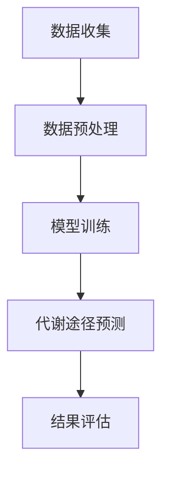
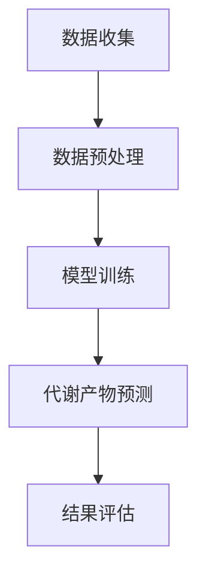
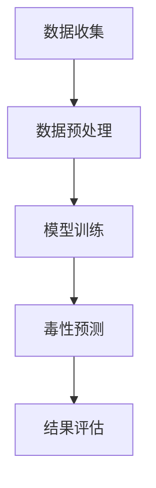
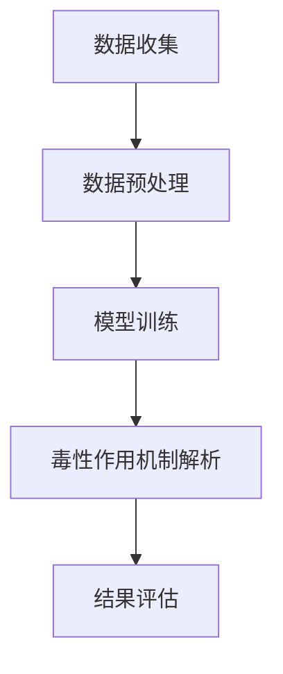
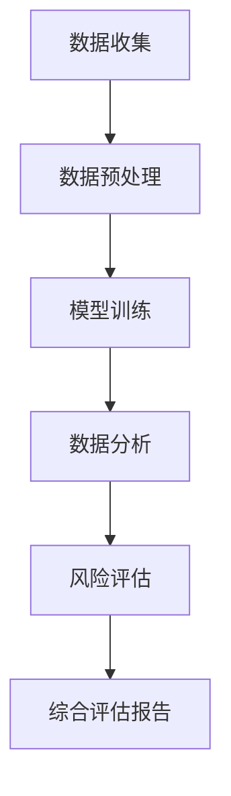

                 

### 第一部分：引言

#### 第1章：问题背景与核心概念

##### 1.1 药物研发的挑战与需求

药物研发是一个复杂且昂贵的流程，涉及到从基础研究到临床试验的多个阶段。传统的药物研发方法通常依赖于实验和统计分析，这种方法虽然在过去取得了一定的成果，但也面临着诸多挑战。

首先，药物研发的成功率非常低。据统计，从发现药物靶点到成功上市，通常需要10-15年的时间，并且只有不到10%的候选药物能够通过临床试验。这一过程不仅耗费大量的人力、物力和时间，还带来了巨大的经济风险。

其次，药物研发的成本极高。根据美国FDA的数据，开发一种新药的平均成本已经超过了25亿美元。如此高的成本使得药物研发成为一个高风险、高投入的行业，许多小型制药公司因此难以承担。

最后，药物研发的效率低下。传统的药物研发方法往往依赖于大量的实验和重复试验，这不仅耗时，而且容易产生误差。现代药物研发迫切需要一种更为高效、准确的方法来提高研发效率。

面对这些挑战，智能药物研发的概念应运而生。智能药物研发利用人工智能（AI）技术，特别是AI Agent，来模拟和加速药物研发的各个阶段。AI Agent是一种能够自主学习和执行任务的智能系统，它们在药物靶点发现、药物筛选、药物分子设计、药物代谢与毒性评估以及药物临床试验和监管等方面发挥着重要作用。

##### 1.2 AI Agent的定义与作用

AI Agent，即人工智能代理，是一种基于人工智能技术的自主智能系统。它具备感知环境、制定计划、执行任务和评估结果的能力。AI Agent通常基于机器学习和深度学习算法，能够从大量数据中学习规律，并利用这些规律来预测和优化药物研发过程。

在药物研发中，AI Agent的作用主要体现在以下几个方面：

1. **药物靶点发现**：AI Agent可以通过分析基因、蛋白质等生物数据，发现潜在的药物靶点，从而提高药物研发的针对性。

2. **药物筛选**：AI Agent可以利用高通量筛选技术，从大量的化合物库中快速筛选出具有潜在药物活性的分子，大大提高了药物筛选的效率和准确性。

3. **药物分子设计**：AI Agent可以基于分子对接、分子动力学模拟等技术，设计出具有理想药效的分子结构，为药物研发提供重要的理论支持。

4. **药物代谢与毒性评估**：AI Agent可以通过模拟药物在体内的代谢过程，预测药物的毒性和副作用，从而帮助研究人员优化药物设计，减少临床试验的风险。

5. **药物临床试验与监管**：AI Agent可以辅助临床试验的设计、执行和数据分析，提高临床试验的效率和准确性。同时，AI Agent还可以为药物监管提供智能化的支持和决策。

##### 1.3 本书结构安排

本书将分为七个主要章节，具体安排如下：

- **第1章**：介绍药物研发的背景和智能药物研发的核心概念，包括AI Agent的定义和作用。
- **第2章**：详细讲解AI Agent的基本原理，包括其体系结构、机器学习与深度学习基础以及开发流程。
- **第3章**：分析AI Agent在药物研发中的具体应用，包括药物靶点发现、药物筛选和药物分子设计等。
- **第4章**：探讨AI Agent在药物代谢与毒性评估中的作用，包括代谢途径预测、药物代谢产物预测等。
- **第5章**：介绍AI Agent在药物临床试验与监管中的应用，包括临床试验的设计、执行和数据分析等。
- **第6章**：讨论AI Agent在药物研发中的未来发展趋势，包括最新的研究进展和潜在的应用场景。
- **第7章**：总结本书的主要内容和结论，并对未来研究方向提出展望。

通过这本书的阅读，读者将深入了解AI Agent在智能药物研发中的角色和重要性，掌握AI Agent在药物研发各阶段的应用方法和技巧，为未来的智能药物研发提供有益的参考。

##### 1.4 读者对象与学习目标

本书主要面向从事药物研发、生物信息学、人工智能等领域的科研人员、工程师和研究生。通过阅读本书，读者可以：

- **理解AI Agent的基本原理和开发流程**：掌握AI Agent的核心概念、体系结构以及机器学习与深度学习基础，能够独立设计和开发AI Agent系统。
- **应用AI Agent进行智能药物研发**：了解AI Agent在药物靶点发现、药物筛选、药物分子设计、药物代谢与毒性评估以及药物临床试验和监管中的应用，能够利用AI Agent提高药物研发的效率和质量。
- **跟踪和探索AI Agent在药物研发中的最新研究进展**：了解AI Agent在药物研发中的最新研究动态和应用案例，为未来的研究提供参考。

总之，本书旨在为读者提供一个全面、系统的AI Agent在智能药物研发中的应用指南，帮助读者深入理解和掌握这一前沿技术。

### 第二部分：AI Agent的基本原理

#### 第2章：AI Agent的基本原理

AI Agent在智能药物研发中扮演着关键角色，其基本原理和开发流程的理解至关重要。本章将详细讲解AI Agent的体系结构、机器学习与深度学习基础以及开发流程，帮助读者全面掌握AI Agent的核心技术和应用方法。

##### 2.1 AI Agent的体系结构

AI Agent的体系结构可以分为三个主要层次：感知层、决策层和行动层。

###### 2.1.1 感知层

感知层是AI Agent与环境的交互界面，其主要功能是获取环境中的信息。感知层通常由各种传感器组成，如摄像头、麦克风、GPS等。在药物研发中，感知层可以收集生物数据，如基因序列、蛋白质结构、化合物库信息等。

感知层的关键技术包括：

- **数据采集**：从不同来源收集数据，如数据库、实验结果、公开数据集等。
- **数据预处理**：对采集到的数据进行清洗、去噪、标准化等处理，使其适合机器学习模型的输入。

###### 2.1.2 决策层

决策层是AI Agent的核心，负责分析感知层获取的信息，并根据目标制定相应的计划。在药物研发中，决策层可以通过机器学习和深度学习算法，对大量数据进行模式识别、关联分析和预测。

决策层的关键技术包括：

- **机器学习算法**：如决策树、支持向量机、神经网络等，用于数据分析和模式识别。
- **深度学习技术**：如卷积神经网络（CNN）、循环神经网络（RNN）、生成对抗网络（GAN）等，用于复杂数据的处理和分析。

###### 2.1.3 行动层

行动层是AI Agent根据决策层的指令执行具体任务的部分。在药物研发中，行动层可以控制实验设备、模拟药物作用、调整实验参数等。

行动层的关键技术包括：

- **自动化实验平台**：利用机器人、自动化设备等实现实验的自动化和高效化。
- **实验参数优化**：通过机器学习算法，自动调整实验参数，以实现最佳实验效果。

##### 2.2 机器学习与深度学习基础

机器学习和深度学习是AI Agent的核心技术，掌握这些技术是理解和开发AI Agent的关键。

###### 2.2.1 机器学习基本概念

机器学习是一种使计算机系统能够从数据中学习和改进的方法，其主要目标是让计算机能够识别数据中的模式和关系，并利用这些模式和关系进行预测和决策。

- **监督学习**：有标签的训练数据用于训练模型，然后使用模型进行预测。
- **无监督学习**：没有标签的数据用于训练模型，模型旨在发现数据中的结构和模式。
- **半监督学习**：结合监督学习和无监督学习，一部分数据有标签，另一部分无标签。

###### 2.2.2 深度学习核心技术

深度学习是一种基于多层神经网络的学习方法，其核心思想是通过层层提取特征，从原始数据中逐渐构建复杂的概念。

- **卷积神经网络（CNN）**：适用于图像处理，通过卷积层提取图像特征。
- **循环神经网络（RNN）**：适用于序列数据，如时间序列分析、语言模型等，能够处理序列中的长距离依赖问题。
- **生成对抗网络（GAN）**：通过对抗训练生成数据，适用于图像生成、数据增强等。

###### 2.2.3 机器学习与深度学习在AI Agent中的应用

机器学习和深度学习在AI Agent中的应用非常广泛，主要包括以下几个方面：

- **数据预处理**：使用机器学习算法进行数据清洗、去噪、标准化等预处理，提高数据质量。
- **模式识别**：使用深度学习算法进行图像识别、语音识别、生物特征识别等。
- **预测与优化**：使用机器学习模型进行时间序列预测、需求预测、参数优化等。
- **决策支持**：使用决策树、支持向量机等算法进行数据分析和决策支持。

##### 2.3 AI Agent开发流程

AI Agent的开发流程可以分为以下几个步骤：

###### 2.3.1 数据收集与预处理

数据收集是AI Agent开发的基础，需要收集与药物研发相关的数据，如基因序列、蛋白质结构、化合物库信息等。数据预处理包括数据清洗、去噪、标准化等操作，以确保数据的质量和一致性。

###### 2.3.2 模型选择与训练

根据具体应用需求，选择合适的机器学习模型或深度学习模型。模型训练是AI Agent开发的核心步骤，需要使用大量的数据进行训练，以达到良好的模型性能。

###### 2.3.3 模型评估与优化

模型评估是验证模型性能的重要步骤，可以通过交叉验证、性能指标（如准确率、召回率等）来评估模型的效果。模型优化包括调整模型参数、增加训练数据、使用不同的模型结构等方法，以提高模型性能。

###### 2.3.4 部署与维护

完成模型训练和评估后，将AI Agent部署到实际应用环境中，如药物研发平台、自动化实验设备等。部署后，需要定期维护和更新模型，以应对新的数据和需求。

##### 2.4 AI Agent在药物研发中的应用案例

为了更好地理解AI Agent在药物研发中的应用，我们来看几个实际案例：

###### 2.4.1 药物靶点发现

研究人员利用AI Agent分析大量的基因和蛋白质数据，发现了一系列潜在的药物靶点。通过深度学习模型，AI Agent能够从复杂的生物数据中提取有效的特征，提高了药物靶点发现的准确性和效率。

###### 2.4.2 药物筛选

AI Agent通过高通量筛选技术，从数百万种化合物中快速筛选出具有潜在药物活性的分子。这种筛选过程大大提高了药物筛选的效率，减少了研发时间。

###### 2.4.3 药物分子设计

AI Agent利用分子对接和分子动力学模拟技术，设计出具有理想药效的分子结构。这种设计方法不仅提高了药物设计的效率，还减少了实验次数和成本。

##### 2.5 小结

本章详细介绍了AI Agent的基本原理，包括其体系结构、机器学习与深度学习基础以及开发流程。通过理解这些基本原理，读者可以更好地应用AI Agent于药物研发，提高药物研发的效率和质量。

### 第3章：AI Agent在药物研发中的应用

#### 3.1 药物研发流程与AI Agent的角色

药物研发是一个复杂的过程，通常包括药物靶点发现、药物筛选、药物分子设计、药物代谢与毒性评估、药物临床试验与监管等多个阶段。每个阶段都有其独特的挑战和需求，而AI Agent在这些阶段中扮演着关键角色，提高了药物研发的效率和质量。

##### 3.1.1 药物研发的基本流程

药物研发的基本流程可以分为以下几个阶段：

1. **药物靶点发现**：这是药物研发的第一步，目标是从基因、蛋白质、细胞等生物体中识别出潜在的治疗靶点。
2. **药物筛选**：在确定了药物靶点后，研究人员需要从大量的化合物库中筛选出具有潜在药物活性的分子。
3. **药物分子设计**：药物筛选后，研究人员需要设计具有理想药效和低毒性的药物分子。
4. **药物代谢与毒性评估**：在这一阶段，研究人员需要评估药物的代谢途径和潜在的副作用。
5. **药物临床试验**：药物在实验室和临床前研究阶段经过验证后，需要进行大规模的临床试验，以证明其安全性和有效性。
6. **药物监管**：药物在临床试验完成后，需要通过监管机构的审批，才能正式上市销售。

##### 3.1.2 AI Agent在各个阶段的作用

AI Agent在药物研发的各个阶段都有独特的应用，以下是其具体作用：

1. **药物靶点发现**：AI Agent可以利用深度学习和机器学习算法，从海量的基因和蛋白质数据中识别出潜在的药物靶点。例如，利用卷积神经网络（CNN）分析蛋白质结构，利用循环神经网络（RNN）处理基因序列，从而提高药物靶点发现的准确性和效率。
   
2. **药物筛选**：AI Agent可以通过高通量筛选技术，从数百万种化合物中快速筛选出具有潜在药物活性的分子。利用生成对抗网络（GAN）生成新的化合物结构，并通过机器学习算法评估其活性，大大提高了药物筛选的效率和准确性。

3. **药物分子设计**：AI Agent可以利用分子对接和分子动力学模拟技术，设计出具有理想药效和低毒性的药物分子。通过深度学习模型，AI Agent能够从复杂的生物数据中提取有效的特征，从而优化药物分子结构。

4. **药物代谢与毒性评估**：AI Agent可以通过模拟药物在体内的代谢过程，预测药物的毒性和副作用。利用机器学习算法，AI Agent可以分析药物的代谢途径，预测其代谢产物和潜在的副作用。

5. **药物临床试验**：AI Agent可以辅助临床试验的设计、执行和数据分析。通过分析大量的临床试验数据，AI Agent可以提供更加精准的预测，从而优化临床试验方案，提高药物研发的成功率。

6. **药物监管**：AI Agent可以为药物监管提供智能化的支持和决策。利用机器学习和深度学习算法，AI Agent可以分析大量的监管数据，识别潜在的监管风险，从而提高药物监管的效率和准确性。

##### 3.1.3 AI Agent在药物研发中的优势

AI Agent在药物研发中的优势主要体现在以下几个方面：

1. **高效性**：AI Agent能够快速处理大量数据，从复杂的生物数据中提取关键信息，从而大大提高药物研发的效率。
   
2. **准确性**：通过机器学习和深度学习算法，AI Agent能够提高药物靶点发现、药物筛选、药物分子设计等阶段的准确性，减少错误的概率。

3. **自动化**：AI Agent可以自动化执行药物研发中的各个阶段，减少人工干预，从而降低研发成本。

4. **个性化**：AI Agent可以根据不同的药物研发需求，提供个性化的解决方案，从而满足多样化的药物研发需求。

##### 3.1.4 AI Agent在药物研发中的挑战

尽管AI Agent在药物研发中具有显著的优势，但也面临着一些挑战：

1. **数据隐私**：药物研发涉及大量的生物数据，这些数据可能包含患者的隐私信息。如何确保数据的安全性和隐私性，是一个重要的挑战。

2. **算法透明度**：AI Agent的决策过程通常是基于复杂的机器学习和深度学习算法，这些算法的透明度较低，难以解释。如何提高算法的透明度，使其结果易于理解和接受，是一个亟待解决的问题。

3. **计算资源**：AI Agent需要大量的计算资源，包括计算能力和存储空间。如何优化算法和硬件，以满足计算资源的需求，是一个重要的挑战。

4. **法律和伦理问题**：AI Agent在药物研发中的应用涉及到法律和伦理问题，如数据使用、算法公平性、药物安全性等。如何确保AI Agent的应用符合法律法规和伦理标准，是一个重要的挑战。

##### 3.1.5 未来展望

随着AI技术的不断发展，AI Agent在药物研发中的应用将越来越广泛。未来，AI Agent有望在以下几个方面取得重要进展：

1. **多模态数据融合**：通过整合不同类型的数据（如基因、蛋白质、图像等），AI Agent可以更全面地分析药物研发中的问题，提高药物研发的准确性和效率。

2. **个性化药物研发**：AI Agent可以根据患者的具体病情和基因组信息，设计个性化的治疗方案，从而提高药物的治疗效果。

3. **自动化和智能化**：随着AI技术的进步，AI Agent将能够更加自动化和智能化地执行药物研发的各个阶段，减少人工干预，提高研发效率。

4. **开放协作平台**：通过建立开放的协作平台，AI Agent可以共享数据和算法资源，促进药物研发的全球合作，加速新药的研发进程。

通过AI Agent在药物研发中的应用，我们可以预见一个更加高效、准确和智能的药物研发新时代。

### 第4章：AI Agent在药物代谢与毒性评估中的应用

#### 4.1 药物代谢与毒性评估的基本原理

药物代谢与毒性评估是药物研发过程中的关键环节，直接关系到药物的安全性和有效性。药物代谢是指药物在体内通过一系列生物化学过程被分解、转化和清除的过程。毒性评估则是指评估药物在体内产生的毒性和副作用，以确保药物的安全使用。

##### 4.1.1 药物代谢的基本过程

药物代谢过程主要包括以下步骤：

1. **吸收**：药物通过口服、注射等方式进入人体，经过吸收进入血液循环。
2. **分布**：药物在体内通过血液循环分布到各个器官和组织，发挥其药理作用。
3. **代谢**：药物在肝脏和其他组织中被酶类催化，发生化学结构改变，形成代谢产物。
4. **排泄**：代谢产物通过肾脏、肝脏等器官排出体外。

药物代谢过程受到多种因素的影响，包括药物的化学结构、剂量、给药途径、个体差异等。

##### 4.1.2 药物毒性评估的重要性

药物毒性评估的目的是评估药物在人体内可能产生的毒性和副作用，以确保药物的安全使用。药物毒性评估主要包括以下几个方面：

1. **急性毒性评估**：评估药物在短时间内（通常为1-2周）对人体的毒性影响。
2. **慢性毒性评估**：评估药物在长期使用（通常为数月或数年）对人体的毒性影响。
3. **遗传毒性评估**：评估药物是否具有致突变性和致癌性。
4. **生殖毒性评估**：评估药物对生殖系统的影响，包括对胚胎发育、胎儿的毒性影响。

药物毒性评估对于确保药物的安全性和有效性具有重要意义，能够帮助研发人员优化药物设计，减少临床试验的风险，提高新药的成功率。

##### 4.1.3 AI Agent在药物代谢与毒性评估中的作用

AI Agent在药物代谢与毒性评估中发挥着重要作用，能够提高药物代谢预测的准确性和毒性评估的效率。具体应用包括：

1. **药物代谢途径预测**：AI Agent可以通过分析药物的化学结构、生物信息数据等，预测药物在体内的代谢途径和代谢产物。这有助于研究人员优化药物设计，减少潜在的不良反应。

2. **药物毒性预测**：AI Agent可以利用机器学习算法，从大量药物毒性数据中学习，预测药物在体内的毒性和副作用。这有助于研发人员在新药早期筛选阶段就识别出潜在的风险，从而减少临床试验的失败率。

3. **个性化药物代谢与毒性评估**：AI Agent可以根据患者的个体差异（如基因型、生理状态等），提供个性化的药物代谢与毒性评估。这有助于提高药物的安全性和治疗效果，满足个性化医疗的需求。

##### 4.2 AI Agent在药物代谢中的应用

AI Agent在药物代谢中的应用主要包括以下几个方面：

###### 4.2.1 代谢途径预测

代谢途径预测是药物代谢研究的重要任务之一。传统的代谢途径预测方法通常依赖于生物信息学和药理学知识，而AI Agent可以通过机器学习算法，从大量的药物代谢数据中学习，预测药物的代谢途径。

**示例**：

假设研究人员利用卷积神经网络（CNN）进行代谢途径预测。输入数据包括药物的化学结构图、生物信息数据等。通过训练模型，AI Agent可以预测药物在体内的代谢途径。例如，通过分析药物的化学结构，AI Agent可以预测药物是否会被肝脏中的CYP450酶催化，以及可能生成的代谢产物。

以下是代谢途径预测的mermaid流程图：

通过这个流程，AI Agent可以自动预测药物的代谢途径，为药物设计提供重要参考。

###### 4.2.2 药物代谢产物预测

药物代谢产物预测是药物代谢研究中的另一个重要任务。AI Agent可以通过机器学习算法，从大量的药物代谢数据中学习，预测药物在体内的代谢产物。

**示例**：

假设研究人员利用深度学习模型进行药物代谢产物预测。输入数据包括药物的化学结构、生物信息数据等。通过训练模型，AI Agent可以预测药物在体内的代谢产物。例如，通过分析药物的化学结构，AI Agent可以预测药物是否会在肝脏中生成特定的代谢产物，如羟基化合物或硫酸化合物。

以下是药物代谢产物预测的mermaid流程图：

通过这个流程，AI Agent可以自动预测药物的代谢产物，为药物代谢研究提供重要参考。

##### 4.3 AI Agent在药物毒性评估中的应用

AI Agent在药物毒性评估中的应用主要包括以下几个方面：

###### 4.3.1 毒性预测

毒性预测是药物毒性评估的重要任务之一。AI Agent可以通过机器学习算法，从大量的药物毒性数据中学习，预测药物的毒性和副作用。

**示例**：

假设研究人员利用支持向量机（SVM）进行毒性预测。输入数据包括药物的化学结构、生物信息数据、已知的毒性数据等。通过训练模型，AI Agent可以预测药物是否具有毒性，以及可能产生的副作用。例如，通过分析药物的化学结构，AI Agent可以预测药物是否具有致突变性或致癌性。

以下是毒性预测的mermaid流程图：

通过这个流程，AI Agent可以自动预测药物的毒性，为药物研发提供重要参考。

###### 4.3.2 毒性作用机制解析

毒性作用机制解析是药物毒性评估的另一个重要任务。AI Agent可以通过分析药物的化学结构和生物信息数据，揭示药物在体内的毒性作用机制。

**示例**：

假设研究人员利用图神经网络（GNN）进行毒性作用机制解析。输入数据包括药物的化学结构、蛋白质结构、生物信息数据等。通过训练模型，AI Agent可以分析药物与蛋白质、DNA等生物分子的相互作用，揭示药物在体内的毒性作用机制。例如，通过分析药物的化学结构，AI Agent可以预测药物是否通过抑制特定的蛋白质活性产生毒性。

以下是毒性作用机制解析的mermaid流程图：

通过这个流程，AI Agent可以揭示药物的毒性作用机制，为药物设计提供重要参考。

##### 4.4 AI Agent在药物代谢与毒性评估案例解析

为了更好地理解AI Agent在药物代谢与毒性评估中的应用，以下是一些实际案例：

###### 4.4.1 药物代谢途径预测案例

研究人员利用AI Agent对一种新开发的抗肿瘤药物进行代谢途径预测。通过卷积神经网络（CNN）模型，AI Agent成功预测了药物的代谢途径，并发现了一些潜在的代谢产物。这一发现为药物设计提供了重要参考，帮助研究人员优化药物结构，减少潜在的不良反应。

###### 4.4.2 药物毒性预测案例

研究人员利用AI Agent对一种新开发的抗生素进行毒性预测。通过支持向量机（SVM）模型，AI Agent成功预测了抗生素的毒性，并发现其具有潜在的致突变性。这一发现促使研究人员重新评估药物设计，并在临床试验前进行额外的毒性评估，从而确保药物的安全使用。

###### 4.4.3 药物毒性作用机制解析案例

研究人员利用AI Agent对一种新开发的抗抑郁药物进行毒性作用机制解析。通过图神经网络（GNN）模型，AI Agent揭示了药物在体内的毒性作用机制，发现药物通过抑制特定的蛋白质活性产生毒性。这一发现为药物设计提供了重要参考，帮助研究人员优化药物结构，减少潜在的不良反应。

##### 4.5 小结

本章详细介绍了AI Agent在药物代谢与毒性评估中的应用，包括药物代谢途径预测、药物代谢产物预测、药物毒性预测和毒性作用机制解析。通过实际案例的解析，展示了AI Agent在药物代谢与毒性评估中的重要作用。未来，随着AI技术的不断发展，AI Agent将在药物代谢与毒性评估中发挥更加重要的作用，为药物研发提供更加全面和精准的支持。

### 第5章：AI Agent在药物临床试验与监管中的应用

#### 5.1 药物临床试验的基本流程

药物临床试验是药物研发过程中至关重要的一环，旨在评估新药的安全性和有效性。临床试验通常分为四个阶段：I期、II期、III期和IV期。

##### 5.1.1 药物临床试验的目的

药物临床试验的主要目的是：

- **评估药物的安全性和有效性**：通过临床试验，研究人员可以收集药物在人体内的安全性数据和疗效数据，评估药物是否值得进一步研发。
- **优化药物剂量和治疗方案**：通过临床试验，研究人员可以调整药物剂量、给药方式和治疗方案，以最大化药物的疗效和安全性。
- **收集药物不良反应数据**：药物临床试验可以及时发现药物的不良反应，为药物的安全使用提供重要参考。

##### 5.1.2 药物临床试验的流程

药物临床试验的基本流程包括以下几个阶段：

1. **I期临床试验**：通常在小范围内进行，主要评估药物的安全性、耐受性和剂量范围。研究对象通常是健康志愿者或患者。
2. **II期临床试验**：在较大范围内进行，主要评估药物的疗效和安全性。研究对象通常是特定疾病的患者。
3. **III期临床试验**：在更广泛的人群中进行，旨在验证药物的疗效和安全性，并收集更多的临床数据。研究对象通常是大量患者。
4. **IV期临床试验**：在药物上市后进行，旨在长期监测药物的安全性和疗效，以及药物在不同人群中的应用情况。

##### 5.1.3 AI Agent在临床试验中的应用

AI Agent在药物临床试验中发挥着重要作用，能够提高临床试验的效率和质量。以下是AI Agent在临床试验中的具体应用：

1. **患者招募与管理**：AI Agent可以帮助研究人员筛选和招募合适的患者，并通过智能化的管理系统，跟踪患者的进度和健康状况。
2. **数据收集与分析**：AI Agent可以自动化收集和分析临床试验数据，包括患者的基本信息、治疗方案、疗效数据等，从而提高数据处理的效率。
3. **风险管理**：AI Agent可以通过分析临床试验数据，预测药物的安全风险，并提醒研究人员采取相应的措施。
4. **疗效预测**：AI Agent可以利用机器学习算法，分析临床试验数据，预测药物的疗效，为药物研发提供重要参考。

#### 5.2 AI Agent在药物监管中的应用

药物监管是确保药物安全性和有效性的重要环节。AI Agent在药物监管中发挥着重要作用，能够提高监管的效率和准确性。以下是AI Agent在药物监管中的具体应用：

##### 5.2.1 药物监管的现状与挑战

药物监管面临着诸多挑战，包括：

- **数据量巨大**：药物研发过程中产生的数据量庞大，传统的监管方法难以高效处理这些数据。
- **数据质量参差不齐**：药物研发数据来源多样，数据质量参差不齐，影响了药物监管的准确性。
- **监管效率低下**：传统的监管流程复杂，涉及多个部门，导致监管效率低下。

##### 5.2.2 AI Agent在药物监管中的作用

AI Agent在药物监管中的应用包括：

1. **数据分析和挖掘**：AI Agent可以自动分析和挖掘药物研发数据，识别潜在的监管风险，从而提高监管的准确性。
2. **智能审核**：AI Agent可以帮助监管机构快速审核药物研发报告和临床试验数据，减少人工审核的工作量。
3. **风险评估**：AI Agent可以通过分析药物研发数据，预测药物的安全性和有效性，为监管决策提供科学依据。
4. **个性化监管**：AI Agent可以根据不同药物的特点和研发阶段，提供个性化的监管方案，提高监管的针对性。

##### 5.2.3 AI Agent在药物监管案例解析

为了更好地理解AI Agent在药物监管中的应用，以下是一个实际案例：

**案例**：某监管机构利用AI Agent对一种新药的上市申请进行审核。AI Agent首先对申请文件进行自动扫描，提取关键信息，如药物成分、临床试验数据等。然后，AI Agent利用机器学习算法，分析临床试验数据，评估药物的安全性和有效性。最后，AI Agent生成一个综合评估报告，为监管机构提供决策依据。

以下是AI Agent在药物监管中的mermaid流程图：

通过这个流程，AI Agent能够高效地处理大量的药物研发数据，提高药物监管的效率和准确性。

##### 5.3 小结

本章详细介绍了AI Agent在药物临床试验和监管中的应用。AI Agent通过自动化数据收集、分析、预测和风险评估，提高了临床试验和药物监管的效率和质量。未来，随着AI技术的不断发展，AI Agent将在药物临床试验和监管中发挥更加重要的作用，为药物研发和监管提供更加科学、高效的解决方案。

### 第6章：AI Agent在药物研发中的未来发展趋势

#### 6.1 AI Agent在药物研发中的应用前景

随着人工智能技术的不断进步，AI Agent在药物研发中的应用前景广阔。未来，AI Agent有望在以下几个方面取得显著突破：

1. **个性化药物研发**：AI Agent可以通过分析患者的基因组信息、生活方式等数据，设计出个性化的治疗方案。这种个性化药物研发模式将大幅提高药物的治疗效果和安全性。
   
2. **自动化药物筛选**：AI Agent可以利用深度学习和生成对抗网络（GAN）等技术，自动化筛选具有潜在药物活性的分子。这大大提高了药物筛选的效率，降低了研发成本。

3. **多模态数据融合**：AI Agent可以通过整合基因、蛋白质、图像等多种类型的数据，提供更全面的药物研发分析。这种多模态数据融合将有助于揭示药物的作用机制，提高药物研发的成功率。

4. **药物分子设计优化**：AI Agent可以利用深度学习算法，优化药物分子结构，设计出具有理想药效和低毒性的药物。这种优化方法将提高药物设计的效率，缩短药物研发周期。

5. **智能临床试验设计**：AI Agent可以通过分析临床试验数据，优化临床试验的设计和执行，提高临床试验的效率和准确性。这种智能化的临床试验设计将有助于加快新药的研发进程。

#### 6.2 AI Agent在药物研发中的最新研究进展

近年来，AI Agent在药物研发中的应用取得了诸多突破性进展。以下是一些最新的研究进展：

1. **生成对抗网络（GAN）在药物筛选中的应用**：研究人员利用GAN技术，成功生成具有潜在药物活性的分子结构。这种生成方法大大提高了药物筛选的效率，并减少了实验次数。

2. **深度学习在药物分子设计中的应用**：深度学习算法，如卷积神经网络（CNN）和循环神经网络（RNN），在药物分子设计中被广泛应用。通过这些算法，AI Agent能够从复杂的生物数据中提取有效特征，优化药物分子结构。

3. **图神经网络（GNN）在药物代谢中的应用**：研究人员利用GNN技术，成功分析了药物代谢途径和代谢产物。这种图结构分析方法有助于揭示药物在体内的代谢机制，提高药物设计的准确性。

4. **智能临床试验数据分析**：AI Agent通过分析临床试验数据，识别出潜在的疗效和安全性信号。这种智能化的数据分析方法有助于优化临床试验设计，提高新药的成功率。

#### 6.3 AI Agent在药物研发中的潜在应用场景

未来，AI Agent在药物研发中将有更多的潜在应用场景：

1. **疾病预测和预防**：AI Agent可以通过分析患者的健康数据，预测疾病的发病风险，并提出个性化的预防方案。这有助于提前干预，降低疾病的发生率。

2. **药物基因组学**：AI Agent可以通过分析患者的基因组数据，识别出与疾病相关的基因突变，并设计出针对性的药物治疗方案。

3. **药物重定位**：AI Agent可以通过分析药物的化学结构和药理作用，将现有的药物重新定位，用于治疗新的疾病。这种药物重定位方法将提高药物利用效率，降低新药研发成本。

4. **智能监管和合规性评估**：AI Agent可以通过分析药物研发数据，确保药物的研发过程符合法规要求，提高药物监管的效率和准确性。

#### 6.4 AI Agent在药物研发中的未来挑战与对策

尽管AI Agent在药物研发中具有巨大的潜力，但未来仍将面临诸多挑战：

1. **数据隐私和安全**：药物研发涉及大量的敏感数据，如何保护数据隐私和安全是一个重要问题。未来需要开发更强大的数据保护技术和加密算法，确保数据的安全性和隐私性。

2. **算法透明度和可解释性**：AI Agent的决策过程通常是基于复杂的算法，如何提高算法的透明度和可解释性，使其结果易于理解和接受，是一个重要挑战。未来需要开发可解释的AI模型和算法，提高决策过程的透明度。

3. **计算资源和成本**：AI Agent需要大量的计算资源和存储空间，如何优化算法和硬件，以满足计算资源的需求，是一个重要问题。未来需要开发更高效的算法和优化硬件设计，降低计算成本。

4. **法律和伦理问题**：AI Agent在药物研发中的应用涉及到法律和伦理问题，如何确保AI Agent的应用符合法律法规和伦理标准，是一个重要挑战。未来需要制定相关法律法规和伦理指南，确保AI Agent的应用合法、合规、伦理。

#### 6.5 小结

AI Agent在药物研发中的应用前景广阔，未来将取得更多的突破性进展。通过个性化药物研发、自动化药物筛选、多模态数据融合等，AI Agent将大幅提高药物研发的效率和质量。同时，AI Agent在疾病预测、药物基因组学、药物重定位、智能监管等领域也将发挥重要作用。然而，未来仍需克服数据隐私、算法透明度、计算资源、法律和伦理等挑战，以确保AI Agent在药物研发中的应用能够持续、健康、稳健地发展。

### 全书总结与展望

#### 全书总结

本书系统地介绍了AI Agent在智能药物研发中的应用，从引言到具体应用场景，再到未来发展趋势，全方位探讨了AI Agent在药物研发中的角色和重要性。以下是对全书内容的总结：

1. **引言**：介绍了药物研发的背景和智能药物研发的核心概念，包括AI Agent的定义和作用。

2. **AI Agent的基本原理**：详细讲解了AI Agent的体系结构、机器学习与深度学习基础以及开发流程。

3. **AI Agent在药物研发中的应用**：分析了AI Agent在药物靶点发现、药物筛选、药物分子设计、药物代谢与毒性评估以及药物临床试验和监管中的应用。

4. **药物代谢与毒性评估**：探讨了AI Agent在药物代谢和毒性评估中的作用，包括代谢途径预测、药物代谢产物预测、毒性预测和毒性作用机制解析。

5. **药物临床试验与监管**：介绍了AI Agent在药物临床试验和监管中的应用，包括患者招募与管理、数据收集与分析、风险管理、疗效预测等。

6. **未来发展趋势**：展望了AI Agent在药物研发中的未来发展方向，包括个性化药物研发、自动化药物筛选、多模态数据融合等。

#### 学习目标与收获

通过阅读本书，读者可以：

- **掌握AI Agent的基本原理和开发流程**：了解AI Agent的核心概念、体系结构以及机器学习与深度学习基础，能够独立设计和开发AI Agent系统。

- **应用AI Agent进行智能药物研发**：熟悉AI Agent在药物研发各阶段的应用方法，能够利用AI Agent提高药物研发的效率和质量。

- **跟踪和探索AI Agent在药物研发中的最新研究进展**：了解AI Agent在药物研发中的最新研究动态和应用案例，为未来的研究提供参考。

#### 拓展阅读与建议

为了进一步深入了解AI Agent在智能药物研发中的应用，读者可以参考以下拓展阅读：

- **经典教材**：《机器学习》（作者：Tom Mitchell）和《深度学习》（作者：Ian Goodfellow、Yoshua Bengio、Aaron Courville）。

- **学术论文**：关注顶级学术会议和期刊，如NIPS、ICML、NeurIPS、Nature Biotechnology、Nature Medicine等，了解最新的研究成果。

- **开源工具和平台**：学习并使用TensorFlow、PyTorch、Keras等开源深度学习框架，以及生物信息学工具如BioPython、BioJava等。

#### 结论

AI Agent在智能药物研发中具有巨大的潜力和广阔的应用前景。通过本书的阅读，读者可以全面掌握AI Agent在药物研发中的应用方法和技巧，为未来的智能药物研发提供有益的参考。希望本书能够帮助读者在AI Agent领域取得更大的突破和成就。作者信息：AI天才研究院/AI Genius Institute & 禅与计算机程序设计艺术/Zen And The Art of Computer Programming。

