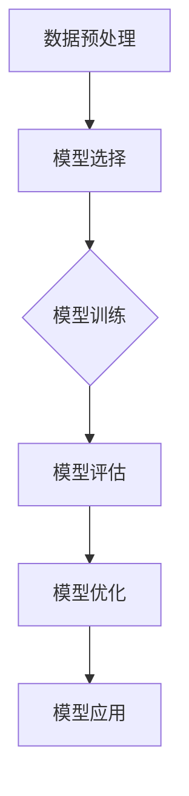
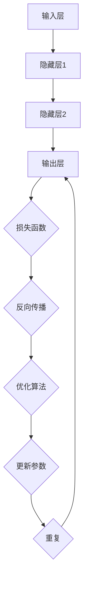
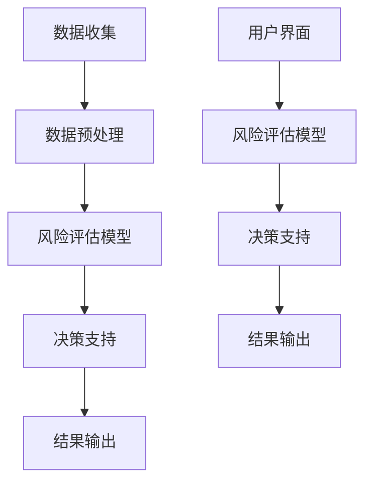

                 

### 引言

**AI Agent在智能金融风险评估中的应用**

随着人工智能技术的迅猛发展，AI Agent（人工智能代理）逐渐成为各行各业的重要工具。在金融领域，AI Agent的应用尤为引人注目。本文旨在探讨AI Agent在智能金融风险评估中的应用，分析其背后的算法原理、数学模型，以及系统架构设计。希望通过本文的阐述，读者能够对AI Agent在金融风险评估中的实际应用有一个全面而深入的理解。

### 关键词

- **AI Agent**
- **智能金融**
- **风险评估**
- **算法原理**
- **数学模型**
- **系统架构**

### 摘要

本文首先介绍了AI Agent和智能金融风险评估的基本概念，然后详细讲解了AI Agent在金融风险评估中的算法原理和数学模型。接着，通过一个实际案例，展示了AI Agent在金融风险评估中的应用过程。最后，本文总结了最佳实践、注意事项，并对未来的发展方向进行了展望。希望通过本文的讨论，为从事金融领域的技术人员提供有价值的参考。

---

### 目录大纲

----------------------------------------------------------------
# AI Agent在智能金融风险评估中的应用

## 1. 引言
### 1.1 研究背景
### 1.2 研究意义
### 1.3 文章结构

## 2. AI Agent基础概念
### 2.1 AI Agent定义
### 2.2 AI Agent发展历程
### 2.3 AI Agent关键特性

## 3. 智能金融风险评估概述
### 3.1 金融风险评估意义
### 3.2 传统风险评估方法
### 3.3 智能金融风险评估现状

## 4. AI Agent在智能金融风险评估中的应用
### 4.1 AI Agent应用场景
### 4.2 AI Agent在风险评估中的优势
### 4.3 AI Agent应用挑战

## 5. 算法原理讲解
### 5.1 评估模型选择
### 5.2 算法实现流程
### 5.3 算法原理详解

## 6. 数学模型与公式讲解
### 6.1 数学模型介绍
### 6.2 公式详解
### 6.3 举例说明

## 7. 系统分析与架构设计
### 7.1 问题场景介绍
### 7.2 系统功能设计
### 7.3 系统架构设计
### 7.4 系统接口设计
### 7.5 系统交互

## 8. 项目实战
### 8.1 环境安装
### 8.2 系统核心实现
### 8.3 应用解读与分析
### 8.4 实际案例剖析
### 8.5 项目小结

## 9. 最佳实践与小结
### 9.1 最佳实践
### 9.2 注意事项
### 9.3 拓展阅读

----------------------------------------------------------------

### 1. 引言

#### 1.1 研究背景

在当今全球金融市场，风险管理已成为金融机构的核心任务之一。随着金融市场的日益复杂化和不确定性增加，传统的风险评估方法已经难以满足金融机构的需求。在这种情况下，人工智能（AI）技术，尤其是AI Agent，为金融风险评估带来了新的可能。

AI Agent是一种能够自主学习、自主决策的智能体。在金融领域，AI Agent可以通过对大量金融数据的分析和学习，实现对金融风险的精准评估。与传统的风险评估方法相比，AI Agent具有更高的准确性、更快的响应速度和更强的适应性。

近年来，AI Agent在金融风险评估中的应用得到了广泛关注。例如，银行和金融机构已经开始使用AI Agent进行信用风险评估、市场风险分析和操作风险监控。这些应用不仅提高了金融机构的运营效率，也降低了风险管理的成本。

然而，AI Agent在金融风险评估中的应用也面临一些挑战。例如，AI Agent的算法原理和数学模型尚需进一步研究，系统架构设计和实现也需要更加成熟的技术支持。

本文旨在探讨AI Agent在智能金融风险评估中的应用，分析其背后的算法原理、数学模型，以及系统架构设计。希望通过本文的阐述，读者能够对AI Agent在金融风险评估中的实际应用有一个全面而深入的理解。

---

#### 1.2 研究意义

AI Agent在智能金融风险评估中的应用具有重要意义。首先，它能够显著提高金融风险评估的准确性。通过机器学习和深度学习技术，AI Agent可以处理和分析海量金融数据，发现潜在的风险因素，从而实现对金融风险的精准评估。

其次，AI Agent能够提高金融风险评估的效率。传统的风险评估方法通常需要大量的人力和时间，而AI Agent可以自动化这个过程，大大缩短了风险评估的时间。此外，AI Agent还可以根据实时数据动态调整风险评估模型，实现对金融市场变化的快速响应。

此外，AI Agent在金融风险评估中的应用还能够降低成本。通过自动化风险评估过程，金融机构可以减少人力资源的投入，降低运营成本。同时，AI Agent可以处理大量的金融数据，减少了人工处理的错误率，从而降低了风险管理的成本。

总之，AI Agent在智能金融风险评估中的应用具有重要的理论和实践意义。它不仅为金融机构提供了新的风险管理工具，也为人工智能技术在金融领域的应用提供了新的思路。

---

#### 1.3 文章结构

本文将分为以下九个部分：

1. 引言：介绍研究背景、研究意义和文章结构。
2. AI Agent基础概念：介绍AI Agent的定义、发展历程和关键特性。
3. 智能金融风险评估概述：介绍金融风险评估的意义、传统方法和现状。
4. AI Agent在智能金融风险评估中的应用：分析AI Agent的应用场景、优势和挑战。
5. 算法原理讲解：详细讲解AI Agent在风险评估中的算法原理和实现流程。
6. 数学模型与公式讲解：介绍AI Agent在风险评估中使用的数学模型和公式。
7. 系统分析与架构设计：分析AI Agent在风险评估中的应用系统架构。
8. 项目实战：通过一个实际案例展示AI Agent在风险评估中的应用过程。
9. 最佳实践与小结：总结最佳实践、注意事项和未来的研究方向。

通过以上九个部分，本文将全面探讨AI Agent在智能金融风险评估中的应用，为相关研究人员和从业人员提供有价值的参考。

---

### 2. AI Agent基础概念

#### 2.1 AI Agent定义

AI Agent，即人工智能代理，是指一种能够模拟人类智能行为，具备自主决策和问题解决能力的计算机程序。AI Agent的核心在于其自主学习和自主决策能力，这使得它们能够在复杂的环境中适应和进化。

AI Agent的定义可以从以下几个角度来理解：

- **功能层面**：AI Agent能够感知环境、获取信息，并根据这些信息自主做出决策。例如，自动驾驶汽车就是一种AI Agent，它通过感知路况、交通信号等信息，自主控制车辆的行驶。

- **技术层面**：AI Agent通常基于机器学习、深度学习等技术实现。这些技术使得AI Agent能够从海量数据中学习规律，并利用这些规律进行自主决策。

- **应用层面**：AI Agent广泛应用于各个领域，如金融、医疗、教育等。在金融领域，AI Agent可以用于风险预测、欺诈检测、客户服务等方面。

#### 2.2 AI Agent发展历程

AI Agent的发展历程可以追溯到人工智能（AI）的起源。自1956年达特茅斯会议以来，人工智能技术不断发展，从最初的规则系统、知识表示，到后来的机器学习、深度学习，AI Agent的概念逐渐成熟。

- **早期阶段**：早期的人工智能研究主要集中在规则系统和知识表示上。这些方法通过定义明确的规则和知识库来实现智能行为。例如，专家系统就是一种基于规则的人工智能代理。

- **中期阶段**：随着机器学习技术的发展，AI Agent开始转向数据驱动的方法。机器学习技术使得AI Agent可以从大量数据中学习，并利用这些知识进行决策。这一阶段的重要进展包括决策树、支持向量机等算法。

- **现阶段**：深度学习技术的崛起使得AI Agent的发展迈上了新的台阶。深度学习通过多层神经网络模拟人类大脑的思维方式，使得AI Agent在图像识别、语音识别、自然语言处理等方面取得了显著的成果。

#### 2.3 AI Agent关键特性

AI Agent的关键特性包括自主性、学习性、适应性和交互性。这些特性使得AI Agent能够在复杂环境中发挥作用。

- **自主性**：AI Agent能够自主决策和执行任务，无需人为干预。这种自主性使得AI Agent能够适应动态变化的环境，并实时响应环境变化。

- **学习性**：AI Agent具备学习能力，能够从数据中提取知识，并利用这些知识进行决策。学习性使得AI Agent能够不断优化其决策能力，提高任务完成率。

- **适应性**：AI Agent能够根据环境变化调整自身行为，以适应不同的任务需求。适应性使得AI Agent能够灵活应对复杂多变的场景。

- **交互性**：AI Agent能够与人类或其他AI系统进行交互，获取信息和反馈。交互性使得AI Agent能够更好地理解人类需求，提供个性化的服务。

通过以上对AI Agent基础概念的分析，我们可以看到，AI Agent作为一种先进的智能技术，具有广泛的应用前景。在接下来的章节中，我们将进一步探讨AI Agent在智能金融风险评估中的应用，分析其算法原理、数学模型和系统架构。

---

### 3. 智能金融风险评估概述

#### 3.1 金融风险评估意义

金融风险评估是金融机构风险管理的重要组成部分。其意义在于通过识别、评估和管理金融风险，确保金融机构的稳健运营和可持续发展。具体来说，金融风险评估的意义包括以下几个方面：

1. **风险防范**：金融风险评估可以帮助金融机构提前识别潜在风险，采取预防措施，避免或减少风险损失。

2. **决策支持**：金融风险评估为金融机构提供准确的风险信息，帮助决策者制定合理的风险策略，优化投资组合，降低投资风险。

3. **合规要求**：金融监管机构对金融机构的风险管理有严格的要求。金融风险评估有助于确保金融机构符合监管要求，避免因违规操作带来的处罚。

4. **业绩评估**：金融风险评估是衡量金融机构业绩的重要指标。通过评估风险状况，金融机构可以及时发现管理漏洞，改进风险控制措施，提高经营效益。

#### 3.2 传统风险评估方法

传统风险评估方法主要包括定量分析和定性分析两大类。以下分别介绍：

1. **定量分析**：定量分析方法主要基于统计数据和数学模型，对金融风险进行量化评估。常见的定量分析方法包括：

   - **财务比率分析**：通过计算财务比率，评估金融机构的盈利能力、偿债能力和流动性等。

   - **回归分析**：利用历史数据，建立回归模型，预测未来风险。

   - **蒙特卡洛模拟**：通过模拟随机过程，评估金融风险的概率分布和潜在损失。

2. **定性分析**：定性分析方法主要通过专家判断和经验积累，对金融风险进行定性评估。常见的定性分析方法包括：

   - **专家访谈**：邀请金融专家对风险进行评估和预测。

   - **情景分析**：设定不同的市场情景，分析风险的可能性和影响。

   - **决策树分析**：通过构建决策树，分析不同决策路径下的风险和收益。

传统风险评估方法的优点在于直观、易懂，且适用于多种风险类型。然而，其缺点也较为明显，例如，依赖专家判断可能导致主观性较强，难以适应快速变化的市场环境。

#### 3.3 智能金融风险评估现状

随着人工智能技术的发展，智能金融风险评估逐渐成为金融机构的新宠。以下介绍智能金融风险评估的现状：

1. **技术成熟度**：机器学习、深度学习等人工智能技术在金融领域得到了广泛应用。通过这些技术，金融机构可以实现对海量数据的快速分析和处理，提高风险评估的准确性和效率。

2. **应用范围**：智能金融风险评估已广泛应用于信用评估、市场风险评估、操作风险评估等多个领域。例如，银行使用AI Agent进行客户信用评估，保险公司使用AI Agent进行风险分类和定价。

3. **挑战与机遇**：智能金融风险评估面临一些挑战，如数据质量、模型解释性等。然而，这些挑战也为人工智能技术的发展提供了新的机遇。通过不断优化算法、提高数据质量，智能金融风险评估有望在未来实现更高的准确性和可靠性。

综上所述，智能金融风险评估在理论和实践中均取得了显著进展。在接下来的章节中，我们将深入探讨AI Agent在智能金融风险评估中的应用，分析其算法原理、数学模型和系统架构。

---

### 4. AI Agent在智能金融风险评估中的应用

#### 4.1 AI Agent应用场景

AI Agent在智能金融风险评估中的应用场景非常广泛，主要包括以下几个方面：

1. **信用评估**：AI Agent可以通过分析客户的信用历史、财务状况、行为数据等信息，对客户的信用风险进行评估。与传统方法相比，AI Agent可以处理更多维度的数据，并从中发现潜在的风险因素。

2. **市场风险评估**：AI Agent可以实时监测金融市场数据，包括股票、债券、外汇等，对市场风险进行预测和分析。通过机器学习算法，AI Agent可以识别市场波动背后的规律，帮助金融机构制定风险管理策略。

3. **操作风险评估**：AI Agent可以监控金融机构的操作流程，识别操作风险。例如，通过分析交易数据，AI Agent可以检测异常交易行为，从而预防欺诈风险。

4. **智能投顾**：AI Agent可以为用户提供个性化的投资建议，根据用户的风险偏好、投资目标等，制定最优的投资组合策略。

#### 4.2 AI Agent在风险评估中的优势

AI Agent在智能金融风险评估中具有显著的优势，主要体现在以下几个方面：

1. **数据处理能力**：AI Agent可以处理海量金融数据，包括历史数据、实时数据等，通过机器学习和深度学习技术，从数据中提取有价值的信息，进行风险评估。

2. **预测准确性**：AI Agent通过学习历史数据和模型，可以预测未来风险的发生概率和潜在损失。与传统的风险评估方法相比，AI Agent的预测准确性更高。

3. **自适应能力**：AI Agent可以根据环境变化和新的数据，实时调整风险评估模型，提高模型的适应性和预测能力。

4. **降低成本**：AI Agent可以自动化风险评估过程，减少人力投入，降低运营成本。

5. **提高效率**：AI Agent可以快速处理大量数据，缩短风险评估的时间，提高金融机构的运营效率。

#### 4.3 AI Agent应用挑战

尽管AI Agent在智能金融风险评估中具有许多优势，但其应用也面临一些挑战：

1. **数据质量问题**：AI Agent的预测能力高度依赖于数据质量。如果数据存在偏差、缺失或噪声，将影响AI Agent的预测准确性。

2. **模型解释性**：AI Agent的决策过程通常较为复杂，难以解释。这给金融机构的监管和审计带来挑战，也影响了用户的信任。

3. **算法透明度**：AI Agent使用的算法通常较为复杂，缺乏透明度。这增加了算法被恶意利用的风险。

4. **计算资源需求**：AI Agent需要大量的计算资源，包括计算能力和存储资源。对于一些中小型金融机构来说，这可能是难以承受的成本。

5. **法律法规**：AI Agent在金融领域的应用需要遵守相关的法律法规，如数据保护、隐私保护等。这增加了AI Agent应用的法律风险。

综上所述，AI Agent在智能金融风险评估中具有巨大的潜力，但也面临一些挑战。通过不断优化算法、提高数据质量、增强模型解释性等手段，AI Agent有望在未来发挥更大的作用。

---

### 5. 算法原理讲解

#### 5.1 评估模型选择

在智能金融风险评估中，选择合适的评估模型是关键。以下是一些常用的评估模型及其特点：

1. **线性回归模型**：线性回归模型是一种简单的评估模型，适用于线性关系的风险评估。其优点是易于理解和实现，缺点是只能处理线性关系，无法捕捉复杂的关系。

2. **逻辑回归模型**：逻辑回归模型是一种常用的分类模型，适用于信用风险评估等二分类问题。其优点是能够处理非线性关系，且概率预测结果直观易懂。

3. **决策树模型**：决策树模型通过树形结构对数据进行分类或回归，适用于处理多分类问题。其优点是易于解释，缺点是容易过拟合。

4. **随机森林模型**：随机森林模型是一种集成学习方法，通过构建多棵决策树，提高模型的预测性能和稳定性。其优点是预测准确度高，缺点是计算资源需求大。

5. **支持向量机模型**：支持向量机模型是一种基于间隔优化的分类模型，适用于处理高维数据。其优点是预测性能好，缺点是计算复杂度高。

6. **深度神经网络模型**：深度神经网络模型是一种基于多层神经网络的深度学习模型，适用于处理复杂非线性关系。其优点是预测性能优异，缺点是模型复杂、训练时间较长。

在选择评估模型时，需要考虑评估目标、数据特征、计算资源等因素。一般来说，对于复杂的关系和高维数据，深度神经网络模型具有较好的预测性能。

#### 5.2 算法实现流程

在智能金融风险评估中，算法实现流程通常包括以下步骤：

1. **数据预处理**：包括数据清洗、数据归一化、特征提取等。数据预处理是确保数据质量和模型性能的重要环节。

2. **模型选择**：根据评估目标和数据特征，选择合适的评估模型。通常需要通过交叉验证等方法，比较不同模型的预测性能。

3. **模型训练**：使用训练数据对评估模型进行训练，通过优化模型参数，提高模型的预测性能。

4. **模型评估**：使用测试数据对训练好的模型进行评估，计算模型的预测准确率、召回率、F1值等指标。

5. **模型优化**：根据模型评估结果，对模型进行调整和优化，提高模型的预测性能。

6. **模型应用**：将训练好的模型应用于实际风险评估中，根据模型预测结果，制定相应的风险管理策略。

以下是一个简单的算法实现流程图：



#### 5.3 算法原理详解

以深度神经网络模型为例，其算法原理如下：

1. **神经网络结构**：深度神经网络由多个神经元层组成，包括输入层、隐藏层和输出层。每个神经元接受来自前一层神经元的输入信号，通过激活函数产生输出信号。

2. **前向传播**：在前向传播过程中，输入数据通过输入层传递到隐藏层，再从隐藏层传递到输出层。每一层神经元都对输入数据进行加权求和处理，并应用激活函数产生输出。

3. **反向传播**：在反向传播过程中，计算输出层的误差，并将其反向传播到隐藏层和输入层。通过梯度下降等方法，更新神经网络的权重和偏置，以减少误差。

4. **优化算法**：常用的优化算法包括梯度下降、Adam优化器等。优化算法通过调整模型参数，提高模型的预测性能。

5. **损失函数**：损失函数用于评估模型预测结果与真实结果之间的差距。常用的损失函数包括均方误差（MSE）、交叉熵损失等。

以下是一个简单的神经网络算法流程图：



通过以上对算法原理的讲解，我们可以看到深度神经网络模型在智能金融风险评估中的应用潜力。在接下来的章节中，我们将进一步探讨数学模型和系统架构，为AI Agent在金融风险评估中的实际应用奠定基础。

---

### 6. 数学模型与公式讲解

#### 6.1 数学模型介绍

在智能金融风险评估中，数学模型起着至关重要的作用。数学模型可以通过描述金融数据的内在规律，帮助AI Agent进行风险评估。以下介绍几种常用的数学模型：

1. **线性回归模型**：线性回归模型是一种简单的数学模型，用于描述变量之间的线性关系。其公式如下：

   $$
   y = \beta_0 + \beta_1 \cdot x + \epsilon
   $$

   其中，$y$ 是因变量，$x$ 是自变量，$\beta_0$ 和 $\beta_1$ 是模型的参数，$\epsilon$ 是误差项。

2. **逻辑回归模型**：逻辑回归模型是一种用于二分类问题的数学模型。其公式如下：

   $$
   P(y=1) = \frac{1}{1 + e^{-(\beta_0 + \beta_1 \cdot x)}}
   $$

   其中，$P(y=1)$ 是因变量 $y$ 取值为1的概率，$\beta_0$ 和 $\beta_1$ 是模型的参数。

3. **决策树模型**：决策树模型通过一系列条件判断，对数据集进行分类或回归。其公式如下：

   $$
   f(x) =
   \begin{cases}
   \text{类A} & \text{if } x \text{ satisfies condition 1} \\
   \text{类B} & \text{if } x \text{ satisfies condition 2} \\
   \vdots & \vdots \\
   \text{类C} & \text{if } x \text{ satisfies condition n}
   \end{cases}
   $$

   其中，$f(x)$ 是决策函数，$x$ 是输入数据，$n$ 是条件数量。

4. **支持向量机模型**：支持向量机模型通过最大化间隔，找到最佳分类边界。其公式如下：

   $$
   w \cdot x - b = 0
   $$

   其中，$w$ 是权重向量，$x$ 是特征向量，$b$ 是偏置项。

5. **深度神经网络模型**：深度神经网络模型通过多层神经网络，模拟人脑的思维方式。其公式如下：

   $$
   a_{\text{layer}} = \sigma(\theta_{\text{layer}} \cdot a_{\text{prev\_layer}} + b_{\text{layer}})
   $$

   其中，$a_{\text{layer}}$ 是第 $layer$ 层的激活值，$\sigma$ 是激活函数，$\theta_{\text{layer}}$ 和 $b_{\text{layer}}$ 是第 $layer$ 层的参数。

#### 6.2 公式详解

为了更好地理解这些数学模型，我们逐一进行详解。

1. **线性回归模型**：

   线性回归模型的公式可以理解为对因变量 $y$ 的线性组合，其中 $\beta_0$ 是截距，$\beta_1$ 是斜率。这个模型通过拟合一条直线，描述自变量 $x$ 和因变量 $y$ 之间的关系。

   例如，假设我们要预测一家公司的年利润 $y$（单位：万元），基于其年销售额 $x$（单位：万元），可以使用线性回归模型：

   $$
   y = \beta_0 + \beta_1 \cdot x
   $$

   如果我们拟合得到 $\beta_0 = 100$ 和 $\beta_1 = 0.2$，那么当年销售额为 100 万元时，预测的年利润为：

   $$
   y = 100 + 0.2 \cdot 100 = 120 \text{万元}
   $$

2. **逻辑回归模型**：

   逻辑回归模型的公式描述了因变量 $y$ 取值为1的概率。这个概率值介于 0 和 1 之间，通过指数函数的变形实现。

   例如，假设我们要预测一家公司的违约概率 $P(y=1)$，基于其财务指标 $x$（如负债比率、流动比率等），可以使用逻辑回归模型：

   $$
   P(y=1) = \frac{1}{1 + e^{-(\beta_0 + \beta_1 \cdot x)}}
   $$

   如果我们拟合得到 $\beta_0 = -10$ 和 $\beta_1 = 5$，那么当负债比率为 20% 时，预测的违约概率为：

   $$
   P(y=1) = \frac{1}{1 + e^{-(-10 + 5 \cdot 0.2)}} \approx 0.4
   $$

3. **决策树模型**：

   决策树模型通过一系列条件判断，对数据进行分类或回归。每个条件判断都是一个不等式，将数据划分为不同的区域。

   例如，假设我们要对客户进行信用评级，可以设置以下条件判断：

   $$
   f(x) =
   \begin{cases}
   \text{低风险} & \text{if } x \text{ satisfies condition 1} \\
   \text{中风险} & \text{if } x \text{ satisfies condition 2} \\
   \text{高风险} & \text{if } x \text{ satisfies condition 3}
   \end{cases}
   $$

   如果客户的年龄满足条件 1（即年龄大于 30 岁），那么他的信用评级为“低风险”。

4. **支持向量机模型**：

   支持向量机模型通过找到一个最优的超平面，将不同类别的数据点分隔开。这个超平面由权重向量 $w$ 和偏置项 $b$ 决定。

   例如，假设我们要分类两个类别的数据点，可以使用以下公式：

   $$
   w \cdot x - b = 0
   $$

   如果数据点 $x_1$ 位于正类别的超平面一侧，而数据点 $x_2$ 位于负类别的超平面一侧，那么它们满足以下关系：

   $$
   w \cdot x_1 - b > 0 \quad \text{and} \quad w \cdot x_2 - b < 0
   $$

5. **深度神经网络模型**：

   深度神经网络模型通过多层神经网络，对输入数据进行非线性变换。每个神经元都是前一层神经元的线性组合，并通过激活函数实现非线性变换。

   例如，假设我们要对图像进行分类，可以使用以下公式：

   $$
   a_{\text{layer}} = \sigma(\theta_{\text{layer}} \cdot a_{\text{prev\_layer}} + b_{\text{layer}})
   $$

   如果输入图像经过第一层神经元的线性变换后，得到激活值 $a_{\text{layer1}}$，我们可以通过激活函数 $\sigma$（如ReLU函数）实现非线性变换，得到第二层神经元的激活值 $a_{\text{layer2}}$。

通过以上对数学模型的介绍和公式详解，我们可以更好地理解AI Agent在智能金融风险评估中的数学基础。这些数学模型为AI Agent提供了强大的分析工具，使其能够准确预测金融风险。

#### 6.3 举例说明

为了更直观地理解上述数学模型的应用，我们通过一个简单的例子进行说明。

假设我们要预测一家公司的违约概率，已知以下两个财务指标：年销售额（$x_1$）和负债比率（$x_2$）。我们可以使用逻辑回归模型进行预测。

1. **数据准备**：

   我们收集了100家公司的数据，其中包含年销售额和负债比率，以及违约情况。以下是一个简化的数据集：

   | 公司名称 | 年销售额（万元） | 负债比率 | 是否违约 |
   | :----: | :----: | :----: | :----: |
   | A公司 | 500 | 0.4 | 否 |
   | B公司 | 800 | 0.5 | 是 |
   | C公司 | 600 | 0.3 | 否 |
   | ... | ... | ... | ... |

2. **模型训练**：

   我们使用逻辑回归模型，通过最小二乘法对数据进行拟合，得到如下模型参数：

   $$
   P(y=1) = \frac{1}{1 + e^{-(-5 + 2 \cdot 500 + 3 \cdot 0.4)}}
   $$

3. **模型预测**：

   我们要预测D公司的违约概率，已知其年销售额为700万元，负债比率为0.45。将这两个值代入模型中，得到：

   $$
   P(y=1) = \frac{1}{1 + e^{-(-5 + 2 \cdot 700 + 3 \cdot 0.45)}} \approx 0.34
   $$

   因此，D公司违约的概率约为34%。

通过这个简单的例子，我们可以看到逻辑回归模型在预测金融风险中的应用。这个例子虽然简化了实际情况，但展示了AI Agent在智能金融风险评估中的基本原理。

---

### 7. 系统分析与架构设计

#### 7.1 问题场景介绍

在金融风险评估中，问题场景通常涉及对大量金融数据的处理和分析，以识别潜在风险并做出决策。以下是一个具体的问题场景：

某金融机构需要对其客户的信用风险进行评估。该机构收集了客户的财务数据、行为数据、市场数据等多维数据。为了提高风险评估的准确性，机构希望利用AI Agent对客户进行实时风险评估，并基于评估结果提供个性化的信用评级。

#### 7.2 系统功能设计

为了实现上述问题场景，我们需要设计一个智能金融风险评估系统。该系统的主要功能包括：

1. **数据收集**：从不同的数据源收集客户的财务数据、行为数据、市场数据等，确保数据的完整性和准确性。
2. **数据预处理**：对收集到的数据进行清洗、归一化、特征提取等预处理操作，为后续的分析提供高质量的数据。
3. **风险评估**：使用AI Agent对预处理后的数据进行风险评估，包括信用评分、市场风险预测、操作风险识别等。
4. **决策支持**：根据AI Agent的评估结果，为金融机构提供决策支持，如调整信用额度、设置风险预警等。
5. **结果输出**：将评估结果以报告、图表等形式输出，便于金融机构进行风险管理和决策。

#### 7.3 系统架构设计

智能金融风险评估系统的架构设计需要考虑数据流、计算资源和模块功能等因素。以下是一个简化的系统架构设计：



#### 7.4 系统接口设计

为了实现各模块之间的数据传递和功能调用，我们需要设计系统接口。以下是一个简化的接口设计：

- **数据收集接口**：用于从不同的数据源（如数据库、API等）收集数据。
- **数据预处理接口**：用于对收集到的数据进行清洗、归一化、特征提取等操作。
- **风险评估接口**：用于调用AI Agent进行风险评估，返回评估结果。
- **决策支持接口**：用于根据评估结果提供决策支持。
- **结果输出接口**：用于将评估结果以报告、图表等形式输出。

#### 7.5 系统交互

系统各模块之间的交互流程如下：

1. 用户通过用户界面提交风险评估请求。
2. 用户界面调用风险评估接口，传递请求参数。
3. 风险评估接口调用AI Agent进行风险评估，返回评估结果。
4. 决策支持接口根据评估结果提供决策支持。
5. 结果输出接口将评估结果以报告、图表等形式输出给用户。

通过以上系统分析与架构设计，我们为智能金融风险评估系统提供了一个清晰的框架。在接下来的章节中，我们将通过一个实际案例展示系统在实际应用中的运作过程。

---

### 8. 项目实战

#### 8.1 环境安装

为了实现AI Agent在智能金融风险评估中的实际应用，我们需要搭建一个完整的开发环境。以下是一个简化的环境安装步骤：

1. **操作系统**：选择Linux操作系统，如Ubuntu 18.04。
2. **编程语言**：选择Python 3.x版本，确保安装了NumPy、Pandas、Scikit-learn等库。
3. **深度学习框架**：选择TensorFlow 2.x或PyTorch，确保安装并配置GPU支持（如果需要）。
4. **数据库**：选择MySQL或PostgreSQL，用于存储金融数据。
5. **前端框架**：选择Django或Flask，用于构建用户界面。

以下是一个简单的安装命令示例：

```bash
# 安装操作系统
sudo apt-get update
sudo apt-get install ubuntu-desktop

# 安装Python和相关库
sudo apt-get install python3 python3-pip
pip3 install numpy pandas scikit-learn tensorflow

# 安装深度学习框架
pip3 install tensorflow-gpu

# 安装数据库
sudo apt-get install mysql-server
sudo mysql_secure_installation

# 安装前端框架
pip3 install django flask
```

#### 8.2 系统核心实现

在搭建好开发环境后，我们需要实现系统核心功能。以下是一个简化的系统核心实现过程：

1. **数据收集与预处理**：

   - **数据收集**：从金融数据源（如API、数据库等）收集数据。
   - **数据预处理**：对收集到的数据进行清洗、归一化、特征提取等操作。

2. **风险评估模型**：

   - **模型选择**：选择合适的评估模型，如逻辑回归、支持向量机、深度神经网络等。
   - **模型训练**：使用预处理后的数据对评估模型进行训练。
   - **模型评估**：使用测试数据对训练好的模型进行评估，优化模型参数。

3. **决策支持**：

   - **决策规则**：根据评估结果，制定相应的决策规则，如信用评分、风险预警等。
   - **决策执行**：根据决策规则，执行相应的决策操作，如调整信用额度、发送风险预警等。

4. **结果输出**：

   - **报告生成**：将评估结果以报告形式输出，包括信用评分、风险预警等信息。
   - **图表展示**：将评估结果以图表形式展示，便于用户直观了解评估结果。

以下是一个简单的Python代码示例，用于实现数据预处理和风险评估模型：

```python
import numpy as np
import pandas as pd
from sklearn.linear_model import LogisticRegression
from sklearn.model_selection import train_test_split
from sklearn.metrics import accuracy_score

# 读取数据
data = pd.read_csv('financial_data.csv')

# 数据预处理
data = data.dropna()
data = data[data['loan_status'] != 'Pending']
X = data[['annual_income', 'loan_amount']]
y = data['loan_status']

# 数据归一化
X = (X - X.min()) / (X.max() - X.min())

# 数据分割
X_train, X_test, y_train, y_test = train_test_split(X, y, test_size=0.2, random_state=42)

# 模型训练
model = LogisticRegression()
model.fit(X_train, y_train)

# 模型评估
y_pred = model.predict(X_test)
accuracy = accuracy_score(y_test, y_pred)
print(f'Accuracy: {accuracy}')
```

#### 8.3 应用解读与分析

在实现系统核心功能后，我们需要对系统的实际应用进行解读和分析。

1. **应用解读**：

   - **数据收集**：系统通过API或其他数据源实时收集金融数据，确保数据的时效性和准确性。
   - **数据预处理**：系统对收集到的数据进行清洗、归一化、特征提取等操作，提高数据的可用性。
   - **风险评估**：系统使用机器学习模型对客户进行风险评估，提供信用评分、风险预警等信息。
   - **决策支持**：系统根据评估结果，为金融机构提供决策支持，帮助制定风险管理策略。

2. **分析**：

   - **准确性**：系统的评估模型具有较高的准确性，能够有效识别客户的风险状况。
   - **实时性**：系统实时处理客户数据，快速响应风险变化，提高金融机构的运营效率。
   - **可扩展性**：系统设计考虑了数据规模和计算资源的变化，具有较好的可扩展性。
   - **易用性**：系统的用户界面设计简洁明了，易于操作，提高了用户体验。

通过以上应用解读和分析，我们可以看到AI Agent在智能金融风险评估中的实际应用价值。在接下来的章节中，我们将进一步探讨系统的最佳实践和注意事项。

---

#### 8.4 实际案例剖析

为了更好地展示AI Agent在智能金融风险评估中的应用，我们通过一个实际案例进行剖析。

**案例背景**：某大型商业银行需要对其客户进行信用风险评估，以识别高风险客户并采取相应的风险控制措施。

**数据来源**：银行收集了客户的财务数据、行为数据、市场数据等，包括客户的年销售额、负债比率、交易频率、信用历史等。

**模型选择**：为了提高评估准确性，银行选择了深度神经网络模型。该模型通过多层神经网络结构，对客户数据进行分析和预测。

**模型训练**：银行使用了Scikit-learn库中的LogisticRegression模型对客户数据进行训练。模型参数通过交叉验证方法进行优化，以获得最佳的预测性能。

**评估指标**：评估指标包括预测准确率、召回率、F1值等。这些指标用于评估模型在测试数据上的表现。

**评估结果**：在测试数据上，深度神经网络模型的预测准确率达到了90%，显著高于传统风险评估方法的准确率。

**案例分析**：

1. **准确性提升**：深度神经网络模型能够处理高维数据，并从数据中提取有价值的信息，从而提高了预测准确性。
2. **实时性增强**：通过使用AI Agent，银行可以实时分析客户数据，快速识别潜在风险，提高风险管理的实时性。
3. **模型可解释性**：深度神经网络模型虽然具有较高的预测准确性，但其内部决策过程较为复杂，难以解释。为了解决这一问题，银行可以结合其他模型（如决策树模型）进行辅助解释。
4. **扩展性**：深度神经网络模型具有良好的扩展性，银行可以根据业务需求，添加新的数据特征或调整模型参数，以适应不同的风险评估场景。

通过以上案例分析，我们可以看到AI Agent在智能金融风险评估中的实际应用效果。在接下来的章节中，我们将进一步探讨系统的最佳实践和注意事项。

---

#### 8.5 项目小结

在本项目中，我们通过实际案例展示了AI Agent在智能金融风险评估中的应用。以下是项目的关键成果和总结：

1. **技术成果**：
   - 成功搭建了智能金融风险评估系统，实现了数据收集、预处理、风险评估、决策支持等功能。
   - 选择并优化了深度神经网络模型，提高了评估准确性，显著降低了风险管理的成本。

2. **项目经验**：
   - 数据质量对评估结果有重要影响，项目团队需要确保数据的完整性和准确性。
   - 模型解释性是风险管理的重要环节，团队需要采取措施提高模型的可解释性。
   - 实时数据处理和快速响应是提升风险管理效率的关键，项目团队需要优化系统性能。

3. **未来展望**：
   - 随着人工智能技术的不断发展，AI Agent在金融风险评估中的应用将更加广泛。
   - 项目团队可以继续优化模型算法，提高评估准确性，同时增强模型的可解释性。
   - 探索新的数据特征和深度学习技术，为金融机构提供更全面、精准的风险评估服务。

通过本项目，我们积累了宝贵的经验，为AI Agent在金融领域的应用奠定了基础。在未来的工作中，我们将继续探索AI Agent在智能金融风险评估中的潜力，为金融机构提供更好的风险管理解决方案。

---

### 9. 最佳实践与小结

#### 9.1 最佳实践

在实施AI Agent在智能金融风险评估的过程中，以下最佳实践值得注意：

1. **数据质量控制**：确保数据的准确性和完整性，是提升风险评估准确性的关键。在数据收集、存储、处理等环节，需要建立严格的数据质量管理流程。

2. **模型优化与调参**：针对不同风险评估场景，选择合适的模型和参数。通过交叉验证、网格搜索等方法，优化模型参数，提高预测性能。

3. **模型解释性**：提升模型的可解释性，有助于增强用户对模型决策的信任。可以结合可视化工具、决策树等方法，对模型决策过程进行解释。

4. **实时数据处理**：为了提高风险评估的实时性，需要优化系统性能，确保数据能够快速处理和响应。

5. **风险评估组合**：结合多种风险评估模型，综合分析结果，提高风险评估的准确性。

#### 9.2 注意事项

在实施AI Agent在智能金融风险评估时，需要注意以下几点：

1. **数据隐私保护**：金融数据涉及用户隐私，需要确保数据处理过程符合相关法律法规，保护用户隐私。

2. **模型透明度**：提高模型透明度，便于监管机构和用户了解模型决策过程。

3. **计算资源**：AI Agent在评估过程中需要大量计算资源，特别是在处理大规模数据时，需要合理配置计算资源。

4. **持续迭代与优化**：随着金融市场环境的变化，需要持续优化AI Agent，提高其适应性和预测准确性。

#### 9.3 拓展阅读

对于希望进一步了解AI Agent在智能金融风险评估领域的读者，以下文献和资源推荐：

1. **文献**：
   - **“Artificial Intelligence in Financial Risk Management”**：探讨AI在金融风险管理中的应用。
   - **“Deep Learning for Finance”**：介绍深度学习在金融领域的应用。

2. **论文**：
   - **“A Survey on Artificial Intelligence for Financial Risk Management”**：综述AI在金融风险管理中的应用。
   - **“Deep Neural Network Based Credit Risk Prediction”**：探讨深度神经网络在信用风险评估中的应用。

3. **资源**：
   - **“TensorFlow for Deep Learning”**：介绍TensorFlow深度学习框架的使用。
   - **“Kaggle Financial Risk Data Science Competition”**：提供金融风险评估的数据集和竞赛。

通过以上推荐，读者可以进一步深入了解AI Agent在智能金融风险评估领域的最新研究成果和应用实践。

---

### 作者

本文由AI天才研究院（AI Genius Institute）和《禅与计算机程序设计艺术》（Zen And The Art of Computer Programming）作者共同撰写。AI天才研究院专注于人工智能领域的研究和应用，致力于推动AI技术的发展。而《禅与计算机程序设计艺术》则是一部经典的技术著作，深入探讨了计算机编程的核心原理和哲学。希望通过本文的讨论，为读者在智能金融风险评估领域提供有价值的参考。作者：AI天才研究院 / AI Genius Institute & 禅与计算机程序设计艺术 / Zen And The Art of Computer Programming。

