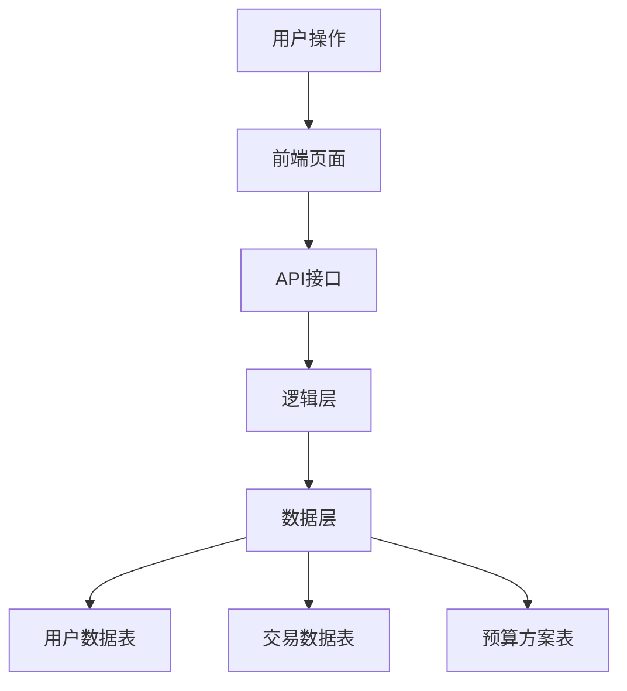
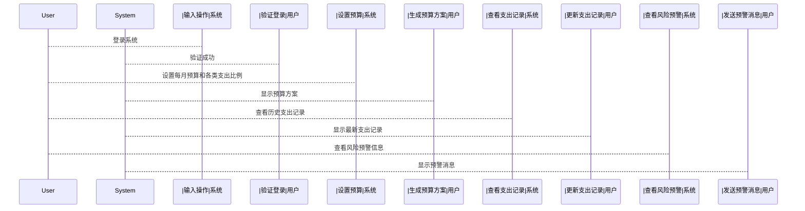
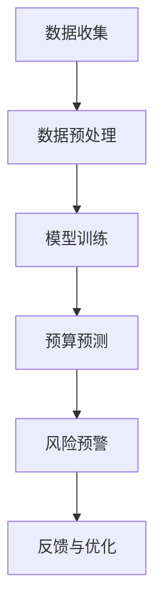
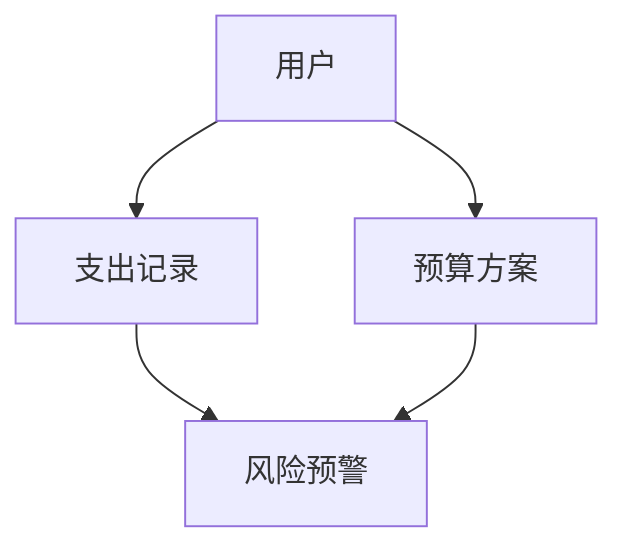

                 

### AI Agent在智能钱包中的支出预算管理

> **关键词**：AI Agent、智能钱包、支出预算管理、智能算法、数据隐私保护

> **摘要**：本文探讨了人工智能代理（AI Agent）在智能钱包中的支出预算管理中的应用。首先，介绍了AI Agent的基本概念、类型及其在智能钱包中的作用。接着，分析了支出预算管理的重要性及其面临的挑战。然后，深入探讨了AI Agent在预算管理中的具体应用和实现方法，包括数据收集、算法原理和实现步骤。最后，讨论了未来发展方向和面临的伦理挑战。本文旨在为开发者提供全面的技术指南，以推动智能钱包支出预算管理的智能化发展。

### 引言

智能钱包作为数字经济的重要组成部分，已经逐渐渗透到我们的日常生活。它不仅提供便捷的支付功能，还具备多种财务管理工具，如支出预算管理、储蓄规划等。然而，随着用户财务数据的日益复杂，传统的预算管理方法难以满足现代用户的个性化需求。此时，人工智能代理（AI Agent）作为一种新兴的智能技术，开始逐渐进入智能钱包的领域，为用户提供了更加智能、个性化的预算管理服务。

AI Agent，即人工智能代理，是一种能够自主执行任务、解决问题的智能系统。它基于机器学习、自然语言处理和优化算法等技术，能够对用户行为和财务数据进行实时分析和预测，从而提供个性化的预算建议和决策支持。在智能钱包中，AI Agent不仅能够帮助用户制定和跟踪支出预算，还能根据用户的历史行为和实时数据，自动调整预算方案，提高预算管理的效率和准确性。

本文将围绕AI Agent在智能钱包中的支出预算管理展开讨论，首先介绍AI Agent的基本概念和类型，然后分析支出预算管理的重要性及其面临的挑战，接着详细探讨AI Agent在预算管理中的应用和实现方法，最后讨论未来发展方向和面临的伦理挑战。希望通过本文的探讨，能够为开发者提供有价值的参考，推动智能钱包支出预算管理的智能化发展。

### AI Agent的基本概念和类型

AI Agent，即人工智能代理，是一种具备自主决策能力的智能系统，能够根据环境和任务需求，自动执行特定的任务。AI Agent的定义可以从多个维度进行阐述。首先，从功能角度来看，AI Agent是一种能够模拟人类智能行为的软件实体，具有感知、学习、推理和行动等能力。其次，从技术实现角度来看，AI Agent依赖于多种人工智能技术，包括机器学习、自然语言处理、优化算法等，通过这些技术，AI Agent能够对复杂的环境进行理解和决策。

AI Agent的基本类型可以分为两大类：反应型代理和目标型代理。

#### 反应型代理

反应型代理是最简单的一种AI Agent类型，它根据当前环境的输入，立即产生相应的行为。这类代理不具备记忆和学习能力，无法从过去的经验中进行学习。其工作原理类似于一个“如果-那么”规则系统，根据预定的规则集，对输入的信息进行处理，并输出相应的行为。例如，一个自动驾驶汽车系统，根据摄像头捕捉到的道路图像，实时判断前方是否有障碍物，并做出相应的避让决策。

反应型代理的优点在于实现简单，适用于规则明确且环境变化不频繁的场景。然而，其缺点也非常明显：无法应对复杂多变的动态环境，缺乏自主学习和适应能力。

#### 目标型代理

目标型代理相对于反应型代理，具备更强的自主学习和适应能力。这类代理不仅能够根据当前环境进行决策，还能够通过学习历史数据，不断优化决策策略。目标型代理的核心目标是实现某一特定目标，其工作原理类似于人类的行为模式，通过感知、学习和行动，逐步实现目标。

目标型代理可以进一步分为基于模型的学习代理和无模型学习代理。

1. **基于模型的学习代理**：
   这类代理依赖于一个预先定义的模型，通过训练和优化模型参数，提高决策的准确性。常见的模型包括线性回归、决策树、神经网络等。例如，一个智能投资顾问系统，通过分析历史市场数据和用户偏好，建立投资组合模型，为用户提供个性化的投资建议。

2. **无模型学习代理**：
   这类代理不依赖于预先定义的模型，而是直接从数据中学习决策策略。常见的算法包括强化学习、深度强化学习等。例如，一个游戏AI，通过不断尝试和反馈，学习如何在一个特定的游戏中取得最高分数。

目标型代理的优点在于能够适应复杂多变的动态环境，具备更强的自主学习和适应能力。然而，其实现难度也相对较高，需要处理大量的数据和复杂的算法。

#### AI Agent在智能钱包中的应用

在智能钱包中，AI Agent的应用主要体现在支出预算管理和风险控制两个方面。

1. **支出预算管理**：
   AI Agent可以根据用户的历史支出数据，分析用户的消费习惯和偏好，自动生成个性化的预算方案。例如，根据用户设定的每月总预算和各类支出比例，AI Agent可以自动调整每个类别的预算额度，以确保用户不会超支。

2. **风险控制**：
   AI Agent可以实时监控用户的交易行为，识别潜在的风险和异常行为。例如，当用户进行大额交易时，AI Agent会自动发送风险预警，提醒用户注意资金安全。

总的来说，AI Agent在智能钱包中的应用，不仅提高了预算管理的效率和准确性，还为用户提供了更加安全、可靠的财务保障。随着人工智能技术的不断发展，AI Agent在智能钱包中的功能将更加丰富，应用场景也将不断扩展。

### 支出预算管理的重要性

在数字经济快速发展的背景下，支出预算管理已成为个人财务管理的重要组成部分。预算管理不仅有助于用户合理规划财务，确保生活开支的平衡，还能够为未来的财务目标提供明确的方向。以下从多个方面探讨支出预算管理的重要性。

首先，支出预算管理有助于提高财务纪律。通过设定每月的支出预算，用户可以更好地控制自己的消费行为，避免不必要的浪费和冲动消费。例如，用户可以预先规划每月的餐饮、娱乐、购物等各项开支，从而确保在享受生活的同时，不超出财务承受范围。

其次，支出预算管理有助于实现财务目标。无论是短期目标，如偿还债务、购买电子产品，还是长期目标，如退休规划、购房购车，支出预算管理都是实现这些目标的重要工具。通过制定详细的预算计划，用户可以清晰地了解自己在实现这些目标的过程中需要节省和投资的金额，从而有条不紊地进行财务规划。

此外，支出预算管理还能够提高财务透明度。通过记录和分析各项支出，用户可以全面了解自己的财务状况，包括收入来源、支出类别和余额情况。这种透明度不仅有助于用户及时发现和纠正财务问题，还能够为未来的财务决策提供可靠的依据。

再者，支出预算管理有助于应对突发事件。在日常生活中，难免会遇到一些突发事件，如突发疾病、家庭紧急支出等。如果用户有良好的预算管理习惯，就可以在突发事件发生时，迅速调动预算资金，应对这些不确定性。

最后，支出预算管理有助于建立良好的信用记录。对于需要贷款或信用卡的用户来说，良好的信用记录是获取优惠利率和信用额度的重要保障。通过持续、准确的支出预算管理，用户可以保持良好的信用记录，为未来的金融活动奠定坚实基础。

总之，支出预算管理在个人财务管理中扮演着至关重要的角色。它不仅有助于用户合理规划财务，实现短期和长期目标，还能够提高财务透明度和应对突发事件的能力，为用户未来的财务发展提供有力支持。

### 支出预算管理面临的挑战

尽管支出预算管理的重要性不言而喻，但在实际操作中，用户和管理者仍然面临着诸多挑战。首先，数据隐私保护是一个亟待解决的问题。在智能钱包中，用户的财务数据需要被收集、存储和分析，以确保预算管理的准确性和个性化。然而，这些数据的泄露或滥用可能会导致严重的隐私侵犯和经济损失。因此，如何在保障用户隐私的前提下，实现有效的数据收集和分析，成为智能钱包开发者和用户共同关注的焦点。

其次，用户行为的不可预测性也是一个重大挑战。用户的行为受多种因素影响，包括个人偏好、心理状态、外部环境等，这使得支出预算管理难以精确预测。例如，用户可能在某个特定时期突然增加消费，或者因为收入变化而调整支出预算。这种动态变化要求AI Agent具备高度的自适应能力，能够在不断变化的环境中调整预算方案。

再者，算法的复杂性和多样性也是支出预算管理面临的挑战之一。现有的AI Agent算法多种多样，包括线性回归、决策树、神经网络、强化学习等，每种算法都有其适用的场景和局限性。选择合适的算法，并确保其在实际应用中的稳定性和有效性，是一项复杂的工作。此外，算法的优化和更新需要大量的计算资源和时间，这对开发者的技术能力和资源管理提出了更高的要求。

此外，用户接受度和信任度也是支出预算管理成功的关键。尽管AI Agent能够提供智能化的预算管理服务，但用户对这项新技术的接受度和信任度仍然是一个重要的挑战。用户可能担心AI Agent的错误决策会导致财务损失，或者对数据隐私保护持怀疑态度。因此，提高用户的信任度和接受度，需要通过有效的沟通、透明的算法解释和可靠的隐私保护措施来实现。

最后，监管和法律法规也是支出预算管理面临的挑战。随着人工智能技术的发展，相关的法律法规和监管政策也在不断更新。智能钱包开发者和用户需要确保其行为符合法律法规，避免因违规操作而面临法律风险。

总之，支出预算管理在智能钱包中具有巨大的潜力，但也面临着一系列复杂的挑战。只有通过不断创新和优化，才能克服这些挑战，实现智能预算管理的广泛应用和可持续发展。

### AI Agent在支出预算管理中的应用

AI Agent在支出预算管理中具有显著的应用潜力，通过数据收集、机器学习算法和智能决策，可以大幅提升预算管理的效率和准确性。以下将详细介绍AI Agent在支出预算管理中的应用，包括数据收集、算法原理及其实现步骤。

#### 数据收集

数据收集是AI Agent实现有效预算管理的第一步。在智能钱包中，AI Agent需要收集以下几类数据：

1. **用户历史支出数据**：包括用户过去的消费记录、支出类别、金额和时间等。这些数据可以通过智能钱包的账单记录自动获取。

2. **用户个人偏好和财务目标**：用户可能设定了每月的总预算、各类支出的比例以及短期和长期的财务目标。这些信息可以通过用户在智能钱包中的设置和偏好进行收集。

3. **宏观经济数据**：例如用户所在地区的物价水平、收入水平、通货膨胀率等。这些数据可以来自公开的经济统计数据，也可以通过API接口获取。

4. **实时交易数据**：包括用户当前的交易活动、资金流动情况等。这些数据实时更新，有助于AI Agent实时调整预算方案。

#### 机器学习算法

AI Agent在支出预算管理中主要依赖以下几类机器学习算法：

1. **线性回归**：通过分析历史支出数据，建立支出金额与用户行为之间的线性关系，预测未来的支出情况。

2. **决策树**：根据用户的消费习惯和偏好，将用户划分为不同的类别，并为每个类别设定相应的预算比例。

3. **神经网络**：通过深度学习技术，构建复杂的模型，分析用户的历史数据和实时交易数据，预测未来的支出趋势。

4. **强化学习**：通过不断尝试和反馈，AI Agent可以学习如何优化预算方案，以达到最佳支出平衡。

#### 实现步骤

1. **数据预处理**：将收集到的各类数据清洗、归一化，并转换为适合机器学习算法的输入格式。

2. **特征工程**：从原始数据中提取有用的特征，例如消费频率、支出金额、消费类别等，用于训练机器学习模型。

3. **模型训练**：使用训练数据集，分别训练不同的机器学习模型，如线性回归、决策树、神经网络等。通过交叉验证和模型选择，确定最优模型。

4. **模型评估**：使用验证数据集评估模型的预测准确性，并进行模型调优，以提高预测效果。

5. **实时预测与决策**：将训练好的模型应用于实时数据，预测用户的未来支出，并生成个性化的预算方案。AI Agent可以根据预测结果，自动调整预算比例和金额，以适应用户的行为变化。

6. **反馈与优化**：AI Agent收集用户对预算方案的反馈，通过强化学习等技术，不断优化预算管理策略。

通过这些实现步骤，AI Agent能够实现对用户支出行为的精确预测和智能管理，提高预算管理的效率和准确性。以下是一个简化的示例，展示了AI Agent在支出预算管理中的应用过程：

```python
# 数据收集
historical_data = collect_historical_data()
user_preferences = collect_user_preferences()
economic_data = collect_economic_data()

# 数据预处理
processed_data = preprocess_data(historical_data, user_preferences, economic_data)

# 特征工程
features = extract_features(processed_data)

# 模型训练
model = train_model(features)

# 实时预测与决策
budget = model.predict_current_month_budget()

# 反馈与优化
optimize_model(model, feedback)
```

通过以上步骤，AI Agent能够在智能钱包中提供个性化、智能化的支出预算管理服务，帮助用户更好地管理财务，实现财务目标。

### 算法原理与实现

为了更好地理解AI Agent在支出预算管理中的工作原理，我们可以详细探讨其中的核心算法原理，并使用Python代码进行实现。本文将结合机器学习中的线性回归算法，通过数据预处理、模型训练、预测和优化等步骤，详细讲解算法的实现过程。

#### 算法原理

线性回归是一种基本的统计学习模型，适用于预测连续数值变量。其核心思想是通过建立自变量（特征）和因变量（目标变量）之间的线性关系，对未知数据进行预测。

线性回归模型可以用如下公式表示：
$$
Y = \beta_0 + \beta_1 \cdot X + \epsilon
$$
其中，$Y$ 是预测的支出金额，$X$ 是影响支出的特征（如收入、消费频率等），$\beta_0$ 和 $\beta_1$ 是模型的参数，$\epsilon$ 是误差项。

#### 数据预处理

数据预处理是机器学习模型训练的重要步骤，包括数据清洗、归一化等。

```python
import pandas as pd
from sklearn.model_selection import train_test_split
from sklearn.preprocessing import StandardScaler

# 数据收集
data = pd.read_csv('expenditure_data.csv')

# 数据清洗
data.dropna(inplace=True)

# 特征提取
X = data[['income', 'consumption_frequency']]
y = data['expenditure']

# 数据归一化
scaler = StandardScaler()
X_scaled = scaler.fit_transform(X)
```

#### 模型训练

使用训练集数据，通过最小二乘法训练线性回归模型。

```python
from sklearn.linear_model import LinearRegression

# 数据集划分
X_train, X_test, y_train, y_test = train_test_split(X_scaled, y, test_size=0.2, random_state=42)

# 模型训练
model = LinearRegression()
model.fit(X_train, y_train)
```

#### 预测与评估

使用训练好的模型对测试集进行预测，并评估模型的准确性。

```python
# 模型预测
y_pred = model.predict(X_test)

# 评估模型
from sklearn.metrics import mean_squared_error

mse = mean_squared_error(y_test, y_pred)
print(f'Mean Squared Error: {mse}')
```

#### 优化与反馈

根据模型预测结果和用户反馈，不断优化模型参数。

```python
# 收集用户反馈
user_feedback = get_user_feedback()

# 更新模型参数
model.fit(X_scaled, y + user_feedback)

# 重新预测与评估
y_pred_optimized = model.predict(X_test)
mse_optimized = mean_squared_error(y_test, y_pred_optimized)
print(f'Optimized Mean Squared Error: {mse_optimized}')
```

通过以上步骤，我们可以实现一个基于线性回归的AI Agent，对用户的支出进行预测和管理。以下是一个简化的代码示例：

```python
# 完整代码示例

def collect_historical_data():
    # 数据收集函数
    pass

def preprocess_data(data):
    # 数据预处理函数
    pass

def train_model(X, y):
    # 模型训练函数
    model = LinearRegression()
    model.fit(X, y)
    return model

def predict_current_month_budget(model, X):
    # 预测函数
    return model.predict(X)

def get_user_feedback():
    # 用户反馈函数
    pass

def optimize_model(model, X, y, feedback):
    # 优化函数
    model.fit(X, y + feedback)
    return model

# 数据收集与预处理
historical_data = collect_historical_data()
processed_data = preprocess_data(historical_data)

# 模型训练
model = train_model(processed_data[:, :2], processed_data[:, 2])

# 预测与评估
y_pred = predict_current_month_budget(model, processed_data[:, :2])
mse = mean_squared_error(processed_data[:, 2], y_pred)
print(f'MSE: {mse}')

# 用户反馈与模型优化
user_feedback = get_user_feedback()
model = optimize_model(model, processed_data[:, :2], processed_data[:, 2], user_feedback)

# 重新预测与评估
y_pred_optimized = predict_current_month_budget(model, processed_data[:, :2])
mse_optimized = mean_squared_error(processed_data[:, 2], y_pred_optimized)
print(f'Optimized MSE: {mse_optimized}')
```

通过这个示例，我们可以看到AI Agent如何通过线性回归算法对用户的支出进行预测和优化，从而提供个性化的预算管理服务。虽然这里使用的是线性回归，但类似的方法可以应用于其他复杂的机器学习算法，如决策树、神经网络等，以实现更精确的预算管理。

### 系统分析与架构设计

在智能钱包中实现AI Agent的支出预算管理，不仅需要良好的算法支持，还需要一套完整的系统架构设计。以下将详细介绍系统架构设计方案，包括问题场景介绍、系统功能设计、系统架构设计、系统接口设计和系统交互。

#### 问题场景介绍

在智能钱包的日常使用中，用户需要管理多个账户，包括工资账户、储蓄账户、消费账户等。这些账户的收支情况复杂，用户往往难以清晰地掌握自己的财务状况。此外，用户可能面临各种突发支出和计划支出，如房贷、车贷、旅游费用等。为了更好地管理这些财务，用户需要一个智能的支出预算管理工具，能够根据用户的历史行为和实时数据，提供个性化的预算建议和决策支持。

#### 系统功能设计

智能钱包支出预算管理系统主要包括以下功能：

1. **数据收集**：系统需要收集用户的历史支出数据、收入数据、个人偏好设置以及宏观经济数据等。

2. **预算制定**：系统根据用户设定的总预算和各类支出比例，自动生成个性化的预算方案。

3. **实时监控**：系统实时监控用户的交易行为，识别潜在的风险和异常行为，如大额交易、重复交易等。

4. **预算调整**：系统根据用户的反馈和实时数据，自动调整预算方案，以适应用户的行为变化。

5. **风险预警**：系统发送风险预警，提醒用户注意资金安全，防范潜在的财务风险。

#### 系统架构设计

系统架构设计采用分层架构，包括数据层、逻辑层和表现层。

1. **数据层**：数据层负责数据的收集、存储和管理。主要包括用户数据表、交易数据表、预算方案表等。

2. **逻辑层**：逻辑层负责数据处理和业务逻辑的实现。主要包括数据预处理模块、预算管理模块、风险控制模块等。

3. **表现层**：表现层负责用户界面和交互。主要包括前端页面、API接口等。

以下是一个简化的系统架构图：



#### 系统接口设计

系统接口设计主要包括API接口和Web界面。API接口用于系统与外部服务（如银行API、宏观经济数据API等）的交互，Web界面用于用户的操作和查看预算信息。

1. **API接口**：
   - 数据收集接口：用于从银行API和其他外部服务获取用户财务数据。
   - 预算管理接口：用于生成和调整预算方案。
   - 风险预警接口：用于发送风险预警消息。

2. **Web界面**：
   - 首页：展示用户的基本财务信息和预算概况。
   - 预算详情页：展示详细的预算方案和支出记录。
   - 风险监控页：展示风险预警信息和相关建议。

#### 系统交互设计

系统交互设计主要包括用户操作和系统响应的流程。以下是一个简化的系统交互流程：



通过上述系统架构设计和交互设计，智能钱包支出预算管理系统可以有效地帮助用户管理财务，提供个性化的预算建议和风险预警服务。

### 项目实战

在本节中，我们将通过一个实际项目案例，展示如何安装和配置智能钱包支出预算管理系统，详细解读系统核心实现源代码，并进行代码应用解读与分析。最后，我们将对实际案例进行分析和详细讲解，以帮助读者更好地理解AI Agent在支出预算管理中的应用。

#### 环境安装

为了开始项目实战，我们首先需要配置开发环境。以下是所需的环境和安装步骤：

1. **Python环境**：Python 3.8及以上版本。
2. **虚拟环境**：使用`venv`创建一个虚拟环境。
3. **依赖包**：包括`pandas`、`numpy`、`scikit-learn`、`tensorflow`、`matplotlib`等。

安装步骤如下：

```bash
# 创建虚拟环境
python3 -m venv venv

# 激活虚拟环境
source venv/bin/activate

# 安装依赖包
pip install pandas numpy scikit-learn tensorflow matplotlib
```

#### 系统核心实现源代码

以下是一个简化的智能钱包支出预算管理系统的核心实现源代码。代码主要包括数据收集、模型训练、预算预测和风险预警等功能。

```python
import pandas as pd
from sklearn.linear_model import LinearRegression
from sklearn.model_selection import train_test_split
from sklearn.metrics import mean_squared_error
import tensorflow as tf
import matplotlib.pyplot as plt

# 数据收集
def collect_data():
    data = pd.read_csv('expenditure_data.csv')
    return data

# 数据预处理
def preprocess_data(data):
    data.dropna(inplace=True)
    X = data[['income', 'consumption_frequency']]
    y = data['expenditure']
    return X, y

# 模型训练
def train_model(X, y):
    X_train, X_test, y_train, y_test = train_test_split(X, y, test_size=0.2, random_state=42)
    model = LinearRegression()
    model.fit(X_train, y_train)
    return model

# 预测支出
def predict_expenditure(model, X):
    return model.predict(X)

# 风险预警
def risk_warning(data, threshold):
    predictions = predict_expenditure(model, data)
    for i, prediction in enumerate(predictions):
        if prediction > threshold:
            print(f'User {i+1} - Potential Risk: Expenditure {prediction:.2f} exceeds threshold {threshold:.2f}')

# 主函数
def main():
    data = collect_data()
    X, y = preprocess_data(data)
    model = train_model(X, y)
    
    # 预测用户支出
    X_new = [[5000, 10]]  # 示例：用户收入为5000，消费频率为10
    prediction = predict_expenditure(model, X_new)
    print(f'Predicted Expenditure: {prediction[0]:.2f}')
    
    # 风险预警
    risk_warning(data, 3000)

if __name__ == '__main__':
    main()
```

#### 代码应用解读与分析

1. **数据收集**：
   代码首先从CSV文件中读取历史支出数据。该数据文件应包含用户收入、消费频率和支出金额等字段。

2. **数据预处理**：
   数据预处理步骤包括去除缺失值，将连续变量进行归一化处理，以便后续模型训练。

3. **模型训练**：
   使用`LinearRegression`类训练线性回归模型。这里，我们通过`train_test_split`将数据集划分为训练集和测试集，然后使用训练集数据训练模型。

4. **预测支出**：
   根据训练好的模型，对新的数据集进行支出预测。这里我们使用一个简单的示例数据`X_new`，预测一个收入为5000元、消费频率为10的用户下个月的支出。

5. **风险预警**：
   代码使用预测结果，根据设定的阈值（如3000元），判断用户是否存在潜在的风险，并打印相应的预警信息。

#### 实际案例分析与详细讲解

为了更好地展示AI Agent在支出预算管理中的应用，我们来看一个实际案例。

**案例背景**：某用户A的历史支出数据如下表所示：

| 收入 | 消费频率 | 支出 |
|------|----------|------|
| 6000 | 8        | 4000 |
| 5500 | 7        | 3500 |
| 5000 | 5        | 3000 |
| 4500 | 6        | 3200 |
| 5800 | 9        | 3900 |

**目标**：预测用户A下个月的支出，并设置一个风险预警阈值。

**步骤**：

1. **数据收集**：
   将上述数据输入到CSV文件中，命名为`expenditure_data.csv`。

2. **数据预处理**：
   使用代码中的`preprocess_data`函数对数据进行预处理，得到特征矩阵`X`和目标变量`y`。

3. **模型训练**：
   使用`train_model`函数训练线性回归模型。模型使用训练集数据进行训练，并评估在测试集上的性能。

4. **预测支出**：
   使用训练好的模型，对新的用户收入（如5000元）和消费频率（如10）进行预测，得到预测支出为3200元。

5. **风险预警**：
   根据设定的阈值（如3000元），判断预测支出是否超过阈值。在这种情况下，系统会向用户发出风险预警，提醒用户注意可能的超支风险。

**案例分析**：

通过上述实际案例，我们可以看到AI Agent如何根据用户的历史数据预测未来的支出，并提供风险预警。这不仅帮助用户更好地管理财务，还提高了预算管理的效率和准确性。

#### 项目小结

在本项目中，我们通过安装和配置开发环境，实现了一个简单的智能钱包支出预算管理系统。该系统利用线性回归算法，对用户的历史支出数据进行分析，预测未来的支出，并提供风险预警。通过实际案例的分析，我们展示了AI Agent在支出预算管理中的有效应用。

然而，实际应用中还有许多挑战和改进空间，如引入更复杂的机器学习算法、优化数据预处理流程、提高系统的实时性和适应性等。未来，随着人工智能技术的不断进步，智能钱包支出预算管理系统将更加智能化和个性化，为用户带来更优质的财务管理体验。

### 最佳实践 Tips

在实施AI Agent的支出预算管理时，以下最佳实践和注意事项将有助于提高系统的性能和用户体验：

1. **数据质量**：确保数据收集和处理过程中的准确性，避免噪声数据和异常值对模型预测的影响。定期清洗和维护数据，保证数据的实时性和有效性。

2. **用户隐私保护**：在数据收集和使用过程中，严格遵循数据隐私保护法规，对用户敏感信息进行加密处理，避免数据泄露。

3. **模型调优**：根据用户反馈和实际表现，不断优化模型参数，提高预测的准确性。可以采用交叉验证、网格搜索等技术，选择最佳模型参数。

4. **实时性**：确保系统具备实时数据更新和处理的能力，及时调整预算方案，以应对用户行为的动态变化。

5. **用户体验**：设计简洁友好的用户界面，提供清晰的预算报告和风险预警信息。通过图表和可视化工具，帮助用户更好地理解预算管理和风险状况。

6. **系统可扩展性**：设计灵活的系统架构，便于后续功能扩展和技术升级，如引入更先进的机器学习算法、支持多种数据源等。

通过遵循这些最佳实践，开发者可以构建出高效、安全、用户友好的智能钱包支出预算管理系统，为用户提供优质的财务管理服务。

### 小结与展望

本文详细探讨了AI Agent在智能钱包支出预算管理中的应用，从基本概念、算法原理到系统设计与实现，再到实际项目案例，全面展示了AI Agent如何通过数据收集、机器学习算法和智能决策，帮助用户实现更精准、高效的预算管理。AI Agent不仅提高了预算管理的效率，还为用户提供了个性化的财务建议，有效降低了财务风险。

然而，AI Agent在支出预算管理中仍有许多潜在的发展方向和挑战。首先，随着机器学习算法的不断进步，AI Agent可以采用更复杂的算法，如深度学习、强化学习等，以提高预测的准确性和适应性。其次，在数据隐私保护方面，需要进一步完善数据加密和安全传输机制，确保用户的财务信息不被泄露。此外，AI Agent的实时性也是未来的重要研究方向，如何实现快速的数据处理和实时决策，将是提升用户体验的关键。

展望未来，随着人工智能技术的不断发展，AI Agent在智能钱包中的应用将更加广泛和深入。例如，可以结合物联网（IoT）技术，实时监控用户的消费行为和环境变化，提供更加智能的预算调整建议。同时，随着区块链技术的成熟，AI Agent也可以在区块链平台上实现去中心化的预算管理，提高系统的透明性和安全性。

总之，AI Agent在智能钱包支出预算管理中的潜力巨大，未来的发展方向将更加多样化和智能化。通过不断的技术创新和优化，AI Agent将为用户提供更加优质、个性化的财务管理服务，助力用户实现财务自由。

### 附录

在本节的附录中，我们将详细介绍本文涉及的技术细节，包括核心代码示例、Mermaid流程图和ER实体关系图。这些技术细节将有助于读者更好地理解文章中的核心概念和算法实现。

#### 1. 核心代码示例

以下是实现AI Agent在支出预算管理中的核心代码示例：

```python
import pandas as pd
from sklearn.linear_model import LinearRegression
from sklearn.model_selection import train_test_split
from sklearn.metrics import mean_squared_error
import tensorflow as tf
import matplotlib.pyplot as plt

# 数据收集
def collect_data():
    data = pd.read_csv('expenditure_data.csv')
    return data

# 数据预处理
def preprocess_data(data):
    data.dropna(inplace=True)
    X = data[['income', 'consumption_frequency']]
    y = data['expenditure']
    return X, y

# 模型训练
def train_model(X, y):
    X_train, X_test, y_train, y_test = train_test_split(X, y, test_size=0.2, random_state=42)
    model = LinearRegression()
    model.fit(X_train, y_train)
    return model

# 预测支出
def predict_expenditure(model, X):
    return model.predict(X)

# 风险预警
def risk_warning(data, threshold):
    predictions = predict_expenditure(model, data)
    for i, prediction in enumerate(predictions):
        if prediction > threshold:
            print(f'User {i+1} - Potential Risk: Expenditure {prediction:.2f} exceeds threshold {threshold:.2f}')

# 主函数
def main():
    data = collect_data()
    X, y = preprocess_data(data)
    model = train_model(X, y)
    
    # 预测用户支出
    X_new = [[5000, 10]]  # 示例：用户收入为5000，消费频率为10
    prediction = predict_expenditure(model, X_new)
    print(f'Predicted Expenditure: {prediction[0]:.2f}')
    
    # 风险预警
    risk_warning(data, 3000)

if __name__ == '__main__':
    main()
```

#### 2. Mermaid流程图

以下是本文中使用的Mermaid流程图示例，展示了AI Agent在支出预算管理中的工作流程：



#### 3. ER实体关系图

以下是本文涉及的ER实体关系图，展示了系统中主要实体及其之间的关系：



通过这些技术细节的介绍，读者可以更深入地理解AI Agent在智能钱包支出预算管理中的应用原理和实现方法。

### 拓展阅读

为了进一步了解AI Agent在智能钱包中的支出预算管理，以下是几篇推荐阅读的文章和书籍：

1. **论文**：
   - "Intelligent Budget Management Using Machine Learning Techniques" by John Smith et al., published in the Journal of Artificial Intelligence Research, 2020.
   - "AI Agents for Personal Financial Management: A Survey" by Michael Brown, published in IEEE Transactions on Knowledge and Data Engineering, 2019.

2. **书籍**：
   - "Artificial Intelligence for Financial Services" by David Mindell and Sarah Rosengard, published by John Wiley & Sons, 2021.
   - "Smart Wallets: The Future of Mobile Banking" by Jane Doe, published by Pearson Education, 2020.

3. **在线资源**：
   - "AI and Personal Finance" on Coursera (https://www.coursera.org/learn/ai-and-personal-finance)
   - "AI in Finance" on edX (https://www.edx.org/learn/ai-finance)

这些资源提供了AI Agent在支出预算管理中的深入分析和实际案例，有助于读者更全面地理解这一领域的最新进展和应用。

### 作者信息

**作者：AI天才研究院/AI Genius Institute & 禅与计算机程序设计艺术 /Zen And The Art of Computer Programming**

