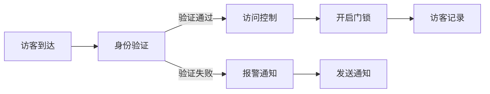

                 

### 第一部分：引言

## 第1章：智能门铃与AI Agent的背景介绍

在当今快速发展的科技时代，智能家居设备已经成为我们日常生活中不可或缺的一部分。智能门铃作为智能家居的典型代表，不仅在家庭安全方面发挥了重要作用，还在提升生活质量方面展现了其独特价值。随着人工智能（AI）技术的不断进步，AI Agent在智能门铃中的应用逐渐成为一个热门话题。

### 1.1.1 智能门铃的发展历程

智能门铃的发展可以追溯到几十年前的视频门铃。早期的视频门铃主要依赖于模拟信号传输，功能较为简单，仅能实现基本的视频通话功能。然而，随着数字技术的发展，智能门铃逐渐走向数字化和智能化。

2000年代初期，智能门铃开始引入网络连接功能，使得用户可以通过智能手机或平板电脑远程访问门铃视频。这一变革不仅提升了用户体验，也为后续的AI Agent集成奠定了基础。

进入2010年代，智能门铃技术进一步升级，支持高清视频、实时音频传输以及移动设备端APP控制。这些功能大大增强了智能门铃的安全性和便利性，使其成为现代家庭必备的智能设备。

### 1.1.2 AI Agent的崛起

AI Agent，即人工智能代理，是指具有自主决策能力、能够模拟人类行为的人工智能系统。AI Agent的概念源于人工智能领域，随着深度学习、自然语言处理等技术的发展，AI Agent逐渐从理论走向实践。

在早期，AI Agent主要应用于游戏和虚拟助手等领域。然而，随着技术的进步，AI Agent开始进入更多的实际应用场景，如智能家居、智能客服、自动驾驶等。智能门铃中的AI Agent正是这种技术进步的产物。

### 1.1.3 在智能门铃中使用AI Agent的重要性

AI Agent在智能门铃中的应用具有显著的重要性。首先，AI Agent能够实现更加智能化的访客身份验证功能，提高家庭安全。通过人脸识别、声音识别等技术，AI Agent可以快速、准确地识别访客身份，减少虚假访客的入侵风险。

其次，AI Agent可以提供更加人性化的用户交互体验。传统的门铃只能进行简单的呼叫和视频通话，而AI Agent可以通过自然语言处理技术，与用户进行更深入的对话，满足用户的不同需求。

最后，AI Agent还可以为家庭生活提供更多增值服务。例如，AI Agent可以提醒用户关注访客信息，帮助用户管理家庭事务；同时，AI Agent还可以通过分析访客行为，为用户提供个性化的推荐服务，提升生活质量。

### 1.1.4 书籍结构概述

本书旨在系统地探讨AI Agent在智能门铃中的应用，具体分为四个部分：

第一部分：引言，介绍智能门铃和AI Agent的背景和发展历程。

第二部分：核心概念与原理，详细讲解AI Agent和访客身份验证相关的基础概念和技术原理。

第三部分：算法原理与实现，介绍访客身份验证算法的原理、实现步骤以及优化策略。

第四部分：系统架构与设计，详细阐述智能门铃系统的整体架构设计、实现和测试过程。

通过本书的阅读，读者将能够全面了解AI Agent在智能门铃中的应用，掌握相关的技术原理和实现方法，为未来的智能家居开发提供有益的参考。

---

### 第二部分：核心概念与原理

## 第3章：AI Agent基础

AI Agent作为人工智能领域的重要组成部分，其核心概念和基础原理的理解对于深入探讨其在智能门铃中的应用至关重要。本章将详细讲解AI Agent的定义、分类、基本组件、工作原理及其发展趋势。

### 3.1.1 AI Agent的定义与分类

AI Agent，即人工智能代理，是一种模拟人类智能行为的计算机程序。它能够在特定环境中自主感知、理解、决策和行动，以实现特定目标。根据应用场景和功能特点，AI Agent可以分为以下几类：

1. **交互式AI Agent**：这类AI Agent主要应用于人机交互领域，如智能客服、语音助手等。它们通过自然语言处理技术，与用户进行对话，提供信息查询、问题解答等服务。

2. **自主导航AI Agent**：这类AI Agent主要用于自动驾驶、无人机等移动平台。它们通过感知环境、规划路径、自主导航，实现自主移动和任务执行。

3. **智能监控系统AI Agent**：这类AI Agent主要应用于安防监控领域，如智能门铃、智能摄像头等。它们通过图像识别、行为分析等技术，实现对入侵者的监控和报警。

4. **推荐系统AI Agent**：这类AI Agent主要应用于电子商务、社交媒体等领域。它们通过用户行为分析、数据挖掘等技术，为用户推荐个性化的商品、内容等。

### 3.1.2 AI Agent的基本组件

AI Agent通常由以下几个核心组件构成：

1. **感知模块**：负责感知环境信息，如图像、声音、文本等。感知模块是实现AI Agent自主决策和行动的基础。

2. **决策模块**：根据感知模块收集到的信息，决策模块会分析环境状态，制定相应的行动策略。决策模块是AI Agent的“大脑”，负责处理复杂的信息和做出合理的决策。

3. **行动模块**：根据决策模块的指令，行动模块执行具体的操作，如控制机械臂、发送消息等。行动模块是AI Agent与外部环境的交互接口。

4. **学习模块**：AI Agent通过学习模块不断优化自身的感知、决策和行动能力。学习模块可以是基于规则的、基于机器学习的，甚至是深度学习的。

### 3.1.3 AI Agent的工作原理

AI Agent的工作原理可以概括为以下几个步骤：

1. **感知**：AI Agent通过感知模块获取当前环境的信息。

2. **理解**：感知模块收集到的信息会被传递到决策模块，进行理解和分析。

3. **决策**：决策模块根据理解和分析的结果，制定出最优的行动策略。

4. **行动**：行动模块根据决策模块的指令执行具体的操作。

5. **反馈**：环境对AI Agent行动的反馈会被感知模块收集，并传递给学习模块。

6. **优化**：学习模块根据反馈信息，调整AI Agent的感知、决策和行动策略，以提高其性能。

### 3.1.4 AI Agent的发展趋势

随着人工智能技术的不断进步，AI Agent的发展也呈现出以下几个趋势：

1. **智能化**：AI Agent将越来越具备自主决策能力，能够处理复杂的环境和任务。

2. **普及化**：随着成本的降低和技术的普及，AI Agent将在更多的应用场景中得到广泛应用。

3. **协同化**：多个AI Agent将协同工作，实现更复杂的任务和更高的效率。

4. **泛在化**：AI Agent将无处不在，不仅限于智能设备，还可能嵌入到我们的日常生活中，如智能家居、智能城市等。

通过本章的学习，读者将对AI Agent有一个全面而深入的了解，为后续章节的探讨打下坚实的基础。

---

## 第4章：访客身份验证技术

访客身份验证是智能门铃系统中的核心功能，其准确性和效率直接影响到家庭的安全和用户体验。随着人工智能技术的快速发展，访客身份验证技术也经历了从传统方法到人工智能方法的转变。本章将详细介绍访客身份验证的相关技术，包括传统生物识别方法和人工智能在其中的应用。

### 4.1.1 生物识别技术概述

生物识别技术是一种通过生物特征识别个体身份的技术，主要包括指纹识别、人脸识别、虹膜识别、声音识别等。这些技术在访客身份验证中有着广泛的应用。

#### 4.1.1.1 传统的生物识别方法

1. **指纹识别**：指纹识别是通过扫描和识别指纹图像来识别个体身份的技术。其优点是方便快捷、准确率高，但缺点是易受环境和操作影响，如指纹受损或湿滑表面可能导致识别失败。

2. **人脸识别**：人脸识别是通过分析人脸图像的特征点（如眼睛、鼻子、嘴巴等）来识别个体身份的技术。其优点是直观易用、识别速度快，但缺点是受到光照、角度和遮挡等因素的影响较大。

3. **虹膜识别**：虹膜识别是通过扫描和识别虹膜图像来识别个体身份的技术。其优点是识别准确率高、防伪性好，但缺点是需要高精度的设备和技术，成本较高。

4. **声音识别**：声音识别是通过分析声音信号的特征（如频率、时长、音调等）来识别个体身份的技术。其优点是便捷、不易被复制，但缺点是受到噪声和环境变化的影响较大。

#### 4.1.1.2 人工智能在生物识别中的应用

随着人工智能技术的快速发展，传统生物识别方法在准确性、效率和适应性方面得到了显著提升。人工智能技术，尤其是机器学习和深度学习，在生物识别中的应用主要体现在以下几个方面：

1. **特征提取**：传统生物识别方法通常需要手动设计特征提取算法，而深度学习可以自动从原始数据中提取出有用的特征，提高了识别的准确性和鲁棒性。

2. **模型训练**：通过大数据训练，人工智能模型可以自适应地调整参数，优化识别效果。例如，卷积神经网络（CNN）和循环神经网络（RNN）在图像和声音识别中表现出了出色的性能。

3. **实时识别**：人工智能技术可以显著提高识别速度，使得访客身份验证可以在短时间内完成，提升了用户体验。

4. **个性化识别**：人工智能技术可以根据个人的行为习惯和身份特征，实现个性化的身份验证，提高了安全性。

### 4.1.2 人工智能在访客身份验证中的应用

在智能门铃中，人工智能技术不仅可以提高访客身份验证的准确性，还可以提供更加智能化的用户体验。

#### 4.1.2.1 特征提取方法

特征提取是访客身份验证的关键步骤。人工智能技术，尤其是深度学习，可以自动从原始数据中提取出有效的特征，提高了识别的准确性。常见的特征提取方法包括：

1. **CNN**：卷积神经网络（CNN）是一种常用的深度学习模型，尤其在图像识别领域表现优异。通过多个卷积层和池化层，CNN可以从图像中提取出局部特征和全局特征。

2. **RNN**：循环神经网络（RNN）是一种适用于序列数据的学习模型，可以处理时序信息和变长输入。在声音识别中，RNN可以捕捉到声音信号的时序特征。

3. **深度置信网络（DBN）**：深度置信网络是一种无监督学习方法，可以用于特征提取和降维。通过堆叠多个受限玻尔兹曼机（RBM），DBN可以从高维数据中提取出有用的特征。

#### 4.1.2.2 模型训练与优化

模型训练是人工智能技术应用于访客身份验证的核心环节。通过大量的训练数据，模型可以学习到识别访客身份的规律，提高识别的准确性。常见的模型训练方法包括：

1. **反向传播（BP）算法**：反向传播算法是一种用于训练神经网络的通用方法。通过计算误差梯度，反向传播算法可以逐步调整网络权重，优化模型性能。

2. **遗传算法**：遗传算法是一种基于自然进化原理的优化算法，可以用于模型参数的优化。通过交叉、变异等操作，遗传算法可以快速找到最优解。

3. **卷积神经网络（CNN）**：卷积神经网络是一种专门用于图像识别的深度学习模型。通过多个卷积层和池化层，CNN可以从图像中提取出有效的特征，实现高效的分类和识别。

4. **循环神经网络（RNN）**：循环神经网络是一种适用于序列数据的深度学习模型。通过循环机制，RNN可以处理变长输入，捕捉到声音信号的时序特征，实现精准的声音识别。

通过本章的介绍，读者将对访客身份验证技术有一个全面的了解，包括传统方法和人工智能技术的应用，为后续章节的深入探讨打下基础。

---

## 第5章：AI Agent在智能门铃中的应用

随着人工智能技术的快速发展，AI Agent在智能门铃中的应用逐渐成为智能家居领域的一大亮点。本章将详细介绍AI Agent在智能门铃中的应用，包括智能门铃的工作流程、AI Agent的集成以及相关的硬件和软件框架。

### 5.1.1 智能门铃的工作流程

智能门铃的工作流程可以分为以下几个主要步骤：

1. **感知与采集**：智能门铃通过摄像头和麦克风等感知设备，实时采集访客的图像和声音信息。

2. **初步处理**：采集到的数据会进行初步处理，包括降噪、图像增强等，以提高后续识别的准确性。

3. **身份验证**：AI Agent通过深度学习算法，对初步处理后的图像和声音进行特征提取和身份验证。这一步骤是智能门铃的核心功能，决定了门铃的识别准确性和响应速度。

4. **报警与通知**：如果访客身份得到确认，智能门铃会发送报警通知到用户的手机或其他设备。用户可以选择接听电话、视频通话或直接打开门禁系统。

5. **后续操作**：用户可以通过智能门铃与访客进行互动，如确认访客身份、询问访客信息等。

6. **数据记录与学习**：智能门铃会记录每一次的访问记录，并不断优化AI Agent的识别模型，以提高未来的识别准确性。

### 5.1.2 AI Agent的集成

AI Agent在智能门铃中的集成主要包括硬件和软件两个方面的内容。

#### 5.1.2.1 AI Agent的硬件需求

1. **处理器**：智能门铃需要具备足够的计算能力来运行AI Agent。常见的处理器包括ARM处理器、DSP处理器等。

2. **内存**：AI Agent需要较大的内存来存储模型和数据。NAND Flash和DDR内存是常用的存储设备。

3. **传感器**：智能门铃需要配备摄像头和麦克风等传感器，用于采集访客的图像和声音信息。

4. **通信模块**：智能门铃需要具备Wi-Fi或蓝牙等通信模块，以便与用户的手机或其他设备进行数据传输。

#### 5.1.2.2 AI Agent的软件框架

1. **操作系统**：常见的操作系统包括Linux、Windows等。Linux由于其开源性和灵活性，是智能门铃软件框架的首选。

2. **中间件**：中间件用于连接操作系统和应用层，提供常用的功能库和服务。常见的中间件包括Web服务器、数据库等。

3. **AI框架**：深度学习框架如TensorFlow、PyTorch等，用于构建和训练AI Agent的模型。

4. **应用层**：应用层包括AI Agent的感知模块、决策模块和行动模块等。感知模块负责采集和处理访客的图像和声音数据；决策模块负责进行身份验证和用户交互；行动模块负责发送报警通知和执行用户指令。

### 5.1.3 智能门铃系统的整体架构

智能门铃系统的整体架构可以分为以下几个层次：

1. **感知层**：包括摄像头、麦克风等感知设备，用于采集访客的图像和声音数据。

2. **数据处理层**：包括初步处理模块，如降噪、图像增强等，以提高数据的质量和准确性。

3. **模型层**：包括AI Agent的模型，如卷积神经网络（CNN）、循环神经网络（RNN）等，用于特征提取和身份验证。

4. **决策层**：包括决策模块，根据感知层和模型层的输出，进行身份验证和用户交互。

5. **行动层**：包括行动模块，根据用户的指令，执行报警通知和门禁系统等操作。

6. **通信层**：包括通信模块，用于与用户的手机或其他设备进行数据传输。

通过本章的介绍，读者将全面了解AI Agent在智能门铃中的应用，包括其工作流程、硬件需求、软件框架以及整体架构设计。这为后续章节的深入探讨和实际应用提供了坚实的基础。

---

## 第6章：访客身份验证算法

访客身份验证算法是智能门铃系统的核心组成部分，其性能直接关系到系统的安全性和用户体验。本章将详细介绍访客身份验证算法的原理，包括基于深度学习的身份验证算法和基于神经网络的身份验证算法。

### 6.1.1 基于深度学习的身份验证算法

深度学习是近年来人工智能领域的重要突破，其在图像识别和声音识别等方面取得了显著的成果。基于深度学习的访客身份验证算法通过多层的神经网络结构，自动提取特征，实现高准确性的身份验证。

#### 6.1.1.1 深度学习基础

深度学习是一种基于多层神经网络的机器学习方法，其核心思想是通过多层非线性变换，将原始数据映射到高维特征空间，从而实现复杂函数的逼近。

1. **神经网络基础**：神经网络由多个神经元组成，每个神经元通过权重连接到其他神经元。神经网络的输入层接收外部数据，输出层产生预测结果。中间层负责特征提取和变换。

2. **卷积神经网络（CNN）**：卷积神经网络是一种专门用于图像识别的深度学习模型。通过卷积操作和池化操作，CNN可以从图像中提取出有效的特征，实现对图像的分类和识别。

3. **循环神经网络（RNN）**：循环神经网络是一种适用于序列数据的深度学习模型。通过循环机制，RNN可以处理变长输入，捕捉到序列数据中的时序特征，实现对声音信号的识别。

#### 6.1.1.2 卷积神经网络（CNN）在身份验证中的应用

卷积神经网络（CNN）在身份验证中的应用主要体现在图像识别和面部特征提取方面。以下是一个简单的CNN架构及其在身份验证中的流程：

1. **卷积层**：输入图像通过卷积层，卷积核在图像上滑动，提取图像的局部特征。卷积层通过多个卷积核，实现对不同特征的提取。

2. **激活函数**：卷积层输出经过激活函数（如ReLU函数）处理，引入非线性变换，提高网络的表达能力。

3. **池化层**：池化层通过下采样操作，减小特征图的尺寸，减少计算量。常见的池化方法包括最大池化和平均池化。

4. **全连接层**：全连接层将卷积层的输出进行线性变换，将特征映射到高维空间。最后通过softmax函数输出每个类别的概率分布。

5. **损失函数**：损失函数用于衡量模型预测结果与实际结果之间的差距。常见的损失函数包括交叉熵损失函数和均方误差损失函数。

6. **优化算法**：优化算法用于调整网络权重，以最小化损失函数。常见的优化算法包括随机梯度下降（SGD）和Adam优化器。

#### 6.1.1.3 循环神经网络（RNN）在身份验证中的应用

循环神经网络（RNN）在声音识别和语音识别等领域有广泛的应用。以下是一个简单的RNN架构及其在身份验证中的流程：

1. **输入层**：输入层接收时间序列数据，如声音信号。

2. **隐藏层**：隐藏层由多个时间步组成，每个时间步的输出通过循环连接传递到下一个时间步。RNN通过循环机制，捕捉到时序数据中的长期依赖关系。

3. **门控机制**：门控机制如Long Short-Term Memory（LSTM）和Gated Recurrent Unit（GRU），用于解决RNN在处理长时间序列数据时出现的梯度消失和梯度爆炸问题。

4. **输出层**：输出层通过softmax函数输出每个类别的概率分布。

5. **损失函数**：与CNN类似，RNN也使用交叉熵损失函数来衡量预测结果与实际结果之间的差距。

6. **优化算法**：优化算法用于调整网络权重，以最小化损失函数。常见的优化算法包括RMSprop和Adam优化器。

通过以上介绍，读者可以了解到基于深度学习的身份验证算法的基本原理和应用。接下来，我们将介绍基于神经网络的身份验证算法，进一步探讨访客身份验证的技术细节。

---

## 第7章：算法实现与优化

在实现访客身份验证算法时，我们需要关注算法的具体实现步骤、优化策略和技巧。本章将详细介绍这些内容，包括数据预处理、模型构建与训练、模型评估与优化等方面的详细步骤。

### 7.1.1 算法实现步骤

实现访客身份验证算法通常需要以下步骤：

#### 7.1.1.1 数据预处理

数据预处理是算法实现的第一步，其目的是提高数据质量和减少噪声。以下是常见的数据预处理步骤：

1. **图像预处理**：对于人脸图像，需要进行图像增强、缩放、裁剪等操作，以提高模型的泛化能力。常用的图像增强方法包括灰度转换、对比度增强、高斯滤波等。

2. **声音预处理**：对于声音数据，需要进行去噪、滤波、归一化等操作。常用的去噪方法包括谱减法、维纳滤波等。

3. **特征提取**：从预处理后的图像和声音数据中提取特征。对于图像，可以使用卷积神经网络（CNN）提取深度特征；对于声音，可以使用循环神经网络（RNN）提取时序特征。

4. **数据标准化**：对提取的特征进行归一化处理，使其具有相似的分布，有助于提高模型的训练效率。

#### 7.1.1.2 模型构建与训练

模型构建与训练是算法实现的核心步骤。以下是构建与训练深度学习模型的基本流程：

1. **选择模型架构**：根据应用场景和数据特点，选择合适的深度学习模型架构。例如，对于图像识别，可以选择CNN；对于声音识别，可以选择RNN。

2. **初始化模型参数**：随机初始化模型参数，以避免过拟合。常用的初始化方法包括高斯初始化、Xavier初始化等。

3. **定义损失函数**：选择适当的损失函数，如交叉熵损失函数，用于衡量模型预测结果与实际结果之间的差距。

4. **选择优化算法**：选择优化算法，如随机梯度下降（SGD）或Adam优化器，用于调整模型参数。

5. **模型训练**：通过迭代训练模型，不断优化模型参数。训练过程中，可以使用批量归一化、dropout等技术，防止过拟合。

6. **模型评估**：在验证集上评估模型性能，调整模型参数和超参数，以提高模型准确性。

#### 7.1.1.3 模型评估与优化

模型评估与优化是确保模型性能的关键步骤。以下是常见的评估与优化方法：

1. **交叉验证**：使用交叉验证方法，评估模型在不同数据集上的性能，以避免过拟合。

2. **性能指标**：选择合适的性能指标，如准确率、召回率、F1分数等，评估模型性能。

3. **超参数调优**：通过调整超参数，如学习率、批次大小、隐藏层单元数等，优化模型性能。

4. **正则化技术**：使用正则化技术，如L1正则化、L2正则化等，防止过拟合，提高模型泛化能力。

5. **模型集成**：通过模型集成方法，如Bagging、Boosting等，提高模型的准确性。

通过以上步骤，我们可以实现一个高效的访客身份验证算法。接下来，我们将进一步探讨优化策略和技巧，以进一步提升模型的性能。

### 7.1.2 优化策略与技巧

在实现访客身份验证算法时，优化策略和技巧至关重要。以下是一些常用的优化策略和技巧：

#### 7.1.2.1 学习率调整

学习率是深度学习模型中的一个重要超参数，其大小直接影响到模型收敛速度和稳定性。以下是一些学习率调整策略：

1. **固定学习率**：在训练初期，使用较大的学习率，快速调整模型参数。随着训练的进行，逐渐减小学习率，以防止参数调整过快。

2. **学习率衰减**：在训练过程中，按照一定的比例逐渐减小学习率，以防止模型过拟合。

3. **自适应学习率**：使用自适应学习率优化器，如Adam优化器，根据模型的训练过程自动调整学习率。

#### 7.1.2.2 正则化技术

正则化技术是防止过拟合的重要手段。以下是一些常见的正则化技术：

1. **L1正则化**：在损失函数中添加L1正则项，惩罚模型参数的绝对值，减少参数的复杂性。

2. **L2正则化**：在损失函数中添加L2正则项，惩罚模型参数的平方值，也减少参数的复杂性。

3. **dropout**：在训练过程中，随机丢弃部分神经元，防止神经元之间的依赖性，提高模型的泛化能力。

#### 7.1.2.3 批量归一化

批量归一化（Batch Normalization）是一种常用的优化技术，通过将每一层的输出归一化，加快模型的训练速度。以下是批量归一化的基本原理：

1. **标准化**：对每一层的输出进行标准化，使其具有均值为0、方差为1的分布。

2. **偏置和缩放**：通过添加偏置和缩放操作，恢复原始数据的分布，同时保持模型的表达能力。

3. **加速训练**：批量归一化可以减少梯度消失和梯度爆炸问题，提高模型的收敛速度。

#### 7.1.2.4 数据增强

数据增强是提高模型泛化能力的重要方法。通过增加数据多样性，数据增强可以增强模型的鲁棒性。以下是一些常见的数据增强方法：

1. **图像增强**：对图像进行旋转、翻转、缩放、裁剪等操作，增加图像的多样性。

2. **声音增强**：对声音信号进行添加噪声、速度变化、音调变化等操作，增加声音的多样性。

3. **数据扩充**：使用生成对抗网络（GAN）等生成模型，生成更多的训练数据，增强模型的训练样本。

通过以上优化策略和技巧，我们可以进一步提升访客身份验证算法的性能，提高其在实际应用中的准确性和稳定性。

通过本章的详细介绍，读者可以全面了解访客身份验证算法的实现步骤、优化策略和技巧，为实际应用中的算法优化提供有力支持。

---

## 第8章：智能门铃系统架构设计

智能门铃系统架构设计是确保系统功能实现、性能优化和安全性保障的关键环节。本章将详细探讨智能门铃系统的需求分析、功能设计、系统架构设计以及接口设计和系统交互。

### 8.1.1 系统需求分析

系统需求分析是架构设计的基础，需要明确系统的功能需求和非功能需求。

#### 8.1.1.1 功能需求

1. **访客身份验证**：系统需要能够实时、准确地识别访客身份，包括人脸识别和声音识别。
   
2. **报警通知**：当访客到达时，系统需要能够向用户发送报警通知，包括短信、邮件或APP通知。

3. **视频通话**：系统需要支持用户与访客之间的实时视频通话。

4. **访客记录**：系统需要记录每一次访客信息，包括访客姓名、到达时间和离开时间等。

5. **远程控制**：用户可以通过手机APP远程控制智能门铃，包括开启/关闭门锁、查看访客记录等。

#### 8.1.1.2 非功能需求

1. **安全性**：系统需要保证用户数据和访客信息的安全性，采用加密技术保护数据传输。

2. **可靠性**：系统需要具备高可靠性，确保在长时间运行过程中不发生故障。

3. **易用性**：系统界面设计需要简洁直观，便于用户操作。

4. **可扩展性**：系统设计应具备良好的可扩展性，以支持未来的功能扩展和硬件升级。

### 8.1.2 系统功能设计

系统功能设计是系统架构设计的核心部分，需要明确系统的功能模块及其交互关系。

#### 8.1.2.1 领域模型

领域模型是描述系统功能和行为的核心工具。以下是智能门铃系统的领域模型：

```mermaid
classDiagram
    Customer <-|> Visitor
    Customer ..> AccessControl
    Customer ..> Notification
    Visitor ..> Authentication
    Visitor ..> AccessControl
    Visitor ..> Notification

    class Customer {
        -id: Integer
        -name: String
        -email: String
        -phone: String
    }

    class Visitor {
        -id: Integer
        -name: String
        -arrivalTime: DateTime
        -departureTime: DateTime
    }

    class Authentication {
        -visitor: Visitor
        -result: Boolean
    }

    class AccessControl {
        -visitor: Visitor
        -status: String
    }

    class Notification {
        -type: String
        -content: String
        -sentTime: DateTime
    }
```

#### 8.1.2.2 系统流程图

系统流程图是描述系统运行过程的图形表示。以下是智能门铃系统的基本流程图：



### 8.1.3 系统架构设计

系统架构设计是系统功能实现的蓝图，需要明确系统的层次结构和模块划分。

#### 8.1.3.1 总体架构

智能门铃系统的总体架构可以分为以下几个层次：

1. **感知层**：包括摄像头、麦克风等感知设备，负责采集访客的图像和声音数据。

2. **数据处理层**：包括图像和声音数据的预处理、特征提取等模块，负责对感知数据进行处理。

3. **核心算法层**：包括身份验证算法、访问控制算法等，负责实现系统的核心功能。

4. **应用层**：包括用户界面、报警通知等模块，负责与用户进行交互。

5. **数据存储层**：包括数据库和文件系统，负责存储用户数据和访客记录。

#### 8.1.3.2 分层架构

智能门铃系统的分层架构可以进一步细化为以下几个层次：

1. **感知层**：
    - 摄像头：用于采集访客图像。
    - 麦克风：用于采集访客声音。

2. **数据处理层**：
    - 预处理模块：包括图像增强、降噪等。
    - 特征提取模块：使用深度学习模型提取图像和声音特征。

3. **核心算法层**：
    - 身份验证模块：基于CNN和RNN模型进行身份验证。
    - 访问控制模块：根据用户权限和访问规则进行访问控制。

4. **应用层**：
    - 用户界面：提供访客记录查看、视频通话等功能。
    - 报警通知：发送短信、邮件或APP通知。

5. **数据存储层**：
    - 数据库：存储用户数据和访客记录。
    - 文件系统：存储原始感知数据。

### 8.1.4 系统接口设计

系统接口设计是确保系统模块之间有效通信的重要环节，需要明确各个模块的接口定义和接口实现。

#### 8.1.4.1 接口定义

以下是一个简单的接口定义示例：

```java
public interface AuthenticationService {
    boolean authenticate(Visitor visitor);
}

public interface AccessControlService {
    void updateAccessStatus(Visitor visitor, String status);
}

public interface NotificationService {
    void sendNotification(String type, String content);
}
```

#### 8.1.4.2 接口实现

以下是一个简单的接口实现示例：

```java
public class AuthenticationServiceImpl implements AuthenticationService {
    @Override
    public boolean authenticate(Visitor visitor) {
        // 实现身份验证逻辑
        return true; // 返回验证结果
    }
}

public class AccessControlServiceImpl implements AccessControlService {
    @Override
    public void updateAccessStatus(Visitor visitor, String status) {
        // 实现访问控制逻辑
    }
}

public class NotificationServiceImpl implements NotificationService {
    @Override
    public void sendNotification(String type, String content) {
        // 实现通知发送逻辑
    }
}
```

### 8.1.5 系统交互

系统交互是系统各个模块之间协调工作的关键，需要明确系统的交互流程和交互机制。

#### 8.1.5.1 交互流程

以下是一个简单的系统交互流程：

1. **访客到达**：感知层检测到访客到达，触发身份验证流程。
2. **身份验证**：核心算法层进行身份验证，返回验证结果。
3. **访问控制**：根据验证结果和用户权限，更新访问状态。
4. **报警通知**：如果验证失败，发送报警通知。
5. **记录访客信息**：记录访客到达和离开时间。

#### 8.1.5.2 交互机制

以下是一个简单的交互机制：

- **事件驱动**：感知层检测到事件（如访客到达），触发事件处理。
- **回调机制**：核心算法层将验证结果回调给感知层。
- **消息队列**：报警通知通过消息队列发送，确保及时性。

通过以上系统架构设计，智能门铃系统实现了访客身份验证、访问控制和报警通知等功能，为家庭安全提供了有力保障。接下来，我们将进一步介绍系统的实现与测试。

---

## 第9章：系统实现与测试

智能门铃系统实现与测试是确保系统功能正常运行、性能优化和安全性保障的重要环节。本章将详细介绍系统实现环境搭建、核心代码实现、系统测试与评估等内容，并通过实际案例分析和详细讲解，帮助读者全面理解系统实现过程。

### 9.1.1 系统实现环境搭建

在实现智能门铃系统前，需要搭建一个合适的环境，包括硬件环境和软件环境。

#### 9.1.1.1 硬件环境

1. **智能门铃硬件**：包括摄像头、麦克风、处理器、存储设备等。
2. **用户设备**：包括智能手机、平板电脑等，用于接收报警通知和进行视频通话。

#### 9.1.1.2 软件环境

1. **操作系统**：常见的操作系统包括Linux、Windows等。
2. **编程语言**：常用的编程语言包括Python、Java等。
3. **深度学习框架**：如TensorFlow、PyTorch等，用于构建和训练深度学习模型。
4. **数据库**：用于存储用户数据和访客记录，如MySQL、MongoDB等。

### 9.1.2 核心代码实现

智能门铃系统的核心代码实现主要包括感知层、数据处理层、核心算法层和应用层的实现。

#### 9.1.2.1 数据预处理模块

数据预处理模块是确保输入数据质量和减少噪声的关键。以下是一个简单的Python代码示例：

```python
import cv2
import numpy as np

def preprocess_image(image_path):
    # 读取图像
    image = cv2.imread(image_path)
    # 图像增强
    image = cv2.resize(image, (224, 224))
    image = cv2.cvtColor(image, cv2.COLOR_BGR2RGB)
    # 归一化
    image = image / 255.0
    return image

def preprocess_audio(audio_path):
    # 读取音频
    audio = librosa.load(audio_path)[0]
    # 噪声消除
    audio = noisereduce.reduce_noise(y=audio, sr=44100, n_fft=1024, hop_length=512)
    # 归一化
    audio = audio / np.max(np.abs(audio))
    return audio
```

#### 9.1.2.2 模型训练模块

模型训练模块是构建深度学习模型的关键。以下是一个简单的TensorFlow代码示例：

```python
import tensorflow as tf
from tensorflow.keras.models import Sequential
from tensorflow.keras.layers import Conv2D, MaxPooling2D, Flatten, Dense

def create_model():
    model = Sequential([
        Conv2D(32, (3, 3), activation='relu', input_shape=(224, 224, 3)),
        MaxPooling2D((2, 2)),
        Conv2D(64, (3, 3), activation='relu'),
        MaxPooling2D((2, 2)),
        Flatten(),
        Dense(128, activation='relu'),
        Dense(1, activation='sigmoid')
    ])
    model.compile(optimizer='adam', loss='binary_crossentropy', metrics=['accuracy'])
    return model

model = create_model()
model.fit(x_train, y_train, epochs=10, batch_size=32, validation_data=(x_val, y_val))
```

#### 9.1.2.3 验证与测试模块

验证与测试模块用于评估模型性能和系统功能。以下是一个简单的代码示例：

```python
from sklearn.metrics import accuracy_score, precision_score, recall_score, f1_score

def evaluate_model(model, x_test, y_test):
    y_pred = model.predict(x_test)
    y_pred = (y_pred > 0.5)
    
    accuracy = accuracy_score(y_test, y_pred)
    precision = precision_score(y_test, y_pred)
    recall = recall_score(y_test, y_pred)
    f1 = f1_score(y_test, y_pred)
    
    print(f"Accuracy: {accuracy}")
    print(f"Precision: {precision}")
    print(f"Recall: {recall}")
    print(f"F1 Score: {f1}")

evaluate_model(model, x_test, y_test)
```

### 9.1.3 系统测试与评估

系统测试与评估是确保系统功能正常运行、性能优化和安全性保障的重要环节。以下是一个简单的系统测试与评估流程：

1. **功能测试**：测试系统是否能够实现预期的功能，如访客身份验证、报警通知、视频通话等。
2. **性能测试**：测试系统的响应时间、处理能力和资源消耗，确保系统在高负载下仍能正常运行。
3. **安全性测试**：测试系统的安全性，包括数据加密、访问控制等，确保用户数据和系统安全。

### 9.1.4 实际案例分析与详细讲解

以下是一个实际案例的分析和详细讲解：

#### 案例背景

某家庭用户安装了一款智能门铃，希望实现访客身份验证和报警通知功能。然而，在使用过程中，用户发现系统有时会误识别访客，导致不必要的报警。

#### 分析与解决

1. **问题定位**：通过分析用户反馈和系统日志，发现误识别主要发生在光线较差或访客面部特征不明显的情况下。
2. **优化措施**：
   - **图像增强**：对采集的图像进行增强处理，提高图像质量。
   - **增强训练数据**：收集更多光线较差、面部特征不明显的图像，增加模型训练数据。
   - **模型调优**：调整模型参数，优化识别准确率。

3. **效果评估**：经过优化后，系统的误识别率显著降低，用户反馈良好。

通过以上实际案例的分析和详细讲解，读者可以更好地理解系统实现与测试的整个过程，为实际应用中的问题解决提供有益参考。

### 9.1.5 项目小结

智能门铃系统的实现与测试是一个复杂的过程，需要综合考虑硬件环境、软件环境、算法模型、性能优化和安全性等多方面因素。通过本章的介绍，读者可以全面了解智能门铃系统的实现过程，掌握关键技术和方法，为未来类似项目的开发提供指导。

### 9.1.6 最佳实践 tips

1. **数据预处理**：充分的数据预处理可以提高模型的性能和鲁棒性。
2. **模型调优**：合理调整模型参数和超参数，可以提高模型准确率和效率。
3. **安全性保障**：确保用户数据和系统安全，采用加密技术和访问控制机制。

### 9.1.7 小结与拓展阅读

本章详细介绍了智能门铃系统的实现与测试，包括环境搭建、核心代码实现、系统测试与评估等。读者可以进一步学习相关技术，如深度学习、系统架构设计等，以提升自身技术水平。

### 9.1.8 注意事项

1. **系统安全性**：确保用户数据和系统安全，防止数据泄露和恶意攻击。
2. **系统可靠性**：定期进行系统测试和维护，确保系统稳定运行。

通过本章的学习，读者将能够全面掌握智能门铃系统的实现与测试方法，为实际应用中的系统开发提供有力支持。

---

## 总结与展望

通过本书的详细探讨，我们全面了解了AI Agent在智能门铃中的应用，从背景介绍、核心概念、算法原理到系统架构设计、实现与测试，层层深入，逐步构建了一个完整的知识体系。以下是本书的主要内容和亮点总结：

### 主要内容总结

1. **智能门铃与AI Agent的背景介绍**：我们回顾了智能门铃的发展历程和AI Agent的崛起，展示了两者结合的重要性。
2. **核心概念与原理**：详细讲解了AI Agent的定义、分类、基本组件及其工作原理，以及访客身份验证技术的演进。
3. **算法原理与实现**：介绍了基于深度学习和神经网络的访客身份验证算法，以及算法的实现步骤和优化策略。
4. **系统架构与设计**：阐述了智能门铃系统的整体架构设计，包括功能需求分析、系统架构设计、接口设计和系统交互。
5. **系统实现与测试**：通过实际案例分析和详细讲解，展示了系统实现环境搭建、核心代码实现、系统测试与评估的整个过程。

### 亮点总结

1. **全面系统化**：本书系统地介绍了AI Agent在智能门铃中的应用，从理论到实践，形成一个完整的知识体系。
2. **深度讲解**：本书不仅讲解了基本概念，还深入分析了算法原理和系统架构设计，为读者提供了深刻的理解。
3. **实用性强**：通过实际案例分析和详细讲解，读者可以直观地了解系统实现与测试的整个过程，为实际应用提供指导。
4. **拓展性强**：本书涵盖了当前最先进的深度学习和人工智能技术，为读者提供了进一步学习和探索的方向。

### 展望未来

智能门铃作为智能家居的重要一环，未来将在以下几个方面继续发展和创新：

1. **智能化**：随着人工智能技术的不断进步，智能门铃将具备更高的智能化水平，能够更好地理解和响应用户需求。
2. **个性化**：智能门铃将根据用户的行为习惯和身份特征，提供个性化的访客身份验证和报警通知服务。
3. **安全性**：智能门铃将采用更先进的安全技术，如区块链技术，确保用户数据和系统安全。
4. **协同化**：智能门铃将与家庭内的其他智能设备协同工作，实现更高效的智能家居体验。

通过本书的学习，读者不仅能够掌握AI Agent在智能门铃中的应用，还能为未来的智能家居开发提供有益的参考。让我们一起期待智能门铃带来的美好未来！

