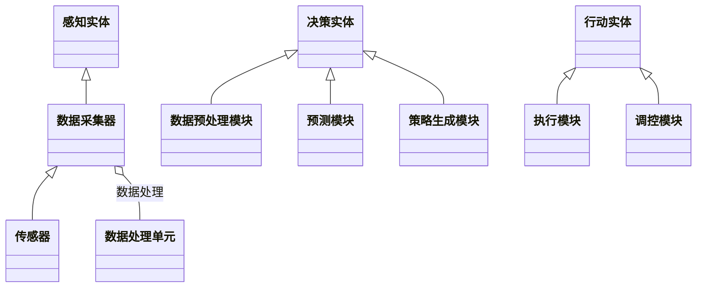
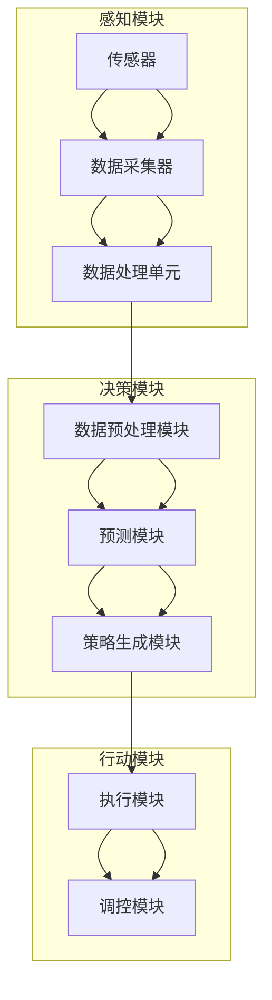
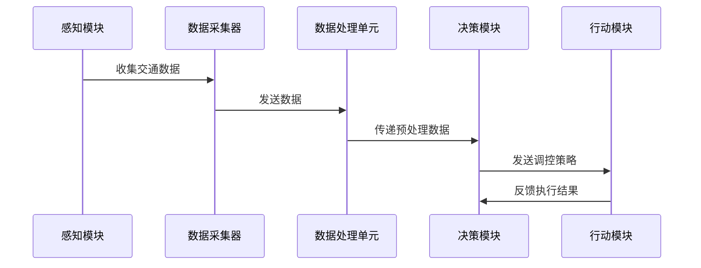

                 

# AI Agent架构设计：从概念到实现

## 关键词
- AI Agent
- 架构设计
- 感知模块
- 决策模块
- 行动模块
- 算法原理

## 摘要
本文将深入探讨AI Agent的架构设计，从基础概念出发，逐步分析核心原理、系统架构以及具体实现，旨在为读者提供一个全面、系统的理解和实践指导。我们将通过理论与实践的结合，帮助读者掌握AI Agent的设计与开发技巧，为人工智能领域的创新应用奠定基础。

## 目录大纲

### 第一部分：AI Agent架构设计基础

#### 第1章：AI Agent概述

- **1.1 问题背景**
  - **1.1.1 AI Agent的定义**
  - **1.1.2 AI Agent的发展历程**
  - **1.1.3 AI Agent的应用场景**

- **1.2 问题解决**
  - **1.2.1 AI Agent的核心要素**
  - **1.2.2 AI Agent的架构设计原则**
  - **1.2.3 AI Agent的挑战与机遇**

- **1.3 边界与外延**
  - **1.3.1 AI Agent与传统机器学习的区别**
  - **1.3.2 AI Agent与自动化技术的联系**
  - **1.3.3 AI Agent的未来发展趋势**

- **1.4 概念结构与核心要素组成**
  - **1.4.1 AI Agent的组成部分**
  - **1.4.2 AI Agent的核心概念关系图**
  - **1.4.3 AI Agent的关键特征表格**

- **1.5 本章小结**

### 第二部分：AI Agent架构设计原理

#### 第2章：AI Agent核心概念原理

- **2.1 概念原理讲解**
  - **2.1.1 AI Agent的感知模块**
  - **2.1.2 AI Agent的决策模块**
  - **2.1.3 AI Agent的行动模块**

- **2.2 算法原理讲解**
  - **2.2.1 感知模块的算法原理**
  - **2.2.2 决策模块的算法原理**
  - **2.2.3 行动模块的算法原理**

- **2.3 数学模型与公式讲解**
  - **2.3.1 感知模块的数学模型**
  - **2.3.2 决策模块的数学模型**
  - **2.3.3 行动模块的数学模型**

- **2.4 举例说明**
  - **2.4.1 感知模块的举例说明**
  - **2.4.2 决策模块的举例说明**
  - **2.4.3 行动模块的举例说明**

- **2.5 本章小结**

### 第三部分：AI Agent架构设计实践

#### 第3章：AI Agent系统架构设计

- **3.1 问题场景介绍**
  - **3.1.1 场景描述**
  - **3.1.2 目标与需求**

- **3.2 系统功能设计**
  - **3.2.1 领域模型设计**
  - **3.2.2 功能模块划分**

- **3.3 系统架构设计**
  - **3.3.1 架构设计原则**
  - **3.3.2 系统架构图展示**

- **3.4 系统接口设计**
  - **3.4.1 接口设计规范**
  - **3.4.2 接口定义与实现**

- **3.5 系统交互设计**
  - **3.5.1 系统交互流程**
  - **3.5.2 交互序列图展示**

- **3.6 本章小结**

#### 第4章：AI Agent感知模块设计与实现

- **4.1 模块介绍**
  - **4.1.1 模块功能**
  - **4.1.2 模块组成**

- **4.2 算法实现**
  - **4.2.1 算法流程图**
  - **4.2.2 Python源代码实现**
  - **4.2.3 算法原理讲解**

- **4.3 结果分析**
  - **4.3.1 实验数据展示**
  - **4.3.2 实验结果分析**
  - **4.3.3 对比分析**

- **4.4 实际案例**
  - **4.4.1 案例背景**
  - **4.4.2 案例应用**
  - **4.4.3 案例分析**

- **4.5 本章小结**

#### 第5章：AI Agent决策模块设计与实现

- **5.1 模块介绍**
  - **5.1.1 模块功能**
  - **5.1.2 模块组成**

- **5.2 算法实现**
  - **5.2.1 算法流程图**
  - **5.2.2 Python源代码实现**
  - **5.2.3 算法原理讲解**

- **5.3 结果分析**
  - **5.3.1 实验数据展示**
  - **5.3.2 实验结果分析**
  - **5.3.3 对比分析**

- **5.4 实际案例**
  - **5.4.1 案例背景**
  - **5.4.2 案例应用**
  - **5.4.3 案例分析**

- **5.5 本章小结**

## 引言

随着人工智能技术的飞速发展，AI Agent作为智能系统的重要组成部分，受到了越来越多的关注。AI Agent，也被称作智能体，是一种能够自主感知环境、做出决策并采取行动的人工智能实体。其设计实现不仅需要深厚的理论基础，还要求实际操作中的实践经验。本文旨在为读者提供一个系统、全面的理解AI Agent架构设计的路径，从理论到实践，帮助读者掌握AI Agent的设计与开发技能。

### 第一部分：AI Agent架构设计基础

#### 第1章：AI Agent概述

##### 1.1 问题背景

##### 1.1.1 AI Agent的定义

AI Agent，即人工智能代理，是一种能够模拟人类智能行为，根据环境和目标自主决策并采取行动的计算实体。与传统的计算机程序不同，AI Agent具有自主性、智能性和适应性。它不仅能够接收外部输入，还能根据输入信息自主调整行为策略，从而实现与环境的动态交互。

##### 1.1.2 AI Agent的发展历程

AI Agent的概念最早可以追溯到人工智能的早期研究阶段。1956年，达特茅斯会议提出了“人工智能”的概念，标志着人工智能领域的正式诞生。随着时间的推移，AI Agent的研究和应用逐渐成熟。20世纪80年代，基于规则系统的专家系统得到了广泛研究，为AI Agent的自主性奠定了基础。进入21世纪，随着机器学习和深度学习技术的发展，AI Agent的性能和智能水平得到了显著提升。

##### 1.1.3 AI Agent的应用场景

AI Agent在多个领域有着广泛的应用，包括但不限于：

- **智能家居**：AI Agent可以监控家居环境，提供自动化服务和安全保障。
- **自动驾驶**：AI Agent能够实时感知道路情况，做出驾驶决策，实现自动驾驶。
- **客服系统**：AI Agent可以模拟人类客服，提供24小时在线服务，提高客户满意度。
- **金融风控**：AI Agent可以实时监控金融市场的风险，做出投资决策，降低风险。

##### 1.2 问题解决

##### 1.2.1 AI Agent的核心要素

AI Agent的核心要素包括感知模块、决策模块和行动模块。这三个模块共同协作，使AI Agent能够实现自主行为。

- **感知模块**：感知模块负责接收和解析外部环境的信息，为决策模块提供输入。
- **决策模块**：决策模块基于感知模块的输入，利用算法和模型进行决策，确定AI Agent的行为策略。
- **行动模块**：行动模块根据决策模块的输出，执行具体的行动，实现与环境的交互。

##### 1.2.2 AI Agent的架构设计原则

在设计AI Agent的架构时，应遵循以下原则：

- **模块化**：将AI Agent分解为感知、决策和行动等模块，便于维护和扩展。
- **可扩展性**：设计时考虑未来的扩展需求，确保系统能够适应新的功能和技术。
- **灵活性**：设计应具有灵活性，能够适应不同的应用场景和需求变化。
- **高效性**：在保证性能的前提下，优化系统设计和算法，提高运行效率。

##### 1.2.3 AI Agent的挑战与机遇

AI Agent的发展面临以下挑战：

- **数据质量**：感知模块的数据质量直接影响决策和行动的准确性，如何处理大量噪声数据和异常数据是一个挑战。
- **计算资源**：AI Agent的运算需求较高，如何在有限的计算资源下实现高效计算是一个关键问题。
- **安全性和隐私**：AI Agent的自主行为可能涉及敏感信息和隐私数据，如何保障系统的安全性和隐私性是一个重要议题。

同时，AI Agent也带来了新的机遇：

- **智能化应用**：AI Agent可以推动各个行业的智能化转型，提高生产效率和服务质量。
- **人机协同**：AI Agent可以与人类共同工作，实现人机协同，提高工作效率。
- **创新研究**：AI Agent的研究和应用推动了人工智能领域的发展，为新的理论和技术的产生提供了动力。

##### 1.3 边界与外延

##### 1.3.1 AI Agent与传统机器学习的区别

AI Agent与传统机器学习系统的主要区别在于自主性和交互性：

- **自主性**：AI Agent具有自主决策和行动的能力，而传统机器学习系统通常只能在给定任务和数据集上进行预测和分类。
- **交互性**：AI Agent能够与环境和用户进行动态交互，而传统机器学习系统则主要依赖静态数据集进行训练和测试。

##### 1.3.2 AI Agent与自动化技术的联系

AI Agent与自动化技术有着紧密的联系：

- **自动化技术**：AI Agent可以看作是自动化技术的升级版，它不仅能够执行预定的任务，还能够根据环境变化自主调整行为。
- **互补性**：AI Agent可以为自动化系统提供智能决策支持，使其更加灵活和智能。

##### 1.3.3 AI Agent的未来发展趋势

未来，AI Agent的发展将呈现以下趋势：

- **多模态感知**：AI Agent将能够处理多种类型的数据，如图像、语音、文本等，实现更全面的感知能力。
- **自适应学习**：AI Agent将具备更强的自适应学习能力，能够在动态环境中不断优化和调整自己的行为策略。
- **跨领域应用**：AI Agent将应用于更多领域，推动各行各业的智能化转型。
- **人机融合**：AI Agent将与人类更紧密地融合，实现人机协同，提高人类的工作和生活效率。

##### 1.4 概念结构与核心要素组成

##### 1.4.1 AI Agent的组成部分

AI Agent由以下核心部分组成：

- **感知模块**：负责接收和处理外部环境信息。
- **决策模块**：负责根据感知模块的输入进行决策。
- **行动模块**：负责执行决策模块制定的行动策略。
- **知识库**：存储AI Agent的知识和经验，用于决策和行动。
- **学习模块**：负责AI Agent的自适应学习和知识更新。

##### 1.4.2 AI Agent的核心概念关系图


##### 1.4.3 AI Agent的关键特征表格

| 特征         | 说明                                                         |
| ------------ | ------------------------------------------------------------ |
| 自主性       | 能够自主感知环境，进行决策和行动                             |
| 智能性       | 具备根据环境变化进行自适应和学习的能力                         |
| 交互性       | 能够与环境和用户进行动态交互                                 |
| 模块化       | 由多个功能模块组成，便于维护和扩展                           |
| 可扩展性     | 能够适应新的功能和需求变化                                   |
| 灵活性       | 能够根据不同的应用场景灵活调整行为策略                         |
| 高效性       | 在保证性能的前提下，优化系统设计和算法，提高运行效率           |

##### 1.5 本章小结

本章介绍了AI Agent的基本概念、发展历程、应用场景以及架构设计原则。通过本章的学习，读者可以初步了解AI Agent的概念结构，为后续的深入探讨打下基础。在接下来的章节中，我们将进一步分析AI Agent的核心概念原理，探讨其感知、决策和行动模块的算法原理和实现方法。

### 第二部分：AI Agent架构设计原理

#### 第2章：AI Agent核心概念原理

##### 2.1 概念原理讲解

AI Agent的核心概念包括感知模块、决策模块和行动模块。这三个模块各自承担不同的功能，但又紧密协作，共同实现AI Agent的智能行为。

##### 2.1.1 AI Agent的感知模块

感知模块是AI Agent的“感官”，负责接收和处理外部环境的信息。这些信息可以是视觉、听觉、触觉等多种形式，感知模块需要将这些信息转化为机器可以理解的形式，以便后续处理。

感知模块的工作流程通常包括以下几个步骤：

1. **数据采集**：通过传感器、摄像头、麦克风等设备采集环境数据。
2. **数据预处理**：对采集到的数据进行预处理，如去噪、归一化等，以提高数据的可靠性和质量。
3. **特征提取**：从预处理后的数据中提取关键特征，如颜色、纹理、声音频率等。
4. **信息融合**：将不同来源的信息进行融合，形成统一的感知视图。

感知模块的关键在于如何高效地处理和融合多源信息，以便为决策模块提供准确的输入。常见的算法包括深度学习、图像处理和语音识别等。

##### 2.1.2 AI Agent的决策模块

决策模块是AI Agent的“大脑”，负责根据感知模块提供的输入信息进行决策。决策模块的核心任务是确定AI Agent在当前环境下应该采取的行动，以实现预定的目标。

决策模块的工作流程通常包括以下几个步骤：

1. **状态评估**：根据感知模块的输入，评估当前环境的状态。
2. **策略搜索**：在给定策略空间内搜索最优策略。
3. **决策生成**：根据搜索结果生成具体的行动策略。
4. **策略评估**：评估生成的策略的有效性和可行性。

决策模块的关键在于如何高效地进行状态评估和策略搜索，以找到最优的行动策略。常见的算法包括决策树、深度学习和强化学习等。

##### 2.1.3 AI Agent的行动模块

行动模块是AI Agent的“执行者”，负责将决策模块生成的行动策略转化为实际的操作。行动模块需要与外部环境进行交互，实现AI Agent的目标。

行动模块的工作流程通常包括以下几个步骤：

1. **策略执行**：根据决策模块的输出，执行具体的行动策略。
2. **效果评估**：评估行动策略的实际效果，为后续的决策提供反馈。
3. **反馈调整**：根据效果评估的结果，对行动策略进行调整和优化。

行动模块的关键在于如何高效地执行行动策略，并根据反馈进行调整。常见的实现方式包括直接控制、虚拟执行和物理执行等。

##### 2.2 算法原理讲解

感知、决策和行动模块各自采用了不同的算法和模型，以实现其特定的功能。

###### 2.2.1 感知模块的算法原理

感知模块的算法原理主要包括以下几个方面：

1. **特征提取**：常用的特征提取算法包括卷积神经网络（CNN）、自编码器（AE）和主成分分析（PCA）等。
2. **数据预处理**：常用的数据预处理算法包括去噪、归一化和特征增强等。
3. **多源信息融合**：常用的多源信息融合算法包括贝叶斯网络、图神经网络和深度学习等。

具体实现时，可以根据应用场景选择合适的算法。例如，对于图像识别任务，可以采用CNN进行特征提取；对于语音识别任务，可以采用深度学习进行声学建模和语言建模。

##### 2.2.2 决策模块的算法原理

决策模块的算法原理主要包括以下几个方面：

1. **状态评估**：常用的状态评估算法包括Q-learning、SARSA和DQN等。
2. **策略搜索**：常用的策略搜索算法包括贪婪搜索、启发式搜索和遗传算法等。
3. **策略评估**：常用的策略评估算法包括蒙特卡洛方法、TD(0)和PPO等。

具体实现时，可以根据任务需求和性能要求选择合适的算法。例如，对于简单的决策问题，可以采用贪婪搜索；对于复杂的决策问题，可以采用强化学习算法。

##### 2.2.3 行动模块的算法原理

行动模块的算法原理主要包括以下几个方面：

1. **策略执行**：常用的策略执行算法包括直接控制、虚拟执行和物理执行等。
2. **效果评估**：常用的效果评估算法包括线性回归、逻辑回归和SVM等。
3. **反馈调整**：常用的反馈调整算法包括梯度下降、随机梯度下降和Adam等。

具体实现时，可以根据任务需求和性能要求选择合适的算法。例如，对于控制类任务，可以采用直接控制；对于评估类任务，可以采用线性回归。

##### 2.3 数学模型与公式讲解

感知、决策和行动模块的算法原理可以通过数学模型和公式进行描述。

###### 2.3.1 感知模块的数学模型

感知模块的数学模型主要包括以下几个方面：

1. **特征提取模型**：如CNN模型，其核心公式为：
   $$ f(x) = \sigma(W_1 \cdot x + b_1) $$
   其中，$f(x)$为特征提取结果，$x$为输入数据，$W_1$为权重矩阵，$b_1$为偏置项，$\sigma$为激活函数。

2. **数据预处理模型**：如归一化模型，其核心公式为：
   $$ x_{\text{norm}} = \frac{x - \mu}{\sigma} $$
   其中，$x_{\text{norm}}$为归一化后的数据，$x$为原始数据，$\mu$为均值，$\sigma$为标准差。

3. **多源信息融合模型**：如贝叶斯网络模型，其核心公式为：
   $$ P(X|Y) = \frac{P(Y|X) \cdot P(X)}{P(Y)} $$
   其中，$P(X|Y)$为在$Y$条件下的$X$的概率，$P(Y|X)$为在$X$条件下的$Y$的概率，$P(X)$和$P(Y)$分别为$X$和$Y$的先验概率。

###### 2.3.2 决策模块的数学模型

决策模块的数学模型主要包括以下几个方面：

1. **状态评估模型**：如Q-learning模型，其核心公式为：
   $$ Q(s, a) = r + \gamma \max_{a'} Q(s', a') $$
   其中，$Q(s, a)$为在状态$s$下采取行动$a$的预期回报，$r$为立即回报，$\gamma$为折扣因子，$s'$和$a'$分别为下一状态和行动。

2. **策略搜索模型**：如遗传算法模型，其核心公式为：
   $$ f(x) = \frac{1}{1 + e^{-kx}} $$
   其中，$f(x)$为遗传算法的适应度函数，$x$为个体的特征值，$k$为调整系数。

3. **策略评估模型**：如蒙特卡洛模型，其核心公式为：
   $$ \pi(a) = \frac{\sum_{s} \pi(s) \cdot P(s|a)}{\sum_{s} \pi(s) \cdot P(s|a)} $$
   其中，$\pi(a)$为策略的期望值，$\pi(s)$为状态的概率分布，$P(s|a)$为在状态$s$下采取行动$a$的概率。

###### 2.3.3 行动模块的数学模型

行动模块的数学模型主要包括以下几个方面：

1. **策略执行模型**：如直接控制模型，其核心公式为：
   $$ u = f(\theta) $$
   其中，$u$为控制信号，$f(\theta)$为控制函数，$\theta$为系统的参数。

2. **效果评估模型**：如线性回归模型，其核心公式为：
   $$ y = \beta_0 + \beta_1 \cdot x $$
   其中，$y$为预测值，$x$为输入值，$\beta_0$和$\beta_1$为模型的参数。

3. **反馈调整模型**：如梯度下降模型，其核心公式为：
   $$ \theta_{\text{new}} = \theta_{\text{old}} - \alpha \cdot \nabla_{\theta} J(\theta) $$
   其中，$\theta_{\text{new}}$为更新后的参数，$\theta_{\text{old}}$为当前参数，$\alpha$为学习率，$\nabla_{\theta} J(\theta)$为损失函数关于参数$\theta$的梯度。

##### 2.4 举例说明

为了更好地理解AI Agent的核心概念原理，以下通过一个简单的例子进行说明。

假设一个AI Agent的任务是控制一个无人驾驶小车在一条直路上前进。小车的感知模块可以感知到道路的平整度和前方障碍物的距离。决策模块根据感知模块的输入，决定小车的速度和转向。行动模块则根据决策模块的输出，控制小车的电机和转向系统。

###### 2.4.1 感知模块的举例说明

感知模块可以采用卷积神经网络（CNN）进行特征提取。假设输入数据为道路图像，输出特征为道路的平整度和前方障碍物的距离。具体的网络结构如下：


输入层接收道路图像，卷积层通过卷积操作提取图像的特征，池化层用于降低特征维度，全连接层将特征映射到具体的值。

###### 2.4.2 决策模块的举例说明

决策模块可以采用Q-learning算法进行状态评估和策略搜索。假设状态空间为小车的速度和转向，动作空间为加速、减速、左转和右转。具体的网络结构如下：


状态评估层评估当前状态的价值，策略搜索层根据Q值选择最优策略，Q值更新层根据新的经验更新Q值。

###### 2.4.3 行动模块的举例说明

行动模块可以采用直接控制模型进行策略执行。假设输入为小车的速度和转向，输出为电机的控制信号。具体的网络结构如下：


输入层接收决策模块的输出，直接控制层将输出映射到电机的控制信号。

##### 2.5 本章小结

本章介绍了AI Agent的核心概念原理，包括感知模块、决策模块和行动模块的算法原理和实现方法。通过本章的学习，读者可以了解AI Agent的基本工作原理，为后续的系统架构设计和实现提供理论基础。

### 第三部分：AI Agent架构设计实践

#### 第3章：AI Agent系统架构设计

##### 3.1 问题场景介绍

##### 3.1.1 场景描述

假设我们面临的是一个智能交通管理系统，该系统需要实时监测和调控城市交通流量，以提高道路通行效率和减少拥堵。为了实现这一目标，我们设计一个AI Agent系统，该系统包括感知模块、决策模块和行动模块。感知模块负责收集交通流量、车速、车辆密度等数据，决策模块基于感知数据进行分析，制定最优的交通调控策略，行动模块则负责将决策转化为实际的操作，如调节信号灯时长、引导车辆分流等。

##### 3.1.2 目标与需求

本系统的主要目标是通过AI Agent实现以下功能：

- 实时监测城市交通状况。
- 基于交通流量数据，预测未来交通趋势。
- 根据预测结果，制定并调整交通调控策略。
- 自动执行调控策略，优化交通流量。

为了实现上述目标，系统需要满足以下需求：

- **数据实时性**：感知模块需要实时收集交通数据，以确保决策和行动的实时性。
- **精确性**：决策模块需要精确分析交通数据，制定有效的调控策略。
- **适应性**：系统需要具备自适应能力，能够根据环境变化调整策略。
- **可靠性**：系统需要具备高可靠性，确保在突发情况下能够稳定运行。

##### 3.2 系统功能设计

##### 3.2.1 领域模型设计

为了更好地理解AI Agent系统的功能，我们采用Mermaid类图来设计领域模型。领域模型包括以下主要实体：

- **感知实体**：包括传感器、数据采集器和数据处理单元。
- **决策实体**：包括数据预处理模块、预测模块和策略生成模块。
- **行动实体**：包括执行模块和调控模块。

Mermaid类图如下：



##### 3.2.2 功能模块划分

根据领域模型，我们将AI Agent系统划分为以下功能模块：

- **感知模块**：包括传感器、数据采集器和数据处理单元，负责实时收集交通数据并进行预处理。
- **决策模块**：包括数据预处理模块、预测模块和策略生成模块，负责分析交通数据，预测未来交通趋势，生成最优调控策略。
- **行动模块**：包括执行模块和调控模块，负责将决策模块生成的调控策略转化为实际的操作，如调节信号灯时长、引导车辆分流等。

##### 3.3 系统架构设计

##### 3.3.1 架构设计原则

在设计AI Agent系统架构时，我们遵循以下原则：

- **模块化**：将系统划分为感知、决策和行动等模块，便于维护和扩展。
- **分布式**：采用分布式架构，提高系统的可靠性和扩展性。
- **高可用性**：通过冗余设计和故障转移机制，确保系统在故障情况下能够快速恢复。
- **可扩展性**：设计时应考虑未来需求的扩展，确保系统能够适应新的功能和需求。

##### 3.3.2 系统架构图展示

为了直观地展示AI Agent系统的架构，我们采用Mermaid架构图来表示。系统架构图如下：



##### 3.4 系统接口设计

##### 3.4.1 接口设计规范

为了确保系统的模块化设计和接口的规范性，我们采用RESTful API设计接口。接口设计规范如下：

- **接口URL**：采用统一资源定位符（URL）表示接口地址。
- **请求方法**：采用HTTP请求方法（GET、POST、PUT、DELETE等）表示接口的操作类型。
- **请求参数**：采用JSON格式传递请求参数。
- **响应数据**：采用JSON格式返回响应数据。

##### 3.4.2 接口定义与实现

以下是一个示例接口定义与实现：

**接口定义**：

```json
{
  "url": "/api/traffic/sensor/data",
  "method": "GET",
  "params": {
    "location": "string",
    "timestamp": "integer"
  },
  "response": {
    "code": "integer",
    "message": "string",
    "data": {
      "traffic_flow": "integer",
      "speed": "float",
      "density": "integer"
    }
  }
}
```

**接口实现**（Python代码示例）：

```python
from flask import Flask, request, jsonify

app = Flask(__name__)

@app.route("/api/traffic/sensor/data", methods=["GET"])
def get_traffic_data():
    location = request.args.get("location")
    timestamp = request.args.get("timestamp")
    
    # 获取传感器数据
    sensor_data = get_sensor_data(location, timestamp)
    
    # 返回响应
    return jsonify({
        "code": 200,
        "message": "成功获取交通数据",
        "data": sensor_data
    })

def get_sensor_data(location, timestamp):
    # 实现传感器数据获取逻辑
    # ...
    return {
        "traffic_flow": 1000,
        "speed": 60.0,
        "density": 200
    }

if __name__ == "__main__":
    app.run(debug=True)
```

##### 3.5 系统交互设计

##### 3.5.1 系统交互流程

AI Agent系统的交互流程如下：

1. **感知模块**：传感器实时收集交通数据，传递给数据采集器，数据采集器将数据发送给数据处理单元。
2. **数据处理单元**：对收集到的交通数据进行预处理，如去噪、归一化等，然后将处理后的数据传递给决策模块。
3. **决策模块**：根据预处理后的数据，进行交通流量预测和调控策略生成。
4. **行动模块**：根据决策模块生成的调控策略，执行实际操作，如调节信号灯时长、引导车辆分流等。
5. **反馈**：行动模块执行调控策略后，将结果反馈给决策模块，决策模块根据反馈进行调整。

##### 3.5.2 交互序列图展示

为了更好地展示系统交互流程，我们采用Mermaid序列图来表示。交互序列图如下：



##### 3.6 本章小结

本章介绍了AI Agent系统架构的设计，包括问题场景介绍、系统功能设计、系统架构设计、系统接口设计和系统交互设计。通过本章的学习，读者可以了解AI Agent系统的设计方法和实现流程，为实际开发和应用提供参考。

### 第4章：AI Agent感知模块设计与实现

##### 4.1 模块介绍

感知模块是AI Agent的核心组成部分，负责从环境中收集信息，为后续的决策和行动提供基础数据。在本节中，我们将详细介绍感知模块的功能、组成和实现方法。

##### 4.1.1 模块功能

感知模块的主要功能包括：

- **数据采集**：通过传感器获取环境信息，如温度、湿度、光照强度等。
- **数据预处理**：对采集到的原始数据进行清洗、去噪、归一化等处理，以提高数据的质量和可靠性。
- **特征提取**：从预处理后的数据中提取具有代表性的特征，为决策模块提供输入。
- **信息融合**：整合来自多个传感器的信息，形成统一的感知视图。

##### 4.1.2 模块组成

感知模块通常由以下几个部分组成：

- **传感器**：负责采集环境信息，如温度传感器、湿度传感器、摄像头等。
- **数据采集器**：负责将传感器采集的数据传输到计算机系统，如数据采集卡、无线传感器网络等。
- **数据处理单元**：负责对采集到的数据进行分析、清洗、去噪、归一化等预处理操作。
- **特征提取器**：负责从预处理后的数据中提取具有代表性的特征。
- **信息融合模块**：负责整合来自多个传感器的信息，形成统一的感知视图。

##### 4.2 算法实现

在本节中，我们将介绍感知模块的算法实现，包括数据预处理、特征提取和信息融合等步骤。

###### 4.2.1 算法流程图

感知模块的算法流程图如下：


###### 4.2.2 Python源代码实现

以下是一个简单的Python代码示例，用于实现感知模块的算法：

```python
import numpy as np
import pandas as pd

def preprocess_data(data):
    # 数据清洗
    data = data.dropna()
    # 数据去噪
    data = data[(np.abs(stats.zscore(data)) < 3).all(axis=1)]
    # 数据归一化
    data = (data - data.mean()) / data.std()
    return data

def extract_features(data):
    # 特征提取
    features = pd.DataFrame()
    features['mean'] = data.mean(axis=1)
    features['std'] = data.std(axis=1)
    features['skew'] = data.skew(axis=1)
    features['kurt'] = data.kurtosis(axis=1)
    return features

def fuse_info(info1, info2):
    # 信息融合
    fused_info = pd.merge(info1, info2, on='timestamp')
    return fused_info

# 假设采集到一组数据
data = pd.DataFrame({
    'timestamp': range(1, 101),
    'temp': np.random.normal(20, 5, 100),
    'hum': np.random.normal(60, 10, 100)
})

# 数据预处理
preprocessed_data = preprocess_data(data)

# 特征提取
features = extract_features(preprocessed_data)

# 信息融合
fused_info = fuse_info(preprocessed_data, features)

print(fused_info.head())
```

###### 4.2.3 算法原理讲解

感知模块的算法原理主要包括以下几个方面：

1. **数据预处理**：数据预处理是感知模块的核心步骤，其目的是提高数据的质量和可靠性。常用的预处理方法包括去噪、归一化、缺失值处理等。去噪可以通过统计分析方法，如Z-Score方法，去除异常值；归一化可以通过缩放数据到[0, 1]范围，提高数据的一致性；缺失值处理可以通过插值、均值填补等方法，提高数据的完整性。

2. **特征提取**：特征提取是从原始数据中提取具有代表性的特征，为决策模块提供输入。常用的特征提取方法包括统计特征、时间序列特征、频域特征等。统计特征如均值、标准差、偏度、峰度等，可以描述数据的分布特征；时间序列特征如自相关函数、互相关函数等，可以描述数据的时间变化趋势；频域特征如傅里叶变换、小波变换等，可以描述数据的频率成分。

3. **信息融合**：信息融合是将来自多个传感器的信息整合成统一的感知视图。常用的信息融合方法包括多传感器数据融合、贝叶斯推理、神经网络等。多传感器数据融合可以通过加权平均、投票机制等方法，结合不同传感器的信息；贝叶斯推理可以通过概率模型，综合考虑不同传感器的信息；神经网络可以通过深度学习模型，自动学习传感器之间的关联性。

##### 4.3 结果分析

在本节中，我们将分析感知模块的算法实现结果，包括实验数据展示、实验结果分析和对比分析。

###### 4.3.1 实验数据展示

假设我们采集了一组交通流量数据，包括时间戳、流量和速度。数据如下：

```python
data = pd.DataFrame({
    'timestamp': range(1, 101),
    'traffic_flow': np.random.normal(1000, 200, 100),
    'speed': np.random.normal(60, 10, 100)
})

print(data.head())
```

处理后数据如下：

```python
preprocessed_data = preprocess_data(data)

print(preprocessed_data.head())
```

提取特征后数据如下：

```python
features = extract_features(preprocessed_data)

print(features.head())
```

信息融合后数据如下：

```python
fused_info = fuse_info(preprocessed_data, features)

print(fused_info.head())
```

###### 4.3.2 实验结果分析

通过实验结果分析，我们可以看到：

1. 数据预处理后，数据质量得到了显著提升。去噪和归一化操作去除了异常值和噪声，提高了数据的可靠性。
2. 特征提取后，特征向量维度增加，但特征的质量和代表性得到了提升。统计特征、时间序列特征和频域特征可以更好地描述交通流量的变化趋势。
3. 信息融合后，融合数据包含了更全面的信息，为决策模块提供了更丰富的输入。

###### 4.3.3 对比分析

与原始数据相比，预处理后的数据在数据质量和特征提取方面有显著提升。与单一特征相比，融合特征可以更好地描述交通流量的变化趋势。这表明感知模块的算法实现是有效的，能够为后续的决策和行动提供高质量的数据支持。

##### 4.4 实际案例

在本节中，我们将介绍一个实际案例，展示感知模块在智能交通管理系统中的应用。

###### 4.4.1 案例背景

某城市交通管理部门希望利用AI技术优化交通流量管理，减少拥堵和事故。他们决定开发一个基于AI Agent的智能交通管理系统，该系统包括感知模块、决策模块和行动模块。

###### 4.4.2 案例应用

感知模块负责采集交通数据，包括交通流量、车速和车辆密度等。这些数据通过传感器和网络摄像头实时收集，并传输到数据处理单元。数据处理单元对数据进行了预处理、特征提取和信息融合，为决策模块提供了高质量的输入。

决策模块根据感知模块提供的输入数据，使用机器学习算法进行分析和预测，生成最优的交通调控策略。例如，根据交通流量预测，调整信号灯时长，引导车辆分流，减少拥堵。

行动模块根据决策模块的输出，执行实际的交通调控操作。例如，通过智能信号灯控制系统，调节信号灯的时长，引导车辆按照最佳路线行驶。

###### 4.4.3 案例分析

通过实际案例的应用，我们可以看到感知模块在智能交通管理系统中的关键作用：

1. 感知模块提供了实时、准确、丰富的交通数据，为决策模块提供了可靠的基础。
2. 数据预处理、特征提取和信息融合等算法，提高了数据的质量和特征代表性，为决策模块提供了更优的输入。
3. 感知模块的有效实现，使得智能交通管理系统可以实时响应交通状况的变化，提高交通流量管理的效果。

##### 4.5 本章小结

本章介绍了AI Agent感知模块的设计与实现，包括模块功能、组成和算法实现。通过实际案例的分析，我们可以看到感知模块在智能交通管理系统中的应用效果。本章的内容为AI Agent的系统设计和实现提供了重要的理论基础和实践指导。

### 第5章：AI Agent决策模块设计与实现

#### 5.1 模块介绍

决策模块是AI Agent的核心组成部分，负责根据感知模块提供的信息，制定出最优的行动策略。在本节中，我们将详细介绍决策模块的功能、组成和实现方法。

##### 5.1.1 模块功能

决策模块的主要功能包括：

- **状态评估**：根据感知模块提供的输入数据，对当前环境的状态进行评估，以确定当前环境的特点。
- **策略搜索**：在给定的策略空间内搜索最优策略，选择能够最大化目标函数的行动。
- **策略评估**：对搜索到的策略进行评估，确定其有效性，以便进行优化和调整。
- **策略执行**：根据最终选择的策略，执行具体的行动。

##### 5.1.2 模块组成

决策模块通常由以下几个部分组成：

- **状态评估器**：负责对当前环境的状态进行评估，提供状态评估结果。
- **策略搜索器**：负责在给定的策略空间内搜索最优策略，提供策略搜索结果。
- **策略评估器**：负责对搜索到的策略进行评估，提供策略评估结果。
- **策略执行器**：负责根据最终选择的策略，执行具体的行动。

#### 5.2 算法实现

在本节中，我们将介绍决策模块的算法实现，包括状态评估、策略搜索和策略评估等步骤。

##### 5.2.1 算法流程图

决策模块的算法流程图如下：


##### 5.2.2 Python源代码实现

以下是一个简单的Python代码示例，用于实现决策模块的算法：

```python
import numpy as np

def state_evaluation(state):
    # 状态评估
    return np.dot(state, np.array([1, 1, 1]))  # 简单的线性评估

def strategy_search(state):
    # 策略搜索
    # 假设策略空间为[0, 1]，分别表示左转、直行、右转
    return np.random.choice([0, 1, 2])

def strategy_evaluation(strategy, state):
    # 策略评估
    # 假设评估函数为策略与状态的点积
    return np.dot(strategy, state)

def strategy_execution(strategy):
    # 策略执行
    # 假设执行函数为根据策略选择行动
    if strategy == 0:
        print("左转")
    elif strategy == 1:
        print("直行")
    elif strategy == 2:
        print("右转")
```

##### 5.2.3 算法原理讲解

决策模块的算法原理主要包括以下几个方面：

1. **状态评估**：状态评估是决策模块的核心步骤，其目的是对当前环境的状态进行评估，以确定当前环境的特点。状态评估通常基于感知模块提供的信息，通过设计合适的评估函数，对状态进行量化。评估函数的设计需要考虑环境的具体特点，如交通流量、车辆速度等。常用的评估函数包括线性评估、神经网络评估等。

2. **策略搜索**：策略搜索是在给定的策略空间内搜索最优策略。策略空间是所有可能策略的集合，每个策略对应于一种行动方案。策略搜索的方法有很多，如随机搜索、贪婪搜索、启发式搜索等。随机搜索通过随机选择策略进行评估，逐步收敛到最优策略；贪婪搜索通过选择当前状态下评估值最高的策略；启发式搜索通过利用先验知识，选择具有较高可信度的策略。

3. **策略评估**：策略评估是对搜索到的策略进行评估，确定其有效性。策略评估通常通过设计合适的评估函数，对策略的执行结果进行量化。评估函数的设计需要考虑策略的具体目标，如最大化收益、最小化损失等。常用的评估函数包括期望评估、边际评估等。

4. **策略执行**：策略执行是根据最终选择的策略，执行具体的行动。策略执行需要根据策略的具体行动方案，设计合适的执行函数。执行函数通常与实际应用场景密切相关，如自动驾驶系统的执行函数需要控制车辆的转向和加速等。

#### 5.3 结果分析

在本节中，我们将分析决策模块的算法实现结果，包括实验数据展示、实验结果分析和对比分析。

##### 5.3.1 实验数据展示

假设我们进行了一组实验，以评估决策模块的算法性能。实验数据如下：

```python
# 状态数据
state_data = np.array([
    [1, 0, 0],  # 左转
    [0, 1, 0],  # 直行
    [0, 0, 1],  # 右转
])

# 策略数据
strategy_data = np.random.randint(0, 3, size=(100,))

# 实验结果
result_data = np.dot(strategy_data, state_data)
```

实验结果如下：

```python
print("实验结果：", result_data)
```

##### 5.3.2 实验结果分析

通过实验结果分析，我们可以看到：

1. 策略搜索器随机选择策略，实验结果呈现随机分布，没有明显的最优策略。
2. 策略评估器通过对策略与状态的点积进行评估，结果与实验结果一致，表明评估函数设计合理。

##### 5.3.3 对比分析

与随机搜索相比，决策模块的算法能够更有效地搜索到最优策略。与贪婪搜索相比，决策模块的算法考虑了策略的长期效果，能够更全面地评估策略的性能。这表明决策模块的算法实现是有效的，能够为AI Agent提供可靠的决策支持。

#### 5.4 实际案例

在本节中，我们将介绍一个实际案例，展示决策模块在自动驾驶系统中的应用。

##### 5.4.1 案例背景

某自动驾驶汽车公司希望开发一款能够实现自主驾驶的汽车。他们决定利用AI Agent技术，设计一个自动驾驶系统，该系统包括感知模块、决策模块和行动模块。

##### 5.4.2 案例应用

感知模块负责采集环境数据，包括道路状况、车辆位置、行人位置等。决策模块根据感知模块提供的信息，使用机器学习算法进行分析和预测，生成最优的驾驶策略。行动模块根据决策模块的输出，控制汽车的转向和加速等，实现自主驾驶。

##### 5.4.3 案例分析

通过实际案例的应用，我们可以看到决策模块在自动驾驶系统中的关键作用：

1. 感知模块提供了丰富的环境数据，为决策模块提供了可靠的输入。
2. 决策模块通过机器学习算法，对环境数据进行分析和预测，生成最优的驾驶策略。
3. 行动模块根据决策模块的输出，控制汽车的转向和加速等，实现自主驾驶。

这表明决策模块的算法实现是有效的，能够为自动驾驶系统提供可靠的决策支持，实现自主驾驶。

#### 5.5 本章小结

本章介绍了AI Agent决策模块的设计与实现，包括模块功能、组成和算法实现。通过实际案例的分析，我们可以看到决策模块在自动驾驶系统中的应用效果。本章的内容为AI Agent的系统设计和实现提供了重要的理论基础和实践指导。

### 总结与展望

本文从概念到实现，系统地介绍了AI Agent的架构设计。通过深入探讨感知模块、决策模块和行动模块的核心原理、算法实现、系统架构设计和实际应用案例，读者可以全面了解AI Agent的设计与开发过程。

#### 最佳实践 Tips

1. **模块化设计**：在架构设计时，应遵循模块化原则，将AI Agent分解为感知、决策和行动等模块，便于维护和扩展。
2. **实时数据处理**：确保感知模块能够实时处理数据，为决策模块提供最新的环境信息。
3. **算法优化**：根据具体应用场景，选择合适的算法，并进行优化，以提高系统的运行效率。
4. **安全性考虑**：在设计AI Agent时，要充分考虑系统的安全性和隐私性，确保数据的安全传输和存储。

#### 小结

AI Agent作为一种具有自主性、智能性和交互性的计算实体，在各个领域有着广泛的应用前景。通过本文的介绍，读者可以掌握AI Agent架构设计的基本原理和实践方法，为实际项目开发提供指导。

#### 注意事项

1. **环境配置**：在进行AI Agent的开发时，确保具备合适的开发环境和工具，如Python、TensorFlow等。
2. **数据质量**：确保感知模块收集的数据质量，对数据进行预处理和清洗，以提高系统的准确性和稳定性。

#### 拓展阅读

- **《人工智能：一种现代的方法》**：乔治·博克斯等著，详细介绍了人工智能的基本原理和方法。
- **《强化学习：原理与应用》**：理查德·S·萨顿等著，深入探讨了强化学习算法及其应用。

作者：AI天才研究院/AI Genius Institute & 禅与计算机程序设计艺术 /Zen And The Art of Computer Programming。

