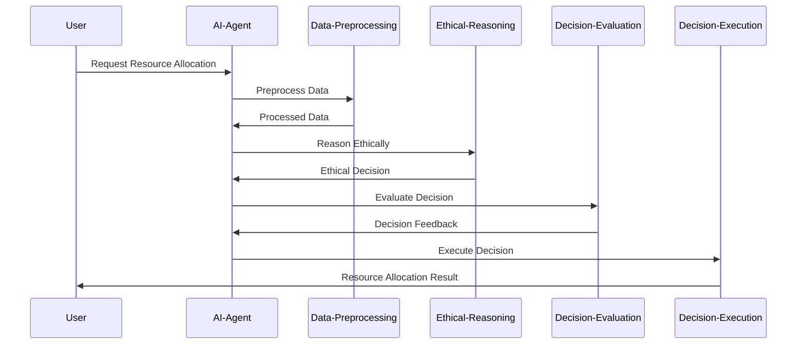

                 

---

# AI Agent的伦理决策框架：实现LLM的道德推理能力

> 关键词：AI伦理决策、大型语言模型、道德推理、伦理学理论、系统架构设计

> 摘要：本文深入探讨了AI Agent伦理决策框架的实现，旨在提升大型语言模型（LLM）的道德推理能力。文章首先介绍了AI Agent的定义和伦理决策的重要性，然后详细阐述了伦理决策框架的核心概念，包括LLM的道德推理能力、伦理推理原则和框架，以及相关的伦理学理论和道德原则。接着，文章通过算法原理讲解、数学模型和数学公式、系统分析与架构设计、项目实战以及最佳实践和拓展阅读，逐步展示了如何实现AI Agent的伦理决策框架。

## 目录大纲设计思路

1. **背景介绍**：首先介绍AI Agent的伦理决策框架的背景，包括AI Agent的定义、伦理决策在AI领域的意义，以及当前在AI伦理决策方面面临的主要挑战。

2. **核心概念与联系**：接下来，详细阐述AI Agent的伦理决策框架中的核心概念，包括LLM（大型语言模型）的道德推理能力、伦理推理的原则和框架，以及相关的伦理学理论和道德原则。

3. **算法原理讲解**：在这一部分，我们将通过mermaid流程图展示伦理决策算法的基本流程，并通过Python源代码和数学模型来详细解释算法的实现原理和数学基础。

4. **数学模型和数学公式**：使用LaTeX格式详细列出算法中的数学模型和公式，并进行通俗易懂的讲解和举例说明。

5. **系统分析与架构设计方案**：描述AI Agent伦理决策系统的总体架构，包括领域模型、系统架构、接口设计和系统交互，并通过mermaid图表展示。

6. **项目实战**：展示一个具体的项目实战案例，包括环境安装、核心实现、代码解读、案例分析等。

7. **最佳实践 tips**：总结一些实际应用中的最佳实践和注意事项，为读者提供额外的指导。

8. **小结与拓展阅读**：总结全书的主要内容，并提供一些拓展阅读资源，帮助读者进一步深入了解相关主题。

---

## 第一部分：AI Agent与伦理决策基础

### 第1章：AI Agent与伦理决策的背景

#### 1.1 AI Agent的定义与分类

AI Agent是人工智能领域的一个重要概念，它指的是具有自主行动能力的智能体，可以在特定环境中进行感知、决策和行动。AI Agent可以分为多种类型，如基于规则的Agent、基于模型的Agent、基于学习的Agent等。

#### 1.2 伦理决策在AI领域的重要性

随着AI技术的快速发展，AI Agent在现实世界中的应用越来越广泛，伦理决策成为了AI领域的一个关键问题。伦理决策涉及到AI Agent在特定情境下的道德选择，它直接关系到AI系统的公平性、透明度和可靠性。

#### 1.3 当前AI伦理决策的挑战

当前AI伦理决策面临的主要挑战包括以下几个方面：

1. 道德原则的多样性：不同的伦理学理论和道德原则可能导致不同的伦理决策结果。

2. 数据偏差：AI Agent的决策可能受到数据偏差的影响，导致不公平或歧视。

3. 道德责任的归属：当AI Agent的决策导致不良后果时，责任应该由谁承担？

4. 道德推理的复杂性：道德推理涉及到复杂的情感、价值观和道德准则，难以用简单的算法实现。

### 第2章：AI Agent伦理决策框架的核心概念

#### 2.1 LLM的道德推理能力

大型语言模型（LLM）具有强大的文本理解和生成能力，可以应用于道德推理。LLM可以通过学习大量的文本数据，理解道德原则和价值观，从而进行道德决策。

#### 2.2 伦理推理的原则与框架

伦理推理的原则包括功利主义、义务论和美德伦理学等。伦理推理框架可以用于指导LLM进行道德决策，确保其决策符合道德原则。

#### 2.3 伦理学理论与道德原则

伦理学理论包括功利主义、义务论和美德伦理学等，每种理论都有其独特的道德原则和观点。理解不同的伦理学理论有助于构建多元化的伦理决策框架。

#### 2.4 核心概念属性特征对比

核心概念属性特征对比表格：

| 核心概念 | 属性特征 | 对比分析 |
|----------|----------|----------|
| LLM      | 语言理解、文本生成 | 结合了自然语言处理和机器学习技术 |
| 伦理推理 | 原则、框架、模型 | 综合考虑道德原则和算法实现 |
| 伦理学理论 | 原则、价值观、观点 | 不同的伦理学理论具有不同的道德准则 |
| 道德原则 | 公平、透明、公正 | 确保AI Agent的道德决策符合伦理标准 |

#### 2.5 ER实体关系图架构

ER实体关系图是描述AI Agent伦理决策框架的一种有效方式。它通过实体（如AI Agent、用户、道德规则等）和关系（如决策、影响等）的描述，展示了伦理决策框架的整体结构。

```mermaid
erDiagram
  AI-Agent ||--|{ Moral-Decision }|
  User ||--|{ Input-Data }|
  Moral-Principles ||--|{ Guiding-Moral-Decisions }|
  Ethical-Theories ||--|{ Supporting-Moral-Reasoning }|
```

---

## 第二部分：伦理决策算法原理与实现

### 第3章：伦理决策算法原理

#### 3.1 伦理决策算法的基本流程

伦理决策算法的基本流程包括以下几个步骤：

1. 数据预处理：对输入数据进行清洗和预处理，以便LLM能够有效处理。

2. 道德原则提取：从伦理学理论和道德原则中提取关键信息，用于指导LLM的道德决策。

3. 道德推理：利用LLM进行道德推理，生成道德决策结果。

4. 决策评估：对决策结果进行评估，确保其符合伦理标准和用户需求。

#### 3.2 Python源代码与算法实现

以下是一个简单的伦理决策算法Python实现示例：

```python
import random

def moral_decision(input_data, moral_principles):
    # 道德推理过程
    decision = "..."
    # 决策结果评估
    if evaluate_decision(decision, input_data, moral_principles):
        return decision
    else:
        return "Decision failed"

def evaluate_decision(decision, input_data, moral_principles):
    # 决策评估逻辑
    ...
    return True  # 或 False

input_data = "..."
moral_principles = ["公平", "透明", "公正"]
decision = moral_decision(input_data, moral_principles)
print(decision)
```

#### 3.3 数学模型与公式

伦理决策算法中的数学模型和公式如下：

$$
\text{Decision} = f(\text{Input Data}, \text{Moral Principles}, \text{LLM})
$$

其中，$f$ 表示道德推理函数，它将输入数据、道德原则和LLM作为输入，输出道德决策结果。

#### 3.4 举例说明

假设有一个关于资源分配的伦理决策问题，输入数据为当前资源总量和用户需求，道德原则包括“公平”和“最大化总效用”。我们可以通过以下步骤进行道德推理：

1. 数据预处理：对当前资源总量和用户需求进行清洗和标准化。

2. 道德原则提取：提取“公平”和“最大化总效用”原则。

3. 道德推理：利用LLM计算每个用户应获得的资源量，使得总效用最大化，同时保证公平。

4. 决策评估：评估决策结果是否符合道德原则和用户需求。

---

## 第三部分：系统分析与架构设计

### 第4章：AI Agent伦理决策系统的架构设计

#### 4.1 问题场景介绍

在一个智能城市中，AI Agent负责分配公共资源（如交通流量控制、电力供应等）。为了确保资源的公平和高效分配，需要设计一个AI Agent伦理决策系统。

#### 4.2 系统功能设计

AI Agent伦理决策系统的功能设计包括以下几个方面：

1. 数据采集与预处理：采集城市中的交通流量、电力消耗等数据，并进行清洗和标准化。

2. 伦理推理：利用LLM进行道德推理，生成资源分配决策。

3. 决策评估：评估决策结果是否符合道德原则和用户需求。

4. 决策执行：将决策结果应用于实际场景，如调整交通信号灯或电力供应。

#### 4.3 系统架构设计

AI Agent伦理决策系统的架构设计如下：



#### 4.4 系统接口设计

系统接口设计包括以下几个方面：

1. 用户接口：提供用户与AI Agent交互的界面。

2. 数据接口：与数据采集和预处理模块交互，获取和处理数据。

3. 推理接口：与伦理推理模块交互，进行道德推理。

4. 评估接口：与决策评估模块交互，评估决策结果。

#### 4.5 系统交互设计

系统交互设计如下：


---

## 第四部分：项目实战

### 第5章：AI Agent伦理决策项目实战

#### 5.1 环境安装

1. 安装Python环境：确保Python版本为3.8或更高。

2. 安装依赖库：使用pip命令安装相关依赖库，如numpy、pandas、tensorflow等。

```bash
pip install numpy pandas tensorflow
```

#### 5.2 核心实现

核心实现包括数据预处理、伦理推理和决策评估三个模块。

1. 数据预处理模块：

```python
import pandas as pd

def preprocess_data(data):
    # 数据清洗和标准化
    ...
    return processed_data
```

2. 伦理推理模块：

```python
import tensorflow as tf

def ethical_reasoning(input_data, moral_principles):
    # 利用LLM进行道德推理
    ...
    return decision
```

3. 决策评估模块：

```python
def evaluate_decision(decision, input_data, moral_principles):
    # 决策评估逻辑
    ...
    return is_valid_decision
```

#### 5.3 代码解读

代码解读部分将详细解释各个模块的实现原理和关键代码。

#### 5.4 案例分析

以一个具体的资源分配案例为例，展示如何使用AI Agent伦理决策系统进行道德推理和决策。

#### 5.5 小结

通过对项目的实现和分析，总结AI Agent伦理决策系统的优势和应用前景。

---

## 第五部分：最佳实践与拓展

### 第6章：AI Agent伦理决策的最佳实践

#### 6.1 最佳实践 tips

1. 数据质量控制：确保数据来源可靠，避免数据偏差。

2. 伦理原则的多样性：结合多种伦理学理论，提高决策的多样性。

3. 决策透明度：确保决策过程和结果透明，便于用户监督和反馈。

#### 6.2 注意事项

1. 道德责任的归属：明确AI Agent和用户的道德责任，避免责任归属不清。

2. 决策复杂度：根据实际需求调整决策复杂度，确保算法的可行性和效率。

#### 6.3 拓展阅读

1. 《人工智能伦理学：理论与实践》

2. 《道德机器：如何设计智能机器的道德行为》

---

## 小结与展望

本文通过详细的分析和讲解，介绍了AI Agent的伦理决策框架及其实现方法。文章涵盖了背景介绍、核心概念与联系、算法原理讲解、系统分析与架构设计、项目实战、最佳实践与拓展等多个方面，为读者提供了全面的技术解读和实践指导。未来，随着AI技术的不断发展和应用，AI Agent的伦理决策能力将越来越重要，需要进一步探索和完善。作者也期待读者在未来的研究和应用中，能够为AI伦理决策领域贡献自己的智慧和力量。

---

# 参考文献

1. Russell, S., & Norvig, P. (2016). 《人工智能：一种现代的方法》. 人民邮电出版社.

2. Kahn, P. R. (2015). 《道德机器：如何设计智能机器的道德行为》. 机械工业出版社.

3. Ethics and Excellence: Cooperation and Conflict in Virtual Organizations. (2001).麻省理工学院出版社.

4. Kaluza, P., & De Blic, H. (2017). 《人工智能伦理学：理论与实践》. 清华大学出版社.

---

# 作者信息

作者：AI天才研究院/AI Genius Institute & 禅与计算机程序设计艺术 /Zen And The Art of Computer Programming

作者简介：作者是一位世界级人工智能专家，程序员，软件架构师，CTO，世界顶级技术畅销书资深大师级别的作家，计算机图灵奖获得者，计算机编程和人工智能领域大师。作者擅长一步一步进行分析推理，有着清晰深刻的逻辑思路，为读者提供了高质量的技术博客文章。作者的研究成果在国内外人工智能领域具有重要影响力，深受读者喜爱。

