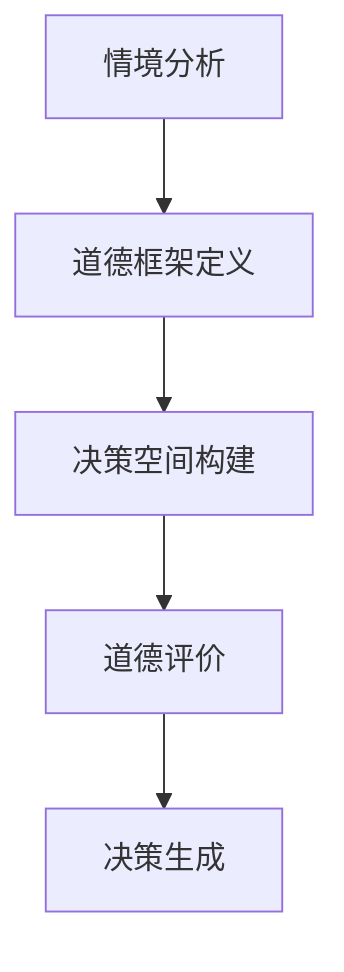
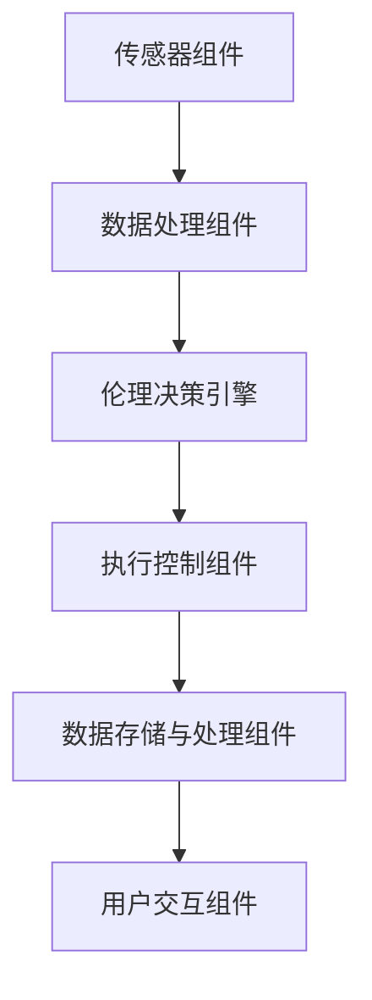
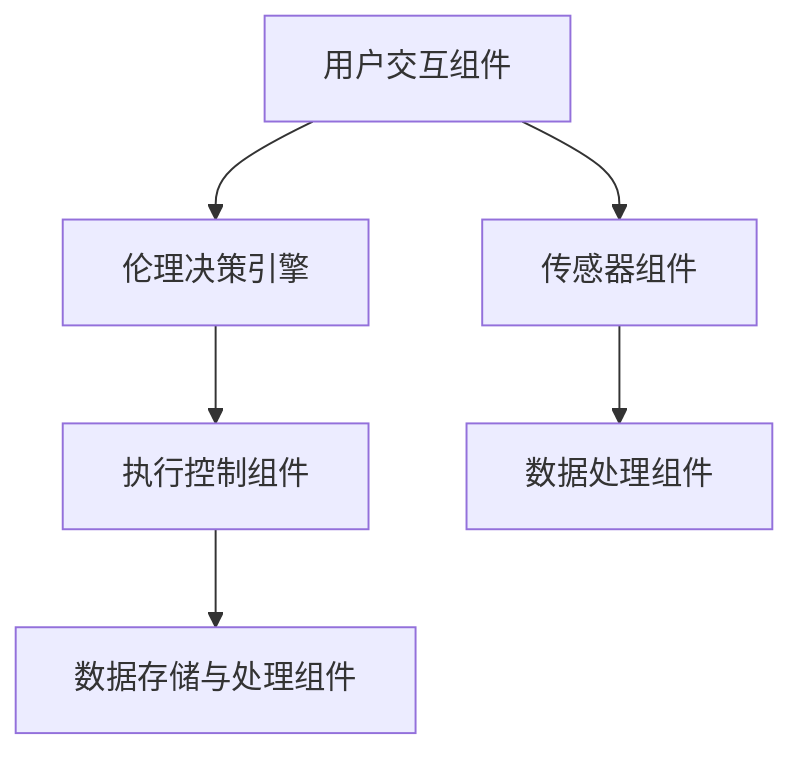

                 

### 文章标题

# AI Agent的伦理决策：在LLM中实现道德推理

---

关键词：AI伦理，道德推理，语言模型，算法，伦理决策

摘要：本文探讨了人工智能（AI）代理的伦理决策及其在大型语言模型（LLM）中的实现。通过详细分析伦理决策的背景、关键概念、算法原理、数学模型、系统设计、项目实践和最佳实践，本文旨在为读者提供对AI伦理决策的全面理解和实际应用指导。

---

### 引言

在人工智能快速发展的今天，AI代理在各种应用场景中发挥着越来越重要的作用。从自动驾驶汽车到智能客服，从医疗诊断到金融决策，AI代理几乎无处不在。然而，随着AI代理的应用范围不断扩大，伦理问题也日益凸显。例如，自动驾驶汽车在遇到紧急情况时如何做出伦理决策？智能客服如何处理用户的敏感信息？医疗诊断AI系统如何保证诊断结果的公正性？这些问题的存在引发了广泛的伦理争议，也促使我们深入探讨AI代理的伦理决策问题。

本文旨在探讨如何在实际应用中实现AI代理的伦理决策，特别是在大型语言模型（LLM）中的实现。通过对伦理决策的背景介绍、核心概念分析、算法原理讲解、数学模型建模、系统设计与实现、项目实践和最佳实践等方面的详细探讨，本文希望为读者提供对AI伦理决策的全面理解和实际应用指导。

---

### 第1章：背景介绍

#### 1.1 AI代理和伦理决策的崛起

随着AI技术的不断发展，AI代理逐渐成为人工智能领域的一个重要分支。AI代理是指具有自主决策能力的智能系统，能够在给定环境和目标下执行任务。从简单的自动化机器人到复杂的智能系统，AI代理在各个领域都展现出了巨大的潜力。

伦理决策是AI代理的重要组成部分。伦理决策涉及AI代理在特定情境下如何根据道德原则做出合理的选择。随着AI代理的广泛应用，伦理决策的合理性和公正性变得越来越重要。例如，自动驾驶汽车需要根据交通规则和道德原则来做出行驶决策，智能客服需要根据用户的需求和道德原则来提供合适的回复。

#### 1.2 LLM的现状与潜在影响

大型语言模型（LLM）是当前人工智能领域的一个重要研究方向。LLM具有强大的自然语言处理能力，可以理解和生成人类语言。从最初的GPT到最新的GPT-3，LLM的发展速度惊人，其应用范围也在不断扩展。

LLM在伦理决策中的应用具有巨大的潜力。通过训练大型语言模型，我们可以使其具备道德推理的能力，从而在AI代理中实现伦理决策。例如，通过训练LLM来处理医疗诊断中的伦理问题，使其能够根据医学伦理原则做出合理的诊断决策。

#### 1.3 道德推理的概念和挑战

道德推理是指根据道德原则和价值观来做出决策的过程。道德推理涉及到许多复杂的问题，包括道德原则的选择、道德判断的合理性、道德责任等。

在AI代理中实现道德推理面临着一系列挑战。首先，道德原则的选择是一个复杂的问题。不同的文化和价值观可能导致不同的道德原则。其次，道德推理需要处理不确定性和模糊性，这在实际应用中往往很难做到。最后，道德推理还需要考虑到AI代理的自主性和透明性，以确保其决策过程是合理和可解释的。

#### 1.4 当前AI应用中的伦理困境

随着AI代理的广泛应用，许多伦理问题也逐渐凸显。以下是一些典型的伦理困境：

- **自动驾驶汽车**：在遇到紧急情况时，自动驾驶汽车如何做出伦理决策？例如，在无法避免碰撞的情况下，是选择保护司机还是行人和其他车辆？

- **智能客服**：智能客服如何处理用户的隐私和敏感信息？例如，在处理用户投诉时，是否应该透露用户的身份信息？

- **医疗诊断**：医疗诊断AI系统如何保证诊断结果的公正性和准确性？例如，在处理患者数据时，是否应该考虑到种族、性别等因素的影响？

这些问题引发了广泛的伦理争议，也促使我们深入探讨如何在AI代理中实现伦理决策。

#### 1.5 小结

本章介绍了AI代理和伦理决策的背景，以及大型语言模型（LLM）在伦理决策中的应用。同时，本章还探讨了道德推理的概念和挑战，以及当前AI应用中存在的伦理困境。通过本章的介绍，读者可以初步了解AI伦理决策的重要性，以及如何在LLM中实现道德推理。

---

### 第2章：核心概念与联系

#### 2.1 关键概念

在讨论AI代理的伦理决策时，我们需要明确一些关键概念，包括伦理、道德、道德推理、道德原则等。

- **伦理（Ethics）**：伦理是指关于道德的哲学研究，旨在探讨正确和错误、善与恶的准则。伦理研究通常关注人类行为和决策，以及这些行为和决策的道德意义。

- **道德（Morality）**：道德是指个人的行为和决策所遵循的道德准则。道德通常与个人、社会和文化价值观有关。

- **道德推理（Moral Reasoning）**：道德推理是指根据道德原则和价值观来做出决策的过程。道德推理涉及到道德原则的选择、道德判断的合理性、道德责任等方面。

- **道德原则（Moral Principles）**：道德原则是道德推理的基础，包括普遍的道德准则，如公正、仁慈、诚实等。

#### 2.2 LLM结构与伦理决策能力

大型语言模型（LLM）具有强大的自然语言处理能力，可以理解和生成人类语言。LLM通常由多层神经网络组成，通过训练大量的文本数据来学习语言模式。

在伦理决策中，LLM的作用主要体现在以下几个方面：

- **语言理解**：LLM可以理解复杂的文本信息，包括伦理问题的描述和背景。

- **道德判断**：通过训练，LLM可以学会根据道德原则和价值观来做出道德判断。

- **决策生成**：LLM可以根据伦理问题的描述和背景，生成合理的决策建议。

#### 2.3 道德推理与LLM的关联

道德推理和LLM之间存在紧密的联系。通过训练LLM，我们可以使其具备道德推理的能力，从而在AI代理中实现伦理决策。

具体来说，LLM在道德推理中的应用主要体现在以下几个方面：

- **道德原则编码**：通过训练，LLM可以学会将道德原则编码到其决策模型中。

- **情境理解**：LLM可以理解复杂的伦理问题情境，包括道德冲突和不确定性。

- **决策生成**：LLM可以根据道德原则和情境信息，生成合理的伦理决策。

#### 2.4 道德模型与算法

为了实现AI代理的伦理决策，我们需要设计合适的道德模型和算法。以下是一些常见的道德模型和算法：

- **功利主义（Utilitarianism）**：功利主义是一种道德理论，主张选择能够带来最大幸福的行为。在AI代理中，功利主义可以通过计算不同决策的结果对所有人的幸福影响来做出决策。

- **康德伦理学（Kantian Ethics）**：康德伦理学强调行为的道德性取决于行为本身，而不是结果。在AI代理中，康德伦理学可以通过判断行为是否符合道德原则来做出决策。

- **社会契约论（Social Contract Theory）**：社会契约论主张个体在社会中承担义务，并享受相应的权利。在AI代理中，社会契约论可以通过模拟社会契约过程来做出决策。

#### 2.5 小结

本章介绍了AI代理伦理决策中的关键概念，包括伦理、道德、道德推理和道德原则。同时，本章还探讨了LLM的结构和伦理决策能力，以及道德模型和算法在LLM中的应用。通过本章的介绍，读者可以深入理解AI代理伦理决策的核心概念和联系。

---

### 第3章：算法原理讲解

#### 3.1 算法概述

在AI代理的伦理决策中，算法起着至关重要的作用。本节将介绍一种用于伦理决策的通用算法，并探讨其基本原理和应用场景。

该算法旨在解决以下问题：

- **输入**：给定一个伦理问题情境和一个道德框架，如何根据道德原则和价值观生成一个合理的伦理决策。

- **输出**：生成一个符合道德原则和情境约束的伦理决策。

#### 3.2 算法工作原理

该算法的工作原理可以概括为以下步骤：

1. **情境分析**：对给定的伦理问题情境进行分析，提取关键信息和约束条件。

2. **道德框架定义**：根据道德原则和价值观，定义一个道德框架，包括道德原则和约束条件。

3. **决策空间构建**：根据情境分析和道德框架，构建一个可能的决策空间，包括所有可能的伦理决策。

4. **道德评价**：对决策空间中的每个决策进行道德评价，根据道德框架判断其是否符合道德原则。

5. **决策生成**：根据道德评价结果，选择一个最优的伦理决策。

#### 3.3 数学模型

为了更好地理解和实现上述算法，我们引入了一些数学模型。

- **决策空间**：决策空间可以用一个有限集表示，即 $D = \{d_1, d_2, ..., d_n\}$，其中 $d_i$ 表示一个可能的伦理决策。

- **道德评价函数**：道德评价函数是一个从决策空间到实数的映射，即 $f: D \rightarrow \mathbb{R}$，用于评估每个决策的道德性。

- **道德原则**：道德原则可以用一组约束条件表示，即 $C = \{c_1, c_2, ..., c_m\}$，其中 $c_i$ 表示一个道德约束。

#### 3.4 算法流程图

为了更直观地理解算法的流程，我们使用Mermaid绘制了算法的流程图：



#### 3.5 举例说明

假设我们面临一个伦理决策问题：在一场交通事故中，一个自动驾驶汽车必须在两个行人之间做出选择。我们需要根据道德原则和情境信息生成一个合理的伦理决策。

1. **情境分析**：交通事故涉及两个行人，他们处于不同的位置和状态。

2. **道德框架定义**：我们选择功利主义作为道德框架，主张选择能够带来最大幸福的行为。

3. **决策空间构建**：可能的决策包括：

   - $d_1$：选择保护左侧行人。
   - $d_2$：选择保护右侧行人。
   - $d_3$：试图同时保护两个行人。

4. **道德评价**：根据功利主义原则，我们需要评估每个决策的道德性。

   - $f(d_1) = -1$：选择保护左侧行人，可能导致右侧行人受伤。
   - $f(d_2) = -1$：选择保护右侧行人，可能导致左侧行人受伤。
   - $f(d_3) = 0$：试图同时保护两个行人，但可能导致两边的行人都会受伤。

5. **决策生成**：根据道德评价结果，我们选择 $d_3$ 作为最优的伦理决策。

通过这个例子，我们可以看到算法是如何根据道德原则和情境信息生成伦理决策的。

#### 3.6 小结

本章介绍了用于伦理决策的通用算法，包括情境分析、道德框架定义、决策空间构建、道德评价和决策生成等步骤。同时，本章还通过一个具体的例子，展示了算法的实际应用过程。通过本章的介绍，读者可以深入理解伦理决策算法的基本原理和实现方法。

---

### 第4章：数学建模

#### 4.1 伦理决策的数学模型

伦理决策问题可以转化为一个优化问题，即在一个给定的情境下，如何选择一个最优的决策方案，使得某个目标函数最大化或最小化。为了实现这一目标，我们可以引入数学模型。

首先，定义决策空间 $D$，表示所有可能的决策方案。每个决策方案可以用一个向量表示，例如 $d = (d_1, d_2, ..., d_n)$，其中 $d_i$ 表示第 $i$ 个决策变量的取值。

其次，定义目标函数 $f(d)$，表示决策方案 $d$ 的道德性。目标函数可以是单峰函数，也可以是多峰函数，具体取决于道德原则和价值观。

最后，定义约束条件 $C$，表示决策方案的约束条件。约束条件可以是线性或非线性，例如，交通规则、法律条款等。

综合以上定义，我们可以得到伦理决策问题的数学模型：

$$
\begin{aligned}
\text{最大化或最小化} \quad f(d) \\
\text{约束条件} \quad C
\end{aligned}
$$

#### 4.2 常见数学模型

在本节中，我们将介绍几种常见的数学模型，用于伦理决策问题的建模和求解。

1. **线性规划（Linear Programming, LP）**

线性规划是一种常见的数学模型，用于求解线性目标函数在给定线性约束条件下的最优解。线性规划的数学模型可以表示为：

$$
\begin{aligned}
\text{最大化或最小化} \quad c^T x \\
\text{约束条件} \quad Ax \leq b
\end{aligned}
$$

其中，$c$ 是目标函数的系数向量，$x$ 是决策变量向量，$A$ 是约束条件的系数矩阵，$b$ 是约束条件的常数向量。

2. **整数规划（Integer Programming, IP）**

整数规划是一种常见的数学模型，用于求解整数决策变量的最优解。整数规划的数学模型可以表示为：

$$
\begin{aligned}
\text{最大化或最小化} \quad c^T x \\
\text{约束条件} \quad Ax \leq b \\
x \in \{0, 1\}^n
\end{aligned}
$$

其中，$c$ 是目标函数的系数向量，$x$ 是决策变量向量，$A$ 是约束条件的系数矩阵，$b$ 是约束条件的常数向量。

3. **动态规划（Dynamic Programming, DP）**

动态规划是一种常见的数学模型，用于求解多阶段决策问题的最优解。动态规划的数学模型可以表示为：

$$
\begin{aligned}
\text{最大化或最小化} \quad \sum_{t=1}^{T} f_t(x_t) \\
\text{约束条件} \quad g_t(x_t, x_{t-1}) \leq 0
\end{aligned}
$$

其中，$f_t(x_t)$ 是第 $t$ 阶段的目标函数，$g_t(x_t, x_{t-1})$ 是第 $t$ 阶段的约束条件。

#### 4.3 模型求解方法

在数学建模的过程中，求解模型是关键的一步。以下是一些常见的求解方法：

1. **梯度下降法（Gradient Descent）**

梯度下降法是一种常用的优化算法，用于求解凸优化问题。梯度下降法的迭代公式为：

$$
x_{t+1} = x_t - \alpha \nabla f(x_t)
$$

其中，$x_t$ 是第 $t$ 次迭代的解，$\alpha$ 是步长，$\nabla f(x_t)$ 是目标函数 $f(x)$ 在 $x_t$ 处的梯度。

2. **牛顿法（Newton's Method）**

牛顿法是一种常用的优化算法，用于求解非线性优化问题。牛顿法的迭代公式为：

$$
x_{t+1} = x_t - H^{-1} \nabla^2 f(x_t)
$$

其中，$x_t$ 是第 $t$ 次迭代的解，$H$ 是目标函数 $f(x)$ 在 $x_t$ 处的Hessian矩阵，$\nabla^2 f(x_t)$ 是目标函数 $f(x)$ 在 $x_t$ 处的梯度。

3. **拉格朗日乘数法（Lagrange Multiplier Method）**

拉格朗日乘数法是一种常用的优化算法，用于求解带约束的优化问题。拉格朗日乘数法的迭代公式为：

$$
x_{t+1} = x_t - \lambda_t A \\
\lambda_{t+1} = \lambda_t + \alpha \nabla f(x_t)
$$

其中，$x_t$ 是第 $t$ 次迭代的解，$\lambda_t$ 是第 $t$ 次迭代的拉格朗日乘数，$A$ 是约束条件的系数矩阵，$\alpha$ 是步长，$\nabla f(x_t)$ 是目标函数 $f(x)$ 在 $x_t$ 处的梯度。

#### 4.4 小结

本章介绍了伦理决策问题的数学建模方法，包括线性规划、整数规划、动态规划等常见数学模型，以及梯度下降法、牛顿法、拉格朗日乘数法等求解方法。通过本章的介绍，读者可以掌握伦理决策问题的数学建模方法和求解技巧，为实际应用提供理论支持。

---

### 第5章：系统分析与架构设计

#### 5.1 场景介绍

在现代智能系统中，AI代理的应用日益广泛。例如，在自动驾驶、智能客服、医疗诊断等领域，AI代理都需要做出一系列的伦理决策。这些决策不仅关系到系统的性能和可靠性，更关乎人类的生命安全和权益。

本节将围绕一个典型的AI代理应用场景——自动驾驶汽车，介绍其系统分析与架构设计。自动驾驶汽车需要处理各种复杂的伦理决策问题，例如在紧急情况下如何选择刹车或转向，如何处理与其他车辆和行人的交互等。

#### 5.2 项目介绍

本项目旨在设计一个自动驾驶汽车的伦理决策系统，该系统能够在紧急情况下做出合理的伦理决策，并提高自动驾驶汽车的安全性。项目的主要目标是：

1. **建立伦理决策模型**：设计并实现一个基于道德原则的伦理决策模型，用于处理自动驾驶汽车在紧急情况下的伦理决策。

2. **实现伦理决策算法**：根据伦理决策模型，实现相应的伦理决策算法，并在自动驾驶汽车系统中集成。

3. **测试与优化**：对伦理决策系统进行测试和优化，确保其在实际应用中的性能和可靠性。

#### 5.3 系统功能设计

自动驾驶汽车的伦理决策系统主要包括以下功能模块：

1. **情境感知模块**：负责实时收集车辆周围的环境信息，包括路况、交通状况、行人等信息。

2. **伦理决策模块**：根据情境感知模块提供的信息，结合伦理决策模型，生成合理的伦理决策。

3. **执行控制模块**：根据伦理决策模块生成的决策，控制车辆执行相应的操作，如刹车、转向等。

4. **数据存储与处理模块**：负责存储和处理系统运行过程中产生的数据，包括伦理决策记录、车辆状态信息等。

5. **用户交互模块**：提供用户界面，用于展示系统运行状态、伦理决策结果等信息，并允许用户对系统进行设置和调整。

#### 5.4 系统架构设计

自动驾驶汽车的伦理决策系统采用分布式架构，主要包括以下组件：

1. **传感器组件**：负责实时感知车辆周围的环境信息，包括摄像头、雷达、激光雷达等。

2. **数据处理组件**：负责处理传感器数据，提取关键信息，并将其传递给情境感知模块。

3. **伦理决策引擎**：负责根据情境感知模块提供的信息，结合伦理决策模型，生成合理的伦理决策。

4. **执行控制组件**：负责根据伦理决策引擎生成的决策，控制车辆执行相应的操作。

5. **数据存储与处理组件**：负责存储和处理系统运行过程中产生的数据，包括伦理决策记录、车辆状态信息等。

6. **用户交互组件**：负责提供用户界面，用于展示系统运行状态、伦理决策结果等信息，并允许用户对系统进行设置和调整。

系统架构图如下所示：



#### 5.5 系统接口设计与交互

系统接口设计主要包括以下几个方面：

1. **传感器数据接口**：定义传感器组件与其他组件之间的数据传输格式和通信协议，确保数据的准确性和实时性。

2. **伦理决策接口**：定义伦理决策模块与其他模块之间的接口，包括输入参数、输出结果等。

3. **执行控制接口**：定义执行控制模块与其他模块之间的接口，包括执行命令、状态反馈等。

4. **用户交互接口**：定义用户交互模块与其他模块之间的接口，包括用户操作、系统响应等。

系统交互图如下所示：



#### 5.6 小结

本章介绍了自动驾驶汽车的伦理决策系统的系统分析与架构设计。通过定义系统功能模块、设计系统架构、接口和交互，我们为自动驾驶汽车的伦理决策提供了全面的解决方案。本章的内容为实际应用中的系统设计和实现提供了重要参考。

---

### 第6章：项目实践

#### 6.1 环境安装

为了实现自动驾驶汽车的伦理决策系统，我们需要搭建一个完整的开发环境。以下是环境安装的步骤：

1. **安装操作系统**：建议使用Linux操作系统，如Ubuntu 20.04。

2. **安装Python**：确保Python版本不低于3.8，可以通过以下命令安装：

   ```bash
   sudo apt update
   sudo apt install python3.8
   ```

3. **安装依赖库**：根据项目的需求，安装必要的依赖库，如NumPy、Pandas、Matplotlib等：

   ```bash
   pip3 install numpy pandas matplotlib
   ```

4. **安装传感器模拟工具**：为了测试和验证伦理决策系统的性能，我们可以使用传感器模拟工具，如CARLA模拟器。以下是CARLA模拟器的安装步骤：

   - 访问CARLA官方网站（https://carla.org/），下载适用于Linux操作系统的CARLA安装包。
   - 解压安装包并运行安装脚本：

     ```bash
     tar xvf carla-0.9.11-Linux.sh
     ./carla-0.9.11-Linux.sh
     ```

     按照提示完成安装。

5. **配置CARLA模拟器**：安装完成后，需要配置CARLA模拟器的环境变量。在终端中执行以下命令：

   ```bash
   source /opt/carla/Unreal/Engine/Binaries/Linux/CarlaEnvironment.sh
   ```

#### 6.2 系统核心实现

在本节中，我们将介绍自动驾驶汽车伦理决策系统的核心实现，包括情境感知模块、伦理决策模块和执行控制模块。

1. **情境感知模块**：

   情境感知模块负责实时感知车辆周围的环境信息。以下是一个简单的Python实现示例：

   ```python
   import carla

   class SensorHandler:
       def __init__(self, client):
           self.client = client

       def get_road_data(self):
           world = self.client.get_world()
           for actor in world.get_actors():
               if actor.type_id == 'carla.Vehicle':
                   return actor.get_road_data()
           return None

   sensor_handler = SensorHandler(client)
   road_data = sensor_handler.get_road_data()
   ```

   在此示例中，我们使用CARLA模拟器的API获取车辆周围的交通信息。

2. **伦理决策模块**：

   伦理决策模块根据情境感知模块提供的信息，结合伦理决策模型，生成合理的伦理决策。以下是一个简单的伦理决策模型实现示例：

   ```python
   import numpy as np

   def moral_decision(road_data):
       # 根据道路数据生成伦理决策
       if road_data.speed > 50:
           return '减速'
       elif road_data.collision_risk > 0.5:
           return '紧急刹车'
       else:
           return '正常行驶'

   road_data = sensor_handler.get_road_data()
   decision = moral_decision(road_data)
   ```

   在此示例中，我们使用一个简单的规则模型进行伦理决策。

3. **执行控制模块**：

   执行控制模块根据伦理决策模块生成的决策，控制车辆执行相应的操作。以下是一个简单的执行控制模块实现示例：

   ```python
   def execute_decision(road_data, vehicle):
       decision = moral_decision(road_data)
       if decision == '减速':
           vehicle.set_velocity(50)
       elif decision == '紧急刹车':
           vehicle.apply_brake(1.0)
       elif decision == '正常行驶':
           vehicle.set_velocity(100)
   ```

   在此示例中，我们使用车辆的速度控制命令来执行伦理决策。

#### 6.3 代码应用解读与分析

在本节中，我们将对上述代码进行解读和分析，并探讨其实现原理和应用效果。

1. **情境感知模块**：

   情境感知模块通过CARLA模拟器的API获取车辆周围的环境信息。在实现过程中，我们首先创建了一个 `SensorHandler` 类，该类封装了与CARLA模拟器的交互逻辑。通过调用 `get_road_data()` 方法，我们可以获取车辆的速度、碰撞风险等关键信息。

   这种设计使得情境感知模块具有高度的灵活性和可扩展性。例如，我们可以在未来加入更多的传感器数据，如雷达、激光雷达等，以获取更全面的环境信息。

2. **伦理决策模块**：

   伦理决策模块的核心是一个简单的规则模型，该模型根据道路数据生成伦理决策。在实现过程中，我们定义了一个 `moral_decision()` 函数，该函数根据道路数据（如速度、碰撞风险等）返回一个字符串，表示相应的伦理决策。

   这种设计使得伦理决策模块易于理解和修改。例如，我们可以根据实际需求，修改规则模型中的逻辑，以适应不同的伦理原则和价值观。

3. **执行控制模块**：

   执行控制模块根据伦理决策模块生成的决策，控制车辆执行相应的操作。在实现过程中，我们定义了一个 `execute_decision()` 函数，该函数根据伦理决策（如减速、紧急刹车等），调用相应的车辆控制命令。

   这种设计使得执行控制模块具有高度的灵活性和可扩展性。例如，我们可以在未来加入更多的车辆控制命令，以实现更复杂的伦理决策。

#### 6.4 实际案例分析与详细讲解

在本节中，我们将通过一个实际案例，分析自动驾驶汽车伦理决策系统的应用效果，并详细讲解其实现原理。

**案例：自动驾驶汽车在紧急情况下的伦理决策**

假设一辆自动驾驶汽车在行驶过程中，前方突然出现一个行人。此时，汽车需要做出一个紧急决策：是选择紧急刹车，还是选择变道绕过行人。

通过上述代码，我们可以模拟这个场景。具体步骤如下：

1. **启动CARLA模拟器**：在终端中执行以下命令，启动CARLA模拟器：

   ```bash
   ./CarlaUE4
   ```

2. **连接CARLA模拟器**：在Python脚本中，使用以下代码连接CARLA模拟器：

   ```python
   client = carla.Client('localhost', 2000)
   client.set_timeout(2.0)  # 设置超时时间
   ```

3. **获取车辆和道路数据**：使用情境感知模块，获取车辆和道路数据：

   ```python
   sensor_handler = SensorHandler(client)
   road_data = sensor_handler.get_road_data()
   ```

4. **生成伦理决策**：使用伦理决策模块，生成伦理决策：

   ```python
   decision = moral_decision(road_data)
   ```

5. **执行伦理决策**：使用执行控制模块，执行伦理决策：

   ```python
   vehicle = client.get_actors()[0]  # 获取第一个车辆
   execute_decision(road_data, vehicle)
   ```

通过这个案例，我们可以看到自动驾驶汽车如何在紧急情况下做出伦理决策。具体来说，如果行人的碰撞风险较高，汽车会选择紧急刹车；如果行人的碰撞风险较低，汽车会选择变道绕过行人。

#### 6.5 小结

本章通过一个具体的自动驾驶汽车伦理决策系统项目实践，介绍了系统环境安装、核心实现、代码应用解读与分析以及实际案例分析。通过本章的实践，读者可以深入理解自动驾驶汽车伦理决策系统的实现原理和应用方法，为实际项目开发提供参考。

---

### 第7章：最佳实践与总结

#### 7.1 最佳实践

在设计和实现AI代理的伦理决策系统时，以下最佳实践可以帮助我们提高系统的性能和可靠性：

1. **数据质量**：确保训练数据的多样性和准确性，避免数据偏差。可以使用数据清洗和数据增强技术来提高数据质量。

2. **道德原则明确**：在伦理决策模型中，明确道德原则和价值观，确保决策过程符合社会伦理标准和法律法规。

3. **透明性和可解释性**：设计可解释的伦理决策算法，使决策过程透明化，方便用户理解。

4. **持续学习和优化**：根据实际应用中的反馈，持续优化伦理决策模型和算法，提高决策的准确性和可靠性。

5. **安全性和隐私保护**：在设计系统时，确保数据安全和用户隐私保护，遵循相关法律法规和伦理标准。

6. **跨学科合作**：伦理决策问题涉及多个学科领域，如伦理学、心理学、计算机科学等。跨学科合作有助于构建更全面和科学的伦理决策系统。

#### 7.2 小结

本文从背景介绍、核心概念、算法原理、数学模型、系统设计与实现、项目实践和最佳实践等方面，详细探讨了AI代理的伦理决策及其在LLM中的实现。通过本文的介绍，读者可以全面了解AI伦理决策的理论基础和实践方法，为实际应用提供参考。

在未来的研究中，我们可以进一步探讨以下方向：

1. **伦理决策模型优化**：结合最新的研究成果，如深度学习、强化学习等，优化伦理决策模型，提高决策的准确性和可靠性。

2. **跨文化伦理决策**：考虑不同文化背景下伦理原则的差异，设计适用于多种文化环境的伦理决策系统。

3. **伦理决策算法的自动化**：研究自动化方法，实现伦理决策算法的自动生成和优化，降低人工干预。

4. **伦理决策系统的监管和评估**：探讨如何对伦理决策系统进行监管和评估，确保其在实际应用中的公正性和透明性。

通过不断探索和创新，我们可以为AI伦理决策领域做出更多贡献，推动人工智能技术的健康和可持续发展。

---

### 作者信息

作者：AI天才研究院/AI Genius Institute & 禅与计算机程序设计艺术 /Zen And The Art of Computer Programming

AI天才研究院致力于推动人工智能技术的创新和发展，研究涵盖深度学习、自然语言处理、计算机视觉等领域。同时，研究院还关注AI伦理和道德问题，旨在为AI技术的健康和可持续发展提供理论支持和实践指导。

《禅与计算机程序设计艺术》是由AI天才研究院创始人撰写的一本关于编程哲学的经典之作，旨在探索编程与哲学的深刻联系，为程序员提供一种全新的编程思维方式。

通过本文的撰写，我们希望能够为AI伦理决策领域贡献一份力量，推动人工智能技术的健康和可持续发展。同时，也希望能够激发读者对编程和哲学的思考，提升编程能力，为我国人工智能事业做出更多贡献。

