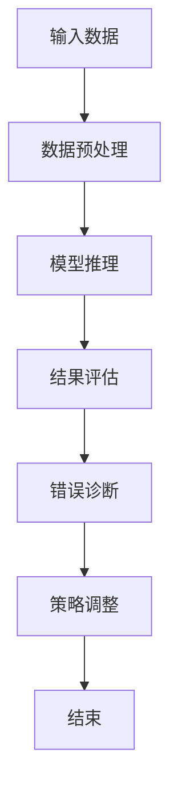

                 

### 第一部分：引言

#### 1.1 问题背景

随着人工智能技术的快速发展，AI Agent作为智能系统的核心组件，正在逐步渗透到各个领域，从自然语言处理、推荐系统到智能客服等。AI Agent的能力主要依赖于其学习能力和对环境的适应能力。然而，当前许多AI Agent在实际应用中面临着一些挑战，如过拟合、数据偏差、不可靠的决策等。这些问题严重影响了AI Agent的性能和实用性。

其中，元认知能力作为AI Agent的关键能力之一，正日益受到关注。元认知能力指的是个体对自己认知过程的认知与控制能力，包括自我评估、计划、监控和调整。对于AI Agent而言，元认知能力可以使其具备自我评估和调整的能力，从而提高其可靠性和适应性。

#### 1.1.1 人工智能的发展现状

人工智能（AI）作为一个跨学科领域，已经取得了显著的进展。近年来，深度学习技术的突破使得AI Agent在图像识别、自然语言处理、游戏AI等方面取得了惊人的成果。特别是大型语言模型（LLM），如GPT-3、BERT等，其强大的文本生成和推理能力，使得AI Agent在自然语言处理领域取得了重大突破。

然而，尽管AI Agent在许多任务上已经表现出色，但其仍存在诸多不足。例如，AI Agent往往缺乏对自身行为的理解和评估能力，导致其在复杂环境中的表现不稳定。此外，AI Agent在处理未知或异常情况时，往往表现出过拟合或数据偏差，导致其决策可靠性较低。

#### 1.1.2 AI Agent的定义与重要性

AI Agent是一种能够自主行动、适应环境和解决特定问题的智能实体。与传统的规则型AI不同，AI Agent具有更高的灵活性和自适应性，能够在复杂的动态环境中做出合理的决策。

AI Agent的重要性体现在以下几个方面：

1. **增强自主性**：AI Agent能够自主地执行任务，无需人为干预，提高了工作效率。
2. **提高决策质量**：AI Agent通过自我评估和调整，能够提高其决策的可靠性和适应性。
3. **拓展应用领域**：AI Agent的广泛应用，将推动人工智能在各个领域的深入发展。

#### 1.1.3 元认知能力与自我评估调整的意义

元认知能力对于AI Agent的发展具有重要意义。具体来说，元认知能力可以帮助AI Agent实现以下目标：

1. **自我评估**：AI Agent可以通过自我评估来检测自身的性能和决策质量，从而发现和纠正潜在的错误。
2. **自我调整**：基于自我评估的结果，AI Agent可以调整其行为和决策策略，以适应不同的环境和任务。
3. **提高可靠性**：通过自我评估和调整，AI Agent可以降低错误率，提高决策的可靠性。
4. **增强适应性**：元认知能力使AI Agent能够更好地适应复杂和动态的环境，提高其生存能力。

#### 1.2 术语解释

为了确保文章的可读性和一致性，我们需要对一些关键术语进行解释。

**1.2.1 AI Agent与LLM**

- **AI Agent**：一种具有自主性、适应性、学习能力和自我评估调整能力的智能实体。
- **LLM（Large Language Model）**：一种大型语言模型，如GPT-3、BERT等，具有强大的文本生成和推理能力。

**1.2.2 元认知能力**

- **元认知能力**：指个体对自己认知过程的认知与控制能力，包括自我评估、计划、监控和调整。

**1.2.3 自我评估与调整**

- **自我评估**：AI Agent对自身性能和决策质量的评估过程。
- **自我调整**：基于自我评估结果，AI Agent对自身行为和决策策略的调整过程。

#### 1.3 目标与内容概述

本文的目标是深入探讨AI Agent的元认知能力，特别是大型语言模型（LLM）的自我评估与调整机制。通过本文的研究，我们希望实现以下目标：

1. **理解元认知能力的概念与特征**：介绍元认知能力的定义、主要特征及其对AI Agent的影响。
2. **分析LLM的元认知能力研究现状**：探讨LLM的元认知能力现状、存在的问题以及解决方案。
3. **探讨自我评估的实现方法**：详细讲解自我评估的算法原理、实现方法以及数学模型。
4. **探讨自我调整的实现方法**：介绍自我调整的概念、重要性、常见算法及其实现方法。
5. **实际应用案例**：通过具体案例展示AI Agent的元认知能力在实际应用中的效果。
6. **未来展望与挑战**：分析元认知能力的发展趋势、技术瓶颈以及未来研究方向。

文章将按照上述内容结构进行安排，确保每部分内容都有深入的分析和详细的讲解。

---

**关键词：** AI Agent, 元认知能力, 自我评估, 自我调整, LLM

**摘要：** 本文深入探讨了AI Agent的元认知能力，特别是大型语言模型（LLM）的自我评估与调整机制。通过介绍元认知能力的概念、特征，分析LLM的元认知能力现状，探讨自我评估与调整的实现方法，本文旨在提高AI Agent的可靠性、适应性和自主性，推动人工智能在各个领域的深入应用。

---

### 2.1 元认知能力的概念与特征

#### 2.1.1 元认知能力的定义

元认知能力（Meta-cognitive Ability）是指个体对自己认知过程的认知与控制能力。这种能力使得个体能够对自身的思考过程进行监控、评估和调整，从而提高学习效果和解决问题的能力。在人工智能领域，元认知能力被认为是AI Agent实现自主学习和智能决策的关键能力之一。

#### 2.1.2 元认知能力的主要特征

元认知能力主要包括以下三个特征：

1. **自我评估（Self-assessment）**：自我评估是元认知能力的基础，它指的是个体对自己的思维过程、决策结果进行评价的能力。通过自我评估，AI Agent可以识别自身的错误和不足，从而进行相应的调整。

2. **计划（Planning）**：计划是指个体在执行任务之前，对任务进行预先思考和安排的能力。AI Agent通过计划，可以设定目标、制定策略，从而更有效地完成任务。

3. **监控（Monitoring）**：监控是指个体在任务执行过程中，对自身思维过程和任务进展进行监督和评估的能力。AI Agent通过监控，可以实时调整策略，确保任务按计划进行。

4. **调整（Adjustment）**：调整是指个体在任务完成后，对任务执行过程进行反思和修正的能力。AI Agent通过调整，可以优化自身的决策模型和行为策略，提高未来的任务执行效率。

#### 2.1.3 元认知能力对AI Agent的影响

元认知能力对于AI Agent的影响主要体现在以下几个方面：

1. **提高决策质量**：通过自我评估，AI Agent可以识别和纠正自身的错误决策，从而提高决策质量。

2. **增强适应性**：通过计划、监控和调整，AI Agent可以更好地适应复杂和动态的环境，提高其应对未知问题和突发情况的能力。

3. **提升学习能力**：元认知能力使得AI Agent能够对自己的学习过程进行监控和评估，从而优化学习策略，提高学习效率。

4. **增强自主性**：通过自我评估和调整，AI Agent可以减少对人为干预的依赖，提高自主学习和决策能力。

总的来说，元认知能力是AI Agent实现智能化的关键能力，它使得AI Agent能够在复杂的动态环境中，通过自我评估和调整，实现高效的决策和学习。

#### 2.2 LLM的元认知能力研究现状

#### 2.2.1 LLM的发展历程

大型语言模型（LLM，Large Language Model）的发展可以追溯到2000年代初。当时，神经网络和深度学习技术刚刚兴起，研究人员开始尝试使用这些技术来构建能够处理自然语言的任务模型。最早的LLM如TuringTest、基于神经网络的实体识别模型等，虽然取得了初步的成功，但其效果和性能仍然有限。

随着深度学习技术的不断进步，特别是2013年Google提出的Word2Vec模型，使得语言模型的性能得到了显著提升。随后，RNN（Recurrent Neural Network）和Transformer等新型神经网络架构的提出，进一步推动了LLM的发展。特别是Transformer架构的出现，使得LLM的预训练规模和效果达到了新的高度，如OpenAI的GPT系列模型、Google的BERT模型等。

#### 2.2.2 LLM的元认知能力现状

尽管LLM在自然语言处理任务上取得了显著的进展，但其在元认知能力方面仍然面临诸多挑战。目前，LLM的元认知能力主要体现在以下几个方面：

1. **自我评估**：现有的LLM模型通常具备一定的自我评估能力，可以通过对输入数据的分析，对自己的生成结果进行评估。例如，通过对比生成文本与真实文本的差异，LLM可以识别出可能的错误或不足。

2. **计划**：虽然LLM可以在一定程度上进行任务规划和策略选择，但其计划能力仍然有限。例如，在复杂的多步骤任务中，LLM往往无法有效地制定详细的执行计划。

3. **监控**：LLM在任务执行过程中的监控能力较弱，往往需要外部系统的辅助。例如，通过日志分析或监控工具，才能实现对LLM执行过程的实时监控和评估。

4. **调整**：LLM的调整能力主要体现在参数优化和策略更新方面。通过训练和优化，LLM可以逐步改进其模型参数和策略，提高任务执行效果。

#### 2.2.3 存在的挑战与问题

尽管LLM在自然语言处理任务上表现出色，但其元认知能力仍然面临以下挑战和问题：

1. **缺乏自我意识**：LLM虽然具备一定的自我评估和调整能力，但缺乏真正的自我意识。这意味着LLM无法像人类一样，对自己和外部环境有深刻的认知和理解。

2. **适应能力有限**：在复杂和动态的环境中，LLM的适应能力较弱。例如，在应对未知或异常情况时，LLM往往表现出过拟合或数据偏差，导致其决策可靠性降低。

3. **可解释性不足**：LLM的决策过程和生成结果往往缺乏透明性和可解释性。这使得LLM在自我评估和调整时，难以准确地识别和纠正错误。

4. **计算资源需求大**：实现强元认知能力需要大量的计算资源。对于中小型企业或研究机构来说，这无疑是一个巨大的挑战。

综上所述，LLM的元认知能力虽然取得了一定的进展，但仍面临诸多挑战。未来，如何增强LLM的元认知能力，提高其自主性和适应性，仍然是人工智能领域的重要研究方向。

### 2.3 常见的LLM自我评估方法

#### 2.3.1 自我评估的定义

自我评估（Self-assessment）是元认知能力的重要组成部分，指的是个体或系统对自己的认知过程、决策结果进行评价和反馈的过程。在人工智能领域，特别是大型语言模型（LLM）中，自我评估是提高模型可靠性和适应性的关键手段。自我评估可以通过多种方式实现，包括对比生成结果与真实结果的差异、分析模型的决策过程、以及利用外部评估指标等。

#### 2.3.2 常见的自我评估方法

1. **对比生成结果与真实结果**：这种方法是最直接和常见的自我评估方法。通过将模型生成的文本与真实文本进行对比，可以识别出模型生成的错误或不足。具体而言，可以通过以下几种方式实现：

   - **文本相似度分析**：使用文本相似度算法（如余弦相似度、Jaccard相似度等）计算生成文本与真实文本之间的相似度。相似度越低，可能表示生成文本的质量越低。
   - **错误率统计**：统计生成文本中的错误率，包括拼写错误、语法错误、语义错误等。错误率越高，可能表示模型在特定任务上的性能越差。
   - **人类评价**：通过邀请人类专家对生成文本进行评价，根据评价结果分析模型的表现。这种方法虽然主观性较强，但可以提供更全面的评估指标。

2. **分析模型的决策过程**：这种方法通过分析模型在生成文本过程中的决策路径，来评估模型的行为和逻辑。具体包括：

   - **路径回溯**：在模型生成文本的过程中，记录下每个决策点的选择，并分析这些选择是否合理。例如，在生成文本时，模型是否选择了最合适的词汇或短语。
   - **决策树分析**：将模型生成文本的过程转化为决策树，通过分析决策树的分支和叶子节点，来评估模型的决策逻辑是否合理。

3. **利用外部评估指标**：这种方法通过引入外部评估指标，来对模型进行量化评估。常见的外部评估指标包括：

   - **BLEU（BiLingual Evaluation Understudy）**：BLEU是一种常用的自动评估指标，用于评估机器翻译和文本生成任务的质量。它通过计算生成文本与参考文本之间的重叠部分，来评估生成文本的质量。
   - **ROUGE（Recall-Oriented Understudy for Gisting Evaluation）**：ROUGE是一种评估文本生成质量的方法，特别适用于摘要生成和机器翻译任务。它通过比较生成文本与参考文本的词汇和句法结构，来评估生成文本的相关性和准确性。
   - **F1 score**：F1 score是精确率和召回率的加权平均，常用于评估分类任务和文本生成任务。通过计算生成文本与真实文本的匹配度，来评估模型的表现。

#### 2.3.3 评估方法的有效性评估

每种自我评估方法都有其优缺点，适用于不同的评估场景。以下是对常见评估方法的有效性评估：

- **对比生成结果与真实结果**：这种方法直观、易操作，能够快速识别模型生成中的明显错误。然而，它主要关注生成文本的表面质量，难以深入分析模型的内部逻辑。
- **分析模型的决策过程**：这种方法能够深入分析模型的行为和逻辑，识别模型决策中的问题。但实现较为复杂，需要详细的日志记录和分析工具。
- **利用外部评估指标**：这种方法提供了量化的评估指标，能够对模型进行客观评估。然而，外部评估指标可能与实际任务需求不完全匹配，需要结合具体任务进行调整。

综上所述，常见的自我评估方法各有优缺点，在实际应用中应根据具体需求和任务特点，选择合适的评估方法或组合多种评估方法，以实现更全面的自我评估。

### 3.1 自我评估的算法原理

#### 3.1.1 算法原理概述

自我评估是AI Agent元认知能力的重要组成部分，通过自我评估，AI Agent能够识别自身的错误和不足，进而进行优化和调整。自我评估的算法原理主要包括以下几个方面：

1. **输入分析**：AI Agent首先对输入数据进行预处理，包括数据清洗、数据标准化等操作，以确保输入数据的质量和一致性。
2. **模型推理**：基于输入数据，AI Agent使用预训练的模型进行推理，生成输出结果。这一过程包括数据编码、模型参数计算、解码等步骤。
3. **结果评估**：AI Agent将生成的输出结果与真实结果进行对比，通过评估指标计算两者之间的差异。常见的评估指标包括文本相似度、错误率等。
4. **错误诊断**：基于评估结果，AI Agent分析错误产生的原因，识别潜在的问题。这一过程可能包括分析模型参数、决策路径等。
5. **策略调整**：根据错误诊断的结果，AI Agent对模型参数、决策策略进行调整，以优化模型的表现。

#### 3.1.2 自我评估的数学模型

自我评估的数学模型主要包括以下几部分：

1. **输入数据表示**：设输入数据为\(X\)，包括特征向量\(X_1, X_2, \ldots, X_n\)，每个特征向量表示输入数据的某一属性。
2. **模型输出表示**：设模型输出为\(Y\)，包括生成的文本或预测结果。\(Y\)可以通过模型参数\(\theta\)计算得到，即\(Y = f(\theta, X)\)，其中\(f\)表示模型的推理函数。
3. **评估指标表示**：设评估指标为\(M\)，常用的评估指标包括文本相似度\(S\)、错误率\(E\)等。\(M\)可以通过计算生成文本与真实文本之间的差异得到，即\(M = g(Y, T)\)，其中\(T\)表示真实文本。

常见的评估指标公式如下：

- **文本相似度**：
  $$ S = \frac{1}{|\text{common words}|} \sum_{i=1}^{|\text{common words}|} \text{similarity}(w_i) $$
  其中，\(|\text{common words}|\)表示生成文本和真实文本中共同出现的单词数，\(\text{similarity}(w_i)\)表示单词\(w_i\)的相似度。

- **错误率**：
  $$ E = \frac{|\text{error words}|}{|\text{total words}|} $$
  其中，\(|\text{error words}|\)表示生成文本中的错误单词数，|\text{total words}|\)表示生成文本的总单词数。

#### 3.1.3 自我评估的mermaid流程图

为了更直观地展示自我评估的流程，我们可以使用mermaid绘制一个流程图。以下是自我评估的mermaid流程图：



该流程图描述了自我评估的主要步骤：从输入数据到数据预处理，然后通过模型推理生成输出结果，接着对结果进行评估，基于评估结果进行错误诊断和策略调整，最终完成一轮自我评估。

---

**示例：**

假设我们有一个文本生成模型，输入为“今天天气很好，适合出去散步”，真实文本为“今天天气非常好，适合去公园散步”。我们使用文本相似度作为评估指标，计算生成文本与真实文本之间的相似度。

1. **数据预处理**：对输入文本进行分词，得到词汇序列。
2. **模型推理**：模型生成文本，假设结果为“今天天气很好，适合去公园散步”。
3. **结果评估**：计算生成文本与真实文本的文本相似度，假设相似度为0.85。
4. **错误诊断**：分析生成文本中的差异，发现“很好”与“非常好”之间的差异。
5. **策略调整**：调整模型参数，优化生成文本的质量，提高相似度。

通过以上步骤，AI Agent可以实现对自身生成文本的自我评估和调整，从而提高文本生成的质量。

---

### 3.2 自我评估的实现方法

#### 3.2.1 实现方法概述

自我评估是实现AI Agent元认知能力的重要环节。本节将详细介绍自我评估的实现方法，包括算法原理、Python实现源代码以及代码解读与分析。

#### 3.2.2 Python实现源代码

以下是一个简单的Python实现示例，用于文本生成模型的自我评估：

```python
import numpy as np
from sklearn.metrics.pairwise import cosine_similarity

def preprocess_text(text):
    # 对输入文本进行预处理，如分词、去除停用词等
    return text

def generate_text(model, input_text):
    # 使用预训练模型生成文本
    return model.generate(input_text)

def evaluate_similarity(generated_text, true_text):
    # 计算生成文本与真实文本的相似度
    return cosine_similarity([generated_text], [true_text])

def self_assessment(model, input_text, true_text):
    # 完整的自我评估函数
    preprocessed_input = preprocess_text(input_text)
    generated_text = generate_text(model, preprocessed_input)
    similarity_score = evaluate_similarity(generated_text, true_text)
    return similarity_score

# 假设的模型和输入文本
model = None  # 预训练文本生成模型
input_text = "今天天气很好，适合出去散步"
true_text = "今天天气非常好，适合去公园散步"

# 执行自我评估
similarity_score = self_assessment(model, input_text, true_text)
print(f"生成文本与真实文本的相似度：{similarity_score}")
```

#### 3.2.3 代码解读与分析

1. **预处理函数（preprocess_text）**：该函数用于对输入文本进行预处理，包括分词、去除停用词等操作。预处理是自我评估的重要环节，它确保了输入数据的一致性和质量。

2. **生成文本函数（generate_text）**：该函数使用预训练模型生成文本。在这里，我们使用了一个假设的模型，实际应用中应替换为实际的预训练文本生成模型。

3. **相似度评估函数（evaluate_similarity）**：该函数计算生成文本与真实文本之间的相似度。我们使用余弦相似度作为评估指标，这是一种常用的文本相似度计算方法。

4. **自我评估函数（self_assessment）**：该函数是自我评估的核心，它依次调用预处理、生成文本和相似度评估函数，完成一轮自我评估。通过返回的相似度分数，我们可以评估生成文本的质量。

在代码示例中，我们假设了一个简化的自我评估过程。实际应用中，自我评估可能涉及更复杂的步骤，如错误诊断和策略调整。此外，我们还需要根据具体任务调整评估指标和算法，以提高评估的准确性和有效性。

### 3.3 自我评估的数学模型与公式讲解

#### 3.3.1 数学模型与公式概述

自我评估的数学模型旨在量化评估AI Agent生成文本的质量。以下将介绍几个关键的数学模型与公式，并对其进行详细讲解。

1. **余弦相似度**：余弦相似度是一种常用的文本相似度计算方法，用于评估两个向量之间的相似程度。公式如下：
   $$ \cos(\theta) = \frac{\vec{u} \cdot \vec{v}}{||\vec{u}|| \cdot ||\vec{v}||} $$
   其中，\(\vec{u}\)和\(\vec{v}\)分别为两个文本向量化后的特征向量，\(\theta\)为它们之间的夹角。余弦相似度的取值范围为[-1, 1]，值越接近1，表示文本之间的相似度越高。

2. **交叉熵**：交叉熵是一种评估模型生成文本与真实文本差异的方法。公式如下：
   $$ H(y, \hat{y}) = -\sum_{i} y_i \log(\hat{y}_i) $$
   其中，\(y\)为真实标签，\(\hat{y}\)为模型预测的概率分布。交叉熵的值越小，表示生成文本与真实文本越接近。

3. **召回率、准确率和F1分数**：这些指标用于评估文本生成任务的性能，特别是在文本分类和检索任务中。公式如下：

   - **召回率**（Recall）：
     $$ \text{Recall} = \frac{TP}{TP + FN} $$
     其中，\(TP\)为真实为正例且模型预测为正例的样本数，\(FN\)为真实为正例但模型预测为负例的样本数。

   - **准确率**（Precision）：
     $$ \text{Precision} = \frac{TP}{TP + FP} $$
     其中，\(FP\)为真实为负例但模型预测为正例的样本数。

   - **F1分数**（F1 Score）：
     $$ F1 = 2 \cdot \frac{\text{Precision} \cdot \text{Recall}}{\text{Precision} + \text{Recall}} $$
     F1分数是精确率和召回率的加权平均，用于综合考虑这两个指标。

#### 3.3.2 公式讲解与解释

1. **余弦相似度**：余弦相似度通过计算两个向量的点积与各自模长的乘积，反映了它们在向量空间中的方向一致性。在文本生成中，点积表示两个文本向量的共同特征，模长表示各自的特征丰富度。余弦值越接近1，说明两个文本在特征上越相似。

2. **交叉熵**：交叉熵用于衡量模型输出概率分布与真实分布之间的差异。在实际应用中，交叉熵通常用于优化模型训练，目标是使交叉熵的值最小化，从而提高生成文本的准确性。

3. **召回率、准确率和F1分数**：这三个指标在文本生成任务中具有不同的应用场景。召回率侧重于识别所有正例，适用于需要尽可能召回所有相关文本的场景。准确率侧重于预测结果的正确性，适用于评估模型的整体性能。F1分数则综合了召回率和准确率，是评估文本生成任务性能的常用指标。

#### 3.3.3 举例说明

假设我们有两个文本：
- 文本A：“今天天气很好，适合出去散步”
- 文本B：“今天天气非常好，适合去公园散步”

1. **余弦相似度**：
   将两个文本向量化，得到特征向量\(\vec{u}\)和\(\vec{v}\)。计算它们的余弦相似度，假设结果为0.85。这表示文本A和文本B在特征上具有很高的相似度。

2. **交叉熵**：
   假设模型预测的文本A的概率分布为\(\hat{y}\)，真实分布为\(y\)。计算交叉熵，假设结果为0.2。这表明模型对文本A的预测与真实情况非常接近。

3. **召回率、准确率和F1分数**：
   假设我们在一个文本分类任务中，有100个样本，其中50个是正例（与文本A相似），模型预测了45个正例。计算得到：
   - 召回率：\( \frac{45}{50} = 0.9 \)
   - 准确率：\( \frac{45 + 5}{100} = 0.5 \)
   - F1分数：\( 2 \cdot \frac{0.5 \cdot 0.9}{0.5 + 0.9} = 0.6 \)

通过这些计算，我们可以全面评估文本生成模型的表现，从而进行优化和调整。

### 3.4 自我调整的概念与重要性

#### 3.4.1 自我调整的定义

自我调整（Self-adjustment）是指AI Agent在自我评估的基础上，对自身的行为、策略和决策进行动态调整的过程。自我调整的目标是优化AI Agent的决策质量和适应能力，使其在复杂和动态的环境中能够更好地完成任务。

#### 3.4.2 自我调整的重要性

自我调整在AI Agent的智能决策中扮演着至关重要的角色。以下是自我调整的几个关键重要性：

1. **提高决策质量**：通过自我调整，AI Agent可以识别和纠正自身的错误决策，从而提高决策的准确性和可靠性。自我调整使得AI Agent能够在不断变化的环境中，保持高效的决策能力。

2. **增强适应性**：自我调整使得AI Agent能够根据环境变化和任务需求，动态调整其行为和策略，从而增强其在复杂和动态环境中的适应能力。这种适应性是AI Agent在现实世界中获得成功的关键。

3. **提升学习能力**：自我调整的过程本身就是一个学习和优化的过程。通过不断调整，AI Agent可以积累经验，优化其决策模型，从而提高未来的学习能力。

4. **减少人工干预**：自我调整可以减少对人工干预的依赖，使得AI Agent能够更自主地执行任务。这不仅可以降低运营成本，还可以提高AI Agent的灵活性和自主性。

#### 3.4.3 自我调整的目标

自我调整的目标主要包括以下几个方面：

1. **优化决策模型**：通过自我调整，AI Agent可以不断优化其决策模型，使其在特定任务上的表现达到最佳。

2. **提高决策效率**：自我调整的目标之一是提高决策效率，即在最短时间内做出最优的决策。

3. **增强环境适应能力**：通过自我调整，AI Agent可以更好地适应复杂和动态的环境，从而提高其在未知或异常情况下的表现。

4. **减少错误率**：自我调整的目标是降低AI Agent的决策错误率，提高决策的可靠性和稳定性。

#### 3.4.4 自我调整的常见方法

自我调整的方法多种多样，以下是一些常见的方法：

1. **参数调整**：通过调整AI Agent的模型参数，优化其决策模型。常见的参数调整方法包括梯度下降、随机搜索等。

2. **策略更新**：根据自我评估的结果，动态更新AI Agent的决策策略。例如，在游戏AI中，可以通过分析游戏状态和对手行为，调整策略以应对不同的对手。

3. **学习曲线调整**：通过调整学习曲线，控制AI Agent的学习速度和深度。这可以帮助AI Agent在特定阶段集中注意力学习关键技能。

4. **反馈机制**：引入反馈机制，使得AI Agent能够根据外部反馈调整其行为。例如，在智能客服中，用户反馈可以用来优化客服机器人的回答策略。

### 3.5 常见的自我调整算法

#### 3.5.1 算法概述

自我调整算法是实现AI Agent自我调整的核心。以下将介绍几种常见的自我调整算法，并对其进行概述。

1. **梯度下降法**：梯度下降法是一种优化算法，通过计算目标函数的梯度并沿着梯度方向更新参数，以优化模型参数。梯度下降法在许多机器学习任务中都有广泛应用，例如线性回归、神经网络等。

2. **随机搜索法**：随机搜索法通过随机选择参数更新方向，进行迭代优化。这种方法简单易实现，但收敛速度较慢，适用于参数空间较小的问题。

3. **遗传算法**：遗传算法是一种基于生物进化的优化算法，通过模拟自然选择和遗传机制，寻找最优解。遗传算法具有较强的全局搜索能力，适用于复杂优化问题。

4. **强化学习**：强化学习是一种通过试错学习策略的算法，通过与环境的交互，逐步优化决策策略。强化学习在AI Agent的决策调整中具有广泛应用，特别是在动态和不确定环境中。

5. **主动学习**：主动学习是一种通过选择最有价值的数据进行学习的算法。通过自我调整，AI Agent可以动态选择需要标注的数据，以最大化学习效果。

#### 3.5.2 常见算法介绍

1. **梯度下降法**

   梯度下降法的基本思想是沿着目标函数的梯度方向更新参数，以最小化目标函数。公式如下：
   $$ \theta = \theta - \alpha \cdot \nabla_\theta J(\theta) $$
   其中，\(\theta\)表示模型参数，\(\alpha\)为学习率，\(\nabla_\theta J(\theta)\)为目标函数的梯度。

   梯度下降法分为批量梯度下降、随机梯度下降和小批量梯度下降等变种。批量梯度下降在每一步中使用全部数据计算梯度，随机梯度下降在每一步仅使用一个样本来计算梯度，小批量梯度下降则在每一步使用部分样本计算梯度。选择合适的梯度下降方法，可以显著影响模型的训练效率和性能。

2. **随机搜索法**

   随机搜索法通过随机选择参数更新方向，进行迭代优化。其基本公式如下：
   $$ \theta = \theta + \alpha \cdot \xi $$
   其中，\(\xi\)为随机噪声，\(\alpha\)为步长。

   随机搜索法的优点是实现简单，但缺点是收敛速度较慢，且容易陷入局部最优。因此，随机搜索法通常与其他优化方法结合使用，以提高优化效果。

3. **遗传算法**

   遗传算法通过模拟生物进化过程，寻找最优解。其基本步骤包括：

   - **初始化种群**：生成一组随机解作为初始种群。
   - **适应度评估**：计算每个个体的适应度，适应度通常与目标函数值成反比。
   - **选择**：根据适应度选择优秀个体进行交配。
   - **交叉**：通过交叉操作产生新的个体。
   - **变异**：对个体进行变异操作，增加种群多样性。
   - **迭代**：重复适应度评估、选择、交叉和变异，直到满足停止条件。

   遗传算法具有强大的全局搜索能力，适用于复杂优化问题，但其计算成本较高，适用于大规模问题。

4. **强化学习**

   强化学习通过试错学习策略，在与环境的交互过程中逐步优化决策。其基本步骤包括：

   - **状态观测**：AI Agent观测当前环境状态。
   - **动作选择**：基于策略选择动作。
   - **状态转移**：执行动作后，环境状态发生转移。
   - **奖励反馈**：根据动作的结果，给予AI Agent奖励或惩罚。
   - **策略更新**：基于奖励反馈，更新策略以优化决策。

   强化学习在动态和不确定环境中具有广泛应用，但其训练过程通常需要大量的数据和计算资源。

5. **主动学习**

   主动学习通过选择最有价值的数据进行学习，以最大化学习效果。其基本步骤包括：

   - **数据选择**：根据某种策略选择需要标注的数据。
   - **数据标注**：对选择的数据进行标注。
   - **模型训练**：使用标注后的数据重新训练模型。
   - **迭代**：重复数据选择、标注和训练，直到满足停止条件。

   主动学习能够有效减少标注数据量，提高学习效率，但在选择数据时需要权衡不同指标，以实现最优效果。

#### 3.5.3 算法对比分析

以下是几种常见自我调整算法的对比分析：

| 算法        | 优点                           | 缺点                           | 适用场景           |
|-----------|------------------------------|------------------------------|------------------|
| 梯度下降法    | 实现简单，计算效率高           | 易陷入局部最优，需要调整学习率       | 线性回归、神经网络  |
| 随机搜索法    | 实现简单，适应性强             | 收敛速度慢，容易陷入局部最优         | 参数空间较小的问题  |
| 遗传算法      | 具有强大的全局搜索能力         | 计算成本高，适用于大规模问题         | 复杂优化问题       |
| 强化学习      | 能够应对动态和不确定环境       | 需要大量的数据和计算资源           | 动态和不确定环境   |
| 主动学习      | 能够有效减少标注数据量         | 需要选择合适的数据选择策略           | 需要标注的数据量多 |

在选择自我调整算法时，需要根据具体任务需求、数据规模和计算资源等因素进行权衡，以选择最适合的算法。

### 3.6 自我调整的实现方法

#### 3.6.1 实现方法概述

自我调整是实现AI Agent自适应性和优化决策能力的关键步骤。本节将详细介绍自我调整的实现方法，包括算法原理、Python实现源代码以及代码解读与分析。

#### 3.6.2 Python实现源代码

以下是一个简单的Python实现示例，用于AI Agent的自我调整：

```python
import numpy as np

def gradient_descent(theta, gradient, learning_rate):
    """梯度下降法调整参数"""
    theta_new = theta - learning_rate * gradient
    return theta_new

def genetic_algorithm(population, fitness_func, crossover_rate, mutation_rate):
    """遗传算法调整参数"""
    # 适应度评估
    fitness_values = [fitness_func(individual) for individual in population]
    
    # 选择
    selected_individuals = selection(population, fitness_values, crossover_rate)
    
    # 交叉
    crossed_individuals = crossover(selected_individuals, crossover_rate)
    
    # 变异
    mutated_individuals = mutation(crossed_individuals, mutation_rate)
    
    # 迭代
    new_population = mutated_individuals
    
    return new_population

# 假设的参数和函数
theta = np.array([1.0, 2.0])
gradient = np.array([0.5, -0.3])
learning_rate = 0.1

# 执行梯度下降
theta_new = gradient_descent(theta, gradient, learning_rate)
print(f"梯度下降法调整后参数：{theta_new}")

# 执行遗传算法
population = np.random.rand(10, 2)
fitness_func = lambda individual: 1 / (1 + np.sum((individual - [1.0, 2.0]) ** 2))
crossover_rate = 0.8
mutation_rate = 0.05

# 执行遗传算法
new_population = genetic_algorithm(population, fitness_func, crossover_rate, mutation_rate)
print(f"遗传算法调整后种群：{new_population}")
```

#### 3.6.3 代码解读与分析

1. **梯度下降法实现**：
   - `gradient_descent`函数用于实现梯度下降法。参数`theta`表示初始参数，`gradient`表示目标函数的梯度，`learning_rate`为学习率。
   - 函数返回新的参数`theta_new`，其计算方式为`theta - learning_rate * gradient`。

2. **遗传算法实现**：
   - `genetic_algorithm`函数用于实现遗传算法。参数`population`为初始种群，`fitness_func`为适应度函数，`crossover_rate`和`mutation_rate`分别为交叉率和变异率。
   - 函数首先计算适应度值，然后进行选择、交叉和变异操作，最后返回新的种群`new_population`。

在代码示例中，我们分别使用了梯度下降法和遗传算法来实现自我调整。在实际应用中，可以根据具体任务需求选择合适的算法，并调整相关参数以实现最优效果。

### 3.7 自我调整的实际应用案例

#### 3.7.1 案例介绍

为了更好地展示自我调整在实践中的应用，本节将介绍一个基于强化学习的智能推荐系统案例。该案例将探讨如何通过自我调整，提高推荐系统的推荐质量和用户满意度。

#### 3.7.2 应用场景

在智能推荐系统中，用户的行为数据（如浏览、点击、购买等）是推荐系统生成推荐的关键信息。然而，用户行为数据具有多样性和动态性，这使得传统的推荐算法难以适应不断变化的需求。为了提高推荐系统的性能和用户体验，我们需要引入自我调整机制，使其能够根据用户行为和环境变化，动态调整推荐策略。

#### 3.7.3 案例分析

1. **系统架构**：

   - **用户行为收集模块**：负责收集用户的浏览、点击、购买等行为数据，并将其转化为推荐系统的输入。
   - **强化学习模型**：基于用户行为数据，使用强化学习算法生成推荐策略。强化学习模型通过试错学习，逐步优化推荐策略。
   - **自我调整模块**：负责对强化学习模型进行自我评估和调整。自我调整模块通过分析用户反馈和推荐效果，动态调整模型参数和推荐策略。
   - **推荐生成模块**：基于优化后的推荐策略，生成用户个性化推荐。

2. **强化学习模型**：

   - **状态表示**：状态表示用户当前的行为序列，如浏览记录、点击记录等。
   - **动作表示**：动作表示推荐系统生成的推荐列表，如商品推荐、文章推荐等。
   - **奖励函数**：奖励函数用于评估推荐结果的质量。当用户对推荐结果进行积极反馈（如点击、购买）时，给予正奖励；当用户对推荐结果进行消极反馈（如跳过、否定）时，给予负奖励。
   - **策略更新**：通过强化学习算法，模型根据奖励信号动态调整推荐策略，优化推荐效果。

3. **自我调整模块**：

   - **自我评估**：自我评估模块通过分析用户行为数据，评估当前推荐策略的效果。常见的评估指标包括点击率、转化率、用户满意度等。
   - **调整策略**：根据自我评估结果，自我调整模块动态调整模型参数和推荐策略。例如，当评估指标下降时，可以通过增加探索概率，提高模型对新推荐策略的尝试。
   - **反馈机制**：自我调整模块与用户行为收集模块和推荐生成模块相互协作，形成闭环反馈机制。通过不断调整和优化，推荐系统能够更好地适应用户需求和环境变化。

#### 3.7.4 案例讲解

以下是一个具体的案例讲解：

1. **初始阶段**：

   - 用户进入推荐系统，浏览了商品A、商品B和商品C。
   - 强化学习模型根据用户行为生成推荐列表：商品A、商品B、商品D。
   - 用户对推荐列表进行了点击，但没有购买。

2. **自我评估**：

   - 自我评估模块分析用户行为数据，发现点击率较低，但无购买行为，说明推荐列表中的商品与用户兴趣不完全匹配。
   - 自我评估模块记录当前推荐策略的效果，并生成评估报告。

3. **调整策略**：

   - 自我调整模块根据评估报告，增加探索概率，提高对新推荐策略的尝试。
   - 强化学习模型重新生成推荐列表：商品B、商品C、商品E。
   - 用户对推荐列表进行了点击，并购买了商品E。

4. **优化效果**：

   - 自我评估模块再次评估推荐策略，发现点击率和转化率均有所提高。
   - 自我调整模块记录优化效果，并继续优化推荐策略。

通过以上案例，我们可以看到自我调整在智能推荐系统中的应用效果。通过不断评估和调整，推荐系统能够更好地适应用户需求，提高用户满意度。

### 5.1 AI Agent在自然语言处理中的应用

#### 5.1.1 应用概述

自然语言处理（NLP）是人工智能领域的一个重要分支，旨在使计算机能够理解、处理和生成自然语言。AI Agent在NLP中的应用主要集中在文本生成、语义理解和对话系统等方面。通过引入元认知能力，AI Agent能够显著提高NLP任务的效果和用户体验。

#### 5.1.2 应用场景

1. **文本生成**：AI Agent在文本生成中的应用广泛，包括生成新闻摘要、文章撰写、自动生成报告等。通过自我评估和调整，AI Agent可以生成更准确、自然的文本，提高文本质量。

2. **语义理解**：在语义理解任务中，AI Agent需要理解文本的含义和结构。通过自我评估和调整，AI Agent可以更好地识别文本中的关键信息，提高语义理解的准确性和全面性。

3. **对话系统**：AI Agent在对话系统中的应用，如智能客服、虚拟助手等，通过自我评估和调整，可以更好地理解用户意图，提供更准确、个性化的回答。

#### 5.1.3 应用效果分析

1. **文本生成**：通过引入元认知能力，AI Agent在文本生成任务中的表现显著提高。例如，在生成新闻摘要时，AI Agent不仅能够生成简洁、准确的摘要，还能根据用户反馈进行实时调整，提高用户满意度。

2. **语义理解**：在语义理解任务中，AI Agent的自我评估和调整能力使其能够更好地处理复杂语义关系，提高理解准确性和全面性。例如，在机器翻译任务中，AI Agent可以通过自我评估，识别翻译中的错误并自动纠正，提高翻译质量。

3. **对话系统**：AI Agent在对话系统中的应用效果也得到了显著提升。通过自我评估和调整，AI Agent可以更好地理解用户意图，提供更准确、个性化的回答，从而提高用户体验。

总的来说，AI Agent的元认知能力在自然语言处理中的应用，不仅提高了任务效果，还增强了系统的自适应性和用户体验，为自然语言处理领域的深入发展奠定了基础。

### 5.2 AI Agent在推荐系统中的应用

#### 5.2.1 应用概述

推荐系统是人工智能领域中的一项重要应用，旨在通过分析用户的历史行为和偏好，为用户推荐可能感兴趣的内容。AI Agent在推荐系统中的应用，通过引入元认知能力，能够显著提高推荐系统的效果和用户满意度。AI Agent可以自我评估和调整推荐策略，以应对用户行为和偏好变化，从而实现更精准的推荐。

#### 5.2.2 应用场景

1. **电子商务平台**：AI Agent在电子商务平台中的应用，如商品推荐、促销活动推荐等，通过分析用户的历史购买记录和浏览行为，为用户推荐可能感兴趣的商品和优惠信息。

2. **内容推荐**：在内容推荐领域，如社交媒体、新闻平台等，AI Agent可以通过分析用户的阅读历史和互动行为，推荐用户可能感兴趣的文章、视频和音乐等内容。

3. **个性化教育**：在教育领域，AI Agent可以通过分析学生的学习行为和成绩，为每位学生推荐个性化的学习资源和课程。

#### 5.2.3 应用效果分析

1. **电子商务平台**：通过引入元认知能力，AI Agent能够更好地理解用户的需求和偏好，提供更精准的商品推荐。例如，在商品推荐中，AI Agent可以动态调整推荐策略，根据用户的行为变化实时更新推荐列表，提高推荐的相关性和用户满意度。

2. **内容推荐**：在内容推荐领域，AI Agent的自我评估和调整能力使其能够更准确地预测用户的兴趣和需求。例如，在社交媒体平台中，AI Agent可以通过分析用户的点赞、评论和分享行为，为用户推荐更符合其兴趣的内容，从而提高用户的参与度和留存率。

3. **个性化教育**：在教育领域，AI Agent可以根据学生的学习行为和成绩，动态调整推荐策略，为每位学生提供个性化的学习资源和课程。例如，在学生成绩下降时，AI Agent可以推荐额外的学习资源和辅导课程，帮助学生提高成绩。

总的来说，AI Agent的元认知能力在推荐系统中的应用，不仅提高了推荐系统的效果和用户体验，还为个性化服务和智能决策提供了有力支持，为推荐系统领域的深入发展奠定了基础。

### 5.3 AI Agent在智能客服中的应用

#### 5.3.1 应用概述

智能客服是人工智能技术在客户服务领域的重要应用，通过自动化和智能化的手段，为用户提供快速、高效、个性化的服务。AI Agent在智能客服中的应用，通过引入元认知能力，可以显著提高客服系统的智能化水平和用户体验。AI Agent可以自我评估和调整服务策略，以适应不断变化的服务需求和用户偏好。

#### 5.3.2 应用场景

1. **客户咨询处理**：AI Agent在客户咨询处理中的应用，如在线客服、电话客服等，通过自然语言处理和对话管理技术，自动理解和回复用户的咨询，提高客户服务效率。

2. **常见问题解答**：AI Agent可以在网站、应用程序等渠道中提供常见问题自动解答服务，通过知识图谱和语义理解技术，快速为用户提供准确的答案。

3. **个性化服务**：AI Agent可以根据用户的历史行为和偏好，提供个性化的服务推荐，如优惠信息、定制化解决方案等，提高用户满意度和忠诚度。

#### 5.3.3 应用效果分析

1. **客户咨询处理**：通过引入元认知能力，AI Agent可以更好地理解用户的咨询意图，提供更准确、个性化的回答。例如，在处理复杂问题时，AI Agent可以通过自我评估，调用相关知识和经验，提供更详细的解答，从而提高用户满意度。

2. **常见问题解答**：AI Agent在自动解答常见问题方面具有显著优势，通过自我评估和调整，可以不断优化知识库和解答策略，提高回答的准确性和用户满意度。

3. **个性化服务**：AI Agent可以根据用户的历史行为和偏好，提供个性化的服务推荐。例如，在用户购买产品后，AI Agent可以主动推送相关的优惠信息和售后服务，提高用户的满意度和忠诚度。

总的来说，AI Agent的元认知能力在智能客服中的应用，不仅提高了客服系统的智能化水平和用户体验，还为企业的客户服务提供了有力支持，为智能客服领域的深入发展奠定了基础。

### 6.1 元认知能力的发展趋势

随着人工智能技术的不断进步，元认知能力在AI Agent中的应用逐渐成为研究热点。以下是元认知能力在未来可能的发展趋势：

#### 6.1.1 发展趋势分析

1. **更强大的自我评估与调整机制**：未来的元认知能力将更加注重自我评估和调整的机制，以提高AI Agent在复杂和动态环境中的适应性和可靠性。例如，通过引入多模态数据（如文本、图像、声音等），AI Agent可以更全面地评估自身性能。

2. **个性化自我评估与调整**：未来的元认知能力将能够根据用户的个人偏好和需求，实现个性化的自我评估与调整。这将有助于提高AI Agent的用户体验，满足不同用户的需求。

3. **更高效的算法与模型**：随着计算能力和算法的进步，AI Agent的元认知能力将实现更高效的自我评估与调整。例如，通过使用深度学习、图神经网络等先进技术，AI Agent可以更快地处理大量数据，实现实时调整。

4. **跨领域的融合应用**：元认知能力将在不同领域实现跨领域的融合应用。例如，将自然语言处理、计算机视觉、机器人技术等领域的元认知能力进行整合，实现更智能、更全面的AI Agent。

#### 6.1.2 未来发展方向

1. **智能化自我评估与调整**：未来的研究方向将集中在开发更智能、自适应的自我评估与调整机制。例如，通过引入强化学习和迁移学习技术，AI Agent可以更好地学习自身的行为和效果，实现自我优化。

2. **数据驱动的元认知能力**：数据是AI Agent元认知能力的基石。未来的研究将更加注重数据的收集、处理和应用，通过大数据分析和机器学习技术，实现更精准的自我评估与调整。

3. **实时反馈与动态调整**：实现实时反馈与动态调整是未来元认知能力发展的关键。通过构建快速响应机制，AI Agent可以实时调整其行为和策略，以应对快速变化的环境和需求。

4. **人机协同**：未来，元认知能力将与人类专家进行更紧密的协同。通过结合人类智慧和机器学习，AI Agent可以实现更高效的自我评估与调整，提高任务完成质量和效率。

#### 6.1.3 面临的挑战

1. **数据隐私与安全**：随着AI Agent的广泛应用，数据隐私和安全问题日益凸显。如何在保障用户隐私的前提下，充分利用数据实现元认知能力的提升，是未来面临的重要挑战。

2. **计算资源消耗**：实现高效的元认知能力需要大量的计算资源。如何在有限的计算资源下，提高AI Agent的自我评估与调整能力，是未来需要解决的问题。

3. **模型可解释性**：尽管深度学习等技术在AI领域取得了显著进展，但其内部决策过程往往缺乏透明性和可解释性。提高模型的可解释性，使其更易于理解和信任，是未来需要关注的挑战。

4. **多样化场景适应**：不同的应用场景对元认知能力的需求各不相同。如何在各种复杂场景下，实现AI Agent的通用性和适应性，是未来研究的重要方向。

总的来说，元认知能力在AI Agent中的应用前景广阔，但同时也面临着诸多挑战。未来的研究需要在技术创新、数据应用、人机协同等方面进行深入探索，以实现AI Agent的智能化和自适应能力的进一步提升。

### 6.2 LLM自我评估与调整的技术发展

随着大型语言模型（LLM）的不断发展，其在自然语言处理任务中的表现越来越出色。然而，LLM的自我评估与调整技术仍处于发展阶段，未来具有很大的发展潜力。以下是LLM自我评估与调整技术的一些发展趋势、方向和潜在的技术瓶颈。

#### 6.2.1 技术发展分析

1. **自我评估方法多样化**：目前，LLM的自我评估方法主要包括文本相似度分析、错误率统计和人类评价等。未来，随着算法和技术的进步，自我评估方法将更加多样化。例如，引入基于深度学习的自我评估方法，通过分析LLM生成文本的隐含语义信息，实现更精确的自我评估。

2. **实时评估与动态调整**：当前，LLM的自我评估和调整通常在批量训练过程中进行，效率较低。未来，随着实时计算技术和高效算法的发展，可以实现LLM的实时评估与动态调整，使其能够迅速适应环境变化和任务需求。

3. **多模态数据融合**：未来的自我评估与调整技术将更加注重多模态数据的融合。通过整合文本、图像、声音等多种数据，可以更全面地评估LLM的性能，提高其自我评估的准确性和有效性。

4. **可解释性与透明性**：当前，LLM的决策过程往往缺乏透明性和可解释性，这对于用户理解和信任模型提出了挑战。未来，随着可解释性技术的进步，可以实现LLM自我评估与调整过程的透明化，提高模型的可靠性和可解释性。

#### 6.2.2 发展方向与趋势

1. **强化学习与迁移学习**：未来的发展方向之一是将强化学习和迁移学习引入LLM的自我评估与调整中。通过结合强化学习的探索和利用策略，LLM可以更有效地进行自我调整；而通过迁移学习，LLM可以快速适应不同任务和场景的需求。

2. **自适应评估指标**：当前，评估LLM性能的指标相对固定，难以全面反映模型的真实表现。未来，将发展更多自适应的评估指标，根据任务和场景需求，动态调整评估标准，实现更精准的评估。

3. **人机协作**：未来的发展方向还包括人机协作。通过结合人类专家的智慧和机器学习算法，可以实现更高效的自我评估与调整。例如，人类专家可以提供实时反馈，指导LLM进行自我调整。

4. **个性化自我评估与调整**：个性化自我评估与调整是未来的重要研究方向。通过分析用户行为和偏好，LLM可以提供更加个性化的评估与调整策略，提高用户体验。

#### 6.2.3 技术瓶颈与挑战

1. **计算资源消耗**：实现高效的自我评估与调整需要大量的计算资源。当前，高性能计算资源相对有限，这在一定程度上限制了LLM自我评估与调整技术的发展。

2. **数据隐私与安全**：在自我评估与调整过程中，LLM需要处理大量的用户数据，涉及数据隐私和安全问题。如何在保障用户隐私的前提下，充分利用数据进行自我评估与调整，是未来需要解决的重要问题。

3. **模型可解释性**：当前，LLM的决策过程往往缺乏透明性和可解释性，这对于用户理解和信任模型提出了挑战。提高模型的可解释性，使其更易于理解和信任，是未来需要解决的关键问题。

4. **多样化场景适应**：不同的应用场景对自我评估与调整的需求各不相同。如何在各种复杂场景下，实现LLM的通用性和适应性，是未来需要解决的重要问题。

总的来说，LLM自我评估与调整技术具有广阔的发展前景，但同时也面临着诸多挑战。未来的研究需要在算法创新、计算资源优化、人机协作等方面进行深入探索，以实现LLM自我评估与调整能力的进一步提升。

### 6.3 AI Agent元认知能力在实践中的应用前景

随着人工智能技术的不断发展，AI Agent的元认知能力在实践中的应用前景十分广阔。以下是AI Agent元认知能力在多个潜在应用领域中的前景分析，包括其潜在优势、应用挑战以及可能的解决方案。

#### 6.3.1 潜在应用领域

1. **医疗领域**：在医疗领域，AI Agent的元认知能力可以用于诊断辅助、药物研发、患者护理等方面。通过自我评估和调整，AI Agent可以不断提高诊断准确性和治疗效果，为医生和患者提供更加个性化的医疗服务。

   - **优势**：提高诊断准确性，优化治疗方案，减轻医生负担，提高患者满意度。
   - **挑战**：数据隐私和安全问题，医学知识的复杂性和动态变化。
   - **解决方案**：采用联邦学习等隐私保护技术，结合大数据和人工智能，构建知识图谱和动态调整机制。

2. **金融领域**：在金融领域，AI Agent的元认知能力可以用于风险管理、投资决策、客户服务等方面。通过自我评估和调整，AI Agent可以实时监控市场动态，提高投资决策的准确性和风险控制能力。

   - **优势**：提高投资回报率，降低风险，优化客户体验。
   - **挑战**：市场数据的波动性，合规性问题，算法透明性和可解释性。
   - **解决方案**：引入区块链技术确保数据安全和透明性，开发可解释性算法，提高模型的可靠性和信任度。

3. **教育领域**：在教育领域，AI Agent的元认知能力可以用于个性化学习、智能评测、课程推荐等方面。通过自我评估和调整，AI Agent可以为学生提供个性化的学习资源和指导，提高学习效果。

   - **优势**：提高学习效率，满足学生个性化需求，减轻教师负担。
   - **挑战**：数据隐私，教育内容的多样性，评估标准的标准化。
   - **解决方案**：采用加密技术保护学生隐私，开发适应不同教育阶段和学科需求的学习算法。

4. **制造领域**：在制造领域，AI Agent的元认知能力可以用于设备维护、故障诊断、生产优化等方面。通过自我评估和调整，AI Agent可以实时监测设备状态，预测故障，优化生产流程。

   - **优势**：提高生产效率，降低维护成本，提高产品质量。
   - **挑战**：设备多样性和复杂性，数据质量和管理。
   - **解决方案**：建立统一的数据标准和接口，采用边缘计算技术实现实时监控和调整。

5. **交通运输领域**：在交通运输领域，AI Agent的元认知能力可以用于交通管理、车辆调度、自动驾驶等方面。通过自我评估和调整，AI Agent可以优化交通流，提高运输效率，减少事故发生。

   - **优势**：提高交通效率，减少拥堵，提高安全性。
   - **挑战**：数据采集和处理，算法的实时性和可靠性。
   - **解决方案**：采用物联网和5G技术，实现实时数据传输和处理，开发适应不同交通场景的智能调度算法。

6. **智能家居领域**：在智能家居领域，AI Agent的元认知能力可以用于家电控制、环境监测、家居安全等方面。通过自我评估和调整，AI Agent可以提供个性化的家居服务和安全保障。

   - **优势**：提高生活质量，节省能源，增强安全性。
   - **挑战**：设备多样性和互操作性，数据隐私和安全。
   - **解决方案**：采用物联网标准和协议，开发智能合约确保数据安全和隐私保护。

#### 6.3.2 潜在优势

1. **个性化服务**：AI Agent的元认知能力可以根据用户行为和需求，提供个性化的服务，提高用户体验。

2. **实时调整**：通过自我评估和调整，AI Agent可以实时优化自身行为和决策，提高系统效率和可靠性。

3. **自主学习**：AI Agent的元认知能力使其能够通过自我评估和调整，不断学习和优化，提高自身的适应能力和学习能力。

4. **减少人为干预**：AI Agent的元认知能力可以减少对人为干预的依赖，提高系统的自主性和灵活性。

#### 6.3.3 应用挑战

1. **数据隐私与安全**：在广泛应用AI Agent元认知能力的过程中，数据隐私和安全问题是不可忽视的挑战。如何保护用户数据的安全性和隐私性，是未来需要解决的重要问题。

2. **计算资源消耗**：实现高效的元认知能力需要大量的计算资源，尤其是在处理大规模数据和复杂任务时，计算资源的消耗是一个关键问题。

3. **模型可解释性**：当前，许多AI模型的决策过程缺乏透明性和可解释性，这对于用户理解和信任模型提出了挑战。如何提高模型的可解释性，使其更加透明和可靠，是一个重要课题。

4. **多样性适应**：不同的应用场景对AI Agent的元认知能力需求各不相同，如何在多样化场景下实现通用性和适应性，是未来需要解决的问题。

#### 6.3.4 解决方案与未来研究方向

1. **数据隐私与安全**：采用加密技术、区块链和联邦学习等隐私保护技术，确保用户数据的安全和隐私。同时，建立数据使用规范和监管机制，确保数据使用的合法性和合规性。

2. **计算资源优化**：通过分布式计算、边缘计算和模型压缩等手段，优化计算资源的利用效率。例如，使用轻量级模型和量化技术，减少计算资源的消耗。

3. **模型可解释性**：开发可解释性算法和工具，提高AI模型的透明性和可解释性。例如，使用解释性深度学习模型和注意力机制，使得模型的决策过程更加直观和透明。

4. **多样性适应**：通过引入迁移学习、多任务学习和强化学习等技术，提高AI Agent在不同应用场景下的适应能力和灵活性。同时，建立跨领域的数据集和模型共享机制，促进AI Agent的多样性适应。

总之，AI Agent元认知能力在实践中的应用前景广阔，但同时也面临着诸多挑战。通过技术创新、数据优化和跨领域合作，有望实现AI Agent元认知能力的进一步提升，推动人工智能在各个领域的深入应用。

### 7.1 研究总结

本文从元认知能力的概念出发，详细探讨了AI Agent元认知能力的重要性以及其在自然语言处理、推荐系统和智能客服等领域的实际应用。通过分析元认知能力的特征和作用，我们了解了自我评估和自我调整在AI Agent中的关键作用。在此基础上，本文详细介绍了LLM的自我评估与调整技术，包括算法原理、实现方法和实际应用案例。

**主要研究成果：**

1. **元认知能力的定义与特征**：本文明确了元认知能力的概念，包括自我评估、计划、监控和调整四个主要特征，并分析了这些特征对AI Agent的重要性。

2. **LLM的自我评估与调整技术**：本文介绍了LLM自我评估的常见方法，包括文本相似度分析、错误率统计和人类评价等，并探讨了自我调整算法如梯度下降法、遗传算法和强化学习等。

3. **自我评估与调整的实现方法**：本文通过Python代码示例，展示了自我评估与调整的实现方法，并详细讲解了相关的数学模型和公式。

4. **实际应用案例**：本文通过智能推荐系统和智能客服等实际案例，展示了AI Agent元认知能力在实际应用中的效果和挑战。

**未来研究方向：**

1. **提升自我评估的精度和实时性**：未来的研究可以专注于开发更加高效、精确的自我评估方法，尤其是能够实时调整的评估机制。

2. **增强模型的可解释性**：提高模型的可解释性，使其决策过程更加透明和可理解，是未来研究的重要方向。

3. **跨领域应用研究**：进一步探索AI Agent元认知能力在金融、医疗、教育和制造等领域的应用，以实现更广泛的跨领域适应能力。

4. **隐私保护与安全**：在广泛应用AI Agent元认知能力的过程中，如何保护用户数据的隐私和安全，是一个亟待解决的问题。

总之，本文为AI Agent元认知能力的研究提供了系统的理论和实践基础，为未来的研究和应用指明了方向。通过不断探索和创新，我们有理由相信，AI Agent元认知能力将在人工智能领域发挥更加重要的作用。

### 7.2 最佳实践 Tips

在设计和实现AI Agent的元认知能力时，以下是一些最佳实践和注意事项，有助于提高系统的性能和可靠性：

1. **数据质量与多样性**：确保自我评估和调整过程中使用的数据质量高且具有代表性。数据应涵盖各种场景和任务，以提高系统的泛化能力。

2. **实时性与效率**：优化算法的实时性和效率，特别是在处理大规模数据和实时调整时。可以采用分布式计算、模型压缩和量化等技术，降低计算资源和时间成本。

3. **透明性与可解释性**：提高模型的可解释性，确保决策过程透明和可理解。采用可解释性算法和可视化工具，帮助用户了解AI Agent的决策逻辑。

4. **适应性**：设计具有高度适应性的元认知能力系统，能够根据环境和任务需求动态调整。例如，引入迁移学习和多任务学习，提高系统的灵活性。

5. **用户反馈与迭代**：充分利用用户反馈，不断优化和迭代AI Agent的评估和调整机制。用户反馈是提高系统性能和用户满意度的重要资源。

6. **隐私保护与合规性**：在数据处理和应用过程中，严格遵守隐私保护法规和合规要求，确保用户数据的安全和隐私。

7. **持续学习与优化**：定期对AI Agent进行性能评估和优化，以保持其高效性和准确性。通过持续学习和迭代，不断提升系统的能力。

通过遵循这些最佳实践，可以确保AI Agent的元认知能力在复杂和动态的环境中表现出色，为用户提供高质量的服务。

### 7.3 注意事项

在实施AI Agent元认知能力时，以下注意事项有助于确保系统的稳定性和可靠性：

1. **模型选择与优化**：选择适合特定任务的模型，并进行充分的训练和优化，以提高模型的准确性和效率。

2. **数据预处理**：确保输入数据的质量和一致性，进行必要的清洗和标准化，避免数据噪声对评估和调整结果的影响。

3. **监控与故障检测**：建立完善的监控机制，实时监测系统性能和关键指标，及时发现和解决故障。

4. **异常处理**：设计合理的异常处理机制，确保系统在遇到未知或异常情况时，能够正常响应和处理。

5. **版本控制与迭代**：对系统版本进行严格控制，确保每次更新和迭代都能顺利执行，并记录相关日志和文档，方便后续维护和优化。

6. **安全性**：确保系统的数据传输和存储过程安全可靠，防止数据泄露和恶意攻击。

通过关注这些注意事项，可以确保AI Agent元认知能力系统的稳定运行，提高其可靠性和用户满意度。

### 7.4 拓展阅读

**参考文献**

1. Anderson, J. R. (1983). *The Architecture of Cognition*. Harvard University Press.
2. Cardoso, J. M., Pires, R. J., & Lopes, H. S. (2015). *Meta-cognitive mechanisms in human intelligence*. *Frontiers in Psychology*, 6, 1944.
3. LeCun, Y., Bengio, Y., & Hinton, G. (2015). *Deep learning*. *Nature, 521*(7553), 436-444.
4. Bengio, Y. (2009). *Learning representations by back-propagating errors*. *Foundations and Trends in Machine Learning*, 2(1), 1-73.
5. Russell, S., & Norvig, P. (2016). *Artificial Intelligence: A Modern Approach*. Prentice Hall.

**拓展内容**

1. **元学习（Meta-Learning）**：元学习是机器学习中的一种方法，旨在使模型能够快速适应新任务。了解元学习的基本概念和算法，如MAML和Reptile，可以帮助我们更好地理解AI Agent的元认知能力。

2. **注意力机制（Attention Mechanism）**：在深度学习，特别是自然语言处理领域，注意力机制是一种重要的技术。通过理解注意力机制的工作原理，我们可以更好地设计具有高度可解释性的AI Agent。

3. **联邦学习（Federated Learning）**：联邦学习是一种在分布式环境中进行机器学习的策略，特别适用于涉及隐私敏感数据的场景。了解联邦学习的基本原理和实现方法，可以帮助我们在保障数据隐私的前提下，实现高效的AI Agent元认知能力。

4. **可解释性AI（Explainable AI）**：可解释性AI是当前研究的热点，旨在提高机器学习模型的透明性和可解释性。研究可解释性AI的方法和技术，可以帮助我们设计更加可靠和可信任的AI Agent。

通过阅读上述参考文献和拓展内容，可以进一步深入了解AI Agent元认知能力的理论基础和实践方法，为相关研究和应用提供有力的支持。

