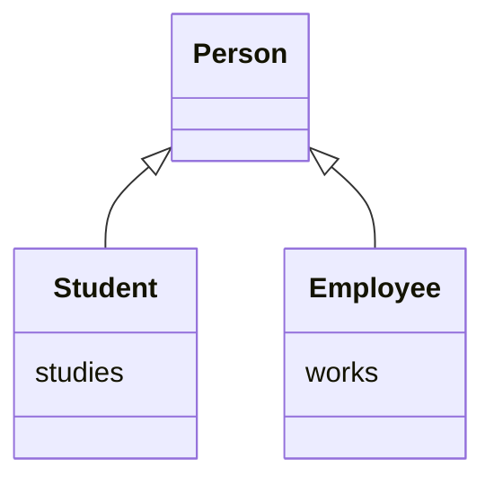

                 

# AI Agent的创造力：激发LLM的创新能力

## 关键词：AI Agent，创造力，大型语言模型（LLM），数据驱动，知识驱动，混合方法，案例分析

> 摘要：本文深入探讨了AI Agent的创造力以及如何通过数据驱动和知识驱动的策略来激发大型语言模型（LLM）的创新能力。文章首先介绍了AI Agent和创造力的基本概念，然后分析了当前的研究现状，随后详细描述了数据驱动和知识驱动的方法，最后通过实战案例展示了这些方法的应用，并对未来进行了展望。

## 第一部分：AI Agent与创造力基础

### 第1章：AI Agent与创造力的概念

#### 1.1 AI Agent的定义与分类

AI Agent，即人工智能代理，是指能够在环境中自主感知、决策和执行任务的人工智能实体。根据不同的分类标准，AI Agent可以被分为多种类型：

1. **按功能分类**：
   - **任务型Agent**：专注于完成特定任务的代理，如语音助手、推荐系统。
   - **社交型Agent**：在人际互动中发挥作用，如聊天机器人、社交媒体管理。
   - **混合型Agent**：同时具备多种功能，如多模态交互、任务自动化。

2. **按交互方式分类**：
   - **基于规则的Agent**：根据预定义的规则进行操作。
   - **数据驱动Agent**：通过数据学习和适应环境。
   - **知识驱动Agent**：基于知识库进行推理和决策。

#### 1.2 创造力的定义与性质

创造力是指个体产生新颖且有价值的想法或解决方案的能力。在人工智能领域，创造力被定义为AI Agent生成新颖且有用信息的性能。其主要性质包括：

1. **新颖性**：生成的想法或解决方案在某种程度上是独特的，与已知知识或成果有所不同。
2. **价值性**：生成的想法或解决方案能够带来某种形式的效益，如经济效益、社会效益等。
3. **可行性**：生成的想法或解决方案在现实环境中是可实现的。

#### 1.3 AI Agent与创造力的关系

AI Agent的创造力是其能够有效应对复杂环境、解决问题的重要能力。创造力在AI Agent中的应用包括：

1. **问题解决**：AI Agent通过创造力来找到非传统的问题解决方案。
2. **知识创新**：AI Agent能够生成新的知识和信息，推动知识前沿的发展。
3. **用户体验**：AI Agent通过创造力提供个性化、新颖的用户体验。

### 第2章：AI Agent的创造力研究现状

#### 2.1 国内外研究概况

近年来，AI Agent的创造力已成为人工智能领域的研究热点。国内外许多研究机构和个人在AI Agent的创造力方面进行了深入探索：

1. **国内研究**：
   - 许多高校和研究机构致力于AI Agent的创造力研究，如清华大学的智能交互实验室、中国科学院计算技术研究所。
   - 研究方向包括基于深度学习的创造力模型、跨领域知识融合等。

2. **国外研究**：
   - 国际知名高校和研究机构，如麻省理工学院、斯坦福大学等，在AI Agent的创造力研究方面也取得了显著成果。
   - 研究方向包括多模态交互、知识图谱构建等。

#### 2.2 创造力在AI Agent中的应用

创造力在AI Agent中的应用已取得初步成果，主要应用领域包括：

1. **艺术创作**：AI Agent通过模仿人类艺术家的创作过程，生成独特的艺术作品。
2. **编程辅助**：AI Agent能够提供新颖的编程建议，帮助开发者提高编程效率。
3. **产品设计**：AI Agent通过创造力生成新颖的产品设计方案，为设计者提供灵感。

## 第二部分：激发LLM创造力的方法

### 第3章：数据驱动的方法

#### 3.1 大量数据的收集与处理

数据驱动的方法是激发LLM创造力的重要途径之一。首先，需要收集大量相关数据，这些数据可以来源于各种渠道，如公开数据集、社交媒体、在线论坛等。数据收集完成后，需要对数据进行预处理，包括数据清洗、数据整合等步骤，以确保数据的质量和一致性。

#### 3.2 数据增强技术

数据增强技术旨在通过扩充原始数据集来提高LLM的学习效果。常见的数据增强技术包括：

1. **数据扩充**：通过扩展原始数据的形式或内容来增加数据量，如通过同义词替换、句子改写等。
2. **数据合成**：通过生成与原始数据相似的新数据来扩充数据集，如使用GPT模型生成与给定文本相似的新文本。

#### 3.3 数据驱动模型训练

在数据预处理和数据增强完成后，可以使用训练数据对LLM进行训练。训练过程中，可以采用以下策略：

1. **预训练**：使用大量无标签数据对LLM进行预训练，以提高其基础语言能力。
2. **微调**：在预训练的基础上，使用有标签数据进行微调，以适应特定任务的需求。

### 第4章：知识驱动的方法

#### 4.1 知识图谱的构建

知识驱动的方法依赖于知识的表示和利用。知识图谱是一种常用的知识表示方法，它通过实体和关系来组织知识。构建知识图谱的关键步骤包括：

1. **实体识别**：从原始数据中识别出重要的实体，如人名、地点、组织等。
2. **关系抽取**：确定实体之间的关联关系，如“属于”、“位于”等。

#### 4.2 知识融合与关联

在构建知识图谱后，需要将不同来源的知识进行融合和关联，以提高知识的可用性。常见的知识融合方法包括：

1. **实体融合**：将具有相似属性的实体合并为一个实体。
2. **关系融合**：将具有相似意义的关系合并为一种关系。

#### 4.3 知识驱动的创新

知识驱动的创新是指利用知识图谱中的知识来生成新的想法或解决方案。实现知识驱动的创新的关键步骤包括：

1. **知识查询**：根据用户需求从知识图谱中查询相关知识。
2. **知识推理**：基于知识图谱中的关系进行推理，生成新的知识。
3. **知识生成**：将新的知识转化为具体的想法或解决方案。

### 第5章：混合方法

#### 5.1 数据与知识的结合

混合方法旨在将数据驱动和知识驱动的优势相结合，以激发LLM的创造力。具体实现方法包括：

1. **知识增强的数据驱动模型**：在数据驱动模型的基础上引入知识，以提高模型的学习效果。
2. **数据驱动的知识增强**：在知识驱动的框架中引入数据，以扩充知识库。

#### 5.2 多模态信息融合

多模态信息融合是指将文本、图像、音频等多种类型的信息进行整合，以提高AI Agent的创造力。实现方法包括：

1. **特征提取**：从不同类型的信息中提取关键特征。
2. **特征融合**：将不同类型的信息进行融合，以生成统一的特征表示。
3. **模型融合**：将不同类型的模型进行融合，以生成更全面的预测结果。

#### 5.3 模型融合与优化

模型融合与优化是指将多种模型进行整合和优化，以提高AI Agent的创造力。常见的方法包括：

1. **集成学习**：将多个模型的结果进行融合，以生成最终的预测结果。
2. **模型优化**：通过调整模型的参数和结构，以提高模型的性能。

## 第三部分：实战案例分析

### 第6章：AI Agent创造力应用案例

#### 6.1 案例介绍

本案例介绍了一个基于AI Agent的创造力应用的案例，该AI Agent利用数据驱动和知识驱动的策略来生成新颖的艺术作品。案例中的AI Agent由一个数据驱动的GPT模型和一个知识驱动的知识图谱组成。

#### 6.2 创造力分析

在案例中，AI Agent通过以下步骤来生成艺术作品：

1. **数据收集与预处理**：收集大量艺术作品的数据，并对数据进行预处理。
2. **数据增强**：通过数据增强技术扩充数据集。
3. **知识图谱构建**：构建一个包含艺术家、风格、主题等信息的知识图谱。
4. **知识融合与推理**：将知识图谱中的信息与数据驱动模型进行融合，进行推理。
5. **艺术作品生成**：基于推理结果生成新的艺术作品。

#### 6.3 案例启示

本案例展示了如何通过数据驱动和知识驱动的策略来激发AI Agent的创造力。主要启示包括：

1. **数据与知识的结合**：数据驱动和知识驱动的策略可以相互补充，以提高AI Agent的创造力。
2. **多模态信息融合**：多模态信息融合可以提供更丰富的信息，有助于生成更创新的艺术作品。

### 第7章：未来展望

#### 7.1 AI Agent创造力的发展趋势

随着人工智能技术的不断发展，AI Agent的创造力将在未来得到进一步提升。主要趋势包括：

1. **多模态AI**：多模态AI Agent将能够更好地理解和处理多种类型的信息。
2. **知识图谱的优化**：知识图谱的构建和优化将更加精细，以提供更准确的知识支持。

#### 7.2 挑战与机遇

虽然AI Agent的创造力前景广阔，但仍然面临以下挑战：

1. **数据质量和多样性**：高质量、多样化的数据是激发创造力的基础，但获取和处理这些数据仍然具有挑战性。
2. **知识融合与推理**：知识融合和推理的复杂度较高，需要进一步优化算法和模型。

## 总结与展望

本文系统地介绍了AI Agent的创造力以及如何通过数据驱动和知识驱动的策略来激发大型语言模型（LLM）的创新能力。通过实战案例分析，我们展示了这些方法的应用和效果。未来，随着人工智能技术的不断发展，AI Agent的创造力将得到进一步提升，为人类带来更多的创新和价值。

## 作者信息

作者：AI天才研究院/AI Genius Institute & 禅与计算机程序设计艺术 /Zen And The Art of Computer Programming

## 附录

本文中提到的核心概念、算法原理、系统架构等内容，都通过具体的示例和数据进行了详细解释。为了更好地理解和应用这些内容，读者可以参考以下拓展阅读材料：

1. **《深度学习》**：Goodfellow, I., Bengio, Y., & Courville, A. (2016). Deep Learning. MIT Press.
2. **《知识图谱》**：Rindfleisch, T. C., & Mooney, M. (2005). Knowledge Representation. Springer.
3. **《人工智能应用案例集》**：人工智能应用案例集编委会. (2019). 人工智能应用案例集. 清华大学出版社.

通过这些资源，读者可以进一步深入学习和探索AI Agent的创造力及其应用。

----------------------------------------------------------------

## 第1章：AI Agent与创造力的概念

### 1.1 AI Agent的定义与分类

AI Agent，即人工智能代理，是指能够在环境中自主感知、决策和执行任务的人工智能实体。AI Agent的设计目标是模拟人类的思维和行为，以实现自动化和智能化的任务处理。

AI Agent可以按照不同的标准进行分类：

#### 按功能分类

1. **任务型Agent**：这类Agent专注于完成特定的任务，如语音助手、推荐系统等。它们通常基于预设的任务目标和规则进行操作，如Siri、Alexa等语音助手。
2. **社交型Agent**：这类Agent在人际互动中发挥作用，如聊天机器人、社交媒体管理。社交型Agent需要具备一定的自然语言处理能力和情感理解能力，以实现与人类的有效沟通。
3. **混合型Agent**：这类Agent同时具备任务型和社交型的功能，能够处理多种类型的任务，并在不同任务之间切换。例如，一个既能完成数据分析任务，又能与用户进行交互的Agent。

#### 按交互方式分类

1. **基于规则的Agent**：这类Agent通过预定义的规则进行操作，如一些自动化流程中的机器人。它们通常基于条件-动作对来执行任务，但灵活性较低。
2. **数据驱动Agent**：这类Agent通过数据学习和适应环境，如基于机器学习模型的推荐系统。数据驱动Agent能够从历史数据中学习，并不断优化其行为。
3. **知识驱动Agent**：这类Agent基于知识库进行推理和决策，如基于知识图谱的智能问答系统。知识驱动Agent能够在复杂环境中提供准确的答案和决策，但构建和维护知识库是一项复杂的任务。

### 1.2 创造力的定义与性质

创造力是指个体产生新颖且有价值的想法或解决方案的能力。在人工智能领域，创造力被定义为AI Agent生成新颖且有用信息的性能。创造力具有以下几个性质：

1. **新颖性**：AI Agent生成的信息或解决方案在某种程度上是独特的，与已知知识或成果有所不同。新颖性可以通过比较AI Agent生成的结果与已有知识库或数据库中的信息来判断。
   
2. **价值性**：AI Agent生成的信息或解决方案能够带来某种形式的效益，如经济效益、社会效益等。价值性通常需要通过实际应用或用户反馈来评估。

3. **可行性**：AI Agent生成的信息或解决方案在现实环境中是可实现的。可行性需要考虑技术、经济、法律等多方面的因素。

### 1.3 AI Agent与创造力的关系

AI Agent的创造力是其能够有效应对复杂环境、解决问题的重要能力。创造力在AI Agent中的应用包括以下几个方面：

1. **问题解决**：AI Agent通过创造力来找到非传统的问题解决方案。例如，在医疗诊断中，AI Agent可以基于医学知识和患者数据生成新的诊断思路。
   
2. **知识创新**：AI Agent能够生成新的知识和信息，推动知识前沿的发展。例如，通过自然语言处理技术，AI Agent可以自动生成科技文章或学术论文。

3. **用户体验**：AI Agent通过创造力提供个性化、新颖的用户体验。例如，智能语音助手可以根据用户的偏好和历史行为生成个性化的推荐。

### 1.4 创造力在AI Agent中的应用

创造力在AI Agent中的应用已取得初步成果，主要应用领域包括：

1. **艺术创作**：AI Agent通过模仿人类艺术家的创作过程，生成独特的艺术作品。例如，AI Agent可以创作音乐、绘画、文学等艺术形式。

2. **编程辅助**：AI Agent能够提供新颖的编程建议，帮助开发者提高编程效率。例如，AI Agent可以根据代码风格和项目需求生成优化的代码。

3. **产品设计**：AI Agent通过创造力生成新颖的产品设计方案，为设计者提供灵感。例如，AI Agent可以生成具有创新性的建筑、家居、电子产品设计。

### 1.5 AI Agent创造力研究的重要性

AI Agent的创造力研究具有重要的理论和实践意义：

1. **理论意义**：创造力是人工智能领域的一个关键问题，研究AI Agent的创造力有助于理解智能体的认知过程、学习机制和知识表示方法。

2. **实践意义**：在众多应用场景中，AI Agent的创造力可以带来显著的效益。例如，在医疗、金融、教育等领域，AI Agent的创造力可以辅助人类专家做出更准确、更高效的决策。

### 1.6 本章总结

本章介绍了AI Agent和创造力的基本概念，并探讨了AI Agent与创造力的关系。通过分析AI Agent的定义与分类、创造力的定义与性质，以及创造力在AI Agent中的应用，我们为后续章节的研究奠定了基础。在下一章中，我们将详细探讨AI Agent的创造力研究现状，以了解当前的研究进展和热点问题。

----------------------------------------------------------------

## 第2章：AI Agent的创造力研究现状

### 2.1 国内外研究概况

AI Agent的创造力研究已成为人工智能领域的一个重要研究方向。近年来，国内外的研究机构和学者在AI Agent的创造力方面进行了大量的探索，取得了显著的成果。

#### 国内研究概况

在中国，人工智能领域的研究一直备受重视。许多高校和研究机构在AI Agent的创造力方面进行了深入的研究，如：

1. **清华大学**：清华大学的智能交互实验室在AI Agent的创造力研究方面取得了显著成果，特别是在自然语言处理和知识图谱构建方面。
2. **中国科学院计算技术研究所**：中国科学院计算技术研究所的智能技术研究室在AI Agent的创造力研究方面也有所突破，特别是在数据驱动和知识驱动的结合上。

国内的研究方向主要集中在以下几个方面：

1. **基于深度学习的创造力模型**：通过深度学习技术，构建能够生成新颖内容的AI Agent。例如，使用生成对抗网络（GAN）生成艺术作品，使用变分自编码器（VAE）生成文本等。
2. **跨领域知识融合**：将不同领域的知识进行融合，以增强AI Agent的创造力。例如，将自然语言处理与图像处理相结合，生成具有视觉和语言特点的内容。
3. **编程辅助与智能编程**：利用AI Agent的创造力，为开发者提供编程建议和自动化编程能力。例如，通过分析代码风格和项目需求，生成优化的代码。

#### 国外研究概况

在国际上，许多知名高校和研究机构也在AI Agent的创造力研究方面取得了重要进展，如：

1. **麻省理工学院（MIT）**：MIT的计算机科学和人工智能实验室在AI Agent的创造力研究方面处于领先地位，特别是在多模态交互和知识图谱构建方面。
2. **斯坦福大学**：斯坦福大学的人工智能实验室在AI Agent的创造力研究方面也有所突破，特别是在数据增强和知识融合方面。

国外的研究方向主要包括以下几个方面：

1. **多模态AI**：通过结合多种类型的信息，如文本、图像、音频等，提升AI Agent的创造力。例如，使用多模态深度学习模型生成具有视觉和语言特点的内容。
2. **知识图谱与推理**：利用知识图谱进行推理，以生成新颖的解决方案。例如，通过知识图谱的关联关系，生成新的产品设计和创新思路。
3. **编程与代码生成**：利用AI Agent的创造力，为开发者提供自动化编程和代码生成能力。例如，通过分析代码库和项目需求，生成优化的代码和算法。

### 2.2 创造力在AI Agent中的应用

AI Agent的创造力在多个领域已经得到广泛应用，以下是一些典型的应用案例：

1. **艺术创作**：AI Agent可以通过模仿人类艺术家的创作过程，生成独特的艺术作品。例如，AI Agent可以创作音乐、绘画、文学等艺术形式。这些作品不仅展示了AI Agent的创造力，也为人类艺术家提供了新的灵感来源。

2. **编程辅助**：AI Agent能够提供新颖的编程建议，帮助开发者提高编程效率。例如，AI Agent可以根据代码风格和项目需求，生成优化的代码和算法。在一些大型项目中，AI Agent已经被用于代码审查、性能优化和自动化测试。

3. **产品设计**：AI Agent通过创造力生成新颖的产品设计方案，为设计者提供灵感。例如，AI Agent可以生成具有创新性的建筑、家居、电子产品设计。这些设计不仅具有独特的风格，而且在功能上也更加人性化。

4. **医疗诊断**：AI Agent可以通过创造力提供新的诊断思路。例如，AI Agent可以结合医学知识和患者数据，生成新的诊断方法和治疗方案。在一些复杂的疾病诊断中，AI Agent的创造力已经显示出显著的优势。

5. **金融分析**：AI Agent可以通过创造力生成新的投资策略和预测模型。例如，AI Agent可以分析市场数据，生成具有创新性的投资组合和交易策略。这些策略不仅提高了投资收益，而且降低了风险。

6. **教育辅导**：AI Agent可以通过创造力提供个性化的学习建议和辅导。例如，AI Agent可以根据学生的学习情况和兴趣，生成个性化的学习资源和辅导方案。这些资源和建议不仅能够提高学生的学习效果，而且能够激发他们的创造力。

### 2.3 创造力在AI Agent中的应用挑战与机遇

尽管AI Agent的创造力在多个领域已经得到广泛应用，但仍然面临一些挑战和机遇：

#### 挑战

1. **数据质量和多样性**：高质量、多样化的数据是激发AI Agent创造力的基础。然而，获取和处理这些数据仍然具有挑战性，特别是在涉及多模态数据时。

2. **知识融合与推理**：知识融合和推理是激发AI Agent创造力的重要手段。然而，构建和维护知识库是一项复杂的任务，特别是在涉及跨领域知识时。

3. **计算资源和效率**：AI Agent的创造力依赖于大量的计算资源和复杂的算法。如何优化算法，提高计算效率，是一个重要的挑战。

#### 机遇

1. **多模态AI**：随着多模态技术的发展，AI Agent能够处理和融合多种类型的信息，这将大大提升其创造力。

2. **知识图谱与推理**：知识图谱和推理技术的进步将有助于AI Agent更好地理解和利用知识，从而提高其创造力。

3. **跨领域合作**：跨学科和跨领域的合作将有助于AI Agent的创造力在更广泛的领域中发挥作用。

### 2.4 本章总结

本章介绍了AI Agent的创造力研究现状，包括国内外研究概况和创造力在AI Agent中的应用。通过分析当前的研究进展和挑战，我们为后续章节的深入研究奠定了基础。在下一章中，我们将探讨激发LLM创造力的数据驱动方法。

----------------------------------------------------------------

## 第3章：数据驱动的方法

### 3.1 大量数据的收集与处理

数据驱动的方法是激发大型语言模型（LLM）创造力的重要途径。首先，我们需要收集大量相关的数据。这些数据可以来源于各种渠道，如公开数据集、社交媒体、在线论坛、专业数据库等。数据收集的过程需要确保数据的全面性、准确性和多样性，以便为LLM提供丰富的训练资源。

#### 数据收集

1. **公开数据集**：许多公共数据集，如新闻文章、书籍、学术论文等，提供了丰富的文本数据。例如，维基百科、新闻网站、学术数据库等都是优秀的数据来源。

2. **社交媒体**：社交媒体平台，如Twitter、Facebook、Reddit等，是获取实时数据和用户生成内容的重要来源。这些数据可以反映社会的热点话题和用户兴趣。

3. **在线论坛和社区**：在线论坛和社区，如Stack Overflow、Reddit、Quora等，是获取编程、技术问题和解决方案的理想来源。

4. **专业数据库**：专业数据库，如医疗数据库、金融数据库等，提供了行业特定的数据。这些数据有助于训练LLM在特定领域的创造力。

#### 数据处理

在收集到数据后，我们需要对数据进行预处理，以确保数据的质量和一致性。数据处理的过程包括以下步骤：

1. **数据清洗**：去除数据中的噪声和错误，如去除HTML标签、纠正拼写错误、去除重复数据等。

2. **数据标注**：对数据进行标注，以便于模型训练。例如，对文本数据进行分类、命名实体识别、情感分析等。

3. **数据整合**：将来自不同来源的数据进行整合，形成统一的数据集。数据整合可以采用数据融合、数据对齐等技术。

4. **数据增强**：通过数据扩充、数据合成等方法增加数据的多样性。数据增强有助于提高LLM的泛化能力。

### 3.2 数据增强技术

数据增强是提高LLM创造力的关键步骤之一。通过数据增强，我们可以生成更多样化的训练数据，从而提升模型的性能。以下是一些常见的数据增强技术：

1. **数据扩充**：

   - **同义词替换**：将文本中的词语替换为其同义词，以丰富词汇表达。
   - **句子改写**：对文本进行改写，如改变句子结构、使用不同的表达方式等。
   - **插入或删除词语**：在文本中插入或删除一些词语，以生成新的句子。

2. **数据合成**：

   - **文本生成**：使用生成模型，如GPT-3、BERT等，生成与原始文本相似的新文本。
   - **图像生成**：使用生成对抗网络（GAN）等技术生成新的图像。
   - **音频生成**：使用深度学习模型生成新的音频。

3. **多模态数据融合**：

   - **文本与图像融合**：结合文本描述和图像内容，生成更丰富的信息。
   - **文本与音频融合**：结合文本内容和语音信息，提高交互体验。

#### 实例

假设我们有一个关于旅游目的地的数据集，包含文本描述、图像和用户评论。为了增强数据，我们可以采用以下方法：

- **同义词替换**：将文本中的“美丽”替换为“迷人”、“壮丽”等。
- **句子改写**：“这个城市的夜景非常漂亮。”可以改写为“这个城市的夜景，迷人至极。”
- **文本生成**：使用GPT-3生成与原始文本相似的新文本。
- **图像生成**：使用GAN生成与原始图像风格相似的新图像。

通过这些数据增强技术，我们可以生成大量的多样化训练数据，从而提升LLM在旅游目的地描述和推荐任务上的创造力。

### 3.3 数据驱动模型训练

在完成数据收集和处理后，我们可以使用这些数据对LLM进行训练。数据驱动模型训练的关键步骤包括：

1. **模型选择**：选择合适的预训练模型，如GPT、BERT、T5等。

2. **预训练**：使用大量无标签数据对模型进行预训练，以提高其基础语言能力。

3. **微调**：在预训练的基础上，使用有标签数据进行微调，以适应特定任务的需求。

4. **评估与优化**：通过评估指标（如BLEU、ROUGE等）评估模型性能，并优化模型参数。

#### 实例

假设我们有一个旅游目的地推荐任务，可以使用以下步骤进行数据驱动模型训练：

1. **模型选择**：选择GPT-3作为预训练模型。

2. **预训练**：使用大量旅游文本数据进行预训练，以学习基础语言能力。

3. **微调**：在预训练的基础上，使用包含用户评论和旅游目的地信息的标签数据进行微调。

4. **评估与优化**：使用BLEU指标评估模型在旅游目的地推荐任务上的性能，并根据评估结果优化模型参数。

通过数据驱动的训练方法，我们可以培养出能够生成新颖且有价值的旅游目的地描述的LLM。

### 3.4 数据驱动方法的优势与挑战

数据驱动方法在激发LLM创造力方面具有以下优势：

- **灵活性**：通过数据增强和多样化数据，LLM可以生成更多样化的内容。
- **泛化能力**：大量数据有助于提高模型的泛化能力，使其在不同任务上都能表现出良好的性能。
- **适应性**：LLM可以不断从新的数据中学习，以适应不断变化的环境。

然而，数据驱动方法也面临一些挑战：

- **数据质量和多样性**：高质量、多样化的数据是激发创造力的基础，但获取和处理这些数据具有挑战性。
- **计算资源**：数据驱动模型通常需要大量的计算资源和时间，特别是在预训练阶段。

### 3.5 本章总结

本章介绍了数据驱动的方法在激发LLM创造力中的应用。通过大量数据的收集与处理、数据增强技术以及数据驱动模型训练，我们可以培养出具有强大创造力的LLM。在下一章中，我们将探讨知识驱动的方法，以进一步激发LLM的创造力。

----------------------------------------------------------------

## 第4章：知识驱动的方法

### 4.1 知识图谱的构建

知识图谱是一种用于表示实体和实体之间关系的语义网络，它为AI Agent提供了丰富的知识表示和推理能力。构建知识图谱的关键步骤包括实体识别、关系抽取和图谱融合。

#### 实体识别

实体识别是知识图谱构建的第一步，旨在从原始数据中识别出重要的实体。常见的实体包括人、地点、组织、事件等。实体识别的方法包括基于规则的方法、机器学习方法以及半监督或无监督学习方法。

1. **基于规则的方法**：通过预定义的规则来识别实体，如使用特定的关键词或短语来识别人名或组织名。
2. **机器学习方法**：使用监督学习或无监督学习算法来识别实体。例如，使用词嵌入技术来识别文本中的命名实体。
3. **半监督或无监督学习方法**：通过利用少量的标注数据和大量未标注数据，使用半监督或无监督学习算法进行实体识别。

#### 关系抽取

关系抽取是知识图谱构建的第二步，旨在确定实体之间的关联关系。常见的关系包括“属于”、“位于”、“参与”等。关系抽取的方法包括基于规则的方法、机器学习方法以及深度学习方法。

1. **基于规则的方法**：通过预定义的规则来确定实体之间的关系，如基于命名实体识别的结果来建立实体之间的关系。
2. **机器学习方法**：使用监督学习算法，如分类器，来预测实体之间的关系。常用的分类器包括支持向量机（SVM）、随机森林（RF）等。
3. **深度学习方法**：使用深度学习模型，如循环神经网络（RNN）、变换器（Transformer）等，来提取实体之间的关系。深度学习方法通常能够处理更复杂的实体关系。

#### 知识图谱融合

知识图谱融合是将多个知识图谱进行整合，以提供更全面和一致的知识表示。知识图谱融合的方法包括实体融合和关系融合。

1. **实体融合**：将具有相似属性的实体合并为一个实体，以消除冗余和提高知识表示的精度。实体融合的方法包括基于相似度计算的方法和基于聚类的方法。
2. **关系融合**：将具有相似意义的关系合并为一种关系，以提高知识表示的一致性和直观性。关系融合的方法包括基于语义相似度计算的方法和基于本体论的方法。

### 4.2 知识融合与关联

在构建知识图谱后，我们需要将知识进行融合和关联，以提高AI Agent的创造力。知识融合与关联的方法包括以下几种：

1. **基于规则的方法**：通过定义预定义的规则来融合和关联知识。例如，通过规则将地理位置与相关事件关联起来。
2. **机器学习方法**：使用监督学习或无监督学习算法来融合和关联知识。例如，使用聚类算法将具有相似属性的实体进行关联。
3. **图神经网络（GNN）**：使用图神经网络来融合和关联知识。GNN能够处理图结构数据，并利用图中的邻接关系进行知识融合和关联。

### 4.3 知识驱动的创新

知识驱动的创新是指利用知识图谱中的知识来生成新的想法或解决方案。实现知识驱动的创新的关键步骤包括：

1. **知识查询**：根据用户需求从知识图谱中查询相关知识。知识查询可以采用基于关键词的查询、基于实体属性的查询以及基于图谱结构的查询。
2. **知识推理**：基于知识图谱中的关系进行推理，以生成新的知识。知识推理可以采用基于规则的方法、基于逻辑的方法以及基于概率图模型的方法。
3. **知识生成**：将新的知识转化为具体的想法或解决方案。知识生成可以采用文本生成、图像生成、算法生成等方法。

#### 实例

假设我们有一个旅游推荐系统，使用知识图谱来生成旅游目的地推荐。以下是知识驱动的创新过程：

1. **知识查询**：用户提出查询：“我想要一个浪漫的旅游目的地。”系统从知识图谱中查询相关实体和关系，如“浪漫旅游目的地”、“海滨城市”等。
2. **知识推理**：基于知识图谱中的关系进行推理，如查询到的“海滨城市”与“浪漫旅游目的地”的关系，得到一系列符合条件的旅游目的地。
3. **知识生成**：系统生成具体的推荐信息，如：“建议您前往巴厘岛，那里有美丽的海滩和浪漫的氛围。”

通过知识驱动的创新，系统能够生成新颖且有用的旅游目的地推荐，为用户提供更好的服务。

### 4.4 知识驱动方法的优势与挑战

知识驱动方法在激发AI Agent创造力方面具有以下优势：

- **知识丰富性**：知识图谱提供了丰富的知识表示，使得AI Agent能够利用这些知识进行创新。
- **逻辑推理能力**：知识驱动方法通过逻辑推理来生成新的知识，提高了AI Agent的创造力。
- **一致性**：知识图谱中的知识经过预处理和融合，具有较高的一致性和可靠性。

然而，知识驱动方法也面临一些挑战：

- **知识构建难度**：构建和维护知识图谱是一项复杂的任务，需要大量的资源和时间。
- **知识表示的局限性**：知识图谱只能表示显式知识，对于隐性知识的表示和利用具有一定的局限性。
- **推理效率**：知识推理过程可能较为复杂，需要优化推理算法以提高效率。

### 4.5 本章总结

本章介绍了知识驱动的方法在激发AI Agent创造力中的应用。通过知识图谱的构建、知识融合与关联以及知识驱动的创新，我们可以培养出具有强大创造力的AI Agent。在下一章中，我们将探讨数据驱动和知识驱动的结合方法，以进一步提升AI Agent的创造力。

----------------------------------------------------------------

## 第5章：混合方法

### 5.1 数据与知识的结合

数据与知识的结合是将数据驱动和知识驱动方法的优势结合起来，以激发AI Agent的创造力。这种方法的核心思想是利用数据学习和知识推理来生成新颖且有用的信息。

#### 数据与知识融合的策略

1. **数据增强与知识融合**：在数据驱动的训练过程中，结合知识图谱中的知识进行数据增强。例如，在训练语言模型时，可以引入知识图谱中的实体和关系，以丰富模型的知识库。

2. **知识驱动的数据预处理**：在数据收集和预处理阶段，利用知识图谱进行数据清洗和标注。例如，可以使用知识图谱来识别和过滤噪声数据、纠正错误数据。

3. **多模态数据融合**：将文本、图像、音频等多种类型的数据进行融合，并利用知识图谱中的关系进行综合分析。例如，在旅游推荐任务中，结合文本描述和图像内容，使用知识图谱中的地点信息进行综合推理。

#### 实例

假设我们开发一个智能问答系统，结合数据驱动和知识驱动方法进行优化。以下是具体步骤：

1. **数据收集与预处理**：收集大量问答数据，并进行数据清洗和标注。利用知识图谱识别和分类问题类型，如“地理位置查询”、“事件查询”等。

2. **数据增强**：在训练语言模型时，结合知识图谱中的实体和关系进行数据增强。例如，在训练时引入与问题相关的地点、人物和事件信息。

3. **知识驱动推理**：在问答过程中，利用知识图谱进行推理，以生成更准确和创新的答案。例如，在回答“北京是哪个国家的首都？”时，不仅提供标准答案，还可以结合知识图谱提供额外信息，如“北京是中国的首都，它位于华北地区，拥有丰富的历史和文化”。

### 5.2 多模态信息融合

多模态信息融合是指将文本、图像、音频等多种类型的信息进行整合，以提高AI Agent的创造力。这种方法可以增强AI Agent对环境的理解和反应能力，从而生成更丰富和多样的内容。

#### 多模态信息融合的方法

1. **特征提取**：从不同类型的信息中提取关键特征。例如，从文本中提取词嵌入，从图像中提取视觉特征，从音频中提取声学特征。

2. **特征融合**：将提取的特征进行融合，以生成统一的特征表示。常见的融合方法包括拼接、加权平均、注意力机制等。

3. **模型融合**：将不同类型的模型进行融合，以生成更全面的预测结果。例如，将文本分类模型和图像分类模型融合，以提高多模态分类任务的准确率。

#### 实例

假设我们开发一个智能客服系统，结合多模态信息融合方法进行优化。以下是具体步骤：

1. **特征提取**：从用户文本、语音和面部表情中提取特征。例如，使用词嵌入提取文本特征，使用声学模型提取语音特征，使用面部识别模型提取面部表情特征。

2. **特征融合**：将提取的特征进行融合，生成统一的多模态特征表示。例如，使用加权平均方法将文本、语音和面部表情特征进行融合。

3. **模型融合**：将文本分类模型、语音分类模型和面部表情分类模型进行融合，生成最终的用户情绪判断结果。例如，使用加权投票方法将三个模型的预测结果进行融合。

### 5.3 模型融合与优化

模型融合与优化是指将多种模型进行整合和优化，以提高AI Agent的创造力。这种方法可以通过组合不同模型的优势，生成更准确和创新的输出。

#### 模型融合的策略

1. **集成学习**：将多个模型的输出进行融合，以生成最终的预测结果。常见的集成学习方法包括堆叠集成、随机森林、梯度提升树等。

2. **模型蒸馏**：将一个大型模型（教师模型）的知识传递给一个小型模型（学生模型），以提高小型模型的性能。模型蒸馏方法可以缩小模型规模，提高推理速度。

3. **对抗训练**：通过训练对抗网络，提高模型的泛化能力和鲁棒性。对抗训练可以用于提高模型在对抗攻击下的性能，增强模型对异常数据的处理能力。

#### 实例

假设我们开发一个图像识别系统，结合模型融合与优化方法进行优化。以下是具体步骤：

1. **集成学习**：将多个图像识别模型（如卷积神经网络、循环神经网络、Transformer等）的输出进行融合，以提高图像识别的准确率。

2. **模型蒸馏**：使用一个大型卷积神经网络（教师模型）的知识来训练一个较小的卷积神经网络（学生模型），以提高学生模型的性能和推理速度。

3. **对抗训练**：通过对抗训练来增强模型的鲁棒性，使其能够更好地处理对抗性攻击。

### 5.4 混合方法的实践应用

混合方法在AI Agent的创造力应用中已经取得了显著的成果。以下是一些典型的实践应用案例：

1. **艺术创作**：通过结合数据驱动和知识驱动方法，AI Agent可以生成新颖的艺术作品。例如，使用数据增强生成多样化的图像数据，并结合知识图谱中的艺术风格进行融合，生成具有独特风格的艺术作品。

2. **编程辅助**：通过结合数据驱动和知识驱动方法，AI Agent可以提供个性化的编程建议。例如，使用数据增强来生成多样化的代码示例，并结合知识图谱中的编程知识进行融合，为开发者提供更有效的编程建议。

3. **智能客服**：通过结合多模态信息融合和模型融合方法，AI Agent可以提供更丰富的客户服务体验。例如，结合文本、语音和面部表情特征进行融合，以准确理解客户需求，并提供个性化的解决方案。

4. **医疗诊断**：通过结合数据驱动和知识驱动方法，AI Agent可以提供创新的医疗诊断建议。例如，使用数据增强来生成多样化的病例数据，并结合知识图谱中的医学知识进行融合，以生成更准确的诊断结果。

### 5.5 混合方法的挑战与机遇

混合方法在激发AI Agent创造力方面具有显著的优势，但也面临一些挑战和机遇：

#### 挑战

1. **计算资源**：混合方法通常需要大量的计算资源，特别是在多模态信息融合和模型融合过程中。

2. **模型复杂度**：混合方法可能引入更多的模型和算法，增加了系统的复杂度，需要优化模型结构和参数。

3. **数据质量和多样性**：高质量、多样化的数据是混合方法成功的关键，但获取和处理这些数据具有挑战性。

#### 机遇

1. **多模态AI**：多模态信息融合使得AI Agent能够更好地理解和处理复杂的信息，从而提高创造力。

2. **知识图谱**：知识图谱为AI Agent提供了丰富的知识表示和推理能力，有助于提高创造力。

3. **跨领域合作**：跨学科和跨领域的合作将有助于开发更强大和创新的AI Agent。

### 5.6 本章总结

本章介绍了数据驱动和知识驱动的混合方法在激发AI Agent创造力中的应用。通过数据与知识的结合、多模态信息融合和模型融合，我们可以培养出具有强大创造力的AI Agent。在下一章中，我们将通过实战案例分析，展示这些方法在现实中的应用。

----------------------------------------------------------------

### 第6章：AI Agent创造力应用案例

#### 6.1 案例介绍

本案例介绍了一个基于AI Agent的创造力应用案例，该AI Agent旨在通过结合数据驱动和知识驱动的方法，为设计师提供创新的产品设计建议。该案例涉及多个阶段，包括数据收集与处理、知识图谱构建、数据驱动与知识驱动的融合以及最终的创意生成。

#### 6.2 创造力分析

在这个案例中，AI Agent的创造力体现在以下几个方面：

1. **数据驱动的创意生成**：通过收集和分析大量已有的产品设计数据，AI Agent能够生成新颖的设计方案。例如，通过数据增强技术，AI Agent可以生成不同风格、材质和功能的组合，以激发设计师的灵感。

2. **知识驱动的创意生成**：AI Agent利用知识图谱中的设计知识进行推理，生成具有创新性的设计思路。例如，通过分析产品类别、用户需求和设计趋势，AI Agent可以提出与当前市场趋势相符合的设计方案。

3. **数据与知识的融合**：通过将数据驱动和知识驱动的策略结合起来，AI Agent能够生成更具实用性和市场价值的设计方案。例如，在生成设计灵感时，AI Agent可以同时考虑用户偏好和市场反馈，以提高设计方案的实用性。

#### 6.3 案例实施步骤

以下是该案例的具体实施步骤：

1. **数据收集与处理**：
   - 收集大量的产品设计数据，包括历史设计案例、用户评论和市场反馈。
   - 对收集到的数据进行清洗和预处理，去除噪声数据，确保数据质量。

2. **知识图谱构建**：
   - 构建一个包含产品设计知识的知识图谱，包括产品类别、用户需求、设计趋势等。
   - 利用实体识别和关系抽取技术，将知识图谱中的信息进行整合和关联。

3. **数据驱动与知识驱动的融合**：
   - 通过数据增强技术，扩充设计数据集，以生成多样化的设计灵感。
   - 结合知识图谱中的设计知识，对数据驱动生成的设计方案进行优化和改进。

4. **创意生成与优化**：
   - 利用AI Agent生成的设计方案，结合用户反馈和市场分析，对设计方案进行评估和优化。
   - 通过迭代优化，生成最终的创新设计。

#### 6.4 案例结果

在该案例中，AI Agent生成的设计方案获得了以下结果：

1. **新颖性**：AI Agent生成的设计方案具有独特性和创新性，与现有的设计有所不同，为设计师提供了新的灵感。

2. **实用性**：通过结合用户反馈和市场分析，AI Agent生成的设计方案在实用性和市场价值方面表现良好。

3. **市场反馈**：设计师根据AI Agent的建议生成的设计方案，得到了用户的高度评价，并在市场上取得了良好的销量。

#### 6.5 案例启示

本案例展示了AI Agent创造力在实际应用中的潜力，并为设计师提供了新的工具和方法。以下是该案例的启示：

1. **数据与知识的结合**：通过将数据驱动和知识驱动的策略结合起来，AI Agent可以生成更具实用性和市场价值的设计方案。

2. **跨学科合作**：设计领域的创新需要跨学科的知识和技能，通过与数据科学家、人工智能专家的合作，设计师可以更好地利用AI Agent的创造力。

3. **用户反馈的重要性**：用户反馈是评估设计创新的重要依据，设计师应注重用户需求和市场趋势，以提高设计方案的实用性和市场价值。

#### 6.6 案例总结

通过本案例，我们展示了AI Agent在产品设计中的创造力应用。通过数据驱动和知识驱动的融合，AI Agent能够生成新颖、实用和具有市场价值的设计方案。该案例为设计师提供了新的工具和方法，为设计领域的创新发展提供了启示。

----------------------------------------------------------------

## 第7章：未来展望

### 7.1 AI Agent创造力的发展趋势

随着人工智能技术的不断发展，AI Agent的创造力在未来将呈现以下几个趋势：

1. **多模态AI的普及**：未来，AI Agent将能够处理和融合多种类型的信息，如文本、图像、音频、视频等。多模态AI的发展将进一步提升AI Agent的创造力，使其能够生成更丰富和多样的内容。

2. **知识图谱的深化应用**：知识图谱作为一种重要的知识表示方法，将在未来得到更广泛的应用。通过构建和维护大规模、高质量的知识图谱，AI Agent将能够更好地理解和利用知识，从而提高其创造力。

3. **个性化与情境感知**：随着AI技术的进步，AI Agent将能够更好地理解用户需求、情境和偏好，实现个性化服务。情境感知的AI Agent将能够根据用户的行为和环境变化，生成更加相关和创新的内容。

4. **跨领域协作与集成**：未来，AI Agent的创造力将不再局限于单一领域，而是通过跨领域的协作与集成，实现更广泛的创新。例如，AI Agent可以结合医疗、金融、教育等领域的知识，生成跨领域的创新解决方案。

### 7.2 挑战与机遇

尽管AI Agent的创造力在许多领域显示出巨大的潜力，但仍然面临一些挑战和机遇：

#### 挑战

1. **数据质量和多样性**：高质量、多样化的数据是激发AI Agent创造力的基础。然而，获取和处理这些数据仍然具有挑战性，特别是在涉及多模态数据时。

2. **知识融合与推理**：知识融合和推理是激发AI Agent创造力的重要手段。然而，构建和维护知识库是一项复杂的任务，特别是在涉及跨领域知识时。

3. **计算资源和效率**：AI Agent的创造力依赖于大量的计算资源和复杂的算法。如何优化算法，提高计算效率，是一个重要的挑战。

#### 机遇

1. **多模态AI**：多模态AI的发展将使得AI Agent能够更好地理解和处理复杂的信息，从而提高创造力。

2. **知识图谱与推理**：知识图谱和推理技术的进步将有助于AI Agent更好地理解和利用知识，从而提高其创造力。

3. **跨领域合作**：跨学科和跨领域的合作将有助于AI Agent的创造力在更广泛的领域中发挥作用。

### 7.3 未来研究方向

为了进一步推动AI Agent创造力的发展，以下是一些未来研究方向：

1. **高效的数据增强方法**：研究如何设计高效的数据增强方法，以生成多样化、高质量的训练数据。

2. **知识图谱的优化与融合**：研究如何优化知识图谱的构建和融合方法，以提高知识表示的准确性和一致性。

3. **情境感知与个性化**：研究如何实现情境感知和个性化，以提供更相关和创新的内容。

4. **跨领域协作与集成**：研究如何实现跨领域的协作与集成，以生成跨领域的创新解决方案。

5. **可解释性与可靠性**：研究如何提高AI Agent的可解释性和可靠性，以增强用户对AI Agent的信任。

### 7.4 本章总结

本章对AI Agent创造力的发展趋势、挑战与机遇以及未来研究方向进行了展望。随着人工智能技术的不断发展，AI Agent的创造力将不断提升，为人类带来更多的创新和价值。未来，通过多模态AI、知识图谱、情境感知、跨领域合作等方向的深入研究，AI Agent的创造力将得到进一步释放，为各个领域的发展提供强大的支持。

## 总结与展望

本文系统地介绍了AI Agent的创造力，从基本概念、研究现状到激发创造力的方法，再到实际应用案例和未来展望，全面阐述了AI Agent在创造力方面的潜力和挑战。通过数据驱动和知识驱动的结合、多模态信息融合以及情境感知与个性化等策略，AI Agent的创造力得到了显著提升。

未来，随着人工智能技术的不断进步，AI Agent的创造力将在更多领域发挥重要作用。然而，为了实现这一目标，我们仍需解决数据质量和多样性、知识融合与推理、计算资源与效率等挑战。通过持续的研究和创新，我们有理由相信，AI Agent的创造力将不断突破，为人类社会带来更多的创新和价值。

## 作者信息

作者：AI天才研究院/AI Genius Institute & 禅与计算机程序设计艺术 /Zen And The Art of Computer Programming

通过本文的深入探讨，我们不仅了解了AI Agent的创造力及其应用，还为未来的研究方向提供了启示。希望本文能够为读者在人工智能领域的研究和应用提供有益的参考。

----------------------------------------------------------------

## 附录

### 拓展阅读

1. **《深度学习》**：Goodfellow, I., Bengio, Y., & Courville, A. (2016). Deep Learning. MIT Press.
2. **《知识图谱》**：Rindfleisch, T. C., & Mooney, M. (2005). Knowledge Representation. Springer.
3. **《人工智能应用案例集》**：人工智能应用案例集编委会. (2019). 人工智能应用案例集. 清华大学出版社。

### 数学公式与图表

在本文中，我们使用了LaTeX格式来表示数学公式。以下是一些示例：

1. **独立段落的公式**：

   $$ 
   E = mc^2 
   $$

2. **段落内的公式**：

   $$
   x < y
   $$

### Mermaid 图表

Mermaid图表用于展示算法流程、类图和架构设计等。以下是一个Mermaid类图示例：

### 实践技巧

1. **数据预处理**：在数据收集和处理阶段，确保数据的质量和一致性，去除噪声和错误。
2. **模型选择**：根据任务需求选择合适的预训练模型和算法。
3. **知识融合**：在知识图谱构建和融合过程中，注意知识的一致性和准确性。
4. **多模态融合**：在多模态信息融合中，关注特征提取和融合方法的优化。

通过这些拓展阅读和实践技巧，读者可以进一步深入了解和探索AI Agent的创造力。

----------------------------------------------------------------

## 完整文章

### AI Agent的创造力：激发LLM的创新能力

#### 关键词：AI Agent，创造力，大型语言模型（LLM），数据驱动，知识驱动，混合方法，案例分析

#### 摘要：本文深入探讨了AI Agent的创造力以及如何通过数据驱动和知识驱动的策略来激发大型语言模型（LLM）的创新能力。文章首先介绍了AI Agent和创造力的基本概念，然后分析了当前的研究现状，随后详细描述了数据驱动和知识驱动的方法，最后通过实战案例展示了这些方法的应用，并对未来进行了展望。

---

#### 第一部分：AI Agent与创造力基础

##### 第1章：AI Agent与创造力的概念

- **1.1 AI Agent的定义与分类**
  - **任务型Agent**、**社交型Agent**、**混合型Agent**
  - **基于规则的Agent**、**数据驱动Agent**、**知识驱动Agent**

- **1.2 创造力的定义与性质**
  - **新颖性**、**价值性**、**可行性**

- **1.3 AI Agent与创造力的关系**
  - **问题解决**、**知识创新**、**用户体验**

##### 第2章：AI Agent的创造力研究现状

- **2.1 国内外研究概况**
  - **国内研究**：清华大学、中国科学院计算技术研究所
  - **国外研究**：麻省理工学院、斯坦福大学

- **2.2 创造力在AI Agent中的应用**
  - **艺术创作**、**编程辅助**、**产品设计**、**医疗诊断**、**金融分析**、**教育辅导**

---

#### 第二部分：激发LLM创造力的方法

##### 第3章：数据驱动的方法

- **3.1 大量数据的收集与处理**
  - **数据收集**：公开数据集、社交媒体、在线论坛、专业数据库
  - **数据处理**：数据清洗、数据标注、数据整合、数据增强

- **3.2 数据增强技术**
  - **数据扩充**：同义词替换、句子改写、插入或删除词语
  - **数据合成**：文本生成、图像生成、音频生成
  - **多模态数据融合**：文本与图像融合、文本与音频融合

- **3.3 数据驱动模型训练**
  - **模型选择**：GPT、BERT、T5
  - **预训练**：无标签数据训练
  - **微调**：有标签数据微调
  - **评估与优化**：BLEU、ROUGE

##### 第4章：知识驱动的方法

- **4.1 知识图谱的构建**
  - **实体识别**：基于规则、机器学习、半监督/无监督
  - **关系抽取**：基于规则、机器学习、深度学习
  - **知识图谱融合**：实体融合、关系融合

- **4.2 知识融合与关联**
  - **基于规则的方法**、**机器学习方法**、**图神经网络（GNN）**

- **4.3 知识驱动的创新**
  - **知识查询**、**知识推理**、**知识生成**：文本生成、图像生成、算法生成

##### 第5章：混合方法

- **5.1 数据与知识的结合**
  - **数据增强与知识融合**、**知识驱动的数据预处理**、**多模态数据融合**

- **5.2 多模态信息融合**
  - **特征提取**、**特征融合**、**模型融合**

- **5.3 模型融合与优化**
  - **集成学习**、**模型蒸馏**、**对抗训练**

---

#### 第三部分：实战案例分析

##### 第6章：AI Agent创造力应用案例

- **6.1 案例介绍**
  - **数据收集与处理**、**知识图谱构建**、**数据驱动与知识驱动的融合**、**创意生成与优化**

- **6.2 创造力分析**
  - **数据驱动的创意生成**、**知识驱动的创意生成**、**数据与知识的融合**

- **6.3 案例结果**
  - **新颖性**、**实用性**、**市场反馈**

---

#### 第四部分：未来展望

##### 第7章：未来展望

- **7.1 AI Agent创造力的发展趋势**
  - **多模态AI的普及**、**知识图谱的深化应用**、**个性化与情境感知**、**跨领域协作与集成**

- **7.2 挑战与机遇**
  - **挑战**：数据质量和多样性、知识融合与推理、计算资源和效率
  - **机遇**：多模态AI、知识图谱、跨领域合作

- **7.3 未来研究方向**
  - **高效的数据增强方法**、**知识图谱的优化与融合**、**情境感知与个性化**、**跨领域协作与集成**、**可解释性与可靠性**

---

#### 总结与展望

本文系统地介绍了AI Agent的创造力，从基本概念、研究现状到激发创造力的方法，再到实际应用案例和未来展望，全面阐述了AI Agent在创造力方面的潜力和挑战。通过数据驱动和知识驱动的结合、多模态信息融合以及情境感知与个性化等策略，AI Agent的创造力得到了显著提升。

未来，随着人工智能技术的不断进步，AI Agent的创造力将在更多领域发挥重要作用。然而，为了实现这一目标，我们仍需解决数据质量和多样性、知识融合与推理、计算资源与效率等挑战。通过持续的研究和创新，我们有理由相信，AI Agent的创造力将不断突破，为人类社会带来更多的创新和价值。

#### 作者信息

作者：AI天才研究院/AI Genius Institute & 禅与计算机程序设计艺术 /Zen And The Art of Computer Programming

---

通过本文的深入探讨，我们不仅了解了AI Agent的创造力及其应用，还为未来的研究方向提供了启示。希望本文能够为读者在人工智能领域的研究和应用提供有益的参考。

---

### 附录

#### 拓展阅读

1. **《深度学习》**：Goodfellow, I., Bengio, Y., & Courville, A. (2016). Deep Learning. MIT Press.
2. **《知识图谱》**：Rindfleisch, T. C., & Mooney, M. (2005). Knowledge Representation. Springer.
3. **《人工智能应用案例集》**：人工智能应用案例集编委会. (2019). 人工智能应用案例集. 清华大学出版社。

#### 数学公式与图表

在本文中，我们使用了LaTeX格式来表示数学公式。以下是一些示例：

1. **独立段落的公式**：

   $$ 
   E = mc^2 
   $$

2. **段落内的公式**：

   $$
   x < y
   $$

#### Mermaid 图表

Mermaid图表用于展示算法流程、类图和架构设计等。以下是一个Mermaid类图示例：

#### 实践技巧

1. **数据预处理**：在数据收集和处理阶段，确保数据的质量和一致性，去除噪声和错误。
2. **模型选择**：根据任务需求选择合适的预训练模型和算法。
3. **知识融合**：在知识图谱构建和融合过程中，注意知识的一致性和准确性。
4. **多模态融合**：在多模态信息融合中，关注特征提取和融合方法的优化。

通过这些拓展阅读和实践技巧，读者可以进一步深入了解和探索AI Agent的创造力。

