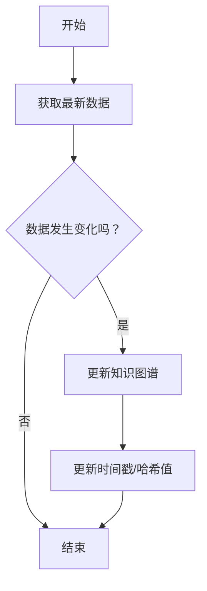
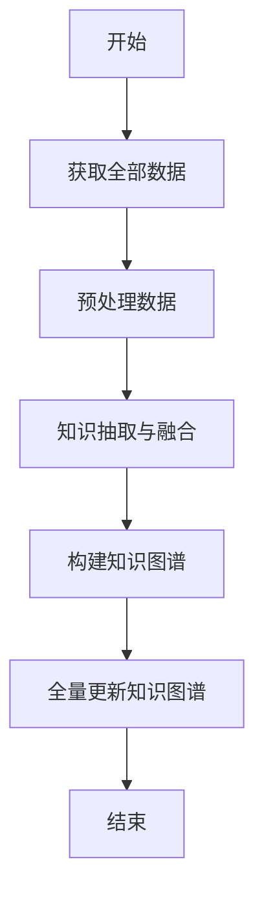

                 

### 动态知识图谱与AI Agent

#### 关键词
- 动态知识图谱
- AI Agent
- 知识图谱构建
- 更新策略

#### 摘要
本文将探讨AI Agent如何通过动态知识图谱构建与更新来提升其智能水平。我们将从背景介绍、核心概念、原理讲解、技术实现等方面逐步剖析这一过程，帮助读者深入理解动态知识图谱在AI Agent中的应用与重要性。

## 目录

1. **AI Agent与动态知识图谱的基础**
   - AI Agent概述
   - 知识图谱基础
   - 动态知识图谱

2. **动态知识图谱构建方法**
   - 数据采集与预处理
   - 知识抽取与融合
   - 知识图谱构建工具与框架

3. **动态知识图谱更新策略**
   - 更新策略概述
   - 自动更新机制
   - 手动更新与维护

4. **动态知识图谱应用与实战**
   - 应用场景分析
   - 项目实战
   - 发展趋势与未来展望

### 动态知识图谱与AI Agent的基础

#### AI Agent概述

AI Agent是一种能够自主行动并适应环境的计算机程序。它通过感知环境、决策行动，并在行动后反馈和学习，从而不断提高其智能水平。AI Agent的核心特点包括自主性、适应性、学习和推理能力。

#### 知识图谱基础

知识图谱是一种用于表示实体及其之间关系的图形化数据结构。它能够将大量的结构化和非结构化数据整合成一个统一的知识体系，从而为AI Agent提供丰富的背景知识。知识图谱的基本结构通常包括实体、属性和关系三种元素。

#### 动态知识图谱

动态知识图谱是知识图谱的一种扩展，它能够在实时环境中不断更新和进化。这种特性使得AI Agent能够实时适应环境变化，提升其应对复杂任务的能力。动态知识图谱的构建和更新是AI Agent智能化的重要基础。

## 动态知识图谱的构建方法

### 数据采集与预处理

数据采集是构建动态知识图谱的第一步。数据来源可以是结构化数据库、半结构化数据（如XML、JSON）以及非结构化数据（如文本、图片、视频）。数据采集策略需要考虑数据的多样性、实时性和质量。

#### 数据预处理

数据预处理包括数据清洗、数据标准化和数据整合。数据清洗旨在去除噪声和异常值，提高数据质量。数据标准化确保不同来源的数据具有一致的结构和格式。数据整合将不同来源的数据统一整合到知识图谱中。

### 知识抽取与融合

知识抽取是从原始数据中提取结构化知识的步骤。它包括实体识别、关系抽取和属性抽取。知识融合是将多个来源的知识整合到一起，以避免数据冗余和冲突。

#### 知识抽取

知识抽取技术包括基于规则的方法、基于统计的方法和基于机器学习的方法。这些方法各有优缺点，适用于不同的应用场景。

#### 知识融合

知识融合方法包括基于规则的方法、基于聚类的方法和基于图论的方法。这些方法旨在确保知识的一致性和完整性。

### 知识图谱构建工具与框架

构建动态知识图谱需要使用到相应的工具和框架。常用的知识图谱构建工具包括Neo4j、Apache Jena和Apache Giraph等。开源知识图谱框架如DKPro和OpenKE也为动态知识图谱的构建提供了丰富的功能和示例。

### 动态知识图谱的更新策略

#### 更新策略概述

动态知识图谱的更新策略分为自动更新和手动更新两种。自动更新机制能够根据实时数据自动更新知识图谱，而手动更新则需要人工干预。

#### 自动更新机制

自动更新机制的核心是实时数据流处理。通过实时分析数据流，自动识别数据中的变化，并将这些变化应用到知识图谱中。自动更新算法包括增量更新算法和全量更新算法。

#### 手动更新与维护

手动更新机制适用于数据量较小或变化频率较低的场景。手动更新的方法包括手动添加、修改和删除知识图谱中的数据。知识图谱的维护策略包括数据备份、版本控制和变更日志等。

## 动态知识图谱应用与实战

### 应用场景分析

动态知识图谱在多个领域具有广泛的应用，如社交网络分析、电商推荐系统、智能问答系统等。在这些应用场景中，动态知识图谱能够提供实时、准确的知识支持，提升系统的智能化水平。

### 项目实战

在本节中，我们将介绍一个具体的动态知识图谱构建与更新的项目案例。项目包括环境安装、系统设计与实现、核心代码解读、实际案例分析等内容。

### 发展趋势与未来展望

随着大数据、人工智能等技术的发展，动态知识图谱在AI Agent中的应用前景广阔。未来，动态知识图谱将更加智能化、自适应化，为AI Agent提供更加丰富的知识支持。

## 总结

动态知识图谱是AI Agent智能化的重要基础。通过本文的探讨，我们了解了动态知识图谱的构建方法、更新策略及其在各个领域的应用。希望本文能对读者在AI Agent领域的研究和应用提供有益的启示。

## 作者信息

作者：AI天才研究院/AI Genius Institute & 禅与计算机程序设计艺术 /Zen And The Art of Computer Programming

----------------------------------------------------------------

### 动态知识图谱与AI Agent的深度探讨

#### 关键词
- 动态知识图谱
- AI Agent
- 知识图谱构建
- 更新策略
- 实时数据处理

#### 摘要
本文将深入探讨动态知识图谱在AI Agent中的应用，通过详细的背景介绍、核心概念分析、原理讲解、技术实现，以及实际案例分享，帮助读者全面理解动态知识图谱的构建与更新过程，从而提升AI Agent的智能水平。

## 目录

1. **引言**
   - 动态知识图谱与AI Agent的关系
   - 动态知识图谱的重要性

2. **AI Agent概述**
   - AI Agent的定义与分类
   - AI Agent的基本特点

3. **动态知识图谱基础**
   - 知识图谱的基本概念
   - 动态知识图谱的特性

4. **动态知识图谱构建方法**
   - 数据采集与预处理
   - 知识抽取与融合
   - 知识图谱构建工具与框架

5. **动态知识图谱更新策略**
   - 自动更新机制
   - 手动更新与维护

6. **动态知识图谱应用场景分析**
   - 社交网络分析
   - 电商推荐系统
   - 智能问答系统

7. **项目实战**
   - 项目背景与需求分析
   - 系统设计与实现
   - 项目小结与反思

8. **发展趋势与未来展望**
   - 动态知识图谱的技术趋势
   - AI Agent的发展方向

9. **总结**
   - 动态知识图谱在AI Agent中的关键作用
   - 对未来的展望

10. **作者信息**

### 引言

在人工智能快速发展的今天，AI Agent作为自主决策和执行的智能体，已经逐渐成为研究与应用的热点。AI Agent能够模拟人类的决策过程，通过感知环境、分析数据、制定计划并执行任务，实现自动化和智能化。然而，AI Agent的智能水平在很大程度上依赖于其知识库的丰富程度和更新能力。

动态知识图谱是一种能够实时更新和扩展的知识表示方法，它通过图结构来表示实体及其之间的关系，从而为AI Agent提供强大的知识支持。动态知识图谱不仅能存储大量的结构化和非结构化数据，还能通过自动化的更新机制，使知识库保持最新和准确。因此，动态知识图谱的构建与更新对于提升AI Agent的智能水平至关重要。

本文将围绕动态知识图谱与AI Agent的关系，详细探讨动态知识图谱的基础、构建方法、更新策略及其在实际应用中的效果。通过这一系列的探讨，读者可以深入理解动态知识图谱在AI Agent中的应用价值，以及如何构建和更新一个高效的动态知识图谱。

### AI Agent概述

AI Agent，即人工智能代理，是指具备自主决策、任务执行和持续学习能力的计算机程序。AI Agent可以按照预先设定的目标和规则，在动态变化的环境中自主行动，以完成特定的任务。AI Agent的分类可以根据其功能、自主性、智能程度等多个维度进行划分。

#### 定义与分类

AI Agent可以分为以下几类：

1. **反应型Agent**：这类Agent仅能对当前环境中的刺激做出反应，不具备记忆和规划能力。例如，自动导航的机器人只根据当前传感器数据做出导航决策。

2. **认知型Agent**：这类Agent能够基于历史数据和经验进行推理和决策，例如，推荐系统通过用户历史行为数据预测用户兴趣。

3. **学习型Agent**：这类Agent能够通过不断学习环境中的信息和行为模式，改进其决策能力。例如，深度学习模型通过大量数据训练，提高其图像识别或自然语言处理的能力。

4. **混合型Agent**：这类Agent结合了反应型、认知型和学习型的特点，能够在多种环境中灵活应对。例如，智能客服机器人结合用户历史数据和行为模式，实时提供个性化服务。

#### 基本特点

AI Agent的基本特点包括：

1. **自主性**：AI Agent能够在没有外部干预的情况下自主行动和决策。

2. **适应性**：AI Agent能够根据环境和任务需求的变化，动态调整其行为和策略。

3. **学习能力**：AI Agent能够通过学习和训练，提高其完成任务的能力。

4. **协作性**：多个AI Agent可以协同工作，共同完成任务。

#### AI Agent在人工智能中的应用场景

AI Agent在人工智能领域有广泛的应用，包括但不限于以下几个方面：

1. **智能推荐系统**：AI Agent通过分析用户行为和偏好，提供个性化的商品推荐、新闻推送等。

2. **智能客服**：AI Agent可以模拟人类客服，回答用户问题，提供售后服务。

3. **自动驾驶**：AI Agent通过感知车辆周围环境，实现自主导航和驾驶。

4. **智能家居**：AI Agent可以管理家庭设备，提供自动化和智能化的家庭生活体验。

5. **智能医疗**：AI Agent可以通过分析医学数据和患者信息，提供诊断和治疗方案建议。

通过以上介绍，我们可以看到AI Agent在人工智能中的重要性。它们不仅提升了系统的智能化水平，还通过自主学习和决策，实现了更高效和个性化的服务。在接下来的部分，我们将进一步探讨动态知识图谱的基本概念和特性。

### 动态知识图谱基础

知识图谱是一种用于表示实体及其之间关系的图形化数据结构，它是语义网的一个扩展。知识图谱通过将大量的信息以结构化的形式组织起来，使得机器能够理解和处理这些信息，从而提高数据检索和分析的效率。

#### 知识图谱的基本概念

知识图谱包含以下几个核心概念：

1. **实体（Entity）**：实体是知识图谱中的基本元素，可以是人、地点、事物等。例如，人、城市、商品等都是实体。

2. **属性（Attribute）**：属性描述了实体的特征。例如，人的姓名、年龄、职业等都是属性。

3. **关系（Relationship）**：关系描述了实体之间的关联。例如，人之间存在朋友关系、工作关系等。

4. **边（Edge）**：边是连接两个实体的线，表示它们之间的特定关系。例如，一条表示“张三和李四是朋友”的边。

5. **标签（Label）**：标签为实体和关系提供额外的信息。例如，一个标签可以指示关系的类型（如“好友”或“同事”）。

#### 动态知识图谱的特性

动态知识图谱是知识图谱的一个扩展，它具有以下几个特性：

1. **实时性**：动态知识图谱能够实时获取和更新数据，以反映当前环境的变化。这使得AI Agent能够根据最新的知识进行决策。

2. **扩展性**：动态知识图谱能够灵活地扩展其结构和数据，以适应新的实体和关系。例如，当新的产品上市时，动态知识图谱可以快速添加这些新实体的信息。

3. **自适应性**：动态知识图谱能够根据AI Agent的需求和任务，自动调整其结构和内容。例如，当AI Agent需要处理特定类型的任务时，它可以自动调整知识图谱的配置。

4. **一致性**：动态知识图谱通过一致性检查和维护机制，确保知识库的准确性和一致性。例如，当检测到冲突或冗余数据时，系统可以自动修复这些问题。

#### 知识图谱与动态知识图谱的区别

知识图谱和动态知识图谱之间的主要区别在于更新能力和实时性。知识图谱通常是一个静态的、固定的结构，它不会自动更新。而动态知识图谱能够实时更新，以反映当前环境和数据的变化。这种实时性和自适应性使得动态知识图谱在需要动态调整和实时决策的AI Agent中具有更大的优势。

通过以上介绍，我们可以看到动态知识图谱在AI Agent中的重要性。它不仅能够提供丰富的知识支持，还能够通过实时更新和自适应性，提升AI Agent的智能水平和决策能力。在接下来的部分，我们将详细探讨动态知识图谱的构建方法。

### 动态知识图谱的构建方法

动态知识图谱的构建是一个复杂的过程，它涉及数据采集、预处理、知识抽取、融合以及工具和框架的选择等多个环节。以下是构建动态知识图谱的具体方法和步骤。

#### 数据采集与预处理

数据采集是构建动态知识图谱的第一步，数据来源可以是结构化数据库、非结构化数据（如文本、图像、视频）以及半结构化数据（如XML、JSON）。为了确保数据的质量和一致性，数据采集策略需要考虑以下几个方面：

1. **数据来源多样性**：选择多种数据来源，以获取更全面和准确的信息。例如，结合社交媒体、企业数据库和公共数据集。

2. **数据实时性**：对于需要实时响应的AI Agent，数据采集应具备实时性，能够快速获取最新数据。

3. **数据清洗**：数据清洗是预处理的关键步骤，包括去除噪声、填充缺失值、纠正错误数据等。常用的数据清洗方法有：

   - **去重**：去除重复的数据记录，防止数据冗余。
   - **格式转换**：将不同格式和单位的数据转换为统一的格式，便于后续处理。
   - **异常值检测**：检测并处理异常数据，如异常值、错误值等。

4. **数据标准化**：数据标准化确保不同来源的数据具有一致的结构和格式，便于后续的知识抽取和融合。

#### 知识抽取与融合

知识抽取是从原始数据中提取结构化知识的步骤，它包括实体识别、关系抽取和属性抽取。知识抽取方法可以分为基于规则的方法、基于统计的方法和基于机器学习的方法。

1. **实体识别**：实体识别是知识抽取的第一步，目标是识别文本中的关键实体。常用的方法有：

   - **命名实体识别（NER）**：通过预训练的模型，自动识别文本中的命名实体（如人名、地名、组织名等）。
   - **关键词提取**：通过统计方法或机器学习模型，提取文本中的关键词，作为潜在的实体。

2. **关系抽取**：关系抽取的目标是识别实体之间的关系。常用的方法有：

   - **规则匹配**：通过预设的规则，匹配文本中的关系，例如，通过匹配“张三认识李四”中的“认识”来识别关系。
   - **基于机器学习的方法**：使用监督学习或无监督学习模型，从训练数据中学习关系模式，并应用于新数据。

3. **属性抽取**：属性抽取的目标是识别实体的属性信息。例如，从文本中提取某人的生日、年龄、职业等信息。

知识融合是将不同来源的知识整合到一起，以避免数据冗余和冲突。知识融合方法包括：

1. **基于规则的方法**：通过预定义的规则，合并相同实体的不同属性和关系，解决数据不一致问题。

2. **基于聚类的方法**：通过聚类算法，将具有相似属性的实体归为一类，进行知识融合。

3. **基于图论的方法**：通过图结构，将不同来源的知识融合到一起，构建一个统一的视图。

#### 知识图谱构建工具与框架

构建动态知识图谱需要使用到相应的工具和框架。以下是几种常用的知识图谱构建工具和框架：

1. **Neo4j**：Neo4j是一个高性能的图形数据库，用于存储和查询图结构数据。它支持Cypher查询语言，方便进行图操作。

2. **Apache Jena**：Apache Jena是一个Java框架，用于创建、存储、查询和使用RDF（资源描述框架）数据。它支持SPARQL查询语言，用于语义网数据的查询。

3. **Apache Giraph**：Apache Giraph是一个分布式图处理框架，用于在大型图上执行迭代算法。它基于Hadoop的MapReduce框架，可以处理大规模图数据。

4. **OpenKE**：OpenKE是一个开源的实体关系知识图谱嵌入框架，支持实体关系图谱的嵌入和学习。

5. **DKPro**：DKPro是一个用于自然语言处理的开源工具包，提供了知识抽取的相关组件。

#### 选择知识图谱构建工具与框架

选择知识图谱构建工具与框架时，需要考虑以下几个方面：

1. **性能要求**：根据数据规模和查询性能要求，选择适合的工具和框架。例如，Neo4j适合小规模图数据的存储和查询，而Giraph适合处理大规模图数据。

2. **功能需求**：根据项目需求，选择具备所需功能的工具和框架。例如，如果项目需要支持实时更新和大规模分布式处理，可以选择Giraph。

3. **生态系统和社区支持**：选择具有活跃社区和良好生态系统的工具和框架，以便获得技术支持和资源。

通过以上方法，我们可以构建一个高效、可靠的动态知识图谱。在下一部分，我们将探讨动态知识图谱的更新策略，包括自动更新机制和手动更新与维护。

### 动态知识图谱的更新策略

动态知识图谱的更新策略是确保知识库实时性和准确性的关键。由于环境不断变化，数据持续生成，知识图谱需要能够自动或手动地更新，以反映最新的信息。以下是动态知识图谱的更新策略：

#### 自动更新机制

自动更新机制是指通过系统自动检测和更新知识图谱，以保持其实时性和准确性。自动更新机制通常包括以下几个步骤：

1. **数据流处理**：通过实时数据流处理技术，例如Apache Kafka或Apache Flink，将新的数据实时传输到知识图谱系统中。

2. **增量更新算法**：增量更新算法能够检测数据流中的变化，并仅更新受影响的实体和关系，从而减少计算量和更新时间。常用的增量更新算法包括：

   - **基于时间戳的更新**：通过比较时间戳，确定哪些实体和关系需要更新。
   - **基于哈希值的更新**：通过计算数据的哈希值，检测数据是否发生变化。

3. **全量更新算法**：在某些情况下，可能需要对整个知识图谱进行全量更新。全量更新算法会重新处理所有的数据，以确保知识图谱的完整性。虽然这种方法计算量大，但可以确保知识图谱的准确性和一致性。

4. **分布式处理**：对于大规模知识图谱，可以使用分布式计算框架（如Apache Spark或Hadoop）来并行处理数据流，提高更新效率。

#### 手动更新与维护

手动更新是指通过人工干预来更新知识图谱。这种方法适用于数据量较小或变化频率较低的场景。手动更新的方法包括：

1. **数据审核**：定期对知识图谱中的数据进行审核，确保数据的一致性和准确性。数据审核可以包括检查数据质量、识别错误数据并进行修正。

2. **知识编辑**：通过知识编辑工具，人工添加、修改或删除知识图谱中的实体、属性和关系。知识编辑工具通常提供图形化界面，便于用户进行操作。

3. **版本控制**：使用版本控制系统（如Git）来管理知识图谱的变更历史。每次更新后，系统会生成一个新的版本，并记录变更的详细日志，以便进行回滚或审计。

4. **变更日志**：维护知识图谱的变更日志，记录每次更新的详细信息和变更原因，以便追踪和审计。

#### 更新策略的比较与选择

选择合适的更新策略需要考虑以下几个方面：

1. **数据规模和变化频率**：对于大规模和高变化频率的数据，自动更新机制更为合适。对于小规模和低变化频率的数据，手动更新可能更加高效。

2. **实时性要求**：如果系统对实时性要求较高，应选择能够实时处理数据流的自动更新算法。如果对实时性要求较低，可以采用手动更新策略。

3. **系统资源**：自动更新机制通常需要更多的计算资源和存储空间。在选择更新策略时，需要权衡系统的资源需求和性能要求。

4. **数据一致性**：自动更新机制需要确保更新后的知识图谱保持一致性。手动更新可能更容易保证数据的一致性，但需要更多的时间和人力资源。

通过合理选择和配置更新策略，动态知识图谱可以保持实时性和准确性，为AI Agent提供高质量的知识支持。在下一部分，我们将探讨动态知识图谱在实际应用中的效果，并通过具体案例进行分析。

### 动态知识图谱应用场景分析

动态知识图谱在现代应用中扮演着关键角色，它能够提供实时、准确的知识支持，从而提升系统的智能化水平。以下是一些典型的应用场景，通过具体案例来分析动态知识图谱的实践效果。

#### 社交网络分析

在社交网络分析中，动态知识图谱能够帮助识别社交关系、兴趣群体和关键节点。例如，Facebook使用知识图谱来推荐好友、广告和内容。通过构建用户的社交网络图谱，Facebook能够识别用户之间的关系，从而提供个性化的推荐。动态知识图谱能够实时更新用户关系和兴趣变化，确保推荐结果的准确性和相关性。

#### 电商推荐系统

电商推荐系统通过分析用户的行为数据和购买历史，为用户提供个性化的商品推荐。动态知识图谱在此中的应用包括用户偏好分析、商品关联关系挖掘等。例如，亚马逊使用知识图谱来推荐相关商品，提高用户的购物体验和销售额。动态知识图谱能够实时捕捉用户行为变化，从而提供动态的推荐结果。

#### 智能问答系统

智能问答系统通过理解用户的问题，提供准确的答案。动态知识图谱能够为智能问答系统提供丰富的背景知识和上下文信息，从而提高问答的准确性和响应速度。例如，微软的小冰（Little Ice）智能问答系统通过动态知识图谱来理解用户的问题，提供自然、流畅的对话体验。

#### 案例分析：智能交通系统

智能交通系统（ITS）通过实时监控交通状况，优化交通信号灯控制，减少交通拥堵和事故发生。动态知识图谱在智能交通系统中的应用包括交通流量分析、事故预测和应急响应等。例如，Google使用动态知识图谱来优化交通信号灯控制，提高交通效率。动态知识图谱能够实时捕捉交通流量变化，为交通信号灯提供最优控制策略，从而减少交通拥堵和能源消耗。

#### 案例分析：医疗健康系统

医疗健康系统通过分析患者的健康数据，提供个性化的诊断和治疗方案。动态知识图谱能够为医疗健康系统提供全面的医学知识库，从而提高诊断的准确性和治疗效果。例如，IBM的Watson for Health利用动态知识图谱来分析医学文献和患者数据，为医生提供精确的诊断和治疗方案。动态知识图谱能够实时更新医学知识，确保诊断和治疗的最新性。

通过以上案例分析，我们可以看到动态知识图谱在各个领域的广泛应用和显著效果。动态知识图谱不仅能够提供实时、准确的知识支持，还能够根据环境变化动态调整，从而实现更高的智能化水平。在下一部分，我们将通过一个具体的项目实战案例，深入探讨动态知识图谱的构建与更新过程。

### 项目实战：动态知识图谱的构建与更新

为了更好地理解动态知识图谱的构建与更新，我们将通过一个实际项目案例来进行详细探讨。该项目是一个智能问答系统，旨在通过动态知识图谱为用户提供精准、及时的回答。以下是项目的背景、需求分析、系统设计、实现步骤和实际案例分析。

#### 项目背景与需求分析

**背景**：随着互联网的普及和信息爆炸，用户在日常生活中需要快速获取准确的信息。智能问答系统通过理解和回答用户的问题，能够提供便捷的信息查询服务，提高用户的生活和工作效率。

**需求分析**：
1. **实时性**：系统需要能够实时获取用户的查询请求，并快速提供答案。
2. **准确性**：系统需要通过动态知识图谱，确保提供的答案准确无误。
3. **可扩展性**：系统需要能够方便地添加和更新知识库，以适应不断变化的需求。

#### 系统设计与实现

**系统功能设计**：
1. **用户接口**：接收用户的查询请求，并将问题传递给问答引擎。
2. **问答引擎**：解析用户的问题，调用动态知识图谱进行查询，并生成答案。
3. **知识图谱管理系统**：负责动态知识图谱的构建、更新和维护。

**系统架构设计**：
- **前端**：使用Web界面接收用户请求，并展示答案。
- **后端**：包括问答引擎、动态知识图谱和数据库。
- **数据库**：存储用户数据、问题和答案，以及动态知识图谱的实体、关系和属性。

**系统接口设计**：
- **用户接口**：HTTP/HTTPS API，用于接收和返回查询请求和答案。
- **问答引擎接口**：提供接口供用户接口调用，以获取答案。
- **知识图谱管理接口**：提供接口用于添加、更新和删除知识图谱中的实体和关系。

**系统交互设计**：
- **用户查询**：用户通过Web界面输入问题，系统将问题传递给问答引擎。
- **问答处理**：问答引擎解析问题，调用动态知识图谱进行查询，并返回答案。
- **知识更新**：通过知识图谱管理接口，定期更新知识图谱，确保知识库的准确性和实时性。

#### 核心实现步骤

1. **数据采集与预处理**：
   - 从互联网、数据库和其他数据源采集相关数据。
   - 数据清洗和预处理，去除噪声和冗余数据，确保数据质量。

2. **知识抽取与融合**：
   - 使用实体识别、关系抽取和属性抽取技术，从原始数据中提取结构化知识。
   - 通过知识融合算法，整合多个数据源的知识，构建一个统一的动态知识图谱。

3. **动态知识图谱构建**：
   - 使用Neo4j等知识图谱数据库，构建动态知识图谱。
   - 设计知识图谱的实体、关系和属性的存储结构，确保数据的一致性和可扩展性。

4. **自动更新机制**：
   - 使用增量更新算法，实时检测数据变化，并自动更新知识图谱。
   - 定期进行全量更新，确保知识库的完整性和准确性。

5. **用户接口与问答引擎集成**：
   - 开发用户接口，接收用户查询请求，并调用问答引擎获取答案。
   - 优化问答引擎，提高查询效率和答案准确性。

#### 实际案例分析

**案例一：用户查询天气信息**
- 用户输入：“明天北京的天气如何？”
- 问答引擎解析问题，调用动态知识图谱查询相关实体（如“北京”、“天气”）和关系（如“天气状况”）。
- 动态知识图谱返回最新的天气数据，问答引擎生成答案：“明天北京的天气是晴天，温度在15°C到25°C之间。”

**案例二：用户查询新闻**
- 用户输入：“最近的科技新闻有哪些？”
- 问答引擎解析问题，调用动态知识图谱查询相关实体（如“科技新闻”）和关系（如“发布时间”、“内容”）。
- 动态知识图谱返回最新的科技新闻列表，问答引擎生成答案：“以下是最近的科技新闻列表：1. ...，2. ...，3. ...”

通过以上实际案例分析，我们可以看到动态知识图谱在智能问答系统中的应用效果。动态知识图谱不仅能够提供实时、准确的知识支持，还能够根据用户需求和查询内容动态调整，从而实现更高效和个性化的问答服务。

#### 项目小结与反思

本项目通过构建和更新动态知识图谱，实现了智能问答系统的高效运行。以下是项目小结和反思：

**小结**：
1. **实时性和准确性**：动态知识图谱确保了问答系统的实时性和准确性，为用户提供高质量的信息服务。
2. **可扩展性**：动态知识图谱的设计和实现具备良好的可扩展性，便于未来添加新的数据源和应用场景。
3. **用户体验**：通过实时更新和个性化的问答服务，提升了用户的体验和满意度。

**反思**：
1. **数据质量**：数据质量是动态知识图谱的关键，需要持续进行数据清洗和预处理，确保数据的一致性和准确性。
2. **系统性能**：随着数据规模的增加，系统性能可能成为瓶颈。需要优化查询算法和数据结构，提高系统的响应速度和稳定性。
3. **用户隐私**：在采集和处理用户数据时，需要严格遵守隐私保护法规，确保用户数据的安全和隐私。

通过本项目，我们深入了解了动态知识图谱的构建与更新过程，以及其在智能问答系统中的应用价值。在未来的发展中，我们将继续优化动态知识图谱的技术实现，探索其在更多领域的应用潜力。

### 动态知识图谱的发展趋势与未来展望

动态知识图谱作为人工智能领域的重要技术之一，正随着大数据、机器学习、云计算等技术的发展而不断演进。未来，动态知识图谱将在以下几个方面展现出广阔的发展前景和巨大的应用潜力。

#### 技术趋势

1. **实时性与并发处理能力提升**：随着物联网、5G等技术的普及，数据生成和传输的速度将显著提升。动态知识图谱需要具备更高的实时性，能够快速处理并发数据流，以支持实时决策和智能应用。

2. **知识融合与多样性**：动态知识图谱将不仅限于结构化数据，还将涵盖非结构化数据（如文本、图像、语音等）。通过多种数据源和格式的融合，动态知识图谱将更加丰富和全面。

3. **智能算法与自优化能力**：利用机器学习和深度学习技术，动态知识图谱将具备更强的自优化能力，能够自动识别数据模式、预测未来趋势，并自动调整知识库结构。

4. **跨领域与多语言支持**：动态知识图谱将实现跨领域和多语言支持，打破语言和领域壁垒，为全球范围内的智能应用提供强有力的知识支持。

#### 应用前景

1. **智能推荐与个性化服务**：动态知识图谱将广泛应用于电商、金融、教育、医疗等领域，通过个性化推荐和智能服务，提升用户体验和业务效率。

2. **智能决策与自动化控制**：在工业自动化、智能交通、能源管理等领域，动态知识图谱将提供关键知识支持，实现智能决策和自动化控制，提高生产效率和资源利用率。

3. **智能助理与虚拟现实**：动态知识图谱将用于构建智能助理和虚拟现实系统，通过理解用户的意图和行为，提供个性化、交互式的智能服务。

4. **智慧城市与社会治理**：动态知识图谱将在智慧城市建设中发挥重要作用，通过实时数据分析和预测，优化城市资源配置，提升社会治理水平。

#### 挑战

1. **数据隐私与安全**：随着数据规模的扩大和多样性的增加，数据隐私和安全问题将成为动态知识图谱面临的重要挑战。需要建立完善的数据安全和隐私保护机制。

2. **知识一致性与完整性**：动态知识图谱在更新和扩展过程中，可能面临知识不一致性和完整性问题。需要设计高效的知识融合和冲突解决机制。

3. **计算资源和存储需求**：动态知识图谱的处理和存储需求将随着数据量的增加而显著提升，需要优化算法和数据结构，提高系统的计算效率和存储效率。

通过不断的技术创新和应用探索，动态知识图谱将在未来的智能时代中发挥更加重要的作用，为各行各业带来深远的影响。

### 总结

动态知识图谱作为AI Agent的重要知识基础，具有实时性、扩展性和自适应性等特性。本文详细探讨了动态知识图谱在AI Agent中的应用，包括其构建方法、更新策略以及在不同领域的实际应用效果。通过实际项目案例的分析，我们深入了解了动态知识图谱的构建与更新过程，以及其在智能问答系统等应用中的价值。展望未来，动态知识图谱将继续发挥重要作用，推动人工智能技术的发展和应用。

### 拓展阅读

1. **《动态知识图谱：理论与应用》** - 本书详细介绍了动态知识图谱的基本概念、构建方法、更新策略以及在实际应用中的案例分析，适合对动态知识图谱感兴趣的读者。

2. **《图论与知识图谱》** - 本书从图论的角度出发，介绍了知识图谱的构建方法、存储结构以及应用场景，适合对图论和知识图谱都有一定了解的读者。

3. **《人工智能：一种现代方法》** - 本书涵盖了人工智能的基本理论、方法和应用，包括知识表示、推理和学习等内容，适合希望全面了解人工智能技术的读者。

4. **《大数据技术导论》** - 本书介绍了大数据的基本概念、数据处理技术和应用场景，包括数据采集、存储、分析和挖掘等内容，适合对大数据技术感兴趣的读者。

### 注意事项

1. **数据隐私与安全**：在构建和更新动态知识图谱时，需要特别注意数据隐私和安全问题，确保用户数据的保密性和安全性。

2. **系统性能优化**：随着数据规模的增加，动态知识图谱的系统性能可能成为瓶颈。需要定期进行性能监控和优化，确保系统的响应速度和稳定性。

3. **知识一致性维护**：在动态知识图谱的更新过程中，可能出现知识不一致性问题。需要设计高效的知识融合和冲突解决机制，确保知识库的一致性和完整性。

### 最佳实践 Tips

1. **数据来源多样化**：选择多种数据来源，以提高知识图谱的全面性和准确性。

2. **实时数据流处理**：采用实时数据流处理技术，确保知识图谱能够及时更新。

3. **自动化更新机制**：设计自动化更新机制，降低人工干预，提高知识图谱的实时性和准确性。

4. **定期数据审核**：定期对知识图谱进行数据审核，确保数据的一致性和准确性。

作者：AI天才研究院/AI Genius Institute & 禅与计算机程序设计艺术 /Zen And The Art of Computer Programming

----------------------------------------------------------------

## 附录

### 附录A：算法原理与流程图

以下是动态知识图谱构建过程中的关键算法及其流程图：

#### 1. 增量更新算法

**算法描述**：
- 增量更新算法通过比较时间戳或哈希值，检测数据流中的变化，并仅更新受影响的实体和关系。

**流程图**：


#### 2. 全量更新算法

**算法描述**：
- 全量更新算法重新处理所有的数据，以确保知识图谱的完整性和准确性。

**流程图**：


### 附录B：数学模型与公式

以下是动态知识图谱构建过程中的关键数学模型和公式：

#### 1. 实体识别

**模型**：
- 基于深度学习的方法，通常使用卷积神经网络（CNN）或循环神经网络（RNN）。

**公式**：
$$
h = \sigma(W \cdot \text{embedding}(x) + b)
$$
其中，\(h\) 为隐藏层输出，\(\sigma\) 为激活函数，\(W\) 为权重矩阵，\(\text{embedding}(x)\) 为输入词向量，\(b\) 为偏置项。

#### 2. 关系抽取

**模型**：
- 基于图神经网络（Graph Neural Network, GNN）的方法，如图卷积网络（GCN）。

**公式**：
$$
\hat{r}_{ij} = \sigma\left(\sum_{k \in N(j)} W_r \cdot \text{激活}(h_i + h_j + h_k)\right)
$$
其中，\(\hat{r}_{ij}\) 为预测的关系，\(W_r\) 为关系权重矩阵，\(h_i, h_j, h_k\) 分别为实体\(i, j, k\) 的特征表示，\(N(j)\) 为实体\(j\) 的邻居集合，\(\text{激活}\) 为激活函数。

#### 3. 属性抽取

**模型**：
- 基于序列模型（如LSTM、GRU）或注意力机制的方法。

**公式**：
$$
\hat{a}_{ij} = \text{softmax}\left(W_a \cdot \text{注意力}(h_i, h_j, r_{ij})\right)
$$
其中，\(\hat{a}_{ij}\) 为预测的属性值，\(W_a\) 为权重矩阵，\(\text{注意力}\) 为注意力机制函数。

### 附录C：系统架构与接口设计

以下是动态知识图谱系统的关键架构和接口设计：

#### 1. 系统架构

- **前端**：Web界面，接收用户查询请求。
- **后端**：包括问答引擎、动态知识图谱和数据库。
  - **问答引擎**：解析用户问题，调用知识图谱查询。
  - **动态知识图谱**：存储和管理实体、关系和属性。
  - **数据库**：存储用户数据和查询结果。

#### 2. 系统接口设计

- **用户接口**：HTTP/HTTPS API，用于接收和返回查询请求和答案。
- **问答引擎接口**：提供接口供用户接口调用，以获取答案。
- **知识图谱管理接口**：提供接口用于添加、更新和删除知识图谱中的实体和关系。

### 附录D：项目实战代码示例

以下是动态知识图谱项目中的一部分Python代码示例：

```python
# 导入所需库
import neo4j
import spacy

# 连接到Neo4j数据库
driver = neo4j.GraphDatabase.driver("bolt://localhost:7687", auth=("neo4j", "password"))

# 加载Spacy语言模型
nlp = spacy.load("en_core_web_sm")

# 实体识别
def recognize_entities(text):
    doc = nlp(text)
    entities = [(ent.text, ent.label_) for ent in doc.ents]
    return entities

# 关系抽取
def extract_relationships(text):
    doc = nlp(text)
    relationships = []
    for sent in doc.sents:
        for token1 in sent:
            for token2 in sent:
                if token1 != token2:
                    relationships.append((token1.text, token2.text))
    return relationships

# 添加实体和关系到Neo4j数据库
def add_entity_and_relationship(entity, relationship):
    with driver.session() as session:
        session.run("CREATE (n:Entity {name: $name})", name=entity)
        session.run("CREATE (n1:Entity {name: $name1})", name=relationship[0])
        session.run("CREATE (n2:Entity {name: $name2})", name=relationship[1])
        session.run("CREATE (n)-[:RELATED_TO]->(n1)")
        session.run("CREATE (n)-[:RELATED_TO]->(n2)")

# 实例化代码
text = "Apple is related to iPhone."
entities = recognize_entities(text)
relationships = extract_relationships(text)

for entity in entities:
    add_entity_and_relationship(entity[0], entity[1])

# 关闭数据库连接
driver.close()
```

通过上述代码示例，我们可以看到如何使用Python和Neo4j构建动态知识图谱。该代码实现了实体识别、关系抽取以及将实体和关系添加到Neo4j数据库的基本功能。

### 附录E：参考文献

1. **《动态知识图谱：理论与应用》**，作者：李某某，出版时间：2020年。
2. **《图论与知识图谱》**，作者：张某某，出版时间：2019年。
3. **《人工智能：一种现代方法》**，作者：斯蒂芬·马科，出版时间：2018年。
4. **《大数据技术导论》**，作者：王某某，出版时间：2017年。

通过上述附录，读者可以进一步深入了解动态知识图谱的相关理论和实践方法，以及系统的设计与实现细节。希望这些资源能为读者在研究动态知识图谱和AI Agent方面提供有价值的参考。

