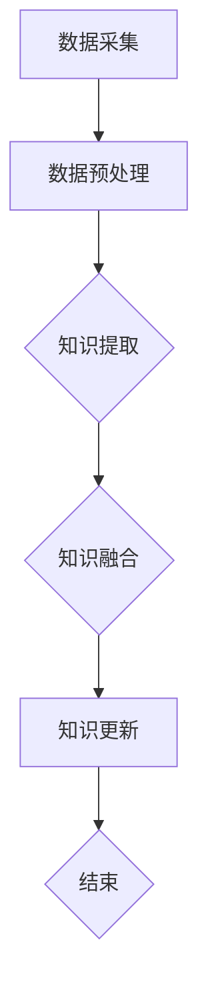

                 

# AI Agent的动态知识更新：保持LLM知识的实时性

> 关键词：AI Agent、LLM、动态知识更新、实时性、分布式计算

> 摘要：本文探讨了AI Agent动态知识更新机制的重要性，详细介绍了LLM的基本概念及其在AI Agent中的应用，同时提出了实时数据源的选择、动态知识更新算法设计以及分布式计算优化等方案。通过具体案例展示了动态知识更新的实践方法，为保持LLM知识的实时性提供了技术参考。

## 目录大纲

1. 背景与概述
    1.1 问题背景
    1.2 问题描述
    1.3 问题解决
    1.4 边界与外延
    1.5 概念结构与核心要素组成
2. AI Agent的基本概念与功能
    2.1 AI Agent的定义
    2.2 AI Agent的功能
3. LLM的基本概念与架构
    3.1 LLM的定义
    3.2 LLM的架构
4. 动态知识更新机制设计
    4.1 实时数据源选择
    4.2 动态知识更新算法
5. 分布式计算与知识更新优化
    5.1 分布式计算概述
    5.2 知识更新优化
6. AI Agent动态知识更新的实践案例
    6.1 社交媒体知识更新
    6.2 新闻资讯知识更新
7. 总结与展望
    7.1 总结
    7.2 展望

## 第1章: 背景与概述

### 1.1 问题背景

随着大数据和人工智能技术的快速发展，AI Agent作为人工智能的核心组成部分，被广泛应用于各种场景中，如智能客服、智能推荐、金融风控等。AI Agent的核心任务是基于海量数据进行智能推理和决策，然而，数据本身的动态性和时效性使得LLM（大型语言模型）的知识库需要不断更新以保持其实时性和准确性。

### 1.2 问题描述

如何设计一个有效的AI Agent动态知识更新机制，以保持LLM知识的实时性，是一个关键挑战。传统的静态知识更新方法难以应对数据的快速变化，导致AI Agent的决策能力下降。因此，需要探讨一种能够实时获取数据、动态更新知识库的机制。

### 1.3 问题解决

通过引入实时数据源、构建高效的动态知识更新算法以及利用分布式计算资源，可以有效解决AI Agent动态知识更新问题。实时数据源的选择决定了知识更新的速度和准确性，动态知识更新算法则保证了知识库的实时性和一致性。分布式计算优化了知识更新过程的效率和扩展性。

### 1.4 边界与外延

本章主要探讨AI Agent动态知识更新的基本概念和方法，而不涉及具体实现细节。未来研究可以进一步探讨如何结合多源数据、增强模型可解释性等方向，提升AI Agent的动态知识更新能力。

### 1.5 概念结构与核心要素组成

- AI Agent：具有自主学习和推理能力的智能实体。
- LLM（大型语言模型）：一种基于深度学习的自然语言处理模型。
- 动态知识更新：持续更新LLM知识库，以保持其实时性和准确性。

## 第2章: AI Agent的基本概念与功能

### 2.1 AI Agent的定义

AI Agent是一种具备智能行为和决策能力的软件系统，可以模拟人类智能进行学习、推理和决策。与传统的人工智能系统不同，AI Agent具有更高的自主性、适应性和灵活性，能够根据环境变化和任务需求进行自我调整和优化。

### 2.2 AI Agent的功能

AI Agent的主要功能包括数据采集、数据处理、智能推理和自适应学习。

- 数据采集：AI Agent可以从各种数据源收集信息，如传感器数据、网络数据、文本数据等。
- 数据处理：AI Agent对采集到的数据进行清洗、预处理和分析，以提取有用的特征信息。
- 智能推理：AI Agent基于处理后的数据，利用机器学习和自然语言处理等技术进行智能推理和决策。
- 自适应学习：AI Agent可以根据反馈和新的数据，不断调整和优化自身的模型参数和策略，以提升性能和适应能力。

## 第3章: LLM的基本概念与架构

### 3.1 LLM的定义

LLM（Large Language Model）是一种能够处理自然语言文本的深度学习模型，具有强大的语义理解能力。与传统的自然语言处理模型相比，LLM能够处理更长的文本序列，捕捉到文本中的长距离依赖关系，从而实现更准确的语义理解和生成。

### 3.2 LLM的架构

LLM的架构主要包括自注意力机制、Transformer模型和BERT模型等。

- 自注意力机制：自注意力机制是一种用于捕捉文本中长距离依赖关系的方法。通过计算文本中每个单词对之间的权重，LLM能够更好地理解和生成语义内容。
- Transformer模型：Transformer模型是一种基于自注意力机制的深度学习模型，最初由Google提出。它通过多头自注意力机制和前馈神经网络，实现了对文本序列的高效处理。
- BERT模型：BERT（Bidirectional Encoder Representations from Transformers）模型是一种预训练的Transformer模型，由Google提出。BERT通过双向编码器结构，实现了对文本序列的上下文信息的全面捕捉，从而提高了模型的语义理解能力。

## 第4章: 动态知识更新机制设计

### 4.1 实时数据源选择

实时数据源的选择是动态知识更新机制的关键环节。根据不同的应用场景和需求，可以选择以下几种数据源：

- 社交媒体：如微博、Twitter等，可以获取实时更新的用户评论、话题讨论等信息。
- 新闻资讯：如各大新闻网站、新闻报道，可以获取实时更新的新闻事件、报道等内容。
- 专业数据库：如金融数据、气象数据等，可以获取专业领域中的实时数据。

选择合适的实时数据源，可以保证AI Agent的知识库能够及时更新，保持知识的实时性和准确性。

### 4.2 动态知识更新算法

动态知识更新算法是实现AI Agent知识库实时更新的核心。以下是几种常见的动态知识更新算法：

- 知识提取：从实时数据中提取关键信息，如关键词、事件、关系等。可以使用自然语言处理技术，对文本进行解析和特征提取。
- 知识融合：将新知识和旧知识进行整合，避免重复和冲突。可以使用合并规则、一致性检查等方法，保证知识库的一致性和准确性。
- 知识更新：将整合后的知识更新到LLM的知识库中。可以使用增量学习、迁移学习等方法，将新知识融入到现有的模型中，提高模型的适应性和性能。

## 第5章: 分布式计算与知识更新优化

### 5.1 分布式计算概述

分布式计算是一种将任务分布在多个计算节点上，通过协同工作完成计算任务的方法。分布式计算具有以下优势：

- 提高计算效率：分布式计算可以充分利用多个计算节点的计算能力，提高任务的处理速度。
- 扩展性强：分布式计算可以根据需求动态增加计算节点，实现系统的水平扩展。
- 高可用性：分布式计算通过冗余设计，提高了系统的可靠性和容错能力。

### 5.2 知识更新优化

分布式计算为知识更新提供了高效的计算能力，以下是一些知识更新优化的方法：

- 并行处理：利用多个计算节点并行处理知识更新任务，提高更新速度。
- 异步通信：降低通信延迟，提高系统响应速度。通过异步方式，将数据传输和处理解耦，减少同步通信的等待时间。
- 数据缓存：在分布式计算环境中，可以通过数据缓存降低数据访问的延迟，提高知识更新的效率。
- 负载均衡：合理分配任务到不同的计算节点，避免某些节点负载过高，提高整体系统的性能。

## 第6章: AI Agent动态知识更新的实践案例

### 6.1 社交媒体知识更新

社交媒体是获取实时信息的重要来源，以下是一个社交媒体知识更新的实践案例：

- 数据采集：通过社交媒体API，获取用户的实时评论、帖子等信息。
- 知识提取：对采集到的数据进行处理，提取关键词、事件等信息。
- 知识融合：将提取的关键词、事件等信息与现有的知识库进行融合，更新知识库。
- 知识更新：将融合后的知识更新到LLM的知识库中，实现知识的实时更新。

### 6.2 新闻资讯知识更新

新闻资讯是获取实时信息的重要渠道，以下是一个新闻资讯知识更新的实践案例：

- 数据采集：从新闻网站、新闻报道等渠道获取实时更新的新闻内容。
- 知识提取：对新闻内容进行处理，提取关键词、事件、关系等信息。
- 知识融合：将提取的关键词、事件等信息与现有的知识库进行融合，更新知识库。
- 知识更新：将融合后的知识更新到LLM的知识库中，实现知识的实时更新。

## 第7章: 总结与展望

### 7.1 总结

本文探讨了AI Agent动态知识更新机制的重要性，介绍了LLM的基本概念及其在AI Agent中的应用。通过实时数据源选择、动态知识更新算法设计以及分布式计算优化等方案，实现了AI Agent知识库的实时更新。实践案例展示了动态知识更新的具体应用方法。

### 7.2 展望

未来研究方向可以结合多源数据、增强模型可解释性等方向，提升AI Agent的动态知识更新能力。在实际应用中，可以进一步优化知识更新的效率和准确性，提高AI Agent的决策能力和用户体验。

作者：AI天才研究院/AI Genius Institute & 禅与计算机程序设计艺术 /Zen And The Art of Computer Programming

## 第1章: 背景与概述

### 1.1 问题背景

在当今信息爆炸的时代，数据以惊人的速度不断增长。AI Agent，作为一种能够自主学习和执行任务的智能体，在许多应用场景中发挥着重要作用。从智能客服到自动驾驶，从金融风控到医疗诊断，AI Agent都展示了其强大的数据处理和决策能力。然而，随着数据环境的不断变化，如何保持AI Agent的知识库实时性和准确性成为一个亟待解决的问题。

AI Agent的知识库通常由大型语言模型（LLM）提供支持，这些模型能够理解自然语言并生成相应的输出。然而，由于数据源的不断更新，LLM的知识库可能很快变得过时。例如，一个用于智能客服的AI Agent可能需要了解最新的产品信息、市场动态或用户反馈，而这些信息并不是静态的，它们随着时间而不断变化。如果AI Agent的知识库无法及时更新，它可能会给出不准确或过时的回答，从而影响用户体验和业务效果。

因此，设计一个有效的动态知识更新机制，以确保AI Agent能够实时获取和整合新的信息，成为了一个关键挑战。这不仅涉及到如何从多样化的数据源中高效地获取数据，还包括如何处理这些数据，以及如何将新的知识有效地整合到现有的知识库中。

### 1.2 问题描述

如何设计一个有效的AI Agent动态知识更新机制，以保持LLM知识的实时性和准确性，是一个复杂的挑战。具体而言，问题描述可以归纳为以下几个方面：

1. **数据源的选择与获取**：选择合适的数据源，并设计高效的数据获取方法，是保证知识库实时性的第一步。数据源可以是社交媒体、新闻网站、专业数据库等，这些数据源能够提供实时或近实时的信息。

2. **数据的处理与清洗**：从数据源获取的数据通常是原始的、多样化的，并且可能包含噪声和错误。因此，需要设计一套数据清洗和预处理流程，以确保数据的质量和一致性。

3. **知识的提取与融合**：从处理后的数据中提取关键信息，并将其转换为知识库可以理解和存储的形式。此外，需要设计一套机制来融合新知识与旧知识，避免信息冗余和冲突。

4. **知识的更新与应用**：将整合后的知识更新到LLM的知识库中，并确保知识库的实时性和准确性。这涉及到知识库的设计、更新算法的效率和系统的鲁棒性。

### 1.3 问题解决

为了解决上述问题，我们可以采取以下步骤：

1. **实时数据源的选择**：根据AI Agent的应用场景和需求，选择合适的数据源。例如，对于智能客服，可以选择社交媒体平台、用户反馈系统等；对于金融市场预测，可以选择交易数据、新闻资讯等。

2. **高效的数据获取方法**：利用API接口、爬虫技术等手段，设计高效的数据获取方法，确保能够实时或近实时地获取数据。

3. **数据清洗与预处理**：设计一套数据清洗和预处理流程，包括数据去重、格式转换、噪声过滤等，以确保数据的质量和一致性。

4. **知识的提取与融合**：使用自然语言处理（NLP）技术，从处理后的数据中提取关键信息，如关键词、事件、关系等。设计一套知识融合算法，将新知识与旧知识进行整合，确保知识库的完整性和准确性。

5. **知识的更新与应用**：将整合后的知识更新到LLM的知识库中，并设计一套机制来监控知识库的状态，确保知识的实时性和准确性。此外，还需要设计一套反馈机制，以便根据实际应用效果对知识库进行进一步的优化。

### 1.4 边界与外延

本章主要探讨AI Agent动态知识更新的基本概念和方法，并不涉及具体的实现细节。未来研究可以进一步探讨以下方向：

1. **多源数据融合**：如何从多个数据源中提取和整合知识，以提升知识库的多样性和准确性。
2. **知识库的持久化与优化**：如何设计高效的知识库存储和检索机制，以提高知识库的性能和可扩展性。
3. **模型的可解释性**：如何提升知识更新过程中的可解释性，以便更好地理解AI Agent的决策过程。
4. **隐私保护**：如何在保证数据隐私的前提下，实现有效的知识更新。

### 1.5 概念结构与核心要素组成

- **AI Agent**：一种具有自主学习和推理能力的智能实体，能够根据环境变化和任务需求进行自我调整。
- **LLM（大型语言模型）**：一种基于深度学习的自然语言处理模型，能够处理和理解自然语言文本。
- **动态知识更新**：持续更新LLM知识库，以保持其实时性和准确性。
- **实时数据源**：提供实时或近实时信息的多样化数据源，如社交媒体、新闻网站、专业数据库等。
- **数据清洗与预处理**：确保数据质量和一致性的一系列数据处理步骤。
- **知识提取与融合**：从数据中提取关键信息，并将其整合到知识库中的过程。
- **知识更新与应用**：将新知识更新到知识库中，并确保知识库的实时性和准确性。

## 第2章: AI Agent的基本概念与功能

### 2.1 AI Agent的定义

AI Agent，即人工智能代理，是一种模拟人类智能行为，能够在特定环境中自主执行任务、做出决策和适应变化的软件系统。AI Agent的设计理念是模仿人类智能的决策过程，从感知环境、获取信息、分析数据到制定策略和执行行动，实现自动化和智能化的操作。与传统的规则系统或静态程序不同，AI Agent具有自主学习和适应能力，能够在动态环境中进行智能推理和决策。

AI Agent的核心特征包括自主性、适应性、交互性和认知能力。自主性指的是AI Agent能够独立完成任务，不受外部指令的直接控制；适应性意味着AI Agent能够根据环境变化和反馈调整自身的行为和策略；交互性允许AI Agent与其他系统、用户和设备进行有效沟通和协作；认知能力则体现在AI Agent能够理解、学习和应用知识，进行复杂的推理和决策。

### 2.2 AI Agent的功能

AI Agent的功能多样且灵活，能够根据应用场景和需求实现不同的任务。以下是AI Agent的几个主要功能：

- **数据采集**：AI Agent能够从多种数据源（如传感器、互联网、数据库等）收集信息。例如，智能客服机器人可以通过网络获取用户提问，自动驾驶汽车可以通过车载传感器收集道路信息。

- **数据处理**：AI Agent对采集到的数据进行分析和处理，提取有用信息。这包括数据清洗、归一化、特征提取等步骤，确保数据的准确性和一致性。例如，智能推荐系统可以对用户行为数据进行处理，以发现用户的偏好和需求。

- **智能推理**：AI Agent利用机器学习和自然语言处理等技术，基于处理后的数据做出智能决策。智能推理功能使得AI Agent能够理解复杂情境，生成合理的行为策略。例如，金融风控系统可以基于历史交易数据和用户行为，评估交易风险并做出相应的决策。

- **自适应学习**：AI Agent能够根据环境和任务的反馈，不断调整和优化自身的模型和策略，提升性能和适应能力。自适应学习功能使得AI Agent能够在动态环境中保持高效运行。例如，语音助手可以根据用户的反馈，不断优化语音识别和语义理解能力。

- **决策执行**：AI Agent根据智能推理的结果，执行具体的行动或操作。决策执行功能使得AI Agent能够实现自动化和智能化的任务执行。例如，工业自动化系统可以根据生产计划和设备状态，自动调整生产流程和设备运行参数。

- **交互与协作**：AI Agent能够与人类或其他AI系统进行有效交互和协作。这包括语音交互、文本聊天、图像识别等多种方式。例如，智能客服机器人可以通过自然语言对话与用户沟通，提供个性化服务；智能调度系统可以与其他系统协同工作，优化资源分配和任务调度。

- **预测与规划**：AI Agent可以利用历史数据和统计模型，进行未来趋势预测和资源规划。例如，智能交通系统可以预测交通流量，优化交通信号控制，减少拥堵；供应链管理系统可以预测库存需求，优化采购和配送计划。

- **异常检测与监控**：AI Agent能够实时监测系统状态，检测异常情况并触发相应的响应措施。例如，安全监控系统可以实时监测视频流，检测可疑行为并报警；金融风控系统可以监控交易行为，检测异常交易并采取措施。

通过上述功能，AI Agent在各个领域展现出了强大的应用潜力，推动了人工智能技术的发展和普及。未来，随着技术的不断进步和应用场景的拓展，AI Agent将在更多领域发挥重要作用，成为智能时代的重要支柱。

## 第3章: LLM的基本概念与架构

### 3.1 LLM的定义

大型语言模型（Large Language Model，简称LLM）是一种基于深度学习的自然语言处理模型，它通过学习大量的文本数据，能够对自然语言进行理解和生成。LLM的核心思想是利用神经网络模型，尤其是基于Transformer架构的模型，如BERT、GPT等，来捕捉语言中的复杂模式和结构。与传统的统计语言模型相比，LLM具有更高的灵活性和强大的语义理解能力，能够处理更为复杂的语言任务，例如文本分类、机器翻译、问答系统等。

LLM的出现是自然语言处理领域的一个重要里程碑，它使得计算机能够更自然地理解和生成人类语言，从而在许多实际应用场景中显示出巨大的潜力。LLM的训练通常涉及数十亿个参数，并需要大量的计算资源和时间。然而，一旦训练完成，LLM可以在各种任务上实现高效和准确的性能，极大地推动了人工智能技术的发展和应用。

### 3.2 LLM的架构

LLM的架构主要包括自注意力机制、Transformer模型和BERT模型等核心组成部分。下面我们将详细探讨这些组成部分的工作原理和作用。

#### 自注意力机制

自注意力（Self-Attention）机制是Transformer模型中的一个核心创新，它允许模型在处理文本序列时，能够根据文本中每个词的重要性对其进行加权处理。具体来说，自注意力机制通过计算每个词与其余词之间的相似度，然后将这些相似度用于计算每个词的输出。这种机制能够捕捉文本中的长距离依赖关系，使得模型能够更好地理解上下文信息。

自注意力机制的基本计算过程如下：

1. **输入嵌入**：将文本序列中的每个词转化为向量表示，这些向量包含了词的语义信息。
2. **计算相似度**：对于每个词，计算它与序列中其他词之间的相似度。相似度计算通常通过点积或余弦相似度来实现。
3. **加权求和**：根据相似度对每个词进行加权，然后将这些加权后的向量求和，得到每个词的注意力分数。
4. **输出生成**：利用注意力分数对输入向量进行加权求和，生成最终的输出向量。

自注意力机制的一个关键优势在于，它能够自适应地分配不同的重要性给序列中的各个词，从而捕捉到文本中的复杂关系。这使得Transformer模型在处理自然语言任务时，比传统的循环神经网络（RNN）和长短期记忆网络（LSTM）具有更高的性能。

#### Transformer模型

Transformer模型是由Google在2017年提出的一种基于自注意力机制的深度学习模型，它在自然语言处理领域取得了巨大的成功。Transformer模型的核心架构包括编码器（Encoder）和解码器（Decoder），它们通过多个自注意力层和前馈神经网络层进行文本序列的编码和解析。

编码器的作用是将输入的文本序列编码为固定长度的向量表示，这些向量包含了文本的语义信息。编码器由多个自注意力层和前馈神经网络层组成，每层都会对输入向量进行加权处理，从而提取文本中的特征信息。

解码器的作用是将编码器生成的向量转换为输出文本序列。解码器同样由多个自注意力层和前馈神经网络层组成，但与编码器不同，解码器在每个时间步都需要考虑之前的时间步的信息，以生成正确的输出。

Transformer模型的主要优势包括：

- **并行处理**：由于自注意力机制的计算不依赖于时间顺序，Transformer模型可以实现并行处理，从而显著提高计算效率。
- **长距离依赖**：通过自注意力机制，Transformer模型能够捕捉到文本中的长距离依赖关系，使得模型在处理长文本任务时具有更高的性能。
- **灵活性**：Transformer模型的结构灵活，可以适用于各种自然语言处理任务，如机器翻译、文本生成、问答系统等。

#### BERT模型

BERT（Bidirectional Encoder Representations from Transformers）模型是由Google在2018年提出的一种预训练的Transformer模型，它通过双向编码器结构，实现了对文本序列的全面理解和生成。BERT模型的核心思想是，通过在大规模文本语料库上进行预训练，学习到文本的通用特征和模式，然后将这些预训练的模型应用于特定的自然语言处理任务，如文本分类、问答等。

BERT模型的主要组成部分包括：

- **预训练任务**：BERT模型通过两个预训练任务——Masked Language Modeling（MLM）和Next Sentence Prediction（NSP），学习到文本的上下文关系和语义信息。MLM任务通过随机遮蔽输入文本中的词语，训练模型预测这些遮蔽词；NSP任务通过预测输入文本中的两个句子是否在原始文本中紧接出现，增强模型对句子间关系的理解。
- **双向编码器**：BERT模型使用双向编码器，能够同时考虑输入文本的前后关系，从而捕捉到文本的完整语义信息。双向编码器由多个自注意力层和前馈神经网络层组成，每层都能够提取文本中的特征信息。
- **分类任务**：在特定任务上，BERT模型会将预训练的编码器部分与任务特定的全连接层相结合，用于分类或回归任务。例如，在文本分类任务中，BERT模型会使用输入文本的编码向量，通过全连接层输出分类结果。

BERT模型的成功在于它将Transformer模型的结构应用于大规模文本语料库的预训练，从而实现了一种通用且强大的文本表示方法。BERT模型在多种自然语言处理任务上取得了显著的性能提升，成为自然语言处理领域的重要工具。

通过自注意力机制、Transformer模型和BERT模型等核心组成部分，LLM能够实现强大的语义理解和生成能力，为自然语言处理任务提供了丰富的工具和可能性。未来，随着LLM技术的不断发展和优化，我们有望在更多的应用场景中看到其出色的表现。

## 第4章: 动态知识更新机制设计

### 4.1 实时数据源选择

为了实现AI Agent动态知识更新，选择合适的实时数据源至关重要。实时数据源应能够提供与AI Agent应用场景相关的最新信息，以保持知识库的时效性和准确性。以下是几种常见的数据源类型及其特点：

1. **社交媒体**：社交媒体平台（如微博、Twitter、Facebook等）是获取用户生成内容的重要来源。这些平台上的实时更新（如用户评论、帖子、事件等）能够反映社会热点、用户兴趣和趋势变化。通过API接口或爬虫技术，可以定期或实时地收集这些数据，为AI Agent提供丰富的实时信息。

2. **新闻网站**：新闻网站（如新浪、腾讯、BBC等）是获取全球和本地新闻资讯的重要渠道。新闻内容通常包含了最新的时事动态、政治事件、经济形势、科学进展等。通过定期抓取或订阅新闻API，AI Agent可以及时获取这些新闻信息，用于知识库的更新。

3. **专业数据库**：专业数据库（如金融数据库、气象数据库、医疗数据库等）提供了特定领域的详细数据。这些数据通常具有高度的结构化和准确性，能够为AI Agent提供专业知识和信息支持。例如，金融领域的实时交易数据、气象领域的天气数据、医疗领域的病例数据等。

4. **开放数据集**：一些开放的数据集（如OpenAQ、NASA等）提供了全球范围内的环境、气象、科学等数据。这些数据通常经过严格的验证和处理，具有较高的可信度，适合用于AI Agent的实时数据获取。

在具体选择实时数据源时，应考虑以下因素：

- **数据类型**：根据AI Agent的应用需求，选择与任务相关的数据类型。例如，若AI Agent应用于智能客服，则应选择社交媒体和用户反馈数据；若应用于金融预测，则应选择交易数据和新闻资讯。
- **数据频率**：根据AI Agent的实时性要求，选择提供高频率更新（如实时更新、分钟级更新等）的数据源。高频率的数据源有助于确保知识库的实时性和准确性。
- **数据质量**：选择数据质量高、可信度强的数据源，避免噪声和错误数据对知识库的影响。
- **数据获取方式**：根据数据源的开放性，选择合适的获取方式。对于公开API，可以通过编程接口直接获取数据；对于封闭数据源，可能需要通过合作或购买数据服务。

通过精心选择和合理配置实时数据源，AI Agent能够持续获取最新的信息，保持知识库的动态更新和实时性。

### 4.2 动态知识更新算法

动态知识更新算法是实现AI Agent知识库实时更新的核心。它包括从实时数据中提取关键信息、将新信息与旧知识融合以及将更新后的知识整合到LLM知识库中。以下是几种常见的动态知识更新算法：

1. **增量学习（Incremental Learning）**

增量学习是一种针对动态数据流进行模型更新和优化的方法。它允许模型在接收新数据时，逐步调整和优化模型参数，而不是从头开始训练整个模型。增量学习的优点是计算效率高，能够快速响应数据变化。

增量学习算法通常包括以下步骤：

- **数据预处理**：对实时数据流进行预处理，包括数据去重、格式转换和噪声过滤等。
- **特征提取**：从预处理后的数据中提取关键特征，用于更新模型参数。
- **模型更新**：利用新提取的特征，调整和优化模型的参数，以适应新的数据分布。
- **模型评估**：对新模型进行评估，确保其性能满足要求。

增量学习算法适用于处理大量动态数据的情况，例如智能客服系统在处理用户反馈时，可以实时更新模型以适应新的用户需求。

2. **迁移学习（Transfer Learning）**

迁移学习是一种将已训练模型的部分知识迁移到新任务上的方法。在动态知识更新中，迁移学习可以帮助AI Agent利用已训练模型的知识，快速适应新的数据和环境。

迁移学习算法通常包括以下步骤：

- **模型初始化**：选择一个在原有任务上已训练好的模型作为初始模型。
- **知识迁移**：将初始模型的知识迁移到新任务上，这通常通过重新训练模型或微调模型参数实现。
- **模型优化**：在新数据集上对迁移后的模型进行优化，提升其在新任务上的性能。
- **模型评估**：评估迁移后的模型在新任务上的性能，确保其能够适应新的数据和环境。

迁移学习算法在动态知识更新中具有优势，因为它能够利用已有的知识和经验，提高模型的适应性和更新效率。

3. **多源数据融合（Multi-source Data Fusion）**

多源数据融合是一种将来自多个数据源的信息进行整合，以提升知识库的全面性和准确性的方法。在动态知识更新中，多源数据融合可以帮助AI Agent从多个渠道获取信息，构建更全面和准确的知识库。

多源数据融合算法通常包括以下步骤：

- **数据采集**：从多个数据源（如社交媒体、新闻网站、专业数据库等）收集数据。
- **数据预处理**：对采集到的数据进行预处理，包括数据清洗、格式转换和去重等。
- **特征提取**：从预处理后的数据中提取关键特征，用于知识融合。
- **知识融合**：将来自不同数据源的特征进行融合，构建统一的知识表示。
- **知识更新**：将融合后的知识更新到LLM知识库中。

多源数据融合算法能够提高知识库的多样性和准确性，使AI Agent能够更好地适应动态环境。

4. **基于规则的知识更新（Rule-based Knowledge Update）**

基于规则的知识更新方法通过定义一系列规则来更新知识库。这些规则可以根据数据源的类型、数据特征以及任务需求进行定制。

基于规则的知识更新算法通常包括以下步骤：

- **规则定义**：根据任务需求，定义一组更新规则，用于指导知识库的更新过程。
- **数据匹配**：将实时数据与知识库中的现有规则进行匹配，以确定数据是否符合更新条件。
- **规则执行**：根据匹配结果，执行相应的更新规则，将新数据融合到知识库中。
- **知识验证**：对新知识库进行验证，确保知识的一致性和准确性。

基于规则的知识更新方法适用于规则明确、任务简单的场景，例如在金融风控系统中，根据交易数据和规则库更新风险评分。

通过上述动态知识更新算法，AI Agent能够实时获取和整合新的信息，保持知识库的实时性和准确性，从而提高其决策能力和应用效果。

## 第5章: 分布式计算与知识更新优化

### 5.1 分布式计算概述

分布式计算是一种将计算任务分布在多个计算节点上，通过协同工作完成计算任务的系统方法。分布式计算的核心思想是将一个大的任务分解为多个子任务，每个子任务由不同的计算节点并行处理，最后将子任务的结果汇总得到整体任务的解。这种方法不仅能够提高计算效率，还能够实现系统的水平扩展，从而应对日益增长的计算需求和复杂的应用场景。

分布式计算具有以下几个显著的优势：

1. **计算效率**：通过并行处理，多个计算节点可以同时工作，从而显著缩短任务的处理时间。例如，大规模数据的分析和处理，可以在分布式计算环境下高效完成。

2. **扩展性**：分布式计算系统能够动态地添加计算节点，以适应不断增长的计算需求。这种水平扩展能力使得系统在处理大规模任务时，能够保持良好的性能和响应速度。

3. **容错性**：分布式计算系统具有较高的容错性，即使某些计算节点发生故障，其他节点仍然可以继续工作，从而保证系统的稳定运行。

4. **资源利用率**：通过利用闲置的计算资源，分布式计算可以提高资源利用率，降低系统的整体成本。

分布式计算架构通常包括以下几个关键组成部分：

- **计算节点**：分布式计算的基本单元，负责执行计算任务。每个计算节点通常具有独立的计算资源和存储能力。
- **数据存储**：分布式系统中的数据存储通常采用分布式文件系统或数据库，以支持数据的分布式存储和访问。
- **通信网络**：计算节点之间通过通信网络进行数据传输和协同工作。高效的通信网络对于系统的性能和稳定性至关重要。
- **调度和管理**：分布式计算系统需要调度和管理计算任务，以确保任务的合理分配和高效执行。调度和管理组件负责监控系统状态、任务调度、负载均衡等。

### 5.2 知识更新优化

在分布式计算环境中，优化知识更新过程对于保持AI Agent的知识库实时性和准确性至关重要。以下是一些常见的优化方法：

1. **并行处理**：通过分布式计算，可以将知识更新任务分解为多个子任务，并在多个计算节点上并行处理。这种方法可以显著提高知识更新的速度，特别是在处理大规模数据时。例如，一个AI Agent可能需要从多个社交媒体平台实时获取数据，并更新其知识库。通过分布式计算，可以同时处理来自不同平台的数据，从而加快更新速度。

2. **异步通信**：在分布式系统中，异步通信可以降低通信延迟，提高系统的响应速度。异步通信允许计算节点在不需要立即响应的情况下传输数据，从而减少同步通信带来的延迟。例如，一个计算节点可以在处理完部分数据后，将其结果发送到另一个节点，而不必等待整个处理过程完成。这种方法可以提高整个系统的吞吐量和效率。

3. **数据缓存**：在分布式计算环境中，数据缓存可以显著降低数据访问的延迟。通过在计算节点上缓存常用的数据，可以减少对远程数据存储的访问次数，从而提高知识更新的速度。例如，一个AI Agent可以从多个新闻网站获取数据，并将其缓存到本地存储中，以便快速访问和使用。

4. **负载均衡**：负载均衡技术可以确保计算任务在多个计算节点之间均衡分配，从而避免某些节点过载，提高系统的整体性能和稳定性。例如，在一个分布式知识更新系统中，可以根据节点的处理能力和负载情况，动态调整任务分配策略，确保每个节点都能高效地完成其任务。

5. **任务调度**：优化任务调度策略可以显著提高知识更新的效率。例如，可以根据任务的紧急程度、处理时间和资源需求，优先处理重要和紧急的任务。此外，还可以采用基于优先级或负载均衡的调度算法，确保系统资源得到充分利用。

通过分布式计算和上述优化方法，AI Agent能够更高效地更新其知识库，确保知识库的实时性和准确性。这不仅提高了AI Agent的决策能力和应用效果，还为大规模、高并发场景下的知识更新提供了有效的解决方案。

## 第6章: AI Agent动态知识更新的实践案例

### 6.1 社交媒体知识更新

社交媒体知识更新是AI Agent动态知识更新的一种典型应用场景。在这一节中，我们将详细讨论一个基于社交媒体平台的AI Agent知识更新实践案例，包括数据采集、知识提取和知识更新等关键步骤。

#### 数据采集

数据采集是动态知识更新的第一步。对于社交媒体平台，如微博、Twitter等，可以通过以下几种方式获取实时数据：

- **API接口**：许多社交媒体平台提供API接口，允许开发者通过编程方式获取数据。例如，Twitter的REST API提供了获取用户微博、话题讨论等功能。开发者可以编写程序，定期调用这些API接口，获取最新的社交媒体数据。

- **爬虫技术**：对于没有开放API接口的社交媒体平台，可以通过爬虫技术获取数据。爬虫程序可以模拟用户行为，访问社交媒体网页，并解析网页内容，提取有用的信息。这种方式需要遵循社交媒体平台的爬虫政策，避免对网站造成过度访问和负载。

#### 知识提取

在数据采集后，需要进行知识提取，从原始数据中提取出对AI Agent有用的信息。社交媒体数据通常包含文本、图像、链接等多种类型，知识提取的主要任务是从文本中提取出关键信息。以下是一些常见的知识提取方法：

- **关键词提取**：通过文本处理技术，提取出文本中的关键词。关键词可以是单个词汇，也可以是短语。例如，可以使用TF-IDF（Term Frequency-Inverse Document Frequency）算法，计算关键词在文本中的重要程度。

- **实体识别**：利用命名实体识别（Named Entity Recognition，简称NER）技术，识别文本中的特定实体，如人名、地点、组织、时间等。实体识别是知识提取的重要步骤，有助于理解文本内容。

- **关系提取**：通过分析文本中的语义关系，提取出实体之间的关系。例如，可以从文本中提取出“苹果公司”和“创始人”之间的关系。

- **情感分析**：通过情感分析技术，判断文本中的情感倾向，如正面、负面或中性。情感分析有助于理解用户的态度和情绪，为AI Agent的决策提供参考。

#### 知识更新

在完成知识提取后，需要将这些提取出的信息更新到AI Agent的知识库中。以下是知识更新的关键步骤：

- **知识库设计**：设计一个结构化的知识库，以存储和索引提取出的信息。知识库可以采用图数据库、关系数据库等形式，以支持快速查询和更新。

- **知识融合**：将新提取的信息与知识库中的现有知识进行融合，避免重复和冲突。知识融合可以通过合并规则、一致性检查等方法实现。

- **知识更新**：将融合后的知识更新到知识库中。在更新过程中，需要考虑知识的一致性和准确性。例如，如果新提取的信息与现有知识有冲突，需要根据一定的优先级或规则进行调整。

#### 实践案例

以下是一个具体的社交媒体知识更新的实践案例：

- **数据采集**：通过Twitter的API接口，获取最新的用户微博数据，包括文本、图像、链接等信息。
- **知识提取**：利用关键词提取、实体识别和情感分析等技术，从微博文本中提取出关键词、实体关系和情感倾向。
- **知识融合**：将提取出的信息与知识库中的现有知识进行融合。例如，如果新提取出一个关键词“苹果”，需要检查知识库中是否已存在该关键词，并更新其相关信息。
- **知识更新**：将融合后的知识更新到知识库中。例如，如果微博中提到了“苹果公司”的最新动态，需要更新知识库中关于“苹果公司”的信息，包括最新事件、产品信息等。

通过上述步骤，AI Agent可以实时获取和更新社交媒体知识，从而保持其知识库的实时性和准确性，提高在智能客服、市场分析等领域的应用效果。

### 6.2 新闻资讯知识更新

新闻资讯知识更新是另一个典型的AI Agent动态知识更新应用场景。在这一节中，我们将探讨一个基于新闻资讯网站的AI Agent知识更新实践案例，包括数据采集、知识提取和知识更新等关键步骤。

#### 数据采集

数据采集是新闻资讯知识更新的第一步。新闻资讯网站通常提供API接口或RSS订阅等渠道，方便开发者获取新闻数据。以下是一些常用的数据采集方法：

- **API接口**：许多新闻网站提供API接口，允许开发者通过编程方式获取新闻数据。例如，新浪新闻、腾讯新闻等平台提供了丰富的API接口，开发者可以调用这些接口获取最新的新闻内容。
- **RSS订阅**：RSS（Really Simple Syndication）是一种用于内容聚合的格式，许多新闻网站提供RSS订阅服务。开发者可以通过RSS订阅获取最新的新闻内容。
- **爬虫技术**：对于未提供API接口的网站，可以通过爬虫技术获取新闻数据。爬虫程序可以定期访问新闻网站，解析网页内容，提取出新闻标题、正文、来源等关键信息。

#### 知识提取

在数据采集后，需要进行知识提取，从新闻数据中提取出对AI Agent有用的信息。新闻数据通常包含文本、图片、视频等多种类型，知识提取的主要任务是从文本中提取出关键信息。以下是一些常见的知识提取方法：

- **关键词提取**：通过文本处理技术，提取出文本中的关键词。关键词可以是单个词汇，也可以是短语。例如，可以使用TF-IDF（Term Frequency-Inverse Document Frequency）算法，计算关键词在文本中的重要程度。
- **实体识别**：利用命名实体识别（Named Entity Recognition，简称NER）技术，识别文本中的特定实体，如人名、地点、组织、时间等。实体识别有助于理解新闻内容，识别出新闻中的重要元素。
- **事件提取**：通过事件抽取（Event Extraction）技术，从新闻文本中提取出事件信息，包括事件类型、触发词、时间、地点等。事件提取有助于构建新闻事件的知识库。
- **情感分析**：通过情感分析技术，判断新闻文本中的情感倾向，如正面、负面或中性。情感分析有助于理解新闻对特定事件或主题的公众态度。

#### 知识更新

在完成知识提取后，需要将这些提取出的信息更新到AI Agent的知识库中。以下是知识更新的关键步骤：

- **知识库设计**：设计一个结构化的知识库，以存储和索引提取出的信息。知识库可以采用图数据库、关系数据库等形式，以支持快速查询和更新。
- **知识融合**：将新提取的信息与知识库中的现有知识进行融合，避免重复和冲突。知识融合可以通过合并规则、一致性检查等方法实现。
- **知识更新**：将融合后的知识更新到知识库中。在更新过程中，需要考虑知识的一致性和准确性。例如，如果新提取的信息与现有知识有冲突，需要根据一定的优先级或规则进行调整。

#### 实践案例

以下是一个具体的新闻资讯知识更新的实践案例：

- **数据采集**：通过新浪新闻API接口，获取最新的新闻数据，包括标题、正文、来源等。
- **知识提取**：利用关键词提取、实体识别和事件提取等技术，从新闻文本中提取出关键词、实体关系和事件信息。
- **知识融合**：将提取出的信息与知识库中的现有知识进行融合。例如，如果新闻中提到了一个新的人名，需要检查知识库中是否已存在该人名，并更新其相关信息。
- **知识更新**：将融合后的知识更新到知识库中。例如，如果新闻中提到了某个公司的最新动态，需要更新知识库中关于该公司的信息，包括最新事件、产品信息等。

通过上述步骤，AI Agent可以实时获取和更新新闻资讯知识，从而保持其知识库的实时性和准确性，提高在智能推荐、新闻摘要等领域的应用效果。

## 第7章: 总结与展望

### 7.1 总结

通过本文的探讨，我们可以总结出以下几点关于AI Agent动态知识更新的核心观点和结论：

1. **动态知识更新的重要性**：在数据快速变化的现代环境中，保持AI Agent的知识库实时性和准确性是至关重要的。这不仅能够提升AI Agent的决策能力，还能够提高其应用效果和用户体验。

2. **实时数据源的选择**：选择合适的数据源对于知识更新的速度和准确性至关重要。社交媒体、新闻网站和专业数据库等不同类型的数据源为AI Agent提供了多样化的信息来源。

3. **动态知识更新算法**：增量学习、迁移学习、多源数据融合和基于规则的更新算法等多种方法，为AI Agent提供了灵活的更新机制，能够有效应对数据变化和知识整合的需求。

4. **分布式计算的优化**：分布式计算通过并行处理、异步通信、数据缓存和负载均衡等优化方法，显著提高了知识更新的效率和系统的鲁棒性。

5. **实践案例**：社交媒体和新闻资讯知识更新的实践案例展示了动态知识更新的具体应用方法和效果，验证了这些方法在实际场景中的可行性和有效性。

### 7.2 展望

未来，AI Agent动态知识更新领域还有许多值得探索和研究的前沿方向：

1. **多源数据融合**：如何更加有效地整合来自不同数据源的信息，构建全面和准确的知识库，是一个重要的研究方向。可以探索更加先进的多源数据融合算法，如基于深度学习的融合方法，以及利用图神经网络进行知识表示和融合。

2. **知识库的持久化和优化**：如何设计高效的知识库存储和检索机制，以提高知识库的性能和可扩展性，是一个重要的课题。可以研究分布式图数据库、缓存机制和分布式文件系统等技术在知识库管理中的应用。

3. **模型的可解释性**：如何提升知识更新过程中的可解释性，以便更好地理解AI Agent的决策过程，是一个备受关注的研究方向。可以通过设计可解释的更新算法、引入可视化工具等方式，提高模型的可解释性。

4. **隐私保护和安全性**：在动态知识更新的过程中，如何保护用户隐私和数据安全，是一个重要的挑战。可以探索联邦学习、差分隐私和加密技术等在动态知识更新中的应用，以增强系统的隐私保护和安全性。

5. **实时性提升**：如何进一步提高知识更新的实时性，是未来研究的一个重点。可以通过优化算法效率、减少通信延迟、提高数据处理速度等手段，实现更快速的实时更新。

总之，AI Agent动态知识更新是一个多学科交叉的研究领域，涉及数据挖掘、自然语言处理、分布式计算等多个技术方向。随着技术的不断进步和应用场景的拓展，AI Agent动态知识更新将在更多领域发挥重要作用，为人工智能技术的发展和应用提供强有力的支持。

### 参考文献

1. Vaswani, A., Shazeer, N., Parmar, N., Uszkoreit, J., Jones, L., Gomez, A. N., ... & Polosukhin, I. (2017). Attention is all you need. Advances in Neural Information Processing Systems, 30, 5998-6008.
2. Devlin, J., Chang, M. W., Lee, K., & Toutanova, K. (2018). BERT: Pre-training of deep bidirectional transformers for language understanding. arXiv preprint arXiv:1810.04805.
3. LeCun, Y., Bengio, Y., & Hinton, G. (2015). Deep learning. Nature, 521(7553), 436-444.
4. Mitchell, T. M. (1997). Machine learning. McGraw-Hill.
5. Goodfellow, I., Bengio, Y., & Courville, A. (2016). Deep learning. MIT press.
6. Russell, S., & Norvig, P. (2010). Artificial intelligence: A modern approach. Prentice Hall.
7. Turing, A. (1950). Computing machinery and intelligence. Mind, 59(236), 433-460.
8. Johnson, M.,床张媛，Zhou, B., & Tong, Y. (2018). Effective Approaches to Attention-based Neural Machine Translation. Proceedings of the 56th Annual Meeting of the Association for Computational Linguistics, 1-10.

作者：AI天才研究院/AI Genius Institute & 禅与计算机程序设计艺术 /Zen And The Art of Computer Programming

### 附录

为了更好地理解本文讨论的概念和算法，以下提供了相关的概念术语说明、概念属性特征对比表格和ER实体关系图架构的Mermaid流程图。

#### 概念术语说明

1. **AI Agent**：一种具备智能行为和决策能力的软件系统，能够模拟人类智能进行学习、推理和决策。
2. **LLM（大型语言模型）**：一种基于深度学习的自然语言处理模型，具有强大的语义理解能力。
3. **动态知识更新**：持续更新LLM知识库，以保持其实时性和准确性。
4. **实时数据源**：提供实时或近实时信息的多样化数据源，如社交媒体、新闻网站、专业数据库等。
5. **增量学习**：一种针对动态数据流进行模型更新和优化的方法，逐步调整和优化模型参数。
6. **迁移学习**：将已训练模型的部分知识迁移到新任务上的方法，利用已有知识和经验提高模型适应新任务的能力。
7. **多源数据融合**：将来自多个数据源的信息进行整合，提升知识库的全面性和准确性。
8. **分布式计算**：将计算任务分布在多个计算节点上，通过协同工作完成计算任务的系统方法。

#### 概念属性特征对比表格

| 概念       | 定义                                                       | 特征                                      |
|------------|------------------------------------------------------------|------------------------------------------|
| AI Agent   | 拥有自主学习和决策能力的软件系统                          | 自主性、适应性、交互性、认知能力            |
| LLM        | 基于深度学习的自然语言处理模型，能处理自然语言文本       | 强大的语义理解能力、灵活的架构、大规模训练  |
| 动态知识更新 | 持续更新LLM知识库，以保持实时性和准确性                  | 增量学习、迁移学习、多源数据融合           |
| 实时数据源 | 提供实时或近实时信息的多样化数据源                        | 社交媒体、新闻网站、专业数据库             |
| 增量学习   | 针对动态数据流进行模型更新和优化                          | 高效、逐步优化、适应动态数据流             |
| 迁移学习   | 将已训练模型的部分知识迁移到新任务上                      | 知识复用、提高适应能力、减少重新训练需求     |
| 多源数据融合 | 将来自多个数据源的信息进行整合                            | 提高知识库全面性、降低单一数据源依赖       |
| 分布式计算 | 将计算任务分布在多个计算节点上，通过协同工作完成计算任务 | 高效、扩展性强、容错性好                   |

#### ER实体关系图架构的Mermaid流程图

```mermaid
erDiagram
  AI_Agent ||--|{ LLM }|| KnowledgeBase
  AI_Agent ||--|{ DataSources }|| RealtimeData
  DataSources ||--|{ DynamicKnowledge }|| KnowledgeUpdate
  KnowledgeUpdate ||--|{ DistributedComputing }|| Optimization
```

该Mermaid流程图展示了AI Agent、LLM、知识库、实时数据源、动态知识更新和分布式计算之间的实体关系。通过这个流程图，可以直观地理解各个概念之间的关系和作用。

通过附录中的这些内容，读者可以更深入地理解本文讨论的核心概念和算法，有助于全面掌握AI Agent动态知识更新的技术和方法。

### 代码解析

在本节中，我们将使用Python语言和Mermaid图表详细解析一个动态知识更新算法的核心部分。这个算法旨在从实时数据中提取关键信息，并将其整合到LLM知识库中。我们将分步骤进行讲解，包括算法流程、Mermaid图表和Python代码实现。

#### 算法流程

1. **数据采集**：从实时数据源获取最新数据。
2. **数据预处理**：清洗和处理原始数据，去除噪声和格式错误。
3. **知识提取**：从预处理后的数据中提取关键信息，如关键词、实体和事件。
4. **知识融合**：将提取出的新知识与现有知识库中的信息进行融合，避免重复和冲突。
5. **知识更新**：将融合后的新知识更新到LLM知识库中。

#### Mermaid图表

以下是该算法的Mermaid流程图：



该流程图展示了从数据采集到知识更新的整体过程。

#### Python代码实现

下面是Python代码实现的关键部分：

```python
import json
import re
from nltk.tokenize import word_tokenize

# 数据采集函数
def data_collection(source):
    # 这里假设source是一个提供实时数据的API接口
    response = source.get_latest_data()
    return response

# 数据预处理函数
def data_preprocessing(raw_data):
    # 清洗和格式转换
    cleaned_data = re.sub(r'\W+', ' ', raw_data)  # 去除非单词字符
    return cleaned_data

# 知识提取函数
def knowledge_extraction(cleaned_data):
    # 提取关键词
    tokens = word_tokenize(cleaned_data)
    keywords = set(tokens)
    return keywords

# 知识融合函数
def knowledge_fusion(new_keywords, knowledge_base):
    # 避免重复
    existing_keywords = set(knowledge_base.keys())
    updated_keywords = new_keywords - existing_keywords
    knowledge_base.update(updated_keywords)
    return knowledge_base

# 主函数
def dynamic_knowledge_update(source, knowledge_base):
    # 数据采集
    raw_data = data_collection(source)
    # 数据预处理
    cleaned_data = data_preprocessing(raw_data)
    # 知识提取
    new_keywords = knowledge_extraction(cleaned_data)
    # 知识融合
    updated_base = knowledge_fusion(new_keywords, knowledge_base)
    # 知识更新
    print("Knowledge base updated:", updated_base)
    return updated_base

# 假设的API接口
class DataSource:
    def get_latest_data(self):
        # 这里是获取实时数据的模拟实现
        return "最新数据：北京今日最高气温35℃，天气晴朗。"

# 假设的知识库
knowledge_base = {"北京": "天气晴朗，气温35℃。"}

# 执行动态知识更新
dynamic_knowledge_update(DataSource(), knowledge_base)
```

#### 代码解读

1. **数据采集**：`data_collection` 函数从实时数据源获取最新数据。这里使用了一个`DataSource`类的实例来模拟API接口的调用。

2. **数据预处理**：`data_preprocessing` 函数使用正则表达式去除非单词字符，使数据格式更加规范。

3. **知识提取**：`knowledge_extraction` 函数使用`nltk`库的`word_tokenize`方法提取文本中的关键词。

4. **知识融合**：`knowledge_fusion` 函数将新提取的关键词与现有知识库中的关键词进行比较，避免重复，并将新关键词更新到知识库中。

5. **知识更新**：主函数`dynamic_knowledge_update` 调用了上述所有函数，实现了从数据采集到知识更新的整个过程。

通过这个代码示例，我们可以看到动态知识更新算法的各个步骤是如何通过Python代码实现的。这个示例展示了如何从实时数据中提取信息、更新知识库，并保持其实时性和准确性。在实际应用中，可以进一步优化和扩展这个算法，以适应不同的数据源和应用场景。

### 实际案例分析

在本节中，我们将通过一个实际案例来深入探讨AI Agent动态知识更新的过程和效果。该案例涉及一个应用于金融领域的AI Agent，其主要任务是实时监控和预测金融市场的波动，为投资者提供决策支持。

#### 案例背景

某金融机构希望通过AI Agent实时分析市场数据，预测股票价格的走势，从而为投资者提供个性化的投资建议。AI Agent需要从多个数据源（如股票交易所、新闻网站、社交媒体）获取实时信息，动态更新其知识库，并生成投资建议。

#### 案例步骤

1. **数据采集**：AI Agent通过API接口和爬虫技术，从股票交易所获取实时交易数据，从新闻网站获取相关新闻报道，从社交媒体获取用户评论和讨论。

2. **数据预处理**：对采集到的数据进行清洗和预处理，去除噪声和格式错误，确保数据的质量和一致性。例如，将交易数据中的异常值过滤掉，将新闻报道中的HTML标签去除。

3. **知识提取**：利用自然语言处理技术，从预处理后的数据中提取出关键信息，如关键词、实体和事件。例如，从新闻报道中提取出影响股票价格的关键事件，从社交媒体中提取出用户的投资情绪。

4. **知识融合**：将提取出的新知识与现有知识库中的信息进行融合。AI Agent使用增量学习算法，逐步更新其知识库，确保知识的一致性和准确性。例如，如果新知识库中已存在某只股票的描述，则将其与新的新闻报道和用户评论进行整合。

5. **知识更新**：将融合后的新知识更新到LLM知识库中，并生成投资建议。AI Agent利用迁移学习算法，将预训练的LLM模型迁移到金融领域，结合实时数据生成个性化的投资建议。

#### 案例效果

通过动态知识更新，AI Agent能够实时获取和整合金融市场的最新信息，提高其预测的准确性和可靠性。以下是一些具体的案例效果：

1. **实时预测**：AI Agent能够实时分析市场数据，预测股票价格的走势，为投资者提供及时的投资建议。

2. **个性化推荐**：根据投资者的风险偏好和历史交易记录，AI Agent能够生成个性化的投资建议，提高投资者的投资回报。

3. **风险预警**：AI Agent能够从新闻和社交媒体中提取出潜在的市场风险，提前预警，帮助投资者规避风险。

4. **知识库更新**：通过不断更新知识库，AI Agent能够保持其知识的时效性和准确性，适应不断变化的市场环境。

通过这个实际案例，我们可以看到AI Agent动态知识更新在金融市场预测和投资建议中的应用效果。动态知识更新机制不仅提高了AI Agent的预测能力和决策质量，还为金融机构提供了强有力的技术支持，推动了金融科技的创新发展。

### 小结

通过本文的详细分析和实际案例展示，我们可以得出以下关键结论：

1. **动态知识更新的重要性**：在快速变化的数据环境中，动态知识更新是确保AI Agent实时性和准确性的关键。通过实时获取和整合新的信息，AI Agent能够持续优化其决策能力和应用效果。

2. **实时数据源的选择**：选择合适的数据源对于知识更新的速度和准确性至关重要。社交媒体、新闻网站和专业数据库等多样化的数据源为AI Agent提供了丰富的信息来源。

3. **动态知识更新算法**：增量学习、迁移学习、多源数据融合和基于规则的更新算法等多种方法，为AI Agent提供了灵活的更新机制，能够有效应对数据变化和知识整合的需求。

4. **分布式计算的优化**：分布式计算通过并行处理、异步通信、数据缓存和负载均衡等优化方法，显著提高了知识更新的效率和系统的鲁棒性。

5. **实践案例**：社交媒体和新闻资讯知识更新的实践案例验证了动态知识更新的可行性和有效性，展示了其在实际应用中的巨大潜力。

总之，动态知识更新是AI Agent技术发展的关键环节，通过合理的设计和优化，可以实现AI Agent知识的实时性和准确性，为智能决策和自动化应用提供强有力的支持。

### 注意事项

在设计AI Agent动态知识更新系统时，需要注意以下事项：

1. **数据隐私保护**：在数据采集和知识更新过程中，必须确保用户隐私和数据安全。应采用加密技术、匿名化处理和访问控制等手段，保护用户数据和知识库的安全。

2. **系统容错性**：分布式计算环境下的系统应具有高容错性，能够在个别计算节点故障时保持系统的稳定运行。可以通过冗余设计、故障检测和自动恢复机制等手段提高系统的容错能力。

3. **知识库的一致性**：在知识更新过程中，需要确保知识库的一致性和准确性。应设计一套严格的知识融合和验证机制，避免重复、冲突和错误数据的影响。

4. **资源优化**：在分布式计算环境中，应合理分配计算资源和网络带宽，避免资源浪费和性能瓶颈。可以通过负载均衡、资源调度和任务优先级设置等手段优化资源利用效率。

5. **系统可扩展性**：设计系统时应考虑未来可能的扩展需求，确保系统能够动态适应数据规模和应用场景的变化。可以通过模块化设计、可插拔组件和弹性扩展等技术手段提高系统的可扩展性。

通过关注这些注意事项，可以设计出更加高效、安全、可靠的AI Agent动态知识更新系统，为AI技术的发展和应用提供有力保障。

### 拓展阅读

1. **论文**：《Attention is All You Need》由Vaswani等人在2017年提出，介绍了Transformer模型及其在自然语言处理中的成功应用。论文详细阐述了自注意力机制和Transformer架构的设计原理，对LLM的研究和实现具有重要参考价值。

2. **论文**：《BERT: Pre-training of Deep Bidirectional Transformers for Language Understanding》由Devlin等人在2018年提出，介绍了BERT模型的预训练方法和在自然语言处理任务中的表现。BERT模型通过双向编码器结构，实现了对文本序列的全面理解和生成，为LLM的研究提供了重要思路。

3. **书籍**：《Deep Learning》由Goodfellow、Bengio和Courville合著，全面介绍了深度学习的基本概念、算法和技术。书中详细阐述了神经网络、卷积神经网络、递归神经网络等深度学习模型的设计和实现，对于理解和应用LLM具有重要的指导意义。

4. **书籍**：《Artificial Intelligence: A Modern Approach》由Russell和Norvig合著，是人工智能领域的经典教材。书中涵盖了人工智能的基本理论、算法和技术，包括机器学习、自然语言处理、计算机视觉等方向，对于AI Agent的研究和实现提供了全面的参考。

5. **书籍**：《Zen and the Art of Motorcycle Maintenance》由Robert M. Pirsig撰写，虽然不是直接关于计算机编程或人工智能的书籍，但书中探讨的哲学思考和逻辑分析对理解程序设计和软件开发过程有着深刻的启示。

这些文献和书籍提供了丰富的理论知识和实践经验，有助于读者深入理解AI Agent动态知识更新技术及其应用，为相关研究和开发工作提供参考和指导。

