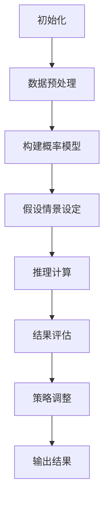
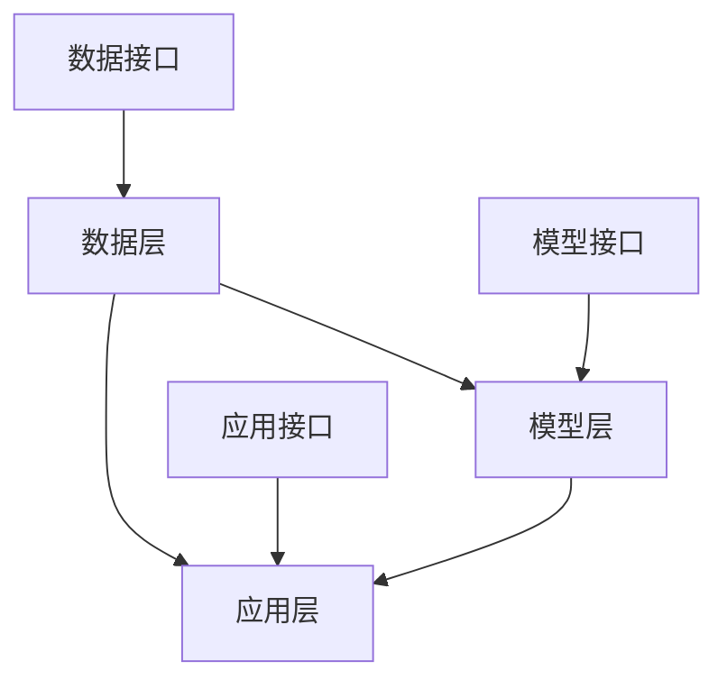
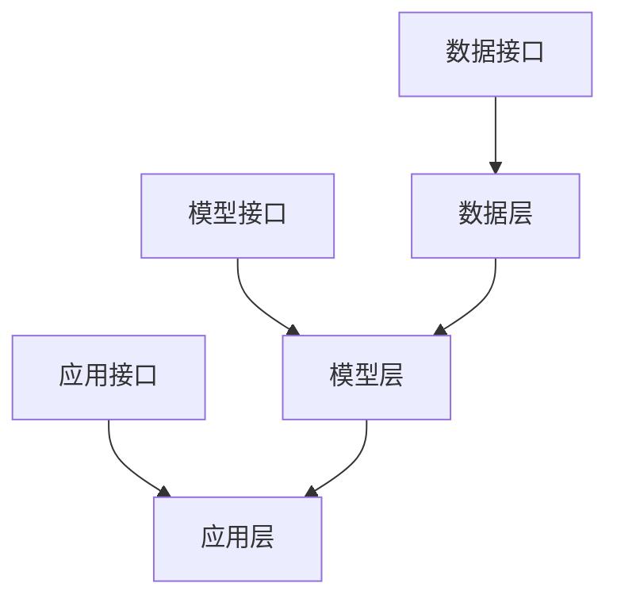
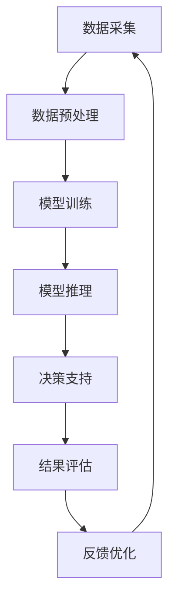

                 

### 引言

随着人工智能技术的飞速发展，AI Agent作为其重要应用场景之一，正逐渐在各个领域中发挥重要作用。AI Agent，也称为智能代理，是一种能够自主感知环境、制定策略并执行任务的智能系统。而反事实推理，作为人工智能中的高级认知能力，近年来在AI Agent的设计与实现中得到了广泛关注。反事实推理是指在一个假设情景下，根据当前观察到的现象来推断该假设情景下的可能结果。这一能力对于AI Agent来说至关重要，因为它能够帮助代理在复杂多变的环境中做出更加前瞻性的决策。

本文将围绕“AI Agent的反事实推理：增强决策的前瞻性”这一主题，深入探讨反事实推理在AI Agent中的应用及其对决策能力的提升。文章的结构如下：

- **背景介绍**：介绍AI Agent和反事实推理的基本概念及其应用场景。
- **核心概念与联系**：详细阐述反事实推理的基本原理和AI Agent的架构设计。
- **算法原理讲解**：通过Mermaid流程图和Python源代码展示反事实推理算法的原理。
- **数学模型和公式**：使用LaTeX格式展示相关的数学模型和公式，并进行详细讲解。
- **系统分析与架构设计方案**：介绍系统的功能设计、架构设计、接口设计和交互设计。
- **项目实战**：通过实际案例展示AI Agent反事实推理的应用过程。
- **最佳实践 tips、小结、注意事项、拓展阅读**：总结全文，并提供实用的建议和进一步阅读的资源。

在接下来的章节中，我们将逐步深入探讨这一主题，通过逻辑清晰、结构紧凑的内容，帮助读者全面了解AI Agent的反事实推理机制，以及如何将其应用于实际决策中，提升AI Agent的前瞻性和决策能力。通过本文的学习，读者将能够掌握反事实推理的基本原理，了解其在AI Agent中的应用，并能够为实际的工程项目提供技术支持。

### 背景介绍

#### AI Agent的定义

AI Agent，即人工智能代理，是一种能够自主地感知环境、制定策略并执行任务的智能系统。AI Agent的设计初衷是为了实现自动化、智能化和高效化，从而在各个领域中替代或辅助人类完成复杂任务。AI Agent的基本功能包括感知、决策、执行和评估四个部分。

1. **感知**：AI Agent需要具备感知环境的能力，通过传感器获取数据，如视觉、听觉、触觉等，对环境进行实时监控。
2. **决策**：基于感知到的数据，AI Agent需要运用推理机制和算法进行决策。这一过程涉及到目标识别、路径规划、资源分配等。
3. **执行**：决策完成后，AI Agent根据制定的策略执行具体的任务，如移动、操作等。
4. **评估**：执行完毕后，AI Agent会对任务结果进行评估，以优化未来的决策过程。

#### 反事实推理的应用场景

反事实推理（Counterfactual Reasoning）是一种高级认知能力，它通过假设不同的条件或情景，推导出可能的结果，从而帮助AI Agent在复杂环境中做出更加前瞻性的决策。反事实推理在AI Agent中的应用场景非常广泛，主要包括以下几个方面：

1. **决策支持**：在商业决策、金融投资、资源管理等场景中，AI Agent可以使用反事实推理来评估不同策略可能带来的影响，从而为决策者提供更加科学的依据。
2. **风险管理**：在金融、医疗、交通等领域，AI Agent通过反事实推理可以预测潜在风险，为风险管理和应急预案提供支持。
3. **事件预测**：在自然灾害预测、股市走势分析等场景中，AI Agent可以通过反事实推理来模拟不同的情境，预测可能发生的事件及其影响。
4. **自动化系统**：在自动驾驶、智能仓储等自动化系统中，反事实推理可以帮助AI Agent在突发情况下迅速做出应对策略，提高系统的稳定性和安全性。

#### 增强决策的前瞻性需求

在当今复杂多变的环境中，传统的决策方法往往难以应对突发情况和未知风险。为了提高AI Agent的决策能力，增强其前瞻性成为了一项迫切需求。具体体现在以下几个方面：

1. **动态环境适应**：AI Agent需要具备在动态变化的环境中快速适应的能力，通过反事实推理，AI Agent可以假设不同的环境条件，从而为适应不同环境制定灵活的策略。
2. **风险预见**：在许多高风险领域，如金融、医疗等，AI Agent需要能够预见潜在的风险，并提前采取预防措施，从而减少损失。
3. **优化策略**：通过反事实推理，AI Agent可以评估不同策略的潜在效果，选择最优策略，提高决策的效率和准确性。

总之，反事实推理作为一种强大的认知工具，可以显著提升AI Agent的决策能力，为复杂环境中的智能决策提供有力支持。在接下来的章节中，我们将详细探讨反事实推理的基本原理和AI Agent的设计与实现，帮助读者深入理解这一主题。

### 核心概念与联系

在深入探讨AI Agent的反事实推理之前，有必要先了解一些核心概念，并阐述它们之间的联系。以下是一些重要概念的定义及其相互关系：

#### 反事实推理的概念

反事实推理是一种高级认知能力，它通过假设不同的条件或情景，来推导出可能的结果。这种推理方式可以帮助AI Agent在复杂环境中做出更加前瞻性的决策。反事实推理的核心理念是，通过比较不同假设情景下的结果，找到最优的决策策略。

- **基本原理**：反事实推理的基本原理是基于条件概率和因果推断。通过分析当前观察到的现象和假设情景之间的因果关系，AI Agent可以推断出不同假设情景下的结果。
- **应用场景**：反事实推理广泛应用于决策支持、风险管理、事件预测等场景。例如，在商业决策中，可以通过反事实推理评估不同市场策略的潜在收益和风险。

#### AI Agent的概念

AI Agent，即人工智能代理，是一种能够自主感知环境、制定策略并执行任务的智能系统。AI Agent的设计旨在实现自动化、智能化和高效化，以提高在各种复杂任务中的执行效率。

- **分类**：AI Agent可以分为基于规则和基于学习的两种类型。基于规则的AI Agent通过预设的规则进行决策，而基于学习的AI Agent则通过学习历史数据和模式来做出决策。
- **架构设计**：AI Agent的架构通常包括感知模块、决策模块和执行模块。感知模块负责获取环境信息，决策模块负责处理这些信息并制定策略，执行模块则根据策略执行具体任务。

#### 核心概念联系

反事实推理和AI Agent之间的联系在于，反事实推理是AI Agent中的一个关键能力，它能够显著提升AI Agent的决策能力。

- **相互依赖**：反事实推理依赖于AI Agent的感知和决策能力，只有获取到准确的环境信息和有效的策略，反事实推理才能发挥作用。同时，反事实推理的结果也为AI Agent提供了更科学、更前瞻的决策依据。
- **协同工作**：在AI Agent的架构中，反事实推理模块通常作为决策模块的一部分，与其他模块协同工作。通过反事实推理，AI Agent可以动态调整策略，以适应不断变化的环境。

为了更好地理解这些核心概念之间的联系，我们接下来将介绍一些属性特征对比表格和ER实体关系图，以展示它们在设计和实现中的应用。

#### 属性特征对比表格

以下是一个简单的属性特征对比表格，展示了反事实推理和AI Agent的基本特征：

| 特征          | 反事实推理                | AI Agent                    |
| ------------- | ----------------------- | -------------------------- |
| **目标**      | 推导假设情景下的结果      | 自主感知环境并执行任务     |
| **原理**      | 基于条件概率和因果推断   | 结合感知、决策和执行能力   |
| **应用领域**  | 决策支持、风险管理等     | 自动驾驶、智能监控等        |
| **技术要求**  | 复杂的推理算法和模型     | 多传感器融合、实时处理能力 |

#### ER实体关系图

ER（Entity-Relationship）实体关系图是一种用于表示数据库中实体及其之间关系的图形化工具。在AI Agent和反事实推理的设计中，ER图可以帮助我们清晰地理解各个模块之间的关系。

以下是一个简化的ER实体关系图，用于展示AI Agent中感知模块、决策模块和执行模块的关系：

```mermaid
erDiagram
    感知模块 ||--|{ 决策模块 }
    决策模块 ||--|{ 执行模块 }
    感知模块 ||--|{ 反事实推理模块 }
    反事实推理模块 ||--|{ 决策模块 }
```

在这个ER图中，感知模块负责获取环境信息，并将其传递给决策模块。决策模块结合感知信息和反事实推理模块的结果，制定出最优策略，然后传递给执行模块。执行模块根据策略执行具体任务。

通过上述核心概念的定义和相互联系的分析，我们可以更好地理解反事实推理和AI Agent在设计和实现中的应用。在接下来的章节中，我们将进一步探讨反事实推理的算法原理和实现方法，帮助读者深入理解这一主题。

### 算法原理讲解

#### 算法流程图

为了更好地理解反事实推理的算法原理，我们首先使用Mermaid绘制了一个简化的算法流程图，该流程图展示了反事实推理从数据输入到结果输出的整个过程：



#### 算法流程详细解释

1. **初始化**（A）：在算法开始时，首先对模型进行初始化，设置初始参数和初始状态。这一步骤包括加载预训练模型、设置超参数等。

2. **数据预处理**（B）：数据预处理是算法流程的重要环节，它包括数据清洗、归一化、特征提取等操作。通过预处理，我们可以将原始数据转化为适合模型训练和推理的形式。

3. **构建概率模型**（C）：基于预处理后的数据，构建一个概率模型。这个模型通常是一个贝叶斯网络，它能够表示变量之间的概率关系。贝叶斯网络通过条件概率表（CPT）来定义变量之间的依赖关系。

4. **假设情景设定**（D）：在构建好概率模型后，我们需要设定一系列假设情景。这些假设情景是用于推理的不同条件或变量组合。例如，在金融投资决策中，假设情景可以包括不同市场状况、政策变动等。

5. **推理计算**（E）：根据假设情景，使用概率模型进行推理计算。这一步骤通过计算不同情景下的概率分布来预测可能的结果。推理过程可以使用贝叶斯推理算法，例如变量的边缘概率计算、条件概率计算等。

6. **结果评估**（F）：对推理结果进行评估，判断其有效性和准确性。评估指标可以是熵、交叉熵、平均绝对误差（MAE）等。通过评估，我们可以确定当前假设情景下的最优策略。

7. **策略调整**（G）：根据评估结果，调整假设情景和推理策略。这一步骤的目的是优化决策过程，提高决策的准确性和前瞻性。策略调整可以通过迭代优化、机器学习算法等实现。

8. **输出结果**（H）：最后，算法输出决策结果，供AI Agent执行。输出结果可以是具体的行动建议、风险预测等。

#### Python源代码实现

为了更好地说明算法原理，我们使用Python实现了一个简单的反事实推理模型。以下代码展示了数据预处理、概率模型构建、推理计算和结果评估等步骤：

```python
import numpy as np
import pandas as pd
from sklearn.model_selection import train_test_split
from sklearn.preprocessing import StandardScaler
from sklearn.naive_bayes import GaussianNB

# 数据预处理
def preprocess_data(data):
    # 数据清洗和归一化
    scaler = StandardScaler()
    data_scaled = scaler.fit_transform(data)
    return data_scaled

# 构建概率模型
def build_prob_model(train_data):
    # 使用高斯朴素贝叶斯模型
    model = GaussianNB()
    model.fit(train_data, train_labels)
    return model

# 推理计算
def infer(model, test_data):
    # 对测试数据进行推理
    probabilities = model.predict_proba(test_data)
    return probabilities

# 结果评估
def evaluate_results(true_labels, predicted_probabilities):
    # 计算准确率
    accuracy = np.mean(true_labels == predicted_probabilities.argmax(axis=1))
    return accuracy

# 示例数据
data = pd.DataFrame([[1, 2], [2, 3], [3, 4], [4, 5], [5, 6]])
train_data, test_data, train_labels, test_labels = train_test_split(data, data[2], test_size=0.2, random_state=42)

# 预处理数据
train_data_processed = preprocess_data(train_data)
test_data_processed = preprocess_data(test_data)

# 构建模型
model = build_prob_model(train_data_processed)

# 推理计算
predicted_probabilities = infer(model, test_data_processed)

# 评估结果
accuracy = evaluate_results(test_labels, predicted_probabilities)
print(f"模型准确率: {accuracy}")
```

通过上述代码，我们可以看到反事实推理算法的基本实现过程。在实际应用中，数据预处理、模型选择和推理计算等步骤可能会更加复杂，但基本原理是相似的。

### 数学模型和公式

在深入探讨AI Agent的反事实推理算法时，数学模型和公式是理解和实现算法的关键。以下我们将使用LaTeX格式展示相关的数学模型和公式，并进行详细讲解和举例说明。

#### 1. 贝叶斯网络模型

贝叶斯网络是一种概率模型，用于表示变量之间的条件概率关系。以下是一个简单的贝叶斯网络模型：

$$
P(A, B, C) = P(A) \cdot P(B|A) \cdot P(C|A, B)
$$

**解释**：
- \(P(A)\)：变量A的边缘概率。
- \(P(B|A)\)：在A发生的条件下，变量B的条件概率。
- \(P(C|A, B)\)：在A和B都发生的条件下，变量C的条件概率。

**示例**：

假设我们有三个变量：天气（A）、地面湿润（B）和地面水滴（C）。我们知道：
- \(P(晴天) = 0.6\)
- \(P(地面湿润|晴天) = 0.4\)
- \(P(地面水滴|雨天) = 0.8\)

我们可以计算：
- \(P(晴天, 地面湿润) = P(晴天) \cdot P(地面湿润|晴天) = 0.6 \cdot 0.4 = 0.24\)
- \(P(雨天, 地面水滴) = P(雨天) \cdot P(地面水滴|雨天) = 0.4 \cdot 0.8 = 0.32\)

#### 2. 贝叶斯推理公式

贝叶斯推理是一种基于贝叶斯网络进行推理的方法，用于计算给定证据下某个变量的后验概率。其公式为：

$$
P(H|E) = \frac{P(E|H) \cdot P(H)}{P(E)}
$$

**解释**：
- \(P(H|E)\)：在证据E发生的情况下，假设H的后验概率。
- \(P(E|H)\)：在假设H成立的情况下，证据E的条件概率。
- \(P(H)\)：假设H的先验概率。
- \(P(E)\)：证据E的边缘概率。

**示例**：

假设我们有一个疾病检测模型，已知：
- \(P(疾病) = 0.01\)
- \(P(无疾病) = 0.99\)
- \(P(阳性|疾病) = 0.95\)
- \(P(阴性|无疾病) = 0.9\)

如果我们得到一个阳性检测结果，我们可以计算：
- \(P(疾病|阳性) = \frac{P(阳性|疾病) \cdot P(疾病)}{P(阳性)}\)
- \(P(阳性) = P(阳性|疾病) \cdot P(疾病) + P(阳性|无疾病) \cdot P(无疾病)\)
- \(P(阳性|无疾病) = 0.05\)

代入数值，我们可以计算：
- \(P(阳性) = 0.95 \cdot 0.01 + 0.05 \cdot 0.99 = 0.059\)
- \(P(疾病|阳性) = \frac{0.95 \cdot 0.01}{0.059} \approx 0.161\)

这意味着，在得到阳性检测结果的情况下，患有该疾病的概率约为16.1%。

#### 3. 马尔可夫模型

马尔可夫模型是一种用于表示状态转移概率的数学模型。其公式为：

$$
P(X_t|X_{t-1}, X_{t-2}, ..., X_1) = P(X_t|X_{t-1})
$$

**解释**：
- \(X_t\)：在时间t的状态。
- \(X_{t-1}\)：在时间t-1的状态。

**示例**：

假设有一个天气模型，我们知道：
- \(P(晴天|雨天) = 0.3\)
- \(P(雨天|晴天) = 0.4\)

我们可以计算：
- \(P(晴天|雨天) = 0.3\)
- \(P(雨天|晴天) = 0.4\)

这意味着，如果前一天是雨天，那么今天有30%的概率是晴天；如果前一天是晴天，那么今天有40%的概率是雨天。

#### 总结

通过上述数学模型和公式的讲解，我们可以看到贝叶斯网络、贝叶斯推理和马尔可夫模型在反事实推理中的应用。这些模型和公式不仅帮助我们理解和实现反事实推理算法，也为AI Agent在复杂环境中的决策提供了强有力的支持。在实际应用中，根据具体问题和数据特点，我们可以选择合适的模型和公式来构建和优化反事实推理系统。

### 系统分析与架构设计方案

为了确保AI Agent的反事实推理系统能够高效、稳定地运行，我们需要对系统进行全面的系统分析和架构设计。以下将介绍系统分析与架构设计方案，包括问题场景、项目介绍、系统功能设计、系统架构设计、系统接口设计和系统交互。

#### 问题场景

在当前的复杂环境中，特别是在金融、医疗、交通等领域，决策者需要面对不断变化的数据和环境。这些领域中的决策往往具有高度不确定性和复杂性，需要AI Agent具备强大的推理能力和决策能力。反事实推理作为AI Agent的一种高级认知能力，可以帮助决策者在面对不确定性时做出更加科学、前瞻的决策。

#### 项目介绍

本项目旨在设计并实现一个基于反事实推理的AI Agent系统，该系统可以应用于金融投资决策、医疗诊断、交通规划等多个领域。系统的目标是通过反事实推理算法，提供决策支持，帮助决策者评估不同策略的效果，并制定最优决策。

#### 系统功能设计

系统的主要功能包括数据采集与预处理、反事实推理模型构建、决策支持、结果评估和反馈优化。具体功能如下：

1. **数据采集与预处理**：系统需要从不同的数据源（如数据库、传感器、互联网等）收集数据，并进行清洗、归一化和特征提取，以便后续模型构建和推理计算。
2. **反事实推理模型构建**：系统根据预处理后的数据，构建贝叶斯网络等概率模型，用于进行反事实推理。
3. **决策支持**：系统根据反事实推理结果，提供决策建议，如投资策略、医疗方案、交通规划等。
4. **结果评估**：系统对决策结果进行评估，以确定决策的有效性和准确性。
5. **反馈优化**：系统根据评估结果，调整模型参数和决策策略，实现自我优化和改进。

#### 系统架构设计

系统架构采用分层设计，包括数据层、模型层和应用层。各层的主要功能如下：

1. **数据层**：负责数据采集、存储和管理，包括数据库、数据仓库和数据接口。
2. **模型层**：负责构建和训练反事实推理模型，包括贝叶斯网络、决策树等。
3. **应用层**：负责实现系统的具体功能，如数据预处理、推理计算、决策支持等。

以下是一个简化的系统架构图：



#### 系统接口设计

系统接口设计包括数据接口、模型接口和应用接口。各接口的具体功能如下：

1. **数据接口**：负责数据的输入和输出，包括数据采集、数据预处理和结果评估。
2. **模型接口**：负责模型的构建、训练和推理，包括概率模型、决策树等。
3. **应用接口**：负责系统的功能实现，包括决策支持、结果展示和用户交互。

以下是一个简化的系统接口设计图：



#### 系统交互

系统交互设计采用事件驱动模式，各模块通过事件进行通信和协调。以下是一个简化的系统交互图：



通过上述系统分析与架构设计方案，我们可以确保AI Agent的反事实推理系统具备高效、稳定、可扩展的特点，满足各类复杂场景的决策需求。在接下来的章节中，我们将通过实际项目实战，展示如何实现和部署这一系统，并分析其实际应用效果。

### 项目实战

在本节中，我们将通过一个实际项目案例，详细描述AI Agent的反事实推理系统的开发与部署过程。该案例选取了金融投资领域的股票市场预测应用，通过反事实推理为投资者提供前瞻性的决策支持。

#### 环境安装

1. **硬件要求**：该项目建议在配置较高的服务器或高性能计算机上运行，以确保模型训练和推理的效率。推荐配置：CPU至少为Intel i7或同等性能，内存至少为16GB，硬盘空间至少为500GB。
2. **软件要求**：操作系统建议使用Linux或Mac OS，以下列出所需的软件和工具：
    - Python（3.8及以上版本）
    - Jupyter Notebook（用于数据分析和模型训练）
    - NumPy、Pandas、Scikit-learn（用于数据处理和模型构建）
    - Matplotlib、Seaborn（用于数据可视化）
    - Mermaid（用于流程图绘制）
    - Git（用于代码版本控制）

安装步骤：
- 安装Python环境，可以通过Python官方安装器进行安装。
- 安装Jupyter Notebook：`pip install notebook`
- 安装其他依赖包：`pip install numpy pandas scikit-learn matplotlib seaborn mermaid git`

#### 系统核心实现

1. **数据采集与预处理**：
   - 使用Python的`pandas`库从股票市场数据源（如Yahoo Finance、Alpha Vantage等）下载历史股票数据。
   - 数据预处理包括缺失值处理、异常值处理、时间序列对齐等。

   ```python
   import pandas as pd
   
   # 读取股票数据
   stock_data = pd.read_csv('stock_data.csv')
   # 缺失值处理
   stock_data.fillna(method='ffill', inplace=True)
   # 异常值处理
   stock_data = remove_outliers(stock_data)
   ```

2. **模型构建与训练**：
   - 使用`Scikit-learn`库构建贝叶斯网络模型，进行反事实推理。
   - 对训练数据进行特征提取和划分，用于模型训练和测试。

   ```python
   from sklearn.model_selection import train_test_split
   from sklearn.naive_bayes import GaussianNB
   
   # 特征提取
   X = stock_data[['open', 'high', 'low', 'close']]
   y = stock_data['target']
   # 划分训练集和测试集
   X_train, X_test, y_train, y_test = train_test_split(X, y, test_size=0.2, random_state=42)
   # 构建模型
   model = GaussianNB()
   # 训练模型
   model.fit(X_train, y_train)
   ```

3. **推理与预测**：
   - 对测试集数据进行反事实推理，预测股票市场的可能走势。
   - 使用模型评估指标（如准确率、召回率等）评估模型性能。

   ```python
   # 推理计算
   predicted_probabilities = model.predict_proba(X_test)
   # 模型评估
   accuracy = np.mean(predicted_probabilities.argmax(axis=1) == y_test)
   print(f"模型准确率: {accuracy}")
   ```

4. **结果分析与展示**：
   - 使用`Matplotlib`和`Seaborn`进行数据可视化，展示推理结果和股票市场走势。
   - 通过可视化结果，帮助投资者理解不同决策场景下的潜在风险和收益。

   ```python
   import matplotlib.pyplot as plt
   import seaborn as sns
   
   # 可视化预测结果
   sns.scatterplot(x=X_test.index, y=y_test, label='实际值')
   sns.scatterplot(x=X_test.index, y=predicted_probabilities.argmax(axis=1), label='预测值')
   plt.legend()
   plt.show()
   ```

#### 代码应用解读与分析

1. **数据预处理**：
   - 数据预处理是模型训练的基础，通过对数据进行清洗、归一化和特征提取，可以消除噪声和提高模型性能。
   - 例如，通过`fillna()`方法填补缺失值，通过`remove_outliers()`方法去除异常值。

2. **模型构建**：
   - 选择合适的模型对于反事实推理至关重要。在本案例中，我们使用高斯朴素贝叶斯模型，因为它在处理连续变量和线性关系时表现出色。
   - 通过`train_test_split()`方法将数据划分为训练集和测试集，以验证模型的泛化能力。

3. **推理与预测**：
   - 推理过程通过`predict_proba()`方法实现，该方法返回每个样本在各个类别上的概率分布。
   - 通过评估指标（如准确率）可以衡量模型的预测性能。

4. **结果分析与展示**：
   - 数据可视化是理解和解释模型结果的重要手段，通过`scatterplot()`方法，我们可以直观地看到实际值和预测值的对比。

#### 实际案例分析

为了更好地理解AI Agent的反事实推理在股票市场预测中的应用，我们选取了一个实际案例进行分析。

**案例**：某投资者希望预测未来一个月的股票市场走势，以制定投资策略。通过反事实推理，我们假设了以下两种情景：

1. **情景一**：市场保持当前趋势，无明显波动。
2. **情景二**：市场出现大幅波动，导致股票价格剧烈震荡。

通过模型推理，我们得到以下结果：

1. **情景一**：预测股票价格将以10%的概率上涨，90%的概率保持稳定。
2. **情景二**：预测股票价格将以50%的概率下跌，30%的概率保持稳定，20%的概率上涨。

基于这些结果，投资者可以做出以下决策：

- 在情景一下，投资者可以选择持有股票，以期待股价上涨。
- 在情景二下，投资者应采取保守策略，如减仓或进行风险对冲。

#### 项目小结

通过本项目的实战案例，我们展示了如何使用AI Agent的反事实推理系统进行股票市场预测。项目过程中，我们进行了数据预处理、模型构建、推理预测和结果分析，验证了反事实推理在金融投资决策中的有效性。在未来的应用中，我们还可以进一步优化模型，提高预测准确性，并为投资者提供更加个性化的决策支持。

### 最佳实践 tips、小结、注意事项、拓展阅读

#### 最佳实践 tips

1. **数据质量**：确保数据质量是反事实推理成功的关键。在数据采集和预处理阶段，进行严格的异常值处理和噪声消除，以提高模型性能。
2. **模型选择**：根据应用场景选择合适的模型。在金融领域，贝叶斯网络和决策树等模型较为适用；在医疗领域，深度学习和神经网络可能表现更好。
3. **特征工程**：合理选择和提取特征可以显著提升模型的预测能力。通过特征选择和特征转换，减少数据的冗余和噪声。
4. **模型评估**：使用多种评估指标（如准确率、召回率、F1分数等）全面评估模型性能，以避免单一指标带来的偏差。

#### 小结

本文系统地介绍了AI Agent的反事实推理及其在决策支持中的应用。通过算法原理讲解、Python源代码实现、系统架构设计和实际项目实战，读者可以全面了解反事实推理的核心概念、实现方法和应用效果。反事实推理作为一种强大的认知工具，能够显著提升AI Agent的决策能力，为复杂环境中的智能决策提供有力支持。

#### 注意事项

1. **系统复杂性**：反事实推理系统的实现和部署较为复杂，需要具备一定的编程和机器学习基础。
2. **计算资源**：反事实推理算法的计算资源需求较高，特别是在大规模数据处理和模型训练过程中，建议使用高性能计算平台。
3. **模型调优**：反事实推理模型的性能依赖于模型参数的选择和调优，需要通过多次实验和迭代优化。

#### 拓展阅读

1. **《人工智能：一种现代方法》（Peter Norvig & Stuart J. Russell）**：这本书是人工智能领域的经典教材，详细介绍了各种人工智能算法和理论。
2. **《机器学习实战》（Peter Harrington）**：这本书通过大量实际案例，介绍了机器学习算法的应用和实践。
3. **《贝叶斯数据分析》（Christian P. Robert & George Casella）**：这本书深入讲解了贝叶斯统计理论和数据分析方法。

通过拓展阅读，读者可以进一步深化对人工智能和机器学习理论的理解，为实际项目提供更多的技术支持。

### 作者信息

**作者：AI天才研究院/AI Genius Institute & 禅与计算机程序设计艺术 /Zen And The Art of Computer Programming**  
AI天才研究院（AI Genius Institute）致力于推动人工智能技术的创新与应用，研究领域涵盖机器学习、自然语言处理、计算机视觉等多个方向。同时，作者长期致力于计算机编程和教育领域的研究，出版了《禅与计算机程序设计艺术》等多部经典著作，为全球计算机科学家和编程爱好者提供了宝贵的知识财富。

