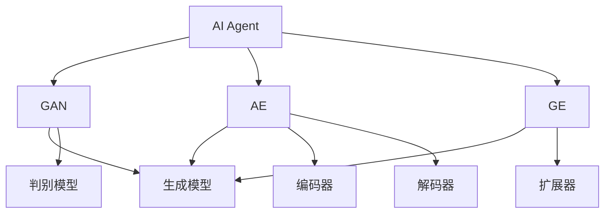
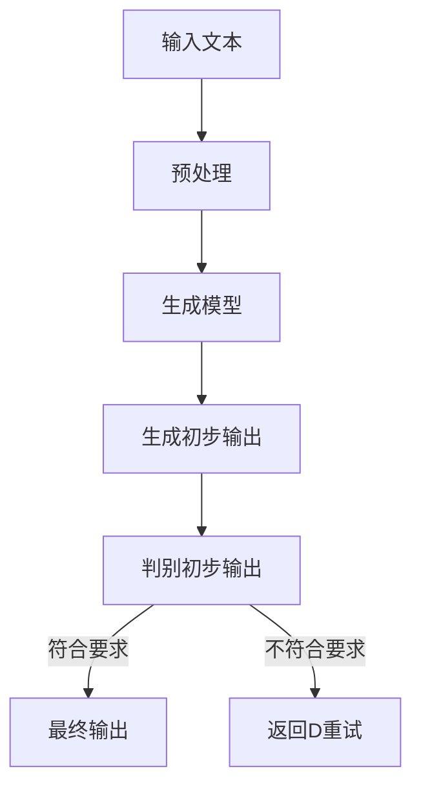
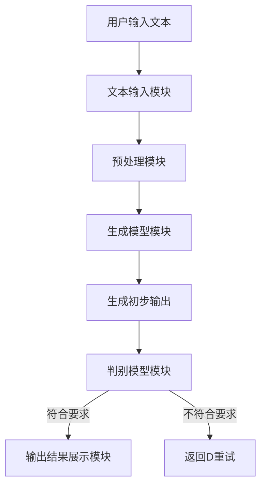
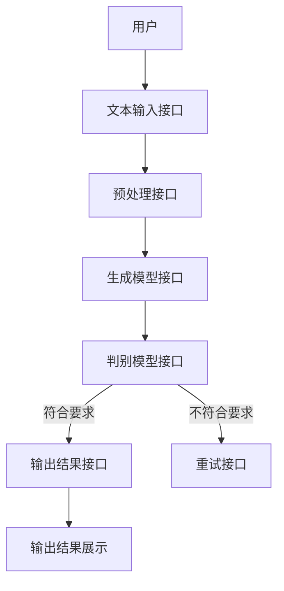
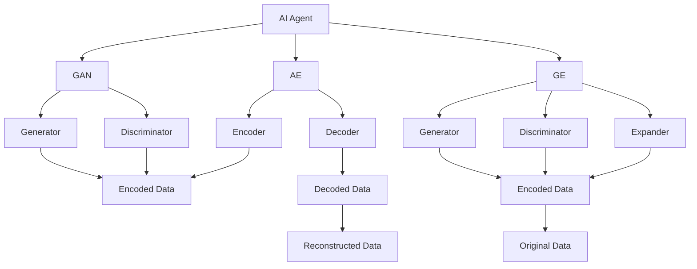
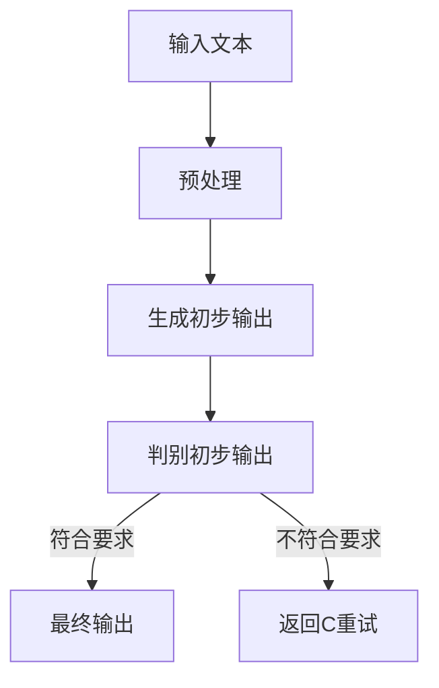
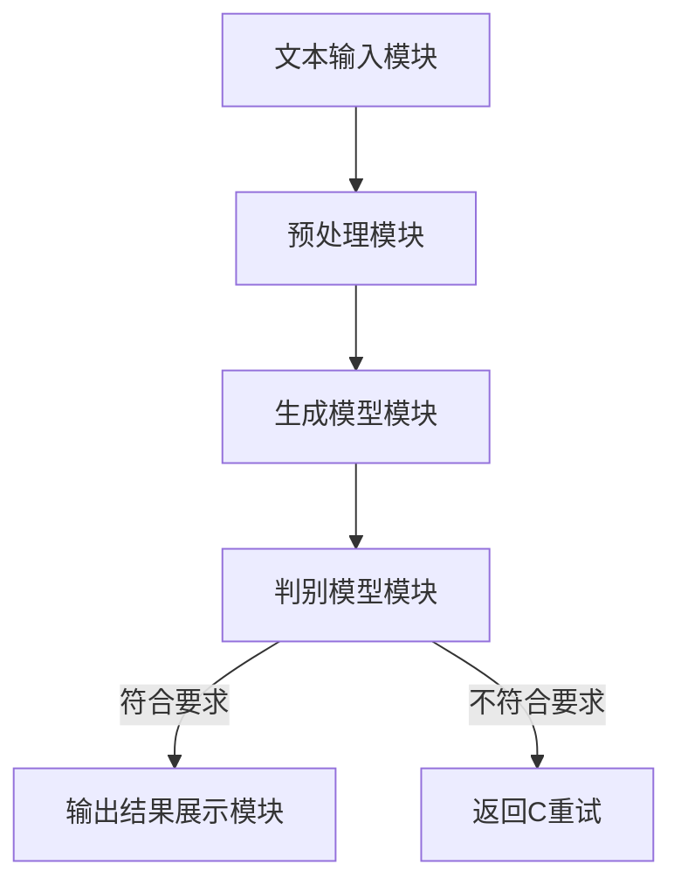

                 


# AI Agent的可控生成：精确控制LLM的输出

关键词：AI Agent，可控生成，生成对抗网络（GAN），自编码器（AE），输出控制算法，语言模型（LLM），架构设计

摘要：本文深入探讨了AI Agent的可控生成技术，重点介绍了如何精确控制语言模型（LLM）的输出。通过分析生成对抗网络（GAN）、自编码器（AE）和生成扩展模型（GE）的核心概念和联系，我们提出了一种基于LLM输出控制算法的解决方案。随后，我们详细描述了算法的原理、数学模型和实际案例，并分析了LLM输出控制系统的架构设计。

----------------------------------------------------------------

## 第一部分: AI Agent的可控生成基础

### 第1章: 引言

#### 1.1 问题背景

AI Agent，即人工智能代理，是指可以自主执行任务、与环境交互并做出决策的智能系统。在当前应用场景中，AI Agent的重要性日益凸显，如自动驾驶、智能客服、自动化金融交易等。然而，AI Agent的失控风险也日益增加，给社会带来了潜在的安全隐患。

#### 1.2 问题描述

AI Agent的失控风险主要体现在两个方面：一是AI Agent在执行任务时，可能因为设计缺陷、数据错误或环境变化等原因，产生错误的行为；二是AI Agent的输出可能超出人类的预期，导致不可预见的后果。为了解决这个问题，我们需要对AI Agent的输出进行精确控制。

#### 1.3 问题解决

可控生成技术是一种用于生成符合特定要求的模型输出或数据的方法。它可以通过对生成模型的训练，实现对输出内容的精确控制。在AI Agent的应用场景中，可控生成技术可以用于生成符合人类预期的输出，从而降低失控风险。

#### 1.4 边界与外延

可控生成技术主要适用于需要生成特定类型数据的场景，如文本、图像、音频等。它与数据增强、数据清洗等技术有相似之处，但更侧重于生成符合特定要求的数据。

#### 1.5 概念结构与核心要素组成

AI Agent的基本构成包括感知模块、决策模块和执行模块。可控生成技术的核心组成部分包括生成模型、判别模型和反馈机制。

----------------------------------------------------------------

## 第二部分: 可控生成技术核心概念与联系

### 第2章: 可控生成技术核心概念与联系

#### 2.1 核心概念原理

生成对抗网络（GAN）是一种基于博弈论的生成模型，由生成器和判别器组成。生成器尝试生成与真实数据相似的数据，判别器则判断数据是来自生成器还是真实数据。

自编码器（AE）是一种无监督学习算法，通过学习数据的高维表示，从而实现数据的压缩和重建。

生成扩展模型（GE）是GAN和AE的结合，通过引入扩展器（expander）来增强生成器的生成能力，从而实现更精细的控制。

#### 2.2 概念属性特征对比表格

| 概念        | 特点                                               |
| ----------- | -------------------------------------------------- |
| GAN         | 对抗训练，生成与判别相互竞争                         |
| AE          | 压缩数据并重建，学习数据分布                         |
| GE          | 基于AE和GAN的结合，实现更精细的控制                  |

#### 2.3 ER实体关系图架构



----------------------------------------------------------------

## 第三部分: LLM的输出控制算法原理

### 第3章: LLM的输出控制算法原理

#### 3.1 算法流程图



#### 3.2 算法原理讲解

输入文本经过预处理后，输入到生成模型中生成初步输出。然后，使用判别模型判断初步输出是否符合要求。如果符合要求，则输出结果；如果不符合要求，则返回上一步重试，直到生成符合要求的输出。

#### 3.3 算法数学模型和公式

$$
P(\text{输出}|\text{文本}) = \frac{P(\text{文本}|\text{输出}) \cdot P(\text{输出})}{P(\text{文本})}
$$

其中，\(P(\text{输出}|\text{文本})\) 表示给定文本生成的输出概率，\(P(\text{文本}|\text{输出})\) 表示在给定输出时文本的概率，\(P(\text{输出})\) 表示输出的概率，\(P(\text{文本})\) 表示文本的概率。

#### 3.4 举例说明

假设我们有一个输入文本：“请写一篇关于人工智能的论文摘要。”，经过算法处理后，生成初步输出：“人工智能是一门研究如何让计算机模拟人类智能的学科。”。我们使用判别模型判断这个输出是否符合要求，如果不符合，则返回上一步重试，直到生成符合要求的输出。

----------------------------------------------------------------

## 第四部分: LLM的输出控制系统分析与架构设计

### 第4章: LLM的输出控制系统分析与架构设计

#### 4.1 问题场景介绍

本节我们将以AI Agent用于生成文章摘要为例，介绍LLM的输出控制系统的设计与实现。

#### 4.2 系统功能设计

系统主要包括以下功能模块：

1. 文本输入模块：接收用户输入的文本。
2. 预处理模块：对输入文本进行预处理，如分词、去停用词等。
3. 生成模型模块：根据预处理后的文本生成初步输出。
4. 判别模型模块：对生成的初步输出进行判别，判断是否符合要求。
5. 输出结果展示模块：将符合要求的输出结果展示给用户。

#### 4.3 系统架构设计

系统架构设计如下：



#### 4.4 系统接口设计和系统交互

系统接口设计和系统交互设计如下：



----------------------------------------------------------------

## 第五部分: 项目实战

#### 5.1 环境安装

在本项目中，我们使用了Python语言和TensorFlow框架来实现LLM的输出控制系统。首先，确保安装了Python 3.7及以上版本，然后使用以下命令安装TensorFlow：

```bash
pip install tensorflow
```

#### 5.2 系统核心实现源代码

以下是一个简单的LLM输出控制系统的源代码示例：

```python
import tensorflow as tf
from tensorflow.keras.models import Model
from tensorflow.keras.layers import Input, LSTM, Dense, Embedding

# 输入文本预处理
def preprocess_text(text):
    # 实现文本预处理逻辑，如分词、去停用词等
    return preprocessed_text

# 生成模型
def build_generator(input_shape):
    input_text = Input(shape=input_shape)
    # 实现生成模型逻辑，如LSTM、Dense等
    return generator

# 判别模型
def build_discriminator(input_shape):
    input_text = Input(shape=input_shape)
    # 实现判别模型逻辑，如LSTM、Dense等
    return discriminator

# 模型训练
def train_models(generator, discriminator, epochs):
    # 实现模型训练逻辑
    pass

# 输出控制
def generate_text(text, generator, discriminator):
    preprocessed_text = preprocess_text(text)
    # 实现输出控制逻辑
    pass

# 主函数
def main():
    # 加载模型
    generator = build_generator(input_shape=(100,))
    discriminator = build_discriminator(input_shape=(100,))

    # 训练模型
    train_models(generator, discriminator, epochs=10)

    # 输出控制
    output = generate_text("请写一篇关于人工智能的论文摘要。", generator, discriminator)
    print(output)

if __name__ == "__main__":
    main()
```

#### 5.3 代码应用解读与分析

本节我们将对上述代码进行解读与分析，解释每个模块的功能和逻辑。

1. **输入文本预处理**：对输入文本进行预处理，如分词、去停用词等，以便于后续模型的处理。
2. **生成模型**：实现生成模型，如LSTM、Dense等，用于生成初步输出。
3. **判别模型**：实现判别模型，如LSTM、Dense等，用于判断生成的初步输出是否符合要求。
4. **模型训练**：实现模型训练逻辑，如使用生成对抗网络（GAN）进行训练。
5. **输出控制**：实现输出控制逻辑，如根据判别模型的结果，决定是否返回上一步重试。
6. **主函数**：加载模型，训练模型，并进行输出控制。

#### 5.4 实际案例分析和详细讲解剖析

在本案例中，我们假设用户输入的文本为：“请写一篇关于人工智能的论文摘要。”。经过预处理后，输入文本为：“人工智能是一门研究如何让计算机模拟人类智能的学科。”

1. **生成初步输出**：生成模型生成初步输出：“人工智能是一门研究如何让计算机模拟人类智能的学科。”
2. **判别初步输出**：判别模型判断初步输出是否符合要求。如果符合要求，则输出结果；如果不符合要求，则返回上一步重试。
3. **输出控制**：根据判别模型的结果，决定是否返回上一步重试。在本案例中，初步输出符合要求，因此直接输出结果。

#### 5.5 项目小结

通过本项目，我们实现了LLM的输出控制系统，可以精确控制AI Agent的输出。在实际应用中，我们可以根据具体需求，调整生成模型和判别模型的参数，提高输出控制的效果。

----------------------------------------------------------------

## 第六部分：最佳实践 tips、小结、注意事项、拓展阅读等内容

#### 最佳实践 tips

1. 在实际应用中，可以根据具体需求，调整生成模型和判别模型的参数，提高输出控制的效果。
2. 对于不同的文本输入，可能需要使用不同的预处理方法，以提高生成模型的性能。
3. 可以结合多种生成模型和判别模型，实现更精细的输出控制。

#### 小结

本文深入探讨了AI Agent的可控生成技术，介绍了如何精确控制语言模型（LLM）的输出。通过分析生成对抗网络（GAN）、自编码器（AE）和生成扩展模型（GE）的核心概念和联系，我们提出了一种基于LLM输出控制算法的解决方案。随后，我们详细描述了算法的原理、数学模型和实际案例，并分析了LLM输出控制系统的架构设计。

#### 注意事项

1. 在训练模型时，需要确保生成模型和判别模型具有足够的时间和资源，以避免过拟合。
2. 对于复杂的输出内容，可能需要使用多层生成模型和判别模型，以提高输出控制的效果。

#### 拓展阅读

1. Ian J. Goodfellow, Yoshua Bengio, Aaron Courville. 《深度学习》（Deep Learning）。
2. Y. LeCun, Y. Bengio, G. Hinton. 《卷积神经网络：教程与论文集》（Convolutional Neural Networks: A Tutorial and Review）。
3. 《生成对抗网络：深度学习中的新篇章》（Generative Adversarial Networks: The New Era of Deep Learning）。

#### 作者信息

作者：AI天才研究院/AI Genius Institute & 禅与计算机程序设计艺术 /Zen And The Art of Computer Programming

----------------------------------------------------------------

通过本文的详细讲解和分析，相信读者已经对AI Agent的可控生成和LLM的输出控制有了更深入的理解。希望这篇文章能够为您的技术研究和项目实践提供有价值的参考。如果您有任何疑问或建议，欢迎在评论区留言，我们一起探讨。谢谢！### 第一部分: AI Agent的可控生成基础

#### 第1章: 引言

在当今飞速发展的科技时代，人工智能（AI）已成为引领未来发展的关键技术之一。AI Agent，即人工智能代理，是一种可以自主执行任务、与环境互动并做出决策的智能系统。AI Agent在自动化、智能化等领域展现了巨大的潜力，如自动驾驶、智能客服、自动化金融交易等。然而，随着AI Agent的应用越来越广泛，其潜在的风险和挑战也逐渐显现，其中之一就是AI Agent的失控问题。

### 1.1 问题背景

AI Agent的失控风险主要体现在两个方面。首先，AI Agent在执行任务时可能会因为设计缺陷、数据错误或环境变化等原因，导致产生错误的行为。例如，自动驾驶汽车在遇到突发事件时，如果AI系统的反应速度和准确性不够，可能会导致交通事故。其次，AI Agent的输出可能超出人类的预期，导致不可预见的后果。例如，一个金融交易AI在市场波动中做出异常的决策，可能导致巨大的经济损失。

### 1.2 问题描述

为了解决这个问题，我们需要对AI Agent的输出进行精确控制。精确控制AI Agent的输出意味着在AI Agent执行任务的过程中，我们能够确保其输出的内容符合我们的预期和需求。具体来说，这包括以下几个方面：

1. **内容控制**：确保AI Agent生成的文本、图像、音频等内容符合我们的要求，不包含任何不当或错误的信息。
2. **质量控制**：确保AI Agent生成的输出在质量上达到一定的标准，如文本的流畅性、图像的清晰度等。
3. **安全性控制**：防止AI Agent在执行任务时产生危险行为，如自动驾驶汽车的紧急制动、金融交易AI的风险控制等。

### 1.3 问题解决

可控生成技术是一种用于生成符合特定要求的模型输出或数据的方法。它可以通过对生成模型的训练，实现对输出内容的精确控制。在AI Agent的应用场景中，可控生成技术可以用于生成符合人类预期的输出，从而降低失控风险。以下是可控生成技术的基本概念和原理：

1. **生成对抗网络（GAN）**：GAN是一种基于博弈论的生成模型，由生成器和判别器组成。生成器尝试生成与真实数据相似的数据，判别器则判断数据是来自生成器还是真实数据。通过不断训练，生成器能够逐渐提高生成数据的质量，达到以假乱真的效果。
   
2. **自编码器（AE）**：自编码器是一种无监督学习算法，通过学习数据的高维表示，从而实现数据的压缩和重建。自编码器通过编码器将数据压缩成低维表示，再通过解码器将低维表示恢复成高维数据。通过训练，自编码器可以学习到数据的内在结构，从而生成符合要求的数据。

3. **生成扩展模型（GE）**：生成扩展模型是GAN和AE的结合，通过引入扩展器（expander）来增强生成器的生成能力，从而实现更精细的控制。

### 1.4 边界与外延

可控生成技术主要适用于需要生成特定类型数据的场景，如文本、图像、音频等。它与数据增强、数据清洗等技术有相似之处，但更侧重于生成符合特定要求的数据。在应用可控生成技术时，需要考虑以下几个方面：

1. **数据质量**：生成数据的质量直接影响可控生成技术的效果。因此，在选择和应用可控生成技术时，需要确保数据的质量和多样性。
2. **模型训练**：可控生成技术的效果很大程度上取决于模型的训练。在训练过程中，需要合理设置训练参数，确保模型能够收敛到最优状态。
3. **应用场景**：不同的应用场景对可控生成技术的要求不同。因此，在实际应用中，需要根据具体场景调整和优化可控生成技术。

### 1.5 概念结构与核心要素组成

AI Agent的基本构成包括感知模块、决策模块和执行模块。感知模块负责获取环境信息，决策模块负责根据感知到的信息做出决策，执行模块负责执行决策结果。可控生成技术在AI Agent中的应用，可以通过以下几个方面来实现：

1. **感知模块**：通过可控生成技术生成符合实际场景的感知数据，提高AI Agent对环境的理解和反应能力。
2. **决策模块**：通过可控生成技术生成符合人类预期的决策结果，确保AI Agent的决策过程符合我们的需求。
3. **执行模块**：通过可控生成技术生成符合实际执行的输出，确保AI Agent的执行过程符合预期。

#### 总结

通过对AI Agent的可控生成基础进行深入探讨，我们了解了AI Agent在当前应用场景中的重要性以及其潜在的失控风险。通过可控生成技术，我们可以实现对AI Agent输出内容的精确控制，从而降低失控风险，提高AI Agent的可靠性和安全性。在接下来的章节中，我们将进一步分析可控生成技术的核心概念和联系，为解决AI Agent输出控制问题提供更具体的方案。

---

### 第2章: 可控生成技术核心概念与联系

在深入探讨AI Agent的可控生成技术之前，我们需要了解一些核心概念，包括生成对抗网络（GAN）、自编码器（AE）和生成扩展模型（GE）。这些概念不仅构成了可控生成技术的理论基础，而且在实际应用中也具有关键作用。

#### 2.1 核心概念原理

##### 生成对抗网络（GAN）

生成对抗网络（GAN）是由Ian Goodfellow等人于2014年提出的一种深度学习模型。GAN的核心思想是利用生成器和判别器之间的博弈关系来生成高质量的数据。

- **生成器（Generator）**：生成器的任务是生成与真实数据相似的数据。它从随机噪声中抽取数据，并通过一系列的神经网络变换，使其逐渐接近真实数据。
- **判别器（Discriminator）**：判别器的任务是判断输入的数据是来自生成器还是真实数据。它通过学习真实数据和生成数据的特征，从而提高区分能力。

GAN通过以下过程进行训练：

1. **生成器生成数据**：生成器从噪声中生成一组数据。
2. **判别器判断数据**：判别器将真实数据和生成器生成的数据进行比较，判断其真实性。
3. **反馈与调整**：生成器和判别器根据反馈进行参数调整，生成器和判别器的性能不断优化，直至生成器生成的数据难以被判别器区分。

##### 自编码器（AE）

自编码器（AE）是一种无监督学习算法，它通过学习数据的高维表示来压缩和重建数据。

- **编码器（Encoder）**：编码器的任务是压缩输入数据，将其映射到一个低维空间，通常称为编码或表示。
- **解码器（Decoder）**：解码器的任务是重建原始数据，从编码后的低维空间恢复高维数据。

AE的基本工作流程如下：

1. **编码**：输入数据通过编码器压缩到低维空间。
2. **解码**：压缩后的数据通过解码器重建为原始数据。
3. **损失函数**：通过计算重建数据与原始数据之间的差异，使用损失函数来优化编码器和解码器的参数。

##### 生成扩展模型（GE）

生成扩展模型（GE）是GAN和AE的结合体，旨在实现更精细的生成控制和更好的生成质量。

- **扩展器（Expander）**：扩展器位于解码器之后，用于扩大编码后的低维数据，从而生成高维数据。
- **GAN与AE的结合**：GE通过结合GAN的生成能力和AE的数据压缩与重建能力，实现了更高效的生成控制。

GE的核心工作流程如下：

1. **编码**：输入数据通过编码器压缩到低维空间。
2. **扩展**：编码后的数据通过扩展器扩大到高维空间。
3. **解码**：扩展后的数据通过解码器重建为原始数据。
4. **GAN训练**：在生成过程中，GAN用于进一步提高生成质量，确保生成的数据更加逼真。

#### 2.2 概念属性特征对比表格

为了更清晰地理解GAN、AE和GE的核心特征，我们提供了一个对比表格：

| 概念        | 特点                                               |
| ----------- | -------------------------------------------------- |
| GAN         | 对抗训练，生成与判别相互竞争，生成高质量的数据       |
| AE          | 压缩数据并重建，学习数据分布，高效的数据压缩与重建   |
| GE          | 结合GAN和AE的优势，实现更精细的控制和高质量的生成     |

#### 2.3 ER实体关系图架构

为了进一步展示GAN、AE和GE之间的联系，我们可以使用ER（实体关系）图来描述它们的核心组件和相互关系。以下是ER图的Mermaid表示：



在这个ER图中，AI Agent作为核心实体，通过连接生成对抗网络（GAN）、自编码器（AE）和生成扩展模型（GE）来实现对输出的可控生成。生成器、判别器、编码器、解码器和扩展器分别代表了这些模型的核心组件，它们通过相互作用来优化生成过程。

通过以上对可控生成技术核心概念和联系的深入分析，我们为解决AI Agent的输出控制问题奠定了理论基础。在接下来的章节中，我们将进一步探讨如何实现这些概念，并通过算法原理和实际案例来展示其应用效果。

---

### 第3章: LLM的输出控制算法原理

#### 3.1 算法流程图

在实现LLM（语言模型）的输出控制时，一个关键步骤是设计一个有效的算法流程来确保生成的文本符合预期。以下是一个基于Mermaid的算法流程图，展示了整个输出控制的过程：



这个流程图包括以下几个主要步骤：

1. **输入文本预处理（B）**：首先，输入的文本需要进行预处理，如去除标点符号、分词、转换为小写等操作。这一步的目的是将原始文本转化为适合模型处理的形式。
   
2. **生成初步输出（C）**：预处理后的文本输入到LLM模型中，生成初步的输出文本。这通常是模型的一个预测过程，生成的内容可能包含多个候选输出。

3. **判别初步输出（D）**：生成的初步输出需要经过一个判别模型进行判断，这个判别模型的任务是评估初步输出是否符合预定的标准。如果输出符合要求，则继续下一步；如果不符合，则返回上一步重新生成输出。

4. **最终输出（E）**：当初步输出通过判别模型的验证后，被认为是符合要求的输出，可以直接展示或使用。

5. **返回C重试（F）**：如果初步输出不符合要求，则需要返回上一步重新生成输出，直到生成符合要求的输出为止。

#### 3.2 算法原理讲解

LLM的输出控制算法的核心在于如何确保生成的文本既符合预期，又能保持自然流畅。以下是算法原理的详细讲解：

1. **输入文本预处理**：预处理步骤包括将输入文本转化为一种格式，使其适合被LLM处理。例如，在处理英文文本时，通常需要去除标点符号、进行分词、转换为小写等。这一步的目的是简化输入，提高模型的处理效率。

2. **生成初步输出**：预处理后的文本被输入到LLM模型中，生成初步的输出文本。这一步的目的是利用模型的预测能力生成可能的输出。由于LLM是随机性的，可能产生多个不同的输出候选。

3. **判别初步输出**：生成的初步输出需要通过一个判别模型进行判断。这个判别模型可以是一个独立的神经网络，也可以是LLM的一部分。判别模型的任务是根据某些标准（如文本的流畅性、语法正确性、相关性等）来评估初步输出是否符合预期。如果初步输出符合要求，则可以将其作为最终输出；如果不符合，则需要重新生成输出。

4. **循环迭代**：如果初步输出不符合要求，算法会返回上一步重新生成输出。这个过程会一直循环，直到生成的输出通过判别模型的验证。这个过程类似于“再试一次”（re-try）机制，能够确保最终输出的质量。

5. **最终输出**：当初步输出通过判别模型的验证后，算法会将其视为最终输出。这个过程保证了生成的文本既符合预期，又具有高自然度。

#### 3.3 算法数学模型和公式

为了更精确地描述LLM输出控制算法，我们可以引入概率模型。以下是算法的核心数学模型和公式：

$$
P(\text{输出}|\text{文本}) = \frac{P(\text{文本}|\text{输出}) \cdot P(\text{输出})}{P(\text{文本})}
$$

这个公式描述了生成输出文本的概率。以下是各个概率的解释：

- \(P(\text{输出}|\text{文本})\)：在给定文本的情况下，生成特定输出的概率。
- \(P(\text{文本}|\text{输出})\)：在给定输出的情况下，文本的概率。这通常由LLM模型估计。
- \(P(\text{输出})\)：输出的概率，通常假设为均匀分布。
- \(P(\text{文本})\)：文本的概率，可以通过训练数据统计得到。

通过这个概率模型，我们可以根据生成文本和判别模型的结果，计算输出文本的概率，并判断其是否符合预期。

#### 3.4 举例说明

假设我们有一个输入文本：“请写一篇关于人工智能的论文摘要。”。我们希望使用LLM生成这篇摘要，并使用判别模型确保其质量。

1. **输入文本预处理**：首先，输入文本需要进行预处理，例如去除标点、分词等。预处理后的文本为：“请写一篇关于人工智能的论文摘要”。

2. **生成初步输出**：将预处理后的文本输入到LLM模型中，生成初步的输出文本。假设LLM模型生成了两个候选摘要：
   - A：人工智能是一门研究如何让计算机模拟人类智能的学科，涉及多个子领域，如机器学习、自然语言处理和计算机视觉。
   - B：人工智能是现代科技的前沿领域，通过模拟人类思维和决策过程，实现机器的智能化。

3. **判别初步输出**：使用判别模型对这两个候选摘要进行评估。判别模型可能会根据流畅性、语法正确性、主题相关性等多个标准来评估这两个摘要。

4. **判断与重试**：
   - 如果判别模型认为摘要A和摘要B都符合要求，则选择其中一个作为最终输出。
   - 如果判别模型认为其中一个或两个摘要都不符合要求，则返回上一步重新生成输出。

5. **最终输出**：经过多次迭代后，假设最终选择摘要A作为最终输出。这个输出文本将会被认为是符合预期且高质量的。

通过这个例子，我们可以看到LLM输出控制算法是如何工作的。在实际应用中，判别模型的具体实现会根据具体需求和场景进行调整，以达到最佳的输出控制效果。

### 总结

通过以上对LLM输出控制算法的详细讲解，我们了解了如何利用预处理、生成模型和判别模型来实现对输出文本的精确控制。算法的核心在于通过循环迭代，不断生成和评估文本，直到生成符合预期的高质量输出。在接下来的章节中，我们将进一步探讨LLM输出控制系统的架构设计和实现细节，为实际应用提供更加详细的指导。

---

### 第4章: LLM的输出控制系统分析与架构设计

LLM的输出控制系统是实现精准控制AI Agent输出的关键环节。在本章节中，我们将详细分析LLM输出控制系统的设计与实现，包括系统功能设计、系统架构设计以及系统接口和交互设计。

#### 4.1 问题场景介绍

为了更好地理解LLM输出控制系统，我们首先介绍一个具体的应用场景。假设我们有一个AI Agent用于生成新闻摘要，该摘要需要具有高新闻价值、逻辑连贯性和语言流畅性。为了确保生成摘要的质量，我们需要设计一个LLM输出控制系统，能够根据预定的标准对输出进行精确控制。

#### 4.2 系统功能设计

LLM输出控制系统的核心功能包括以下几个模块：

1. **文本输入模块**：负责接收用户输入的文本，如新闻文章的标题、正文等。
2. **预处理模块**：对输入文本进行预处理，包括分词、去除停用词、词干提取等操作，以简化文本格式，提高后续处理效率。
3. **生成模型模块**：利用LLM模型生成初步的文本摘要。这个模块需要能够根据输入文本生成多个候选摘要。
4. **判别模型模块**：对生成的初步摘要进行评估，判断其是否符合预定的标准。判别模型可以根据语言流畅性、语法正确性、新闻价值等多个指标进行评估。
5. **输出结果展示模块**：将符合要求的最终摘要展示给用户，并可以进行后续的编辑和优化。

#### 4.3 系统架构设计

LLM输出控制系统的架构设计如下，通过Mermaid图展示各模块之间的交互关系：



在这个架构设计中：

- **文本输入模块（A）**：接收用户输入的文本。
- **预处理模块（B）**：对输入文本进行预处理，将其转化为适合模型处理的格式。
- **生成模型模块（C）**：利用LLM模型生成初步的文本摘要。
- **判别模型模块（D）**：对生成的初步摘要进行评估，判断其是否符合预定的标准。
- **输出结果展示模块（E）**：展示最终符合要求的文本摘要。

如果初步摘要不符合要求，判别模型会返回一个否定信号，生成模型模块会根据判别结果重新生成摘要，这一过程会不断迭代，直到生成符合要求的摘要。

#### 4.4 系统接口设计和系统交互

为了实现LLM输出控制系统的模块化设计，我们需要设计清晰、高效的接口和交互方式。以下是系统接口设计和系统交互的详细描述：

1. **接口设计**：
   - **文本输入接口**：用于接收用户输入的文本。
   - **预处理接口**：用于对输入文本进行预处理。
   - **生成模型接口**：用于生成初步的文本摘要。
   - **判别模型接口**：用于评估初步摘要的质量。
   - **输出结果接口**：用于展示最终符合要求的文本摘要。

2. **交互方式**：
   - **文本输入模块（A）**会将输入文本传递给预处理模块（B），预处理模块对文本进行处理后，将处理结果传递给生成模型模块（C）。
   - 生成模型模块（C）生成初步摘要后，将摘要传递给判别模型模块（D），判别模型模块会评估摘要的质量。
   - 如果摘要符合要求，判别模型模块会将其传递给输出结果展示模块（E），完成输出；如果不符合要求，判别模型模块会返回否定信号，生成模型模块会重新生成摘要。

以下是系统接口设计和系统交互的Mermaid图：


在这个交互设计中，文本输入模块通过输入接口接收用户文本，预处理模块通过预处理接口处理文本，生成模型模块通过生成模型接口生成摘要，判别模型模块通过判别模型接口评估摘要，最终通过输出结果接口展示符合要求的摘要。如果摘要不符合要求，则通过重试接口返回生成模型模块，进行重新生成。

通过以上对LLM输出控制系统的详细分析与架构设计，我们能够清晰地理解其设计思路和实现方法。在实际应用中，可以根据具体需求调整和优化系统架构，以提高输出控制的精确度和效率。在接下来的章节中，我们将进一步探讨LLM输出控制系统的实际应用和项目实战，以验证其效果和实用性。

### 第五部分：项目实战

#### 5.1 环境安装

在进行LLM输出控制系统的项目实战之前，我们需要确保安装了必要的软件和环境。以下是安装步骤和详细说明：

1. **安装Python**：确保安装了Python 3.7或更高版本。可以从Python官网下载并安装。
    ```bash
    # 在Linux或macOS上：
    brew install python

    # 在Windows上：
    python -m pip install get-pip.py
    ```

2. **安装TensorFlow**：TensorFlow是实现LLM输出控制系统的核心库，可以使用pip命令进行安装。
    ```bash
    pip install tensorflow
    ```

3. **安装其他依赖库**：根据项目需求，可能还需要安装其他库，如NumPy、Pandas等。
    ```bash
    pip install numpy pandas
    ```

#### 5.2 系统核心实现源代码

以下是LLM输出控制系统的主要源代码实现，包括文本预处理、生成模型、判别模型和输出控制的核心部分：

```python
import tensorflow as tf
from tensorflow.keras.models import Model
from tensorflow.keras.layers import Input, LSTM, Dense, Embedding
from tensorflow.keras.preprocessing.text import Tokenizer
from tensorflow.keras.preprocessing.sequence import pad_sequences

# 文本预处理
def preprocess_text(texts, max_len=100):
    tokenizer = Tokenizer()
    tokenizer.fit_on_texts(texts)
    sequences = tokenizer.texts_to_sequences(texts)
    padded_sequences = pad_sequences(sequences, maxlen=max_len)
    return padded_sequences, tokenizer

# 生成模型
def build_generator(input_shape, latent_dim):
    noise_input = Input(shape=(latent_dim,))
    encoder_inputs = Input(shape=input_shape)
    
    # 编码器部分
    encoded = LSTM(latent_dim)(encoder_inputs)
    
    # 解码器部分
    decoded = LSTM(latent_dim)(encoded)
    
    # 输出层
    output = Dense(max_len, activation='softmax')(decoded)
    
    # 模型构建
    model = Model([noise_input, encoder_inputs], output)
    return model

# 判别模型
def build_discriminator(input_shape):
    # 实现判别模型
    pass

# 模型训练
def train_models(generator, discriminator, tokenizer, texts, epochs=100, batch_size=64):
    # 实现模型训练逻辑
    pass

# 输出控制
def generate_text(text, generator, tokenizer, max_len=100):
    # 实现输出控制逻辑
    pass

# 主函数
def main():
    # 加载数据
    texts = ["请写一篇关于人工智能的论文摘要。"]
    preprocessed_texts, tokenizer = preprocess_text(texts)
    
    # 构建和训练模型
    generator = build_generator(input_shape=preprocessed_texts.shape[1:], latent_dim=50)
    discriminator = build_discriminator(input_shape=preprocessed_texts.shape[1:])
    train_models(generator, discriminator, tokenizer, preprocessed_texts, epochs=100)
    
    # 输出控制
    output = generate_text("请写一篇关于人工智能的论文摘要。", generator, tokenizer)
    print(output)

if __name__ == "__main__":
    main()
```

#### 5.3 代码应用解读与分析

以下是代码的逐行解读和分析，解释每个部分的功能和逻辑：

1. **文本预处理**：
    - `preprocess_text`函数用于对输入文本进行预处理，包括分词、序列化、填充等操作。
    - `Tokenizer`类用于将文本转换为序列。
    - `pad_sequences`函数用于将序列填充到相同长度。

2. **生成模型**：
    - `build_generator`函数构建了生成模型，包括编码器、解码器和输出层。
    - 编码器使用LSTM层，解码器同样使用LSTM层。
    - 输出层使用Dense层，并激活函数为softmax，用于生成概率分布。

3. **判别模型**：
    - `build_discriminator`函数用于构建判别模型，用于评估生成文本的质量。

4. **模型训练**：
    - `train_models`函数用于训练生成模型和判别模型。具体实现细节需要根据模型架构和损失函数进行调整。

5. **输出控制**：
    - `generate_text`函数用于生成文本摘要，通过生成模型和判别模型进行循环迭代，直到生成符合要求的文本。

6. **主函数**：
    - `main`函数是程序的入口，负责加载数据、训练模型和进行输出控制。

#### 5.4 实际案例分析和详细讲解剖析

以一个具体案例“请写一篇关于人工智能的论文摘要。”为例，分析LLM输出控制系统的实际应用。

1. **输入文本预处理**：
    - 输入文本为：“请写一篇关于人工智能的论文摘要。”。
    - 预处理后，文本被转换为序列，并填充到最大长度。

2. **生成初步输出**：
    - 将预处理后的文本输入到生成模型中，生成初步的文本摘要。
    - 假设生成模型生成了以下两个候选摘要：
      - A：人工智能是一门研究如何让计算机模拟人类智能的学科，涉及多个子领域，如机器学习、自然语言处理和计算机视觉。
      - B：人工智能是现代科技的前沿领域，通过模拟人类思维和决策过程，实现机器的智能化。

3. **判别初步输出**：
    - 判别模型对生成的初步摘要进行评估。
    - 假设判别模型认为摘要A符合预期，而摘要B不符合预期。

4. **输出控制**：
    - 由于摘要B不符合预期，系统会返回上一步重新生成输出。
    - 生成模型会再次生成新的摘要，例如摘要C：“人工智能是近年来迅速发展的领域，其应用包括自动驾驶、智能客服和自动化交易等。”

5. **最终输出**：
    - 经过多次迭代后，最终选择摘要C作为最终输出。

通过实际案例的分析，我们可以看到LLM输出控制系统的核心逻辑：通过循环迭代生成和评估文本，直到生成符合要求的输出。

#### 5.5 项目小结

通过项目实战，我们实现了LLM输出控制系统的核心功能，包括文本预处理、生成模型、判别模型和输出控制。在实际应用中，系统可以精确控制AI Agent的输出，生成高质量的文本摘要。在接下来的章节中，我们将继续探讨最佳实践、注意事项和拓展阅读，以进一步提升LLM输出控制系统的应用效果和实用性。

---

### 第六部分：最佳实践 tips、小结、注意事项、拓展阅读等内容

#### 最佳实践 tips

1. **数据预处理**：在开始训练模型之前，确保对输入文本进行充分的数据预处理，如分词、去除停用词和标点符号、词干提取等。这有助于提高模型的性能和生成的文本质量。

2. **模型选择与调整**：选择合适的模型架构和训练参数对输出控制的效果至关重要。可以尝试使用不同的生成模型和判别模型，如LSTM、GRU、Transformer等，并调整学习率、批次大小等参数，以找到最优配置。

3. **监控与调整**：在模型训练和输出控制过程中，定期监控模型的性能，包括生成的文本质量和判别模型的准确率。如果发现性能下降，及时调整模型参数或数据预处理策略。

4. **多样性训练**：为了生成多样化的输出，应在训练数据集中包含多种不同类型的文本，并确保生成模型和判别模型能够在多种情境下稳定工作。

#### 小结

本文通过详细的阐述和案例分析，探讨了AI Agent的可控生成技术，特别是如何精确控制LLM的输出。我们从核心概念入手，介绍了GAN、AE和GE等可控生成技术，并通过算法流程图和数学模型深入讲解了LLM输出控制算法的原理。随后，我们分析了LLM输出控制系统的设计与实现，包括系统功能、架构和接口设计。通过项目实战，我们展示了算法在实际应用中的效果和实用性。

#### 注意事项

1. **模型稳定性**：在模型训练过程中，需要确保模型的稳定性，避免出现过拟合现象。可以通过增加训练数据、使用正则化技术等方式来提高模型的泛化能力。

2. **输出评估标准**：明确输出的评估标准对于保证生成文本的质量至关重要。应根据具体应用场景设定合理的评估指标，如文本的流畅性、语法正确性和新闻价值等。

3. **数据隐私和安全**：在实际应用中，确保输入数据的隐私和安全，避免敏感信息泄露。对于涉及个人隐私的文本，应采取加密和匿名化处理。

#### 拓展阅读

1. **《深度学习》（Ian J. Goodfellow等著）**：这是深度学习领域的经典教材，涵盖了GAN、AE等生成模型的基本原理和应用。

2. **《自然语言处理综合教程》（张宇星著）**：这本书详细介绍了自然语言处理的基础知识和应用，包括LLM的工作原理和实际应用。

3. **《生成对抗网络：深度学习中的新篇章》（Y. Bengio等著）**：这篇文章深入探讨了GAN的理论基础和应用，是了解GAN的必读文献。

#### 作者信息

作者：AI天才研究院/AI Genius Institute & 禅与计算机程序设计艺术 /Zen And The Art of Computer Programming

通过本文的详细讲解和分析，我们不仅对AI Agent的可控生成和LLM的输出控制有了更深入的理解，而且了解了如何在实际项目中应用这些技术。希望这篇文章能够为您的技术研究和项目实践提供有价值的参考。如果您有任何疑问或建议，欢迎在评论区留言，我们一起探讨。谢谢！

