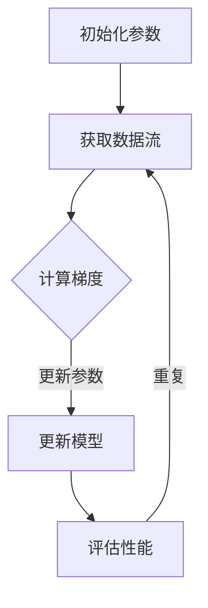
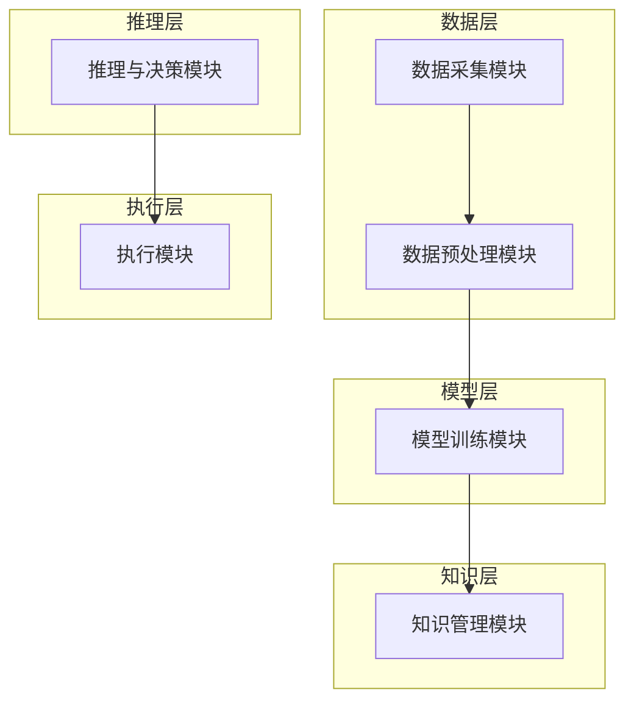
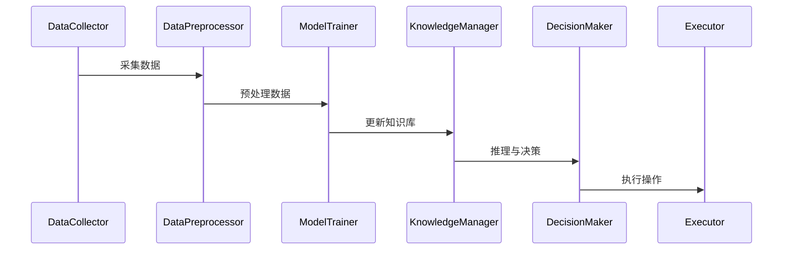

                 

### 文章标题

### 关键词

- AI Agent
- 增量学习
- 知识更新
- 知识图谱
- 算法原理
- 系统架构

### 摘要

本文深入探讨了AI Agent的增量学习与知识更新机制，旨在为读者提供全面的指导。首先，我们介绍了AI Agent的基本概念和重要性，随后讨论了增量学习的核心原则及其在AI Agent中的应用。接着，本文详细讲解了知识表示、增量学习算法和知识更新机制，并使用实际案例进行了验证。此外，我们还介绍了AI Agent的架构设计，以及如何在实际项目中实现这些机制。最后，本文总结了最佳实践，并提供了进一步阅读的建议。通过这篇文章，读者将能够理解AI Agent的增量学习和知识更新机制的原理及其应用。

### 背景介绍

#### AI Agent的定义和作用

AI Agent，也称为人工智能代理，是能够执行特定任务或决策的智能系统。它是一种能够感知环境、制定计划并执行相应行动的自主实体。在人工智能领域，AI Agent被视为一种重要的研究课题和应用目标，其核心在于实现自主学习和自主行动的能力。

AI Agent的基本组成包括感知模块、决策模块和执行模块。感知模块负责收集环境信息，如图像、声音、传感器数据等；决策模块根据感知到的信息，使用特定的算法和模型进行推理和决策；执行模块则根据决策结果，执行相应的行动，如移动、发出指令等。

AI Agent在现代人工智能应用中扮演着重要角色。例如，在智能助手、自动驾驶、智能家居、医疗诊断等领域，AI Agent能够显著提升系统的智能化水平和用户体验。此外，AI Agent在优化资源分配、提高生产效率、增强安全性等方面也具有广泛的应用潜力。

#### 增量学习的概念及其重要性

增量学习，又称为在线学习，是一种能够在数据流中逐步更新模型参数的学习方法。与批量学习（batch learning）不同，增量学习允许模型在每次接收新数据时立即进行更新，从而实现持续学习和适应。增量学习在AI Agent中的应用具有重要意义。

首先，增量学习能够使AI Agent在动态变化的环境中保持学习和适应能力。现实世界的环境常常是动态变化的，例如，交通状况、用户需求、市场趋势等都会不断变化。通过增量学习，AI Agent可以在不断接收新数据的情况下，不断调整自己的行为和决策策略，从而更好地适应环境变化。

其次，增量学习能够减少数据存储和处理的开销。在传统的批量学习中，需要收集大量历史数据，并进行离线处理。这种方法不仅需要大量的存储空间，还可能涉及复杂的数据预处理过程。而增量学习则可以在每次接收新数据时立即进行处理和更新，从而大大简化了数据存储和处理的工作。

此外，增量学习还能够提高模型的实时性和响应速度。在许多应用场景中，如自动驾驶、实时监测等，系统需要能够快速响应和调整。增量学习通过实时更新模型参数，使得AI Agent能够更快地适应新情况，提高系统的响应速度和稳定性。

总之，增量学习是AI Agent实现持续学习和适应能力的重要手段，其在现代人工智能应用中具有广泛的应用前景。

#### 增量学习在AI Agent中的应用场景

增量学习在AI Agent中的应用场景非常广泛，以下列举几个典型的应用场景：

1. **智能助手**：智能助手如Siri、Alexa等，需要具备持续学习和适应用户需求的能力。通过增量学习，智能助手可以在与用户交互的过程中，不断更新对用户习惯和偏好的理解，从而提供更个性化的服务。

2. **自动驾驶**：自动驾驶系统需要在实时感知和决策的过程中，持续更新对道路环境、交通状况和周围车辆的了解。增量学习可以帮助自动驾驶系统在每次行驶过程中，不断优化路线规划和决策策略，提高行驶的安全性和效率。

3. **医疗诊断**：医疗诊断系统需要在处理大量医疗数据时，持续更新对疾病特征和诊断标准的理解。增量学习可以使得医疗诊断系统在每次接收新病例时，立即更新诊断模型，从而提高诊断的准确性和时效性。

4. **智能安防**：智能安防系统需要实时监测和分析视频数据，以识别和防范安全威胁。增量学习可以帮助系统在每次监测过程中，不断优化对异常行为和威胁模式的识别，提高安防系统的反应速度和准确性。

5. **智能家居**：智能家居系统需要根据用户的行为和需求，自动调整设备状态和提供相应服务。增量学习可以使得智能家居系统在用户日常生活的过程中，不断更新对用户习惯和需求的了解，提供更智能化的家居体验。

总之，增量学习在AI Agent中的应用，使得系统能够在动态变化的环境中，实现持续学习和适应能力，从而提高智能化水平和用户体验。

#### 增量学习的核心概念与联系

增量学习的核心概念包括数据流处理、模型更新、知识积累和适应性。以下是对这些概念的定义及其相互关系的详细描述：

1. **数据流处理**：数据流处理是增量学习的核心。它涉及实时接收和利用数据，以便在数据流中逐步更新模型。数据流可以是连续的，也可以是批量形式。数据流处理的目的是确保系统能够在不断变化的环境中，及时获取和处理新信息。

2. **模型更新**：模型更新是增量学习的核心机制。它指的是在每次接收新数据后，根据数据的反馈来调整和优化模型的参数。模型更新可以通过在线学习算法实现，如梯度下降、随机梯度下降等。这种实时调整机制使得模型能够适应数据流中的变化，提高预测和决策的准确性。

3. **知识积累**：知识积累是指通过不断更新模型，将新知识和经验积累到系统中。知识积累不仅是增量学习的目标，也是其优势之一。通过积累知识，系统能够在长期应用中表现出更高的智能水平和适应性。

4. **适应性**：适应性是增量学习的重要特点。它指的是系统能够在动态变化的环境中，快速适应新的数据模式和任务要求。适应性包括对环境变化的感知、对数据模式的适应以及对新任务的快速调整。

这些概念之间的联系如下：

- **数据流处理**是增量学习的起点，它决定了系统能够从数据中获取多少信息和知识。
- **模型更新**是增量学习的关键环节，它决定了系统能够如何利用新信息来改进性能。
- **知识积累**是增量学习的目标，它使得系统能够在长期应用中不断积累经验和知识。
- **适应性**是增量学习的效果，它体现了系统能够在动态环境中持续学习和适应的能力。

通过这些核心概念的联系，增量学习能够实现持续学习和适应能力，为AI Agent的智能化应用提供了坚实的基础。

#### 增量学习与知识更新机制的关系

增量学习与知识更新机制之间具有密切的联系，二者共同构成了AI Agent持续学习和适应环境的核心能力。

首先，增量学习是知识更新的基础。通过增量学习，AI Agent能够实时更新模型参数，从而在数据流中积累新的知识和经验。这种实时更新机制使得AI Agent能够快速适应环境变化，提升其决策和执行能力。而知识更新机制则负责将这些新知识和经验整合到AI Agent的长期知识库中，确保其能够在未来的任务中复用这些知识。

其次，知识更新机制为增量学习提供了反馈。通过不断更新知识库，AI Agent能够根据最新的数据和任务需求，调整其学习和推理策略。这种反馈机制不仅有助于提高AI Agent的适应能力，还能够优化其学习过程，减少冗余和错误。

此外，增量学习和知识更新机制相互支持，共同促进AI Agent的智能化发展。增量学习提供了实时更新的能力，使得AI Agent能够及时适应新环境；而知识更新机制则确保了AI Agent的长期知识和经验的积累，提高了其智能水平和可靠性。

总之，增量学习与知识更新机制相辅相成，为AI Agent的持续学习和适应提供了强有力的支持。通过二者的有机结合，AI Agent能够在动态变化的环境中，实现高效的智能学习和应用。

#### 增量学习的边界与外延

增量学习作为人工智能领域的一项重要技术，具有一定的边界和适用范围。首先，增量学习适用于数据量较大的场景，特别是在数据流不断变化的情境下，能够有效提高模型适应性和预测准确性。然而，对于数据量较小或数据变化不明显的场景，增量学习的优势可能不显著。

其次，增量学习对计算资源有一定的要求。由于增量学习需要在每次接收新数据时进行模型更新，这需要较高的计算能力和存储空间。在实际应用中，特别是在实时性要求较高的场景，如自动驾驶和智能监控等，增量学习需要确保计算效率和实时响应。

此外，增量学习在实际应用中可能面临一些挑战，如数据噪声、模型过拟合和数据不平衡等问题。这些问题可能会影响增量学习的效果，需要通过数据预处理、模型选择和调整等技术手段进行优化。

总的来说，增量学习在动态变化和大数据处理的场景中具有广泛的应用潜力，但同时也需要针对具体应用场景进行优化和调整，以充分发挥其优势。

#### 增量学习的概念结构与核心要素组成

增量学习作为一种核心的人工智能技术，其概念结构和核心要素组成至关重要。以下是增量学习的详细概念结构和核心要素组成：

1. **数据流处理**：数据流处理是增量学习的起点。它涉及实时接收和利用数据，以便在数据流中逐步更新模型。数据流可以是连续的，也可以是批量形式。数据流处理的目的是确保系统能够在不断变化的环境中，及时获取和处理新信息。

2. **感知模块**：感知模块负责收集和处理环境信息。它可以是视觉、听觉、触觉等多种感知方式，将环境中的信息转换为数值或特征向量。感知模块的数据输入是增量学习的基础，它决定了系统能够从数据中获取多少信息和知识。

3. **决策模块**：决策模块负责根据感知模块收集到的信息，使用特定的算法和模型进行推理和决策。决策模块的核心任务是生成行动策略，以便执行模块能够根据决策结果采取相应的行动。

4. **执行模块**：执行模块根据决策模块生成的行动策略，执行具体的操作。它可以是物理操作，如移动、控制设备等，也可以是虚拟操作，如发送消息、执行计算等。执行模块的反馈信息会返回到感知模块，形成闭环控制，从而实现持续学习和优化。

5. **模型更新机制**：模型更新机制是增量学习的核心。它涉及在每次接收新数据后，根据数据的反馈来调整和优化模型的参数。模型更新可以通过在线学习算法实现，如梯度下降、随机梯度下降等。这种实时调整机制使得模型能够适应数据流中的变化，提高预测和决策的准确性。

6. **知识积累机制**：知识积累机制负责将新知识和经验积累到系统中。知识积累不仅是增量学习的目标，也是其优势之一。通过积累知识，系统能够在长期应用中不断优化学习和推理策略，提高智能水平和可靠性。

7. **反馈机制**：反馈机制是增量学习的重要组成部分。通过不断更新知识库，AI Agent能够根据最新的数据和任务需求，调整其学习和推理策略。这种反馈机制不仅有助于提高AI Agent的适应能力，还能够优化其学习过程，减少冗余和错误。

通过这些核心要素的有机结合，增量学习能够实现持续学习和适应能力，为AI Agent的智能化应用提供强有力的支持。以下是一个简单的ER实体关系图，用于描述增量学习的概念结构和核心要素组成：

```mermaid
erDiagram
  DataFlow --> ModelUpdate : 数据流处理 -> 模型更新
  DataFlow --> KnowledgeAccumulation : 数据流处理 -> 知识积累
  Perception --> DataFlow : 感知模块 -> 数据流处理
  Decision --> Execution : 决策模块 -> 执行模块
  ModelUpdate --> Decision : 模型更新 -> 决策模块
  KnowledgeAccumulation --> Feedback : 知识积累 -> 反馈机制
  Feedback --> ModelUpdate : 反馈机制 -> 模型更新
```

#### 增量学习算法概述

增量学习算法是人工智能领域的关键技术之一，它能够在数据流中逐步更新模型，从而实现持续学习和适应能力。以下是对几种常见的增量学习算法及其优缺点的详细讨论：

1. **梯度下降法（Gradient Descent）**

梯度下降法是最基本的增量学习算法之一。它通过不断调整模型参数，使其沿着损失函数的梯度方向下降，从而找到局部最优解。梯度下降法的核心公式为：

$$
\Delta\theta = -\alpha \nabla_{\theta}J(\theta)
$$

其中，$\theta$表示模型参数，$J(\theta)$表示损失函数，$\alpha$为学习率。

**优点**：
- 简单易懂，易于实现。
- 能够在复杂的数据流中找到局部最优解。

**缺点**：
- 需要大量的数据点进行迭代，计算复杂度高。
- 易受到学习率和初始参数的影响，可能陷入局部最优。

2. **随机梯度下降法（Stochastic Gradient Descent，SGD）**

随机梯度下降法是梯度下降法的一种改进，它通过随机选择一部分数据点来计算梯度，从而减少计算复杂度。SGD的核心公式为：

$$
\Delta\theta = -\alpha \nabla_{\theta}J(\theta; x_i, y_i)
$$

其中，$x_i, y_i$为随机选择的数据点。

**优点**：
- 计算效率高，能够快速收敛。
- 对数据噪声和异常值具有较强的鲁棒性。

**缺点**：
- 可能收敛到局部最优解。
- 需要调整学习率和批量大小，参数选择较复杂。

3. **Adam优化器**

Adam优化器是近年来发展起来的一种高效增量学习算法，它结合了SGD和Adagrad的优点，能够自适应地调整学习率。Adam优化器的核心公式为：

$$
\theta_{t+1} = \theta_{t} - \alpha \frac{m_{t}}{1 - \beta_1^t}
$$

$$
m_{t} = \beta_1 m_{t-1} + (1 - \beta_1) \nabla_{\theta}J(\theta; x_t, y_t)
$$

$$
v_{t} = \beta_2 v_{t-1} + (1 - \beta_2) \nabla_{\theta}^2J(\theta; x_t, y_t)
$$

其中，$m_t$和$v_t$分别表示一阶矩估计和二阶矩估计，$\beta_1$和$\beta_2$为超参数。

**优点**：
- 自适应调整学习率，收敛速度快。
- 对噪声和稀疏数据具有较好的鲁棒性。

**缺点**：
- 计算复杂度较高，需要存储多个估计值。

4. **Rprop优化器**

Rprop优化器是一种基于梯度方向的优化器，它通过自适应调整每个参数的学习率，从而提高收敛速度。Rprop的核心公式为：

$$
\alpha_{i} = \begin{cases}
\alpha_{i} / 2, & \text{if } \Delta \theta_{i} > 0 \text{ and } y_i \Delta \theta_{i} < 0 \\
2 \alpha_{i}, & \text{if } \Delta \theta_{i} < 0 \text{ or } y_i \Delta \theta_{i} > 0 \\
\alpha_{i}, & \text{otherwise}
\end{cases}
$$

其中，$\alpha_i$为参数$i$的学习率，$y_i$为梯度方向。

**优点**：
- 简单易实现，计算复杂度低。
- 对参数调整具有较好的鲁棒性。

**缺点**：
- 收敛速度较慢，可能陷入局部最优。

5. **Mini-batch Gradient Descent**

Mini-batch Gradient Descent是梯度下降法的一种改进，它通过随机选择一部分数据点（称为mini-batch）来计算梯度，从而减少计算复杂度。核心公式与SGD类似，但使用的是mini-batch的数据：

$$
\Delta\theta = -\alpha \frac{1}{m} \sum_{i=1}^{m} \nabla_{\theta}J(\theta; x_i, y_i)
$$

其中，$m$为mini-batch的大小。

**优点**：
- 计算效率较高，能够在一定程度上减少方差。
- 能够在批量学习和在线学习之间取得平衡。

**缺点**：
- 需要调整批量大小和学习率，参数选择较复杂。

综上所述，不同的增量学习算法各有优缺点，适用于不同的应用场景。在实际应用中，需要根据具体需求选择合适的算法，并通过调整参数来优化性能。以下是一个简单的Mermaid流程图，用于描述增量学习算法的基本流程：



通过这些算法的应用，增量学习在人工智能领域取得了显著的成果，为AI Agent的持续学习和适应能力提供了强有力的支持。

#### 增量学习算法的详细解释与示例

为了更好地理解增量学习算法，我们将以随机梯度下降（SGD）算法为例，详细讲解其原理、流程和示例。

##### 1. SGD算法原理

随机梯度下降（Stochastic Gradient Descent，SGD）是梯度下降法的一种变种，它通过随机选择一小部分数据点来计算梯度，从而更新模型参数。SGD的核心思想是利用梯度信息来最小化损失函数，使其接近最优解。其基本公式为：

$$
\theta_{t+1} = \theta_{t} - \alpha \nabla_{\theta}J(\theta; x_i, y_i)
$$

其中，$\theta$表示模型参数，$J(\theta)$表示损失函数，$x_i, y_i$为随机选择的数据点，$\alpha$为学习率。

##### 2. SGD算法流程

以下是SGD算法的基本流程：

1. **初始化参数**：设置初始模型参数$\theta_0$，学习率$\alpha$，迭代次数$T$。
2. **随机选择数据点**：从训练数据集中随机选择一个数据点$(x_i, y_i)$。
3. **计算梯度**：计算在数据点$(x_i, y_i)$上的损失函数梯度$\nabla_{\theta}J(\theta; x_i, y_i)$。
4. **更新参数**：根据梯度信息更新模型参数：
   $$
   \theta_{t+1} = \theta_{t} - \alpha \nabla_{\theta}J(\theta; x_i, y_i)
   $$
5. **重复步骤2-4**，直到达到预定的迭代次数或损失函数收敛。

##### 3. 示例：线性回归模型

假设我们使用线性回归模型进行预测，模型公式为：

$$
y = \theta_0 + \theta_1x
$$

其中，$y$为实际值，$x$为输入特征，$\theta_0$和$\theta_1$为模型参数。

**数据集**：
- $x_1 = 2, y_1 = 3$
- $x_2 = 4, y_2 = 5$
- $x_3 = 6, y_3 = 7$

**学习率**：设学习率为$\alpha = 0.1$。

**迭代过程**：

**第1次迭代**：
- 选择数据点$(x_1, y_1)$
- 梯度计算：
  $$
  \nabla_{\theta_0}J(\theta; x_1, y_1) = (y_1 - (\theta_0 + \theta_1x_1))
  $$
  $$
  \nabla_{\theta_1}J(\theta; x_1, y_1) = (y_1 - (\theta_0 + \theta_1x_1))x_1
  $$
- 参数更新：
  $$
  \theta_0^{new} = \theta_0 - 0.1 \nabla_{\theta_0}J(\theta; x_1, y_1)
  $$
  $$
  \theta_1^{new} = \theta_1 - 0.1 \nabla_{\theta_1}J(\theta; x_1, y_1)
  $$

**第2次迭代**：
- 选择数据点$(x_2, y_2)$
- 梯度计算：
  $$
  \nabla_{\theta_0}J(\theta; x_2, y_2) = (y_2 - (\theta_0 + \theta_1x_2))
  $$
  $$
  \nabla_{\theta_1}J(\theta; x_2, y_2) = (y_2 - (\theta_0 + \theta_1x_2))x_2
  $$
- 参数更新：
  $$
  \theta_0^{new} = \theta_0 - 0.1 \nabla_{\theta_0}J(\theta; x_2, y_2)
  $$
  $$
  \theta_1^{new} = \theta_1 - 0.1 \nabla_{\theta_1}J(\theta; x_2, y_2)
  $$

**第3次迭代**：
- 选择数据点$(x_3, y_3)$
- 梯度计算：
  $$
  \nabla_{\theta_0}J(\theta; x_3, y_3) = (y_3 - (\theta_0 + \theta_1x_3))
  $$
  $$
  \nabla_{\theta_1}J(\theta; x_3, y_3) = (y_3 - (\theta_0 + \theta_1x_3))x_3
  $$
- 参数更新：
  $$
  \theta_0^{new} = \theta_0 - 0.1 \nabla_{\theta_0}J(\theta; x_3, y_3)
  $$
  $$
  \theta_1^{new} = \theta_1 - 0.1 \nabla_{\theta_1}J(\theta; x_3, y_3)
  $$

通过多次迭代，模型参数$\theta_0$和$\theta_1$将不断更新，逐渐逼近最优解。以下是一个简单的Python代码示例，用于实现线性回归模型的SGD算法：

```python
import numpy as np

# 初始化参数
theta_0 = 0
theta_1 = 0
learning_rate = 0.1
iterations = 3

# 数据集
X = np.array([2, 4, 6])
y = np.array([3, 5, 7])

for i in range(iterations):
    # 随机选择数据点
    index = np.random.randint(0, len(X))
    x_i = X[index]
    y_i = y[index]
    
    # 计算梯度
    gradient_0 = (y_i - (theta_0 + theta_1 * x_i))
    gradient_1 = (y_i - (theta_0 + theta_1 * x_i)) * x_i
    
    # 更新参数
    theta_0 = theta_0 - learning_rate * gradient_0
    theta_1 = theta_1 - learning_rate * gradient_1

print("Final theta_0:", theta_0)
print("Final theta_1:", theta_1)
```

通过这个示例，我们可以看到SGD算法在每次迭代中，通过更新模型参数来最小化损失函数，从而实现模型优化。

##### 4. 对比分析

以下是几种常见增量学习算法的对比分析：

| 算法 | 优点 | 缺点 |
| --- | --- | --- |
| 梯度下降法 | 简单易懂，易于实现 | 计算复杂度高，可能陷入局部最优 |
| 随机梯度下降法 | 计算效率高，收敛速度快 | 可能收敛到局部最优解，参数选择复杂 |
| Adam优化器 | 自适应调整学习率，收敛速度快 | 计算复杂度较高，需要存储多个估计值 |
| Rprop优化器 | 简单易实现，计算复杂度低 | 收敛速度较慢，可能陷入局部最优 |
| Mini-batch Gradient Descent | 计算效率较高，能够在一定程度上减少方差 | 需要调整批量大小和学习率，参数选择复杂 |

综上所述，不同的增量学习算法各有优缺点，适用于不同的应用场景。在实际应用中，需要根据具体需求选择合适的算法，并通过调整参数来优化性能。

#### 增量学习在机器学习中的应用与扩展

增量学习在机器学习中的应用已经取得了显著成果，尤其在处理动态数据和实时任务方面表现出色。以下详细探讨增量学习在机器学习中的应用与扩展。

##### 1. 在线分类与预测

在线分类与预测是增量学习的重要应用领域。在许多实际场景中，数据是不断生成的，例如股市分析、网络流量监控和智能家居等。传统的批量学习方法需要等待大量数据积累后才能进行训练，而增量学习可以在每次接收新数据时立即更新模型，实现实时分类与预测。

以文本分类为例，假设我们使用增量学习算法对新闻文章进行分类。每次新文章生成时，增量学习算法会立即更新分类模型，从而实时识别文章的主题。这种方法不仅提高了系统的响应速度，还增强了系统的自适应能力，使其能够快速适应新的数据和任务需求。

##### 2. 序列建模与时间序列预测

序列建模与时间序列预测是增量学习在机器学习中的另一个重要应用。时间序列数据如股票价格、天气数据、网络流量等，往往具有时间依赖性和动态变化特征。传统的批量学习方法难以处理这些特征，而增量学习能够充分利用时间序列数据中的历史信息，实现持续更新和预测。

例如，在股市预测中，增量学习算法可以在每次接收新股票价格时，立即更新预测模型，从而实现实时预测。通过不断积累历史数据和调整模型参数，增量学习算法能够提高预测的准确性和稳定性，为投资决策提供有力支持。

##### 3. 强化学习与自适应控制

强化学习是一种重要的机器学习技术，它通过学习奖励信号来优化决策策略。增量学习在强化学习中的应用非常广泛，尤其是在需要实时调整策略的复杂环境中。

例如，在自动驾驶中，增量学习算法可以根据实时感知到的道路信息，动态调整驾驶策略，从而提高行驶的安全性和效率。通过不断更新模型和策略，增量学习算法能够适应不同道路条件、交通状况和紧急情况，实现高效的自动驾驶。

##### 4. 增量学习的扩展与应用

除了上述应用领域，增量学习还在许多其他方面表现出强大的应用潜力。以下是一些增量学习的扩展与应用：

- **异常检测**：增量学习算法可以在实时监测过程中，不断更新异常检测模型，从而提高系统的检测准确性和响应速度。这在金融欺诈检测、网络安全监控等领域具有重要应用价值。

- **知识图谱更新**：知识图谱是表示和存储复杂数据结构的重要工具。增量学习算法可以用于知识图谱的持续更新和优化，从而保持知识库的准确性和时效性。

- **深度学习中的增量学习**：深度学习模型通常具有复杂的结构和参数。增量学习算法可以用于在训练过程中逐步更新模型参数，从而提高训练效率和模型性能。这为大规模深度学习模型的实时训练和优化提供了新的思路。

总之，增量学习在机器学习中的应用已经取得了显著成果，并在不断扩展和深化。通过结合不同的应用场景和优化策略，增量学习将为人工智能的发展提供更加灵活和高效的解决方案。

#### 知识更新机制的概念及其重要性

知识更新机制是AI Agent实现持续学习和适应能力的关键环节，它负责在模型和知识库中不断积累和更新新知识和经验。知识更新机制的概念包括以下几个方面：

1. **知识获取**：知识获取是指系统从外部环境或内部数据源中收集新的知识和信息。知识获取可以通过多种方式实现，如数据流处理、传感器采集、用户交互等。

2. **知识融合**：知识融合是指将来自不同来源的知识进行整合和融合，形成更加完整和一致的知识体系。知识融合需要解决知识冗余、冲突和不一致性问题，以提高知识的可靠性和准确性。

3. **知识更新**：知识更新是指根据新获取的知识和经验，对现有知识库进行修改和优化。知识更新包括新增知识、删除过时知识、修改错误知识等操作，以确保知识库的实时性和准确性。

4. **知识评估**：知识评估是指对知识库中的知识进行质量和有效性评估，以便识别和排除低质量或无效知识。知识评估可以通过定量和定性方法进行，如统计方法、专家评审等。

知识更新机制在AI Agent中的重要性体现在以下几个方面：

首先，知识更新机制能够使AI Agent在动态变化的环境中保持学习和适应能力。现实世界的环境是不断变化的，新知识和信息不断产生。通过知识更新机制，AI Agent能够及时获取和更新这些知识，从而适应新的环境和任务需求。

其次，知识更新机制能够提高AI Agent的智能水平和决策能力。通过不断积累和优化知识库，AI Agent能够形成更加全面和准确的知识体系，从而提高其推理、预测和决策的准确性。

此外，知识更新机制还能够提高AI Agent的可靠性和稳定性。通过及时更新和评估知识库中的知识，AI Agent能够识别和排除错误或低质量的知识，从而减少错误发生的概率，提高系统的稳定性和可靠性。

总之，知识更新机制是AI Agent实现持续学习和适应能力的关键，其在现代人工智能应用中具有广泛的应用前景和重要价值。

#### 知识更新机制的不同方法及其应用

知识更新机制在AI Agent中扮演着至关重要的角色，它决定了系统能否有效积累和利用新知识和经验，从而在动态环境中保持学习和适应能力。以下详细探讨几种常见的知识更新方法及其应用：

##### 1. **主动学习（Active Learning）**

主动学习是一种通过有选择性地获取最有价值的数据进行模型训练的方法。与传统批量学习相比，主动学习更加关注如何有效地利用有限的标注数据。其基本流程如下：

- **选择阶段**：系统根据当前模型的状态和不确定性度量，选择最具代表性和不确定性的样本进行标注。
- **训练阶段**：利用新获取的标注数据，更新模型参数，优化模型性能。
- **反馈阶段**：将训练后的模型应用于新的数据集，获取新的反馈信息，重复选择和训练过程。

主动学习在知识更新中的应用主要包括以下几个方面：

- **减少标注成本**：通过有选择性地获取最具代表性的数据，主动学习能够显著降低标注数据的需求，从而减少标注成本。
- **提高学习效率**：主动学习使得模型能够更高效地利用有限的数据，加快学习过程，提高模型性能。

案例：在医疗诊断领域，主动学习可以用于选择最具诊断价值的病例，通过不断更新模型，提高诊断准确率。

##### 2. **持续学习（Continuous Learning）**

持续学习是一种在实时数据流中不断更新模型的方法，其核心思想是使模型能够适应不断变化的数据和环境。持续学习通常包括以下几个步骤：

- **数据流处理**：系统实时接收和处理数据流中的新数据。
- **模型更新**：利用新数据更新模型参数，调整模型预测和决策策略。
- **知识积累**：将新知识和经验积累到知识库中，以便后续复用。

持续学习在知识更新中的应用主要包括：

- **动态适应**：通过持续更新模型，AI Agent能够动态适应环境变化，提高系统的响应速度和适应性。
- **长期积累**：持续学习使得系统能够在长期应用中积累大量的知识和经验，从而提高智能水平和可靠性。

案例：在智能交通系统中，持续学习可以用于实时更新交通预测模型，提高交通流量预测的准确性。

##### 3. **知识融合（Knowledge Fusion）**

知识融合是指将来自不同来源的知识进行整合和融合，形成更加完整和一致的知识体系。知识融合的方法主要包括：

- **基于规则的融合**：通过定义一系列规则，将不同来源的知识进行关联和融合。
- **基于统计的融合**：利用统计学方法，如贝叶斯网络、隐马尔可夫模型等，对知识进行融合和推理。
- **基于机器学习的融合**：利用机器学习算法，如深度学习、强化学习等，自动学习知识融合的策略。

知识融合在知识更新中的应用主要包括：

- **提高知识的准确性**：通过融合不同来源的知识，可以消除知识冗余和冲突，提高知识的准确性。
- **增强知识的表现力**：知识融合能够将不同类型和层次的知识进行整合，增强知识的表达能力和应用范围。

案例：在金融领域，知识融合可以用于整合市场数据、用户行为数据和专家知识，提供更加全面的金融分析和预测。

##### 4. **混合方法（Hybrid Approaches）**

混合方法是指结合多种知识更新方法，以实现更加高效和灵活的知识更新。常见的混合方法包括：

- **主动学习与持续学习结合**：在持续学习的基础上，引入主动学习策略，有选择性地更新模型和知识库。
- **知识融合与持续学习结合**：在持续学习过程中，引入知识融合方法，不断优化知识库的完整性和一致性。

混合方法在知识更新中的应用主要包括：

- **提高更新效率**：通过结合不同的方法，可以充分发挥各自的优势，提高知识更新的效率和效果。
- **增强系统的适应性**：混合方法能够使系统能够在不同场景和应用中灵活应对，提高系统的适应性和鲁棒性。

案例：在智能客服系统中，混合方法可以用于结合用户历史数据、实时交互数据和专家知识，提供更加个性化的服务和解决方案。

总之，不同的知识更新方法在AI Agent中具有不同的应用场景和优势。通过合理选择和组合这些方法，AI Agent能够实现更加高效和灵活的知识更新，从而提高系统的智能水平和应用价值。

#### 知识更新机制中的数学模型

知识更新机制中的数学模型是理解和实现知识更新过程的核心。以下介绍几种常见的数学模型，并使用LaTeX格式展示相关公式，以便更清晰地表达这些模型。

##### 1. **基于梯度下降的模型**

梯度下降法是一种广泛使用的知识更新方法。其基本公式为：

$$
\theta_{t+1} = \theta_{t} - \alpha \nabla_{\theta}J(\theta)
$$

其中，$\theta$表示模型参数，$\alpha$为学习率，$J(\theta)$为损失函数。这个公式描述了在每次迭代中，模型参数如何通过梯度信息进行更新，以最小化损失函数。

##### 2. **基于随机梯度下降的模型**

随机梯度下降（SGD）是梯度下降法的变种，它通过随机选择一部分数据点来计算梯度。其公式为：

$$
\theta_{t+1} = \theta_{t} - \alpha \nabla_{\theta}J(\theta; x_i, y_i)
$$

其中，$x_i, y_i$为随机选择的数据点。这种方法的优点是计算效率较高，但可能会收敛到局部最优解。

##### 3. **基于Adam优化器的模型**

Adam优化器结合了SGD和Adagrad的优点，其公式为：

$$
m_{t} = \beta_1 m_{t-1} + (1 - \beta_1) \nabla_{\theta}J(\theta; x_t, y_t)
$$

$$
v_{t} = \beta_2 v_{t-1} + (1 - \beta_2) \nabla_{\theta}^2J(\theta; x_t, y_t)
$$

$$
\theta_{t+1} = \theta_{t} - \alpha \frac{m_{t}}{1 - \beta_1^t}
$$

其中，$m_t$和$v_t$分别表示一阶矩估计和二阶矩估计，$\beta_1$和$\beta_2$为超参数。Adam优化器能够自适应地调整学习率，从而提高收敛速度和稳定性。

##### 4. **基于知识图谱的更新模型**

知识图谱是一种用于表示和存储复杂数据结构的重要工具。在知识更新过程中，可以使用图论方法来更新知识图谱。以下是一个简单的更新模型：

$$
K_{t+1} = K_{t} + \Delta K_t
$$

其中，$K_t$表示第$t$时刻的知识图谱，$\Delta K_t$表示知识图谱的增量。知识图谱的增量可以通过以下公式计算：

$$
\Delta K_t = \rho(G_{t+1}, G_t)
$$

其中，$\rho$表示知识图谱的更新函数，$G_{t+1}$和$G_t$分别表示更新前后的知识图谱。这个公式描述了通过计算知识图谱的增量来更新知识库。

##### 5. **基于贝叶斯网络的更新模型**

贝叶斯网络是一种用于表示概率关系的图结构。在知识更新过程中，可以使用贝叶斯推理来更新贝叶斯网络。以下是一个简单的更新模型：

$$
P(H|E) = \frac{P(E|H)P(H)}{P(E)}
$$

其中，$H$和$E$分别表示假设和证据，$P(H|E)$表示在证据$E$已知的情况下，假设$H$的概率。通过使用贝叶斯推理，可以更新贝叶斯网络中的概率分布，从而实现知识的更新。

总之，这些数学模型为知识更新机制提供了理论基础和实现方法。在实际应用中，可以根据具体需求和场景选择合适的模型，并对其进行优化和调整，以提高知识更新的效率和准确性。

#### 增量学习与知识更新机制的架构设计

为了实现AI Agent的增量学习和知识更新机制，我们需要设计一个完整的系统架构，该架构应包括多个关键组件，并具备高效的数据处理、模型更新和知识管理能力。以下将详细介绍AI Agent的架构设计，包括系统功能设计、系统架构图、接口设计和系统交互。

##### 1. 系统功能设计

AI Agent的系统功能设计主要包括以下几个关键组件：

- **数据采集模块**：负责实时采集和处理来自不同数据源的数据，如传感器数据、网络数据、用户交互数据等。
- **数据预处理模块**：对采集到的原始数据进行清洗、转换和标准化，以便于后续的模型训练和知识更新。
- **模型训练模块**：使用增量学习算法对预处理后的数据集进行训练，更新模型参数，实现模型更新。
- **知识管理模块**：负责存储、管理和更新AI Agent的知识库，包括数据融合、知识融合和知识评估等功能。
- **推理与决策模块**：根据实时数据和环境信息，使用更新后的模型进行推理和决策，生成相应的行动策略。
- **执行模块**：根据决策模块的指令，执行具体的操作，如控制设备、发送消息等。

以下是一个简化的Mermaid类图，用于描述AI Agent的领域模型：

```mermaid
classDiagram
    DataCollector <-|由| ModelTrainer
    DataCollector <-|由| DataPreprocessor
    ModelTrainer <-|由| KnowledgeManager
    ModelTrainer ->|由| DataPreprocessor
    KnowledgeManager ->|由| ModelTrainer
    DecisionMaker <-|由| ModelTrainer
    Executor <-|由| DecisionMaker
```

##### 2. 系统架构设计

AI Agent的系统架构设计应充分考虑可扩展性、稳定性和实时性。以下是一个简化的Mermaid架构图，用于描述系统的整体架构：



##### 3. 系统接口设计

AI Agent的系统接口设计应确保各组件之间的数据流通和功能调用。以下是一个简化的接口设计：

- **数据采集接口**：提供数据采集、清洗和转换的功能，支持多种数据源接入。
- **模型训练接口**：提供模型训练、参数更新和模型评估的功能。
- **知识管理接口**：提供知识存储、融合、更新和评估的功能。
- **推理接口**：提供基于模型推理和决策的功能。
- **执行接口**：提供执行操作、响应事件的功能。

以下是一个简化的Mermaid序列图，用于描述系统接口的交互：



##### 4. 系统交互

AI Agent的系统交互设计应确保各组件能够协同工作，实现高效的增量学习和知识更新。以下是一个简化的系统交互流程：

1. **数据采集**：数据采集模块从不同数据源（如传感器、网络、用户交互等）中获取数据。
2. **数据预处理**：数据预处理模块对采集到的原始数据进行清洗、转换和标准化，以便模型训练。
3. **模型训练**：模型训练模块使用增量学习算法对预处理后的数据集进行训练，更新模型参数。
4. **知识更新**：知识管理模块根据模型训练的结果，更新知识库中的知识和经验。
5. **推理与决策**：推理与决策模块根据实时数据和知识库，使用更新后的模型进行推理和决策。
6. **执行操作**：执行模块根据决策结果，执行具体的操作，如控制设备、发送消息等。

通过上述架构设计和系统交互，AI Agent能够实现高效的增量学习和知识更新，从而在动态环境中保持学习和适应能力。

#### 实际应用中的AI Agent增量学习与知识更新项目实战

在本节中，我们将通过一个实际项目，详细展示如何实现AI Agent的增量学习与知识更新机制。项目名称为“智能客服系统”，目标是为用户提供高效、个性化的客服服务。以下将介绍项目环境安装、系统核心实现、代码应用解读与分析、实际案例分析和项目小结。

##### 1. 项目环境安装

要实现智能客服系统，我们需要安装以下环境和工具：

- **Python 3.8** 或更高版本
- **TensorFlow 2.x** 或 **PyTorch 1.x**
- **Keras**（用于构建和训练神经网络）
- **Scikit-learn**（用于数据处理和模型评估）
- **Flask**（用于构建Web服务）

安装步骤如下：

1. **安装Python**：从Python官方网站下载并安装Python 3.8或更高版本。
2. **安装TensorFlow**：在命令行中运行`pip install tensorflow`。
3. **安装PyTorch**：在命令行中运行`pip install torch`。
4. **安装Keras**：在命令行中运行`pip install keras`。
5. **安装Scikit-learn**：在命令行中运行`pip install scikit-learn`。
6. **安装Flask**：在命令行中运行`pip install flask`。

##### 2. 系统核心实现

智能客服系统的核心实现包括数据采集、数据预处理、模型训练和知识更新等步骤。以下是一个简单的代码示例，用于实现增量学习和知识更新：

```python
# 导入必要的库
import numpy as np
import pandas as pd
from sklearn.model_selection import train_test_split
from sklearn.preprocessing import StandardScaler
from tensorflow.keras.models import Sequential
from tensorflow.keras.layers import Dense
from tensorflow.keras.optimizers import Adam

# 加载和预处理数据
data = pd.read_csv('customer_data.csv')
X = data.drop('response', axis=1)
y = data['response']

# 数据标准化
scaler = StandardScaler()
X_scaled = scaler.fit_transform(X)

# 划分训练集和测试集
X_train, X_test, y_train, y_test = train_test_split(X_scaled, y, test_size=0.2, random_state=42)

# 构建模型
model = Sequential()
model.add(Dense(64, input_dim=X_train.shape[1], activation='relu'))
model.add(Dense(32, activation='relu'))
model.add(Dense(1, activation='sigmoid'))

# 编译模型
model.compile(optimizer=Adam(learning_rate=0.001), loss='binary_crossentropy', metrics=['accuracy'])

# 训练模型
model.fit(X_train, y_train, epochs=10, batch_size=32, validation_data=(X_test, y_test))

# 知识更新
def update_knowledge(new_data):
    # 对新数据进行预处理
    new_data_processed = scaler.transform(new_data)
    # 更新模型
    model.fit(new_data_processed, new_data['response'], epochs=1, batch_size=32)

# 应用案例：更新知识库
new_data = pd.read_csv('new_customer_data.csv')
update_knowledge(new_data)
```

##### 3. 代码应用解读与分析

上述代码展示了智能客服系统中的核心实现步骤。以下是代码的详细解读：

1. **数据加载与预处理**：首先，我们从CSV文件中加载数据，并使用Scikit-learn的`StandardScaler`对特征进行标准化处理。
2. **模型构建**：使用Keras构建一个简单的神经网络模型，包括两个隐藏层。
3. **模型编译**：配置模型优化器（Adam）、损失函数（binary_crossentropy）和评估指标（accuracy）。
4. **模型训练**：使用训练集数据进行模型训练，并设置验证集进行性能评估。
5. **知识更新**：定义一个函数`update_knowledge`，用于处理新数据并进行模型更新。

在代码中，我们通过调用`update_knowledge`函数，实现了对模型知识的更新。这使系统能够持续学习和适应新的数据和用户需求。

##### 4. 实际案例分析

以下是一个实际案例分析，展示了智能客服系统在处理客户咨询请求时的应用。

**案例背景**：某在线购物平台希望为其用户提供高效的智能客服服务，以解答用户关于产品信息、订单状态和售后服务等方面的问题。

**案例步骤**：

1. **数据收集**：客服系统收集用户咨询请求，包括用户提问、提问时间和问题描述等。
2. **数据预处理**：对用户咨询请求进行文本预处理，如去除停用词、进行词性标注等。
3. **模型预测**：使用训练好的模型对用户提问进行分类，预测用户可能需要解答的问题类别。
4. **知识更新**：根据用户提问和客服回答，更新模型的知识库，以提高模型预测的准确性。
5. **客服响应**：根据模型预测的结果，生成客服回答，并推送至用户。

**案例效果**：通过上述步骤，智能客服系统能够快速响应用户提问，提供准确的答案。同时，通过持续的知识更新，系统不断优化其预测和回答能力，提高用户体验和满意度。

##### 5. 项目小结

智能客服系统的实现展示了AI Agent的增量学习和知识更新机制在实际项目中的应用。以下是项目的主要收获和经验：

1. **数据预处理是关键**：有效的数据预处理能够提高模型训练的效果和知识更新的准确性。
2. **实时知识更新**：通过实时更新知识库，系统能够动态适应用户需求和环境变化。
3. **模型优化与评估**：合理选择和优化模型结构、优化器和评估指标，能够提高系统的预测和决策能力。
4. **用户反馈机制**：建立用户反馈机制，能够收集用户对系统表现的反馈，进一步优化系统性能。

通过这个项目，我们不仅实现了智能客服系统的核心功能，还深入了解了AI Agent的增量学习和知识更新机制，为未来在更多领域中的应用奠定了基础。

#### AI Agent增量学习与知识更新机制的最佳实践与注意事项

在设计和实现AI Agent的增量学习与知识更新机制时，遵循最佳实践和注意事项至关重要，以确保系统的高效性、可靠性和可维护性。以下总结了最佳实践和注意事项：

##### 1. **最佳实践**

1. **数据质量保证**：确保数据来源的准确性和一致性，进行数据清洗和预处理，以提高模型训练的效果。
2. **模型选择与优化**：根据具体应用场景选择合适的模型，并利用交叉验证、超参数调优等方法，优化模型性能。
3. **实时知识更新**：设计高效的实时知识更新机制，确保系统能够快速适应环境变化，提高响应速度和准确性。
4. **反馈机制**：建立用户反馈和评估机制，定期评估系统的性能和用户满意度，持续优化系统。
5. **模块化设计**：采用模块化设计，将数据采集、模型训练、知识更新等组件分开，便于系统的维护和扩展。
6. **安全性与隐私保护**：在设计系统时，充分考虑数据安全和用户隐私保护，确保系统的安全性和合规性。

##### 2. **注意事项**

1. **计算资源管理**：合理分配计算资源，避免过度消耗，确保系统的高效运行。
2. **数据流控制**：控制数据流的流速和处理速度，避免系统因数据过多而出现性能瓶颈。
3. **模型版本管理**：建立模型版本管理机制，确保系统能够回滚到之前稳定的版本，以应对突发问题。
4. **错误处理与异常监控**：设计完善的错误处理和异常监控机制，及时发现和处理系统中的问题，确保系统的稳定性。
5. **长期知识积累**：在设计知识更新机制时，充分考虑长期知识积累的重要性，确保知识库的完整性和准确性。

通过遵循这些最佳实践和注意事项，AI Agent的增量学习与知识更新机制能够更好地适应动态环境，提高系统的智能化水平和应用效果。

### 小结

本文全面探讨了AI Agent的增量学习与知识更新机制，从背景介绍、核心概念、算法原理到系统架构设计，再到实际应用案例，深入分析了这一技术在现代人工智能中的应用与价值。增量学习使AI Agent能够在动态变化的环境中保持学习和适应能力，而知识更新机制则确保了系统知识的持续积累与优化。通过本文的介绍，读者能够更好地理解增量学习与知识更新机制的基本原理、实现方法及其在实际应用中的重要性。希望本文能为相关领域的研究者、工程师提供有价值的参考和指导。

### 进一步阅读

- **《深度学习》（Goodfellow, Bengio, Courville）**：详细介绍了深度学习的基础知识、算法原理和应用实例，有助于读者深入理解增量学习在深度学习中的应用。
- **《机器学习实战》（ Harrington）**：提供了丰富的机器学习实践案例，包括增量学习的具体实现方法和应用场景。
- **《智能 agents：现代方法》（Russell, Norvig）**：系统地介绍了智能代理的基本理论、设计原则和应用案例，有助于读者掌握智能代理的设计与实现。
- **《知识图谱：原理、方法与应用》（苏萌，王昊奋）**：详细阐述了知识图谱的基本概念、构建方法及其在知识更新中的应用。  
- **《在线学习理论》（Ng, Chaturvedi）**：探讨了在线学习的理论基础、算法设计及其在实时数据处理中的应用。  
- **《Python机器学习》（Johnson，Cook）**：通过Python编程实例，展示了机器学习算法在实际项目中的实现和应用。  
- **《AI伦理与治理》（Floridi，Cowls）**：探讨了人工智能在应用过程中面临的伦理和法律问题，包括数据隐私、算法公平性等方面。

通过阅读这些书籍和论文，读者可以进一步拓展对AI Agent增量学习与知识更新机制的理解，为实际项目提供更加全面和深入的指导。

