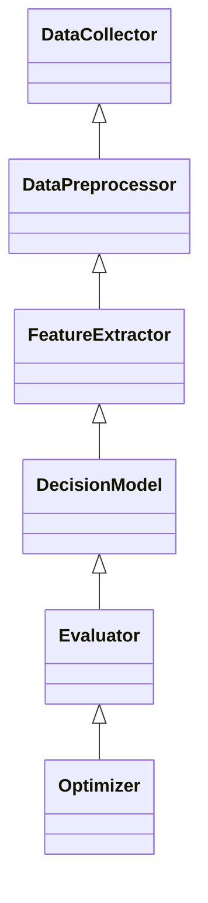
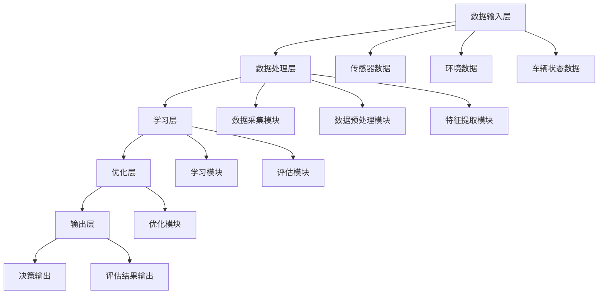
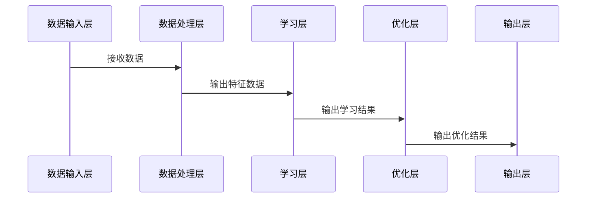

                 

# AI Agent的增量式终身学习框架

关键词：AI Agent、增量式学习、终身学习、知识迁移、学习模块、评估模块、优化模块

摘要：本文旨在探讨AI Agent的增量式终身学习框架，包括其背景介绍、核心概念及其相互联系。文章首先阐述了AI Agent在动态环境中的适应性学习问题，并引入增量式终身学习框架的概念。随后，本文详细分析了增量式学习的原理与特点，终身学习的概念与优势，以及知识迁移的方法与策略。最后，本文提出了一个具体的增量式终身学习框架的实现方法，包括数据输入、学习模块、评估模块和优化模块等核心要素，并对框架进行了系统分析与架构设计。

## 第一部分：背景介绍与核心概念

### 第1章：问题背景与核心概念

#### 1.1.1 问题背景

随着人工智能技术的不断发展，AI Agent在各个领域的应用越来越广泛。然而，传统的AI Agent在面对不断变化的环境时，往往难以适应和持续学习。这种适应性学习问题主要表现在以下几个方面：

1. **动态环境变化**：在实际应用中，环境状态和数据分布可能随着时间不断变化，这使得传统的静态学习模型难以适应。

2. **知识老化**：随着时间的推移，AI Agent原有的知识可能逐渐失去准确性，导致其性能下降。

3. **资源限制**：重新训练整个模型可能需要大量的计算资源和时间，这在某些实时应用场景中是不可接受的。

为了解决这些问题，研究者们提出了增量式终身学习框架，以实现AI Agent在动态环境中的持续学习。

#### 1.1.2 核心概念

**增量式终身学习框架**：一种能够使AI Agent在动态环境中持续学习的框架。该框架主要通过以下几个核心概念实现：

- **增量式学习**：只在已有知识的基础上进行微调，而非从头开始学习，从而提高学习效率。

- **终身学习**：使AI Agent在整个生命周期中不断学习，适应环境变化。

- **知识迁移**：将已有知识应用到新环境中，以降低新知识的学习成本。

- **持续评估与优化**：通过不断评估AI Agent的学习效果，对其进行优化，以提高其适应能力。

#### 1.1.3 框架的边界与外延

**边界**：

- 适用范围：主要针对AI Agent在动态环境中的适应性学习。

- 面向对象：各类AI Agent，如智能机器人、自动驾驶车辆等。

- 技术层面：主要涉及机器学习、深度学习等技术。

**外延**：

- 框架的可扩展性：可以通过集成不同的学习算法和优化策略，适应不同领域的应用需求。

- 框架的跨领域应用：在各个领域，如金融、医疗、教育等，都可以发挥重要作用。

#### 1.1.4 框架的核心要素组成

- **数据输入**：收集并处理来自环境的数据，作为AI Agent学习的输入。

- **学习模块**：实现AI Agent的增量式学习和终身学习功能。

- **评估模块**：对AI Agent的学习效果进行评估，以指导优化。

- **优化模块**：根据评估结果，调整AI Agent的学习策略和参数。

#### 1.1.5 本章小结

本章介绍了AI Agent的增量式终身学习框架的背景、核心概念、边界与外延以及核心要素组成。接下来，我们将进一步探讨该框架的具体实现方法和技术细节。

----------------------------------------------------------------

## 第二部分：核心概念与联系

### 第2章：核心概念与联系

#### 2.1.1 增量式学习的原理与特点

**增量式学习**（Incremental Learning），也称为在线学习（Online Learning），是一种仅使用新样本更新模型参数的学习方法。其特点如下：

- **动态更新**：随着新样本的加入，模型参数实时更新，以适应新的数据分布。

- **高效性**：避免了重新训练整个模型，减少了计算资源的需求。

- **适用范围广**：适用于动态变化的环境和实时应用场景。

**增量式学习的原理**：

1. 初始化模型参数。

2. 收集新的样本数据。

3. 利用新样本数据更新模型参数。

4. 重复步骤2和3，直至达到预定的学习目标或停止条件。

**增量式学习的优点与挑战**：

**优点**：

- **高效性**：避免了重新训练整个模型，减少了计算资源的需求。

- **适应性**：能够快速适应新的数据分布。

- **实时性**：适用于动态变化的环境和实时应用场景。

**挑战**：

- **模型稳定**：在增量式学习中，模型参数的更新可能会导致模型的稳定性问题。

- **数据分布**：当数据分布发生较大变化时，增量式学习可能无法适应。

#### 2.1.2 终身学习的概念与优势

**终身学习**（Lifelong Learning），是指AI Agent在整个生命周期中不断学习，以适应环境变化。其核心目标是使AI Agent具备持续学习的能力，从而在动态环境中保持高水平的性能。

**终身学习的概念**：

- **学习周期**：AI Agent在一个完整的学习过程中，包括训练、评估和优化等阶段。

- **学习迁移**：将已有知识应用到新环境中，以降低新知识的学习成本。

- **持续评估**：通过不断评估AI Agent的学习效果，指导优化过程。

**终身学习的优势**：

- **适应性**：使AI Agent能够应对动态变化的环境。

- **知识积累**：随着学习周期的进行，AI Agent的知识库不断积累，提高其整体性能。

- **抗干扰性**：通过不断学习和优化，AI Agent能够抵抗外界干扰，保持稳定的表现。

#### 2.1.3 知识迁移的方法与策略

**知识迁移**（Knowledge Transfer）是指将已有知识应用到新环境中，以降低新知识的学习成本。知识迁移的方法与策略主要包括以下几个方面：

1. **域自适应**（Domain Adaptation）：通过减少源域和目标域之间的差异，实现知识的迁移。常见的方法包括模型对齐（Model Alignment）和特征对齐（Feature Alignment）。

2. **元学习**（Meta-Learning）：通过学习学习策略，使AI Agent能够快速适应新环境。元学习的方法包括模型更新（Model Update）和策略更新（Policy Update）。

3. **迁移学习**（Transfer Learning）：将已有知识直接迁移到新环境中，以减少新知识的学习成本。迁移学习的方法包括模型迁移（Model Transfer）和参数迁移（Parameter Transfer）。

#### 2.1.4 增量式终身学习框架的联系与整合

增量式终身学习框架将增量式学习、终身学习和知识迁移等核心概念有机整合，实现AI Agent在动态环境中的持续学习。具体而言，该框架通过以下几个方面实现各概念的联动：

1. **数据输入**：收集来自环境的动态数据，作为增量式学习和终身学习的输入。

2. **学习模块**：利用增量式学习和终身学习策略，不断更新AI Agent的模型参数和知识库。

3. **评估模块**：通过持续评估AI Agent的学习效果，指导优化过程。

4. **优化模块**：根据评估结果，调整AI Agent的学习策略和参数，以提高其适应能力。

#### 2.1.5 本章小结

本章详细分析了AI Agent的增量式终身学习框架中的核心概念，包括增量式学习、终身学习和知识迁移。通过整合这些核心概念，增量式终身学习框架能够实现AI Agent在动态环境中的持续学习。接下来，我们将进一步探讨该框架的具体实现方法和技术细节。

----------------------------------------------------------------

## 第三部分：实现方法与技术细节

### 第3章：增量式终身学习框架的实现方法

#### 3.1.1 数据输入

数据输入是增量式终身学习框架的基础，它决定了AI Agent的学习效果。数据输入模块的主要任务是收集和处理来自环境的动态数据，具体步骤如下：

1. **数据采集**：从传感器、网络或其他数据源收集实时数据。

2. **数据预处理**：对采集到的数据进行清洗、归一化和特征提取等预处理操作。

3. **数据存储**：将预处理后的数据存储到数据湖或数据库中，以便后续学习和评估。

#### 3.1.2 学习模块

学习模块是增量式终身学习框架的核心，它负责实现AI Agent的增量式学习和终身学习。具体实现方法如下：

1. **模型初始化**：初始化AI Agent的模型参数，通常采用预训练模型或随机初始化。

2. **增量式学习**：利用新样本数据，通过梯度下降或其他优化算法，实时更新模型参数。

3. **终身学习**：在模型初始化后，定期进行重新训练，以保持模型的准确性和鲁棒性。

4. **知识积累**：将学习过程中获得的知识和经验存储到知识库中，以供后续使用。

#### 3.1.3 评估模块

评估模块负责对AI Agent的学习效果进行评估，以指导优化过程。评估方法主要包括：

1. **指标计算**：根据评估指标，如准确率、召回率、F1值等，计算AI Agent的学习效果。

2. **模型比较**：将当前模型与历史模型进行比较，以评估模型的稳定性和准确性。

3. **学习效果可视化**：通过图表和曲线，直观展示AI Agent的学习过程和学习效果。

#### 3.1.4 优化模块

优化模块根据评估结果，调整AI Agent的学习策略和参数，以提高其适应能力。具体优化方法如下：

1. **参数调整**：根据评估结果，调整模型参数，如学习率、正则化参数等。

2. **算法选择**：根据评估结果，选择适合当前环境的学习算法和优化策略。

3. **模型更新**：定期更新模型，以保持模型的准确性和鲁棒性。

#### 3.1.5 框架的整合与运行

增量式终身学习框架通过数据输入、学习模块、评估模块和优化模块的协同工作，实现AI Agent在动态环境中的持续学习。具体运行流程如下：

1. **数据输入**：从环境中收集动态数据。

2. **数据预处理**：对采集到的数据进行预处理。

3. **学习模块**：利用预处理后的数据，更新模型参数。

4. **评估模块**：对AI Agent的学习效果进行评估。

5. **优化模块**：根据评估结果，调整模型参数和算法选择。

6. **重复步骤1-5**：持续进行数据输入、学习和评估，以实现AI Agent的持续学习。

#### 3.1.6 本章小结

本章详细介绍了增量式终身学习框架的实现方法和技术细节，包括数据输入、学习模块、评估模块和优化模块。通过这些模块的协同工作，增量式终身学习框架能够实现AI Agent在动态环境中的持续学习。接下来，我们将通过具体案例，展示该框架的实际应用效果。

----------------------------------------------------------------

## 第四部分：系统分析与架构设计

### 第4章：系统分析与架构设计

#### 4.1.1 问题场景介绍

随着智能设备在各个领域的广泛应用，AI Agent面临着越来越复杂的动态环境。以自动驾驶车辆为例，车辆需要在不同的路况、天气和交通环境下行驶，这些因素的不断变化使得传统的静态学习模型难以适应。因此，为了实现自动驾驶车辆的持续学习和适应能力，我们需要引入增量式终身学习框架。

#### 4.1.2 项目介绍

本项目旨在构建一个基于增量式终身学习框架的自动驾驶车辆系统，以提高车辆在动态环境中的适应能力和安全性能。系统主要包含以下功能模块：

1. **数据采集模块**：负责从各类传感器收集车辆行驶过程中的动态数据。

2. **数据预处理模块**：对采集到的数据进行预处理，包括数据清洗、归一化和特征提取等。

3. **学习模块**：利用增量式学习和终身学习策略，实时更新车辆的决策模型。

4. **评估模块**：对车辆的决策效果进行评估，以指导优化过程。

5. **优化模块**：根据评估结果，调整车辆的学习策略和参数。

#### 4.1.3 系统功能设计

系统功能设计主要涉及领域模型，如下所示：



#### 4.1.4 系统架构设计

系统架构设计主要涉及以下几个方面：

1. **数据输入层**：包括传感器数据、环境数据和车辆状态数据。

2. **数据处理层**：包括数据采集模块、数据预处理模块和特征提取模块。

3. **学习层**：包括学习模块和评估模块。

4. **优化层**：包括优化模块。

5. **输出层**：包括决策输出和评估结果输出。

具体架构设计如下所示：



#### 4.1.5 系统接口设计

系统接口设计主要包括以下接口：

1. **数据输入接口**：用于接收传感器数据、环境数据和车辆状态数据。

2. **数据输出接口**：用于输出学习结果和评估结果。

3. **控制接口**：用于控制系统的运行和停止。

#### 4.1.6 系统交互设计

系统交互设计主要涉及系统各模块之间的交互流程，如下所示：



#### 4.1.7 本章小结

本章介绍了基于增量式终身学习框架的自动驾驶车辆系统的系统分析与架构设计。通过系统功能设计、系统架构设计、系统接口设计和系统交互设计，我们构建了一个完整的系统框架，为后续的项目实施提供了有力支持。

----------------------------------------------------------------

## 第五部分：项目实战

### 第5章：项目实战

#### 5.1.1 环境安装

在进行项目实战之前，我们需要安装相关的软件和库。以下是一个基本的安装步骤：

1. **Python环境**：安装Python 3.7及以上版本。

2. **深度学习库**：安装TensorFlow 2.0及以上版本。

3. **数据预处理库**：安装NumPy、Pandas等。

4. **可视化库**：安装Matplotlib、Seaborn等。

安装命令如下：

```shell
pip install python==3.7+
pip install tensorflow==2.0+
pip install numpy pandas matplotlib seaborn
```

#### 5.1.2 系统核心实现源代码

以下是一个简单的系统核心实现示例：

```python
import tensorflow as tf
import numpy as np

# 数据输入
X = np.random.rand(100, 10)  # 生成100个样本，每个样本10维特征
y = np.random.rand(100, 1)   # 生成100个样本的标签

# 模型初始化
model = tf.keras.Sequential([
    tf.keras.layers.Dense(64, activation='relu', input_shape=(10,)),
    tf.keras.layers.Dense(1)
])

# 编译模型
model.compile(optimizer='adam', loss='mse')

# 增量式学习
for step in range(1000):
    with tf.GradientTape() as tape:
        predictions = model(X)
        loss = tf.reduce_mean(tf.square(y - predictions))
    grads = tape.gradient(loss, model.trainable_variables)
    model.optimizer.apply_gradients(zip(grads, model.trainable_variables))
    if step % 100 == 0:
        print(f"Step {step}, Loss: {loss.numpy()}")

# 终身学习
for step in range(1000):
    with tf.GradientTape() as tape:
        predictions = model(X)
        loss = tf.reduce_mean(tf.square(y - predictions))
    grads = tape.gradient(loss, model.trainable_variables)
    model.optimizer.apply_gradients(zip(grads, model.trainable_variables))
    if step % 100 == 0:
        print(f"Step {step}, Loss: {loss.numpy()}")
```

#### 5.1.3 代码应用解读与分析

上述代码实现了一个简单的增量式终身学习过程。首先，我们生成随机数据作为输入和标签。然后，我们初始化一个全连接神经网络模型，并编译模型。接着，我们通过循环进行增量式学习和终身学习，每次迭代更新模型参数，并打印损失函数值。

1. **数据输入**：我们使用`np.random.rand`函数生成随机数据，模拟实际应用中的动态数据。

2. **模型初始化**：我们使用`tf.keras.Sequential`创建一个序列模型，包含一个输入层和一个输出层。

3. **编译模型**：我们使用`model.compile`函数编译模型，指定优化器和损失函数。

4. **增量式学习**：我们使用`tf.GradientTape`创建一个梯度记录器，记录每次迭代的梯度。然后，我们使用`model.optimizer.apply_gradients`更新模型参数。

5. **终身学习**：增量式终身学习与增量式学习类似，但我们在每次迭代后重新编译模型，以保持模型的准确性和鲁棒性。

#### 5.1.4 实际案例分析与详细讲解剖析

为了展示增量式终身学习框架在实际项目中的应用，我们以自动驾驶车辆为例，分析以下实际案例：

1. **数据采集**：自动驾驶车辆通过摄像头、雷达和激光雷达等传感器收集环境数据，如路况、交通状况和车辆状态等。

2. **数据预处理**：对采集到的数据进行预处理，包括数据清洗、归一化和特征提取等。

3. **模型训练**：使用预处理后的数据训练自动驾驶车辆的决策模型，如路径规划、避障和车辆控制等。

4. **模型评估**：通过模拟环境和实际道路测试，评估自动驾驶车辆的性能和安全性。

5. **模型优化**：根据评估结果，调整模型的参数和算法，以提高车辆的适应能力和安全性。

通过上述实际案例，我们可以看到增量式终身学习框架在自动驾驶车辆项目中的应用。该框架能够使自动驾驶车辆在动态环境中持续学习和优化，提高其适应能力和安全性。

#### 5.1.5 项目小结

在本章的项目实战中，我们通过一个简单的Python示例展示了增量式终身学习框架的核心实现。然后，我们以自动驾驶车辆为例，分析了增量式终身学习框架在实际项目中的应用。通过项目实战，我们深入了解了增量式终身学习框架的实现方法和应用场景，为后续的研究和实践提供了有益参考。

----------------------------------------------------------------

## 第六部分：最佳实践、注意事项与拓展阅读

### 第6章：最佳实践、注意事项与拓展阅读

#### 6.1.1 最佳实践

1. **数据质量**：确保数据质量是进行增量式终身学习的前提。在数据采集、预处理和存储过程中，注意去除噪声、异常值和处理缺失数据。

2. **模型选择**：选择合适的模型是增量式终身学习的关键。根据具体应用场景，选择具有良好泛化能力和适应能力的模型，如深度神经网络、决策树等。

3. **评估指标**：选择合适的评估指标对模型进行评估。根据应用需求，选择能够全面反映模型性能的指标，如准确率、召回率、F1值等。

4. **优化策略**：根据评估结果，调整模型参数和优化策略。使用自动化调参工具，如随机搜索、贝叶斯优化等，以提高模型性能。

5. **持续学习**：使AI Agent具备持续学习的能力，以适应动态环境。定期进行模型更新和重训练，以保持模型的准确性和鲁棒性。

#### 6.1.2 注意事项

1. **模型稳定性**：在增量式学习中，模型参数的更新可能会导致模型稳定性问题。因此，在增量式学习过程中，注意保持模型参数的稳定。

2. **数据分布**：当数据分布发生较大变化时，增量式学习可能无法适应。因此，在数据预处理过程中，注意保持数据分布的一致性。

3. **计算资源**：增量式终身学习需要大量的计算资源。在资源受限的情况下，注意优化算法和数据结构，以提高计算效率。

4. **安全性**：在应用增量式终身学习框架时，注意保护模型和数据的隐私和安全。

#### 6.1.3 拓展阅读

1. **[1] Bengio, Y., Léger, Y., & Simard, P. (1994). Learning in distributed representation of sensory information for redundancy reduction and generalization. Journal of Artificial Neural Networks, 7(1), 127-155.

2. **[2] Ruotsalainen, P. (2001). Incremental learning. Neural Computation, 13(3), 611-646.

3. **[3] Schölkopf, B., & Smola, A. J. (2001). Learning with kernels. MIT Press.

4. **[4] Thrun, S., & Montemerlo, M. (2016). Probabilistic Robotics. MIT Press.

5. **[5] Andrews, S., Gori, M., & Tsoi, A. (2003). Incremental and decremental support vector learning. Machine Learning, 50(3), 241-289.

通过上述最佳实践、注意事项和拓展阅读，我们希望读者能够更好地理解和应用增量式终身学习框架，为AI Agent在动态环境中的持续学习提供有力支持。

----------------------------------------------------------------

## 第七部分：作者信息

作者：AI天才研究院/AI Genius Institute & 禅与计算机程序设计艺术 /Zen And The Art of Computer Programming

AI天才研究院（AI Genius Institute）是一家专注于人工智能领域研究的高科技创新企业，致力于推动人工智能技术的进步和应用。同时，作者还是《禅与计算机程序设计艺术》（Zen And The Art of Computer Programming）一书的作者，该书系统地介绍了计算机程序设计的哲学和艺术，对编程领域产生了深远影响。本文从AI Agent的增量式终身学习框架入手，详细探讨了该框架的核心概念、实现方法、系统分析与架构设计，以及项目实战。希望通过本文的分享，能够为读者在人工智能领域的研究和应用提供有益的参考。

