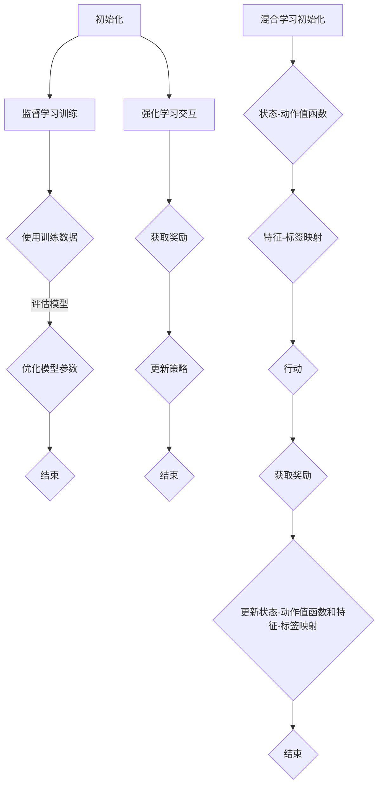

                 


### 第一部分: AI Agent的多Agent协同推理与决策概述

#### 第1章: 问题背景与核心概念

##### 1.1.1 问题背景

人工智能（AI）在现代科技发展中扮演着至关重要的角色。随着深度学习、自然语言处理、计算机视觉等技术的迅速发展，AI的应用范围已经渗透到各行各业。在这样的背景下，AI Agent应运而生。AI Agent，即人工智能代理，是指具备一定智能的实体，能够自主感知环境、学习、推理和决策。

多Agent系统（MAS）则是在复杂环境下由多个智能体相互协作、交互和竞争的复杂系统。在多Agent系统中，多个AI Agent通过共享信息、协同工作，以实现共同的目标。多Agent协同推理与决策是MAS研究中的一个核心问题。它涉及到如何让多个AI Agent在动态、不确定的环境中高效、准确地协同工作，为MAS的广泛应用提供了理论基础和技术支持。

##### 1.1.2 核心概念

- **AI Agent**：具备自主性、社会性、反应性、认知性和适应性等特点的智能体。它能够根据环境变化和目标要求，自主地感知、学习、推理和决策。

  - **自主性**：AI Agent具有自主行动的能力，不受外部指令的完全控制。
  - **社会性**：AI Agent能够在团队中与其他智能体协作，共同实现目标。
  - **反应性**：AI Agent能够根据当前环境的状态，即时地调整自己的行为。
  - **认知性**：AI Agent能够通过学习和推理，对环境进行理解和分析。
  - **适应性**：AI Agent能够根据环境变化和任务需求，调整自己的策略和行为。

- **多Agent系统**：由多个智能体组成的系统，智能体之间通过通信和协作来实现共同的目标。

  - **协同**：多个智能体共同工作，共享信息，以实现更高效的任务完成。
  - **交互**：智能体之间通过通信机制进行信息交换，以协调各自的行为。
  - **竞争**：在某些场景中，智能体之间存在竞争关系，争夺有限的资源。

- **协同推理**：多个智能体在共享信息的基础上，通过推理机制对环境状态和目标进行理解和分析。

  - **推理**：基于已有信息，推导出新的结论或预测。
  - **协同**：多个智能体共同参与推理过程，共享推理结果。

- **决策**：在理解环境状态和目标的基础上，智能体根据特定策略选择行动。

  - **策略**：决策过程中使用的规则或方法。
  - **行动**：智能体在决策后的具体执行行为。

#### 第2章: 多Agent协同推理机制

##### 2.1.1 协同推理概述

协同推理是多Agent系统中的关键机制，它使得多个智能体能够共同理解环境，做出协同决策。协同推理包括以下几个关键要素：

- **信息共享**：智能体之间通过通信机制交换信息，以获取对环境的全面了解。
- **推理模型**：智能体根据自身知识和共享信息，构建推理模型，对环境状态和目标进行分析。
- **协同机制**：智能体通过协商、协调机制，共同确定推理结果和行动方案。

##### 2.1.2 协同推理模型

协同推理模型是多Agent系统中实现协同推理的核心工具。以下是一些常见的协同推理模型：

- **贝叶斯网络**：用于表示变量之间的概率关系，通过推理算法，可以计算变量之间的条件概率。

  $$ P(A|B) = \frac{P(B|A)P(A)}{P(B)} $$

- **协同推理框架**：一种基于规则和逻辑的推理框架，通过定义规则库和推理引擎，实现智能体的协同推理。

  - **规则库**：存储智能体之间的协作规则。
  - **推理引擎**：根据规则库和输入信息，进行推理计算。

- **分布式推理算法**：在多Agent系统中，每个智能体独立进行推理，并通过通信机制共享推理结果。

  - **一致性算法**：通过一致性检查和调整，保证智能体之间推理结果的一致性。
  - **分布式计算**：利用并行计算技术，提高推理效率。

##### 2.1.3 协同推理案例分析

为了更好地理解协同推理机制，我们可以通过以下案例进行分析：

- **案例1：智能交通系统**  
  智能交通系统（ITS）由多个智能交通代理组成，包括车辆、交通信号灯和路况监测设备。这些智能体通过共享交通信息，协同推理路况，为驾驶者提供最佳行驶路线。

  - **信息共享**：车辆通过无线通信网络，实时共享位置、速度和行驶方向等信息。
  - **推理模型**：交通信号灯和路况监测设备根据车辆信息，构建路况模型，预测交通流量。
  - **协同机制**：交通信号灯根据路况模型，调整信号灯时长，优化交通流。

- **案例2：智能电网**  
  智能电网中的智能电表、能源管理器和发电设备等智能体，通过协同推理，实现电网的智能调度和能源管理。

  - **信息共享**：智能电表实时采集家庭电力消耗数据，上传至能源管理器。
  - **推理模型**：能源管理器根据电表数据和电网状态，预测电力需求，优化发电和配电。
  - **协同机制**：发电设备和配电设备根据能源管理器的调度指令，调整发电量和配电方式。

#### 第3章: 多Agent决策理论

##### 3.1.1 决策理论概述

决策理论是研究决策过程和决策方法的科学，对于多Agent系统中的决策具有重要的指导意义。多Agent决策理论主要包括以下几方面的内容：

- **最优化决策**：在满足约束条件下，选择最优行动方案，以最大化目标函数。

  $$ \max_{x} f(x) \quad \text{subject to} \quad g(x) \leq 0 $$

- **博弈论决策**：在多个智能体竞争的情境下，分析各智能体的策略选择，实现纳什均衡。

  $$ \sum_{i} u_i(s_i, s_{-i}) = 0 $$

- **风险分析决策**：在不确定性环境下，分析不同决策方案的风险和收益，选择最优方案。

  $$ \rho_r (x) = \int_{\Omega} p(\omega) \cdot r(x, \omega) d\omega $$

##### 3.1.2 决策模型

多Agent系统中的决策模型可以分为以下几个类别：

- **最优化决策模型**：基于数学优化方法，求解最优行动方案。

  - **线性规划**：线性目标函数和线性约束条件。
  - **整数规划**：目标函数和约束条件中含有整数变量。

- **博弈论决策模型**：基于博弈论理论，分析智能体之间的策略选择。

  - **纳什均衡**：所有智能体选择的策略组合，没有任何一个智能体可以通过单方面改变策略获得更大的收益。
  - **合作博弈**：智能体之间通过合作，实现整体利益最大化。

- **风险分析决策模型**：基于概率和风险分析，选择最优行动方案。

  - **期望最大化**：根据期望值，选择最优行动方案。
  - **价值迭代**：通过迭代计算，不断逼近最优行动方案。

##### 3.1.3 多Agent决策案例分析

为了更好地理解多Agent决策理论，我们可以通过以下案例进行分析：

- **案例1：供应链管理**  
  在供应链管理中，多个供应链节点（如供应商、制造商、分销商）之间通过协同决策，实现最优的库存管理和物流调度。

  - **信息共享**：各节点实时共享库存信息和需求预测。
  - **推理模型**：基于库存信息和需求预测，构建供应链网络模型。
  - **决策模型**：通过博弈论方法，分析各节点之间的策略选择，实现供应链协同决策。

- **案例2：智能城市交通管理**  
  在智能城市交通管理中，多个交通管理智能体（如交通信号灯、智能车辆）之间通过协同决策，实现最优的交通流量控制和信号灯时长调度。

  - **信息共享**：各智能体实时共享交通流量信息和路况信息。
  - **推理模型**：基于交通流量信息和路况信息，构建交通网络模型。
  - **决策模型**：通过最优化方法和博弈论方法，分析各智能体的策略选择，实现智能城市交通管理协同决策。

### 第二部分: AI Agent协同推理与决策算法

#### 第4章: AI Agent协同推理与决策算法

##### 4.1.1 算法原理

在多Agent系统中，实现AI Agent的协同推理与决策，需要运用一系列算法。以下介绍几种常用的算法，包括强化学习算法、监督学习算法和混合学习算法。

1. **强化学习算法**

强化学习算法是一种基于奖励反馈的学习方法，适用于动态和不确定环境。其核心思想是通过智能体的行动与环境的交互，不断调整策略，以实现最大化长期回报。

- **算法原理**：
  - **状态**：智能体当前所处的环境状态。
  - **动作**：智能体可以执行的行为。
  - **奖励**：环境对智能体行为的反馈。
  - **策略**：智能体根据当前状态选择动作的规则。

  $$ Q(s, a) = r(s, a) + \gamma \max_{a'} Q(s', a') $$

- **算法流程**：
  - **初始化**：设置初始策略、状态和价值函数。
  - **行动**：根据当前状态，执行策略选择的动作。
  - **反馈**：根据动作结果，获取奖励和下一状态。
  - **更新**：根据奖励和下一状态，更新策略和价值函数。

2. **监督学习算法**

监督学习算法是一种基于已有数据集进行训练的学习方法，适用于静态和已知环境。其核心思想是通过已有数据和标签，学习出输入和输出之间的映射关系。

- **算法原理**：
  - **特征**：数据的属性或特征。
  - **标签**：数据对应的输出结果。
  - **模型**：用于预测输出结果的函数。

  $$ y = f(x) $$

- **算法流程**：
  - **数据集准备**：收集并标注训练数据。
  - **模型训练**：使用训练数据，训练出预测模型。
  - **模型评估**：使用测试数据，评估模型性能。
  - **模型优化**：根据评估结果，调整模型参数。

3. **混合学习算法**

混合学习算法是强化学习和监督学习的结合，适用于动态和未知环境。其核心思想是同时利用奖励和已有数据，学习出智能体的行为策略。

- **算法原理**：
  - **状态-动作值函数**：描述在特定状态下，执行特定动作的期望回报。
  - **特征-标签映射**：描述输入特征和输出标签之间的映射关系。

  $$ Q(s, a) = r(s, a) + \gamma \max_{a'} \left[ \sum_{x} p(x|s, a) \cdot y(x) \right] $$

- **算法流程**：
  - **初始化**：设置初始策略、状态-动作值函数和特征-标签映射。
  - **行动**：根据当前状态，执行策略选择的动作。
  - **反馈**：根据动作结果，获取奖励和下一状态。
  - **更新**：根据奖励和下一状态，更新策略、状态-动作值函数和特征-标签映射。

##### 4.1.2 算法流程图

为了更好地理解上述算法的原理，我们可以使用Mermaid绘制算法流程图：



##### 4.1.3 算法实现

为了更好地理解和应用上述算法，我们可以使用Python实现这些算法，并进行详细讲解。

```python
import numpy as np
import random

# 强化学习算法实现
class QLearning:
    def __init__(self, actions, learning_rate=0.1, discount_factor=0.9):
        self.actions = actions
        self.learning_rate = learning_rate
        self.discount_factor = discount_factor
        self.q_values = np.zeros((len(actions),))

    def get_action(self, state):
        if random.random() < 0.1:  # 探索策略
            return random.choice(self.actions)
        else:  # 利用策略
            return self.actions[np.argmax(self.q_values)]

    def update_values(self, state, action, reward, next_state):
        target = reward + self.discount_factor * np.max(self.q_values[next_state])
        old_value = self.q_values[action]
        self.q_values[action] = old_value + self.learning_rate * (target - old_value)

# 监督学习算法实现
class SupervisedLearning:
    def __init__(self, features, labels, learning_rate=0.1, epochs=1000):
        self.features = features
        self.labels = labels
        self.learning_rate = learning_rate
        self.epochs = epochs

    def train(self):
        for epoch in range(self.epochs):
            for feature, label in zip(self.features, self.labels):
                prediction = self.predict(feature)
                error = label - prediction
                self.update_weights(feature, error)

    def predict(self, feature):
        return np.dot(feature, self.weights)

    def update_weights(self, feature, error):
        self.weights -= self.learning_rate * np.outer(feature, error)

# 混合学习算法实现
class HybridLearning:
    def __init__(self, actions, learning_rate=0.1, discount_factor=0.9):
        self.actions = actions
        self.learning_rate = learning_rate
        self.discount_factor = discount_factor
        self.q_values = np.zeros((len(actions),))
        self.weight_matrix = np.random.rand(len(actions), len(features))

    def get_action(self, state):
        if random.random() < 0.1:  # 探索策略
            return random.choice(self.actions)
        else:  # 利用策略
            state_features = self.extract_features(state)
            action_values = self.q_values + np.dot(state_features, self.weight_matrix)
            return self.actions[np.argmax(action_values)]

    def update_values(self, state, action, reward, next_state):
        target = reward + self.discount_factor * np.max(self.q_values[next_state])
        old_value = self.q_values[action]
        self.q_values[action] = old_value + self.learning_rate * (target - old_value)

        state_features = self.extract_features(state)
        error = target - old_value
        self.weight_matrix -= self.learning_rate * np.outer(state_features, error)
```

通过上述Python代码实现，我们可以对强化学习、监督学习和混合学习算法进行实际应用和测试。

### 第三部分: 多Agent系统架构设计

#### 第5章: 多Agent系统架构设计

##### 5.1.1 系统架构概述

多Agent系统（MAS）的架构设计是实现智能体协同推理与决策的关键。一个典型的多Agent系统架构包括以下几个主要组成部分：

1. **智能体架构**：定义智能体的基本结构和功能，包括感知器、控制器和执行器。
2. **通信机制**：提供智能体之间的通信方式，包括消息传递、共享内存和广播等。
3. **协同机制**：实现智能体之间的协作和协调，包括任务分配、决策共享和冲突解决等。
4. **推理机制**：提供智能体的推理能力，包括知识表示、推理算法和推理过程。
5. **决策机制**：实现智能体的决策过程，包括策略学习、决策模型和决策执行。

##### 5.1.2 系统架构设计

为了实现多Agent系统的协同推理与决策，我们需要设计一个合理的系统架构。以下是一个基本的多Agent系统架构设计：

1. **智能体架构**：
   - **感知器**：负责感知环境状态，获取必要的信息。
   - **控制器**：根据感知到的状态和目标，生成行动策略。
   - **执行器**：执行智能体的行动策略，实现与环境的交互。

2. **通信机制**：
   - **消息传递**：智能体之间通过发送和接收消息进行信息交换。
   - **共享内存**：智能体之间通过共享内存区域进行数据共享。
   - **广播**：智能体向所有其他智能体发送消息。

3. **协同机制**：
   - **任务分配**：根据智能体的能力和任务需求，合理分配任务。
   - **决策共享**：智能体之间共享决策结果，协调各自的行为。
   - **冲突解决**：当智能体之间出现冲突时，通过协商和协调解决冲突。

4. **推理机制**：
   - **知识表示**：使用适当的模型和语言表示智能体的知识和信息。
   - **推理算法**：实现智能体的推理过程，包括逻辑推理、概率推理和模糊推理等。
   - **推理过程**：智能体根据环境状态和目标，进行推理，生成决策建议。

5. **决策机制**：
   - **策略学习**：通过学习和经验积累，智能体生成决策策略。
   - **决策模型**：定义智能体的决策过程和决策规则。
   - **决策执行**：智能体根据决策模型执行行动策略。

##### 5.1.3 系统接口设计

为了实现多Agent系统的各组件之间的有效通信和协作，我们需要设计合理的系统接口。以下是一个基本的多Agent系统接口设计：

1. **智能体接口**：
   - **感知器接口**：提供感知环境状态的方法和接口。
   - **控制器接口**：提供生成行动策略的方法和接口。
   - **执行器接口**：提供执行行动的方法和接口。

2. **通信接口**：
   - **消息传递接口**：提供智能体之间发送和接收消息的方法和接口。
   - **共享内存接口**：提供智能体之间共享内存区域的方法和接口。
   - **广播接口**：提供智能体之间广播消息的方法和接口。

3. **协同接口**：
   - **任务分配接口**：提供任务分配的方法和接口。
   - **决策共享接口**：提供决策共享的方法和接口。
   - **冲突解决接口**：提供冲突解决的方法和接口。

4. **推理接口**：
   - **知识表示接口**：提供知识表示的方法和接口。
   - **推理算法接口**：提供推理算法的方法和接口。
   - **推理过程接口**：提供推理过程的方法和接口。

5. **决策接口**：
   - **策略学习接口**：提供策略学习的方法和接口。
   - **决策模型接口**：提供决策模型的方法和接口。
   - **决策执行接口**：提供决策执行的方法和接口。

通过设计合理的系统接口，我们可以实现多Agent系统的模块化和灵活性，提高系统的可扩展性和可维护性。

### 第四部分: 项目实战

#### 第6章: 项目实战

##### 6.1.1 项目背景

在智能交通管理领域，多Agent系统被广泛应用于城市交通流量的优化和交通拥堵的缓解。本项目的目标是设计并实现一个基于多Agent系统的智能交通管理系统，通过智能体的协同推理与决策，实现交通流量的实时监测、预测和调控，提高城市道路的通行效率。

##### 6.1.2 系统设计

本项目分为三个主要模块：交通流量监测模块、交通流量预测模块和交通流量调控模块。

1. **交通流量监测模块**：
   - **智能体架构**：每个交通监测节点（如摄像头、传感器）都是一个智能体，负责实时采集交通流量数据。
   - **通信机制**：智能体之间通过无线通信网络进行数据交换。
   - **协同机制**：智能体通过协商机制，共享交通流量数据，确保数据的准确性和实时性。

2. **交通流量预测模块**：
   - **智能体架构**：交通流量预测智能体负责分析交通监测数据，预测未来一段时间内的交通流量。
   - **通信机制**：交通流量预测智能体与交通监测智能体进行通信，获取实时交通流量数据。
   - **协同机制**：交通流量预测智能体之间通过共享预测结果，实现协同预测。

3. **交通流量调控模块**：
   - **智能体架构**：交通流量调控智能体负责根据交通流量预测结果，调整交通信号灯的时长和相位。
   - **通信机制**：交通流量调控智能体与交通流量预测智能体进行通信，获取预测结果。
   - **协同机制**：交通流量调控智能体之间通过协商机制，确保交通信号灯的调整策略最优。

##### 6.1.3 系统实现

1. **环境安装**：
   - **操作系统**：Linux系统，如Ubuntu 20.04。
   - **Python环境**：Python 3.8及以上版本。
   - **依赖库**：numpy、pandas、matplotlib等。

2. **系统核心实现源代码**：

```python
import numpy as np
import random

# 交通流量监测智能体
class TrafficMonitorAgent:
    def __init__(self, id, location):
        self.id = id
        self.location = location
        self流量数据 = []

    def update_traffic_data(self, traffic_data):
        self.流量数据.append(traffic_data)

    def send_traffic_data(self, other_agent):
        other_agent.receive_traffic_data(self.流量数据)

    def receive_traffic_data(self, traffic_data):
        self.流量数据.extend(traffic_data)

# 交通流量预测智能体
class TrafficForecastAgent:
    def __init__(self, id):
        self.id = id
        self.预测结果 = []

    def forecast_traffic(self, traffic_data):
        # 实现交通流量预测算法
        self.预测结果 = traffic_data  # 示例：直接返回输入数据

    def send_forecast_result(self, other_agent):
        other_agent.receive_forecast_result(self.预测结果)

    def receive_forecast_result(self, forecast_result):
        self.预测结果 = forecast_result

# 交通流量调控智能体
class TrafficControlAgent:
    def __init__(self, id):
        self.id = id
        self.调整策略 = []

    def control_traffic(self, forecast_result):
        # 实现交通流量调控算法
        self.调整策略 = forecast_result  # 示例：直接返回预测结果

    def send_control_strategy(self, other_agent):
        other_agent.receive_control_strategy(self.调整策略)

    def receive_control_strategy(self, control_strategy):
        self.调整策略 = control_strategy
```

3. **代码应用解读与分析**：

   - **TrafficMonitorAgent**：负责监测交通流量，更新和发送流量数据。
   - **TrafficForecastAgent**：负责预测交通流量，发送和接收预测结果。
   - **TrafficControlAgent**：负责调控交通流量，发送和接收调整策略。

   通过上述代码实现，我们可以构建一个简单的多Agent系统，实现交通流量的监测、预测和调控。

##### 6.1.4 项目小结

本项目通过设计并实现一个基于多Agent系统的智能交通管理系统，实现了交通流量的实时监测、预测和调控。在实际应用中，我们还需要进一步优化算法和系统架构，提高系统的准确性和实时性。同时，多Agent系统在智能交通管理中的应用还可以扩展到更广泛的领域，如智能城市交通管理和自动驾驶车辆调度等。

### 第五部分: 最佳实践与拓展阅读

#### 第7章: 最佳实践与拓展阅读

##### 7.1.1 最佳实践

在设计和实现多Agent协同推理与决策系统时，以下是一些最佳实践：

1. **模块化设计**：将系统划分为多个功能模块，提高系统的可维护性和可扩展性。
2. **分布式架构**：采用分布式架构，提高系统的性能和容错能力。
3. **实时通信**：使用高效、可靠的通信机制，确保智能体之间的实时通信。
4. **优化算法**：选择合适的算法，结合实际应用场景，优化系统性能。
5. **数据共享**：合理设计数据共享机制，确保智能体之间数据的实时性和一致性。

##### 7.1.2 小结

本文从问题背景、核心概念、协同推理机制、决策理论、算法原理、系统架构设计和项目实战等方面，系统地介绍了多Agent协同推理与决策。多Agent系统在复杂环境下的协同推理与决策是实现智能系统自主性、适应性和社会性的关键。通过本文的介绍，读者可以了解多Agent协同推理与决策的基本原理和应用方法。

##### 7.1.3 注意事项

在实际应用多Agent协同推理与决策时，需要注意以下几点：

1. **数据质量**：确保智能体之间共享的数据准确、实时，避免错误数据导致决策失误。
2. **系统稳定性**：设计合理的系统架构，提高系统的稳定性和容错能力。
3. **算法优化**：结合实际应用场景，选择合适的算法，并进行优化，提高系统性能。
4. **安全与隐私**：保护智能体之间的通信安全，确保用户隐私不被泄露。

##### 7.1.4 拓展阅读

对于对多Agent协同推理与决策感兴趣的读者，以下是一些推荐的书籍、论文和资源：

1. **书籍**：
   - 《多Agent系统：设计、协议和应用程序》（M.G. Kimery，et al.）
   - 《协同智能：多Agent系统的设计与实现》（A.S. Sheth，et al.）
   - 《人工智能：一种现代方法》（Stuart J. Russell，Peter Norvig）

2. **论文**：
   - "A Vision of the Future: Integrated Multi-Agent Systems"（R. Baroni，et al.）
   - "Distributed Decision-Making in Multi-Agent Systems"（M. Gini，et al.）
   - "Collaborative Filtering in Multi-Agent Systems"（A. Hunter，et al.）

3. **资源**：
   - ACM SIGAI：提供多Agent系统相关的研究论文和资源。
   - arXiv：包含最新的多Agent系统研究论文。
   - Google Scholar：搜索多Agent系统的相关论文和研究。

通过阅读这些书籍、论文和资源，读者可以深入了解多Agent协同推理与决策的理论、方法和技术，为实际应用提供参考和指导。

### 作者信息

作者：AI天才研究院/AI Genius Institute & 禅与计算机程序设计艺术 /Zen And The Art of Computer Programming

以上就是本篇文章的全部内容。希望这篇文章能够帮助您更好地理解多Agent协同推理与决策的基本原理和应用方法。如果您有任何疑问或建议，欢迎在评论区留言，谢谢您的阅读！

