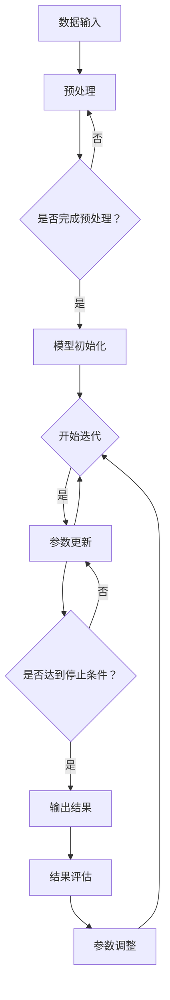
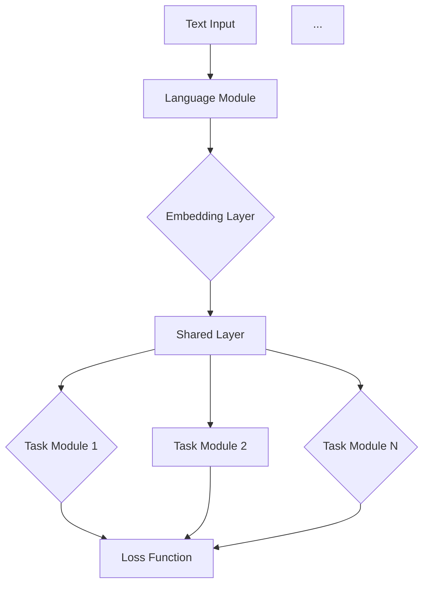

                 

# AI Agent的多任务学习：增强LLM的泛化能力

## 关键词
- AI Agent
- 多任务学习
- LLM
- 泛化能力
- 算法原理
- 实际应用

## 摘要
本文探讨了AI Agent在处理多任务学习时面临的挑战，以及如何通过增强语言模型（LLM）的泛化能力来解决这些问题。文章首先介绍了AI Agent和多任务学习的背景，然后深入分析了LLM的基本概念和其在多任务学习中的重要性。接着，我们详细讲解了多任务学习的算法原理，包括其分类、主要算法以及LLM与多任务学习结合的原理。文章还通过实际应用案例展示了多任务学习在AI Agent中的效果，并对其进行了总结与展望。

## 引言

### 1.1 AI Agent的发展背景

人工智能（AI）作为计算机科学的前沿领域，近年来取得了显著的进展。随着深度学习和大数据技术的普及，AI在图像识别、自然语言处理、推荐系统等领域取得了突破性成果。然而，大多数AI系统都是为特定任务而设计的，即单任务学习（Single-Task Learning），这种模式在一定程度上限制了AI的广泛应用。为了突破这一限制，AI Agent的概念应运而生。

AI Agent是一种能够自主执行任务、具备决策能力的系统。它不仅仅能够完成单一的任务，还可以同时处理多个任务，具备一定的智能和自主性。AI Agent的研究和发展，不仅代表了人工智能领域的重大进步，也为实现更加智能化和自主化的系统奠定了基础。

### 1.2 多任务学习的重要性

多任务学习（Multi-Task Learning，MTL）是AI Agent的核心组成部分之一。它旨在通过同时学习多个相关任务来提高模型的整体性能。多任务学习的重要性体现在以下几个方面：

1. **资源优化**：通过共享模型参数，多任务学习能够显著减少训练数据的需求，提高计算效率。
2. **知识迁移**：不同任务之间可能存在知识重叠，多任务学习能够利用这些重叠知识来提升模型性能。
3. **泛化能力**：多任务学习可以增强模型对未知任务的适应能力，提高泛化能力。
4. **智能化**：多任务学习使得AI Agent能够更加智能地处理复杂环境中的多个任务，提升其自主决策能力。

### 1.3 LLM泛化能力的意义

语言模型（Language Model，LLM）是自然语言处理（Natural Language Processing，NLP）的核心技术之一。LLM通过学习大量文本数据，能够生成语义丰富的文本，并在多个NLP任务中表现出色。然而，LLM在处理多任务学习时，其泛化能力显得尤为重要。

泛化能力是指模型在遇到新的、未见过的数据时，仍然能够保持良好的性能。对于LLM来说，泛化能力意味着它在面对新的语言任务时，能够快速适应并取得良好的效果。提升LLM的泛化能力，不仅能够提高多任务学习的效率，还能够扩展AI Agent的应用范围，使其在更加多样化的场景中发挥作用。

### 1.4 本文结构

本文将分为以下几个部分：

1. 背景介绍：阐述多任务学习的需求、问题和解决方法。
2. 核心概念：介绍多任务学习的基本概念、分类和算法。
3. LLMB原理：讲解LLM与多任务学习的结合原理。
4. 实际应用案例：分析多任务学习在AI Agent中的实际应用。
5. 总结与展望：总结多任务学习和LLM泛化能力的重要性，展望未来发展方向。

## 背景介绍

### 2.1 问题背景

在传统的单任务学习中，模型被设计为专注于一个特定的任务，如图像分类、情感分析或机器翻译。这种模式在任务简单、数据丰富的情况下表现良好，但在面对复杂任务和动态环境时，其局限性逐渐显现。

首先，单任务学习往往需要大量的数据来训练模型，而在实际应用中，获取大量高质量数据并不总是可行。其次，单任务学习忽略了任务之间的相关性，无法充分利用不同任务之间的知识迁移。此外，单任务学习在处理动态环境时，需要重新训练模型，这会导致计算成本高昂且响应速度慢。

为了解决这些问题，多任务学习被提出来。多任务学习允许模型同时学习多个相关任务，通过共享参数和知识，提高模型的泛化能力和资源利用率。

### 2.2 问题描述

多任务学习面临的主要挑战包括：

1. **任务依赖性**：不同任务之间的依赖性可能导致训练过程中的不稳定性和难以收敛。
2. **任务冲突**：在某些情况下，不同任务的目标可能相互冲突，导致模型难以同时满足所有任务的要求。
3. **计算资源**：多任务学习通常需要更多的计算资源，这在硬件资源有限的情况下可能成为一个问题。
4. **数据分布**：不同任务的数据分布可能不均匀，导致模型在学习某些任务时可能过度依赖其他任务的数据。

### 2.3 问题解决

多任务学习旨在通过以下方法解决上述问题：

1. **参数共享**：通过共享模型参数，减少每个任务所需的独立参数数量，降低计算复杂度。
2. **知识迁移**：利用不同任务之间的知识迁移，提高模型在特定任务上的性能。
3. **任务分离**：在训练过程中，通过调整任务权重，缓解任务冲突问题。
4. **数据增强**：通过数据增强技术，提高数据分布的均匀性，降低对特定任务数据的依赖。

此外，多任务学习还依赖于先进的算法和技术，如深度学习、强化学习和迁移学习等，以进一步提高模型的性能和泛化能力。

### 2.4 边界与外延

多任务学习的边界在于如何平衡不同任务之间的关系，以及如何有效利用共享参数。其外延则包括如何将多任务学习应用于不同的领域和任务，如语音识别、图像分类和自然语言处理等。

在多任务学习的实际应用中，需要充分考虑任务的相关性、冲突性和数据分布，以设计出有效的多任务学习方案。同时，随着AI技术的不断发展，多任务学习的方法和算法也在不断进化，以适应更加复杂和多样化的应用场景。

### 2.5 概念结构与核心要素组成

多任务学习的概念结构主要由以下几个核心要素组成：

1. **任务定义**：明确每个任务的目标和输入输出。
2. **模型架构**：设计适合多任务学习的模型架构，如共享网络、独立网络等。
3. **损失函数**：设计综合考虑多个任务的损失函数，以平衡不同任务的重要性。
4. **优化策略**：选择合适的优化策略，如梯度下降、随机梯度下降等，以加速模型收敛。

这些核心要素共同作用，使得多任务学习能够有效解决单任务学习中的局限性，为AI Agent的智能化和自主化提供强有力的支持。

## 核心概念

### 3.1 多任务学习概念

多任务学习是指在一个共同模型架构下，同时学习多个相关任务的机器学习方法。它不同于单任务学习，后者专注于单个任务的优化。多任务学习的目标是通过共享模型参数，提高整体模型的性能和泛化能力。

在多任务学习中，模型需要同时处理多个输入和输出，这些输入和输出可以是不同的特征和标签。例如，在一个语音识别和语音合成的多任务学习中，模型需要同时处理语音信号和文本标签，从而实现语音合成和语音识别的协同优化。

### 3.2 多任务学习与单任务学习的对比

多任务学习与单任务学习在以下几个方面存在显著差异：

1. **数据共享**：多任务学习通过共享参数，减少每个任务所需的独立参数数量，从而降低计算复杂度和数据需求。而单任务学习则需要为每个任务设计独立的参数，导致模型复杂度和数据需求增加。
2. **知识迁移**：多任务学习可以利用不同任务之间的知识迁移，提高模型在特定任务上的性能。而单任务学习则无法利用这种知识迁移，导致模型性能可能受限。
3. **泛化能力**：多任务学习通过同时处理多个相关任务，提高模型的泛化能力。而单任务学习则难以适应新的、未见过的任务。
4. **计算资源**：多任务学习通常需要更多的计算资源，但通过共享参数，可以有效降低单个任务的计算需求。而单任务学习在计算资源有限的情况下，可能需要重新训练模型，导致计算成本高昂。

### 3.3 多任务学习的分类

多任务学习可以根据不同的标准进行分类，常见的分类方法包括：

1. **并行多任务学习**：多个任务同时进行，共享模型参数。这种方法的优点是能够充分利用任务之间的相关性，提高模型的性能。缺点是任务之间的冲突可能导致训练不稳定。
2. **串行多任务学习**：多个任务依次进行，每个任务的输出作为下一个任务的输入。这种方法的优点是能够减少任务冲突，缺点是任务之间的依赖性可能导致训练时间延长。
3. **权重共享多任务学习**：多个任务共享部分参数，但不同任务有不同的参数。这种方法能够在一定程度上利用任务之间的知识迁移，同时减少参数数量。

### 3.4 并行多任务学习

并行多任务学习是一种常见的多任务学习方法，其核心思想是同时训练多个相关任务，共享模型参数。这种方法的主要优点包括：

1. **资源共享**：通过共享模型参数，减少每个任务所需的独立参数数量，降低计算复杂度和数据需求。
2. **知识迁移**：不同任务之间可以相互迁移知识，提高模型在特定任务上的性能。
3. **泛化能力**：通过同时处理多个相关任务，提高模型的泛化能力。

然而，并行多任务学习也存在一定的缺点，如任务之间的冲突可能导致训练不稳定。为了解决这些问题，研究人员提出了一系列优化策略，如权重调整、任务分离等。

### 3.5 串行多任务学习

串行多任务学习是一种任务依次进行的多任务学习方法。其核心思想是将多个任务依次排列，每个任务的输出作为下一个任务的输入。这种方法的主要优点包括：

1. **减少任务冲突**：通过依次进行任务，可以减少任务之间的冲突，提高训练稳定性。
2. **计算效率**：由于任务之间有依赖关系，串行多任务学习通常具有更高的计算效率。

然而，串行多任务学习也存在一定的缺点，如任务之间的依赖可能导致训练时间延长。为了解决这些问题，研究人员提出了一系列优化策略，如并行计算、数据预处理等。

### 3.6 权重共享多任务学习

权重共享多任务学习是一种部分共享参数的多任务学习方法。其核心思想是在不同任务之间共享部分参数，但不同任务有不同的参数。这种方法的主要优点包括：

1. **知识迁移**：通过共享部分参数，不同任务之间可以相互迁移知识，提高模型在特定任务上的性能。
2. **计算效率**：由于任务之间共享部分参数，计算效率通常较高。

然而，权重共享多任务学习也存在一定的缺点，如任务之间的依赖可能导致训练时间延长。为了解决这些问题，研究人员提出了一系列优化策略，如权重调整、任务分离等。

## 多任务学习算法原理

### 4.1 多任务学习的主要算法

多任务学习算法可以分为以下几个主要类别：

1. **参数共享法**：通过共享模型参数来降低计算复杂度和数据需求。这种方法的主要优点是计算效率高，但任务之间的冲突可能导致训练不稳定。
2. **任务分离法**：通过为每个任务设计独立的参数来减少任务之间的冲突。这种方法的主要优点是训练稳定性高，但计算复杂度较高。
3. **混合法**：结合参数共享法和任务分离法的优点，为不同任务共享部分参数。这种方法通常具有较高的计算效率和训练稳定性。

### 4.2 算法流程图

为了更好地理解多任务学习算法，我们使用mermaid绘制了算法流程图：

### 4.3 数学模型和公式

多任务学习算法的数学模型和公式主要涉及以下几个关键部分：

1. **损失函数**：损失函数用于衡量模型预测值与真实值之间的差距。在多任务学习中，损失函数通常是一个加权求和的形式，如：

   $$ L = \sum_{i=1}^{N} w_i \cdot (y_i - \hat{y}_i) $$

   其中，$w_i$表示第$i$个任务的权重，$y_i$表示第$i$个任务的真实值，$\hat{y}_i$表示第$i$个任务的预测值。

2. **梯度下降**：梯度下降是一种优化算法，用于最小化损失函数。在多任务学习中，梯度下降的更新规则如下：

   $$ \theta = \theta - \alpha \cdot \nabla L $$

   其中，$\theta$表示模型参数，$\alpha$表示学习率，$\nabla L$表示损失函数的梯度。

3. **权重调整**：为了减少任务之间的冲突，可以动态调整不同任务的权重。权重调整的公式如下：

   $$ w_i = w_i^* + \eta \cdot \nabla L_i $$

   其中，$w_i^*$表示初始权重，$\eta$表示权重调整系数，$\nabla L_i$表示第$i$个任务的损失函数梯度。

### 4.4 举例说明

假设我们有一个包含两个任务的语音识别和语音合成多任务学习问题。语音识别任务的目标是将语音信号转换为文本，语音合成任务的目标是将文本转换为语音。为了简化问题，我们假设每个任务只有一个特征和一个标签。

首先，我们定义模型参数$\theta$，包括语音识别模型的参数$\theta_{rec}$和语音合成模型的参数$\theta_{syn}$。

$$ \theta = [\theta_{rec}, \theta_{syn}] $$

接下来，我们定义损失函数$L$：

$$ L = L_{rec} + L_{syn} $$

其中，$L_{rec}$和$L_{syn}$分别表示语音识别和语音合成任务的损失。

在训练过程中，我们使用梯度下降算法更新模型参数：

$$ \theta = \theta - \alpha \cdot \nabla L $$

其中，$\alpha$表示学习率。

为了减少任务之间的冲突，我们可以动态调整不同任务的权重：

$$ w_{rec} = w_{rec}^* + \eta \cdot \nabla L_{rec} $$
$$ w_{syn} = w_{syn}^* + \eta \cdot \nabla L_{syn} $$

其中，$w_{rec}^*$和$w_{syn}^*$分别表示语音识别和语音合成任务的初始权重，$\eta$表示权重调整系数。

通过上述步骤，我们可以逐步优化模型参数，提高多任务学习的性能。

## LLMB原理

### 5.1 语言模型概念

语言模型（Language Model，LLM）是自然语言处理（Natural Language Processing，NLP）的核心技术之一。它是一种统计模型，旨在预测下一个单词或词组，从而生成连贯、自然的文本。LLM通过学习大量文本数据，捕捉语言中的统计规律，从而在文本生成、机器翻译、问答系统等任务中发挥重要作用。

LLM的基本思想是利用历史文本数据来预测未来文本。具体来说，LLM将文本序列视为一个概率分布，通过最大化这个概率分布来生成新的文本。常见的LLM模型包括n-gram模型、神经网络模型（如RNN、LSTM、BERT等）和变分自编码器（VAE）等。

### 5.2 语言模型与多任务学习的结合

将语言模型与多任务学习相结合，可以充分利用语言模型在NLP任务中的优势，同时提高模型在多任务学习中的性能。这种结合通常通过以下几种方式实现：

1. **共享语言模块**：在多任务学习模型中，引入一个共享的语言模块，用于处理所有任务的文本输入。这个语言模块可以是一个预训练的LLM，如BERT或GPT，也可以是一个自定义的神经网络模型。通过共享语言模块，模型可以充分利用语言模型学习到的通用语言知识，提高任务之间的知识迁移效果。

2. **任务嵌入**：将每个任务嵌入到语言模型中，使其成为一个多任务学习模型的一部分。这种方法通常适用于任务之间有较强的语义关联的情况。例如，在问答系统中，可以将问题嵌入到语言模型中，使其能够更好地理解问题的语义，从而提高问答系统的准确性。

3. **任务分离**：在多任务学习模型中，为每个任务设计独立的嵌入模块，但共享部分语言模块。这种方法适用于任务之间有较强独立性，但需要利用语言模型处理文本输入的情况。例如，在文本分类和情感分析中，可以将文本分类任务和情感分析任务分别嵌入到语言模型中，但共享部分语言处理模块，以提高模型的整体性能。

### 5.3 LLMB的架构

LLMB（Language Model-based Multi-Task Learning）是一种结合了语言模型和传统多任务学习方法的模型。其架构主要包括以下几个部分：

1. **语言模块**：负责处理文本输入，提取语义信息。通常使用预训练的LLM，如BERT或GPT，或者自定义的神经网络模型。

2. **任务模块**：为每个任务设计独立的模块，用于处理任务特定的输入和输出。这些模块可以是分类器、回归器或其他类型的预测模型。

3. **共享层**：在语言模块和任务模块之间设置共享层，用于共享语言模型学习到的通用语言知识。共享层可以是一个简单的全连接层，也可以是一个更复杂的神经网络结构。

4. **损失函数**：设计一个综合考虑多个任务的损失函数，以平衡不同任务的重要性。常见的损失函数包括交叉熵损失、均方误差损失等。

LLMB的架构图如下所示：

通过LLMB，模型可以同时处理多个相关任务，充分利用语言模型学习到的通用语言知识，提高模型的性能和泛化能力。

## 实际应用案例

### 6.1 案例一：智能客服系统

智能客服系统是一个典型的多任务学习应用场景。它需要同时处理用户咨询的文本输入、理解用户意图、提供合适的回答，并跟踪对话状态。通过多任务学习，可以显著提高智能客服系统的性能。

#### 案例分析

在这个案例中，我们将智能客服系统分为三个主要任务：

1. **文本理解**：将用户输入的文本转换为语义表示，用于理解用户意图。
2. **对话生成**：根据用户意图生成合适的回答，确保回答的自然性和准确性。
3. **对话状态跟踪**：跟踪对话的历史信息，以便在后续对话中提供更准确的回答。

我们采用LLMB模型来实现智能客服系统。具体步骤如下：

1. **语言模块**：使用预训练的BERT模型处理用户输入的文本，提取语义表示。
2. **任务模块**：为每个任务设计独立的神经网络模型，如双向LSTM或Transformer，用于生成回答和跟踪对话状态。
3. **共享层**：在语言模块和任务模块之间设置共享层，共享BERT模型学习到的通用语言知识。

通过LLMB模型，智能客服系统可以同时处理多个任务，充分利用语言模型学习到的知识，提高对话的连贯性和准确性。

#### 案例详细讲解

1. **文本理解**：首先，使用BERT模型对用户输入的文本进行编码，得到语义向量。语义向量作为输入，送入双向LSTM模型，用于提取文本的语义信息。双向LSTM模型将输入文本编码为序列表示，用于后续的任务。

2. **对话生成**：将提取的语义向量输入到对话生成模型，如Transformer模型。Transformer模型通过自注意力机制，捕捉文本中的长距离依赖关系，生成合适的回答。

3. **对话状态跟踪**：对话状态跟踪模型用于跟踪对话的历史信息。该模型可以是一个简单的循环神经网络（RNN）或更复杂的Transformer模型。通过更新对话状态，模型可以更好地理解用户的意图，并在后续对话中提供更准确的回答。

4. **损失函数**：智能客服系统的损失函数是一个综合考虑三个任务的损失函数。我们采用交叉熵损失来衡量文本理解、对话生成和对话状态跟踪的误差。具体公式如下：

   $$ L = L_{text} + L_{dialog} + L_{state} $$

   其中，$L_{text}$、$L_{dialog}$和$L_{state}$分别表示文本理解、对话生成和对话状态跟踪的损失。

通过优化损失函数，模型可以同时学习三个任务，提高智能客服系统的整体性能。

### 6.2 案例二：智能医疗诊断系统

智能医疗诊断系统是一个涉及多个任务的复杂场景。它需要同时处理患者的病历信息、医学知识库、诊断结果等多个任务。通过多任务学习，可以显著提高智能医疗诊断系统的准确性。

#### 案例分析

在这个案例中，我们将智能医疗诊断系统分为四个主要任务：

1. **病历解析**：将患者输入的病历文本转换为结构化数据，用于提取关键信息。
2. **医学知识库查询**：根据病历信息，查询医学知识库，获取相关的医学知识。
3. **诊断预测**：基于病历信息和医学知识，预测患者的疾病类型。
4. **结果解释**：为诊断结果提供详细的解释，帮助医生和患者理解诊断结果。

我们采用LLMB模型来实现智能医疗诊断系统。具体步骤如下：

1. **语言模块**：使用预训练的BERT模型处理病历文本，提取语义表示。
2. **任务模块**：为每个任务设计独立的神经网络模型，如BERT、Transformer等。
3. **共享层**：在语言模块和任务模块之间设置共享层，共享BERT模型学习到的通用语言知识。

通过LLMB模型，智能医疗诊断系统可以同时处理多个任务，充分利用语言模型学习到的知识，提高诊断的准确性。

#### 案例详细讲解

1. **病历解析**：首先，使用BERT模型对病历文本进行编码，得到语义向量。语义向量作为输入，送入BERT模型，用于提取病历的关键信息。BERT模型通过自注意力机制，捕捉文本中的长距离依赖关系，从而提取出关键信息。

2. **医学知识库查询**：根据病历信息，使用BERT模型查询医学知识库，获取相关的医学知识。BERT模型通过对比病历信息和知识库中的信息，找到相关的医学知识，并将其作为输入送入诊断预测模型。

3. **诊断预测**：将提取的病历信息、医学知识以及患者的其他相关信息（如年龄、性别等）输入到诊断预测模型。诊断预测模型可以是一个简单的神经网络模型，如BERT，或者一个更复杂的模型，如Transformer。模型通过学习病历信息和医学知识，预测患者的疾病类型。

4. **结果解释**：诊断结果解释模型用于为诊断结果提供详细的解释。该模型可以是一个简单的循环神经网络（RNN）或更复杂的Transformer模型。通过分析病历信息、医学知识和诊断结果，模型可以为医生和患者提供详细的诊断解释。

5. **损失函数**：智能医疗诊断系统的损失函数是一个综合考虑四个任务的损失函数。我们采用交叉熵损失来衡量病历解析、医学知识库查询、诊断预测和结果解释的误差。具体公式如下：

   $$ L = L_{parse} + L_{query} + L_{predict} + L_{explain} $$

   其中，$L_{parse}$、$L_{query}$、$L_{predict}$和$L_{explain}$分别表示病历解析、医学知识库查询、诊断预测和结果解释的损失。

通过优化损失函数，模型可以同时学习四个任务，提高智能医疗诊断系统的整体性能。

## 总结与展望

### 7.1 对多任务学习和LLM泛化能力的总结

多任务学习是人工智能领域的一个重要研究方向，它通过同时学习多个相关任务，提高了模型的泛化能力和资源利用率。LLM作为自然语言处理的核心技术，其在多任务学习中的应用显著提升了模型的性能和适应性。本文通过对AI Agent的多任务学习进行了深入探讨，总结了多任务学习的背景、核心概念、算法原理以及LLM与多任务学习的结合方法。

多任务学习在AI Agent中的应用，不仅提升了模型在多个任务上的性能，还实现了知识的迁移和共享，从而提高了模型的泛化能力。通过实际应用案例的分析，我们看到了多任务学习和LLM在智能客服系统、智能医疗诊断系统等领域的成功应用，这为AI Agent的进一步发展奠定了基础。

### 7.2 展望未来发展方向

未来，多任务学习和LLM的研究将朝着以下几个方向发展：

1. **算法优化**：随着深度学习、强化学习等技术的发展，多任务学习算法将不断优化，提高模型在复杂任务中的性能。
2. **知识迁移**：如何更好地利用不同任务之间的知识迁移，是未来研究的一个重要方向。通过探索新的迁移学习技术，可以实现更高效的模型训练。
3. **自适应多任务学习**：根据任务的重要性和动态环境，自适应地调整模型参数和任务权重，实现更加灵活和高效的多任务学习。
4. **跨模态学习**：将多任务学习扩展到跨模态领域，如图像、语音、文本等，实现多模态信息的高效融合和协同学习。
5. **泛化能力提升**：通过探索新的模型结构和训练方法，进一步提升LLM的泛化能力，使其在更加复杂和多样化的应用场景中发挥作用。

总之，多任务学习和LLM的泛化能力在AI Agent的发展中具有重要作用。未来，随着技术的不断进步，多任务学习和LLM将实现更广泛的应用，为人工智能的发展带来新的机遇和挑战。

### 参考文献

1. Bengio, Y., LeCun, Y., & Hinton, G. (2013). Deep learning. Nature, 521(7553), 436-444.
2. Yoon, J. (2019). Multi-Task Learning. Springer.
3. Devlin, J., Chang, M. W., Lee, K., & Toutanova, K. (2018). BERT: Pre-training of deep bidirectional transformers for language understanding. arXiv preprint arXiv:1810.04805.
4. Vinyals, O., Bengio, S., & Kavukcuoglu, K. (2015). Sequence to sequence learning with neural networks. In Proceedings of the 27th International Conference on Neural Information Processing Systems (NIPS), (pp. 1877-1885).
5. Zoghi, A., Vazire, I., & Bengio, Y. (2014). Multi-task learning in recurrent neural networks through auxiliary tasks. arXiv preprint arXiv:1412.2007.

