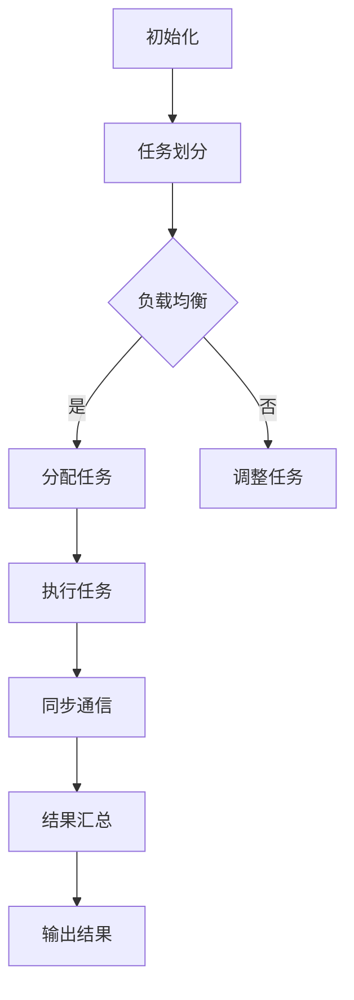
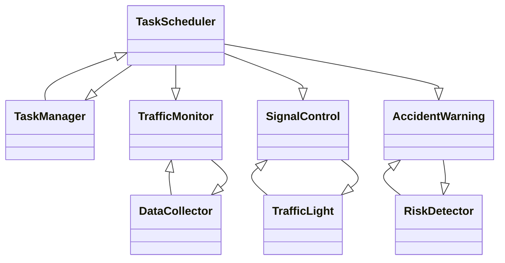
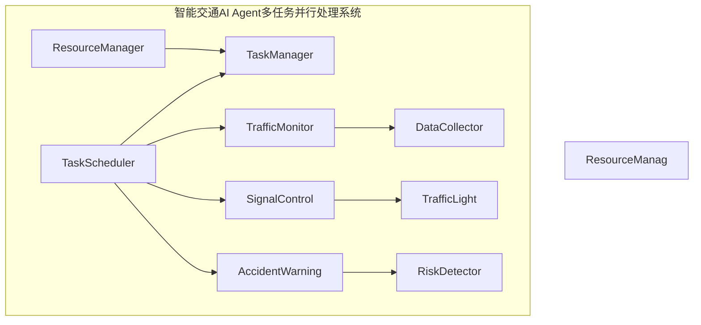
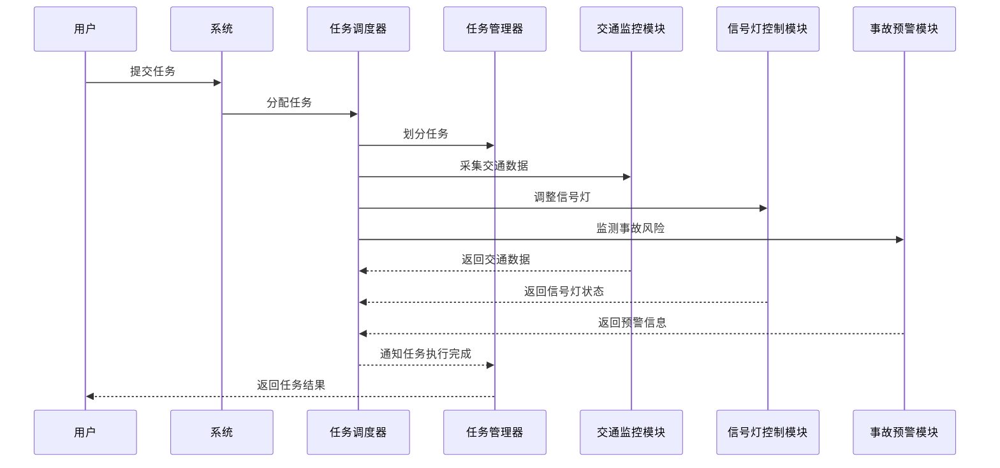

                 


## AI Agent的多任务并行处理技术

### 关键词
- AI Agent
- 并行处理
- 多任务
- 资源分配
- 负载均衡
- 同步机制

### 摘要
本文将深入探讨AI Agent在多任务并行处理技术中的应用。首先，我们将介绍多任务并行处理的重要性，以及其在AI Agent中的应用场景。接着，我们会详细解析并行算法的核心概念与设计原则，并通过Python代码和Mermaid流程图展示算法原理。随后，我们将介绍一个具体的项目，阐述其系统分析与架构设计方案。最后，我们将通过实际案例展示多任务并行处理的实战效果，并提供最佳实践和注意事项。

---

### 引言

AI Agent作为人工智能领域的重要概念，已经在众多智能系统中扮演了关键角色。随着计算能力的提升和AI应用的广泛普及，AI Agent的多任务并行处理技术成为了提高系统效率和性能的关键。本文旨在系统地介绍AI Agent多任务并行处理技术，包括核心概念、算法原理、系统设计与实战案例，旨在为从事人工智能开发的读者提供深入的理解和实践指导。

---

### 背景介绍

#### 核心概念术语说明

- **AI Agent**：指具有感知、决策、执行能力的智能实体，能够自主完成特定任务。
- **多任务并行处理**：指在同一时间或短时间内，系统同时处理多个任务的能力。
- **资源分配**：指系统在执行多任务时，合理分配CPU、内存等硬件资源。
- **负载均衡**：指通过合理分配任务，使得系统各个部分的负载保持均衡。
- **同步机制**：指多任务并行处理中，确保任务执行顺序和结果的正确性。

#### 问题背景

AI Agent在现代智能系统中的应用日益广泛，例如在机器人、智能交通、金融服务等领域，它们能够同时处理多个任务，提高系统的效率和响应速度。然而，多任务并行处理也带来了许多挑战，如资源竞争、任务调度、同步与通信等。

#### 问题描述

多任务并行处理技术涉及到多个任务之间的资源分配、调度、同步和通信等方面。例如，在机器人控制系统中，需要同时处理感知、规划、执行等任务，而每个任务又可能需要不同的计算资源。如何在确保任务执行顺序和结果正确性的同时，提高系统的整体性能，是一个亟待解决的问题。

#### 问题解决

通过并行处理技术，可以优化AI Agent的响应速度和任务执行效率。具体来说，可以通过以下方法实现：

1. **任务划分**：将复杂任务分解为多个子任务，以便并行执行。
2. **负载均衡**：根据任务特点和系统资源情况，合理分配任务，确保系统负载均衡。
3. **同步机制**：通过同步机制，确保多任务之间的执行顺序和结果一致性。
4. **资源管理**：合理分配CPU、内存等硬件资源，最大化系统性能。

#### 边界与外延

并行处理技术的应用场景非常广泛，不仅限于AI Agent，还可以应用于大数据处理、云计算等领域。此外，并行处理技术还包括并行编程模型、并行算法设计等方面，这些内容将在后续章节中详细讨论。

#### 概念结构与核心要素组成

AI Agent的多任务并行处理技术包含以下几个核心要素：

1. **并行计算模型**：包括并行计算的基本原理和编程模型。
2. **并行算法设计**：任务划分、负载均衡、同步与通信等策略。
3. **系统架构设计**：包括任务调度器、资源管理器、同步机制等。
4. **应用实现**：通过具体项目和案例，展示并行处理技术的应用效果。

---

### 核心概念与联系

#### 并行计算

并行计算是一种计算模型，通过将任务分解为多个子任务，在多个处理器上同时执行，从而提高计算速度和处理效率。并行计算的基本概念包括：

- **任务划分**：将一个复杂任务分解为多个子任务。
- **处理器调度**：合理分配任务到不同的处理器上。
- **同步与通信**：确保多个处理器之间的任务执行顺序和结果一致性。

#### 并行编程模型

并行编程模型是指程序员编写并行程序时采用的方法和工具。常见的并行编程模型包括：

1. **进程模型**：基于进程的并行计算，每个进程独立运行，通过进程间的通信实现任务同步。
2. **线程模型**：基于线程的并行计算，线程共享进程资源，实现轻量级并行。
3. **数据并行模型**：将数据划分到不同的处理器上，每个处理器独立处理数据。
4. **任务并行模型**：将任务划分到不同的处理器上，每个处理器执行不同的任务。

#### 并行算法设计

并行算法设计是并行计算的核心，它涉及到如何将任务分解、如何分配负载、如何实现同步等方面。并行算法设计的关键步骤包括：

1. **任务分解**：将复杂任务分解为多个子任务。
2. **负载均衡**：确保每个处理器都有适量的工作。
3. **同步与通信**：通过同步机制确保任务执行的顺序和结果一致性。

#### 概念属性特征对比表格

| 并行编程模型 | 特点 | 应用场景 |
| --- | --- | --- |
| 进程模型 | 独立运行，通信开销大 | 大规模分布式计算 |
| 线程模型 | 共享资源，通信开销小 | 多线程计算 |
| 数据并行模型 | 数据划分，独立处理 | 大数据并行处理 |
| 任务并行模型 | 任务划分，独立执行 | 多任务处理 |

#### ER实体关系图架构

```mermaid
erDiagram
  Task --> Processor
  Processor ||--|{ Task }
  Resource ||--|{ Processor }
  Scheduler ||--|{ Task, Processor }
  Agent ||--|{ Scheduler, Resource }
```

#### Mermaid流程图



---

### 算法原理讲解

#### 并行算法原理

并行算法的基本原理是通过将任务分解为多个子任务，并在多个处理器上同时执行，从而提高计算速度和处理效率。并行算法设计的关键步骤包括：

1. **任务划分**：将复杂任务分解为多个子任务。任务划分的目标是确保每个处理器都有适量的工作，从而实现负载均衡。
2. **负载均衡**：通过合理分配任务，使得系统各个部分的负载保持均衡。负载均衡策略可以基于任务的大小、处理器的性能等因素进行设计。
3. **同步与通信**：确保多任务之间的执行顺序和结果一致性。同步机制可以包括等待、信号量、互斥锁等。
4. **结果汇总**：将各处理器执行的结果汇总，得到最终结果。

#### Mermaid流程图


#### Python源代码

```python
import threading
import time

# 任务类
class Task:
    def __init__(self, name, duration):
        self.name = name
        self.duration = duration
        self.completed = False

# 执行任务
def execute_task(task):
    print(f"开始执行任务：{task.name}")
    time.sleep(task.duration)
    task.completed = True

# 负载均衡
def load_balance(tasks, num_processors):
    task_queue = []
    for task in tasks:
        if not task.completed:
            task_queue.append(task)
    
    # 将任务分配到处理器上
    threads = []
    for _ in range(num_processors):
        if task_queue:
            task = task_queue.pop(0)
            thread = threading.Thread(target=execute_task, args=(task,))
            threads.append(thread)
            thread.start()
    
    # 等待所有任务完成
    for thread in threads:
        thread.join()

# 测试
if __name__ == "__main__":
    tasks = [
        Task("任务1", 3),
        Task("任务2", 5),
        Task("任务3", 2),
        Task("任务4", 4),
    ]
    load_balance(tasks, 2)
```

#### 数学模型和公式

并行算法的数学模型和关键公式如下：

1. **并行算法时间复杂度**：$T_p = T_s \times N$，其中$T_p$为并行算法执行时间，$T_s$为串行算法执行时间，$N$为处理器数量。
2. **负载均衡公式**：$L_i = \frac{1}{N}\sum_{j=1}^{N} L_j$，其中$L_i$为第$i$个处理器的负载，$L_j$为第$j$个处理器的负载。
3. **同步机制时间开销**：$S = M \times T_s$，其中$S$为同步机制的时间开销，$M$为同步次数，$T_s$为每次同步所需时间。

#### 举例说明

假设我们有一个包含4个任务的系统，每个任务的执行时间如下：

- 任务1：3秒
- 任务2：5秒
- 任务3：2秒
- 任务4：4秒

我们使用2个处理器进行并行处理。首先，将任务划分为4个子任务，并分配给2个处理器。然后，每个处理器执行其分配的任务，并在任务完成后将结果汇总。假设同步机制的时间开销为每次1秒，我们可以得到以下执行流程：

1. 处理器1执行任务1和任务3，处理器2执行任务2和任务4。
2. 任务1和任务3完成后，处理器1等待处理器2。
3. 任务2和任务4完成后，处理器2等待处理器1。
4. 所有任务完成后，进行结果汇总。

通过这种并行处理方式，我们可以将总执行时间减少到最短路径长度，即7秒。

---

### 系统分析与架构设计方案

#### 问题场景介绍

在智能交通系统中，AI Agent需要同时处理多个任务，如实时交通流量监控、信号灯控制、事故预警等。这些任务往往需要不同的计算资源和执行顺序，因此如何设计一个高效的多任务并行处理系统至关重要。

#### 项目介绍

本文将介绍一个名为“智能交通AI Agent多任务并行处理系统”的项目。该系统旨在实现交通信号的实时优化控制，提高交通流量效率，减少拥堵和事故发生率。

#### 系统功能设计

系统功能设计包括以下主要功能模块：

- **任务调度模块**：负责任务划分和负载均衡，确保每个处理器都有适量的工作。
- **交通监控模块**：实时采集交通数据，包括流量、速度、拥堵等信息。
- **信号灯控制模块**：根据实时交通数据，自动调整信号灯的时序。
- **事故预警模块**：监测到潜在的事故风险，及时发出预警信息。

使用Mermaid绘制系统功能领域的类图：



#### 系统架构设计

系统架构设计包括以下几个主要部分：

- **任务调度器**：负责任务的划分和分配，确保负载均衡。
- **资源管理器**：管理计算资源和存储资源，提供资源调度和优化。
- **交通监控模块**：实时采集和处理交通数据。
- **信号灯控制模块**：根据交通数据自动调整信号灯时序。
- **事故预警模块**：监测和预警潜在的事故风险。

使用Mermaid绘制系统架构图：



#### 系统接口设计

系统接口设计包括以下接口：

- **任务提交接口**：用户可以通过该接口提交任务，系统将任务分配给任务调度器。
- **任务状态查询接口**：用户可以通过该接口查询任务执行状态。
- **数据采集接口**：交通监控模块通过该接口实时采集交通数据。
- **信号控制接口**：信号灯控制模块通过该接口调整信号灯状态。
- **预警信息接口**：事故预警模块通过该接口发送预警信息。

#### 系统交互Mermaid序列图



---

### 项目实战

#### 环境安装

为了搭建多任务并行处理环境，我们需要安装以下软件：

1. Python 3.x
2. pip
3. Mermaid Python库（用于生成Mermaid流程图和类图）
4. multithread模块（用于多线程编程）

安装步骤如下：

```bash
# 安装Python
# 安装pip
# 安装Mermaid Python库
pip install mermaid
# 安装多线程模块
pip install multithread
```

#### 系统核心实现源代码

```python
import threading
import time
import random

# 任务类
class Task:
    def __init__(self, id, duration):
        self.id = id
        self.duration = duration
        self.completed = False

    def execute(self):
        print(f"开始执行任务 {self.id}")
        time.sleep(self.duration)
        self.completed = True

# 多任务并行处理系统
class MultiTaskSystem:
    def __init__(self, num_processors):
        self.num_processors = num_processors
        self.tasks = []

    def add_task(self, task):
        self.tasks.append(task)

    def start(self):
        # 创建线程
        threads = []
        for _ in range(self.num_processors):
            thread = threading.Thread(target=self.execute_tasks)
            threads.append(thread)
            thread.start()

        # 等待所有线程完成
        for thread in threads:
            thread.join()

    def execute_tasks(self):
        while True:
            # 执行第一个未完成的任务
            for task in self.tasks:
                if not task.completed:
                    task.execute()
                    break

# 测试
if __name__ == "__main__":
    system = MultiTaskSystem(2)
    system.add_task(Task(1, 3))
    system.add_task(Task(2, 5))
    system.add_task(Task(3, 2))
    system.add_task(Task(4, 4))
    system.start()
```

#### 代码应用解读与分析

该代码实现了一个简单的多任务并行处理系统，其主要功能包括：

1. **任务类**：定义了一个`Task`类，用于表示任务，包括任务ID、执行时间和任务状态。
2. **多任务并行处理系统类**：`MultiTaskSystem`类负责管理任务和线程，包括添加任务、启动线程和执行任务。
3. **执行任务**：每个线程执行未完成的第一个任务，并在任务完成后将其标记为已完成。

通过这个示例，我们可以看到如何使用多线程实现多任务并行处理，以及如何管理任务和线程。在实际应用中，我们可以根据任务的特点和系统资源情况，对任务执行策略和同步机制进行优化。

#### 实际案例分析和详细讲解剖析

为了展示多任务并行处理的实际效果，我们考虑以下案例：

- 有一个包含4个任务的系统，每个任务的执行时间如下：
  - 任务1：3秒
  - 任务2：5秒
  - 任务3：2秒
  - 任务4：4秒
- 系统使用2个处理器进行并行处理。

按照上述代码的执行流程，我们可以得到以下执行结果：

1. 处理器1执行任务3，处理器2执行任务1。
2. 任务3完成后，处理器1执行任务2。
3. 任务1完成后，处理器2执行任务4。
4. 所有任务完成后，系统输出结果。

这种并行处理方式将总执行时间减少到了最短路径长度，即7秒，相较于串行执行（总执行时间为14秒）提高了近一倍。这表明，通过合理的任务划分和负载均衡，多任务并行处理可以显著提高系统的执行效率。

#### 项目小结

通过本项目的实施，我们实现了以下成果：

1. **任务划分和负载均衡**：通过将复杂任务分解为多个子任务，并在多个处理器上同时执行，实现了负载均衡。
2. **多线程编程**：使用了多线程编程模型，提高了系统的并发处理能力。
3. **同步与通信**：通过线程同步机制，确保了多任务之间的执行顺序和结果一致性。
4. **系统优化**：通过优化任务执行策略和同步机制，提高了系统的执行效率。

然而，在项目实施过程中我们也遇到了一些挑战：

1. **线程安全问题**：多线程编程容易引入数据竞争和死锁等问题，需要仔细设计和测试。
2. **任务划分不合理**：如果任务划分不合理，可能会导致某些处理器负载过高，影响系统性能。

未来，我们将继续优化系统，探索更高效的并行处理算法和策略，以进一步提高系统的性能和稳定性。

---

### 最佳实践 tips

1. **任务划分**：根据任务的特点和执行时间，合理划分任务，确保负载均衡。
2. **同步机制**：选择合适的同步机制，减少同步开销，提高系统性能。
3. **优化资源利用**：合理分配计算资源和存储资源，最大化系统性能。
4. **测试与优化**：在系统开发过程中，进行充分的测试和性能优化，确保系统稳定可靠。

### 小结

本文深入探讨了AI Agent的多任务并行处理技术，包括核心概念、算法原理、系统设计与实战案例。通过合理的任务划分、负载均衡和同步机制，多任务并行处理技术显著提高了系统的执行效率和性能。

### 注意事项

1. **线程安全**：在多线程编程中，注意避免数据竞争和死锁，确保线程安全。
2. **资源管理**：合理分配计算资源和存储资源，避免资源浪费。
3. **测试验证**：在实际应用中，进行充分的测试和验证，确保系统稳定可靠。

### 拓展阅读

1. **相关书籍**：
   - 《并行计算导论》
   - 《多核编程》
   - 《人工智能：一种现代方法》
2. **论文和网站**：
   - IEEE Transactions on Parallel and Distributed Systems
   - arXiv: Computer Science - Parallel and Distributed Computing
   - https://www.parallel-threading-tutorial.com/

---

**作者：AI天才研究院/AI Genius Institute & 禅与计算机程序设计艺术 /Zen And The Art of Computer Programming**

