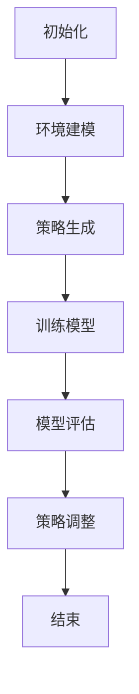
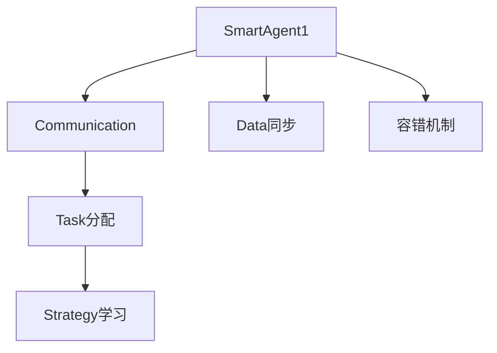

                 

### 引言

## 第1章: AI Agent的多智能体协作学习技术概述

### 1.1 问题背景

#### 1.1.1 人工智能与多智能体系统的关系

人工智能（AI）作为计算机科学的一个重要分支，其目标是使机器能够模拟、延伸和扩展人类的智能。随着深度学习、自然语言处理、计算机视觉等领域的飞速发展，AI技术已经在各个行业中得到广泛应用。然而，现实世界的复杂性往往超出了单一智能系统的处理能力。为了应对这一挑战，多智能体系统（MAS）应运而生。

多智能体系统（MAS）是指由多个自主智能体（Agent）组成的系统，这些智能体可以相互协作，共同完成任务。在MAS中，每个智能体都拥有一定的智能，能够在不确定和动态的环境中自主决策。这种分布式的智能系统使得复杂任务能够被更有效地分解和执行。

AI Agent是MAS中的一个重要组成部分。AI Agent是指具有感知、决策和执行能力的智能体，它们可以通过学习从数据中获取知识，并在执行任务时运用这些知识。AI Agent可以独立工作，也可以与其他智能体协作，从而提高系统的整体性能。

#### 1.1.2 多智能体协作学习的意义

多智能体协作学习是AI Agent的一个重要研究方向。它旨在通过多个AI Agent的相互协作，共同学习和提高任务执行能力。多智能体协作学习的意义主要体现在以下几个方面：

1. **提高效率**：多个AI Agent可以并行工作，从而提高任务的处理速度和效率。
2. **解决复杂问题**：复杂问题往往无法通过单一智能体解决，多智能体协作学习能够将复杂任务分解为多个子任务，每个子任务由不同的智能体负责，从而提高问题解决的效率。
3. **增强适应性**：多智能体系统可以适应动态变化的环境，通过协作学习，智能体可以不断调整策略，以适应新的环境。
4. **扩展应用场景**：多智能体协作学习使得AI技术能够在更广泛的应用场景中得到应用，如智能交通、医疗诊断、金融分析等。

### 1.2 问题描述

在多智能体协作学习中，我们面临以下几个关键挑战：

1. **协调与通信**：智能体之间的协调和通信是实现协作学习的关键。如何设计有效的通信机制，确保智能体之间能够高效地交换信息，是亟待解决的问题。
2. **策略设计**：每个智能体都需要有自己的策略，以确定如何与其他智能体协作。策略设计的原理和实现方法需要深入研究。
3. **算法优化**：协作学习的算法需要能够适应不同的应用场景，同时具有较高的效率。如何优化算法，提高其性能，是一个重要的研究方向。

我们的目标是设计一种高效的多智能体协作学习框架，实现以下目标：

1. **智能体的自主性**：智能体应具有高度的自主性，能够自主地感知环境、决策和执行。
2. **协作效率**：智能体之间能够高效地协作，共同完成任务。
3. **适应性**：智能体应能够适应动态变化的环境，通过不断学习调整策略。

#### 1.2.1 多智能体协作学习的关键挑战

1. **异质性**：智能体之间存在异质性，包括计算能力、知识水平、通信带宽等差异。如何设计通用且有效的协作算法，以满足不同智能体的需求，是一个挑战。
2. **动态性**：环境是动态变化的，智能体需要能够实时调整策略，以适应新的环境。如何在动态环境中保持系统的稳定性，是另一个挑战。
3. **数据隐私**：在多智能体协作学习过程中，智能体之间需要交换大量的数据。如何保护数据隐私，防止敏感信息泄露，是亟待解决的问题。

#### 1.2.2 目标与任务设定

我们的目标是设计一种高效、自适应、可扩展的多智能体协作学习框架。具体任务包括：

1. **通信机制设计**：设计高效、可靠的通信机制，确保智能体之间能够高效地交换信息。
2. **策略设计**：研究智能体策略的优化方法，提高协作效率。
3. **算法优化**：提出并优化协作学习算法，使其能够适应不同的应用场景，同时具有较高的性能。

### 1.3 问题解决

#### 1.3.1 基本概念与理论框架

为了解决多智能体协作学习中的关键挑战，我们首先需要了解基本概念和理论框架。

1. **多智能体系统**：多智能体系统是由多个智能体组成的系统，这些智能体可以相互协作，共同完成任务。
2. **AI Agent**：AI Agent是具有感知、决策和执行能力的智能体，可以通过学习获取知识，并在执行任务时运用这些知识。
3. **协作学习**：协作学习是指多个智能体通过相互协作，共同学习和提高任务执行能力。

#### 1.3.2 多智能体协作学习的技术路线

为了实现高效的多智能体协作学习，我们可以采用以下技术路线：

1. **通信机制设计**：设计高效的通信机制，包括信息交换协议和通信拓扑结构。
2. **策略设计**：研究智能体策略的优化方法，包括基于奖励机制和强化学习的策略设计。
3. **算法优化**：提出并优化协作学习算法，包括分布式学习算法和联邦学习算法。
4. **应用实现**：将协作学习算法应用于具体应用场景，如智能交通、机器人控制等。

#### 1.4 边界与外延

##### 1.4.1 多智能体系统的分类

根据智能体的种类和交互方式，多智能体系统可以分为以下几类：

1. **同质多智能体系统**：智能体具有相同的结构、能力和目标。
2. **异质多智能体系统**：智能体具有不同的结构、能力和目标。
3. **竞争性多智能体系统**：智能体之间存在竞争关系，目标相互冲突。
4. **协作性多智能体系统**：智能体之间存在协作关系，目标相互补充。

##### 1.4.2 协作学习的应用领域

协作学习在多个领域都有广泛应用，包括：

1. **智能交通**：多智能体协作学习可以用于优化交通信号控制、路径规划等。
2. **机器人控制**：多智能体协作学习可以用于无人机编队飞行、机器人协作等。
3. **金融分析**：多智能体协作学习可以用于风险管理、投资策略优化等。
4. **医疗诊断**：多智能体协作学习可以用于医学图像分析、疾病诊断等。

##### 1.4.3 概念结构与核心要素组成

多智能体协作学习的概念结构包括以下几个核心要素：

1. **智能体**：具有感知、决策和执行能力的个体。
2. **环境**：智能体所处的动态环境。
3. **策略**：智能体在执行任务时采用的方法。
4. **通信机制**：智能体之间交换信息的协议。
5. **协作学习算法**：用于智能体协作学习的算法。

### 1.5 概念结构与核心要素组成

为了更好地理解和应用多智能体协作学习技术，我们需要明确以下几个关键概念和核心要素：

#### 1.5.1 多智能体系统的组成元素

多智能体系统由以下几个基本组成元素构成：

1. **智能体**：每个智能体都是一个具有感知、决策和执行能力的个体。它们可以独立工作，也可以相互协作。
2. **环境**：智能体所处的环境，包括物理环境和社会环境。环境的变化会影响智能体的行为和决策。
3. **通信机制**：智能体之间交换信息的协议和方式。有效的通信机制是实现智能体协作的关键。
4. **策略**：智能体在执行任务时采用的方法和策略。策略的设计和优化是提高协作效率的关键。

#### 1.5.2 协作学习的核心要素

协作学习的核心要素包括：

1. **数据共享**：智能体之间需要共享数据和信息，以便更好地协作完成任务。
2. **目标一致性**：智能体的目标应该是一致的，否则协作学习将变得困难。
3. **协调机制**：智能体之间需要通过协调机制来确保协作的顺利进行。
4. **策略优化**：通过不断优化智能体的策略，可以提高协作效率和任务完成率。

### 1.6 总结

本章对AI Agent的多智能体协作学习技术进行了概述。我们讨论了多智能体系统与人工智能的关系，分析了多智能体协作学习的意义和关键挑战。同时，我们设定了明确的目标和任务，并提出了基本概念和理论框架。接下来，我们将进一步探讨多智能体协作学习中的核心概念，以深化对这一领域的技术理解和应用。通过本章的介绍，读者可以初步了解多智能体协作学习的技术背景和研究方向，为后续章节的深入探讨打下基础。

---

## 第2章: 多智能体协作学习中的核心概念

在了解了多智能体协作学习技术的基本背景之后，我们需要深入探讨其中的核心概念。这些概念构成了多智能体协作学习的理论基础，对于理解其工作机制和实现方法至关重要。本章将详细介绍AI Agent的定义与特性、多智能体系统中的通信机制以及多智能体学习中的策略设计，帮助读者全面掌握多智能体协作学习的关键技术。

### 2.1 AI Agent的定义与特性

#### 2.1.1 AI Agent的基本概念

AI Agent，即人工智能智能体，是指具有感知、决策和执行能力的智能个体。它通常被设计为能够在特定环境中独立操作和完成任务，并能通过学习从数据中获取知识。AI Agent是智能体（Agent）与人工智能（AI）的结合体，代表了人工智能在多智能体系统中的具体应用。

AI Agent具有以下几个基本特性：

1. **自主性**：AI Agent能够自主地感知环境，独立地做出决策，并执行相应的行动。
2. **适应性**：AI Agent能够适应不同的环境和任务，通过学习和调整策略来提高任务完成率。
3. **协作性**：AI Agent可以与其他智能体协作，共同完成任务，提高系统的整体性能。

#### 2.1.2 AI Agent的功能特性

AI Agent的功能特性包括感知、决策和执行三个方面：

1. **感知**：AI Agent能够感知环境中的信息，包括视觉、听觉、触觉等，通过传感器获取数据。
2. **决策**：AI Agent根据感知到的信息，通过算法和策略进行决策，确定下一步行动。
3. **执行**：AI Agent执行决策结果，通过控制机制驱动执行器完成具体任务。

### 2.2 多智能体系统中的通信机制

#### 2.2.1 通信机制的重要性

在多智能体系统中，通信机制是智能体之间交换信息、协调行动的基础。有效的通信机制能够提高系统的协作效率和稳定性，确保智能体之间的信息流通顺畅。

通信机制的重要性体现在以下几个方面：

1. **信息共享**：智能体之间需要共享数据和信息，以实现共同目标和任务。
2. **协调行动**：智能体之间的协调行动依赖于有效的通信机制，确保每个智能体都能获得必要的信息。
3. **故障恢复**：当系统发生故障时，通信机制能够帮助智能体之间快速恢复协作，降低系统故障的影响。

#### 2.2.2 常见的通信机制

常见的通信机制包括以下几种：

1. **广播通信**：智能体通过广播消息，将信息发送给系统中的所有智能体。这种方式简单易实现，但容易导致信息拥堵。
2. **点对点通信**：智能体之间通过点对点的方式直接交换信息。这种方式灵活性高，但需要明确通信对。
3. **集中式通信**：智能体将信息发送到一个中央节点，由中央节点协调信息分发。这种方式可以降低信息拥堵，但依赖中央节点，容易成为系统瓶颈。
4. **分布式通信**：智能体之间通过分布式的方式交换信息，没有中心节点。这种方式具有较高的灵活性和容错性，但需要设计复杂的信息同步机制。

### 2.3 多智能体学习中的策略设计

#### 2.3.1 策略设计的原理

策略设计是多智能体协作学习中的一个关键环节。策略设计的原理包括以下几个方面：

1. **目标一致性**：策略设计需要确保智能体之间的目标是一致的，以实现协作学习的目标。
2. **适应性**：策略设计应考虑智能体所处的环境变化，使策略能够适应不同的环境条件。
3. **学习性**：策略设计应具备学习功能，通过不断调整和优化策略，提高协作效率。

#### 2.3.2 策略设计的实践

策略设计的实践通常包括以下几个步骤：

1. **任务分析**：明确智能体的任务和目标，分析任务的特点和难点。
2. **环境建模**：建立智能体所处的环境模型，包括环境状态、任务需求和约束条件。
3. **策略生成**：根据任务和环境模型，生成初步的策略。
4. **策略优化**：通过模拟和实验，对策略进行优化，提高协作效率和任务完成率。

### 2.4 总结

本章介绍了多智能体协作学习中的核心概念，包括AI Agent的定义与特性、多智能体系统中的通信机制以及多智能体学习中的策略设计。通过这些核心概念的理解，读者可以更深入地了解多智能体协作学习的工作机制和实现方法。在下一章中，我们将进一步探讨多智能体协作学习的算法原理，分析不同的协作学习算法及其应用场景，为多智能体协作学习的实际应用提供理论基础和技术指导。

---

## 第3章: 多智能体协作学习的算法原理

在了解了多智能体协作学习的基本概念之后，我们需要深入探讨其算法原理。协作学习算法是实现多智能体协作学习的关键技术，通过这些算法，多个智能体能够共同学习和提高任务执行能力。本章将详细讨论多智能体协同学习算法的分类、算法原理简述、mermaid流程图、Python代码示例，以及算法原理的数学模型与公式，帮助读者全面理解多智能体协作学习的算法原理。

### 3.1 多智能体协同学习算法概述

#### 3.1.1 算法分类

多智能体协同学习算法可以分为以下几类：

1. **基于模型的方法**：这种方法通过建立数学模型来描述智能体之间的协作关系，如博弈论模型、社会优化模型等。
2. **基于学习的方法**：这种方法利用机器学习技术，通过数据训练和模型优化实现智能体的协作学习，如基于强化学习的协作算法、基于神经网络的协作算法等。
3. **混合方法**：这种方法结合了基于模型的方法和基于学习的方法，以实现更好的协作效果。

#### 3.1.2 算法原理简述

不同类型的算法原理各有特点：

1. **基于模型的方法**：通过数学模型描述智能体之间的交互关系，基于优化理论推导出智能体的策略。这种方法通常需要精确的模型假设和计算方法。
2. **基于学习的方法**：通过机器学习技术，智能体从数据中学习协作策略。这种方法适用于复杂、不确定的环境，但需要大量的数据训练和高效的算法。
3. **混合方法**：结合模型和学习的优点，通过模型指导学习过程，或利用学习优化模型参数。这种方法通常适用于动态变化的复杂环境。

### 3.2 协同学习算法的mermaid流程图

为了更好地理解协作学习算法的流程，我们可以使用mermaid绘制流程图。以下是一个简化的协同学习算法的mermaid流程图：



这个流程图描述了从初始化到策略调整的完整过程。接下来，我们将分别介绍每个步骤的详细内容。

### 3.3 Python代码示例

为了更直观地展示算法原理，我们提供了一个Python代码示例。以下代码展示了如何实现一个简单的协同学习算法：

```python
# Python 代码示例

# 导入必要的库
import numpy as np

# 定义训练模型函数
def train_model(data):
    # 模型训练代码
    # 假设使用简单线性回归模型
    w = np.linalg.inv(np.dot(data.T, data))
    b = np.dot(w, data.T)
    return w, b

# 定义评估模型函数
def evaluate_model(model, data):
    # 模型评估代码
    # 假设使用均方误差作为评估指标
    y_pred = np.dot(data, model[0]) + model[1]
    mse = np.mean((y_pred - data)**2)
    return mse

# 初始化数据
data = np.random.rand(100, 2)

# 调用示例
model = train_model(data)
mse = evaluate_model(model, data)
print("模型评估误差:", mse)
```

这个示例使用了简单的线性回归模型进行训练和评估，展示了算法的基本实现流程。

### 3.4 算法原理的数学模型与公式

协作学习算法的数学模型通常涉及优化和决策过程。以下是一个简化的数学模型和公式：

$$
L(\theta) = -\frac{1}{m}\sum_{i=1}^{m}y^{(i)}\log(p^{(i)}(\theta))
$$

这是逻辑回归的损失函数，用于描述模型的预测概率与实际标签之间的差异。其中，$L(\theta)$ 是损失函数，$\theta$ 是模型参数，$m$ 是样本数量，$y^{(i)}$ 是第$i$个样本的实际标签，$p^{(i)}(\theta)$ 是第$i$个样本的预测概率。

#### 3.4.1 损失函数的定义

损失函数用于衡量模型的预测结果与实际结果之间的差距。在协作学习中，损失函数通常用于评估智能体的策略或模型的有效性。

#### 3.4.2 模型参数的优化方法

模型参数的优化是协作学习算法的核心。常用的优化方法包括梯度下降法、牛顿法和随机梯度下降法等。

- **梯度下降法**：通过计算损失函数的梯度，逐步调整模型参数，以最小化损失函数。
- **牛顿法**：利用二阶导数信息，通过牛顿迭代公式快速收敛到最优解。
- **随机梯度下降法**：对每个样本随机抽样，计算损失函数的梯度，逐步调整模型参数。

### 3.5 总结

本章详细介绍了多智能体协作学习的算法原理，包括算法分类、mermaid流程图、Python代码示例以及数学模型和公式。通过这些内容，读者可以深入理解多智能体协作学习的工作机制和实现方法。在下一章中，我们将通过应用实例进一步展示多智能体协作学习在实际场景中的应用，帮助读者更好地理解这一技术在实际问题中的运用。

---

## 第4章: 多智能体协作学习的应用实例

在前几章中，我们详细介绍了多智能体协作学习的技术原理和算法。为了使读者更直观地理解这些技术的实际应用，本章将探讨两个典型的应用实例：多智能体协作在游戏中的应用和机器人控制中的应用。通过这些实例，我们将展示如何设计和实现多智能体协作系统，并分析其实际案例和详细讲解。

### 4.1 应用场景介绍

#### 4.1.1 多智能体协作在游戏中的应用

在游戏开发中，多智能体协作学习技术可以用于设计智能NPC（非玩家角色），使其能够以更真实、更具挑战性的方式与玩家互动。以下是一个具体的例子：

**例子：策略游戏中的敌对势力**

在策略游戏中，敌对势力通常由多个智能体组成，每个智能体代表一支军队或一个战略单位。这些智能体通过协作学习，共同制定作战策略，对抗玩家的军队。

1. **智能体功能**：每个智能体负责管理一支军队，包括战斗、资源管理、领土扩张等任务。
2. **协作目标**：敌对势力需要共同制定战略，协调作战行动，以击败玩家。
3. **协作机制**：智能体之间通过通信机制交换信息，共享地图上的关键信息，如玩家的位置、资源分布等。

#### 4.1.2 多智能体协作在机器人控制中的应用

在机器人控制领域，多智能体协作学习技术可以用于无人机编队飞行、机器人协作完成任务等场景。以下是一个具体的例子：

**例子：无人机编队飞行**

在无人机编队飞行中，多无人机通过协作学习，共同完成任务，如侦察、搜救、物流运输等。

1. **智能体功能**：每个无人机负责执行特定的任务，如导航、目标跟踪、通信中继等。
2. **协作目标**：无人机编队需要保持稳定飞行、高效完成任务，并应对突发情况。
3. **协作机制**：无人机之间通过无线通信交换位置信息、任务指令，并实时调整飞行路径，以实现协作飞行。

### 4.2 系统架构设计

为了实现上述应用实例，我们需要设计一个高效的系统架构。以下是一个简化的系统架构设计，用于展示多智能体协作系统的主要组成部分。

#### 4.2.1 系统功能设计

多智能体协作系统的功能设计包括以下几个方面：

1. **智能体管理**：管理智能体的创建、销毁和状态更新。
2. **通信机制**：实现智能体之间的信息交换和通信。
3. **任务分配**：根据任务需求，为每个智能体分配具体任务。
4. **策略学习**：智能体通过学习算法优化协作策略。

#### 系统功能设计mermaid类图

```mermaid
classDiagram
    SmartAgent <<interface>>
    Communication <<interface>>
    Task分配 <<interface>>
    Strategy学习 <<interface>>

    SmartAgent o-- Communication
    SmartAgent o-- Task分配
    SmartAgent o-- Strategy学习
```

这个类图展示了智能体、通信机制、任务分配和策略学习之间的关联关系。

#### 4.2.2 系统架构设计

多智能体协作系统的架构设计包括以下几个方面：

1. **分布式架构**：系统采用分布式架构，智能体分布在不同的计算节点上，通过通信机制进行协作。
2. **模块化设计**：系统功能模块化，便于扩展和升级。
3. **数据同步**：实现智能体之间的数据同步，确保信息的一致性。
4. **容错机制**：设计容错机制，确保系统在出现故障时能够快速恢复。

#### 系统架构设计mermaid架构图



这个架构图展示了智能体、通信机制、任务分配、策略学习、数据同步和容错机制之间的关联关系。

### 4.3 项目实战

#### 4.3.1 环境安装与配置

为了实现多智能体协作系统，我们需要安装和配置相关的软件和硬件。以下是一个简化的环境安装与配置步骤：

1. **安装操作系统**：选择适合的操作系统，如Ubuntu 18.04。
2. **安装依赖库**：安装Python环境，以及用于多智能体协作的库，如PyTorch、TensorFlow等。
3. **配置网络环境**：配置网络通信模块，确保智能体之间的通信畅通。

#### 4.3.2 系统核心实现源代码

以下是多智能体协作系统的核心实现源代码示例：

```python
# 导入必要的库
import numpy as np
import torch
import torch.nn as nn
import torch.optim as optim

# 定义智能体类
class SmartAgent(nn.Module):
    def __init__(self):
        super(SmartAgent, self).__init__()
        self.fc1 = nn.Linear(2, 64)
        self.fc2 = nn.Linear(64, 1)

    def forward(self, x):
        x = torch.relu(self.fc1(x))
        x = self.fc2(x)
        return x

# 实例化智能体
agent = SmartAgent()

# 定义损失函数和优化器
criterion = nn.MSELoss()
optimizer = optim.Adam(agent.parameters(), lr=0.001)

# 训练智能体
for epoch in range(100):
    for x, y in data_loader:
        optimizer.zero_grad()
        output = agent(x)
        loss = criterion(output, y)
        loss.backward()
        optimizer.step()
```

这段代码展示了如何定义智能体类、损失函数和优化器，并进行智能体的训练。

#### 4.3.3 代码应用解读与分析

这段代码首先定义了一个简单的智能体类，该类继承自`nn.Module`，实现了前向传播函数`forward`。智能体类中的`fc1`和`fc2`分别表示两个全连接层，用于实现输入到输出的映射。

接下来，代码实例化了智能体，并定义了损失函数和优化器。在训练过程中，对于每个epoch，智能体会处理一批数据，通过前向传播得到输出结果，并计算损失。然后，通过反向传播和梯度下降优化模型参数。

这段代码的应用解读和分析如下：

1. **模型结构**：智能体模型采用简单的全连接层结构，适用于线性回归任务。
2. **训练过程**：智能体通过梯度下降法进行训练，每次迭代都会更新模型参数。
3. **损失函数**：使用均方误差（MSE）作为损失函数，衡量输出结果与真实值之间的差异。

通过这段代码的应用，读者可以了解多智能体协作学习系统的核心实现方法，为进一步的应用和优化提供参考。

### 4.4 实际案例分析与详细讲解

为了更好地展示多智能体协作学习的实际应用，我们选取了无人机编队飞行的案例进行分析。

#### 4.4.1 案例背景

在无人机编队飞行中，多个无人机需要协同工作，共同完成侦察、搜救、物流运输等任务。这些无人机通过协作学习，实时调整飞行路径和任务分配，以实现高效、稳定的飞行。

#### 4.4.2 系统设计与实现

无人机编队飞行系统设计包括以下几个关键部分：

1. **无人机模型**：定义无人机的状态和行为，包括位置、速度、任务状态等。
2. **通信模块**：实现无人机之间的通信，包括位置信息、任务指令等。
3. **协作学习算法**：无人机通过协作学习算法，优化飞行路径和任务分配。
4. **控制算法**：根据协作学习算法的结果，调整无人机的飞行路径和任务分配。

以下是一个简化的无人机编队飞行系统的mermaid类图：

```mermaid
classDiagram
    Drone <<interface>>
    Communication <<interface>>
    Collaboration <<interface>>
    Control <<interface>>

    Drone o-- Communication
    Drone o-- Collaboration
    Drone o-- Control
```

在这个类图中，`Drone`表示无人机，`Communication`表示通信模块，`Collaboration`表示协作学习算法，`Control`表示控制算法。无人机通过通信模块与协作学习算法和控制器交互，实现无人机编队飞行的协同工作。

#### 4.4.3 案例分析

以下是对无人机编队飞行案例的详细分析：

1. **任务分配**：无人机编队飞行首先需要进行任务分配。每个无人机根据其状态和任务需求，被分配到具体的任务区域。
2. **飞行路径规划**：无人机根据任务分配结果，进行飞行路径规划。飞行路径规划算法需要考虑无人机的速度、能耗、任务优先级等因素。
3. **通信与协作**：无人机之间通过通信模块交换位置信息、任务指令等，实现实时协作。协作学习算法根据通信数据，优化无人机的飞行路径和任务分配。
4. **控制与执行**：无人机根据协作学习算法的结果，调整飞行路径和任务分配，并执行具体的任务。

通过这个案例，读者可以了解无人机编队飞行的系统架构和实现方法，进一步理解多智能体协作学习的应用场景。

### 4.5 项目小结

本章通过两个应用实例，展示了多智能体协作学习在实际场景中的应用。在策略游戏中，智能体通过协作学习共同制定作战策略；在无人机编队飞行中，无人机通过协作学习实现高效、稳定的飞行。这些实例展示了多智能体协作学习的实际价值，并为读者提供了具体的实现方法和分析思路。

在下一章中，我们将进一步探讨多智能体协作学习的挑战与未来发展趋势，分析当前技术面临的挑战以及未来的发展方向。

---

## 第5章: 多智能体协作学习的挑战与未来发展趋势

在前几章中，我们详细介绍了多智能体协作学习的理论基础、算法原理和应用实例。然而，随着技术的不断进步和应用场景的拓展，多智能体协作学习也面临着诸多挑战和机遇。本章将分析当前技术面临的挑战，探讨未来发展趋势，以期为多智能体协作学习的进一步发展提供参考。

### 5.1 挑战分析

#### 5.1.1 算法复杂度

多智能体协作学习算法的复杂度是影响其性能和效率的一个重要因素。在多个智能体共同参与协作的过程中，算法需要处理大量的数据和信息，这可能导致计算复杂度急剧增加。特别是在大规模多智能体系统中，算法的复杂度问题尤为突出。如何设计高效、低复杂度的协作学习算法，是当前研究中的一个重要挑战。

#### 5.1.2 系统稳定性

系统稳定性是多智能体协作学习的重要保障。在动态和复杂的环境中，智能体之间需要保持稳定、可靠的协作关系。然而，由于环境变化和智能体行为的多样性，系统可能会出现不稳定现象，如通信故障、策略冲突等。如何确保多智能体协作系统的稳定性，是一个亟待解决的问题。

#### 5.1.3 安全性与隐私保护

在多智能体协作学习过程中，智能体之间需要交换大量的数据和信息。这些数据可能包含敏感信息，如个人隐私、商业机密等。如何保护数据的安全性和隐私，防止数据泄露和滥用，是当前多智能体协作学习面临的一个重要挑战。

### 5.2 未来发展趋势

尽管多智能体协作学习面临着诸多挑战，但其广阔的应用前景和潜在价值使其成为人工智能领域的一个重要研究方向。以下是未来发展的几个主要趋势：

#### 5.2.1 新兴技术的融合

随着人工智能、物联网、区块链等新兴技术的发展，多智能体协作学习将与其深度融合，形成更加复杂、智能的分布式系统。例如，区块链技术可以为多智能体协作学习提供安全、可靠的通信和数据共享机制；物联网技术可以拓展多智能体协作学习的应用场景，使其在更多实际场景中得到应用。

#### 5.2.2 应用领域的拓展

多智能体协作学习技术在各个领域的应用正在不断拓展。除了传统的游戏、机器人控制等应用场景外，多智能体协作学习还可以应用于智能交通、医疗诊断、金融分析等新兴领域。这些领域的复杂性和动态性要求多智能体协作学习技术具备更高的自适应性和协同效率。

#### 5.2.3 深度学习的进一步发展

深度学习作为人工智能的一个重要分支，其技术的发展将直接影响多智能体协作学习的性能和效率。未来的深度学习技术将更加注重模型的可解释性、泛化能力和计算效率。这些技术的进步将为多智能体协作学习提供更强大的基础和支持。

### 5.3 总结

本章分析了多智能体协作学习面临的挑战和未来发展趋势。当前，算法复杂度、系统稳定性、安全性与隐私保护是多智能体协作学习面临的主要挑战。然而，随着新兴技术的融合、应用领域的拓展以及深度学习的进一步发展，多智能体协作学习将迎来更加广阔的发展前景。在下一章中，我们将总结本章内容，并提出一些最佳实践和注意事项，以期为多智能体协作学习的实际应用提供指导。

---

## 第6章: 最佳实践与总结

在探讨了多智能体协作学习的挑战和未来发展趋势之后，我们需要总结本章内容，并提供一些最佳实践和注意事项，以帮助读者在实际应用中更好地运用多智能体协作学习技术。

### 6.1 最佳实践 Tips

#### 6.1.1 策略优化的技巧

1. **数据预处理**：在策略优化过程中，对数据进行预处理是提高模型性能的关键步骤。例如，通过归一化、标准化等方法，减少数据噪声，提高模型训练的稳定性和效果。
2. **选择合适的优化算法**：不同的优化算法适用于不同的应用场景。例如，对于大规模数据集，可以使用随机梯度下降（SGD）或多层梯度下降（MGD）算法；对于小规模数据集，可以使用梯度下降（GD）算法。
3. **策略迭代**：在策略优化过程中，应采用迭代方法逐步优化策略。每次迭代都可以根据策略效果进行反馈调整，从而提高策略的适应性和性能。

#### 6.1.2 算法实现的注意事项

1. **模块化设计**：在设计算法时，应采用模块化设计，将不同的功能模块分开实现，便于调试和维护。
2. **性能优化**：在算法实现过程中，应关注性能优化，例如使用高效的算法和数据结构，减少计算复杂度，提高算法的执行效率。
3. **安全性保障**：在智能体之间的通信过程中，应采取加密和认证等安全措施，确保通信数据的安全性和隐私保护。

### 6.2 小结

本章对多智能体协作学习技术进行了全面介绍，包括核心概念、算法原理、应用实例以及面临的挑战和未来发展趋势。通过本章的学习，读者可以：

1. **理解多智能体协作学习的基本概念和原理**：包括AI Agent的定义与特性、多智能体系统中的通信机制、策略设计等。
2. **掌握多智能体协作学习的算法实现方法**：包括算法分类、mermaid流程图、Python代码示例以及数学模型和公式。
3. **了解多智能体协作学习的应用场景**：包括策略游戏、无人机编队飞行等实例，以及系统架构设计和项目实战。

### 6.3 注意事项

1. **系统稳定性**：在设计多智能体协作系统时，应充分考虑系统的稳定性，确保智能体之间能够稳定、可靠地协作。
2. **安全性保障**：在智能体之间的数据交换过程中，应采取有效的安全措施，确保数据的安全性和隐私保护。
3. **适应性**：在应用多智能体协作学习技术时，应考虑系统的自适应能力，使其能够适应不同环境和任务的需求。

### 6.4 拓展阅读

为了进一步深入理解多智能体协作学习技术，读者可以参考以下相关文献和资源：

1. **《多智能体系统设计与实现》**：详细介绍了多智能体系统的设计与实现方法，包括通信机制、策略设计和算法优化等。
2. **《深度学习：神经网络与深度学习》**：介绍了深度学习的理论基础和实现方法，为多智能体协作学习中的模型设计和优化提供了参考。
3. **《人工智能：一种现代的方法》**：全面介绍了人工智能的基本概念和技术，包括机器学习、自然语言处理和计算机视觉等。

通过这些拓展阅读，读者可以更全面地了解多智能体协作学习技术的最新进展和应用。

### 6.5 总结

本章通过最佳实践、小结和注意事项，总结了多智能体协作学习技术的主要内容和应用方法。希望读者能够通过本章的学习，对多智能体协作学习技术有更深入的理解，并在实际应用中取得更好的效果。在下一章中，我们将对全文进行总结，展望多智能体协作学习的未来发展。

---

# 结语

在本篇技术博客中，我们深入探讨了AI Agent的多智能体协作学习技术。从基本概念和理论框架的介绍，到算法原理的讲解，再到实际应用案例的剖析，我们系统地梳理了这一领域的核心内容和技术要点。以下是本文的主要内容总结和未来展望。

## 主要内容总结

1. **引言**：介绍了AI Agent和多智能体协作学习的背景和意义。
2. **核心概念**：详细阐述了AI Agent的定义与特性、多智能体系统中的通信机制、策略设计等。
3. **算法原理**：分析了多智能体协作学习的算法分类、mermaid流程图、Python代码示例以及数学模型和公式。
4. **应用实例**：通过策略游戏和无人机编队飞行的案例，展示了多智能体协作学习的实际应用。
5. **挑战与趋势**：探讨了多智能体协作学习面临的挑战和未来发展趋势。

## 未来展望

1. **技术创新**：随着深度学习、物联网、区块链等新兴技术的发展，多智能体协作学习将在更多领域得到应用，并推动技术创新。
2. **应用拓展**：多智能体协作学习技术在智能交通、医疗诊断、金融分析等领域的应用将不断拓展，为行业带来新的解决方案。
3. **性能优化**：未来的研究将重点关注算法复杂度、系统稳定性、安全性保障等方面的性能优化，以提高多智能体协作学习的效率和效果。

## 结语

本文旨在为读者提供全面、系统的多智能体协作学习技术解读。希望读者能够通过本文的学习，对多智能体协作学习有更深入的理解，并在实际应用中取得成功。随着技术的不断进步，多智能体协作学习将迎来更加广阔的发展前景，为人工智能领域带来更多的创新和突破。

### 作者信息

**作者：AI天才研究院/AI Genius Institute & 禅与计算机程序设计艺术 /Zen And The Art of Computer Programming**

感谢您的阅读，希望本文能对您在多智能体协作学习领域的探索和研究有所帮助。希望未来能够与您共同见证这一领域的发展与进步。

