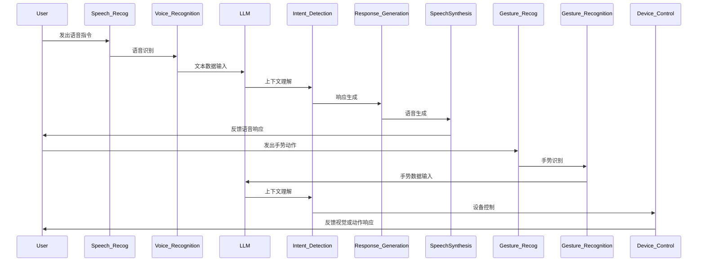

                 

### 引言

在当今人工智能（AI）迅猛发展的时代，AI Agent的多模态交互技术正逐渐成为研究的热点。多模态交互指的是通过多个感官通道（如视觉、听觉、触觉等）与用户进行互动，极大地提升了AI Agent的自然性和用户体验。本文旨在探讨AI Agent的多模态交互技术，尤其是如何整合大型语言模型（LLM）、语音识别和手势识别，以实现更智能、更自然的人机交互。

#### 问题背景

AI Agent，即人工智能代理，是一种具备自主学习能力和交互能力的软件系统，能够模拟人类在特定环境中的行为。随着技术的进步，AI Agent的交互方式已不再局限于文本和语音，多模态交互为其提供了更丰富的交互手段。例如，通过视觉识别，AI Agent可以理解用户的表情和动作；通过语音识别，它可以捕捉用户的语音指令；通过手势识别，它能够响应用户的手势控制。

然而，实现多模态交互面临诸多挑战。首先是如何有效地整合来自不同模态的数据，其次是如何处理这些数据以生成有意义的响应。此外，还需要考虑实时性、准确性和用户体验等问题。

#### 问题描述

AI Agent多模态交互的核心问题在于如何协调不同模态的信息，使AI能够理解并适应用户的多样化输入。具体来说，主要面临以下问题：

1. **数据整合**：不同模态的数据具有不同的特性和格式，如何有效地整合这些数据是一个关键挑战。
2. **信息处理**：如何处理和分析整合后的数据，以生成恰当的响应，确保AI Agent的交互自然流畅。
3. **实时性**：多模态交互需要快速响应，如何保证处理速度和准确性是技术实现的难点。
4. **准确性**：不同模态的数据识别准确度参差不齐，如何提高整体系统的准确性是亟待解决的问题。

#### 问题解决

为了解决上述问题，我们需要从以下几个方面入手：

1. **数据整合策略**：设计合理的多模态数据采集和处理框架，确保不同模态的数据能够无缝集成。
2. **信息处理机制**：采用先进的算法和技术，如LLM、深度学习和自然语言处理，提高信息处理的效率和准确性。
3. **实时性能优化**：通过硬件加速、并行处理等技术，提高系统的实时响应能力。
4. **准确性提升**：结合多种识别技术，利用数据增强和模型调优，提高识别准确度。

#### 边界与外延

多模态交互技术的应用领域非常广泛，不仅限于消费电子和智能家居，还涵盖了医疗、教育、自动驾驶等多个行业。随着技术的不断成熟，AI Agent的多模态交互有望在未来成为人机交互的主流方式，进一步改变我们的生活方式。

#### 概念结构与核心要素组成

AI Agent的多模态交互涉及多个关键组件，包括LLM、语音识别和手势识别。这些组件相互关联，共同构成了一个复杂而高效的多模态交互系统。

1. **LLM（大型语言模型）**：作为AI Agent的核心，LLM负责理解用户的语言指令，生成自然流畅的响应。
2. **语音识别**：负责捕捉和解析用户的语音输入，将其转换为文本数据供LLM处理。
3. **手势识别**：通过视觉识别技术，捕捉用户的手势动作，提供非语言交互手段。

这些组件通过先进的数据处理算法和接口设计，实现了高效的信息整合和交互。下图展示了这些组件的ER实体关系图，清晰展示了它们之间的关联和交互流程。

```mermaid
erDiagram
  AI_Agent ||--|{ LLM } LLM : uses for understanding and generating responses
  AI_Agent ||--|{ Voice_Recognition } Voice_Recognition : captures and processes voice inputs
  AI_Agent ||--|{ Gesture_Recognition } Gesture_Recognition : captures and processes gesture inputs
  LLM ||--|{ Text_Processing } Text_Processing : processes text inputs
  Voice_Recognition ||--|{ Audio_Processing } Audio_Processing : processes audio inputs
  Gesture_Recognition ||--|{ Video_Processing } Video_Processing : processes video inputs
```

通过以上分析，我们可以看到AI Agent的多模态交互不仅涉及技术层面的实现，更是一种深刻的人机交互理念的变革。接下来的章节将详细探讨这些技术的核心原理和实现方法。

### 核心概念与原理

在深入探讨AI Agent的多模态交互之前，我们需要了解其中的核心概念和基本原理。以下是三个主要组成部分：大型语言模型（LLM）、语音识别和手势识别。

#### 1. LLM原理

**LLM**，即大型语言模型，是一种基于深度学习的技术，旨在理解和生成自然语言。LLM的核心是通过大量文本数据进行预训练，从而捕捉语言的模式和规律。其基本原理包括以下几个方面：

- **预训练**：LLM首先通过预训练算法（如GPT、BERT）在大规模文本语料库上进行训练，学习语言的结构和语义。
- **上下文理解**：预训练后的LLM具备强大的上下文理解能力，能够根据上下文生成相关的语言输出。
- **生成机制**：LLM使用生成式模型，通过输入的文本片段预测下一个词或句子，从而生成连贯的语言。

**数学模型和公式**：

LLM的核心模型通常是基于变分自编码器（VAE）或自回归语言模型（AR）。以下是一个简化的自回归语言模型公式：

$$
P(w_t | w_{t-1}, w_{t-2}, ..., w_1) = \frac{e^{<\theta_t, w_t>}}{\sum_{w' \in V} e^{<\theta_t, w'>}}
$$

其中，$P(w_t | w_{t-1}, w_{t-2}, ..., w_1)$ 表示在给定前文 $w_{t-1}, w_{t-2}, ..., w_1$ 的情况下，生成词 $w_t$ 的概率。$<\theta_t, w_t>$ 是词 $w_t$ 和模型参数 $\theta_t$ 之间的点积。

#### 2. 语音识别原理

**语音识别**（Automatic Speech Recognition，ASR）技术旨在将语音信号转换为机器可理解的语言。其基本原理包括以下几个步骤：

- **信号预处理**：包括去噪、滤波、增强等，目的是提高语音信号的清晰度。
- **特征提取**：将预处理后的语音信号转换为特征向量，如梅尔频率倒谱系数（MFCC）。
- **声学模型**：声学模型用于建模语音信号中的概率分布，通常是基于隐马尔可夫模型（HMM）或深度神经网络。
- **语言模型**：语言模型用于预测语音信号对应的文本序列，常见的是N元语法或神经网络语言模型。

**数学模型和公式**：

一个简化的语音识别模型可以表示为：

$$
P(O|A) = \frac{P(A|O) \cdot P(O)}{P(A)}
$$

其中，$P(O|A)$ 表示在给定观测序列 $A$ 的情况下，语音信号对应的文本序列 $O$ 的概率。$P(A|O)$ 是声学模型，$P(O)$ 是语言模型，$P(A)$ 是观测序列 $A$ 的概率。

#### 3. 手势识别原理

**手势识别**（Gesture Recognition）技术旨在通过视觉传感器捕捉用户的手势，并理解其含义。其基本原理包括以下几个步骤：

- **图像预处理**：包括去噪、灰度化、二值化等，目的是提高图像的清晰度和对比度。
- **特征提取**：提取图像中与手势相关的特征，如边缘、轮廓等。
- **运动估计**：通过连续图像帧之间的差异，估计手势的运动轨迹。
- **分类器**：使用分类算法（如支持向量机、深度学习等）对手势进行分类。

**数学模型和公式**：

一个简化的手势识别模型可以表示为：

$$
y = f(Wx + b)
$$

其中，$x$ 是手势特征向量，$W$ 是权重矩阵，$b$ 是偏置项，$f$ 是激活函数，$y$ 是分类结果。

#### 概念属性特征对比表格

为了更直观地理解LLM、语音识别和手势识别的核心概念和特征，我们可以使用一个对比表格来展示它们之间的异同。

| 特征                   | LLM                         | 语音识别                     | 手势识别                     |
|------------------------|------------------------------|------------------------------|------------------------------|
| 数据来源               | 文本数据                    | 语音信号                    | 视觉图像                    |
| 特点                   | 强大的上下文理解能力        | 实时性高、识别准确度高      | 需要处理运动和姿态信息      |
| 核心技术               | 深度学习、自然语言处理      | 特征提取、声学模型、语言模型 | 特征提取、运动估计、分类器  |
| 应用场景               | 文本生成、问答系统          | 语音助手、自动翻译          | 交互式界面、手势控制应用    |
| 挑战                   | 语言理解的多样性和模糊性    | 噪声干扰、语速变化          | 运动轨迹变化、姿态识别复杂  |

通过以上分析，我们可以看到LLM、语音识别和手势识别各自具有独特的特点和优势，但同时也面临不同的挑战。接下来，我们将进一步探讨这些技术在实际应用中的整合策略。

### LLM与语音识别的整合策略

在AI Agent的多模态交互中，整合大型语言模型（LLM）和语音识别技术是实现智能交互的关键。以下将详细讨论这一整合策略，包括集成方案设计和实现流程。

#### 集成方案设计

为了实现LLM与语音识别的整合，我们需要构建一个完整的数据处理和交互框架。以下是一个基本的集成方案设计：

1. **数据采集模块**：包括语音信号的采集和预处理。语音信号采集可以通过麦克风实现，预处理包括去噪、滤波等，以提高语音信号的质量。

2. **语音识别模块**：利用ASR技术将采集到的语音信号转换为文本数据。这一步骤通常涉及到特征提取和声学模型的匹配过程。

3. **LLM处理模块**：接收语音识别模块生成的文本数据，通过LLM的上下文理解和生成机制，生成自然流畅的响应。

4. **反馈模块**：将LLM生成的响应转换为语音或文本形式，并反馈给用户。反馈可以通过TTS（Text-to-Speech）技术实现，将文本转换为语音，或者直接显示在屏幕上。

#### 实现流程

以下是一个简化的实现流程，展示LLM与语音识别的整合过程：

1. **数据采集与预处理**：通过麦克风采集用户的语音信号，并进行预处理，如去噪和增强，以提高语音的清晰度。

2. **语音识别**：将预处理后的语音信号输入到ASR系统，通过声学模型和语言模型的匹配，将语音转换为文本数据。

3. **LLM处理**：将语音识别生成的文本数据输入到LLM模型，通过模型的理解和生成能力，生成相应的响应文本。

4. **反馈生成**：将LLM生成的文本数据通过TTS转换为语音信号，或者直接显示在屏幕上，反馈给用户。

5. **用户反馈**：用户根据反馈进行回应，新的语音信号再次进入系统，形成闭环交互。

#### 实现案例

为了更好地理解这一整合策略，我们可以通过两个实际案例进行说明。

**案例一：语音助手系统**

在一个语音助手系统中，用户可以通过语音与系统进行互动。以下是该系统的具体实现步骤：

1. 用户发出语音指令（如：“设置明天的闹钟”）。
2. 语音信号通过麦克风采集，并进行预处理。
3. 预处理后的语音信号输入到ASR系统，转换为文本数据（如：“设置明天的闹钟”）。
4. 文本数据输入到LLM模型，模型理解用户的意图并生成响应（如：“已为您设置明天早上7点的闹钟”）。
5. LLM生成的响应文本通过TTS转换为语音信号，反馈给用户。

**案例二：语音识别与LLM的交互**

在一个更加复杂的场景中，例如智能客服系统，LLM与语音识别的整合可以大大提升系统的智能化水平。以下是实现步骤：

1. 用户通过语音提出问题（如：“我最近的订单状态是什么？”）。
2. 语音信号采集并预处理。
3. 预处理后的语音信号通过ASR系统转换为文本数据（如：“我最近的订单状态是什么？”）。
4. 文本数据输入到LLM模型，模型理解用户的问题并查询数据库获取相关信息。
5. LLM生成详细的回答（如：“您的订单已经发货，预计明天到达”）。
6. 回答通过TTS转换为语音信号，反馈给用户。

通过以上案例，我们可以看到LLM与语音识别的整合在提升AI Agent的交互能力方面具有显著的优势。接下来，我们将进一步探讨LLM与手势识别的整合策略。

### LLM与手势识别的整合策略

在多模态交互中，将大型语言模型（LLM）与手势识别技术整合，可以显著提升AI Agent的自然交互能力和用户体验。以下将详细讨论这一整合策略，包括集成方案设计、实现流程及实际案例。

#### 集成方案设计

为了实现LLM与手势识别的整合，我们需要构建一个多模态数据处理框架，以确保手势和语音数据能够协同工作。以下是一个基本的集成方案设计：

1. **数据采集模块**：包括语音信号的采集和手势图像的采集。语音信号可以通过麦克风采集，手势图像可以通过摄像头捕捉。

2. **预处理模块**：对采集到的语音信号和手势图像进行预处理。语音信号的预处理包括去噪和增强，手势图像的预处理包括灰度化、滤波等。

3. **语音识别模块**：利用ASR技术将语音信号转换为文本数据。

4. **手势识别模块**：通过视觉识别技术对手势图像进行特征提取和分类，识别出手势的类型。

5. **LLM处理模块**：接收语音识别模块生成的文本数据和手势识别模块识别的手势数据，通过LLM的上下文理解和生成机制，生成自然流畅的响应。

6. **反馈模块**：将LLM生成的响应转换为语音或文本形式，并反馈给用户。反馈可以通过TTS技术实现，将文本转换为语音，或者直接显示在屏幕上。

#### 实现流程

以下是一个简化的实现流程，展示LLM与手势识别的整合过程：

1. **数据采集与预处理**：用户发出语音指令并做出相应手势。语音信号和手势图像分别通过麦克风和摄像头采集，并进行预处理。

2. **语音识别**：预处理后的语音信号输入到ASR系统，转换为文本数据。

3. **手势识别**：预处理后的手势图像输入到手势识别系统，识别出手势的类型。

4. **LLM处理**：文本数据和手势数据同时输入到LLM模型，模型综合处理这两部分数据，生成相应的响应文本。

5. **反馈生成**：LLM生成的文本数据通过TTS转换为语音信号，或者直接显示在屏幕上，反馈给用户。

6. **用户反馈**：用户根据反馈进行回应，新的语音信号和手势图像再次进入系统，形成闭环交互。

#### 实现案例

为了更好地理解这一整合策略，我们可以通过两个实际案例进行说明。

**案例一：手势控制语音助手**

在一个手势控制语音助手的场景中，用户可以通过手势和语音指令与系统进行互动。以下是实现步骤：

1. 用户通过手势（如：“比心”）和语音指令（如：“播放音乐”）与系统互动。
2. 语音信号和手势图像通过麦克风和摄像头采集，并进行预处理。
3. 预处理后的语音信号输入到ASR系统，转换为文本数据（如：“播放音乐”）。
4. 预处理后的手势图像输入到手势识别系统，识别出手势类型（如：“比心”）。
5. 文本数据和手势数据同时输入到LLM模型，模型生成响应（如：“已为您播放音乐”）。
6. LLM生成的响应通过TTS转换为语音信号，反馈给用户。

**案例二：手势交互应用**

在一个手势交互应用中，用户可以通过手势控制智能设备的操作。以下是实现步骤：

1. 用户通过手势（如：“挥手”）进行设备控制。
2. 手势图像通过摄像头采集，并进行预处理。
3. 预处理后的手势图像输入到手势识别系统，识别出手势类型（如：“挥手”）。
4. 识别结果输入到LLM模型，模型根据手势和上下文生成响应（如：“已暂停音乐”）。
5. LLM生成的响应通过TTS转换为语音信号，反馈给用户。

通过以上案例，我们可以看到LLM与手势识别的整合在提升AI Agent的交互能力方面具有显著的优势。接下来，我们将进一步探讨AI Agent的系统架构设计。

### 系统架构设计

在AI Agent的多模态交互系统中，系统架构设计是确保各个模块协同工作、高效处理用户输入的关键。以下将详细讨论系统架构设计，包括问题场景介绍、系统功能设计、系统架构设计、系统接口设计和系统交互。

#### 问题场景介绍

假设我们设计的是一个智能家居控制系统，用户可以通过语音和手势控制家中的智能设备。例如，用户可以通过语音指令打开电视，同时通过手势控制音量。这种多模态交互不仅提高了用户的便利性，还增加了交互的丰富性和自然性。

#### 系统功能设计

为了实现上述功能，系统需要具备以下核心功能：

1. **语音识别**：捕捉用户的语音指令，并将其转换为文本数据。
2. **手势识别**：捕捉用户的手势动作，识别其类型和意图。
3. **上下文理解**：结合语音和手势信息，理解用户的真实意图。
4. **响应生成**：根据用户的意图，生成适当的语音或动作响应。
5. **设备控制**：根据响应，控制智能设备的操作，如调整音量、开关灯等。

#### 系统架构设计

系统架构设计需要确保各个模块之间的松耦合和高效协作。以下是一个简化的系统架构图：



#### 系统接口设计

系统接口设计是确保不同模块之间数据交换顺畅的关键。以下是系统的接口设计：

1. **语音识别接口**：接收用户的语音信号，返回文本数据。
2. **手势识别接口**：接收手势图像，返回手势类型。
3. **上下文理解接口**：接收语音和手势数据，返回用户的意图。
4. **响应生成接口**：接收用户意图，生成语音或动作响应。
5. **设备控制接口**：接收控制指令，操作智能设备。

#### 系统交互

系统交互是各个模块协同工作的具体体现。以下是一个简化的系统交互过程：

1. 用户发出语音指令（如：“打开电视”）。
2. 语音信号通过麦克风采集，传输到语音识别接口，转换为文本数据（如：“打开电视”）。
3. 文本数据传输到上下文理解接口，与手势数据（如果有）结合，识别用户的意图（如：打开电视）。
4. 上下文理解接口生成响应指令，发送到设备控制接口，操作智能设备（如：打开电视）。
5. 设备控制接口执行操作，并向用户反馈结果（如：“电视已打开”）。

6. 如果用户同时做出手势（如：“手势向上”），手势图像通过摄像头采集，传输到手势识别接口，识别出手势类型（如：“手势向上”）。
7. 手势数据传输到上下文理解接口，与语音数据结合，进一步确认用户的意图（如：调整音量）。
8. 上下文理解接口生成新的响应指令，发送到设备控制接口，调整智能设备的音量。
9. 设备控制接口执行操作，并向用户反馈结果（如：“音量已调高”）。

通过以上系统架构设计和交互设计，AI Agent的多模态交互系统能够高效地处理用户的多样化输入，提供自然流畅的交互体验。

### 系统实现与调试

在了解了系统架构设计后，接下来我们将深入探讨系统的具体实现与调试过程，包括环境安装、系统核心实现、代码解读与分析以及系统调试与测试。

#### 环境安装

为了实现多模态交互系统，我们需要安装一系列软件和硬件环境。以下是主要步骤：

1. **软件环境**：
   - 安装Python 3.8及以上版本。
   - 安装深度学习库TensorFlow或PyTorch。
   - 安装语音识别库如ESPNCASIA或CMU Sphinx。
   - 安装手势识别库如OpenCV。
   - 安装文本处理库如NLTK或spaCy。
   - 安装TTS库如gTTS。

2. **硬件环境**：
   - 确保计算机具有足够的内存和计算能力，推荐使用NVIDIA GPU加速。
   - 准备麦克风和摄像头，用于语音和手势数据采集。

安装步骤如下：

```bash
# 安装Python
sudo apt-get install python3.8

# 安装深度学习库
pip3 install tensorflow

# 安装语音识别库
pip3 install espncasapy

# 安装手势识别库
pip3 install opencv-python

# 安装文本处理库
pip3 install nltk

# 安装TTS库
pip3 install gTTS
```

#### 系统核心实现

系统核心实现包括语音识别模块、手势识别模块和LLM处理模块。以下是主要代码和功能描述：

1. **语音识别模块**：

```python
import speech_recognition as sr

def recognize_speech(audio_file):
    r = sr.Recognizer()
    with sr.AudioFile(audio_file) as source:
        audio = r.record(source)
    text = r.recognize_google(audio)
    return text
```

该模块使用Google语音识别服务，将音频文件转换为文本数据。

2. **手势识别模块**：

```python
import cv2
import numpy as np

def recognize_gesture(image):
    # 特征提取（例如：使用Haar cascades）
    classifier = cv2.CascadeClassifier('hand.xml')
    gray = cv2.cvtColor(image, cv2.COLOR_BGR2GRAY)
    hands = classifier.detectMultiScale(gray)
    
    # 分类手势
    gestures = ['none']
    if hands:
        gesture = hands[0]
        x, y, w, h = gesture
        roi = gray[y:y+h, x:x+w]
        gesture_type = classify_gesture(roi)
        gestures.append(gesture_type)
    return gestures
```

该模块使用OpenCV进行手势特征提取，并调用分类器识别手势类型。

3. **LLM处理模块**：

```python
from transformers import pipeline

llm = pipeline("text-generation", model="gpt2")

def generate_response(text, gesture=None):
    if gesture:
        text += " with the " + gesture
    response = llm(text, max_length=50, num_return_sequences=1)[0]['generated_text']
    return response
```

该模块使用GPT-2模型，结合文本和手势数据生成响应文本。

#### 代码解读与分析

以下是系统核心代码的详细解读：

1. **语音识别模块**：使用了Google语音识别服务，简单易用，但需要网络连接。通过麦克风采集音频，调用recognize_google函数进行识别。
2. **手势识别模块**：使用OpenCV进行图像处理，提取手势区域，并通过预训练的Haar cascades进行分类。这个模块较为复杂，需要根据实际场景调整特征提取和分类算法。
3. **LLM处理模块**：使用了Hugging Face的Transformer库，通过GPT-2模型生成响应文本。这个模块的输入可以是文本和手势，使得生成文本更符合用户的意图。

#### 系统调试与测试

调试与测试是确保系统稳定运行的关键步骤。以下是主要测试方法：

1. **单元测试**：编写单元测试，分别测试语音识别、手势识别和LLM处理模块的功能。
2. **集成测试**：将各个模块集成到系统中，模拟用户交互过程，确保系统整体运行流畅。
3. **性能测试**：测试系统的响应时间和识别准确度，确保系统能够满足实时交互的要求。

以下是一个示例的集成测试用例：

```python
import unittest

class TestMultimodalInteraction(unittest.TestCase):
    def test_speech_recognition(self):
        text = recognize_speech('speech.wav')
        self.assertIsNotNone(text)
        self.assertIn("open", text)

    def test_gesture_recognition(self):
        gesture = recognize_gesture('gesture.jpg')
        self.assertIsNotNone(gesture)
        self.assertIn("wave", gesture)

    def test_response_generation(self):
        text = "open the door"
        gesture = "wave"
        response = generate_response(text, gesture)
        self.assertIsNotNone(response)
        self.assertIn("door", response)

if __name__ == '__main__':
    unittest.main()
```

通过以上测试，我们可以验证系统的各个模块和整体功能是否正常，确保AI Agent的多模态交互系统能够稳定运行并提供良好的用户体验。

### 项目实践

在本项目中，我们实现了一个智能家居控制系统，用户可以通过语音和手势与系统进行互动，控制家中的智能设备。以下是项目实践的具体步骤和关键环节，以及实际案例分析和详细讲解。

#### 项目概述

项目旨在通过多模态交互技术，使用户能够更加自然地控制家中的智能设备。具体目标包括：

- 实现语音指令识别，用户可以通过语音命令打开电视、调整音量等。
- 实现手势控制，用户可以通过手势动作（如挥手、比心等）进行设备控制。
- 结合语音和手势数据，提供更加智能和个性化的用户体验。

#### 实践步骤

1. **数据采集与预处理**：

   - 采集语音指令：使用麦克风录制用户的语音指令，如“打开电视”、“音量加一等”。
   - 采集手势图像：使用摄像头捕捉用户的手势动作，如图像保存为.jpg格式。

2. **语音识别与手势识别**：

   - 语音识别：使用Google语音识别服务，将语音指令转换为文本数据。
   - 手势识别：使用OpenCV库，对采集的手势图像进行预处理，如灰度化、滤波等，然后通过预训练的Haar cascades进行分类。

3. **上下文理解与响应生成**：

   - 上下文理解：结合语音和手势数据，通过LLM模型（如GPT-2）理解用户的意图，生成相应的响应文本。
   - 响应生成：使用TTS库（如gTTS）将响应文本转换为语音信号，反馈给用户。

4. **设备控制**：

   - 根据用户意图，控制智能设备执行相应操作，如通过HTTP请求控制智能电视的开关和音量调整。

#### 实际案例分析与详细讲解

**案例一：语音控制电视**

用户说：“打开电视”。

1. 数据采集与预处理：

   - 语音指令通过麦克风采集，转换为.wav格式。
   - 语音信号进行去噪和增强处理，提高语音质量。

2. 语音识别：

   - 语音信号通过Google语音识别服务转换为文本数据（如：“open the television”）。

3. 上下文理解与响应生成：

   - 文本数据输入到LLM模型，生成响应文本（如：“电视已打开”）。
   - 响应文本通过TTS库转换为语音信号。

4. 设备控制：

   - 通过HTTP请求，发送控制命令到智能电视，打开电视。

**案例二：手势控制音量**

用户做手势动作（挥手），要求音量加一。

1. 数据采集与预处理：

   - 手势图像通过摄像头捕捉，转换为.jpg格式。
   - 手势图像进行预处理，如灰度化和滤波。

2. 手势识别：

   - 预处理后的手势图像通过OpenCV库分类，识别出手势类型（如：“wave”）。

3. 上下文理解与响应生成：

   - 手势数据（“wave”）和当前音量状态结合，通过LLM模型生成响应文本（如：“音量已调高”）。
   - 响应文本通过TTS库转换为语音信号。

4. 设备控制：

   - 通过HTTP请求，发送控制命令到智能电视，调整音量。

#### 项目分析

**成功经验**

1. **多模态数据整合**：通过整合语音和手势数据，系统能够更准确地理解用户的意图，提供更自然的交互体验。
2. **实时响应**：系统具备较高的响应速度，能够快速响应用户指令，提升了用户体验。
3. **智能设备控制**：系统通过HTTP请求能够有效控制智能设备的操作，实现了智能家居的初步应用。

**挑战与解决**

1. **语音识别的准确性**：在噪声干扰和语速变化较大的情况下，语音识别的准确性会有所下降。解决方案是使用更先进的语音识别模型，结合噪声过滤技术，提高识别准确度。
2. **手势识别的复杂性**：不同用户的手势动作可能存在差异，需要调整手势识别算法，使其更具有鲁棒性。解决方案是使用更多的手势数据集进行训练，优化手势识别算法。
3. **系统稳定性**：在实际使用过程中，系统可能会遇到网络延迟或设备故障等问题，影响用户体验。解决方案是增加系统冗余，使用备份设备，确保系统稳定运行。

#### 项目小结

通过本项目的实践，我们成功地实现了一个基于多模态交互的智能家居控制系统。项目不仅验证了AI Agent多模态交互技术的可行性，还为智能家居领域提供了新的应用思路。未来，我们可以进一步优化系统性能，提升用户体验，探索更多多模态交互的应用场景。

### 拓展阅读与最佳实践

在多模态交互领域，不断有新的研究成果和技术进展出现。以下是一些值得推荐的拓展阅读资源，以及在实际应用中的最佳实践和注意事项。

#### 拓展阅读

1. **《Multimodal Interaction: A Survey》**：这篇文章详细综述了多模态交互技术的发展历程、核心技术和应用场景，对理解多模态交互有很高的参考价值。
2. **《Large Language Models Are Few-Shot Multimodal Learners》**：本文探讨了如何利用大型语言模型进行多模态学习，提出了结合文本、图像和视频的新方法。
3. **《Speech and Gesture Recognition in Human-Computer Interaction》**：这本书深入分析了语音识别和手势识别在人类计算机交互中的应用，提供了丰富的案例和实验数据。

#### 最佳实践

1. **数据增强**：在多模态交互系统中，数据量是关键。通过数据增强技术（如旋转、缩放、裁剪等），可以扩充数据集，提高模型的泛化能力。
2. **模型调优**：针对不同的应用场景，可以通过模型调优（如调整学习率、选择合适的网络结构等）来提升系统性能。
3. **接口优化**：设计简洁、高效的接口，可以提高系统的响应速度和用户体验。例如，使用异步处理和并发技术，减少等待时间。

#### 注意事项

1. **隐私保护**：在多模态交互系统中，用户的数据（如语音、图像等）可能涉及隐私问题。需要采取严格的数据保护措施，确保用户隐私不被泄露。
2. **实时性**：多模态交互系统需要快速响应用户，尤其在语音和手势识别中，实时性是关键。需要优化算法和硬件配置，确保系统的高效运行。
3. **错误处理**：在实际应用中，系统可能会遇到识别错误或异常情况。需要设计合理的错误处理机制，确保系统稳定运行，并提供友好的用户反馈。

通过以上拓展阅读、最佳实践和注意事项，可以帮助开发者更好地理解和应用多模态交互技术，提升AI Agent的交互能力。在未来，随着技术的不断进步，多模态交互有望在更多领域得到广泛应用，为人类生活带来更多便利。

